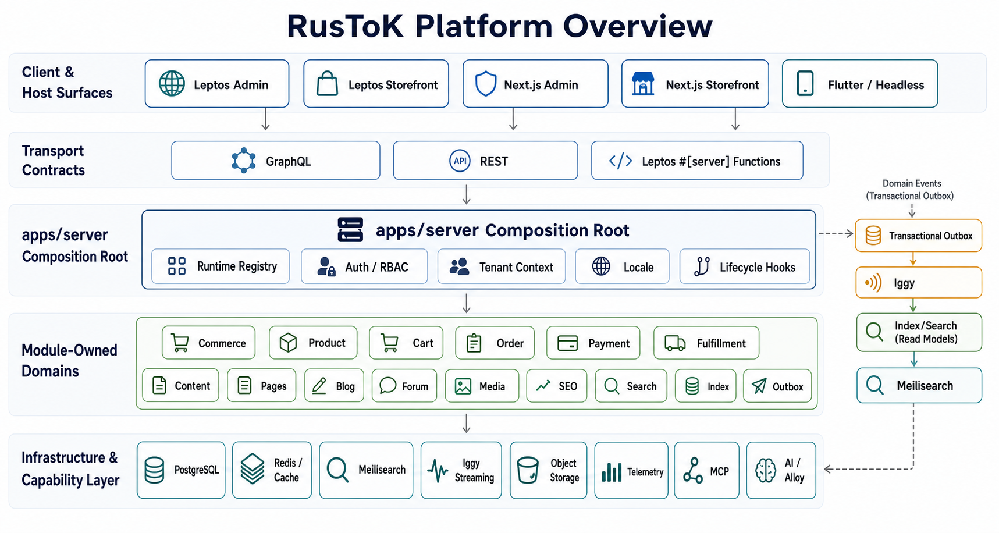
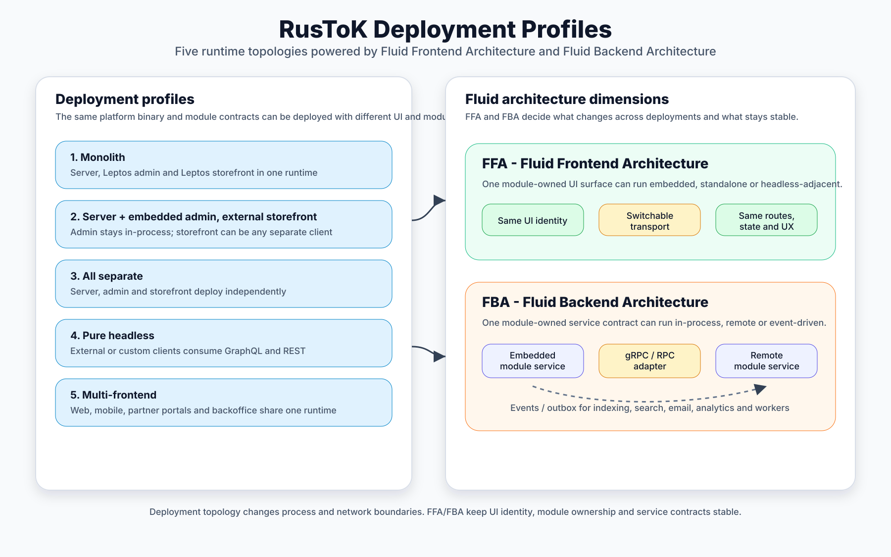

<div align="center">

#  RusTok

**High-Performance Event-Driven Platform Built in Rust & Tokio**

**Project status:** RusTok is under active development and provides a production-grade architectural foundation for building any data-driven applications, enterprise backends, and AI-native systems.

*AI-Native · Modular Monolith → Microservices · Enterprise-Grade · Rust & Tokio · One Binary*

[](https://github.com/RustokCMS/RusToK/actions/workflows/ci.yml)
[](LICENSE)
[](https://www.rust-lang.org)
[](docs/architecture/overview.md)
[](docs/index.md)
[](crates/rustok-mcp/README.md)
[](crates/alloy/README.md)

[](https://github.com/RustokCMS/RusToK/commits/main)
[](https://github.com/RustokCMS/RusToK/commits/main)
[](https://github.com/RustokCMS/RusToK)
[](CONTRIBUTING.md)

**[Русская версия](README.ru.md)** | **[Documentation Map](docs/index.md)**

</div>

---

### At a Glance

| Metric | Value |
|---|---|
| **Platform Crates** | 120+ production Rust crates |
| **Architecture Decisions** | 85+ documented ADRs |
| **Deployment Profiles** | 4 topology modes (Monolith → Hybrid FBA) |
| **UI Frameworks** | Leptos SSR + Next.js + Flutter Mobile |
| **AI Adapters** | 6 domain-specific AI modules + MCP server |
| **Database Engines** | PostgreSQL + Turso / libSQL |
| **Languages** | Rust · TypeScript · Dart |

---

## Executive Overview

**RusTok** is a next-generation, high-performance platform designed to eliminate the dilemma between rigid monoliths and overly complex microservice architectures. Built from the ground up on **Rust** and **Tokio**, RusTok combines compile-time type safety with a fluid, topology-agnostic runtime model.

Rather than forcing developers to pick between a closed monolith or an expensive distributed network of microservices, RusTok operates as a **blazing-fast in-process modular monolith by default**, while keeping its domain boundaries **ready for on-demand microservice extraction via gRPC or event streams**.



---

## Why RusTok? Architectural Advantages

### 1. Batteries-Included Foundation: Stop Reinventing Infrastructure
In traditional backend projects, engineering teams spend up to 70% of their initial time writing infrastructure plumbing: authentication, OAuth2, session management, RBAC permissions, multi-tenant isolation, caching layers, event outboxes, search indexers, media processing, and localization.

**RusTok comes with all essential platform infrastructure built-in on pure Rust:**
- **Required Core Platform Modules**: Control plane (`rustok-modules`), Authentication (`rustok-auth`), Multi-Tenancy (`rustok-tenant`), RBAC (`rustok-rbac`), Relational Indexing (`rustok-index`), Search (`rustok-search`), Transactional Outbox (`rustok-outbox`), Events (`rustok-events-module`), Caching (`rustok-cache`), Email (`rustok-email`), and Channel resolution (`rustok-channel`).
- **100% Focus on Unique Product Logic**: Developers don't spend months building low-level infrastructure from scratch. You simply declare the modules you need in `modules.toml` and write your unique domain features.

### 2. Safety by Design, Not by Discipline
In traditional Node.js, Python, or PHP platforms, security and data isolation depend on whether developers remember to check permissions or `tenant_id` filters on every query. One missed check leads to catastrophic cross-tenant data leaks.

In RusTok, tenant context (`tenant_id`), RBAC policies (`rustok-rbac`), and locale matching (`ICU4X`) are enforced at **compile-time and embedded in composite database keys**. Every cross-module call passes a transport-agnostic `PortContext` carrying strict `deadline_ms` timeouts, OpenTelemetry trace identifiers (`correlation_id`, `causation_id`), and idempotency keys. Caller-supplied identity headers (`X-User-ID`) are rejected at transport boundaries and reconstructed strictly post-token validation.

### 3. Alloy — Self-Evolving Dynamic Runtime & Instant Integrations
Compiled applications traditionally require code modifications, Pull Requests, CI/CD pipelines, and server restarts to change business rules. **Alloy** ([crates/alloy](crates/alloy/README.md)) bridges the gap between compiled performance and dynamic flexibility:

- ⚡ **New Features On-the-Fly**: Add new business capabilities, domain rules, and dynamic hooks instantly without redeploying platform binaries or restarting the server.
- 🧹 **Dirty Data Cleansing & Legacy Migrations**: Works as an in-memory ETL sanitization engine. Alloy scripts handle dirty data, unescaped encodings, corrupt dates, and broken tables from legacy platforms on the fly without crashing the core server.
- 🔌 **Instant API & Webhook Integrations**: Connect 1C, SAP, CRM, Telegram, logistics, or custom legacy backends in minutes via sandboxed HTTP adapters.
- 🛡 **100% Core Protection (`rustok-sandbox`)**: Scripts run in a sandboxed Rhai/WASM environment with strict execution timeouts, operation limits, and memory quotas.
- 🚀 **Evolution to Native Rust**: Full lifecycle from AI prompt or sandbox script to immutable release, up to automatic compilation into a high-performance native Rust module.

### 4. Native AI & Agentic Ecosystem (`rustok-ai`, `rustok-mcp`)
RusTok is designed from day one for AI orchestration and automated operations:
- **Model Context Protocol (`rustok-mcp`)**: Native MCP server allows AI agents (Claude, Cursor, custom agents) to inspect platform state, manage modules, and run operations via standard MCP tools.
- **Zero-Privilege Escalation (`Subject ∩ Agent`)**: AI agent runs operate under an `AgentPrincipal` whose effective permissions are calculated as the intersection of initiating user permissions and agent descriptor permissions ($\text{User} \cap \text{Agent}$). An AI agent can **never** elevate privileges beyond the initiating user.
- **Provider-Neutral AI Framework (`rustok-ai`)**: LLM orchestration with a vector RAG data plane (Athanor vector engine) supporting OpenAI, Anthropic, and local models.
- **Domain AI Adapters**: Pre-built AI adapters for products (`ai-product`), content (`ai-content`), media (`ai-media`), orders (`ai-order`), translations (`ai-translation`), and Alloy scripting (`ai-alloy`).

### 5. Single-Binary Efficiency & Zero Cloud Waste
Modern microservice setups often require complex Kubernetes clusters and gigabytes of RAM just to idle.
- **Sub-50ms Cold Boot**: Starts instantly with a minimal memory footprint (**20–50 MB RAM** idle).
- **Extreme Request Throughput**: Handles tens of thousands of requests per second on a single low-cost VPS.

### 6. Dual Database Engine Architecture (PostgreSQL + Turso / libSQL)
RusTok is designed to support a **Dual-Engine Persistence Strategy**:
- **PostgreSQL**: The gold standard for enterprise monoliths, complex partitioning, and centralized high-scale database clusters.
- **Turso (libSQL) Native Edge & Multi-Tenant Track**: The next-generation serverless database engine:
  - 🏢 **Database-per-Tenant**: True physical database isolation for every tenant with zero-cost scale-to-zero.
  - ⚡ **Zero-Latency Embedded Replicas**: Executes reads in-process inside the Rust binary (< 1ms latency) with background async cloud replication.
  - 🧠 **Native Vector Search**: Direct vector embeddings and semantic search for `rustok-ai` built directly into the database engine.
  - 🌿 **Instant Database Branching**: Spawns isolated database branches in 5ms for safe Alloy script dry-runs and AI migration testing.

---

## Target Applications & Use Cases

### 1. Universal Data Platform Engine (Startups, SaaS, ERP, CRM & Fintech)
At its core, the **RusTok Platform Core** — composed of `apps/server` (composition root) and required Core Modules (`rustok-modules`, `auth`, `tenant`, `rbac`, `index`, `search`, `outbox`, `events`, `cache`, `email`, `channel`) — provides a universal, production-grade foundation for **any data-intensive application**.

Rather than spending months rebuilding low-level infrastructure from scratch, RusTok Core provides pre-built Rust primitives for:
- 🚀 **Startups & MVPs**: Launch production-ready digital products in days rather than months.
- 🏢 **Enterprise ERP, CRM & B2B Portals**: Manage complex organizational hierarchies, RBAC policies, custom pricing, and legacy data cleansing via Alloy scripts.
- 💳 **Fintech, Banking & Data-Sensitive Workloads**: Strict compile-time type safety, double-entry financial ledger accounting (`rustok-marketplace-ledger`), event audit trails, and non-bypassable tenant isolation.
- ☁️ **SaaS Platforms**: Multi-tenant database isolation (Turso per-tenant micro-DBs), sub-50ms cold boots, and effortless scale-to-zero.

### 2. Specialized Industry Frameworks
For domain-specific verticals, RusTok provides pre-packaged module ecosystems:
- 🛒 **E-Commerce & Multi-Vendor Marketplaces**: Catalog, Cart, Order State Machine, Multi-vendor Seller Payouts, Commission Rules, and Multi-region Taxes.
- 🤖 **AI-Native & Agentic Platforms**: Built-in Model Context Protocol (`rustok-mcp`) server, Vector RAG data plane (`rustok-ai-athanor`), and automated LLM orchestration.
- 📰 **High-Traffic Media & Headless Content Systems**: Dual Leptos SSR + Headless GraphQL/REST, SEO Engine, Media Management (`rustok-media`), Editorial Blogs, Forums, and Comment Threads.

*...and much, much more — virtually any application that requires fast, reliable, and secure data processing!*

---

## Feature & Engineering Comparison Matrix

| Engineering Capability | WordPress / Woo | Magento 2 | Strapi (JS) | Medusa v2 (TS) | **RusTok** |
| :--- | :--- | :--- | :--- | :--- | :--- |
| **Type Safety Guarantees** | None (PHP) | None (PHP) | Build-step (TS) | Build-step (TS) | **Compile-time enforced (Rust)** |
| **Native Multi-Tenancy** | Multisite add-on | Store views | None | Limited | **Native composite DB keys & Turso per-tenant DBs** |
| **Fluid Backend Topology (FBA)** | Monolith only | Monolith only | Headless only | Complex setup | **Fluid: Monolith ↔ gRPC Microservices** |
| **Read Indexing Engine** | Direct DB queries | Heavy EAV / ES | Direct DB queries | Remote Query | **`rustok-index` (JSONB + Keyset)** |
| **Event Streaming & Replay** | Cron / MySQL | Triggers / Mview | None | Pub/Sub | **Iggy (Event Replay in Rust)** |
| **On-the-Fly Dynamic Logic** | Unsafe PHP plugins | Heavy DDL / Cron | JS Hooks | JS Workflows | **Alloy (`rustok-sandbox` Rhai/WASM)** |
| **Native AI & MCP Integration** | Plugins | None | None | Limited | **Built-in `rustok-mcp` Server & RAG** |
| **Idle RAM Footprint** | ~150–300 MB | ~500+ MB | ~200–400 MB | ~200–300 MB | **Extremely Low (20–50 MB RAM)** |

---

## Technical Pillars & Core Architecture

### 1. Fluid Backend Architecture (FBA)
Fluid Backend Architecture (FBA) decouples domain service logic from transport boundaries. A module's canonical business logic (`ProductCatalogReadPort`, `OrderService`, etc.) is implemented once in pure Rust.

- **Embedded Monolith (Default)**: Modules run inside `apps/server` in a single process. Service calls execute as zero-overhead, in-process Rust trait invocations without network hops or HTTP serialization.
- **Remote Service (Microservice Profile)**: Heavy modules can be extracted into standalone binaries (e.g. `rustok-product-catalog-service`) and called over authenticated, high-performance **gRPC** (`rustok-product-transport`).
- **Zero Business Code Rewrite**: Switching between embedded and remote modes requires changing only a environment flag (e.g. `RUSTOK_PRODUCT_CATALOG_PROVIDER=grpc`). Client APIs and domain logic remain untouched.

### 2. Fluid Frontend Architecture (FFA)
FFA provides a framework-agnostic UI architecture that eliminates frontend fragmentation and protects application code from UI framework lock-in:
- **Framework-Agnostic UI Contracts (`rustok-ui-core`, `rustok-ui-i18n`)**: State machines, view-models, input validation, and i18n catalogs are written in pure Rust without UI framework dependencies (zero `leptos::*` or `dioxus::*` imports in core logic).
- **Seamless UI Framework Swap (Leptos ↔ Dioxus Migration Track)**: Enables swapping or upgrading the frontend rendering engine (e.g. migrating from Leptos to Dioxus or adding native desktop/mobile hosts via [dioxus-ffa-ui-migration-plan.md](docs/research/dioxus-ffa-ui-migration-plan.md)) without rewriting a single line of domain UI state, view-models, or validation logic. Only thin view-adapters (`ui/leptos.rs` → `ui/dioxus.rs`) are swapped.
- **Integrated Leptos SSR Path (Default)**: Module UI packages compile directly into Leptos hosts using native `#[server]` functions for zero-overhead server rendering.
- **Headless & Companion Path**: Exposes identical domain capabilities via parallel **GraphQL**, **REST**, and **gRPC** interfaces for Next.js, Flutter Mobile apps, or custom clients.

### 3. High-Performance Relational Index Engine (`rustok-index`)
RusTok solves this with **`rustok-index`** ([crates/rustok-index](crates/rustok-index/README.md)) — eliminating the need for heavy JVM search clusters (Elasticsearch/Algolia) or fragile EAV table schemas (Magento):
- **Schema-Agnostic PostgreSQL Persistence**: Envelopes entity state into benchmarked `JSONB` structures (`index_entities`) paired with an independent relational link graph (`index_links`).
- **Derived Expression Indexes**: Automatically derives typed PostgreSQL partial B-Tree expression indexes for scalar properties and GIN indexes for array containment.
- **Zero N+1 Queries**: Executes cross-module filtering, aggregate ordering, and checksummed keyset pagination (`CursorCodec`) in a single `REPEATABLE READ` snapshot query.

### 4. Event Streaming & Transactional Outbox (Iggy & `sys_events`)
RusTok implements reliable event-driven delivery without forcing heavy message brokers onto lightweight deployments:
- **Transactional Outbox (`outbox_local`)**: Events (`IndexMutation`, `OrderPaid`, etc.) are written to PostgreSQL `sys_events` in the exact same database transaction as domain entity writes. In-process Tokio background workers process events asynchronously with zero data loss.
- **Native Rust Event Streaming (`outbox_iggy`)**: For high-throughput or distributed deployments, RusTok integrates with **[Iggy](https://iggy.rs)** (`rustok-iggy`), an ultra-fast streaming broker written in Rust. Iggy provides append-only event logs, **Event Replay**, and consumer groups with minimal RAM usage.

### 5. Compile-Time Manifest Composition (`modules.toml`)
RusTok builds platform binaries declaratively:
- **Build Composition**: `modules.toml` defines which module crates are compiled into the binary. Unused modules are omitted at compile time, eliminating dead code and reducing attack surface.
- **Per-Tenant Enablement**: A single compiled binary can host multiple tenants, with modules enabled or disabled per tenant at runtime.
- **Built-in Isolation & i18n**: Multi-tenancy (`tenant_id`) is baked into composite primary keys. Locale handling uses ICU4X/CLDR normalization and Translation Memory (TM).

### 6. Signed Module Build Pipeline & Content-Addressable Storage (`rustok-build`)
- **CAS Artifact Materialization**: Module builds (`rustok-build-source`) use Content-Addressable Storage (CAS) for reproducible, immutable archive materialization.
- **Signed Artifact Verification**: `rustok-build-publication` handles artifact signing and cryptographic verification before deployment.
- **Isolated Build Dispatching**: Compiles modules in sandboxed background workers (`rustok-module-build-worker`) over authenticated gRPC channels.

### 7. Double-Entry Marketplace Ledger & Financial Auditability
- **Double-Entry Ledger (`rustok-marketplace-ledger`)**: Multi-vendor transactions, commissions, seller allocations, and payouts use strict double-entry financial accounting.
- **Durable Event Audit Trail**: Immutable transaction logs prevent balance drift and provide complete financial auditability out of the box.

### 8. Durable Workflow Pipeline & Execution Idempotency (`rustok-workflow`)
- **Event-Triggered Workflows**: Workflow steps execute automatically upon domain events using durable `(workflow_id, trigger_event_id)` composite keys.
- **Side-Effect Protection**: Network retries and redeliveries recognize existing execution receipts, returning cached results without re-triggering external HTTP calls, payments, or notifications.

### 9. Self-Healing SEO Engine & Automated 301 Redirect Tree (`rustok-seo`)
- **Automated 301 Redirect Trees**: Updating entity slugs (products, articles, categories) automatically generates and maintains canonical 301 redirect paths without manual operator rules.
- **Idempotent Historical Replay**: Index repair and replay pipelines deduplicate operator runs, ensuring zero duplicate rows or broken links.

### 10. Sealed Translation Control Plane & Translation Memory (`rustok-translation`)
- **Sealed Event Lifecycles**: Translation jobs, proposals, approvals, and applies use sealed `TranslationWorkflowEvent` streams for atomic outbox delivery.
- **Translation Memory (TM)**: Shared glossaries and translation memory prevent redundant machine/human translation costs across entities.

---

## Deployment Topologies

RusTok supports multiple deployment topographies out of the box using the same binary base:

| Topology Profile | Admin UI | Storefront UI | Transport Layer | Best For |
|---|---|---|---|---|
| **Monolith (Default)** | Leptos SSR (integrated) | Leptos SSR (integrated) | In-process `#[server]` calls | Single-node deployment, maximum simplicity & speed |
| **Embedded Admin + External Storefront** | Leptos SSR (integrated) | Next.js / Mobile / Headless | In-process for Admin; GraphQL/REST for Storefront | Fast backoffice, independent storefront scaling |
| **All Separate / Headless** | Next.js / Custom | Next.js / Flutter Mobile | GraphQL / REST / gRPC | Large teams, decoupled release cycles |
| **Hybrid FBA** | Leptos / Next.js | Leptos / Next.js | gRPC for heavy modules, Iggy for background streams | Enterprise scale, selective microservice extraction |



---

## Platform Modules & Applications

### Core Applications

| Application | Role |
|---|---|
| `apps/server` | Composition root — Axum HTTP, GraphQL, auth, RBAC, event outbox, module manifest validation |
| `apps/admin` | Primary integrated Leptos admin host |
| `apps/storefront` | Primary integrated Leptos storefront host |
| `apps/next-admin` | Headless Next.js admin companion |
| `apps/next-frontend` | Headless Next.js storefront companion |
| `rustok_mobile/apps/*` | Flutter mobile hosts for Admin and Frontend |

### Complete Module Taxonomy

Platform capabilities are structured into modular crates defined in [`modules.toml`](modules.toml). Detailed ownership and status maps are maintained in [docs/modules/registry.md](docs/modules/registry.md).

#### Core Foundation Modules
- `rustok-auth` — Authentication lifecycle, credentials, OAuth2, session contracts.
- `rustok-tenant` — Multi-tenant resolution and per-tenant module enablement.
- `rustok-rbac` — Casbin-based permission engine, roles, and authorization policies.
- `rustok-index` — Cross-module relational Index Engine with PostgreSQL JSONB storage.
- `rustok-search` — Full-text relevance, autocomplete, facets, and search UI contracts.
- `rustok-outbox` — Transactional event outbox, relay, retry, and DLQ controls.
- `rustok-channel` — Channel context, host bindings, and locale resolution.
- `rustok-cache` — Zero-latency Moka TinyLFU L1 in-memory cache, Redis L2, $O(1)$ generation invalidation, and thundering-herd lease protection.
- `rustok-email` — Email template rendering and provider delivery lifecycle.
- `rustok-secrets` — Platform secrets, credential storage, and encryption boundaries.

#### E-Commerce & Multi-Vendor Marketplace Modules
- `rustok-commerce` — Umbrella e-commerce orchestration across cart, order, pricing, inventory, payment, and fulfillment.
- `rustok-product` — Catalog, product variants, category attributes, gRPC read transport.
- `rustok-cart` — Cart lifecycle, adjustments, and storefront checkout boundaries.
- `rustok-order` — Order state machine, snapshots, refunds, and fulfillment workflows.
- `rustok-pricing` — Price lists, volume discounts, customer-tier pricing.
- `rustok-inventory` — Stock reservation, multi-warehouse availability.
- `rustok-payment` — Payment collections, gateway integrations.
- `rustok-fulfillment` — Shipping methods, tracking, fulfillment processing.
- `rustok-customer` — Customer profile boundary and customer-owned operations.
- `rustok-region` — Regions, countries, currencies, tax baseline.
- `rustok-tax` — Tax calculation provider track and FBA tax boundary.
- `rustok-marketplace` — Multi-vendor marketplace orchestration core.
- `rustok-marketplace-seller` — Vendor onboarding, seller profiles, and merchant management.
- `rustok-marketplace-listing` — Vendor product listing management and approval workflows.
- `rustok-marketplace-commission` — Tiered commission calculation rules per vendor/category.
- `rustok-marketplace-payout` — Vendor payout processing and distribution scheduling.
- `rustok-marketplace-ledger` — Double-entry marketplace financial accounting ledger.
- `rustok-marketplace-allocation` — Order line allocation to multi-vendor fulfillment nodes.

#### Content, Community & Social Modules
- `rustok-content` — Shared rich-text orchestration and localized content helpers.
- `rustok-blog` — Editorial posts, categories, tags, and comment threads.
- `rustok-forum` — Forum categories, topics, moderation, and page builder widgets.
- `rustok-comments` — Reusable comment threads for custom entities.
- `rustok-pages` — Static & dynamic page hierarchy, navigation menus.
- `rustok-page-builder` — Visual page builder contract, tree state, property controls.
- `rustok-navigation` — Hierarchical navigation trees, menus, breadcrumbs.
- `rustok-taxonomy` — Shared vocabulary, tags, and dictionary layer.
- `rustok-media` — Media upload, storage adapters, WebP/AVIF processing.
- `rustok-seo` — Meta tags, XML sitemaps, automated redirects, robots.txt management.
- `rustok-moderation` — Content moderation, flag queues, and reporting boundaries.
- `rustok-groups` — User groups, organizations, and team workspaces.
- `rustok-social-graph` — Social relationships, follow/subscribers, activity feeds.
- `rustok-profiles` — Public profiles over users, authors, and member summaries.
- `rustok-notifications` — Multi-channel notification dispatch (Push, Email, SMS, In-app).

#### Translation & Localization Engine
- `rustok-translation` — Translation Memory (TM), glossaries, multi-target localization lifecycle.
- `rustok-translation-targets` — Typed translation target contracts for domain modules.
- `rustok-ai-translation` — AI-powered machine translation bridge and automated localization.
- `rustok-ui-i18n` — Framework-agnostic UI message catalog and locale resolution.

#### AI & Automation Ecosystem
- `rustok-mcp` — Model Context Protocol server for AI agent operations.
- `rustok-ai` — AI orchestration, RAG data ingestion, content/product enrichment.
- `rustok-ai-athanor` — Vector RAG data plane and embeddings engine.
- `rustok-ai-product` — AI support adapter for catalog generation and attribute extraction.
- `rustok-ai-content` — AI support adapter for article generation, summary, and translation.
- `rustok-ai-media` — AI support adapter for image tagging, visual search, and alt-text.
- `rustok-ai-order` — AI support adapter for order analytics and fraud detection.
- `rustok-ai-alloy` — AI support adapter for Alloy scripting execution policies.
- `alloy` — Rhai sandboxed scripting, hook triggers, dynamic business rules.
- `rustok-sandbox` — Neutral execution engine for sandboxed Rhai/WASM components.
- `rustok-workflow` — Webhook triggers, workflow execution, scheduled jobs.
- `flex` — Custom fields and runtime entity extension contracts.

#### Platform Build, Distribution & Worker Infrastructure
- `rustok-modules` — Control plane, manifest resolution, per-tenant module lifecycle.
- `rustok-installer` — Installer core support for browser/CLI setup wizards.
- `rustok-iggy` — Native Rust event streaming transport runtime.
- `rustok-iggy-connector` — Connector layer for Iggy message broker.
- `rustok-fba` — Shared FBA provider/consumer registry metadata.
- `rustok-build` — Module build infrastructure and manifest compilation.
- `rustok-build-source` — Immutable Content-Addressable Storage (CAS) archive materialization.
- `rustok-build-publication` — Build artifact credential signing and publication foundation.
- `rustok-module-build-worker` — Standalone worker for module compilation and assembly.
- `rustok-module-build-dispatcher` — Build dispatching and dispatch orchestration.
- `rustok-module-build-transport` — gRPC framing for build worker dispatching.
- `rustok-verification-worker` — Isolated verification worker for artifact validation.
- `rustok-verification-transport` — gRPC framing for verification workers.
- `rustok-static-distribution-worker` — Static asset distribution worker.
- `rustok-registry-validation-worker` — Registry validation worker.

---

## Quick Start

### Prerequisites
- **Rust Toolchain** (specified in `rust-toolchain.toml`)
- **PostgreSQL 16+**
- **Node.js** or **Bun** (for Next.js hosts)
- **Trunk** (for Leptos hosts)

### Local Stack Launch

```bash
./scripts/dev-start.sh
```

Default local endpoints:

| Surface | URL |
|---|---|
| **Backend API (Axum / GraphQL / REST)** | `http://localhost:5150` |
| **Leptos Admin** | `http://localhost:3001` |
| **Leptos Storefront** | `http://localhost:3101` |
| **Next.js Admin** | `http://localhost:3000` |
| **Next.js Storefront** | `http://localhost:3100` |

### Verification & Testing Commands

```bash
# Run workspace Rust tests
cargo nextest run --workspace --all-targets --all-features

# Run documentation tests
cargo test --workspace --doc --all-features

# Format and lint check
cargo fmt --all -- --check
cargo clippy --workspace --all-targets --all-features -- -D warnings

# Check dependencies and policies
cargo deny check
cargo machete
```

---

## Documentation Links

| Resource | Path |
|---|---|
| **Documentation Map** | [docs/index.md](docs/index.md) |
| **Architecture Overview** | [docs/architecture/overview.md](docs/architecture/overview.md) |
| **Module Registry** | [docs/modules/registry.md](docs/modules/registry.md) |
| **Fluid Backend Architecture** | [docs/backend/module-backend-architecture.md](docs/backend/module-backend-architecture.md) |
| **Fluid Frontend Architecture** | [docs/UI/module-package-architecture.md](docs/UI/module-package-architecture.md) |
| **Index Engine** | [crates/rustok-index/docs/README.md](crates/rustok-index/docs/README.md) |
| **Verification Plan** | [docs/verification/PLATFORM_VERIFICATION_PLAN.md](docs/verification/PLATFORM_VERIFICATION_PLAN.md) |
| **Quick Start Guide** | [docs/guides/quickstart.md](docs/guides/quickstart.md) |
| **Contributing Guide** | [CONTRIBUTING.md](CONTRIBUTING.md) |
| **AI Agent Rules** | [AGENTS.md](AGENTS.md) |

---

## Contributing

We welcome contributions! Please read our [Contributing Guide](CONTRIBUTING.md) for guidelines on development setup, branch naming, testing, and the pull request process.

---

## License

RusTok is licensed under the **Business Source License 1.1** with the **RusTok Additional Use Grant**.

- **Free / Open Access**: Free for community use, individual developers, open-source projects, and organizations with Total Finances up to **USD $3,000,000** over the preceding 12-month period.
- **Commercial Exemption**: Production, SaaS, hosted, white-label, or resale use by organizations above the threshold requires a separate RusTok Commercial License.
- **Automatic AGPL Conversion**: Each version of RusTok automatically converts to GNU Affero General Public License v3.0 (AGPLv3) two years after its release date.

See [LICENSE](LICENSE), [NOTICE](NOTICE), and [COMMERCIAL-LICENSE.md](COMMERCIAL-LICENSE.md) for complete details.
