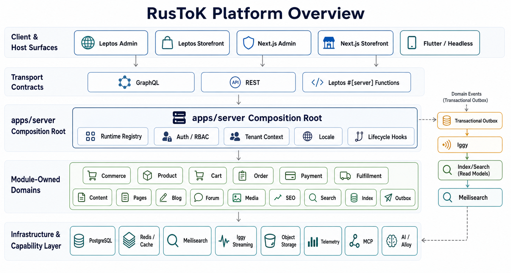
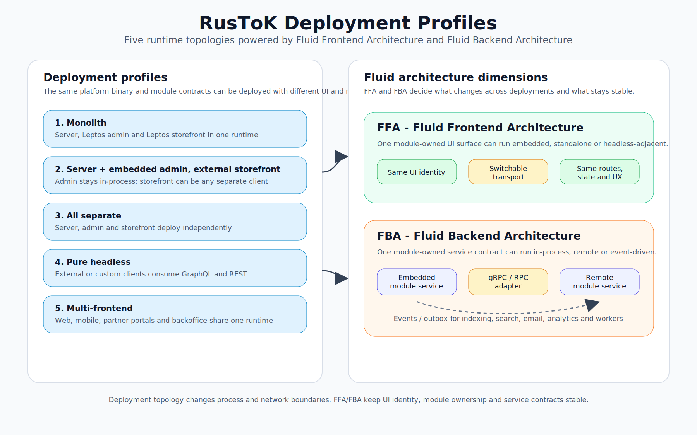
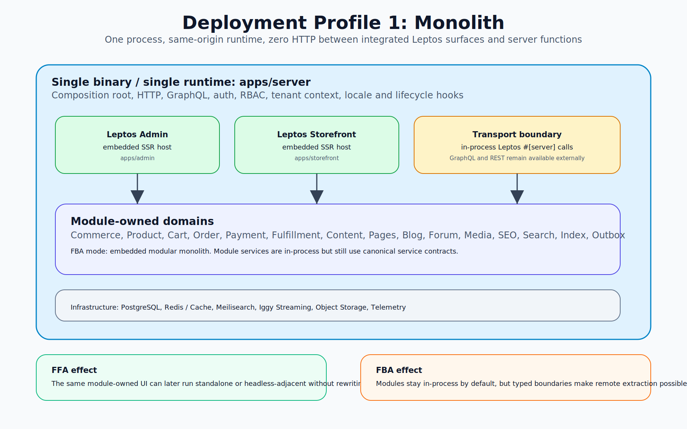
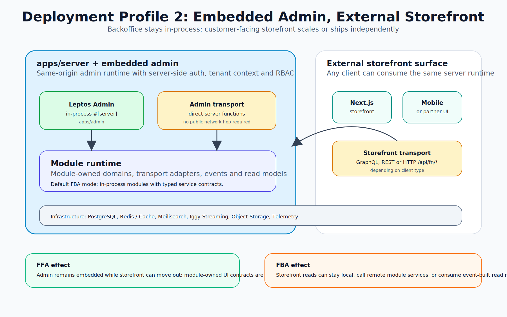
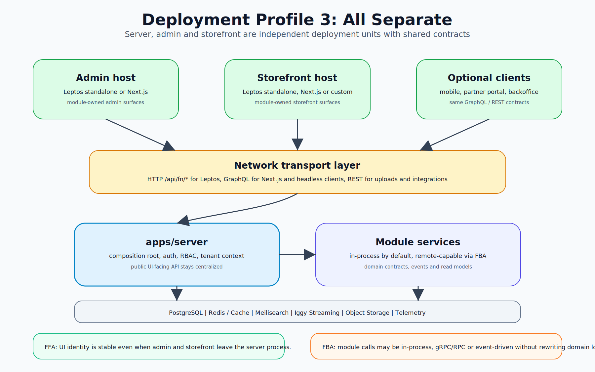
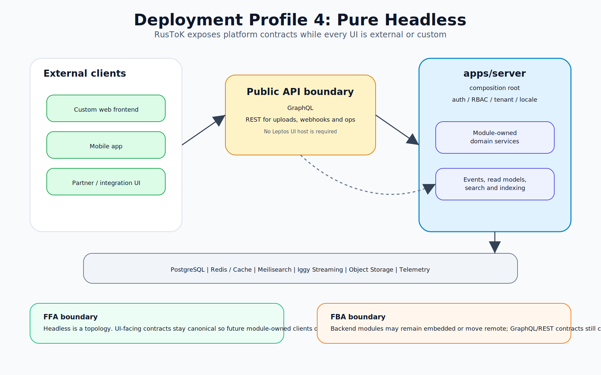
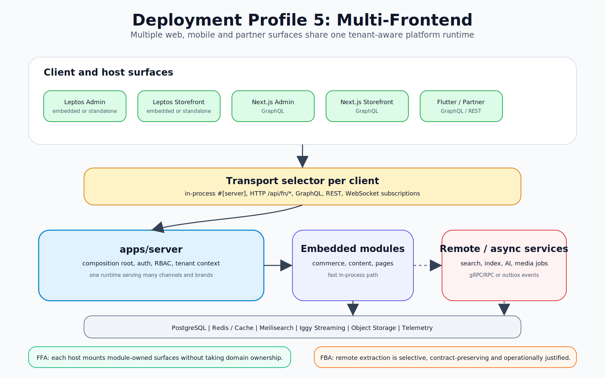

<div align="center">

#  RusTok

**Статус проекта:** RusTok находится в активной разработке. Сейчас платформа подходит для изучения, локальных экспериментов и архитектурной оценки, но пока не предназначена для production-сред.

**Событийная модульная платформа на Rust**

*Один репозиторий для сервера, интегрированных Leptos host-приложений и headless/экспериментальных Next.js host-приложений.*

[](https://github.com/RustokCMS/RusToK/actions/workflows/ci.yml)
[](LICENSE)
[](https://www.rust-lang.org)
[![PRs Welcome][def]](CONTRIBUTING.md)

**[English version](README.md)** | **[Карта документации](docs/index.md)**

</div>

RusToK сейчас представляет собой Rust-first modular monolith для мультитенантных продуктов, где сочетаются контент, commerce, workflow и интеграции. Текущий центр платформы — `apps/server` как composition root, сборка модулей через manifest, событийное разделение путей записи и чтения и две стратегии UI-host'ов: Leptos как основной интегрированный путь и Next.js как headless или экспериментальный контур.



<a id="table-of-contents"></a>

## Оглавление

- [Обзор](#overview)
- [Возможности](#features)
- [Производительность и экономия](#performance-and-economy)
- [Почему Rust](#why-rust)
- [AI-Native Architecture](#ai-native-architecture)
- [Сравнение](#comparison)
- [Снимок архитектуры](#architecture-snapshot)
  - [Приложения](#applications)
  - [Таксономия модулей](#module-taxonomy)
- [Система модулей](#module-system)
- [Быстрый старт](#quick-start)
- [Документация](#documentation)
- [Разработка](#development)
- [Текущий фокус](#current-focus)
- [Благодарности](#acknowledgments)
- [Лицензия](#license)

<a id="overview"></a>

## Обзор

Текущие сильные стороны платформы:

- Сборка через manifest от [`modules.toml`](modules.toml) до рантайма и host-приложений.
- Явные границы между `Core`, `Optional` и capability/support crates.
- Гибридная API-модель: GraphQL для доменных поверхностей, ориентированных на UI, REST для operational и integration flows, WebSocket там, где нужен live runtime.
- Событийное разделение путей записи и чтения через transactional outbox, `rustok-index` и `rustok-search`.
- Две стратегии UI-host'ов: `apps/admin` и `apps/storefront` как интегрированные Leptos hosts, `apps/next-admin` и `apps/next-frontend` как headless/экспериментальные контуры.

Корневой README намеренно короткий. Его задача — дать точку входа в репозиторий, а не заменить полную архитектурную спецификацию.

<a id="features"></a>

## Возможности

### Core Platform

- Мультитенантный runtime с tenant-aware контрактами
- Гибридная API-модель с GraphQL, REST и WebSocket там, где это нужно
- Manifest-driven composition модулей и per-tenant enablement
- Событийное разделение путей записи и чтения через transactional outbox
- Встроенные основы для локализации, observability и RBAC

### Режимы деплоя

| Режим | Как работает | Аутентификация | Сценарий |
|------|-------------|----------------|----------|
| **Монолит** | Сервер плюс интегрированные Leptos admin/storefront hosts | Серверные сессии и общий runtime context | Self-hosted сайт, встроенный backoffice и storefront |
| **Headless** | `apps/server` отдаёт API, а frontend живёт отдельно | OAuth2, sessions или смешанный контракт в зависимости от клиента | Мобильные приложения, внешние фронтенды, интеграции |
| **Смешанный** | Интегрированные Leptos hosts и внешние клиенты поверх одного рантайма | Оба | Встроенная админка плюс внешние приложения и интеграции |













### Матрица возможностей

| Возможность | WordPress | Shopify | Strapi | Ghost | **RusToK** |
|---|---|---|---|---|---|
| Монолитный деплой | да | нет | нет | да | **да** |
| Headless API surface | частично | да | да | частично | **да** |
| Смешанный integrated + headless режим | костыли | частично | частично | ограниченно | **да** |
| Мультитенантный runtime | multisite | ограниченно | нет | нет | **нативно** |
| Compile-time composition модулей | нет | нет | нет | нет | **да** |
| Rust-first integrated UI path | нет | нет | нет | нет | **да** |

### Developer Experience

- Axum как foundation для общего server runtime
- Rust crates как явные границы модулей
- Module-owned transport и UI slices вместо giant central app
- Живая документация, индексируемая из `docs/index.md`

### Тестирование и качество

- Workspace-wide Rust test flow через `cargo nextest`
- Проверки manifest и dependency hygiene через `cargo machete`
- Планы верификации платформы для architecture, frontend и quality контуров

### Наблюдаемость и безопасность

- Prometheus-style метрики и tracing stack
- Typed RBAC и permission-aware runtime contracts
- Tenant-aware request context и channel-aware request flow
- Общие validation и outbox/event-runtime guardrails

<a id="performance-and-economy"></a>

## Производительность и экономия

Точные числа зависят от deployment profile и состава модулей, но позиционирование платформы по-прежнему строится вокруг эффективности compiled runtime и денормализованных read paths.

### Бенчмарки (симулированные)

| Метрики | WordPress | Strapi | RusToK |
|---------|-----------|--------|--------|
| **Req/sec** | 60 | 800 | **45,000+** |
| **P99 Latency**| 450ms | 120ms | **8ms** |
| **Cold Boot** | N/A | 8.5s | **0.05s** |

<a id="why-rust"></a>

## Почему Rust

### Проблемы с текущими CMS-решениями

| Проблема | WordPress | Node.js CMS | RusToK |
|----------|-----------|-------------|--------|
| **Runtime Errors** | Fatal errors крашат сайт | Неотловленные исключения | Гарантии времени компиляции |
| **Memory Leaks** | Частые с плагинами | GC паузы и раздувание памяти | Модель владения предотвращает |
| **Безопасность** | Большая поверхность атак через плагины | npm supply-chain риски | Скомпилированные и аудируемые зависимости |
| **Масштабирование** | Требуются внешние слои кеширования | В основном горизонтальное | Вертикальное и горизонтальное |

### Преимущество Rust

```rust
let product = Product::find_by_id(db, product_id)
    .await?
    .ok_or(Error::NotFound)?;
```

Даже после переработки архитектуры базовая ценность остаётся той же:

- больше ошибок ловится на этапе компиляции;
- доменные контракты остаются явными между crate-ами;
- runtime-поведение предсказуемо и не зависит от интерпретатора.

<a id="ai-native-architecture"></a>

## AI-Native Architecture

RusToK по-прежнему ориентирован на agent-assisted работу, но в практическом смысле: репозиторий опирается на явные контракты, карту документации, module manifests и предсказуемые component boundaries, а не на магию генераторов.

Практические AI-facing точки входа:

- [Карта документации](docs/index.md)
- [Реестр модулей](docs/modules/registry.md)
- [Правила агентов](AGENTS.md)

<a id="comparison"></a>

## Сравнение

### vs. WordPress + WooCommerce

| Аспект | WordPress | RusToK |
|--------|-----------|--------|
| Язык | PHP 7.4+ | Rust |
| Plugin System | Runtime | Compile-time и manifest-driven |
| Type Safety | Нет | Полная |
| Multi-tenant | Multisite | Нативный |
| API | REST | GraphQL + REST |
| Admin UI | PHP templates | Leptos host |

Лучше для: команд, которым нужны более строгие контракты, чем даёт plugin-first PHP stack.

### vs. Strapi (Node.js)

| Аспект | Strapi | RusToK |
|--------|--------|--------|
| Язык | JavaScript/TypeScript | Rust |
| Моделирование контента | UI-based | Code- и module-based |
| Plugin Ecosystem | npm | crates и workspace modules |
| Cold Start | Выше | Ниже |

Лучше для: команд, которым нужна type safety и явное владение доменами.

### vs. Medusa.js (E-commerce)

| Аспект | Medusa | RusToK |
|--------|--------|--------|
| Фокус | Только e-commerce | Commerce плюс content/community/workflow |
| Язык | TypeScript | Rust |
| Архитектура | Microservices encouraged | Модульный монолит |
| Storefront | Next.js templates | Leptos host плюс Next.js companion paths |

Лучше для: команд, которым нужны commerce и non-commerce домены в одной платформе.

### vs. Directus / PayloadCMS

| Аспект | Directus/Payload | RusToK |
|--------|------------------|--------|
| Подход | Database-first | Schema-first и module-first |
| Type Generation | Build step | Нативные Rust types |
| Custom Logic | Hooks (JS) | Rust modules |
| Self-hosted | Да | Да |
| "Full Rust" | Нет | Да |

Лучше для: команд, строящих платформу вокруг Rust-стека.

<a id="architecture-snapshot"></a>

## Снимок архитектуры

<a id="applications"></a>

### Приложения

| Путь | Роль |
|---|---|
| `apps/server` | Composition root, общий HTTP/GraphQL runtime host, wiring auth/session/RBAC, event runtime, проверка manifest |
| `apps/admin` | Основной Leptos admin host |
| `apps/storefront` | Основной Leptos storefront host |
| `apps/next-admin` | Headless или экспериментальный Next.js admin host |
| `apps/next-frontend` | Headless или экспериментальный Next.js storefront host |

<a id="module-taxonomy"></a>

### Таксономия модулей

`modules.toml` — источник истины по модульному составу платформы на этапе сборки.
Полная карта владельцев, статусы FFA/FBA и доказательства находятся в
[реестре модулей](docs/modules/registry.md).

Core-модули обязательны и всегда входят в платформу:

| Модуль | Crate | Описание |
|---|---|---|
| `auth` | `rustok-auth` | Жизненный цикл аутентификации, учетные данные, OAuth, пользователи и контракты сессий |
| `cache` | `rustok-cache` | Фабрика кеш-бэкендов с Redis и режимом in-memory |
| `channel` | `rustok-channel` | Контекст каналов, привязки хостов, разрешение locale/channel и факты запроса |
| `email` | `rustok-email` | Email-провайдеры, шаблоны и контракты жизненного цикла доставки |
| `index` | `rustok-index` | Индексированные модели чтения для межмодульной фильтрации и проекций |
| `search` | `rustok-search` | Поиск, подсказки, ранжирование, фасеты и UI-контракты поиска для витрины и админки |
| `outbox` | `rustok-outbox` | Транзакционный outbox событий, relay, retry и DLQ-поверхности управления |
| `tenant` | `rustok-tenant` | Жизненный цикл tenant, его разрешение и включение модулей для каждого tenant |
| `rbac` | `rustok-rbac` | Runtime прав доступа, политики ролей и решения авторизации |

Optional-модули подключаются через manifest composition и включаются для каждого tenant отдельно:

| Модуль | Crate | Описание |
|---|---|---|
| `content` | `rustok-content` | Общая оркестрация контента, rich-text и helpers для локализованного контента |
| `cart` | `rustok-cart` | Жизненный цикл корзины, позиции, корректировки и UI-граница корзины на витрине |
| `customer` | `rustok-customer` | Граница профиля клиента и клиентские операции в админке |
| `product` | `rustok-product` | Каталог, варианты, атрибуты категорий, product admin и UI каталога на витрине |
| `profiles` | `rustok-profiles` | Публичный слой профилей поверх пользователей, авторов и кратких карточек участников |
| `region` | `rustok-region` | Регионы, страны, валюты, налоговая база и UI-поверхности регионов |
| `pricing` | `rustok-pricing` | Прайс-листы, видимость цен и представление цен на витрине |
| `inventory` | `rustok-inventory` | Инвентарь, наличие на складе и принадлежащие inventory модели чтения для админки |
| `order` | `rustok-order` | Жизненный цикл заказов, snapshots, returns, refunds и UI операций с заказами |
| `payment` | `rustok-payment` | Payment collections, платежи и представление оплаты на витрине |
| `fulfillment` | `rustok-fulfillment` | Варианты доставки, fulfillments и handoff доставки в checkout |
| `commerce` | `rustok-commerce` | Зонтичная e-commerce оркестрация поверх cart, customer, product, pricing, inventory, order, payment и fulfillment |
| `blog` | `rustok-blog` | Посты блога, категории, теги, интеграция комментариев и поверхности админки/витрины |
| `forum` | `rustok-forum` | Темы форума, ответы, модерация и потребление widgets от page builder |
| `comments` | `rustok-comments` | Общий comments domain и переиспользуемая граница comment-thread |
| `pages` | `rustok-pages` | Страницы, меню, страницы витрины и page-builder consumer surfaces |
| `page_builder` | `rustok-page-builder` | Контракты visual builder для preview, tree, properties и publish flows |
| `taxonomy` | `rustok-taxonomy` | Общий слой словарей, taxonomy и dictionaries |
| `media` | `rustok-media` | Загрузка медиа, storage-facing APIs и типизированные контракты image descriptors |
| `seo` | `rustok-seo` | SEO metadata, templates, redirects, sitemap, robots и remediation workflows |
| `workflow` | `rustok-workflow` | Выполнение workflow, templates, schedules и webhook ingress |
| `alloy` | `alloy` | Sandboxed scripting, scheduler, hook runtime и automation capabilities |
| `flex` | `flex` | Custom fields и attached/standalone extension contracts |

Shared libraries и capability crates не всегда являются platform modules, но
держат общие контракты, адаптеры или vertical capabilities:

| Crate | Описание |
|---|---|
| `rustok-core` | Общие foundation contracts, primitives, validation и security helpers |
| `rustok-api` | Общий host/API слой для transport adapters и boundary contracts |
| `rustok-runtime` | Host runtime helpers для типизированных shared handles, нейтрального доступа к БД и module adapters |
| `rustok-web` | Axum HTTP helpers для response/error mapping в controller boundary |
| `rustok-fba` | Общие FBA metadata для provider/consumer registries и transport-profile descriptors |
| `rustok-cli-core` | Контракты platform CLI command/provider для будущих module-local CLI adapters |
| `rustok-events` | Канонические event contracts и import surface |
| `rustok-storage` | Абстракция storage backend |
| `rustok-commerce-foundation` | Общие commerce DTOs, entities, errors и search helpers |
| `rustok-content-orchestration` | Межмодульный content orchestration bridge вне `apps/server` |
| `rustok-installer` | Installer-core support contracts для hybrid installer flow |
| `rustok-test-utils` | Общие test fixtures, mocks и helpers |
| `rustok-telemetry` | Observability bootstrap и telemetry helpers |
| `rustok-ui-core` | Framework-agnostic UI contracts для route/query/input/busy в FFA packages |
| `rustok-ui-transport` | Framework-agnostic UI contracts для transport path/result/evidence |
| `rustok-ui-i18n` | Framework-agnostic UI message catalog и key-resolution core |
| `rustok-ui-i18n-leptos` | Leptos adapter для shared UI message catalogs |
| `rustok-graphql` | Framework-agnostic GraphQL HTTP client contracts |
| `rustok-graphql-leptos` | Leptos reactive hooks adapter для `rustok-graphql` |
| `leptos-ui` | UI primitives и переиспользуемые host/module components для Leptos |
| `leptos-ui-routing` | Leptos helpers для route/query поверх `rustok-ui-core` |
| `leptos-shadcn-pagination` | Компоненты пагинации для Leptos |
| `leptos-auth` | Auth helpers для integrated Leptos UI hosts |
| `leptos-forms` | Form helpers для Leptos |
| `leptos-hook-form` | Hook-style form helpers для Leptos |
| `leptos-table` | Table helpers для Leptos |
| `leptos-zod` | Zod-style validation helpers для Leptos UI flows |
| `leptos-zustand` | Zustand-style state helpers для Leptos UI flows |
| `rustok-mcp` | Model Context Protocol server и management surfaces |
| `rustok-ai` | AI orchestration capability и admin/operator surfaces |
| `rustok-ai-content` | AI support adapter для content и blog |
| `rustok-ai-product` | AI support adapter для product catalog |
| `rustok-ai-order` | AI support adapter для order analytics и operations |
| `rustok-ai-media` | AI support adapter для media/image |
| `rustok-ai-alloy` | AI policy и adapter layer для Alloy scripting |
| `rustok-seo-admin-support` | Переиспользуемые SEO admin panels и GraphQL transport helpers для owner modules |
| `rustok-seo-targets` | Typed SEO target descriptors для owner modules и SEO templates |
| `rustok-tax` | Tax calculation provider track и FBA tax boundary contracts |
| `alloy-scripting` | Scripting support layer для Alloy runtime flows |
| `rustok-iggy` | Event streaming transport runtime |
| `rustok-iggy-connector` | Embedded/remote connector layer для Iggy |

FFA/FBA отслеживаются централизованно, потому что статус меняется по каждому
модулю и должен быть подтвержден доказательствами:

| Термин | Значение | Где смотреть текущий статус |
|---|---|---|
| FFA | Fluid Frontend Architecture: module-owned UI разделяется на framework-agnostic `core`, transport facade и явные host UI adapters, например Leptos или Dioxus. | [FFA/FBA readiness board](docs/modules/registry.md#ffafba-readiness-board-module-owned-ui) |
| FBA | Fluid Backend Architecture: module-owned backend boundary с typed ports, request context, errors, fallback/degraded modes и verification evidence. | [FFA/FBA readiness board](docs/modules/registry.md#ffafba-readiness-board-module-owned-ui) |

Ключевые границы доменов:

- `rustok-content` теперь shared helper и orchestration layer. Это больше не product-facing storage или transport owner для `blog`, `forum` и `pages`.
- `rustok-comments` — отдельный generic comments module для классических комментариев вне forum domain.
- Commerce surface разделён на профильные family modules, а `rustok-commerce` работает как umbrella/root module и orchestration layer.
- Channel-aware поведение уже входит в live request/runtime pipeline через `rustok-channel` и общие request-context contracts.

<a id="module-system"></a>

## Система модулей

Текущий модульный поток управляется через manifest:

```text
modules.toml
  -> build.rs генерирует wiring для host-приложений
  -> apps/server проверяет manifest
  -> ModuleRegistry / bootstrap рантайма
  -> per-tenant enablement для optional modules
```

Важные правила:

- Не считать ручную регистрацию маршрутов в `app.rs` основным способом интеграции модулей.
- Host-приложения подключают optional modules через generated contracts, производные от `modules.toml` и module manifests.
- Build composition и tenant enablement — разные уровни:
  - build composition определяет, что попадает в артефакт;
  - tenant enablement определяет, какие optional modules активны для конкретного tenant.
- Leptos hosts уже потребляют module-owned UI packages через manifest-driven wiring.
- Next.js hosts остаются manual/headless entry points и не должны описываться так, будто у них уже есть тот же generated host contract.

Полная карта текущего runtime описана в:

- [Обзоре архитектуры](docs/architecture/overview.md)
- [Реестре модулей](docs/modules/registry.md)
- [Индексе модульной документации](docs/modules/_index.md)
- [Документе про manifest и rebuild lifecycle](docs/modules/manifest.md)

<a id="quick-start"></a>

## Быстрый старт

Актуальное руководство быстрого старта для локальной разработки находится в [docs/guides/quickstart.md](docs/guides/quickstart.md).

Типовой сценарий:

```bash
./scripts/dev-start.sh
```

Текущий guide покрывает полный локальный стек:

- backend на `http://localhost:5150`
- Next.js admin на `http://localhost:3000`
- Leptos admin на `http://localhost:3001`
- Next.js storefront на `http://localhost:3100`
- Leptos storefront на `http://localhost:3101`

Если нужен не корневой обзор, а контекст конкретного приложения, начинайте с:

- [документации apps/server](apps/server/docs/README.md)
- [документации apps/admin](apps/admin/docs/README.md)
- [документации apps/storefront](apps/storefront/docs/README.md)
- [документации apps/next-admin](apps/next-admin/docs/README.md)
- [документации apps/next-frontend](apps/next-frontend/docs/README.md)

<a id="documentation"></a>

## Документация

Канонические точки входа:

- [Карта документации](docs/index.md)
- [Обзор архитектуры](docs/architecture/overview.md)
- [Реестр модулей и приложений](docs/modules/registry.md)
- [Индекс модульной документации](docs/modules/_index.md)
- [Справочный пакет MCP](docs/references/mcp/README.md)
- [Руководство по тестированию](docs/guides/testing.md)
- [Как писать модуль в RusToK](docs/modules/module-authoring.md)
- [Главный план верификации платформы](docs/verification/PLATFORM_VERIFICATION_PLAN.md)
- [Правила агентов](AGENTS.md)

<a id="development"></a>

## Разработка

Рекомендуемый минимум окружения:

- Rust toolchain из конфигурации репозитория
- PostgreSQL для локального рантайма
- Node.js или Bun для Next.js host-приложений
- `trunk` для Leptos host-приложений

Полезные команды:

```bash
# полный локальный стек
./scripts/dev-start.sh

# Rust tests
cargo nextest run --workspace --all-targets --all-features

# doc-тесты
cargo test --workspace --doc --all-features

# format и lint
cargo fmt --all
cargo clippy --workspace --all-targets --all-features -- -D warnings

# dependency и policy checks
cargo deny check
cargo machete
```

Общие правила для контрибьюторов и агентов описаны в [CONTRIBUTING.md](CONTRIBUTING.md) и [AGENTS.md](AGENTS.md).

<a id="current-focus"></a>

## Текущий фокус

Актуальные приоритеты ведутся в живых platform docs, а не в отдельном root roadmap-файле:

- [Как писать модуль в RusToK](docs/modules/module-authoring.md)
- [Главный план верификации платформы](docs/verification/PLATFORM_VERIFICATION_PLAN.md)
- [Архитектурные решения](DECISIONS/README.md)

Верхнеуровнево текущий кодовый фокус такой:

- держать честные module boundaries по мере роста платформы;
- развивать module-owned transport и UI surfaces, не превращая `apps/server` в доменную свалку;
- сохранять manifest-driven composition для server и Leptos hosts;
- синхронизировать channel-aware, multilingual и event-driven contracts между доменами.

<a id="acknowledgments"></a>

## Благодарности

Платформа опирается на такие open-source основы, как:

- Leptos
- SeaORM
- async-graphql
- Axum

<a id="license"></a>

## Лицензия

RusTok распространяется по Business Source License 1.1 with RusTok Additional Use Grant.

RusTok — source-available проект, бесплатный для сообщества, индивидуальных разработчиков, open-source проектов и организаций с Total Finances не выше USD $3,000,000 за последние 12 месяцев.

Production, commercial, SaaS, hosted, managed service, cloud service, white-label, resale или competing platform use организациями выше этого порога требует отдельной RusTok Commercial License.

Обычные SaaS-продукты, построенные поверх RusTok, разрешены по RusTok Additional Use Grant, если продукт отличается от RusTok itself и организация не превышает порог Total Finances.

Предложение RusTok itself as SaaS, hosted RusTok platform, managed RusTok service, white-label RusTok product или substantially similar competing platform требует отдельной RusTok Commercial License или предварительного письменного разрешения RusTokRs.

One-click installs, Docker images, Helm charts, VPS images, marketplace images и похожие deployment packages разрешены, если customer controls and administers their own RusTok instance и сохраняются LICENSE, NOTICE, copyright notices и license headers.

Каждая версия RusTok автоматически переходит на GNU Affero General Public License v3.0 or later через два года после first public release date этой версии.

Frontend “Powered by RusTok” attribution, logo, footer link или login-screen attribution не требуются. Copyright notices, license notices и source code attribution notices должны сохраняться.

См. LICENSE, NOTICE и COMMERCIAL-LICENSE.md.

[def]: https://img.shields.io/badge/PRs-welcome-brightgreen.svg
