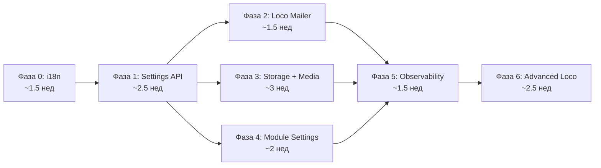

# Ревью плана интеграции Loco RS + Core

**Дата ревью:** 2026-03-14
**Ревьюируемый документ:** `loco-core-integration-plan.md` (2026-03-12, RFC)
**Цель:** Перепроверка полноты плана, выявление пропусков, рекомендации по границам «модуль vs server».

---

## 1. Общая оценка

План хорошо структурирован: фазы логичны, граф зависимостей корректен, архитектурный инвариант (core agnosticism) чётко зафиксирован. Ниже — обнаруженные пробелы и уточнения.

---

## 2. Что упущено или недостаточно раскрыто

### 2.1 Фаза 0 — i18n: нет плана миграции существующих строк

**Проблема:** В `rustok-core::i18n` уже есть ~40 ключей (валидационные ошибки). Но в серверных контроллерах, GraphQL resolvers и сервисах строки захардкожены на английском. План говорит «все API ответы через i18n», но не описывает:

- **Инвентаризацию** существующих строк в `controllers/`, `graphql/`, `services/` — сколько их, как собирать.
- **Формат translation bundles** — сейчас `i18n.rs` использует статический `HashMap`. Для масштабирования нужен формат файлов (`.ftl` Fluent? `.json`? `.toml`?). План не фиксирует.
- **Fallback-цепочку на уровне модулей** — `RusToKModule::translations()` упомянут в Фазе 4, но i18n активируется в Фазе 0. Кто поставляет переводы модулей между Фазой 0 и Фазой 4?

**Рекомендация:**
1. Добавить подзадачу «аудит hard-coded строк» в Фазу 0.
2. Зафиксировать формат файлов переводов (рекомендуется Fluent `.ftl` — стандарт Mozilla, есть Rust-крейт `fluent-rs`).
3. До Фазы 4 модули могут поставлять переводы через convention: `{module_slug}/translations/{locale}.ftl`, а `translations()` в трейте — формализация уже работающего паттерна.

---

### 2.2 Фаза 1 — Settings API: нет версионирования и миграции настроек

**Проблема:** `platform_settings.settings` — JSONB. При обновлении платформы схема настроек может измениться (новые поля, переименования, удаления). План не описывает:

- **Schema versioning** — как определить, что настройки в БД соответствуют текущей версии кода.
- **Миграцию значений** — что происходит при апгрейде: кто обновляет `settings` JSONB при появлении новых полей? Fallback на defaults работает для чтения, но «грязные» записи с устаревшими полями остаются.
- **Аудит изменений** — `updated_by` есть, но нет `updated_at` diff / history. Для compliance и отладки нужна хотя бы аудитная таблица или event.

**Рекомендация:**
1. Добавить поле `schema_version INTEGER NOT NULL DEFAULT 1` в `platform_settings`.
2. В `SettingsService` — lazy migration: при чтении проверить `schema_version`, при несоответствии — обновить до текущей через зарегистрированные миграторы.
3. Эмитить event `PlatformSettingsChanged { category, diff, changed_by }` через outbox — это даёт аудит и возможность реагировать (перезагрузка кэша, уведомления).

---

### 2.3 Фаза 1 — Settings API: нет валидации на уровне ядра

**Проблема:** План говорит «ядро хранит как opaque JSONB; валидацию делает модуль». Но `platform_settings` — это **платформенные** настройки (rate_limit, email, search), а не модульные. Кто валидирует платформенные категории?

**Рекомендация:**
- Ввести `SettingsValidator` trait в server. Для каждой категории регистрируется валидатор. Платформенные категории (`email`, `rate_limit`, `events`) валидируются серверным кодом. Модульные — через `module.validate_settings()`.

---

### 2.4 Фаза 2 — Mailer: нет шаблонизации для модулей

**Проблема:** План описывает `templates/email/` с Tera-шаблонами, но только для server-level emails (password reset). Модули (commerce: подтверждение заказа, forum: уведомление об ответе) тоже генерируют email. Как модули регистрируют свои email-шаблоны?

**Рекомендация:**
- Определить контракт `EmailTemplateProvider` в server, чтобы модули поставляли свои шаблоны.
- Convention: `templates/email/{module_slug}/` для шаблонов модулей.
- Шаблоны модулей должны поддерживать i18n (locale-aware rendering).

---

### 2.5 Фаза 3 — Storage: нет стратегии удаления и GC

**Проблема:** `StorageAdapter` описывает upload/download/thumbnail, но нет:

- **Удаления ассетов** — `delete()` метод отсутствует в контракте.
- **Orphan cleanup** — что делать с файлами, на которые никто не ссылается (удалённый контент, неудачный upload).
- **Soft delete vs hard delete** — для compliance может потребоваться retention period.

**Рекомендация:**
Расширить контракт:
```rust
async fn delete(&self, tenant_id: Uuid, asset_id: Uuid) -> Result<()>;
async fn soft_delete(&self, tenant_id: Uuid, asset_id: Uuid) -> Result<()>;
async fn gc_orphans(&self, tenant_id: Uuid, older_than: Duration) -> Result<u64>;
```
Добавить поле `deleted_at` в `media_assets`. GC как scheduled task (Фаза 6).

---

### 2.6 Фаза 3 — Storage: нет стратегии для существующих файлов

**Проблема:** Если модули уже сохраняют файлы ad-hoc, при переходе на `StorageAdapter` нужна миграция существующих файлов. План не описывает backward compatibility.

**Рекомендация:**
- Добавить подзадачу «инвентаризация существующих upload-путей в модулях».
- Предусмотреть migration task для переноса файлов в новую структуру `{tenant_id}/YYYY/MM/{uuid}.{ext}`.

---

### 2.7 Фаза 4 — Dynamic GraphQL: техническая сложность не раскрыта

**Проблема:** `async-graphql` использует макрос `#[derive(MergedObject)]` — это compile-time merge. Динамическая регистрация в runtime требует принципиально другого подхода. Варианты:

1. **Dynamic schema via `async_graphql::dynamic::*`** — полностью runtime, но теряются derive-макросы, типобезопасность и autocomplete.
2. **Feature-gated compilation** — `#[cfg(feature = "blog")]` и т.д. Compile-time, но нет runtime toggle.
3. **Code generation** — `build.rs` генерирует `schema.rs` из манифеста модулей.
4. **Гибридный подход** — compile-time merge всех _зарегистрированных_ модулей, runtime toggle через `@skip`/guard на уровне resolver.

**Рекомендация:**
Зафиксировать архитектурное решение по подходу ДО начала Фазы 4. Самый прагматичный вариант: **compile-time регистрация** через feature flags + Cargo features. Модуль компилируется в бинарь, но его resolvers проверяют `module.is_enabled(tenant_id)` в runtime. Это сохраняет типобезопасность `MergedObject`, убирает hard-coded импорты (заменяя на conditional compilation), и позволяет runtime toggle per-tenant.

```rust
// Пример: schema.rs с feature-gated модулями
#[derive(MergedObject, Default)]
pub struct Query(
    RootQuery,
    AuthQuery,
    #[cfg(feature = "mod-commerce")] CommerceQuery,
    #[cfg(feature = "mod-content")] ContentQuery,
    // ...
);
```

Это значительно проще полностью динамической schema и не ломает типизацию async-graphql.

---

### 2.8 Фаза 5 — Observability: нет алертинга и retention

**Проблема:** План описывает dashboard, но не упоминает:

- **Alerting rules** — при каких порогах отправлять уведомления (через Channels из Фазы 6? email? webhook?).
- **Retention** — `recentErrors` подразумевает хранение ошибок. Где? Сколько хранить?
- **Pagination** — `eventQueueStats`, `recentErrors` могут вернуть огромные объёмы данных.

**Рекомендация:**
- Добавить `AlertRule` сущность с порогами и каналами уведомлений.
- Ошибки хранить в ring-buffer (in-memory, ограниченный размер) или в таблице с автоочисткой.
- Все observability GraphQL-queries должны поддерживать pagination.

---

### 2.9 Фаза 6 — Scheduler: нет управления concurrency

**Проблема:** Scheduler для cron-задач не описывает:

- **Leader election** — в multi-instance deployment кто запускает задачу? Все инстансы или один?
- **Overlap protection** — что если задача не завершилась до следующего запуска?
- **Retry policy** — что если задача упала?

**Рекомендация:**
- Использовать advisory locks (PostgreSQL `pg_advisory_lock`) для leader election.
- Добавить `skip_if_running` флаг для задач.
- Retry policy наследовать от `RelayRetryPolicy` (уже реализован в event settings).

---

### 2.10 Пропущено: Graceful shutdown и drain

**Проблема:** Нигде в плане не упоминается graceful shutdown. При переходе на Channels (WebSocket), Scheduler и расширенный Storage — корректное завершение становится критичным:

- WebSocket-соединения нужно корректно закрывать.
- Outbox relay worker должен завершить текущий batch.
- Storage upload-in-progress не должен оставлять сирот.

**Рекомендация:**
Добавить cross-cutting concern «Graceful Shutdown Protocol» как подзадачу Фазы 6 или выделить отдельно.

---

### 2.11 Пропущено: Rate limiting settings в DB

**Проблема:** `RateLimitSettings` сейчас в YAML. После Фазы 1 (Settings API) rate limits должны быть per-tenant и управляемы из админки. Но план не упоминает rate limiting как категорию настроек явно (только в схеме таблицы `platform_settings`).

**Рекомендация:**
Явно добавить миграцию `rate_limit` в Settings API. Это важно для SaaS: разные тарифы → разные лимиты.

---

### 2.12 Пропущено: OAuth provider management из админки

**Проблема:** OAuth-провайдеры (Google, GitHub и т.д.) сейчас настраиваются через YAML/код. После Фазы 1 логично управлять ими из админки (включить/выключить провайдера, обновить client_id/secret). План это не упоминает.

**Рекомендация:**
Добавить `oauth` как категорию в `platform_settings` или отдельную таблицу `oauth_providers` с per-tenant настройками.

---

## 3. Что вынести как модуль, а что оставить в server

### 3.1 Принцип разделения

| Критерий | → Server (infra) | → Модуль (crate) |
|----------|------------------|-------------------|
| Используется **всеми** модулями | ✅ | |
| Привязан к **Loco API** | ✅ | |
| Содержит **доменную логику** | | ✅ |
| Может быть **отключён** per-tenant | | ✅ |
| **Stateless** инфраструктурный сервис | ✅ | |
| Требует **собственных миграций** и моделей | | ✅ |

### 3.2 Конкретные рекомендации

#### Оставить в server (инфраструктура)

| Компонент | Обоснование | Фаза |
|-----------|-------------|------|
| **Settings API** (`SettingsService`, `platform_settings`) | Платформенная infra, все модули зависят от неё. Тесно связан с Loco config. | 1 |
| **Loco Mailer adapter** | Инфраструктурная обёртка Loco API. Модули не должны напрямую зависеть от Loco Mailer. | 2 |
| **i18n middleware** (locale resolution) | Server-level concern: парсинг `Accept-Language`, injection locale в request context. | 0 |
| **Observability dashboard** (GraphQL queries) | Платформенные метрики, не доменная логика. | 5 |
| **Scheduler runtime** | Инфраструктура выполнения задач. Задачи регистрируют модули, runtime — server. | 6 |
| **Channels runtime** (WebSocket hub) | Transport-level, аналогично event bus. | 6 |
| **GraphQL schema builder** | Compile-time merge, server отвечает за сборку schema. | 4 |
| **Rate limiting middleware** | Cross-cutting server concern. | Есть |
| **Auth lifecycle** (JWT, sessions, password reset) | Loco-специфичная интеграция, используется всеми. | Есть |
| **OAuth controller + service** | Тесно связан с auth lifecycle. Настройки провайдеров — через Settings API. | Есть |

#### Вынести в отдельный crate (модуль или core-контракт)

| Компонент | Куда | Обоснование | Фаза |
|-----------|------|-------------|------|
| **`StorageAdapter` trait** | `rustok-core` | Контракт, от которого зависят все модули. Аналогично `CacheBackend`, `EventBus`. Реализация (`LocoStorageAdapter`) — в server. | 3 |
| **`media_assets` модели и сервис** | **Новый `rustok-media`** | Media library — это доменная логика (metadata, thumbnails, alt-text, quota). Модули (content, blog, commerce) зависят от media для вставки картинок. Слишком большой для server, слишком переиспользуемый для одного модуля. | 3 |
| **`EmailTemplateProvider` trait** | `rustok-core` | Контракт для модулей. Модули поставляют шаблоны, server рендерит через Loco Mailer. | 2 |
| **`SettingsSchema` / `SettingsValidator` traits** | `rustok-core` | Уже запланировано: `settings_schema()` и `validate_settings()` в `RusToKModule`. Это часть модульного контракта. | 4 |
| **`TranslationBundle` trait/struct** | `rustok-core` | Уже запланировано: `translations()` в `RusToKModule`. Формат должен быть в core. | 0/4 |
| **`ScheduledTask` trait** | `rustok-core` | Контракт для модулей: «что запускать». Runtime (когда и как) — server. Аналогично `EventListener`. | 6 |
| **`AlertRule` + notification contracts** | `rustok-core` | Если модули могут определять свои alert rules (например, commerce: «заказ не обработан >1ч»), нужен контракт. | 5 |

#### Не выносить (оставить решение «самопис»)

| Компонент | Обоснование |
|-----------|-------------|
| **CacheBackend** (Moka + Redis + Fallback) | Уже в `rustok-core`. Значительно мощнее Loco Cache. Решение принято и задокументировано. |
| **Event bus / outbox** | Уже в `rustok-outbox` + `rustok-events`. Loco queue не подходит. Решение зафиксировано в ADR. |
| **RBAC engine** | Уже в `rustok-rbac`. Loco не имеет аналога. |

---

## 4. Детализированные шаги по фазам (расширенная версия)

### Фаза 0 — i18n по умолчанию (~1.5 нед, было ~1 нед)

| # | Шаг | Файлы | Тип | Детали |
|---|-----|-------|-----|--------|
| 0.1 | Аудит hard-coded строк | `controllers/`, `graphql/`, `services/` | Исследование | Grep по строковым литералам в ответах API. Составить список ключей. |
| 0.2 | Выбрать формат переводов | — | Решение | Рекомендуется `fluent-rs` (`.ftl`) или JSON. Зафиксировать в ADR. |
| 0.3 | Рефакторинг `i18n.rs` | `crates/rustok-core/src/i18n.rs` | Код | Заменить статический `HashMap` на загрузку из файлов. Добавить `TranslationBundle` struct. |
| 0.4 | Создать файлы переводов для core | `crates/rustok-core/translations/` | Новое | `en.ftl`, `ru.ftl` — перенести 40+ ключей из хардкода. |
| 0.5 | Locale resolution middleware | `apps/server/src/middleware/locale.rs` | Новое | Парсинг `Accept-Language`, fallback chain: header → tenant default → `ru`. Inject `Locale` в request extensions. |
| 0.6 | Интеграция в контроллеры | `controllers/*.rs`, `graphql/**/*.rs` | Модификация | Заменить строковые литералы на `t!(key, locale)` или аналог. |
| 0.7 | Language switcher в админках | Frontend | Модификация | UI для выбора языка, сохранение preference. |
| 0.8 | Тесты | `tests/` | Новое | Тест locale resolution chain, fallback, missing key handling. |

---

### Фаза 1 — Settings API (~2.5 нед, было ~2 нед)

| # | Шаг | Файлы | Тип | Детали |
|---|-----|-------|-----|--------|
| 1.1 | Миграция `platform_settings` | `migration/` | Новое | Таблица с `schema_version`, `tenant_id`, `category`, `settings` JSONB, `updated_by`, timestamps. Unique constraint `(tenant_id, category)`. |
| 1.2 | SeaORM entity | `models/platform_settings.rs` | Новое | Entity, ActiveModel, relation to tenants. |
| 1.3 | `SettingsService` | `services/settings.rs` | Новое | CRUD с fallback chain: DB → YAML → defaults. Кэширование в `CacheBackend` (invalidation через event). |
| 1.4 | `SettingsValidator` trait | `rustok-core` или server | Новое | Регистрация валидаторов по категориям. Платформенные категории валидируются в server. |
| 1.5 | Валидаторы платформенных категорий | `services/settings_validators/` | Новое | Валидаторы для `email`, `rate_limit`, `events`, `search`, `features`, `i18n`. |
| 1.6 | Event при изменении | `services/settings.rs` | Код | Emit `PlatformSettingsChanged` через outbox. Подписчики: cache invalidation, runtime reconfiguration. |
| 1.7 | Рефакторинг `RustokSettings` | `common/settings.rs` | Модификация | `from_settings()` → `from_settings_with_db()`. DB имеет приоритет, YAML — defaults. |
| 1.8 | GraphQL: queries и mutations | `graphql/settings/` | Новое | `platformSettings(category)`, `allPlatformSettings`, `updatePlatformSettings(category, settings)`. |
| 1.9 | RBAC permissions | `rustok-rbac` | Модификация | Добавить `settings:read`, `settings:manage`. |
| 1.10 | Runtime hot-reload | `services/settings.rs` | Код | При изменении критичных настроек (rate_limit, events) — применять без перезапуска. Через event subscription. |
| 1.11 | Страница Settings в админках | Frontend | Новое | Категоризированная форма, JSON Schema → UI form. |
| 1.12 | Тесты | `tests/` | Новое | Fallback chain, validation, RBAC, hot-reload, concurrent updates. |

---

### Фаза 2 — Loco Mailer (~1.5 нед, было ~1 нед)

| # | Шаг | Файлы | Тип | Детали |
|---|-----|-------|-----|--------|
| 2.1 | `EmailTemplateProvider` trait | `rustok-core` | Новое | Контракт: `fn templates(&self) -> Vec<EmailTemplate>`. Template = name + locale + body (Tera string). |
| 2.2 | Email templates directory | `templates/email/` | Новое | `password_reset.{locale}.html.tera`, `welcome.{locale}.html.tera`. Base layout с header/footer. |
| 2.3 | Loco Mailer adapter | `services/email.rs` | Модификация | Добавить `LocoMailerSender` рядом с `SmtpEmailSender`. Feature flag: `email.provider = loco | smtp`. |
| 2.4 | Расширить `EmailService` enum | `services/email.rs` | Модификация | `Disabled`, `Smtp(...)`, `Loco(...)`. Выбор по `platform_settings.email.provider`. |
| 2.5 | Shadow mode | `services/email.rs` | Код | Dual-send: primary path + shadow path. Логирование расхождений. |
| 2.6 | Метрики | `services/email.rs` | Код | `email_send_total`, `email_send_errors_total`, `email_send_latency_ms`. |
| 2.7 | Settings UI — Email | Frontend | Модификация | Provider selector, SMTP credentials, тестовая отправка, template preview. |
| 2.8 | Удаление legacy path | `services/email.rs` | Удаление | После стабилизации: удалить `SmtpEmailSender`, `lettre` dependency, legacy settings. |
| 2.9 | Тесты | `tests/` | Новое | Template rendering с i18n, provider switching, shadow mode parity. |

---

### Фаза 3 — Storage + Media (~3 нед, было ~2 нед)

| # | Шаг | Файлы | Тип | Детали |
|---|-----|-------|-----|--------|
| 3.1 | `StorageAdapter` trait в core | `crates/rustok-core/src/storage.rs` | Новое | `upload`, `download`, `delete`, `soft_delete`, `public_url`, `check_quota`, `thumbnail`, `gc_orphans`. |
| 3.2 | Миграция `media_assets` | `migration/` | Новое | Таблица с `deleted_at` для soft delete. Indices: `(tenant_id, created_at)`, `(tenant_id, mime_type)`. |
| 3.3 | SeaORM entity | `models/media_assets.rs` | Новое | Entity + scopes (by_tenant, not_deleted, by_mime). |
| 3.4 | `LocoStorageAdapter` impl | `services/storage.rs` | Новое | Реализация `StorageAdapter` поверх Loco Storage. Tenant isolation через path prefix. UUID naming. Date-based directories. |
| 3.5 | MIME whitelist validation | `services/storage.rs` | Код | Configurable через `platform_settings.storage.allowed_mime_types`. |
| 3.6 | Thumbnail generation | `services/thumbnails.rs` | Новое | Lazy generation через `image` crate. Кэширование thumbnails рядом с оригиналом. |
| 3.7 | Quota management | `services/storage.rs` | Код | Подсчёт `SUM(size_bytes)` per tenant. Reject upload при превышении. |
| 3.8 | CDN URL rewrite | `services/storage.rs` | Код | Если `cdn_base_url` настроен — подменять URL. |
| 3.9 | Инвентаризация существующих uploads | — | Исследование | Найти все ad-hoc upload paths в модулях. Спланировать миграцию. |
| 3.10 | Migration task для существующих файлов | `tasks/migrate_storage.rs` | Новое | Перенос файлов из ad-hoc путей в `{tenant_id}/YYYY/MM/{uuid}.{ext}`. |
| 3.11 | GraphQL API для media | `graphql/media/` | Новое | `uploadMedia`, `deleteMedia`, `mediaAssets(filter, pagination)`, `mediaAsset(id)`. |
| 3.12 | GC orphan files task | `tasks/storage_gc.rs` | Новое | Очистка soft-deleted и orphan файлов старше retention period. |
| 3.13 | Страница Media в админке | Frontend | Новое | File manager: upload (drag-and-drop), browse grid/list, preview, alt-text edit, quota meter. |
| 3.14 | Storage settings в Settings UI | Frontend | Модификация | Provider, bucket, CDN URL, MIME whitelist, quota, thumbnail sizes. |
| 3.15 | Тесты | `tests/` | Новое | Upload/download/delete, quota enforcement, tenant isolation, thumbnail, GC. |

---

### Фаза 4 — Module Settings + Dynamic Registration (~2 нед)

| # | Шаг | Файлы | Тип | Детали |
|---|-----|-------|-----|--------|
| 4.1 | Расширить `RusToKModule` trait | `crates/rustok-core/src/module.rs` | Модификация | Добавить: `settings_schema() -> Value`, `validate_settings(&Value) -> Result<(), Vec<String>>`, `translations() -> Option<TranslationBundle>`. |
| 4.2 | ADR по подходу к GraphQL registration | `DECISIONS/` | Новое | Зафиксировать решение: feature-gated compilation vs dynamic schema. Рекомендуется feature-gated. |
| 4.3 | Feature flags для модулей | `apps/server/Cargo.toml` | Модификация | `mod-commerce`, `mod-blog`, `mod-content`, `mod-forum`, `mod-pages`. Default = all enabled. |
| 4.4 | Рефакторинг `schema.rs` | `graphql/schema.rs` | Модификация | `#[cfg(feature = "mod-*")]` для каждого модульного Query/Mutation. Убрать unconditional imports. |
| 4.5 | Рефакторинг `modules/mod.rs` | `modules/mod.rs` | Модификация | Feature-gated `register()` calls. |
| 4.6 | Runtime module enable guard | `graphql/guards/` | Новое | Guard, проверяющий `is_module_enabled(tenant_id, module_slug)` перед выполнением resolver. |
| 4.7 | Module default settings при `on_enable()` | `services/module_lifecycle.rs` | Модификация | При включении модуля — записать `settings_schema()` defaults в `tenant_modules.settings`. |
| 4.8 | Module settings validation при toggle | `services/module_lifecycle.rs` | Модификация | При включении — `validate_settings()`. При невалидных settings — reject. |
| 4.9 | Убрать `AppContext.scripting` hard-wire | `context.rs` | Модификация | Alloy scripting — через `shared_store` или optional extension. |
| 4.10 | Страница Modules в админке | Frontend | Модификация | Settings panel per module (generated from JSON Schema), health badge, dependency tree. |
| 4.11 | Тесты | `tests/` | Новое | Feature-gated compilation, runtime guard, settings validation, module enable/disable with settings. |

---

### Фаза 5 — Observability Dashboard (~1.5 нед, было ~1 нед)

| # | Шаг | Файлы | Тип | Детали |
|---|-----|-------|-----|--------|
| 5.1 | Error ring-buffer | `services/error_tracker.rs` | Новое | In-memory ring buffer (bounded, configurable size). Struct: `TrackedError { timestamp, source, message, correlation_id, module }`. |
| 5.2 | GraphQL queries | `graphql/observability/` | Новое | `systemHealth`, `eventQueueStats`, `cacheStats`, `recentErrors(limit, offset)`, `moduleHealth(slug)`. Все с pagination. |
| 5.3 | Trigger actions | `graphql/observability/` | Новое | Mutations: `triggerReindex(module?)`, `flushCache(scope?)`, `retryDlq(event_ids?)`. RBAC: `system:manage`. |
| 5.4 | Alert rules (basic) | `services/alerts.rs` | Новое | Threshold-based alerts. Хранение в `platform_settings.alerts`. Каналы: in-app (через Channels), email (через Mailer). |
| 5.5 | Страница System в админке | Frontend | Новое | Tabs: Health, Events pipeline, Cache, Errors, Alerts. Auto-refresh. |
| 5.6 | RBAC permissions | `rustok-rbac` | Модификация | `system:read`, `system:manage` (для trigger actions). |
| 5.7 | Тесты | `tests/` | Новое | Ring buffer bounds, trigger actions RBAC, alert threshold evaluation. |

---

### Фаза 6 — Advanced Loco Features (~2.5 нед, было ~2 нед)

| # | Шаг | Файлы | Тип | Детали |
|---|-----|-------|-----|--------|
| 6.1 | `ScheduledTask` trait в core | `crates/rustok-core/src/scheduler.rs` | Новое | `fn cron(&self) -> &str`, `fn name(&self) -> &str`, `async fn run(&self, ctx: TaskContext) -> Result<()>`, `fn skip_if_running(&self) -> bool`. |
| 6.2 | Scheduler runtime в server | `services/scheduler.rs` | Новое | Cron engine. Leader election через `pg_advisory_lock`. Overlap protection. |
| 6.3 | Регистрация scheduled tasks от модулей | `RusToKModule` trait | Модификация | `fn scheduled_tasks(&self) -> Vec<Box<dyn ScheduledTask>>` (default: empty). |
| 6.4 | Built-in tasks | `tasks/scheduled/` | Новое | Session cleanup, index consistency check, RBAC audit, stale outbox cleanup, storage GC. |
| 6.5 | Scheduler management в админке | Frontend | Новое | Список задач, расписание, последний запуск, статус, ручной trigger. |
| 6.6 | Loco Channels setup | `initializers/channels.rs` | Новое | WebSocket hub через Loco Channels API. |
| 6.7 | Real-time notification types | `services/notifications.rs` | Новое | Module state changes, settings changes, alert triggers, build status. |
| 6.8 | Graceful shutdown protocol | `app.rs` + services | Модификация | Drain WebSocket connections, finish outbox relay batch, complete in-progress uploads, stop scheduler. |
| 6.9 | Тесты | `tests/` | Новое | Scheduler concurrency, leader election, overlap protection, channel subscribe/unsubscribe, shutdown drain. |

---

## 5. Обновлённый граф зависимостей



**Итого:** ~14.5 нед последовательно; ~9 нед с параллелизацией (было 11/7).

Увеличение оценки обусловлено:
- Фаза 0: +0.5 нед на аудит строк и формат переводов
- Фаза 1: +0.5 нед на versioning, validation, hot-reload
- Фаза 2: +0.5 нед на `EmailTemplateProvider` и модульные шаблоны
- Фаза 3: +1 нед на delete/GC, миграцию существующих файлов, `rustok-media` crate
- Фаза 5: +0.5 нед на alerting и retention
- Фаза 6: +0.5 нед на graceful shutdown и leader election

---

## 6. Резюме

### Найденные пробелы (12):

1. Нет аудита hard-coded строк и формата переводов (Фаза 0)
2. Нет версионирования schema настроек (Фаза 1)
3. Нет валидации платформенных категорий настроек (Фаза 1)
4. Нет контракта email-шаблонов для модулей (Фаза 2)
5. Нет `delete()` / `soft_delete()` / `gc_orphans()` в StorageAdapter (Фаза 3)
6. Нет плана миграции существующих файлов (Фаза 3)
7. Не выбран подход к dynamic GraphQL registration (Фаза 4)
8. Нет alerting и retention для observability (Фаза 5)
9. Нет leader election и overlap protection для scheduler (Фаза 6)
10. Нет graceful shutdown protocol (Фаза 6)
11. Нет per-tenant rate limiting через Settings API
12. Нет OAuth provider management из админки

### Рекомендации по границам:

- **Вынести в `rustok-core`:** `StorageAdapter` trait, `EmailTemplateProvider` trait, `TranslationBundle`, `ScheduledTask` trait
- **Новый crate `rustok-media`:** media library (metadata, thumbnails, quota) — слишком большой для server, переиспользуется модулями
- **Оставить в server:** Settings API, Mailer adapter, i18n middleware, Observability dashboard, Scheduler runtime, Channels runtime, GraphQL schema builder
- **Не трогать:** CacheBackend, Event bus/outbox, RBAC engine — осознанные решения, задокументированы
