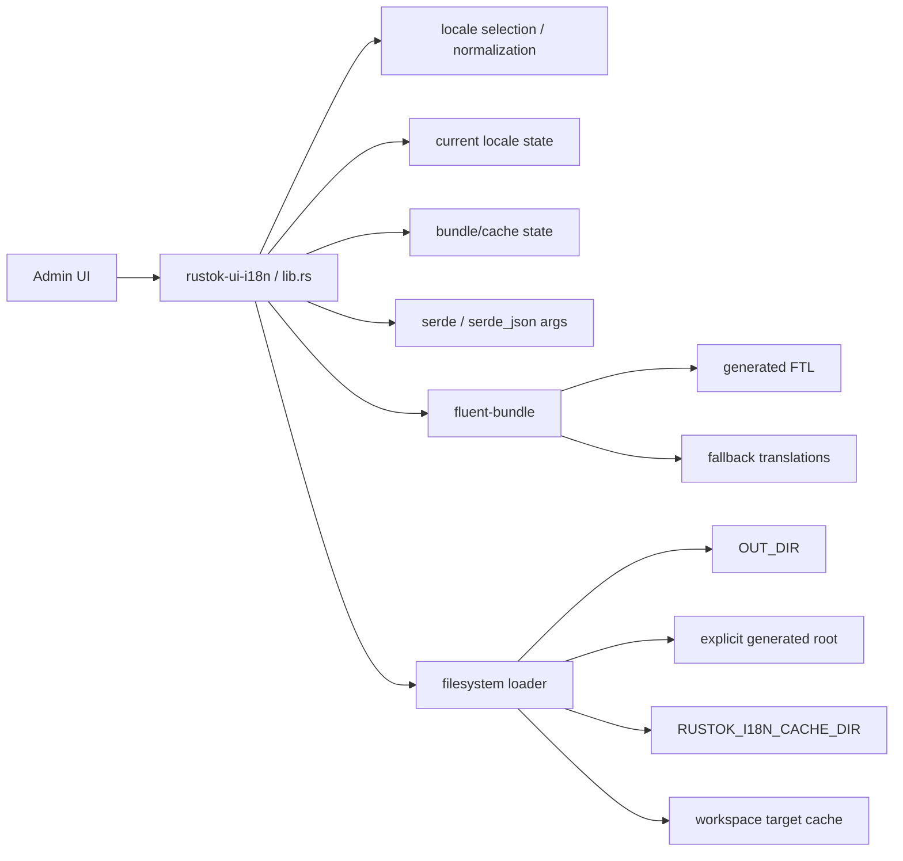
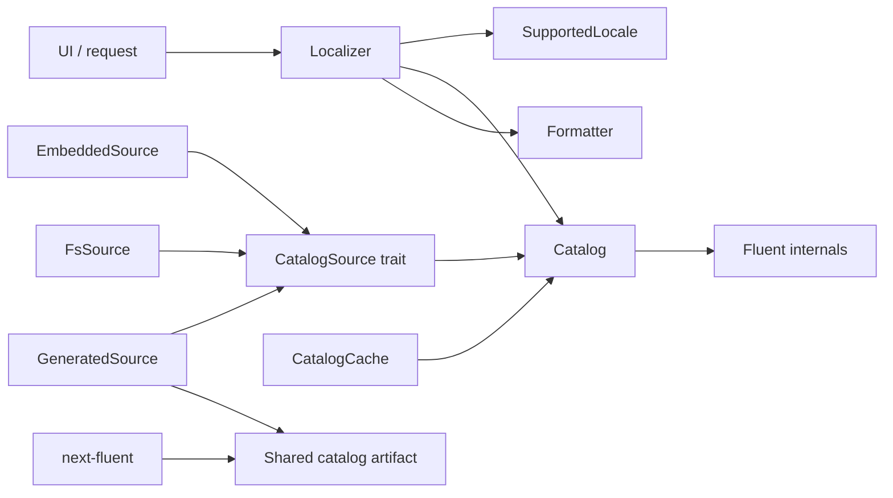
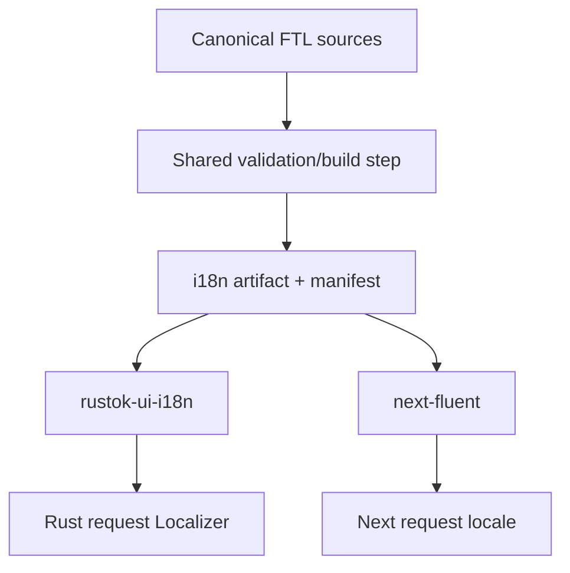
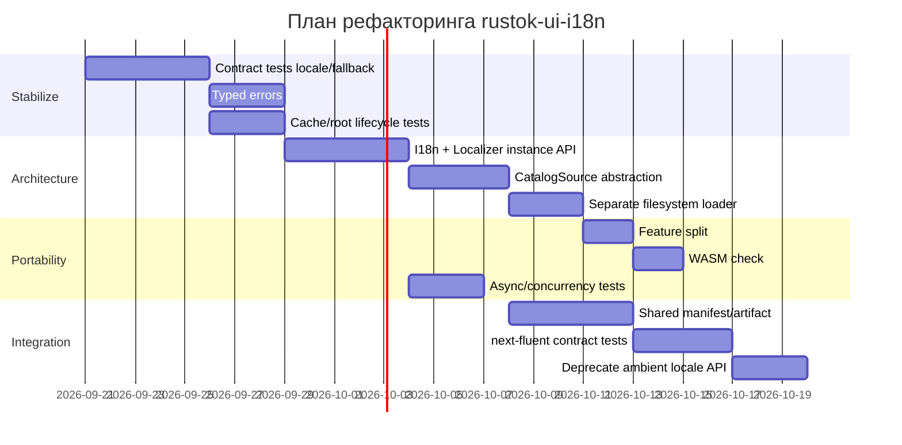

# Аудит `rustok-ui-i18n`: архитектура, ошибки проектирования и план улучшений

## Резюме

Аудит привязан к состоянию `main` на коммите [`843842a2b83dee62b7bd3a0dbd9bfd8470ba3080`](https://github.com/RusTokRs/RusTok/commit/843842a2b83dee62b7bd3a0dbd9bfd8470ba3080). Основной crate находится в [`crates/ui/rustok-ui-i18n`](https://github.com/RusTokRs/RusTok/tree/843842a2b83dee62b7bd3a0dbd9bfd8470ba3080/crates/ui/rustok-ui-i18n).

Главный вывод: **crate решает правильную задачу, но сейчас объединяет слишком много разных уровней ответственности в одном месте**: выбор locale, глобальное состояние locale, Fluent API, файловый loader, поиск build-generated ресурсов, fallback-логику, кэширование и преобразование аргументов. Это делает библиотеку удобной в краткосрочной перспективе, но создаёт несколько серьёзных архитектурных рисков для SSR, async-runtime, WASM и дальнейшей интеграции с `next-fluent`.

Самые важные проблемы, которые я бы исправлял первыми:

| Приоритет | Проблема | Риск | Трудоёмкость |
|---|---|---:|---:|
| **P0** | Process/thread-global состояние locale плохо сочетается с async/SSR | Critical для server-side UI | M |
| **P0** | Глобально изменяемый root generated translations + cache создают проблему жизненного цикла и потенциально stale bundles | High | M |
| **P0** | Не сформулирован жёсткий контракт merge/fallback generated → locale base → English | High | M |
| **P0** | `std::fs` и runtime-discovery каталогов находятся прямо в основном crate | High для WASM/deploy | M |
| **P1** | Публичный API протекает типами `fluent-bundle` | Medium/High | M |
| **P1** | Всё сосредоточено в одном `src/lib.rs` | Medium | S–M |
| **P1** | Locale model — фактически три статических региональных locale, но API принимает общий `LanguageIdentifier` | Medium | S |
| **P1** | README декларирует fallback через `rustok-admin-core`, но прямой dependency на него отсутствует | Medium/High | S |
| **P1** | Нет crate-level feature architecture для filesystem/WASM/serde | Medium | M |
| **P2** | Публичный low-level API слишком велик для маленького façade crate | Medium | S |
| **P2** | Нет явно выделенного стабильного wire/artifact contract с `next-fluent` | Medium | M |

Особенно показательно начало реализации: crate публично re-export'ит Fluent-типы, одновременно импортирует `serde`, `serde_json`, `RefCell`, `HashMap`, filesystem/path API и глобальные synchronization primitives; здесь же зафиксированы поддерживаемые locale и глобальный `GENERATED_I18N_ROOT`. Это уже на первых строках показывает слишком широкую ответственность одного модуля. [`src/lib.rs`, строки 1–16](https://github.com/RusTokRs/RusTok/blob/843842a2b83dee62b7bd3a0dbd9bfd8470ba3080/crates/ui/rustok-ui-i18n/src/lib.rs#L1-L16)

При этом `Cargo.toml` очень маленький: прямые i18n-зависимости — `fluent-bundle 0.16.0`, `intl-memoizer 0.5.3`, `unic-langid 0.9.6`, плюс workspace `serde`/`serde_json`; отдельных features у crate нет. [`Cargo.toml`, строки 1–19](https://github.com/RusTokRs/RusTok/blob/843842a2b83dee62b7bd3a0dbd9bfd8470ba3080/crates/ui/rustok-ui-i18n/Cargo.toml#L1-L19)

> **Ограничение аудита.** Я попытался выполнить именно локальный clone/build, но среда выполнения этого сеанса не смогла резолвить `github.com`, поэтому я не буду ложно утверждать, что `cargo test`, `cargo clippy`, `cargo audit` и WASM-build были успешно прогнаны локально. Исходники текущего `main` были прочитаны через GitHub API/connector. По той же причине ниже я отделяю подтверждённые дефекты архитектуры от мест, для которых нужен динамический прогон. Текущие CI workflow, полный workspace `Cargo.toml` и transitive dependency graph в этом проходе до конца проверить не удалось.

## Архитектура и публичный API

### Один `lib.rs` сейчас является и domain layer, и infrastructure layer

В `src` crate находится один основной модуль `lib.rs`; уже его imports показывают сразу пять различных областей ответственности:

- Fluent representation;
- сериализация argument values;
- locale management;
- filesystem loading;
- global state/cache/concurrency.

Это видно непосредственно по [`src/lib.rs#L1-L16`](https://github.com/RusTokRs/RusTok/blob/843842a2b83dee62b7bd3a0dbd9bfd8470ba3080/crates/ui/rustok-ui-i18n/src/lib.rs#L1-L16).

Текущую архитектуру по доступному коду и задокументированному поведению можно представить так:



README подтверждает, что библиотека одновременно занимается нормализацией locale, cache per locale, filesystem/generated resources и сборкой `FluentBundle`. [`README.md#L3-L19`](https://github.com/RusTokRs/RusTok/blob/843842a2b83dee62b7bd3a0dbd9bfd8470ba3080/crates/ui/rustok-ui-i18n/README.md#L3-L19)

Это стоит разделить хотя бы логически:

```text
src/
  lib.rs
  locale.rs
  localizer.rs
  bundle.rs
  args.rs
  error.rs

  loader/
    mod.rs
    generated.rs
    fs.rs

  cache.rs
```

Ещё лучше — **не давать pure i18n domain layer вообще знать о filesystem**.

Целевая архитектура:



Так `fluent-bundle`, paths, caching и generated-resource discovery становятся реализационными деталями, а не сущностью всей библиотеки.

### Публичный re-export Fluent слишком сильно связывает API с implementation detail

Первая строка:

```rust
pub use fluent_bundle::{FluentArgs, FluentBundle, FluentResource, FluentValue};
```

находится прямо в [`src/lib.rs#L1`](https://github.com/RusTokRs/RusTok/blob/843842a2b83dee62b7bd3a0dbd9bfd8470ba3080/crates/ui/rustok-ui-i18n/src/lib.rs#L1).

Для low-level compatibility это удобно, но означает:

1. `fluent-bundle` фактически становится частью semver-контракта `rustok-ui-i18n`.
2. Переход на другой bundle representation станет breaking change.
3. Любой UI crate может начать самостоятельно собирать/мутировать bundles, обходя ваши invariants.
4. Сложнее гарантировать единый fallback/message-error policy.

Я бы оставил Fluent типы либо в отдельном `raw`/`fluent` namespace, либо вообще не экспортировал их из основной façade API.

Вместо:

```rust
pub use fluent_bundle::{
    FluentArgs,
    FluentBundle,
    FluentResource,
    FluentValue,
};
```

основной API лучше приблизить к:

```rust
pub struct Localizer {
    // Fluent implementation is private.
}

impl Localizer {
    pub fn locale(&self) -> SupportedLocale;

    pub fn text(&self, id: &str) -> Result<String, I18nError>;

    pub fn format(
        &self,
        id: &str,
        args: &MessageArgs,
    ) -> Result<String, I18nError>;
}
```

А при необходимости:

```rust
pub mod fluent {
    pub use fluent_bundle::{FluentArgs, FluentValue};
}
```

можно оставить как явно unstable/advanced escape hatch.

### `normalize_admin_locale()` маскирует более важную domain-модель

В коде зафиксированы ровно три конкретных BCP-47 locale:

```rust
static ADMIN_SUPPORTED_LOCALES: [LanguageIdentifier; 3] =
    [langid!("en-US"), langid!("es-ES"), langid!("ru-RU")];
```

[`src/lib.rs#L11-L12`](https://github.com/RusTokRs/RusTok/blob/843842a2b83dee62b7bd3a0dbd9bfd8470ba3080/crates/ui/rustok-ui-i18n/src/lib.rs#L11-L12)

README со своей стороны говорит о поддержке `en`, `ru`, `es`. [`README.md#L21-L25`](https://github.com/RusTokRs/RusTok/blob/843842a2b83dee62b7bd3a0dbd9bfd8470ba3080/crates/ui/rustok-ui-i18n/README.md#L21-L25)

Это уже два разных уровня представления:

```text
UI/product locale:       en | ru | es
canonical BCP-47 locale: en-US | ru-RU | es-ES
```

Я бы сделал это явным:

```rust
#[derive(Debug, Clone, Copy, PartialEq, Eq, Hash)]
pub enum AdminLocale {
    En,
    Ru,
    Es,
}

impl AdminLocale {
    pub const ALL: &'static [Self] = &[
        Self::En,
        Self::Ru,
        Self::Es,
    ];

    pub const fn language_tag(self) -> &'static str {
        match self {
            Self::En => "en-US",
            Self::Ru => "ru-RU",
            Self::Es => "es-ES",
        }
    }
}
```

И отдельно:

```rust
pub fn negotiate_admin_locale(
    requested: &[LanguageIdentifier],
) -> AdminLocale;
```

Тогда семантика для следующих случаев становится тестируемым contract, а не случайным эффектом реализации:

```text
ru
ru-RU
ru-BY
en
en-GB
es
es-MX
de-DE
zh-CN
```

Особенно важно заранее решить, является ли `es-MX -> es-ES` допустимым language fallback, а `en-GB -> en-US` — ожидаемым поведением. Сейчас публичное название `normalize_admin_locale` скрывает эту продуктовую политику.

### Глобальный generated root — неудачная модель жизненного цикла

На уровне процесса объявлен:

```rust
static GENERATED_I18N_ROOT: OnceLock<RwLock<Option<PathBuf>>> = ...
```

[`src/lib.rs#L14`](https://github.com/RusTokRs/RusTok/blob/843842a2b83dee62b7bd3a0dbd9bfd8470ba3080/crates/ui/rustok-ui-i18n/src/lib.rs#L14).

Одновременно README говорит, что bundles кэшируются per locale и что `set_generated_i18n_root()` входит в API. [`README.md#L3-L8`](https://github.com/RusTokRs/RusTok/blob/843842a2b83dee62b7bd3a0dbd9bfd8470ba3080/crates/ui/rustok-ui-i18n/README.md#L3-L8) [`README.md#L37-L44`](https://github.com/RusTokRs/RusTok/blob/843842a2b83dee62b7bd3a0dbd9bfd8470ba3080/crates/ui/rustok-ui-i18n/README.md#L37-L44)

Это очень неприятное сочетание API.

Если последовательность допустима:

```text
1. admin_bundle_for("ru")
2. cache["ru"] = bundle A
3. set_generated_i18n_root("/new/catalog")
4. admin_bundle_for("ru")
```

возникает принципиальный вопрос: должен вернуться A или bundle из `/new/catalog`?

Даже если текущая реализация каким-то образом инвалидирует cache, API делает этот lifecycle неочевидным.

Лучше один из двух вариантов.

**Вариант A — конфигурация immutable после создания:**

```rust
let i18n = I18n::builder()
    .generated_root(path)
    .default_locale(AdminLocale::En)
    .build()?;
```

**Вариант B — global configuration устанавливается ровно один раз:**

```rust
static GENERATED_ROOT: OnceLock<PathBuf> = OnceLock::new();

pub fn set_generated_i18n_root(
    root: PathBuf,
) -> Result<(), ConfigAlreadyInitialized> {
    GENERATED_ROOT
        .set(root)
        .map_err(|_| ConfigAlreadyInitialized)
}
```

`RwLock<Option<...>>` здесь фактически объявляет конфигурацию изменяемой в любой момент. Это ненужная степень свободы.

### Глобальный/current locale опасен в SSR

README рекомендует:

```text
current_locale()
set_current_locale()
with_current_locale()
```

как основные API. [`README.md#L27-L35`](https://github.com/RusTokRs/RusTok/blob/843842a2b83dee62b7bd3a0dbd9bfd8470ba3080/crates/ui/rustok-ui-i18n/README.md#L27-L35)

Одновременно `lib.rs` импортирует `RefCell`, то есть implementation содержит механизм interior mutability на уровне locale/runtime state. [`src/lib.rs#L4`](https://github.com/RusTokRs/RusTok/blob/843842a2b83dee62b7bd3a0dbd9bfd8470ba3080/crates/ui/rustok-ui-i18n/src/lib.rs#L4)

Я бы **не строил server-side API вокруг implicitly current locale**.

У thread-local locale есть классическая проблема:

```rust
set_current_locale(ru);

foo().await;

// continuation может оказаться в другом worker context
admin_localize("...");
```

У process-global locale проблема ещё хуже: два параллельных requests с `ru` и `es`.

Правильная единица состояния для SSR — request/localizer:

```rust
async fn render_page(
    localizer: &Localizer,
) -> Result<Response, Error> {
    let title = localizer.text("admin-title")?;
    // ...
}
```

То есть:

```rust
let request_i18n = i18n.for_locale(locale);
render(request_i18n).await;
```

Если ergonomics требует ambient context, интеграционный crate может использовать task-local механизм конкретного async runtime, но **core i18n crate не должен делать это своим фундаментальным API**.

`with_current_locale()` можно сохранить для synchronous UI/component scopes, но в документации нужно явно написать, что он не является request-local async context.

## Fluent, fallback и корректность i18n

### Контракт fallback сейчас недостаточно формализован

README обещает следующую семантику:

> generated translation → embedded locale-specific admin translations из `rustok-admin-core` → embedded English base.

Это описано в [`README.md#L21-L25`](https://github.com/RusTokRs/RusTok/blob/843842a2b83dee62b7bd3a0dbd9bfd8470ba3080/crates/ui/rustok-ui-i18n/README.md#L21-L25).

Но `Cargo.toml` самого `rustok-ui-i18n` не содержит прямой зависимости на `rustok-admin-core`: там только Fluent, memoizer, langid, serde и serde_json. [`Cargo.toml#L13-L19`](https://github.com/RusTokRs/RusTok/blob/843842a2b83dee62b7bd3a0dbd9bfd8470ba3080/crates/ui/rustok-ui-i18n/Cargo.toml#L13-L19)

Это не обязательно runtime bug: ресурсы могут попадать сюда через generated artifact/build pipeline. Но **архитектурный контракт документации сейчас не совпадает с dependency contract crate**.

Следует сделать один из вариантов явным:

```text
A. rustok-ui-i18n владеет embedded admin catalogs
B. rustok-admin-core предоставляет CatalogSource
C. build script заранее материализует объединённый artifact
```

Я предпочёл бы **C**.

Например:

```text
target/rustok-i18n/
  manifest.json
  en-US.ftl
  es-ES.ftl
  ru-RU.ftl
```

`manifest.json`:

```json
{
  "schemaVersion": 1,
  "defaultLocale": "en-US",
  "locales": ["en-US", "es-ES", "ru-RU"],
  "fallback": {
    "es-ES": ["es-ES", "en-US"],
    "ru-RU": ["ru-RU", "en-US"]
  }
}
```

Тогда runtime crate вообще не обязан знать, какой workspace crate создал этот catalog.

### Merge должен быть детерминированным и проверяемым

Нельзя оставлять semantics на уровне «добавили несколько FluentResources в некотором порядке».

Нужна отдельная спецификация:

```text
Priority, highest first:

generated/{locale}.ftl
        ↓
embedded admin/{locale}.ftl
        ↓
embedded admin/en-US.ftl
```

И отдельно решить поведение для:

- одинакового message ID в двух resources;
- term override;
- message attributes;
- message без value, но с attributes;
- selector references;
- references на отсутствующие terms;
- Fluent parser errors;
- generated file, который существует, но повреждён.

Особенно важно **не трактовать corrupt translation как “translation absent”**.

То есть это:

```rust
read_file(path)
    .ok()
    .and_then(parse)
    .unwrap_or(fallback)
```

было бы неправильной моделью.

Нужны разные состояния:

```rust
pub enum CatalogLoadError {
    NotFound { ... },
    Io { ... },
    Parse { ... },
    InvalidCatalog { ... },
}
```

Только `NotFound` должен естественным образом инициировать поиск следующего source.

### Нужен typed error API

Для библиотеки уровня UI infrastructure я бы не позволял parser/filesystem errors исчезать.

Пример:

```rust
#[derive(Debug)]
pub enum I18nError {
    UnsupportedLocale {
        requested: LanguageIdentifier,
    },

    ReadCatalog {
        locale: LanguageIdentifier,
        path: PathBuf,
        source: std::io::Error,
    },

    ParseCatalog {
        locale: LanguageIdentifier,
        path: PathBuf,
        errors: Vec<String>,
    },

    MissingMessage {
        locale: LanguageIdentifier,
        id: String,
    },

    MissingMessageValue {
        locale: LanguageIdentifier,
        id: String,
    },

    Format {
        locale: LanguageIdentifier,
        id: String,
        errors: Vec<String>,
    },

    InvalidArgument {
        name: String,
    },
}
```

А ergonomics API можно разделить:

```rust
pub fn try_localize(...) -> Result<String, I18nError>;
```

и отдельно, если UI действительно хочет graceful degradation:

```rust
pub fn localize_lossy(...) -> String;
```

Это гораздо лучше, чем делать silent fallback базовой семантикой.

### `serde_json::Value` не должен становиться i18n type system

В core импортируются одновременно `serde::Serialize` и `serde_json::Value`. [`src/lib.rs#L2-L3`](https://github.com/RusTokRs/RusTok/blob/843842a2b83dee62b7bd3a0dbd9bfd8470ba3080/crates/ui/rustok-ui-i18n/src/lib.rs#L2-L3)

Если текущая схема аргументов примерно такая:

```text
Serialize
   ↓
serde_json::Value
   ↓
FluentArgs
```

то стоит очень чётко ограничить поддерживаемые значения. Fluent message arguments — не произвольный JSON document.

Например, следует разрешить:

```rust
pub enum MessageValue {
    String(String),
    Number(f64),
}
```

либо сделать conversion trait:

```rust
pub trait IntoMessageValue {
    fn into_message_value(self) -> MessageValue;
}
```

Тогда попытка передать:

```json
{
  "user": {
    "name": "Ivan"
  }
}
```

не превращается неявно во что-то вроде JSON string.

`serde` convenience можно вынести в opt-in helper/feature.

### Pluralization необходимо тестировать через Fluent, а не собственными правилами

Для русского особенно нужны regression cases:

```text
1
2
5
11
21
22
25
101
102
105
1.5
```

Тест должен проверять **получившийся текст**, а не категорию, вычисленную независимо от Fluent.

Например FTL:

```ftl
items =
    { $count ->
        [one] { $count } элемент
        [few] { $count } элемента
       *[many] { $count } элементов
    }
```

и table-driven Rust test:

```rust
#[test]
fn russian_cardinal_pluralization() {
    let cases = [
        (1, "1 элемент"),
        (2, "2 элемента"),
        (5, "5 элементов"),
        (11, "11 элементов"),
        (21, "21 элемент"),
        (22, "22 элемента"),
        (25, "25 элементов"),
    ];

    for (count, expected) in cases {
        assert_eq!(
            format_message("ru-RU", "items", count),
            expected,
        );
    }
}
```

То же нужно сделать для Spanish/English, decimals и formatted numbers.

### Filesystem loader нельзя считать универсальным runtime mechanism

README задаёт четыре источника:

```text
${OUT_DIR}/rustok-admin-i18n/{locale}.ftl
explicit set_generated_i18n_root()
RUSTOK_I18N_CACHE_DIR
${workspace-target-dir}/rustok-i18n-cache
```

[`README.md#L10-L19`](https://github.com/RusTokRs/RusTok/blob/843842a2b83dee62b7bd3a0dbd9bfd8470ba3080/crates/ui/rustok-ui-i18n/README.md#L10-L19)

Для build tooling это приемлемо. Для runtime library это уже хрупко.

После:

```text
cargo build
docker build
copy binary only
```

никакого workspace target directory вообще может не существовать.

Для WASM filesystem contract ещё менее подходящий; при этом `std::fs` и `Path` импортируются непосредственно core module. [`src/lib.rs#L6-L8`](https://github.com/RusTokRs/RusTok/blob/843842a2b83dee62b7bd3a0dbd9bfd8470ba3080/crates/ui/rustok-ui-i18n/src/lib.rs#L6-L8)

Рекомендованный dependency inversion:

```rust
pub trait CatalogSource {
    fn load(
        &self,
        locale: &LanguageIdentifier,
    ) -> Result<Option<CatalogData>, CatalogError>;
}
```

Native adapter:

```rust
pub struct FsCatalogSource {
    root: PathBuf,
}
```

Embedded/WASM adapter:

```rust
pub struct EmbeddedCatalogSource {
    // include_str!, generated static data, etc.
}
```

Core formatter тогда вообще ничего не знает о `std::fs`.

### Feature flags

Сейчас crate-specific features в показанном `Cargo.toml` отсутствуют. [`Cargo.toml#L1-L19`](https://github.com/RusTokRs/RusTok/blob/843842a2b83dee62b7bd3a0dbd9bfd8470ba3080/crates/ui/rustok-ui-i18n/Cargo.toml#L1-L19)

Я бы пришёл примерно к следующему:

```toml
[features]
default = ["fs-loader"]

fs-loader = []
serde-args = [
    "dep:serde",
    "dep:serde_json",
]

[dependencies]
fluent-bundle = "0.16"
unic-langid = { version = "0.9", features = ["macros"] }

serde = { workspace = true, optional = true }
serde_json = { workspace = true, optional = true }
```

И отдельно проверить, действительно ли `intl-memoizer` должен быть **прямой** dependency crate. Сейчас он явно прописан в [`Cargo.toml#L14-L16`](https://github.com/RusTokRs/RusTok/blob/843842a2b83dee62b7bd3a0dbd9bfd8470ba3080/crates/ui/rustok-ui-i18n/Cargo.toml#L14-L16). Если он нужен только потому, что его тип просачивается из `FluentBundle`, это ещё один аргумент спрятать Fluent internals за собственным façade.

Я сознательно не называю «последнюю» версию этих crates: в данном проходе registry resolution не был доступен, и придумывать версии на сентябрь 2026 года было бы хуже, чем оставить upgrade step воспроизводимым.

## Concurrency, производительность, WASM и безопасность

### Bundle cache должен учитывать identity каталога

README прямо говорит о cache per locale. [`README.md#L3-L8`](https://github.com/RusTokRs/RusTok/blob/843842a2b83dee62b7bd3a0dbd9bfd8470ba3080/crates/ui/rustok-ui-i18n/README.md#L3-L8)

Но если translation source может меняться через `set_generated_i18n_root()`, ключ:

```rust
HashMap<LanguageIdentifier, Bundle>
```

логически недостаточен.

Минимум нужен:

```rust
struct CacheKey {
    locale: AdminLocale,
    generation: u64,
}
```

Но я не рекомендую generation counters, если их можно избежать. Лучше immutable instance:

```rust
let first = I18n::builder()
    .catalog_root("/v1")
    .build()?;

let second = I18n::builder()
    .catalog_root("/v2")
    .build()?;
```

Тогда cache принадлежит `I18n`, а конфигурация никогда не меняется под ним.

### Не нужно бездумно шарить обычный Fluent bundle между threads

По imports видно использование `Arc`, `OnceLock` и `RwLock`. [`src/lib.rs#L8`](https://github.com/RusTokRs/RusTok/blob/843842a2b83dee62b7bd3a0dbd9bfd8470ba3080/crates/ui/rustok-ui-i18n/src/lib.rs#L8)

При рефакторинге необходимо принять явное решение:

```text
A. bundle immutable + concurrent-capable → shared Arc
B. catalog shared, formatter/bundle local to execution context
```

Не следует просто добавлять `Arc<FluentBundle<_>>`, пока `Send + Sync` semantics конкретного bundle/memoizer не подтверждены compiler'ом и тестами.

Очень хороший compile-time test:

```rust
fn assert_send_sync<T: Send + Sync>() {}

#[test]
fn cached_catalog_is_thread_safe() {
    assert_send_sync::<CachedCatalog>();
}
```

### Cache лучше ставить после parsing, но до request-specific formatting

Оптимальный pipeline:

```text
disk / embedded bytes
        │
        ▼
parse + validate        ← один раз
        │
        ▼
immutable catalog       ← cache
        │
        ▼
request Localizer
        │
        ▼
format(id, args)
```

Не следует cache'ировать rendered strings глобально, потому что key быстро превращается в:

```text
(locale, message_id, every argument, formatting context)
```

и такой cache почти наверняка принесёт больше сложности, чем выгоды.

### Path discovery надо убрать из production hot path

README допускает последовательный поиск нескольких locations. [`README.md#L10-L19`](https://github.com/RusTokRs/RusTok/blob/843842a2b83dee62b7bd3a0dbd9bfd8470ba3080/crates/ui/rustok-ui-i18n/README.md#L10-L19)

Поиск можно делать при construction:

```rust
let source = GeneratedSource::discover()?;
let i18n = I18n::new(source)?;
```

а не при каждом:

```rust
admin_bundle_for(locale)
```

или `admin_localize()`.

### WASM

С текущим прямым `std::fs` dependency в основном модуле [`src/lib.rs#L6`](https://github.com/RusTokRs/RusTok/blob/843842a2b83dee62b7bd3a0dbd9bfd8470ba3080/crates/ui/rustok-ui-i18n/src/lib.rs#L6) я бы добавил обязательный CI-check:

```bash
rustup target add wasm32-unknown-unknown

cargo check \
  -p rustok-ui-i18n \
  --target wasm32-unknown-unknown \
  --no-default-features
```

Цель не обязательно делать filesystem loader работающим в браузере. Цель — сделать **core locale/catalog/formatting code portable**, а native loader включать feature-флагом.

### Security boundary generated FTL

Само наличие configurable filesystem root означает, что его источник следует считать trust boundary. README публично документирует `set_generated_i18n_root()` и несколько filesystem locations. [`README.md#L10-L19`](https://github.com/RusTokRs/RusTok/blob/843842a2b83dee62b7bd3a0dbd9bfd8470ba3080/crates/ui/rustok-ui-i18n/README.md#L10-L19)

Хорошая модель:

```rust
pub struct TrustedCatalogRoot(PathBuf);

impl TrustedCatalogRoot {
    pub fn new(path: impl Into<PathBuf>) -> Result<Self, RootError> {
        // validate/canonicalize according to deployment policy
    }
}
```

При этом locale filename должен формироваться **только из уже negotiated enum**, а не из пользовательской строки:

```rust
root.join(locale.file_name())
```

вместо:

```rust
root.join(format!("{user_locale}.ftl"))
```

У текущего фиксированного массива locale риск path traversal уже естественно уменьшается, но этот invariant лучше выразить типом, а не рассчитывать, что его никогда не обойдут.

### `unsafe`, ownership и panic-paths

В проверенном верхнем слое архитектуры нет основания подозревать необходимость ручного `unsafe`: задача полностью решается безопасными Rust abstractions. Я **не отмечаю `unsafe`, `unwrap()`, `expect()` или lock poisoning как подтверждённые баги**, потому что локальный grep/build в этом сеансе закончить не удалось.

Тем не менее для CI нужны жёсткие автоматические проверки:

```bash
rg '\bunsafe\b|unwrap\(|expect\(|panic!\(' crates/ui/rustok-ui-i18n

cargo clippy \
  -p rustok-ui-i18n \
  --all-targets \
  --all-features \
  -- \
  -D warnings \
  -D clippy::unwrap_used \
  -D clippy::expect_used
```

Для library crate особенно нежелателен вариант:

```rust
CACHE.read().unwrap()
```

Потому что poisoning internal lock не должен внезапно превращать обычный `admin_localize()` в process panic. В зависимости от дизайна лучше либо восстанавливать inner state осознанно, либо не иметь process-global mutable lock вообще.

## Тестирование, CI, зависимости и package hygiene

### Самый важный пробел — contract tests

README декларирует достаточно сложное поведение: locale normalization, cache, generated resource lookup, merge validation и fallback. [`README.md#L3-L25`](https://github.com/RusTokRs/RusTok/blob/843842a2b83dee62b7bd3a0dbd9bfd8470ba3080/crates/ui/rustok-ui-i18n/README.md#L3-L25)

Это должно быть зафиксировано тестами не по отдельным helper-функциям, а как публичный контракт.

Минимальная матрица:

| Область | Обязательные случаи | Приоритет |
|---|---|---:|
| Locale negotiation | `ru`, `ru-RU`, `ru-BY`, `es-MX`, `en-GB`, unknown | P0 |
| Fallback | generated → localized embedded → English | P0 |
| Invalid generated FTL | parse failure ≠ missing file | P0 |
| Override | одинаковый ID в двух layers | P0 |
| Russian plurals | 1, 2, 5, 11, 21, 22, 25 | P0 |
| Select expressions | one/few/many/other | P0 |
| Missing ID | typed error / chosen fallback policy | P0 |
| Missing message value | attributes-only messages | P1 |
| Cache | повторный load не reparses source | P1 |
| Root mutation | contract до/после initialization | P0 |
| Concurrency | много simultaneous locales | P0 |
| Async | отсутствие locale bleed между requests | P0 |
| Paths | OUT_DIR/custom/cache precedence | P1 |
| WASM | core `cargo check` | P1 |
| Serde args | bool/string/integer/float/null/object/array | P1 |

Особенно ценен property-style invariant:

```text
Для каждого supported locale:
  все обязательные IDs из en-US
  либо существуют в locale,
  либо намеренно покрываются documented fallback.
```

Это ловит реальные production regressions раньше runtime.

### FTL validation должна быть build/CI стадией

Вместо того чтобы впервые обнаруживать invalid resource во время UI request:

```text
.ftl source
   ↓
CI validator
   ↓
normalized/generated catalog
   ↓
runtime
```

Нужен workspace tool вроде:

```bash
cargo xtask i18n check
```

который проверяет:

```text
parse errors
duplicate IDs
unknown/missing mandatory IDs
terms
attributes
locale manifest
fallback graph cycles
generated artifact reproducibility
```

Для Rust и Next.js это особенно выгодно, потому что один validator может гарантировать общий contract.

### Рекомендуемый CI pipeline

Поскольку существующие GitHub Actions в этом проходе полностью верифицировать не удалось, это именно **целевое состояние**, а не утверждение о том, чего сейчас нет.

```yaml
jobs:
  rustok-ui-i18n:
    runs-on: ubuntu-latest

    steps:
      - uses: actions/checkout@v4

      - uses: dtolnay/rust-toolchain@stable
        with:
          components: rustfmt, clippy
          targets: wasm32-unknown-unknown

      - run: cargo fmt --all -- --check

      - run: >
          cargo clippy
          -p rustok-ui-i18n
          --all-targets
          --all-features
          -- -D warnings

      - run: >
          cargo test
          -p rustok-ui-i18n
          --all-features

      - run: >
          cargo check
          -p rustok-ui-i18n
          --target wasm32-unknown-unknown
          --no-default-features

      - run: cargo xtask i18n check
```

Отдельными security/license jobs:

```bash
cargo audit
cargo deny check advisories
cargo deny check licenses
cargo deny check bans
cargo deny check sources
```

### Dependency plan

Текущие direct dependencies перечислены в [`Cargo.toml#L13-L19`](https://github.com/RusTokRs/RusTok/blob/843842a2b83dee62b7bd3a0dbd9bfd8470ba3080/crates/ui/rustok-ui-i18n/Cargo.toml#L13-L19).

Рекомендую не начинать с массового version bump. Сначала уменьшить surface:

| Dependency | Сейчас | Рекомендация |
|---|---:|---|
| `fluent-bundle` | `0.16.0` | Оставить core engine, но убрать типы из главного public API |
| `intl-memoizer` | `0.5.3` | Проверить, действительно ли нужен как direct dependency |
| `unic-langid` | `0.9.6` + macros | Оставить; encapsulate через `AdminLocale` |
| `serde` | workspace | Сделать optional, если нужен только generic args conversion |
| `serde_json` | workspace | Убрать из core argument model или сделать optional |

После API cleanup:

```bash
cargo update -p fluent-bundle
cargo update -p unic-langid
cargo tree -p rustok-ui-i18n
cargo machete
cargo audit
```

И только затем переходить через minor/major dependency boundaries с тестами pluralization/fallback.

Особенно важно не привязывать обновление `fluent-bundle` к breaking change вашего public API. Сейчас прямой re-export [`src/lib.rs#L1`](https://github.com/RusTokRs/RusTok/blob/843842a2b83dee62b7bd3a0dbd9bfd8470ba3080/crates/ui/rustok-ui-i18n/src/lib.rs#L1) делает такую связь существенно сильнее, чем необходимо.

### License

Сам crate наследует:

```toml
license.workspace = true
repository.workspace = true
```

[`Cargo.toml#L1-L8`](https://github.com/RusTokRs/RusTok/blob/843842a2b83dee62b7bd3a0dbd9bfd8470ba3080/crates/ui/rustok-ui-i18n/Cargo.toml#L1-L8).

Поэтому отсутствие локального `license = "..."` здесь **не является ошибкой**. Но значение workspace license и фактический LICENSE artifact в этом проходе подтвердить не удалось. Перед публикацией crate CI должен проверять:

```bash
cargo metadata --no-deps
cargo package -p rustok-ui-i18n --list
cargo deny check licenses
```

И отдельно убедиться, что LICENSE действительно попадает в distribution/package contract.

## Конкретный рефакторинг

Я бы не переписывал библиотеку целиком. Её можно достаточно безопасно эволюционировать.

### Сначала ввести instance API рядом со старым

```rust
#[derive(Clone)]
pub struct I18n {
    inner: Arc<I18nInner>,
}

struct I18nInner {
    default_locale: AdminLocale,
    source: Arc<dyn CatalogSource + Send + Sync>,
    cache: CatalogCache,
}

impl I18n {
    pub fn builder() -> I18nBuilder {
        I18nBuilder::default()
    }

    pub fn for_locale(
        &self,
        locale: AdminLocale,
    ) -> Localizer {
        Localizer {
            i18n: self.clone(),
            locale,
        }
    }
}
```

Request object:

```rust
#[derive(Clone)]
pub struct Localizer {
    i18n: I18n,
    locale: AdminLocale,
}

impl Localizer {
    pub fn locale(&self) -> AdminLocale {
        self.locale
    }

    pub fn text(
        &self,
        id: &str,
    ) -> Result<String, I18nError> {
        self.format(id, MessageArgs::default())
    }

    pub fn format(
        &self,
        id: &str,
        args: MessageArgs,
    ) -> Result<String, I18nError> {
        // ...
    }
}
```

Это сразу устраняет необходимость использовать `set_current_locale()` в server request path.

### Потом вынести source abstraction

```rust
pub trait CatalogSource {
    fn load(
        &self,
        locale: AdminLocale,
    ) -> Result<Option<CatalogInput>, I18nError>;
}

pub struct CatalogInput {
    pub origin: CatalogOrigin,
    pub source: Arc<str>,
}
```

Filesystem:

```rust
#[cfg(feature = "fs-loader")]
pub struct FsCatalogSource {
    root: PathBuf,
}

#[cfg(feature = "fs-loader")]
impl CatalogSource for FsCatalogSource {
    fn load(
        &self,
        locale: AdminLocale,
    ) -> Result<Option<CatalogInput>, I18nError> {
        let path = self.root.join(locale.file_name());

        match std::fs::read_to_string(&path) {
            Ok(source) => Ok(Some(CatalogInput {
                origin: CatalogOrigin::Path(path),
                source: source.into(),
            })),

            Err(err) if err.kind() == std::io::ErrorKind::NotFound => {
                Ok(None)
            }

            Err(source) => Err(I18nError::ReadCatalog {
                path,
                source,
            }),
        }
    }
}
```

Ключевая деталь здесь — `NotFound` отделён от настоящей I/O ошибки.

### Затем сделать fallback отдельной сущностью

```rust
pub struct FallbackChain {
    locales: Box<[AdminLocale]>,
}

impl FallbackChain {
    pub fn for_locale(locale: AdminLocale) -> Self {
        match locale {
            AdminLocale::En => Self::new([
                AdminLocale::En,
            ]),
            AdminLocale::Ru => Self::new([
                AdminLocale::Ru,
                AdminLocale::En,
            ]),
            AdminLocale::Es => Self::new([
                AdminLocale::Es,
                AdminLocale::En,
            ]),
        }
    }
}
```

И source layering:

```rust
let source = LayeredCatalogSource::new([
    generated,
    embedded_admin,
]);
```

Таким образом две разные концепции перестают смешиваться:

```text
source precedence != locale fallback
```

Это важное различие.

### Затем отказаться от runtime workspace discovery

Текущее документированное поведение включает fallback до `${workspace-target-dir}/rustok-i18n-cache`. [`README.md#L12-L19`](https://github.com/RusTokRs/RusTok/blob/843842a2b83dee62b7bd3a0dbd9bfd8470ba3080/crates/ui/rustok-ui-i18n/README.md#L12-L19)

В production runtime лучше:

```rust
I18n::builder()
    .catalog_source(FsCatalogSource::new(root))
    .build()
```

А auto-discovery оставить только developer/build helper:

```rust
#[cfg(feature = "build-discovery")]
pub fn discover_generated_catalog() -> ...
```

### Сохранить backwards compatibility через deprecated façade

Старые:

```rust
current_locale()
set_current_locale()
with_current_locale()
admin_bundle_for()
admin_localize()
```

README перечисляет их как основные API. [`README.md#L27-L35`](https://github.com/RusTokRs/RusTok/blob/843842a2b83dee62b7bd3a0dbd9bfd8470ba3080/crates/ui/rustok-ui-i18n/README.md#L27-L35)

Их можно не ломать сразу:

```rust
#[deprecated(
    note = "Pass Localizer explicitly in async/server-side code"
)]
pub fn admin_localize(...) -> ... {
    default_i18n()
        .for_locale(current_locale())
        .format(...)
}
```

После одного migration cycle убрать ambient-state APIs из server-side paths.

## Интеграция с `next-fluent` и план внедрения

### Rust и Next.js не должны разделять runtime state — они должны разделять artifact contract

Это ключевой архитектурный момент.

Не нужно пытаться сделать так:

```text
next-fluent
   ↓
вызывает семантически те же mutable/global helpers,
что Rust UI
```

Нужно:



То есть общий contract состоит из:

```text
locale IDs
fallback chain
message IDs
FTL syntax
catalog precedence
schema/version
hash/content revision
```

а loaders у Rust и JavaScript могут быть совершенно разными.

### Предлагаемый generated artifact

Например:

```text
generated/i18n/
  manifest.json
  en-US.ftl
  ru-RU.ftl
  es-ES.ftl
```

Manifest:

```json
{
  "schemaVersion": 1,
  "defaultLocale": "en-US",
  "locales": [
    "en-US",
    "ru-RU",
    "es-ES"
  ],
  "fallbacks": {
    "ru-RU": ["ru-RU", "en-US"],
    "es-ES": ["es-ES", "en-US"],
    "en-US": ["en-US"]
  }
}
```

Rust loader:

```rust
I18n::from_manifest(path)?;
```

Next loader:

```ts
await createFluent({
  manifest,
  locale,
});
```

Самое главное: **одинаковый manifest, одинаковые FTL resources и contract tests**, а не дублирование locale logic в двух библиотеках.

### SSR locale всегда должен принадлежать request

Для Next.js это:

```ts
const locale = resolveLocale(request);
const i18n = await getLocalizer(locale);
```

Для Rust:

```rust
let locale = negotiate_locale(request.headers());
let i18n = app_i18n.for_locale(locale);
```

Ни одна сторона не должна делать концептуально:

```text
set_global_current_locale(request_locale)
render()
```

Это даст одинаково безопасную модель и для Next.js concurrent rendering, и для Rust async server.

### Порядок внедрения



Это не требует big-bang rewrite. Практически я бы разбил работу на четыре изменения.

**Первая итерация — зафиксировать поведение.** Добавить locale/fallback/plural/cache tests и typed errors, ничего принципиально не ломая.

**Вторая итерация — ввести `I18n` / `Localizer`.** Старые global API пока оставить wrapper'ами.

**Третья итерация — отделить `CatalogSource` и filesystem.** После этого появится нормальная WASM boundary и исчезнет runtime coupling к workspace layout.

**Четвёртая итерация — общий artifact contract с `next-fluent`.** После стабилизации Rust API можно синхронизировать fallback semantics и generated resources между Rust и Next.js без связывания их runtime implementations.

Итоговая целевая API-поверхность могла бы быть очень маленькой:

```rust
pub enum AdminLocale {
    En,
    Ru,
    Es,
}

pub struct I18n { /* private */ }

pub struct Localizer { /* private */ }

pub struct MessageArgs { /* private */ }

pub enum I18nError { /* ... */ }

impl I18n {
    pub fn builder() -> I18nBuilder;

    pub fn for_locale(
        &self,
        locale: AdminLocale,
    ) -> Localizer;
}

impl Localizer {
    pub fn locale(&self) -> AdminLocale;

    pub fn text(
        &self,
        id: &str,
    ) -> Result<String, I18nError>;

    pub fn format(
        &self,
        id: &str,
        args: &MessageArgs,
    ) -> Result<String, I18nError>;
}
```

А всё остальное:

```text
FluentBundle
FluentResource
intl-memoizer
serde_json::Value
filesystem discovery
RwLock
cache layout
generated directory layout
```

становится **реализационной деталью**, которой и должно быть.

Именно это, на мой взгляд, является главным направлением улучшения `rustok-ui-i18n`: не менять Fluent и не усложнять саму локализацию, а превратить crate из набора глобальных i18n helper'ов в маленький, типобезопасный, request-safe и backend-independent localization service.