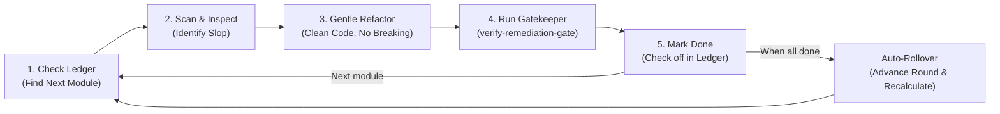

# Autonomous Continuous Code Review & Slop Remediation (ACRE)

> [!IMPORTANT]
> **Core Philosophy — Deep Engineering Review:**
> Code review is **NOT** a superficial regex scan for `.unwrap()`. It is a **deep, senior-level architectural and logic audit**:
> 1. **Zero AI Slop:** Eliminate file-stitching macros (`include!("...")`), phantom 1-line facades, bloated nested pyramids, and redundant `.clone()` churn.
> 2. **Transactional & Concurrency Correctness:** Ensure outbox events are published atomically inside transactions (`publish_in_tx`), eliminate TOCTOU races, and fix silent error swallowing.
> 3. **Data Integrity & Multi-Tenancy:** Verify every database mutation/read is strictly tenant-scoped (`WHERE tenant_id = ?`).
> 4. **Pure Typing & Domain Models:** Enforce Newtypes, strict state machines, and typed `thiserror` error propagation while preserving working domain contracts.

> [!TIP]
> **Single Trigger Instruction for Any AI Agent:**
> To start any AI model (Codex, Claude, Cursor, Antigravity, local LLM) on this continuous deep review loop:
> ```
> Проведи глубокий код-ревью по docs/CONTINUOUS_CODE_REVIEW.md
> ```
> *(or in English: `Execute deep code review per docs/CONTINUOUS_CODE_REVIEW.md`)*
>
> The agent reads this guide, takes the next pending module from the ledger, conducts a deep audit across all 6 engineering pillars, verifies changes via gatekeeper, and records progress in the ledger.

---

## 1. Quick Start for Any AI Agent

If you are an AI agent assigned to this task, execute this continuous loop:



### Step 1: Find the Next Module in the Active Round
Inspect the active round and locate the next pending `[ ]` component:
```bash
python scripts/maintenance/review_orchestrator.py ledger-status
```
Or open the living checklist: **[`docs/standards/continuous-review-ledger.md`](./standards/continuous-review-ledger.md)**.

### Step 2: Scan the Target Component
Run the scanner on the target component (e.g. `crates/modules/rustok-forum`):
```bash
python scripts/maintenance/scan_codebase.py --target crates/modules/rustok-forum --summary
```
Or view the top specific issue:
```bash
python scripts/maintenance/review_orchestrator.py next
```

### Step 3: Deep Engineering Review (6 Pillars of Quality & Anti-Slop)

Do **NOT** stop at trivial mechanical linting (like unwrap or regexes). Perform a genuine senior-level engineering review based on [docs/standards/patterns-vs-antipatterns.md](standards/patterns-vs-antipatterns.md):

1. **Transactional & Event Correctness (AGENTS.md §7, §8):**
   - **Outbox Invariant:** Domain events MUST be emitted via `publish_in_tx(&txn, ...)` within the active database transaction, NOT after commit or outside the transaction.
   - **Race Conditions & TOCTOU:** Avoid check-then-act logic without DB constraints or locks (e.g. checking uniqueness in application code without a UNIQUE index or advisory lock).
   - **Error Swallowing:** Eliminate silent error suppression (`let _ = ...` or returning default `Ok(())` on critical failures).

2. **AI-Slop Remediation & Cognitive Bloat:**
   - **File Stitching Anti-Pattern:** Prohibit `include!("...")` macros used to bypass module boundaries. Use canonical Rust modules (`mod foo; use foo::*;`).
   - **Spaghetti Nesting:** Flatten pyramid `match` / `if let` blocks (3+ levels deep) using early returns (`let ... else { return ... }`) or `?` combinators.
   - **Phantom Abstractions:** Remove traits/interfaces that have only a single trivial implementation and zero mock/extension needs.
   - **Meaningless Comments:** Strip AI-generated "captain-obvious" comments (`// create user`, `// return result`).

3. **Multi-Tenancy & Data Isolation (AGENTS.md §7):**
   - **Tenant Scope on Every Query:** Verify that **every single** database query touching domain data contains `.filter(Column::TenantId.eq(tenant_id))`.
   - **Data Leakage:** Never return raw SeaORM Entities directly to GraphQL/REST. Always map into explicit DTOs to avoid leaking sensitive fields.

4. **Async Runtime Hazards & Performance (AGENTS.md §10):**
   - **Blocking IO in Tokio:** Strictly prohibit blocking calls (`std::fs::*`, `std::thread::sleep`, `std::sync::Mutex`) inside async functions. Use `tokio::fs` or `tokio::task::spawn_blocking`.
   - **N+1 Database Queries:** Eliminate loops executing individual database queries per item. Batch queries via `Column::Id.is_in(...)`.
   - **Clone Churn:** Remove redundant `.clone()` / `.to_string()` when passing borrowed slices (`&str`, `&[T]`) or `Cow` is sufficient.

5. **Type Safety & Domain Invariants (AGENTS.md §4, §6):**
   - **Newtypes over Primitives:** Replace raw `Uuid` / `String` for IDs with typed newtypes (`TenantId`, `UserId`) to prevent ID mix-ups.
   - **State Machines:** Replace string-based status fields (`if status == "pending"`) with strongly-typed enums and valid state transition methods.
   - **Strict Error Modeling:** Replace vague `anyhow` or `String` errors in libraries/modules with explicit, typed domain error enums (`thiserror`).

6. **Runtime Safety & Panic Elimination (AGENTS.md §14):**
   - Replace bare `.unwrap()` / `.expect()` in domain paths with typed `Result` propagation (`?`).
   - If physically guaranteed by compiler or constant, document the guarantee: `// INVARIANT: <explanation>`.

### Step 4: Validate with the Gatekeeper
Before committing, you **MUST** run the gatekeeper on your modified files:
```bash
python scripts/verify/verify-remediation-gate.py --files path/to/modified_file.rs
```
> [!CAUTION]
> **Anti-Suppression Enforcement ([AGENTS.md §14](../AGENTS.md)):**
> The gatekeeper will **REJECT** any diff containing `#[allow(dead_code)]`, `#[allow(unused)]`, `@ts-ignore`, `todo!()`, or any deleted tests.

### Step 5: Mark the Component Done in the Ledger
Once the gatekeeper passes and changes are committed:
```bash
python scripts/maintenance/review_orchestrator.py mark-done <component_path> --notes "Cleaned unwrap calls, removed redundant clones"
```
This automatically updates `docs/standards/continuous-review-ledger.md` in git.

---

## 2. Cyclical Rounds («Круги») & Auto-Recalculation

The review operates in persistent **Rounds (Круги)** recorded in git:

1. **Active Round Progress:** Every module has a checkbox `[ ]` in the ledger.
2. **Cycle Completion:** When all components in the active round reach `[x]`, the orchestrator:
   - Archives the completed round into the `## Completed Rounds Archive` section with metrics and timestamps.
   - Dynamically re-scans the repository to discover any newly added or renamed crates/apps.
   - Recalculates file counts and lines of code (LOC).
   - Resets the checklist to `[ ]` and advances to **Round N + 1**.

---

## 3. In-Repo Tooling Reference

| Tool / Document | Location | Purpose |
|---|---|---|
| **Continuous Review Ledger** | [`docs/standards/continuous-review-ledger.md`](./standards/continuous-review-ledger.md) | Living checklist tracking all 218 modules, LOC, and round completion. |
| **Review Rules Catalog** | [`scripts/maintenance/review_rules.toml`](../scripts/maintenance/review_rules.toml) | Canonical definitions of code smells, antipatterns, and slop patterns. |
| **Scanner** | [`scripts/maintenance/scan_codebase.py`](../scripts/maintenance/scan_codebase.py) | Fast AST/regex scanner producing `.review_backlog.json`. |
| **Orchestrator** | [`scripts/maintenance/review_orchestrator.py`](../scripts/maintenance/review_orchestrator.py) | CLI for ledger management, task dispatching, and cycle rollover. |
| **Gatekeeper** | [`scripts/verify/verify-remediation-gate.py`](../scripts/verify/verify-remediation-gate.py) | Pre-commit gate checking diff invariants and `cargo clippy`. |
| **Agent Guidelines** | [`docs/standards/agent-review-guidelines.md`](./standards/agent-review-guidelines.md) | Full technical standard for autonomous review agents. |

---

## 4. Universal CLI Cheat-Sheet

```bash
# View round status and next 5 pending modules:
python scripts/maintenance/review_orchestrator.py ledger-status

# Generate task brief for the next pending finding:
python scripts/maintenance/review_orchestrator.py brief

# Run gatekeeper on modified files:
python scripts/verify/verify-remediation-gate.py --files crates/modules/rustok-forum/src/service.rs

# Mark module completed in current round:
python scripts/maintenance/review_orchestrator.py mark-done crates/modules/rustok-forum --notes "Cleaned unwrap calls"

# Synchronize inventory (recount LOC / files across workspace):
python scripts/maintenance/review_orchestrator.py ledger-sync
```
