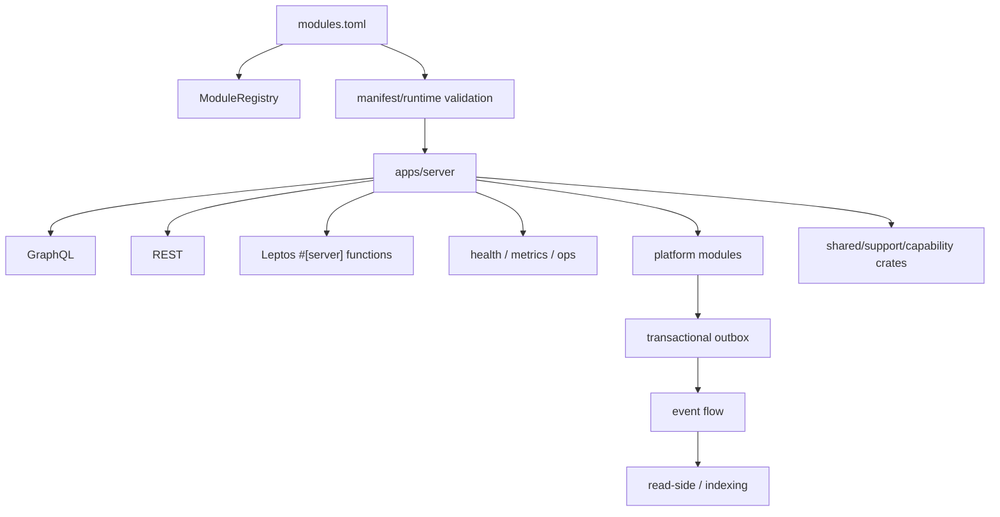
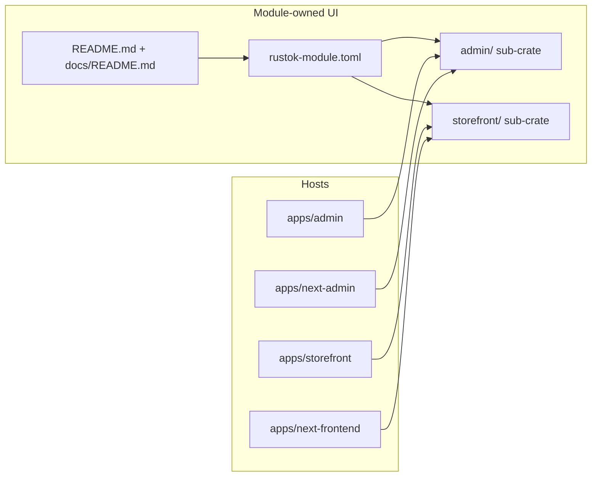
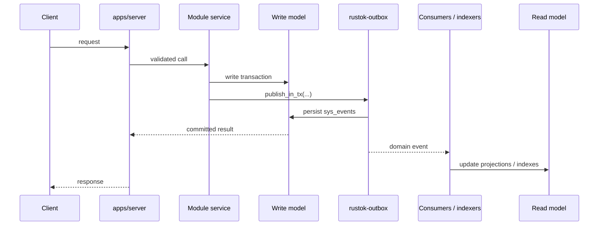
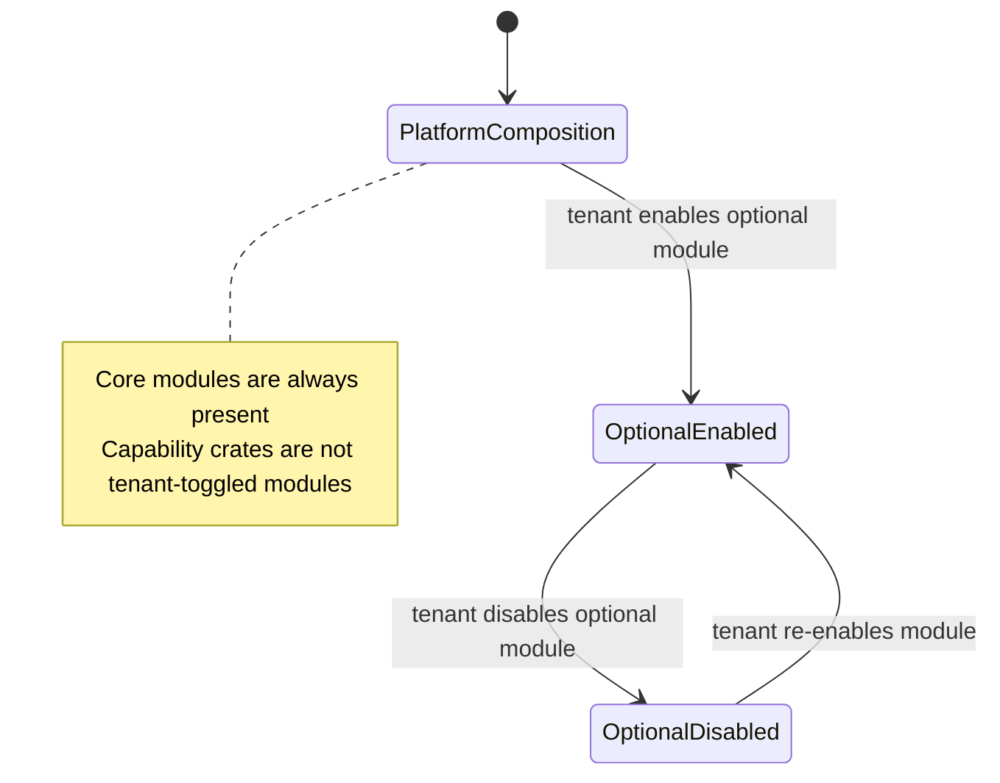

# Диаграммы платформы

Этот документ содержит только актуальные верхнеуровневые диаграммы RusToK.
Детали ownership, manifests и local docs описаны в `docs/modules/*` и
`docs/architecture/*`.

## Общая схема платформы

```mermaid
graph TD
    subgraph Hosts["Host applications"]
        SERVER["apps/server"]
        ADMIN["apps/admin"]
        STOREFRONT["apps/storefront"]
        NEXT_ADMIN["apps/next-admin"]
        NEXT_FRONT["apps/next-frontend"]
    end

    subgraph Core["Core modules"]
        AUTH["auth"]
        CACHE["cache"]
        CHANNEL["channel"]
        EMAIL["email"]
        INDEX["index"]
        SEARCH["search"]
        OUTBOX["outbox"]
        TENANT["tenant"]
        RBAC["rbac"]
    end

    subgraph Optional["Optional modules"]
        CONTENT["content"]
        CART["cart"]
        CUSTOMER["customer"]
        PRODUCT["product"]
        PROFILES["profiles"]
        REGION["region"]
        PRICING["pricing"]
        INVENTORY["inventory"]
        ORDER["order"]
        PAYMENT["payment"]
        FULFILLMENT["fulfillment"]
        COMMERCE["commerce"]
        BLOG["blog"]
        FORUM["forum"]
        COMMENTS["comments"]
        PAGES["pages"]
        TAXONOMY["taxonomy"]
        MEDIA["media"]
        WORKFLOW["workflow"]
    end

    subgraph Support["Shared / capability crates"]
        CORE["rustok-core"]
        API["rustok-api"]
        EVENTS["rustok-events"]
        STORAGE["rustok-storage"]
        TESTS["rustok-test-utils"]
        COM_FOUND["rustok-commerce-foundation"]
        TELEMETRY["rustok-telemetry"]
        IGGY["rustok-iggy"]
        MCP["rustok-mcp"]
        AI["rustok-ai"]
        ALLOY["alloy"]
        FLEX["flex"]
    end

    SERVER --> AUTH
    SERVER --> CACHE
    SERVER --> CHANNEL
    SERVER --> EMAIL
    SERVER --> INDEX
    SERVER --> SEARCH
    SERVER --> OUTBOX
    SERVER --> TENANT
    SERVER --> RBAC
    SERVER --> CONTENT
    SERVER --> CART
    SERVER --> CUSTOMER
    SERVER --> PRODUCT
    SERVER --> PROFILES
    SERVER --> REGION
    SERVER --> PRICING
    SERVER --> INVENTORY
    SERVER --> ORDER
    SERVER --> PAYMENT
    SERVER --> FULFILLMENT
    SERVER --> COMMERCE
    SERVER --> BLOG
    SERVER --> FORUM
    SERVER --> COMMENTS
    SERVER --> PAGES
    SERVER --> TAXONOMY
    SERVER --> MEDIA
    SERVER --> WORKFLOW

    SERVER --> CORE
    SERVER --> API
    SERVER --> EVENTS
    SERVER --> STORAGE
    SERVER --> TELEMETRY
    SERVER --> IGGY
    SERVER --> MCP
    SERVER --> AI
    SERVER --> ALLOY
    SERVER --> FLEX

    ADMIN --> SERVER
    STOREFRONT --> SERVER
    NEXT_ADMIN --> SERVER
    NEXT_FRONT --> SERVER

    COMMERCE --> CART
    COMMERCE --> CUSTOMER
    COMMERCE --> PRODUCT
    COMMERCE --> REGION
    COMMERCE --> PRICING
    COMMERCE --> INVENTORY
    COMMERCE --> ORDER
    COMMERCE --> PAYMENT
    COMMERCE --> FULFILLMENT

    BLOG --> CONTENT
    BLOG --> COMMENTS
    BLOG --> TAXONOMY
    FORUM --> CONTENT
    FORUM --> TAXONOMY
    PAGES --> CONTENT
    PRODUCT --> TAXONOMY
    PRODUCT --> COM_FOUND
    PRICING --> COM_FOUND
    INVENTORY --> COM_FOUND
    MEDIA --> STORAGE
    OUTBOX --> EVENTS
    OUTBOX --> IGGY
```

## Runtime-композиция

## UI-композиция

## Поток write / event / read

## Tenant lifecycle

## Связанные документы

- [Обзор архитектуры платформы](./overview.md)
- [Архитектура модулей](./modules.md)
- [Обзор модульной платформы](../modules/overview.md)
- [Реестр модулей и приложений](../modules/registry.md)
- [Контракт `rustok-module.toml`](../modules/manifest.md)
