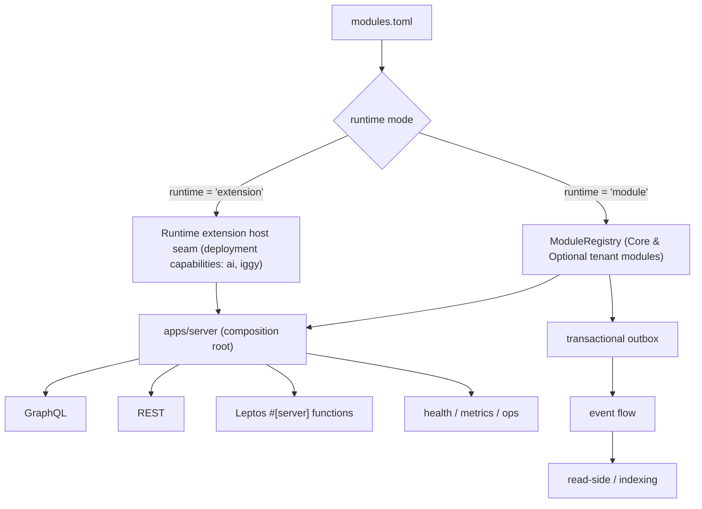
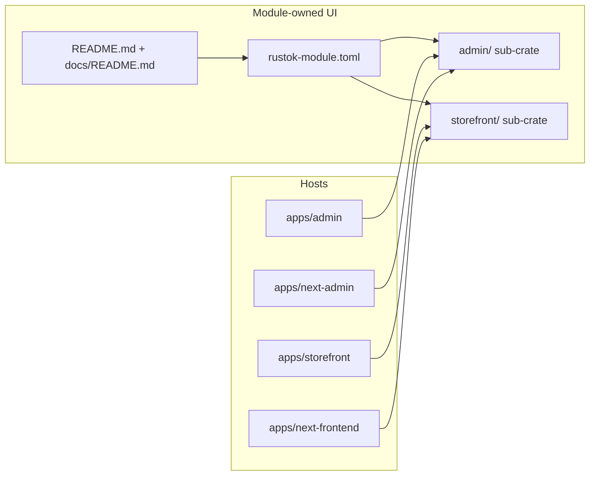
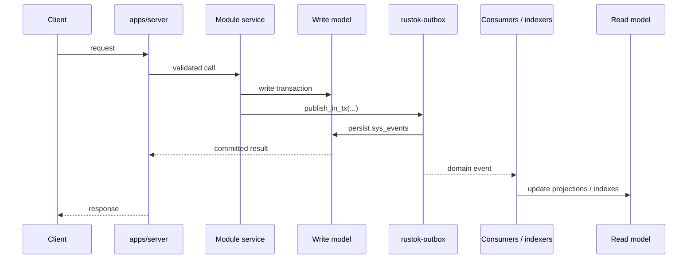
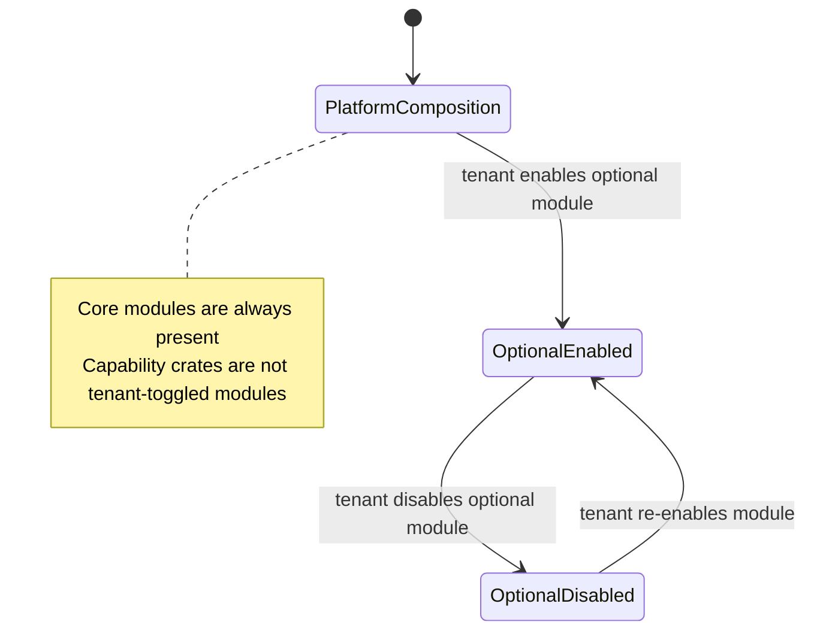

# Platform Diagrams

This document contains only the current top-level diagrams of RusToK.
Details of ownership, manifests and local docs are described in `docs/modules/*` and
`docs/architecture/*`.

## Overall Platform Diagram

<!-- @generated:architecture-diagram-begin -->
```mermaid
graph TD
    subgraph Hosts["Host applications"]
        SERVER["apps/server (Axum composition root)"]
        ADMIN["apps/admin (Leptos)"]
        STOREFRONT["apps/storefront (Leptos)"]
        NEXT_ADMIN["apps/next-admin (Next.js)"]
        NEXT_FRONT["apps/next-frontend (Next.js)"]
    end

    subgraph Core["Core platform modules (required = true)"]
        CORE_MODULES["modules (rustok-modules)"]
        CORE_AUTH["auth (rustok-auth)"]
        CORE_CACHE["cache (rustok-cache)"]
        CORE_CHANNEL["channel (rustok-channel)"]
        CORE_EMAIL["email (rustok-email)"]
        CORE_INDEX["index (rustok-index)"]
        CORE_SEARCH["search (rustok-search)"]
        CORE_OUTBOX["outbox (rustok-outbox)"]
        CORE_EVENTS["events (rustok-events-module)"]
        CORE_TENANT["tenant (rustok-tenant)"]
        CORE_RBAC["rbac (rustok-rbac)"]
    end

    subgraph Optional["Optional domain modules (tenant-managed)"]
        OPT_CONTENT["content"]
        OPT_CART["cart"]
        OPT_CUSTOMER["customer"]
        OPT_PRODUCT["product"]
        OPT_PRODUCT_RELATIONS["product_relations"]
        OPT_BRAND["brand"]
        OPT_PRODUCT_BUNDLES["product_bundles"]
        OPT_PROFILES["profiles"]
        OPT_SOCIAL_GRAPH["social_graph"]
        OPT_REACTIONS["reactions"]
        OPT_GROUPS["groups"]
        OPT_REGION["region"]
        OPT_PRICING["pricing"]
        OPT_INVENTORY["inventory"]
        OPT_ORDER["order"]
        OPT_PAYMENT["payment"]
        OPT_FULFILLMENT["fulfillment"]
        OPT_COMMERCE["commerce"]
        OPT_MARKETPLACE_SELLER["marketplace_seller"]
        OPT_MARKETPLACE_LISTING["marketplace_listing"]
        OPT_MARKETPLACE_ALLOCATION["marketplace_allocation"]
        OPT_MARKETPLACE_COMMISSION["marketplace_commission"]
        OPT_MARKETPLACE_LEDGER["marketplace_ledger"]
        OPT_MARKETPLACE_PAYOUT["marketplace_payout"]
        OPT_MARKETPLACE["marketplace"]
        OPT_MODERATION["moderation"]
        OPT_BLOG["blog"]
        OPT_FORUM["forum"]
        OPT_NOTIFICATIONS["notifications"]
        OPT_COMMENTS["comments"]
        OPT_PAGES["pages"]
        OPT_NAVIGATION["navigation"]
        OPT_PAGE_BUILDER["page_builder"]
        OPT_TAXONOMY["taxonomy"]
        OPT_MEDIA["media"]
        OPT_TRANSLATION["translation"]
        OPT_SEO["seo"]
        OPT_WORKFLOW["workflow"]
        OPT_ALLOY["alloy"]
        OPT_FLEX["flex"]
    end

    subgraph Extensions["Capability extensions (runtime = \"extension\")"]
        EXT_AI["ai (rustok-ai)"]
        EXT_IGGY_CONNECTOR["iggy_connector (rustok-iggy-connector)"]
    end

    subgraph Foundations["Platform foundation & shared libraries"]
        CORE_LIB["rustok-core"]
        API_LIB["rustok-api"]
        EVENTS_LIB["rustok-events"]
        RUNTIME_LIB["rustok-runtime"]
        WEB_LIB["rustok-web"]
        STORAGE_LIB["rustok-storage"]
        TELEMETRY_LIB["rustok-telemetry"]
        FBA_LIB["rustok-fba"]
        MCP_LIB["rustok-mcp"]
    end

    SERVER --> Core
    SERVER --> Optional
    SERVER --> Extensions
    Core --> Foundations
    Optional --> Foundations
    Extensions --> Foundations
    ADMIN --> Core
    STOREFRONT --> Core
```
<!-- @generated:architecture-diagram-end -->

## Runtime Composition

```mermaid
flowchart TD
    MANIFEST["modules.toml"] --> SPLIT{"runtime mode"}
    SPLIT -->|"runtime = 'module'"| REGISTRY["ModuleRegistry (Core & Optional tenant modules)"]
    SPLIT -->|"runtime = 'extension'"| EXT_SEAM["Runtime extension host seam (deployment capabilities: ai, iggy)"]
    
    REGISTRY --> SERVER["apps/server (composition root)"]
    EXT_SEAM --> SERVER

    SERVER --> GRAPHQL["GraphQL"]
    SERVER --> REST["REST"]
    SERVER --> SERVER_FN["Leptos #[server] functions"]
    SERVER --> HEALTH["health / metrics / ops"]

    REGISTRY --> OUTBOX["transactional outbox"]
    OUTBOX --> EVENTS["event flow"]
    EVENTS --> INDEX["read-side / indexing"]
```

## UI Composition

```mermaid
graph LR
    subgraph Module["Module-owned UI"]
        ADMIN_UI["admin/ sub-crate"]
        STORE_UI["storefront/ sub-crate"]
        DOCS["README.md + docs/README.md"]
        MODULE_MANIFEST["rustok-module.toml"]
    end

    subgraph Hosts["Hosts"]
        ADMIN["apps/admin"]
        STOREFRONT["apps/storefront"]
        NEXT_ADMIN["apps/next-admin"]
        NEXT_FRONT["apps/next-frontend"]
    end

    MODULE_MANIFEST --> ADMIN_UI
    MODULE_MANIFEST --> STORE_UI
    DOCS --> MODULE_MANIFEST

    ADMIN --> ADMIN_UI
    STOREFRONT --> STORE_UI
    NEXT_ADMIN --> ADMIN_UI
    NEXT_FRONT --> STORE_UI
```

## Write / Event / Read Flow

```mermaid
sequenceDiagram
    participant Client as Client
    participant Host as apps/server
    participant Module as Module service
    participant DB as Write model
    participant Outbox as rustok-outbox
    participant Consumer as Consumers / indexers
    participant Read as Read model

    Client->>Host: request
    Host->>Module: validated call
    Module->>DB: write transaction
    Module->>Outbox: publish_in_tx(...)
    Outbox->>DB: persist sys_events
    DB-->>Host: committed result
    Outbox-->>Consumer: domain event
    Consumer->>Read: update projections / indexes
    Host-->>Client: response
```

## Tenant Lifecycle

```mermaid
stateDiagram-v2
    [*] --> PlatformComposition
    PlatformComposition --> OptionalEnabled: tenant enables optional module
    OptionalEnabled --> OptionalDisabled: tenant disables optional module
    OptionalDisabled --> OptionalEnabled: tenant re-enables module

    note right of PlatformComposition
        Core modules are always present
        Capability crates are not tenant-toggled modules
    end note
```

## Related Documents

- [Platform Architecture Overview](./overview.md)
- [Module Architecture](./modules.md)
- [Module Platform Overview](../modules/overview.md)
- [Module and Application Registry](../modules/registry.md)
- [`rustok-module.toml` Contract](../modules/manifest.md)
