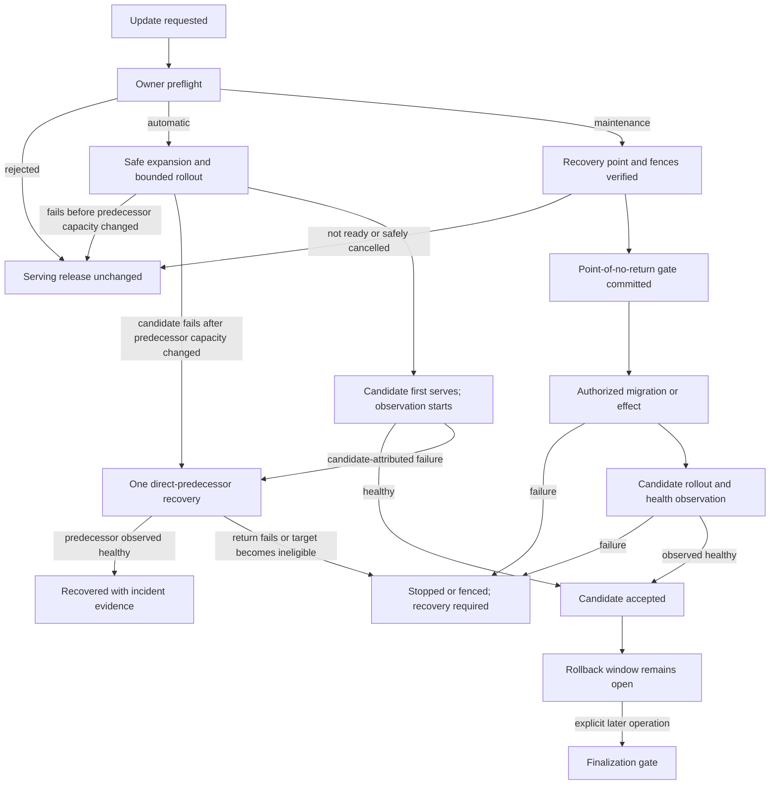

# Module Release and Rollback Plan

## Product Promise

The user starts one production update operation and sees one durable result.
If preflight fails, the serving release is unchanged. If a candidate rollout
fails while that exact transition is eligible for automatic mode,
`rustok-modules` starts exactly one recovery to the direct predecessor. A
successful recovery means that the predecessor is again observed healthy, not
merely that a release pointer or build request was written.

The experience should be as understandable as WordPress module rollback, but
the implementation is for an immutable compiled and artifact-based platform:
production files are never edited in place and production data is never
restored automatically.

`rustok-modules` is the canonical owner of module update intent, transition
safety, predecessor selection, operation progress, rollback eligibility, and
incident outcome. Build, migration, sandbox, and deployment components execute
exact owner-authorized work and return evidence; they do not create another
module update lifecycle.

## Scope

Included:

- immutable production release history for dynamic artifacts and complete
  static/native distributions;
- exact update preflight, rollout observation, automatic recovery, manual
  rollback, stop/fence outcomes, diagnostics, retention, and reconciliation;
- schema and data compatibility, migration and backfill checkpoints,
  finalization, recovery points, and restore drills;
- preparation of every updateable module under one local readiness format;
- the server, embedded Leptos SSR/hydration artifacts, generated module/UI
  registries, and content-addressed browser assets that belong to a static
  distribution; and
- a control path that remains usable when candidate application nodes and their
  embedded admin UI do not start.

Excluded:

- automatic restoration or in-place replacement of live production data;
- arbitrary selection of an old release under the name “rollback”;
- module-local rollback services, direct release-pointer writes, mutable
  artifacts, registry fallback at runtime, or a second incident ledger;
- arbitrary SQL or native migrations supplied by untrusted artifacts;
- Alloy-owned production activation or recovery. Alloy may prepare source and
  sandbox/admission evidence, but it cannot decide database safety, select a
  predecessor, or operate the production rollback path; and
- Next.js build, deployment, health, and rollback automation. Next.js remains
  optional and manually operated by its host and cannot authorize, block, or
  claim success for this lifecycle.

## Current Gaps That This Plan Must Remove

The repository already has strong primitives, but they do not yet form this
product contract:

1. Dynamic artifact rollback commits an installation-selection transition;
   activation, tenant intent, and observed runtime convergence remain separate.
2. Static distribution rollback currently queues a complete rebuild, while
   `rustok-build` exposes a different operator rollback that reselects a prior
   build release. These cannot remain parallel production rollback paths.
3. `ArtifactRollbackRequest` currently accepts
   `migration_rollback_mode` from its caller. Caller input cannot authorize
   code rollback against live data.
4. Native migration metadata currently describes source and ordering, not an
   executable compatibility, phase, recovery, and finalization contract.
5. Local readiness prose and a central board do not produce an enforceable
   release decision.
6. Sandbox and build success do not prove production health, mixed-release data
   safety, external-side-effect safety, or recoverability after an uncertain
   outcome.
7. There is no single coordinator that atomically fences the complete
   cross-scope conflict set for update, rollback, security, migration, restore,
   and retention operations and resumes them after process loss.

The target implementation replaces these gaps atomically. It must not retain
the old operator paths as compatibility fallbacks.

## Definitions

| Term | Meaning |
| --- | --- |
| release | Immutable source, dependency, build, artifact, admission, policy, and executor identity |
| selected release | Owner-selected durable intent |
| desired rollout | Exact release and role state that the deployment operation must converge |
| serving release | Release actually observed serving the recorded rollout scope |
| candidate | Exact release proposed by the current update operation |
| direct predecessor | Release serving immediately before the candidate operation |
| observation window | Bounded period beginning when the candidate first serves production traffic, during which one automatic recovery may be initiated |
| rollback window | Longer compatibility and retention period during which a manual direct-predecessor rollback may remain eligible |
| finalization | Separate maintenance operation that performs destructive compatibility cleanup only after the rollback window is explicitly closed |
| recovery required | Terminal fail-closed outcome in which automatic action has stopped and an operator must follow a recorded recovery procedure |

Update mode is a decision for one exact transition and live scope. It is not a
permanent module property and is never inferred from a version label.

## Release Units and Storage

| Runtime kind | Release and rollback unit | Immutable storage | Recovery mechanism |
| --- | --- | --- | --- |
| dynamic artifact | One platform- or tenant-scoped installation; if dependency selection changes, every changed installation in the exact lock graph joins the unit | Source lineage in the source archive/CAS boundary, published OCI identity, admitted executable bytes in platform CAS, descriptor, declarative UI, bindings, and evidence | Create an audited owner transition selecting the admitted direct predecessor lock graph, then reconcile bindings and serving state |
| static/native | The complete immutable distribution role composition; never one compiled module in isolation. The operation separately binds the affected topology snapshot | Exact source snapshot, module selection, dependency lock, toolchain/target inputs, role artifacts, server binary, embedded Leptos artifacts, generated registries, browser assets, build/publication receipts, and admission evidence | Create an audited owner transition to the complete direct-predecessor composition and deploy its retained, revalidated immutable artifacts through the operation-bound topology |

A static update initiated from one module can therefore return other modules
that were co-released in the same composition. Preflight and confirmation must
show the complete composition diff, topology, roles, tenants, schema impact,
and blast radius.

For a dynamic update that leaves dependency selections unchanged, dependencies
and active dependents are eligibility evidence rather than mutation targets.
If resolution changes any dependency installation, the complete changed lock
graph is selected, confirmed, updated, and recovered atomically and appears in
the blast radius. Unchanged dependents remain compatibility evidence.

Live topology, controller authority, node observations, and deployment
receipts belong to the rollout operation, not the immutable release identity.
A topology change invalidates or revises the operation; it does not create a
new artifact release.

Automatic static recovery must not compile on the incident critical path. The
exact predecessor artifacts must already be retained and revalidated before
the candidate serves. A rebuild remains release-admission and reproducibility
evidence, or a new fully admitted update; it is not the automatic recovery
action. This decision supersedes the rebuild-on-rollback portion of the static
promotion boundary. The current direct `rustok-build` release rollback and the
current rebuild-on-failure path must be replaced together, leaving one
`rustok-modules`-owned transition.

An arbitrary older version is not a rollback target. Selecting it creates a
new candidate update and repeats admission, compatibility, migration, and
rollout checks.

## Ownership Boundaries

| Owner | Responsibility in this plan |
| --- | --- |
| `rustok-modules` | Update request, executable preflight decision, direct predecessor, operation/fence state, observation policy, automatic recovery authorization, incident outcome, retention hold, and operator projection |
| `rustok-build` and static build workers | Exact build job and immutable artifact/evidence execution behind an owner port; no independent operator rollback or release-safety decision |
| `rustok-migrations` and operations CLI adapters | Validate and execute only the exact owner-approved native migration phase; they do not choose update mode, rollback target, or restore policy |
| `rustok-sandbox` | Bounded dynamic-artifact execution evidence; it does not prove database safety or own production activation |
| deployment controller and node agents | Apply only the exact desired role artifacts, enforce an operation-bound recovery authorization when application nodes are unavailable, and report authenticated topology-bound observations |
| module owners | Own migration source, compatibility behavior, durable work, data, and external-side-effect evidence; they do not implement release selection |
| hosts and UI | Authorize actors, call owner transports, render owner facts, and expose no direct persistence or registry mutation |

The controller that can recover a failed static rollout must run outside the
candidate application process. It receives only one immutable operation,
candidate, direct predecessor, topology, health policy, deadline, and one-use
recovery authorization. It cannot choose another release, run DDL, restore
data, or widen scope.

## Non-Negotiable Safety Invariants

1. Documentation and module declarations are not production authorization.
   Automatic mode requires an immutable owner-issued decision for the exact
   transition and live scope.
2. A failure before the desired rollout or any deployment/serving mutation
   rejects the update. It leaves predecessor capacity unchanged and consumes
   no automatic recovery attempt. Once rollout has displaced, stopped, or
   reduced predecessor capacity, a candidate startup/readiness failure is a
   rollout failure and may reserve the single recovery attempt even before the
   candidate serves traffic.
3. Automatic and manual rollback target only the exact direct predecessor and
   its verified dependency closure.
4. One operation may initiate at most one automatic recovery. Process restarts,
   duplicate signals, and multiple nodes cannot reset that fact or oscillate
   releases.
5. No update or rollback automatically restores database, object, index,
   queue, cache, or external-system state.
6. Static/native rollback changes the complete distribution composition.
   Expanded native schema remains present after code rollback.
7. One owner operation derives the complete conflict-key set for the rollback
   unit, schema/data owners, dependency and active-dependent installations,
   topology, and affected namespaces. It acquires or fences that set atomically
   under a fixed release-unit, data/migration-owner, namespace, and topology
   hierarchy before mutation. A scope-local lease alone cannot authorize a
   cross-scope change. The set serializes release selection,
   rollout, rollback, disable/deactivate/uninstall, quarantine/revoke,
   migration, backfill, finalization, restore, purge, and retention collection
   wherever those actions can invalidate one another.
8. Every external phase has an immutable request digest, monotonic checkpoint,
   fenced lease, idempotent terminal receipt, and restart reconciliation.
   Transactional phases use CAS and idempotency; leases are required only for
   asynchronous or external work.
9. Before the first compensating or irreversible effect, the owner durably
   closes automatic eligibility and establishes required traffic, job, and
   write fences. A crash can never reopen eligibility.
10. Automatic mode requires every intermediate representation to remain safe
    for both candidate and predecessor, including mixed-version writes and
    durable work.
11. Automatic mode may retain additive schema artifacts, but it must not depend
    on old/new adapters, fallback decoders, dual read/write paths, or parallel
    internal contracts. A semantic transition that requires them is
    maintenance-only.
12. Health evidence is authenticated, fresh, bounded, topology- and
    release-scoped, and independent of an untrusted module’s self-report.
13. A shared database, broker, network, or external-provider outage is not by
    itself a module rollback signal.
14. Quarantine, revocation, policy change, migration progress, topology change,
    and predecessor retention are revalidated before every state-changing
    transition. Quarantine/revocation atomically invalidates and cancels or
    supersedes a conflicting stale operation rather than waiting behind its
    external lease. A stale preflight receipt cannot override them.
15. Contract cleanup is an explicit maintenance operation, never an automatic
    timer action.
16. Missing, stale, contradictory, oversized, or unverifiable evidence fails
    closed into maintenance or recovery-required state.
17. A new update requires the preceding operation to be terminal and the
    selected, desired, and observed-serving state to be converged across its
    conflict set. Starting it atomically closes the previous code-rollback
    eligibility and establishes the then-serving release as the new direct
    predecessor. Outstanding compatibility, finalization, retention,
    recovery-point, durable-work, client-lifetime, incident, audit, and
    legal-hold obligations remain durable under their owners and are included
    in the new preflight/conflict set; the update cannot release or forget
    them. Returning two or more releases is a new admitted update, never
    rollback.

## Canonical Workflow

### Executable Preflight Decision

`rustok-modules` computes and persists the update mode. Module authors,
transports, deployment agents, and guests may supply facts for validation but
cannot select `automatic` or `maintenance`.

The preflight receipt binds at least:

- operation and authorization identity;
- rollback unit and affected scope;
- selected release, desired rollout, observed serving release, candidate, and
  direct predecessor, with no conflicting nonterminal operation;
- complete enabled dependency and active dependent closure;
- source, lock, artifact, descriptor, static-role, Leptos asset, and admission
  digests applicable to the rollback unit;
- current configuration/data-contract/schema and migration-ledger identities;
- migration phases, current monotonic checkpoint, and point-of-no-return state;
- mixed-fleet database, transport, event, job, binding, cache/index, and
  external-side-effect compatibility evidence;
- security, capability, effective-policy, topology, and trusted reporter
  revisions;
- observation thresholds, minimum evidence, deadlines, cohorts, and rollback
  window;
- retained predecessor and recovery-point readiness; and
- normalized denial reasons and evidence references.

Missing or stale evidence selects maintenance. A module-wide statement such as
“reversible” is necessary evidence where applicable, but never sufficient.

Preflight returns an immutable operator preview containing the exact mode,
changed lock graph or static composition, scope and blast radius, denial and
eligibility reasons, rollback-window effect, migration and
point-of-no-return facts, required fences, and recovery action. Apply binds the
exact preview receipt; any relevant revision change rejects it and requires a
new preview. Static composition and maintenance updates always require explicit
confirmation.

### Automatic Update and Recovery

1. Resolve and retain one exact candidate and direct predecessor.
2. Apply only a still-current preview receipt, including required explicit
   confirmation, without changing serving state during revalidation.
3. Reject failed sandbox, build, admission, dependency, security, or migration
   preflight as an update rejection.
4. Apply only an approved additive expansion whose single canonical
   representation is valid for both releases. If it fails before commit,
   serving state remains unchanged.
5. Roll out through the recorded scope and bounded cohorts. For a one-node
   topology the single node is the bounded cohort.
6. If startup/readiness fails before candidate traffic, abort without an
   attempt only when predecessor capacity was never changed. If rollout has
   displaced, stopped, or reduced predecessor capacity, reserve the single
   attempt and recover it.
7. Start the observation window only when the candidate first serves traffic.
8. Accept the candidate only after required nodes, traffic, durable workers,
   and health signals converge under the pinned policy.
9. On a candidate-attributed failure, reserve the single automatic attempt,
   revalidate eligibility, and initiate the exact direct-predecessor recovery.
10. Mark recovery successful only when predecessor serving state and required
    workers are observed healthy and every recovery-required job/external-effect
    reconciliation is terminal. A committed pointer, queued build, deployed
    process, or restored traffic with unresolved reconciliation is still
    `recovering`.
11. If the predecessor becomes quarantined/revoked, cannot be materialized, or
    fails to converge, stop or fence the affected unit and record
    `recovery_required`. Do not try another release.

Automatic triggers may include candidate startup/crash/trap, identity mismatch,
readiness failure, rollout deadline, or a statistically bounded candidate
regression. Ordinary business errors, malformed tenant input, missing
telemetry, and platform-wide dependency failure do not automatically roll back
a module. A dependency symptom counts only when a bounded predecessor/control
cohort remains healthy and the pinned policy attributes the regression to the
candidate. A single-node topology cannot use a statistical trigger that needs
a control cohort; only deterministic, release-bound signals remain eligible.
If trusted telemetry remains missing after candidate traffic until the pinned
deadline, the owner fences candidate traffic and performs the one recovery when
eligibility remains proven; otherwise it records `recovery_required`.

Cancellation is safe before any rollout/deployment mutation or the maintenance
point-of-no-return gate. Before candidate traffic but after predecessor
capacity changed, cancellation is a recovery and consumes the one attempt.
After candidate traffic or the irreversible gate, the normal recovery or
maintenance policy applies. A failed candidate is never retried automatically;
retry is a new update with a fresh preflight.

### Maintenance Update

Maintenance mode never performs automatic rollback.

Before it begins, preflight must prove that the required recovery point is
ready and restore-tested, the runbook and authorizer exist, the declared
RPO/RTO evidence is current, and the topology can enforce the required traffic,
job, and write fences. “Read-only” may be shown only where an actual owner
write fence is verified; otherwise the affected module or entire application
enters maintenance/stopped state.

A failure before the point-of-no-return gate aborts without changing serving
selection. Before any compensating, non-transactional, destructive, or
irreversible effect starts, the owner commits the monotonic gate and closes
automatic eligibility. A failure after that point becomes
`recovery_required`. The operator may choose only a recorded forward repair,
tested compensation, or separately authorized isolated restore/cutover.
Returning predecessor code is allowed only after that procedure proves the
predecessor compatible with the resulting live state.

### Manual Rollback

Manual rollback requires a fresh owner decision from current facts; it never
reuses the update preview as authority. It uses the same authorization,
complete conflict fence set, direct-predecessor rule, diagnostics, and
convergence definition. Predecessor retention and compatibility holds begin
before rollout. The manual rollback window begins only when the candidate is
accepted and closes explicitly at finalization or when a later converged update
starts. Configuration, security, dependency, data, migration, or retention
changes may make it ineligible sooner, and the owner projection reflects that
loss immediately.

## Data and Migration Safety

### Compatibility Envelope

Automatic mode requires both N and N+1 to read, write, validate, index, and
serialize every intermediate state correctly through one canonical internal
contract. Evidence covers:

- authoritative rows, constraints, sequences, views, and settings/configuration;
- object bytes, logical metadata, indexes, search projections, caches, and
  rebuild/invalidation behavior;
- public/headless and native transports used during rolling deployment;
- durable events, outbox payloads, broker messages, scheduled work, background
  jobs, offsets, retries, and dead letters;
- artifact bindings, data-contract revisions, capabilities, and secret
  references; and
- payments, emails, webhooks, remote APIs, and other external side effects.

N+1-created writes and messages must remain safe after return to N. Work pinned
to an exact release is never silently rerouted to a different executor. Each
module declares whether such work is drained, completed by its exact retained
executor, safely cancelled, or moved to an operator-visible dead-letter and
reconciliation path.

Retention never grants execution eligibility. An N+1-pinned item may execute
after rollback only under a bounded, item-specific drain authorization that
creates no new work, serves no traffic, revalidates current capability,
security, and policy state, and is cancelled by quarantine or revocation.
Otherwise it is safely cancelled or moved to the visible dead-letter and
reconciliation path.

Code rollback cannot undo an email, payment, webhook, remote mutation, or
already published event. Automatic mode therefore requires those effects to be
backward-compatible, idempotent, fenced, or covered by a tested reconciliation
procedure. Otherwise the transition is maintenance.

### Migration Contract

Migration policy retains the existing `reversible`, `compensating`, and
`prohibited` meanings, but eligibility is stricter:

| Change | Possible mode |
| --- | --- |
| no data/schema change | automatic when all other evidence passes |
| transactional additive expansion with one canonical representation accepted by both N and N+1 | automatic when N/N+1 and dependency evidence passes |
| resumable idempotent projection/backfill whose every checkpoint preserves the canonical representation | automatic when N/N+1 and durable-work evidence passes |
| reversible DDL that is locking, non-transactional, or mixed-fleet incompatible | maintenance |
| compensating conversion or external side effect | maintenance |
| prohibited or irreversible conversion | maintenance |
| destructive constraint/drop/cleanup | separate maintenance finalization |

For native modules, the canonical migration boundary must be extended from
source ordering to owner-verifiable metadata for ownership, exact migration
identity/digest, phase, transaction behavior, lock/timeout policy,
compatibility, backfill/checkpoint behavior, recovery requirement, and
finalization condition. `rustok-migrations` remains the neutral executor and
must apply the exact approved plan rather than an unbounded “up to latest”
during a production module update.

The repository is pre-release, so pending migrations are amended or
consolidated under the zero-legacy policy. Once a migration identity has been
included in an admitted production distribution and applied, its identity and
digest are immutable deployment history; later changes append a new
owner-declared migration.

### Finalization Gate

Destructive contract work is a later release/maintenance operation. Elapsed
time alone never authorizes it. The owner must prove:

- the candidate is accepted and every affected node has left N;
- the rollback window is explicitly closed;
- no N-pinned job, event retry, outbox delivery, cache/index rebuild, or client
  asset remains inside its declared compatibility lifetime;
- every backfill checkpoint and domain invariant is complete;
- no rollback, incident, recovery, restore, legal hold, or audit hold is open;
- required recovery evidence is ready; and
- every removable additive schema, data, projection, cache/index, or contract
  artifact has a recorded owner and removal condition.

The finalization gate is monotonic. Once destructive work begins, the direct
predecessor is no longer advertised as rollback-eligible unless a separately
proven compensation restores its compatibility.

### Snapshots and Restore

A snapshot is recovery evidence, not automatic rollback.

Brokered artifact-data recovery may be module-scoped only when the existing
owner can capture the complete namespace within its bounded snapshot contract
and restore into an empty compatible target. Capacity beyond those bounds,
missing object bytes, stale recovery points, or untested restore blocks the
maintenance operation.

Native schema recovery is module-scoped only when the module owns a genuinely
isolated, consistently restorable boundary. Cross-module foreign keys, shared
tables, outbox/queue state, or shared projections normally make the recovery
boundary a platform PostgreSQL restore.

Recovery follows this order:

1. fence traffic, writes, scheduled work, and consumers at the proven boundary;
2. preserve the current failed live state and post-snapshot changes;
3. restore to an isolated or empty target;
4. verify digests, security state, schema, domain invariants, objects,
   projections, outbox/offsets, and external reconciliation;
5. record measured RPO/RTO and operator approval; and
6. perform a separately authorized cutover.

The platform does not promise a generic merge into live data. Any merge must be
an owner-specific, tested, separately authorized recovery contract.

No normal update/rollback API exposes a database-restore command.

## Module Readiness Contract

### Machine-Enforced Evidence

Each release supplies bounded declarations, but platform admission and
verification produce the authoritative evidence. `rustok-modules` issues the
immutable transition decision and binds it to the exact candidate/predecessor
pair and live scope. Documentation, semantic versions, a successful sandbox
run, a migration enum, or a module self-report can never grant automatic mode.

The owner decision must be queryable and explainable but not caller-editable.
Reusing it against another tenant, topology, policy, dependency graph,
configuration, migration checkpoint, or security revision fails closed.

### Local Module Block

Every updateable module, including a stateless one, adds a concise
`Release and Data Rollback Readiness` block to its existing local
`docs/implementation-plan.md`. It records:

- runtime kind and actual rollback unit;
- data owner and recoverable boundary, or `none`;
- native migrations and brokered data-contract changes;
- supported migration policy and phase constraints;
- N/N+1 read, write, configuration, and intermediate-checkpoint compatibility;
- direct dependencies, active dependents, cross-module ordering, and ownership;
- transport, event, outbox, scheduled/job, cache/index, and binding compatibility;
- external side effects and idempotency/fence/reconciliation behavior;
- backfill and uncertain-outcome recovery;
- snapshot/backup boundary, limits, restore procedure, and measured RPO/RTO;
- rollback-window and finalization conditions;
- stop/read-only/write-fence capability;
- required tests and current evidence references; and
- responsible module owner.

A stateless module records `data boundary: none` but must still account for
durable work, configuration, public contracts, and external effects. This
removes ambiguity between “reviewed and not applicable” and “not reviewed.”

`docs/modules/registry.md` receives one compact readiness row per module. The
board mirrors local evidence and highlights missing review; it never authorizes
a production transition. Missing local or machine evidence defaults to
maintenance.

Module owners must not add local release ledgers, registry reads, raw DDL
executors, restore endpoints, or rollback services.

## Operator Contract

The owner projection must show:

- one durable operation/correlation identity;
- rollback unit, scope, topology, roles, complete static composition diff, and
  blast radius;
- selected, serving, candidate, and direct-predecessor releases;
- current phase, progress, deadlines, cohorts, desired state, and observed state;
- preflight outcome, update mode, and normalized reasons;
- observation and rollback-window state;
- rollback eligibility and every denial reason;
- migration/backfill/point-of-no-return state;
- traffic/job/write fence state without claiming unsupported read-only behavior;
- automatic attempt reservation and recovery convergence;
- incident/recovery action and runbook reference; and
- a sanitized diagnostic/support-bundle reference.

The command surface supports preview/apply, observe, cancel where still safe,
freshly authorized manual direct-predecessor rollback, and explicit unit-aware
containment actions. Each action states its exact effect: candidate traffic
stopped, dynamic bindings disabled, workers paused, writes fenced, or static
distribution left installed but not serving. Maintenance compensation and
restore remain separately privileged runbook operations. No surface exposes
raw release-pointer writes, artifact-byte replacement, direct registry
mutation, or live database restore.

Typed, allowlisted reason codes and bounded sanitized summaries may be retained
with owner receipts. Protected raw logs remain in the logging backend under
access, tenant isolation, retention, and redaction policy. Secrets, raw
sensitive data, untrusted artifact output, URLs, actor IDs, tenant IDs, and
digests must not become unbounded metric labels.

The same owner contract backs CLI and transport consumers. Static emergency
control must remain available through an operations path outside the candidate
server and embedded Leptos UI. Next.js remains outside the profile.

## Work Plan

### 0. Reconcile the Canonical Architecture

- [x] Amend the release-safety and static-promotion decisions so automatic
  static recovery deploys a retained, revalidated predecessor composition and
  never compiles on the incident path.
- [ ] Make `rustok-modules` the one operator-level transition owner while
  retaining `rustok-build`, `rustok-migrations`, sandbox, and deployment as
  narrow execution/evidence ports.
- [ ] Atomically remove the current direct `rustok-build` operator rollback and
  rebuild-on-rollback path when the canonical replacement and every caller are
  ready.
- [x] Define dynamic installation and static composition as explicit rollback
  units and preserve their distinct lower-level mechanics.
- [ ] Synchronize the affected ADRs, local plans, central plans, owner maps, and
  current operator documentation.

### 1. Build the Readiness Inventory and Migration Contract

- [ ] Add the local readiness block to every module and the compact central
  board to `docs/modules/registry.md`.
- [ ] Update the module authoring guide, canonical template/descriptor, and
  repository validation so every future module supplies bounded readiness
  declarations or an explicit `data boundary: none` result.
- [ ] Inventory authoritative data, objects, indexes, caches, public contracts,
  durable work, external side effects, dependencies/dependents, migration
  ordering, snapshot limits, and realistic restore boundaries.
- [ ] Extend native migration declarations with the exact safety metadata
  required to produce a bounded phase plan.
- [ ] Consolidate unreleased migrations before establishing immutable
  production migration identities.
- [ ] Classify supported transition classes and evidence gaps for existing
  modules without assigning module-wide automatic eligibility.

### 2. Implement the Owner Decision and Durable Coordinator

- [ ] Add the owner-issued executable preflight receipt and denial taxonomy.
- [ ] Bind preview, explicit confirmation where required, apply, safe
  cancellation, and fresh manual-rollback decisions to immutable receipts.
- [ ] Replace caller-selected migration rollback mode with an owner-loaded
  decision and update every caller atomically.
- [ ] Add one durable owner operation that derives and atomically acquires the
  canonical conflict-key set across rollback units, data/schema owners,
  dependencies/dependents, topology, and affected namespaces.
- [ ] Persist monotonic phases, one automatic attempt, immutable requests,
  leases, idempotent receipts, outbox facts, and restart reconciliation.
- [ ] Revalidate security, policy, topology, checkpoint, and predecessor
  retention before every mutation.
- [ ] Add the outside-candidate automatic evaluator/control path with
  operation-bound authority.

### 3. Implement the Safe Data Path

- [ ] Generate an exact migration phase plan through `rustok-migrations` rather
  than invoking an unbounded migrator during update.
- [ ] Support transactional additive expansion and resumable idempotent
  backfills whose every checkpoint preserves the single canonical
  representation, with uncertain-outcome recovery.
- [ ] Add bounded item-specific drain authorization for predecessor-incompatible
  queued work; it creates no work or traffic and revalidates revocation,
  quarantine, capability, security, and policy state before every claim.
- [ ] Commit point-of-no-return and traffic/job/write fences before any
  compensating, non-transactional, destructive, or irreversible effect.
- [ ] Implement explicit rollback-window closure and the finalization gate.
- [ ] Integrate bounded artifact-data snapshot readiness and platform
  PostgreSQL recovery evidence without adding automatic restore.

### 4. Complete Dynamic Artifact Recovery

- [ ] Compose admission, sandbox evidence, exact dependency/dependent closure,
  data-contract checkpoint, installation selection, binding reconciliation,
  tenant intent, and observed serving state under one operation.
- [ ] Preserve declarative UI, localization, permission, command, HTTP, event,
  and schedule identities with the artifact transition.
- [ ] Prove per-scope tenant RLS, one-attempt behavior, predecessor security,
  queued-work handling, and healthy convergence.

### 5. Complete Static Distribution Recovery

- [ ] Bind the full server/role composition, platform-native and promoted
  modules, embedded Leptos artifacts, generated registries, browser assets,
  migration plan, and topology to one immutable release.
- [ ] Retain and revalidate the complete predecessor artifact set before
  candidate rollout; protect it from GC while any operation/window/incident or
  legal/audit hold exists.
- [ ] Deploy through bounded cohorts and authenticated node observations.
- [ ] Exercise the outside-candidate controller when no candidate API/UI node
  starts.
- [ ] Remove the duplicate direct platform-build rollback only with the
  functioning canonical replacement.

### 6. Deliver the Operator Experience

- [ ] Expose one owner projection and command surface through the existing CLI,
  native, and public/headless-capable transports as applicable.
- [ ] Render the WordPress-like flow from owner facts: rejected without change,
  updating, observing, accepted, recovering, recovered, stopped, or
  recovery-required.
- [ ] Show blast radius, mode/reason, irreversible checkpoint, eligibility
  denial, fence state, diagnostics, and recovery action.
- [ ] Keep Next.js deployment and rollback manual and outside readiness gates.

### 7. Adopt in Evidence-Gated Waves

- [ ] Start with a truly stateless dynamic module, then a brokered-data dynamic
  module.
- [ ] Add a static composition pilot only after outside-candidate recovery and
  complete Leptos asset rollback are proven.
- [ ] Enable an additive native-schema pilot only after mixed N/N+1 reads,
  writes, jobs, and rollback pass against PostgreSQL.
- [ ] Keep cross-module ownership, financial/external effects, compensation,
  and irreversible conversion maintenance-only until their exact procedures
  are rehearsed.
- [ ] Enable automatic mode per exact transition, never for an entire module by
  assertion.

## Verification Matrix

| Area | Required evidence |
| --- | --- |
| preflight | sandbox/build/admission/dependency rejection before rollout mutation leaves selected and serving state unchanged and consumes no recovery attempt |
| authority | forged caller `reversible`/`compensating` input, stale receipt, wrong tenant/scope/topology, or untrusted module health cannot authorize rollback |
| concurrency | platform update vs tenant rollback, shared-schema/dependency finalization, graph revision, and rollback/revoke/uninstall/restore/GC races atomically fence the complete conflict set without deadlock or partial acquisition |
| crash recovery | process loss before and after every external effect/checkpoint/outbox boundary resumes exact work and never creates a second automatic attempt |
| health attribution | candidate crash triggers recovery; PostgreSQL, broker, network, or provider outage alone does not; single-node mode rejects statistical triggers requiring a control cohort |
| mixed fleet | concurrent N and N+1 reads/writes, configuration, APIs, bindings, caches/indexes, events, outbox, schedules, and jobs remain correct before and after return to N |
| durable work | N+1-pinned retry after rollback uses a no-new-work/no-traffic item authorization or is safely cancelled/visibly dead-lettered; revocation blocks drain and no item is silently rerouted or lost |
| irreversible gate | kill before gate, after gate/before effect, and after effect/before receipt never reopens automatic rollback or changes data without a recovery incident |
| security | quarantine/revocation or policy change between trigger and commit blocks the stale target |
| retention | predecessor source/lock/artifacts/Leptos assets/evidence/recovery points survive window, active operation, incident, recovery, audit, and legal holds |
| dynamic scope | PostgreSQL RLS prevents tenant A from reading or changing tenant B operations, diagnostics, snapshots, or release state |
| static recovery | complete composition and Leptos assets return through the outside-candidate controller when candidate server/UI startup fails |
| startup boundary | side-by-side failure before predecessor mutation consumes no attempt; single-node startup failure after predecessor displacement starts one recovery |
| preview/cancel | stale apply or unconfirmed static/maintenance preview is rejected; cancellation before mutation is clean, while cancellation after predecessor displacement follows recovery policy |
| release succession | `N -> N+1 -> N+2` closes old code-rollback eligibility but preserves unfinished compatibility, cleanup, client/work, recovery, and hold obligations while rollback remains direct-predecessor only |
| telemetry deadline | missing trusted telemetry after candidate traffic fences candidate traffic and yields one proven recovery or `recovery_required`, never indefinite observation |
| finalization | cleanup is denied while any old node/work/client lifetime, backfill, incident, recovery, or hold remains |
| restore drill | isolated restore verifies identity, security state, domain invariants, objects, projections, outbox/offset reconciliation, external effects, and measured RPO/RTO |
| bounded recovery | snapshot capacity/age or incomplete restore evidence blocks maintenance preflight rather than claiming recoverability |
| operator UX | every terminal/intermediate outcome, denial reason, blast radius, fence, and sanitized support reference maps from owner facts without inference |

Deployment-specific targets must be set and measured for update duration,
observation duration, automatic recovery completion, recovery-point age, RPO,
RTO, and false-rollback rate. This architecture does not invent one universal
number for all topologies.

## Completion Conditions

This plan is complete only when:

- every module has a local readiness block and a synchronized central row;
- production automatic mode is authorized only by an immutable owner decision
  for an exact transition;
- one durable owner operation survives process/node failure, atomically fences
  its complete cross-scope conflict set, and serializes every conflicting
  transition;
- dynamic recovery and whole-composition static recovery both converge to an
  observed healthy direct predecessor with one attempt and operator diagnostics;
- static recovery works while all candidate application/UI nodes are down;
- no direct `rustok-build` or module-local operator rollback remains;
- automatic-eligible modules pass mixed N/N+1 data and durable-work evidence;
- the point-of-no-return and finalization gates prevent unsafe code rollback;
- snapshots/restores are bounded, separately authorized, and rehearsed without
  overwriting live data; and
- runbooks and measured recovery evidence exist for every recovery-required
  outcome before production enablement.

## Related Documents

- [Release safety ADR](../../DECISIONS/2026-08-06-module-release-rollback-safety.md)
- [Module artifact rollback boundary](../../DECISIONS/2026-07-13-module-artifact-rollback-boundary.md)
- [Static promotion review boundary](../../DECISIONS/2026-07-22-static-promotion-review-boundary.md)
- [Durable artifact-data snapshot and guarded restore](../../DECISIONS/2026-07-22-artifact-data-snapshot-restore.md)
- [Artifact security state boundary](../../DECISIONS/2026-07-22-artifact-security-state-boundary.md)
- [Shared owner-operation receipt ledger](../../DECISIONS/2026-08-03-owner-operation-receipts.md)
- [Neutral sandbox foundation](../../DECISIONS/2026-07-11-neutral-sandbox-foundation.md)
- [Module control-plane consolidation plan](./module-control-plane-consolidation-plan.md)
- [`rustok-modules` implementation plan](../../crates/rustok-modules/docs/implementation-plan.md)
- [`rustok-build` implementation plan](../../crates/rustok-build/docs/implementation-plan.md)
- [`rustok-migrations` documentation](../../crates/rustok-migrations/README.md)
