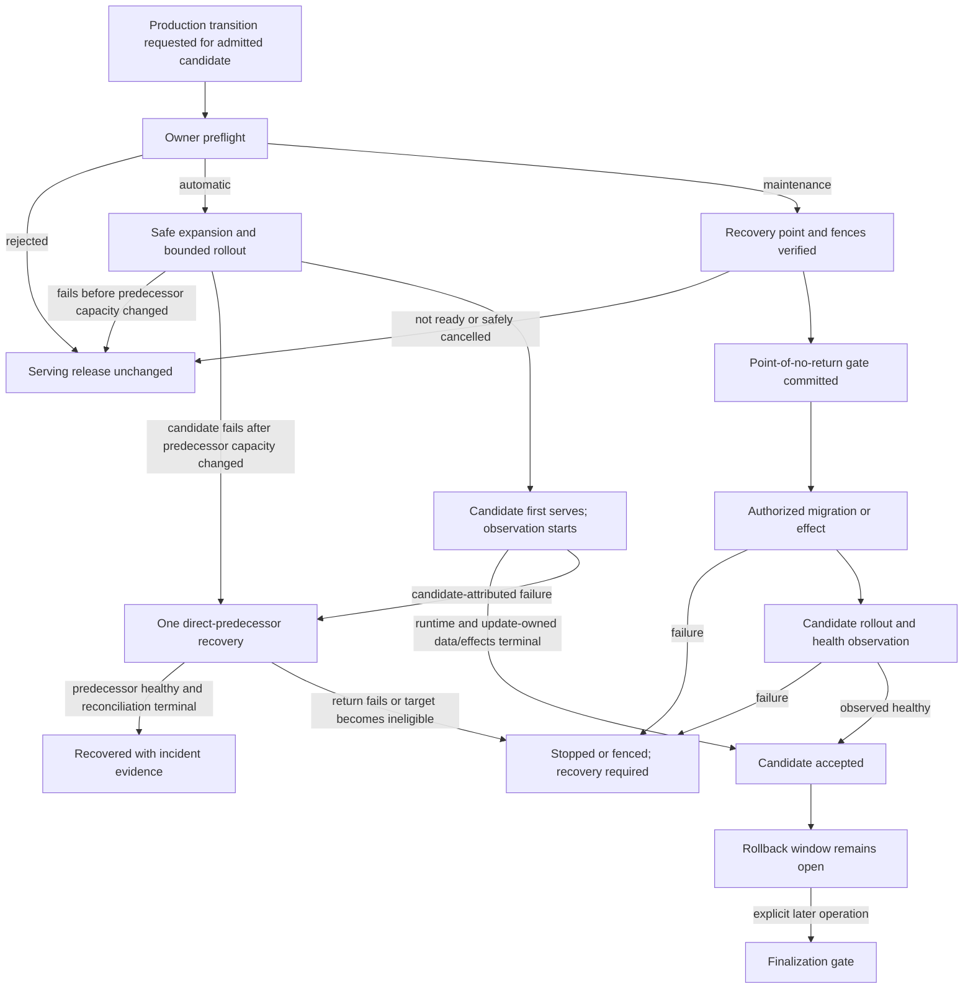

# Module Release and Rollback Plan

## Product Promise

The user starts one production update operation and sees one durable result.
If preflight fails, the serving release is unchanged. If a candidate rollout
fails while that exact transition is eligible for automatic mode,
`rustok-modules` starts exactly one recovery to the direct predecessor. A
successful recovery means that the predecessor is again observed healthy, not
merely that a release pointer or build request was written.

The experience should be as understandable as WordPress module rollback, but
the implementation is for an immutable compiled and artifact-based platform:
production files are never edited in place and production data is never
restored automatically.

`rustok-modules` is the canonical owner of module update intent, transition
safety, predecessor selection, operation progress, rollback eligibility, and
incident outcome. Build, migration, sandbox, and deployment components execute
exact owner-authorized work and return evidence; they do not create another
module update lifecycle.

## Scope

Included:

- immutable production release history for dynamic artifacts and complete
  static/native distributions;
- exact update preflight, rollout observation, automatic recovery, manual
  rollback, stop/fence outcomes, diagnostics, retention, and reconciliation;
- schema and data compatibility, migration and backfill checkpoints,
  finalization, recovery points, and restore drills;
- preparation of every updateable module under one local readiness format;
- the server and every Leptos artifact of a selected role, including SSR
  rendering code and any present CSR/hydrate JavaScript, WebAssembly, CSS,
  generated module/UI registries, and content-addressed browser assets; and
- a control path that remains usable when candidate application nodes and their
  embedded admin UI do not start.

Excluded:

- automatic restoration or in-place replacement of live production data;
- arbitrary selection of an old release under the name “rollback”;
- module-local rollback services, direct release-pointer writes, mutable
  artifacts, registry fallback at runtime, or a second incident ledger;
- arbitrary SQL or native migrations supplied by untrusted artifacts;
- Alloy-owned production activation or recovery. Alloy may prepare source and
  sandbox/admission evidence, but it cannot decide database safety, select a
  predecessor, or operate the production rollback path; and
- Next.js build, deployment, health, and rollback automation. Next.js remains
  optional and manually operated by its host and cannot authorize or claim
  success for this lifecycle. Public/headless contract compatibility with both
  sides of an automatic backend transition remains required release evidence
  and may deny automatic mode; the module lifecycle does not discover or
  monitor individual Next.js deployments.

## Current Gaps That This Plan Must Remove

The repository has completed part of the cutover, while the remaining gaps do
not yet form the full product contract:

1. Dynamic artifact rollback commits an installation-selection transition;
   activation, tenant intent, and observed runtime convergence remain separate.
2. The duplicate static rebuild rollback and direct `rustok-build` operator
   rollback have been removed; the remaining controller/agent and operator
   transport work must expose only the retained-predecessor owner path.
3. `ArtifactRollbackRequest` currently accepts
   `migration_rollback_mode` from its caller. Caller input cannot authorize
   code rollback against live data.
4. Native migration metadata currently describes source and ordering, not an
   executable compatibility, phase, recovery, and finalization contract.
5. Local readiness prose and a central board do not produce an enforceable
   release decision.
6. Sandbox and build success do not prove production health, mixed-release data
   safety, external-side-effect safety, or recoverability after an uncertain
   outcome.
7. There is no single coordinator that atomically fences the complete
   cross-scope conflict set for update, rollback, security, migration, restore,
   and retention operations and resumes them after process loss.
8. The current filesystem publisher is now physically contained under
   `<instance-root>/releases/platform/sha256/<bundle-digest>` but does not define a production
   supervisor, role-aware node placement, side-by-side startup, traffic switch,
   predecessor pre-staging, or observed convergence. It must not remain a
   second production release authority.
9. The current static publisher and rollout identity cover one artifact digest,
   not one complete role bundle and exact `(node, role, role digest)`
   assignments. Browser asset identity and lifetime are not yet safe for a
   mixed N/N+1 fleet or a stale open client.
10. Dynamic release admission and the later scoped installation/update,
    prefetch, activation readiness, and reference/hold-aware CAS collection are
    not yet composed as two linked production paths. A selected release can
    still depend on a first-request fetch or compile.
11. First installation, addition, disable, removal, reinstallation, platform
    update, native-module update, and dynamic-module update are not yet
    described as explicit operation classes with their actual predecessor and
    database outcomes.
12. Source archives, OCI artifacts and referrers, admitted CAS bytes, node-local
    slots, browser assets, build attempts, and diagnostic evidence do not yet
    share a complete retention and garbage-collection contract.

The target implementation replaces these gaps atomically. It must not retain
the old operator paths as compatibility fallbacks.

## Definitions

| Term | Meaning |
| --- | --- |
| release | Immutable source, dependency, build, artifact/UI, declared migration/data-contract, and declared executor-kind/runtime-ABI/capability requirements plus admission-test evidence; exact runtime fingerprint/pool generation are scoped readiness facts. Human version coordinates, immutable release ID, and authoritative digest set follow the dynamic/static rules below; live policy and rollout facts are separate, and a version/tag is never authority |
| dynamic artifact version coordinate | `(publisher lineage, module identity, semantic version)` maps to exactly one immutable artifact release ID and digest set; equal replay is idempotent and different bytes require a new semantic version |
| static distribution version coordinate | `(distribution lineage, human distribution version/label)` maps to exactly one `distribution_release_id` and role-bundle root digest. It is a whole-composition coordinate, not any embedded native module's semantic version |
| source snapshot | Immutable deterministic source archive or canonical bounded source object used only by build/admission infrastructure; runtime nodes never execute from a mutable source checkout |
| role bundle | One digest-bound static OCI root that references every required role artifact, generated registry, Leptos/browser asset set, and migration/data-contract declaration; its separate canonical publication receipt and admission bind the root to evidence/referrer identities |
| platform CAS | Durable platform-controlled content-addressed object storage from which admitted dynamic payloads execute; OCI is not consulted at runtime |
| instance root | Trusted host-local directory selected for one installation on a standalone host or one node placement; it contains the canonical relative layout but is placement/restart evidence, never release, module, migration, object, or cross-node operation identity |
| data owner identity | Stable opaque scope-owned identity binding retained settings/data/objects to governed module ownership lineage; slug, version, contract revision, or installation ID alone cannot grant access |
| from state | Exact observed selected/desired/serving, activation, topology, data-checkpoint, and work state from which one operation starts; fields that do not apply are explicitly `not_applicable` rather than fabricated |
| selected release | Owner-selected durable intent |
| target state | Exact desired result of an operation: a release/lock graph, a static role bundle, an activation state, or the explicit absent baseline |
| desired rollout | Exact release and role state that the deployment operation must converge |
| serving release | Release actually observed serving the recorded rollout scope |
| candidate | Exact release proposed when the target state contains new code; activation-only, remove-to-absent, purge, and some installation operations have no candidate release |
| direct predecessor | Exact state serving immediately before the candidate operation: an immutable release, or the explicit absent baseline for a first dynamic installation |
| absent baseline | A first dynamic installation's predecessor state with no selected payload, bindings, traffic, or new work; returning to it preserves admitted bytes, diagnostics, and any created data until separate retention/finalization permits collection |
| deployment slot | Node-agent-owned process placement for one exact role digest; a slot or symlink is never release authority and does not prove serving health |
| retention hold | Durable prohibition on collecting exact source, artifacts, assets, evidence, diagnostics, or recovery points while an operation, rollback/client window, incident, queued work, audit, or legal condition still references them |
| observation window | Bounded period beginning when the candidate first serves production traffic, during which one automatic recovery may be initiated |
| rollback window | Longer compatibility and retention period during which a manual direct-predecessor rollback may remain eligible |
| finalization | Separate maintenance operation that performs destructive compatibility cleanup only after the rollback window is explicitly closed |
| recovery required | Terminal fail-closed outcome in which automatic action has stopped and an operator must follow a recorded recovery procedure |

Update mode is a decision for one exact transition and live scope. It is not a
permanent module property and is never inferred from a version label.

An unchanged native module artifact/version may legitimately appear in many
static distribution bundles when the platform, another module, selected role
set, toolchain, or generated composition changes. That does not mutate or
reissue the module artifact; the new immutable identity is the distribution
release and complete bundle root.

## Release Units and Storage

| Runtime kind | Release and rollback unit | Immutable storage | Recovery mechanism |
| --- | --- | --- | --- |
| dynamic artifact | One platform- or tenant-scoped installation; if dependency selection changes, every changed installation in the exact lock graph joins the unit | Source lineage in the source archive/CAS boundary, published OCI identity, admitted executable bytes in platform CAS, descriptor, declarative UI, bindings, and evidence | Create an audited owner transition selecting the admitted direct predecessor lock graph, or the absent baseline for a first install, then reconcile bindings and serving state |
| static/native | The complete immutable distribution role composition; never one compiled module in isolation. The operation separately binds the affected topology snapshot | Exact source snapshot, module selection, dependency lock, toolchain/target inputs, role artifacts, server binary, embedded Leptos artifacts, generated registries, browser assets, build/publication receipts, and admission evidence | Create an audited owner transition to the complete direct-predecessor composition and deploy its retained, revalidated immutable artifacts through the operation-bound topology |

A static update initiated from one module can therefore return other modules
that were co-released in the same composition. Preflight and confirmation must
show the complete composition diff, topology, roles, tenants, schema impact,
and blast radius.

For a dynamic update that leaves dependency selections unchanged, dependencies
and active dependents are eligibility evidence rather than mutation targets.
If resolution changes any dependency installation, the complete changed lock
graph is selected, confirmed, updated, and recovered atomically and appears in
the blast radius. Unchanged dependents remain compatibility evidence.

Live node count/placement, controller authority, node observations, and
deployment receipts belong to the rollout operation, not immutable release
identity. A change to placement/count invalidates or revises the operation. A
change that requires a role artifact absent from the admitted bundle changes
the bundle and requires a new static release. Selecting another supported
role/surface assignment from the same bundle is a topology maintenance
transition, not a rebuild. Automatic code update additionally requires an unchanged
assignment domain: the same node/failure-domain/role keys must carry both N and
N+1 digests. Placement/count or role/surface-shape changes run as separate
topology/maintenance transitions rather than being combined with automatic
code recovery.

The durable rollout assignment key is `(node_id, role)`. It stores the exact
candidate role digest and, for an update with an unchanged assignment domain,
the owner-derived predecessor role digest. First installation stores no
predecessor. This permits several role processes in one portable instance
without conflating their observations and gives recovery an immutable retained
byte identity without accepting a caller-selected path or digest.
The predecessor is frozen from the then-observed serving rollout, never from a
candidate that was only desired, failed preparation, or failed activation.

Automatic static recovery must not compile on the incident critical path. The
exact predecessor artifacts must already be retained and revalidated before
candidate rollout begins. A rebuild remains release-admission and
reproducibility evidence, or a separately admitted maintenance update through
the same owner lifecycle; it is never a rollback fallback. This decision
supersedes the
rebuild-on-rollback portion of the static promotion boundary. The direct
`rustok-build` release rollback and rebuild-on-failure path have been removed,
leaving one `rustok-modules`-owned transition.

An arbitrary older version is not a rollback target. Selecting it creates a
new candidate update and repeats admission, compatibility, migration, and
rollout checks.

### Canonical Artifact Planes and Portable Instance Layout

Production separates source, build work, distribution, runtime payloads,
control metadata, persistent data, and diagnostics. A runtime process never
loads code from a source checkout, a build attempt, a mutable `current` module
directory, or an external registry tag.

Every static install/deployment binding carries both the digest-pinned OCI
`bundle_reference` and its independently validated root/per-role digests. A
digest without its owner-approved retrieval reference cannot authorize
materialization, and a reference without matching digests cannot authorize
execution.

| Plane | Canonical content | Lifecycle |
| --- | --- | --- |
| source CAS | Globally deduplicated opaque source blob named by `source_digest`, plus an owner/RLS-scoped `source_receipt_id` over owner/preparation domain, source digest, media type, length, and source manifest | `rustok-modules` preparation owner is the sole logical writer through `SourceObjectStore`; workers mount blobs read-only, receipts never cross authorization domains, and blob collection waits for every receipt/hold |
| build work root | One create-only attempt directory containing immutable request inputs, disposable derived workspace, and bound receipts | Never deployed; delete derived workspace immediately after verified terminal publication or bounded failure-diagnostic capture, while retaining immutable inputs/receipts/log references under their holds |
| OCI registry | Digest-pinned dynamic distribution packages and one static role-bundle manifest with role artifacts and referrers | Distribution/admission source; static deployment pulls only exact digests, never mutable tags |
| platform object store | Admitted dynamic payload CAS, artifact-owned data objects, snapshots, and private staging | Runtime source of truth for WASM/Rhai payloads and brokered artifact data |
| PostgreSQL | Releases, admission intents/checkpoints, predecessor and selection state, application and operations-tool desired/observed rollout, operation/fleet fences, migrations, data metadata, retention decisions, and typed receipts | Sole durable control-plane authority; artifact bytes and raw logs are not stored inline |
| operations-tool release | Separately signed, digest-pinned controller and node-agent binaries plus their external protocol revision and supply-chain evidence | Host-provisioning prerequisite outside application role bundles; upgraded only as a fenced maintenance action with the predecessor tool release retained |
| node deployment root | Verified digest cache, immutable materializations for assigned roles, process slots, and a restart journal | Agent-owned local state; safe cache loss causes verified rematerialization, never identity fallback |
| dynamic executor cache | Verified payload and prepared/compiled WASM or Rhai runtime entries keyed by payload plus descriptor/ABI/executor/engine/target identities | Executor-owned disposable acceleration; a cold or generation-changed executor repeats CAS fetch, verification, preparation, and smoke readiness |
| logging backend | Protected build, migration, process, sandbox, agent, health, and recovery logs keyed by operation ID | Separate from release directories so rollback or slot collection cannot erase incident evidence |

The default local or monolith installation is self-contained under one
operator-selected `<instance-root>`. The installer accepts a directory on any
supported operating system, resolves relative input against its invocation
directory, and persists the normalized path only as a host-local placement
fact needed for restart. The chosen path, drive, separator, symlink/junction
spelling, and container mount never enter release identity, artifact manifests,
migration identity, object keys, or cross-node operation identity. All
in-product paths below are relative to that root.

Protocol digests retain the canonical `sha256:<lowercase-hex>` form in
PostgreSQL, OCI, receipts, and commands. Physical paths use only the validated
64-character `<hex>` component because `:` is not a portable filename
character. This conversion is owned by `rustok-runtime::InstanceLayout`; roles,
targets, and relative paths are likewise validated centrally and may not
contain separators or traversal.

```text
<instance-root>/
  bin/
    ...                             # optional host-provisioned helpers; not release authority
  config/
    runtime.*                       # non-secret instance configuration
    deployment-controller.*        # narrow controller configuration
    deployment-agent.*             # narrow node-agent configuration
  operations/
    releases/sha256/<operations-release-digest>/<target>/
      deployment-controller[.exe]  # outside-candidate recovery binary
      deployment-agent[.exe]       # outside-candidate node binary
  releases/
    platform/sha256/<bundle-digest>/<role>/
                                     # verified Rust/Leptos materialization
  sources/
    objects/sha256/<aa>/<bb>/<source-digest>
                                     # immutable opaque source bytes
    receipts/sha256/<aa>/<bb>/<receipt-digest>
                                     # owner-scoped source receipt identity
  storage/                           # local ObjectStore base; keys stay canonical
    module-artifact/
      staging/platform/.../<upload-id>.upload
                                     # untrusted candidate; never executable
      objects/platform/sha256/<aa>/<bb>/<payload-digest>
                                     # admitted WASM/Rhai executable bytes
    module-artifact-data/...         # broker-owned module object data
    module-artifact-data-snapshot/... # protected recovery copies
  data/
    services/...                     # optional bundled-service durable data
  state/
    instance.json                    # instance identity and local placement receipt
    deployment/
      slots/<role>/<blue|green>.json # exact bundle assignment, not copied code
      journal/<operation-id>/        # restart-safe local deployment receipts
    operations/
      slots/<controller|agent>.json  # exact selected operations-tool digest
      journal/<maintenance-operation>/ # tool upgrade/recovery receipts
  work/
    static-distribution/<build>-<attempt>-<claim>/
      inputs/                        # create-only owner inputs
      workspace/                     # derived; delete after terminal evidence
      receipts/                      # digest-bound terminal evidence
  cache/
    deployment/sha256/<aa>/<bb>/<digest>
                                     # verified, non-authoritative role cache
    module-runtime/
      payload/sha256/<aa>/<bb>/<payload-digest>
                                     # verified dynamic payload cache
      prepared/<runtime-fingerprint>/<payload-digest>/
                                     # disposable WASM/Rhai prepared cache
  logs/                              # local fallback or log-forwarder source
  run/
    deployment-agent.sock           # platform-specific local control endpoint
    role-runtime/                    # process/socket/lease runtime state
```

For example, the selected root may be `D:\Sites\shop-a`,
`C:\Users\operator\demo`, `/home/operator/shop-a`, a relative `./demo`
resolved by the installer, or a container-mounted directory. No example is a
required install location. Independent installations use independent roots,
database credentials, and object-store namespaces. Replicas of one installation
share the owner PostgreSQL/object-store state but keep node-local `cache/` and
`run/` state.

Distributed and externally managed installations may map any logical subtree
to a separate volume or provider: `storage` may use an external ObjectStore,
platform roles may remain OCI/container layers, `logs` may stream to a
logging backend, and `run` may use an operating-system runtime facility. The
installer records that mapping as placement/configuration evidence. It never
changes logical object keys or release identity, and the default installation
does not require Linux FHS paths, root privileges, containers, or a global
package-manager layout.

The source-CAS object is media-type neutral. Platform/native/WASM source trees
use the repository's deterministic archive media type; a reviewed Rhai release
uses its canonical bounded workspace bytes and is not wrapped in an invented
tar format. A receipt binds the source object digest to its media type and
manifest. Any transformation into an OCI executable payload binds both source
and payload digests; the current canonical Rhai workspace object is also the
exact Rhai executable payload bytes.

The dynamic `runtime-fingerprint` is the stable digest of the exact executor
binary, WASM/Rhai engine build, engine configuration revision, isolated-worker
image digest where applicable, target/CPU contract, and runtime ABI. It is not
a friendly engine version, pool name, or node/pool generation. A changed
fingerprint invalidates prepared-cache entries and readiness receipts. A
separate monotonic `pool_generation` is mandatory in readiness and smoke
receipts; a new generation may reuse a rehashed compatible prepared entry but
must repeat readiness and cannot reuse an earlier generation's smoke result.

Secrets are referenced from a mounted or external secret provider and never
copied into a role bundle, release directory, source archive, support bundle,
or log. Configuration values that affect compatibility are hashed into
preflight evidence, while secret bytes are not.

`rustok-modules` preparation is the canonical source-CAS owner through one
unversioned `SourceObjectStore` port and physical storage adapter. Platform,
native, WASM, and reviewed-Rhai producers submit exact bytes through that owner;
none writes the CAS directly. The owner authenticates the preparation domain,
reserves one owner/preparation/idempotency-scoped receipt request, streams and
rehashes the blob, and publishes it create-only under `source_digest`. Identical
bytes from private owners A and B reuse only that blob; each receives a distinct
RLS-protected `source_receipt_id` derived from its owner/preparation domain,
source digest, media type, length, and manifest. Exact same-request replay
converges, while divergent bytes or metadata under that same request reject.
It owns release/operation/audit/legal retention and collection authority and
collects the shared blob only after every owner receipt and hold is gone.
`rustok-build-source` is only the deterministic archive codec,
inspector, materializer, and archive client of this port. Build workers mount
source objects read-only; runtime nodes do not mount them. The static attempt
root is worker-only.
The instance root is not one shared permission boundary: the node agent alone
writes `releases/platform/sha256`, `state/deployment`, and its control endpoint, while
assigned roles receive only the read-only materialization and writable data
ports they require. Application/module processes cannot access the
deployment-agent endpoint. Materialized release directories
are immutable after verification. The dynamic executor cache is writable only
by its sandbox/executor service, is not shared as a control-plane database, and
may be removed at any time; cache recreation must revalidate platform-CAS bytes
and current readiness facts. System credentials or a mounted secret provider
supply secrets outside these roots.

OCI is the only production publication path for a static bundle. In container
deployments the container runtime owns physical layer directories and the node
agent pre-pulls exact role-image digests. In a bare-metal deployment the same
agent materializes those digests under
`<instance-root>/releases/platform/sha256/<bundle-hex>/<role>`; that
directory is a cache of the OCI identity, not a second publisher or release
ledger. No repository-relative release directory remains; the
filesystem publisher itself is still replaced at the production authority
cutover.

Before static rollout, every assigned node on which predecessor capacity may
be reduced must have candidate and direct-predecessor role bytes pre-staged,
rehash-verified, and locally startable. Registry or network access is never an
incident-path dependency for automatic recovery. Automatic mode is ineligible
when the predecessor is only a database reference or remote tag. Topology
evidence binds sorted `(node_id, failure_domain, role,
candidate_role_digest, predecessor_role_digest)` assignments for an automatic
update. First platform install has candidate-only assignments and no rollback;
topology/role-shape changes are maintenance until a separately admitted
one-sided assignment contract exists. Topology remains operation state, not
immutable bundle identity.

Every browser JS, WASM, CSS, font, and other static asset uses a
release-qualified or content-addressed URL. Candidate and predecessor asset
sets remain available on every mixed-fleet path or a shared immutable asset
store for the declared client/cache lifetime. A missing immutable asset
returns a strict not-found response rather than a current-release HTML
fallback.

### Canonical Static Role-Bundle Contract

One digest-pinned OCI root is the sole deployable identity for a static
release:

```text
<registry>/<repository>@sha256:<bundle-index-digest>
```

Its deterministic manifest binds composition/source/lock/toolchain/target and
migration/data-contract digests; every selected `monolith`, `api`,
`admin_ssr`, `storefront_ssr`, `worker`, or `registry` role; each role's exact
artifact/image digest and runtime mode; generated registry digest; every
Leptos SSR/CSR/hydrate JS/WASM/CSS asset-manifest digest actually present; and
the other deterministic deployable metadata. Unsupported or unselected roles
are absent rather than represented by placeholders.

The root cannot contain its own post-publication signature or OCI-referrer
digests. The create-only canonical publication receipt binds the root digest
and every role digest to the exact bundle/role SBOM, provenance, test, and
signature payload/manifest identities. Release admission verifies and retains
that receipt as immutable evidence. Neither mutable tags nor unverified
referrer discovery can complete this binding.

The bundle contains the role and surface set but not nodes, traffic weights,
secrets, or live configuration. A tag, filesystem path, slot name, process ID,
or container name cannot replace the root digest. OCI referrers are explicit
retention roots rather than assumed registry reachability. Admission of the
bundle changes no selected, desired, or serving state. Runtime nodes perform no
Cargo build, container-image build, signing, or publication.

## Ownership Boundaries

| Owner | Responsibility in this plan |
| --- | --- |
| `rustok-modules` | Canonical `SourceObjectStore` preparation publication/receipt/idempotency/retention authority; update request, executable preflight decision, direct predecessor, operation/fence state, observation policy, automatic recovery authorization, incident outcome, retention hold, operator projection, and the `operations_tool_maintenance` class plus fleet conflict key in the same canonical owner ledger |
| `rustok-build` | Canonical role-build plan construction/validation and shared non-operator build primitives; no static release head, rollback command, or second static publisher |
| `rustok-static-distribution-worker` | Sole trusted executor and publisher for one owner-authorized complete static role bundle; returns the single canonical static role-bundle receipt |
| `rustok-migrations` and operations CLI adapters | Validate and execute only the exact owner-approved native migration phase; they do not choose update mode, rollback target, or restore policy |
| `rustok-sandbox` | Bounded dynamic-artifact execution evidence; it does not prove database safety or own production activation |
| operations-tool publisher and host supervisor | Publish the signed tool package or apply exact owner-desired component assignments, retain local predecessor slots, and report authenticated observations; they do not choose versions, acquire application authority, or own the durable ledger |
| deployment controller and node agents | Apply only the exact desired role artifacts, enforce an operation-bound recovery authorization when application nodes are unavailable, and report authenticated topology-bound observations |
| module owners | Own migration source, compatibility behavior, durable work, data, and external-side-effect evidence; they do not implement release selection |
| hosts and UI | Authorize actors, call owner transports, render owner facts, and expose no direct persistence or registry mutation |

The controller that can recover a failed static rollout must run outside the
candidate application process. It receives only one immutable operation,
candidate, direct predecessor, topology, health policy, deadline, and
single-operation recovery authorization. The owner reserves/consumes that
authorization atomically: an exact same-operation replay resumes idempotently,
while any divergent request or second operation is denied. The controller
cannot choose another release, run DDL, restore data, or widen scope.

The controller runs on an operations host outside the application role bundle
and drives only owner-issued production-transition work. It receives and
enforces the owner-fixed operation, topology assignments, waves, deadline,
health policy, and atomically reserved recovery authorization. It remains
usable when every candidate API, SSR, and embedded UI process is unavailable.

The controller and node agent are supplied as one independently deployable,
signed operations-tool release, not copied out of the candidate bundle. Its
exact package digest, component digests, target, signer/evidence identity, and
external controller/agent protocol revision are bootstrap prerequisites and
immutable preflight facts for every affected operation. `rustok-modules`
records and revalidates those facts and owns `operations_tool_maintenance` in
the same canonical durable operation/receipt ledger, but does not install or
self-update the binaries. The host
provisioner and service supervisor are narrow executors for that boundary.

An operations-tool upgrade is the `operations_tool_maintenance` class of the
same `rustok-modules` operation state machine. Its fleet conflict key excludes
module/platform transitions; its
immutable request binds candidate/predecessor packages, sorted host/component
assignments, owner/controller/agent protocol matrix, security evidence,
deadline, and one recovery authorization. Desired/observed state, monotonic
host reports, idempotency, and recovery consumption live in PostgreSQL. The
supervisor installs and health/protocol tests only exact assignments and keeps
the predecessor locally startable. Acceptance requires fleet convergence;
failure returns once to the predecessor package or becomes
`recovery_required`. Only then is the fleet fence released. A role-bundle
update requiring a newer protocol is denied until this prerequisite converges.
This finite host bootstrap boundary avoids an unfenced self-update and keeps
module rollback available while application code is broken.

The node agent is installed and updated as operations infrastructure, not as a
module or candidate role. It claims only an exact `(operation, node, role,
bundle digest, role digest)` assignment under one short owner-issued lease.
The same authenticated agent receives the same unexpired claim after a lost
response, so its local journal can resume exact work; a different agent can
claim only after expiry. Claim, heartbeat, and report compare time against the
same owner-clock value. The assignment contains only that node/role's
immutable rollout identity and never exposes another node's progress. It
pre-pulls or materializes, rehashes and verifies,
prepares slots, starts/stops the process, performs the authorized health probe
and traffic/worker activation, and returns authenticated monotonic receipts.
It owns no release selection, build/signing credentials, migration or restore
authority, Next.js deployment, or arbitrary command execution. Its local
journal permits exact restart, but PostgreSQL owner state and the lease remain
the durable authority.

## Non-Negotiable Safety Invariants

1. Documentation and module declarations are not production authorization.
   Automatic mode requires an immutable owner-issued decision for the exact
   transition and live scope.
2. A failure before the desired rollout or any deployment/serving mutation
   rejects the update. It leaves predecessor capacity unchanged and consumes
   no automatic recovery attempt. Once rollout has displaced, stopped, or
   reduced predecessor capacity, a candidate startup/readiness failure is a
   rollout failure and may reserve the single recovery attempt even before the
   candidate serves traffic.
3. Automatic and manual rollback target only the exact direct predecessor and
   its verified dependency closure.
4. One operation may initiate at most one automatic recovery. Process restarts,
   duplicate signals, and multiple nodes cannot reset that fact or oscillate
   releases.
5. No update or rollback automatically restores database, object, index,
   queue, cache, or external-system state.
6. Static/native rollback changes the complete distribution composition.
   Expanded native schema remains present after code rollback.
7. One owner operation derives the complete conflict-key set for the rollback
   unit, schema/data owners, dependency and active-dependent installations,
   topology, and affected namespaces. It acquires or fences that set atomically
   under a fixed release-unit, data/migration-owner, namespace, and topology
   hierarchy before mutation. A scope-local lease alone cannot authorize a
   cross-scope change. The set serializes release selection,
   rollout, rollback, disable/deactivate/uninstall, quarantine/revoke,
   migration, backfill, finalization, restore, purge, and retention collection
   wherever those actions can invalidate one another.
   Completeness is required across every registered owner boundary; unknown or
   ambiguous ownership denies automatic mode rather than being omitted.
8. Every external phase has an immutable request digest, monotonic checkpoint,
   fenced lease, idempotent terminal receipt, and restart reconciliation.
   Transactional phases use CAS and idempotency; leases are required only for
   asynchronous or external work.
9. Before the first compensating or irreversible effect, the owner durably
   closes automatic eligibility and establishes required traffic, job, and
   write fences. A crash can never reopen eligibility.
10. Automatic mode requires every intermediate representation to remain safe
    for both candidate and predecessor, including mixed-version writes and
    durable work.
11. Automatic mode may retain additive schema artifacts, but it must not depend
    on old/new adapters, fallback decoders, dual read/write paths, or parallel
    internal contracts. A semantic transition that requires them is
    maintenance-only.
12. Health evidence is authenticated, fresh, bounded, topology- and
    release-scoped, and independent of an untrusted module’s self-report.
13. A shared database, broker, network, or external-provider outage is not by
    itself a module rollback signal.
14. Quarantine, revocation, policy change, migration progress, topology change,
    and predecessor retention are revalidated before every state-changing
    transition. Quarantine/revocation commits one global monotonic release
    security epoch/fence without enumerating tenants or waiting behind their
    external leases. New dispatch/claims and stale transition commits fail
    immediately against that epoch; bounded per-scope reconcilers then contain,
    drain, cancel, or supersede affected operations independently. A stale
    preflight receipt or late external completion cannot override it.
15. Contract cleanup is an explicit maintenance operation, never an automatic
    timer action.
16. Missing, stale, contradictory, oversized, or unverifiable evidence fails
    closed into maintenance or recovery-required state.
17. A new update requires the preceding operation to be terminal and the
    selected, desired, and observed-serving state to be converged across its
    conflict set. Starting it atomically closes the previous code-rollback
    eligibility and establishes the then-serving release as the new direct
    predecessor. Outstanding compatibility, backfill, finalization, retention,
    recovery-point, durable-work, client-lifetime, incident, audit, and
    legal-hold obligations remain durable under their owners and are included
    in the new preflight/conflict set; the update cannot release or forget
    them. Returning two or more releases is a new fully preflighted update, never
    rollback.

A global release-security command is deliberately not an unbounded transaction
over every tenant conflict key. It commits the release security epoch and
outbox fact under the global release fence, returns without waiting for
external leases, and pages affected scopes into separately fenced containment
operations. Every claim/start/activation/selection and every external-result
commit rechecks the epoch, so no post-epoch work gains authority while
pre-epoch in-flight effects are drained or reconciled.

## End-to-End Production Chains

Release preparation and production transition are separate durable state
machines with separate correlation and idempotency domains. Each preparation
has its own `preparation_id` and explicit authorization/RLS ownership domain:
a private tenant preparation and its release metadata/evidence/logs remain
tenant-owned, while only a platform-authorized public catalog release may be
referenced across tenants. Immutable CAS bytes may deduplicate globally by
digest without exposing another owner's preparation metadata or raw logs.
Each platform- or tenant-scoped production transition creates its own owner
`operation_id`, receives only authorized catalog facts and sanitized evidence
references, and read-only references the admitted release and
`preparation_id`; it never reuses the preparation correlation as transition
authority. Preparation covers
source receipt, build/sandbox verification, publication, admission, and
security projection; its ordinary failure rejects a candidate and is never
reported as production rollback. Quarantine requires a separate authorized
artifact-security decision with its own revision, evidence, and idempotency; a
build, validation, prefetch, or readiness failure cannot create it. A
production transition starts only for an admitted candidate or an explicit
absent/activation target and owns scoped installation, prefetch/readiness,
preflight, data work, and serving mutation.

Release-preparation states are `received`, `verifying`, `building` or
`validating`, `publishing`, `admitted`, and `rejected`. `quarantined` is a
separate security projection that can preempt either machine. Every state has a
bounded reason and next action: wait/resume the exact operation, fix and submit
a new candidate, or follow the authorized security-review path.

The compact operator states are `ready`, `running`, `observing`, `accepted`,
`recovering`, `recovered`, `rejected`, `cancelled`, and
`recovery_required`. Preparation, retention, expansion, backfill, deployment,
fencing, and health-check detail is a monotonic phase beneath those states, not
another conflicting state machine. A state or phase name never substitutes
for its typed receipt or observed serving evidence.

| Operation class | Successful terminal | Other terminal outcomes |
| --- | --- | --- |
| release preparation | separate preparation state `admitted` | preparation `rejected`; `quarantined` remains a security projection, not an operation state |
| install-only or update-while-disabled | `accepted` only when the requested inactive target and all inert projections/receipts are complete | `rejected`/`cancelled` before mutation, otherwise exact resume or `recovery_required` |
| serving update/add/enable/remove/platform transition | `accepted` only after serving plus every update-owned data/effect acceptance gate converges | one eligible return is `recovered`; otherwise `rejected`, safe `cancelled`, or `recovery_required` |
| manual/automatic direct-predecessor return | `recovered` only after serving and reconciliation converge | `recovery_required`; no second or older target |
| operations-tool maintenance | `accepted` only after exact controller/agent fleet and protocol observations converge | one exact predecessor-tool recovery may end `recovered`; otherwise `recovery_required`, with the fleet fence retained |
| disable, uninstall, finalization, dynamic artifact-data purge, dynamic artifact-settings purge, or collection | `accepted` when the exact requested target/receipt is terminal | `rejected`/`cancelled` before its point of no return, otherwise `recovery_required`; these operations never claim automatic data rollback |
| first platform install | `accepted` after the complete bundle and bootstrap state converge | pre-durable cleanup maps to `cancelled`; any unrecoverable post-durable failure is `recovery_required` with its exact action |

`ready`, `running`, and `observing` are nonterminal. `degraded` is a later
health/incident projection on an already terminal serving result, not a new
operation state; it may start a new explicitly authorized containment or
rollback operation. `quarantined`/`revoked` are likewise security projections.

| User action | Target and mutation unit | Safe return |
| --- | --- | --- |
| platform update | Complete static role composition | Complete direct-predecessor composition |
| native module add/update/remove | New complete compiled composition containing all selected roles/modules | Complete direct-predecessor composition, including any co-released modules |
| dynamic install only | No installation -> scoped inactive installation referencing an admitted release | No serving mutation or automatic recovery; cancel/retire only through the declared lifecycle |
| dynamic module add | Compound install+enable from absent serving state to an enabled installation for the changed lock graph | Explicit absent serving baseline with bindings/work fenced |
| dynamic module update while active | Serving `N -> N+1` for the changed installation lock graph | Direct predecessor lock graph |
| dynamic module update while disabled | Inactive installation `N -> N+1`; serving remains absent/disabled | No serving rollback; retain audit lineage and require a fresh enable preflight later |
| dynamic module remove | `N -> absent` for the changed installation lock graph | Direct predecessor lock graph while retention remains open |
| enable/disable already distributed code | Activation and tenant-intent state; no new release identity | Previous activation state |
| compatibility finalization | Exact obsolete schema/index/binding/contract artifacts after rollback closure | No automatic rollback; requires its own recovery evidence and deletion preview |
| dynamic artifact-data purge | Exact owner structured/index/object namespace | No automatic rollback; separately privileged preview, artifact-data recovery evidence, and confirmation |
| dynamic artifact-settings purge | Exact owner settings set | No automatic rollback; separately privileged preview, protected settings recovery evidence, and confirmation; grants/external secrets excluded |
| background GC | Only physical identities already proven unreferenced | No logical lifecycle mutation; tombstone/grace/final recheck, not a user rollback |

Native code already present in the serving static bundle and tenant enablement
are different facts. Enabling or disabling that existing code does not trigger
a rebuild. Adding, changing, or physically excluding native code does.

Activation-only does not mean automatically safe. Enable/disable preflight
includes in-flight execution claims, lifecycle pre/post hooks, configuration
and data writes, durable work, and external effects. The owner fences new
claims before a disable is observed complete and records every hook/effect as
an idempotent external phase. Returning to the previous activation state is
automatic only when those intermediate effects are compatible and
reconcilable; an irreversible, non-idempotent, or uncertain hook/effect makes
the activation change maintenance-only or `recovery_required` after its gate.

### Initial Platform Installation

The first platform installation has no static predecessor and therefore no
code rollback promise. The installer must:

1. resolve the operator-selected `<instance-root>`, create its canonical
   relative layout only when the root is absent/empty or carries the exact
   resumable `state/instance.json` marker (or its exact create-new pending
   marker after process loss), and prepare `config/` plus secret
   references without requiring a global operating-system path or placing
   secret bytes in a release tree; cleanup removes only create-only identities
   owned by that exact failed attempt and never recursively deletes the
   operator-selected root or unrelated files;
2. verify PostgreSQL, object storage, OCI registry, logging, backup/restore,
   migration-executor, admission-evidence, and sandbox readiness required by
   the selected topology; verify the separately signed, locally recoverable
   operations-tool release and exact controller/agent protocol revision;
3. resolve one platform-signed exact base-distribution receipt binding public
   `preparation_id`, release ID, bundle root, role-set, migration/data-contract,
   and evidence identities.
   If an external owner ledger already exists it must report that release
   admitted; on a fresh standalone target the signed receipt is the bounded
   bootstrap handoff. Production `install apply` never waits for a build or
   publisher, and a compile-time composition hash is only a compatibility
   check, never deployable identity;
4. create an installer-owned durable bootstrap journal outside the candidate
   application process, pre-stage and rehash every candidate-only role
   assignment, and prove the external controller/agent can start it without
   changing traffic;
5. verify an empty/fresh target and the required pre-install recovery boundary,
   including a ready tested backup/restore route whenever durable state cannot
   be safely recreated;
6. apply only the minimal installer/`rustok-modules` owner schema, import and
   revalidate the exact signed base receipt into the sole release ledger, create
   the owner install operation under one fresh
   `install_transition_correlation_id`, and acquire its
   install/topology/schema fences. Then apply the remaining exact base migration
   plan, seed through owner ports, provision the administrator, and record every
   receipt once;
7. start the pre-staged roles through the external agent, verify exact identity
   and readiness, switch traffic, and record observed convergence; and
8. retain the base source, bundle, evidence, migration ledger, configuration
   identity, pre-install recovery evidence, and a verified post-install
   recovery point.

A failure before persistent schema/data creation may use the installer's
bounded fresh-install cleanup. Once durable production state exists, restart
resumes the exact operation. Before owner-schema import the bootstrap journal is
the restart authority; after import the `rustok-modules` operation is, and the
handoff is idempotent under the same fresh
`install_transition_correlation_id`. The base bundle's `preparation_id` is only
a read-only supply-lineage reference and is never reused as installer
idempotency, correlation, or log authority. A destructive retry or
generic reverse migration is forbidden; an unrecoverable failure uses the
common `recovery_required` terminal state with `recovery_action = restore` and
the recorded procedure.

### Source Submission and Release Admission

Candidate preparation never changes serving selection.

For a dynamic WASM or Rhai artifact:

1. The author or trusted producer submits bounded source plus descriptor
   declarations through an owner-authenticated command. A WASM source tree is
   packaged as a deterministic source archive; a reviewed Rhai release becomes
   one deterministic canonical bounded-workspace object. The Rhai object binds
   every allowed script/resource plus its entrypoint; a mutable Alloy draft or
   a loose server-side `.rhai` file is never a production payload.
2. The exact source object and its media-type-bound receipt are published
   create-only to source CAS. The isolated module-build worker materializes a
   WASM source archive into request-local
   work, builds and inspects the Component, emits tests/SBOM/provenance, and
   discards derived work immediately after verified terminal publication or
   bounded failure-diagnostic capture. Rhai executes no
   Cargo build; its canonical snapshot is validated, tested through the
   declared sandbox path, and finalized as one bounded executable workspace
   payload.
3. A publisher creates one digest-pinned OCI package containing the finalized
   strict descriptor and exactly one executable payload layer, plus required
   signature and evidence referrers. Mutable tags are discovery hints only.
4. The independent validation path pulls the exact manifest digest, verifies
   descriptor/payload/media-type identity, trust, policy, SBOM, provenance,
   signature, schemas, bindings, capabilities, and executor ABI.
5. `rustok-modules` reserves a durable idempotent release-admission intent
   before CAS mutation, streams and hashes the payload into private
   platform-CAS staging, publishes create-if-absent under the verified digest,
   and atomically commits the immutable release/admission, descriptor,
   declared dependencies and permissions, security/evidence, CAS reference,
   and outbox facts. Admission creates no scoped installation, predecessor,
   serving selection, routable binding, schedule, or work generation. OCI is
   no longer needed for runtime execution.

Within one governed publisher/module lineage, semantic version is an immutable
display coordinate: the first admitted version binds its exact release and
content digests. Replaying the same version with the same digests is
idempotent; presenting the same version with different source, descriptor,
payload, UI, dependency, or evidence bytes is rejected and requires a new
semantic version. Tags and version strings remain non-authoritative discovery
metadata; every mutation and receipt uses exact release/digest identity.

Permission definitions follow the same split. Admission stores immutable,
inert definitions keyed by exact release/module and definition digest in the
same owner transaction; it cannot call an installation-scoped registrar or
create role/actor grants. Scoped install projects those exact definitions under
`(scope, installation, release)` with one idempotent request, and enablement
authorizes only grants owned separately by the scope against the active serving
generation. Disable/remove/uninstall cannot fabricate or delete audit/grant
history. Rollback reselects the predecessor definitions with its installation;
retention/finalization keep or collect definitions only with the same
release/installation/grant/audit holds. The current installation-keyed
post-admission registrar is replaced atomically rather than adapted to a fake
global installation.

Install/update preview includes an exact permission diff and affected role/key
counts. Only the same stable permission identity with the exact same canonical
authorization fingerprint may carry an existing scope grant, and only through
an RBAC-owner continuity receipt bound to predecessor/candidate definitions and
serving generation plus the current monotonic scope grant/role-membership
epoch. The fingerprint covers every authorization-relevant field,
including scope, key, resource/action, binding constraints, and every other
canonical authority field;
localized labels and descriptions are excluded or governed separately. Any
fingerprint change requires explicit RBAC-owner approval;
admission/install never grants them. Removed permissions make existing grants
dormant rather than deleting them. Permission carry, transition commit, and
rollback acquire the RBAC-owner conflict key and CAS-revalidate that epoch.
Rollback changes only selected predecessor definitions and then evaluates the
current grant rows and role memberships; it never restores or reactivates a
revoked grant/membership from an earlier receipt. A missing/stale continuity or
approval simply leaves the candidate binding unauthorized; no implicit allow
or cross-installation grant lookup occurs.

The descriptor declares executor kind/ABI requirements but cannot choose its
trust placement. Release admission validates only the immutable kind/ABI and
globally applicable policy constraints; it has no installation scope, worker
assignment, or live-capacity decision. Each scoped install/enable/update loads
the owner security policy and persists the exact placement, policy revision,
worker/node attestation, executor fingerprint, and live-capacity evidence in
its transition. A Wasmtime language boundary is not silently treated as
process isolation. If required isolation is unavailable, scoped readiness and
that transition fail while the authorized release remains inert/admitted; no
in-process or other-placement fallback is permitted.

An external prebuilt dynamic package enters at an exact OCI manifest digest
rather than the source-build steps. It still requires independently verified
publisher/ownership, source or reproducible-build lineage, descriptor/payload,
signature, SBOM, provenance, license/vulnerability, ABI, capability, and policy
evidence before the same CAS admission. Missing or failed evidence rejects the
release; only a separate authorized security command may quarantine it. An
external prebuilt can never be promoted directly to static/native code.

Native promotion adds a separate reviewed-source gate before static
composition. The owner starts only from an admitted `platform_built` release,
reloads its exact source-CAS, dependency-lock, package/entrypoint, build and OCI
facts, records a promotion request, and requires independent ownership,
dependency, test, static-review, and host authorization. Approval remains
inert. Only a later complete static-composition selection may consume the
approved promotion and send it through the role-bundle build/admission path
below; neither request nor approval changes production code.

For a platform source change or a static/native module addition, update, or
removal:

1. The exact platform source snapshot, selected promoted-module source
   archives, dependency inputs, generated composition, toolchain, target, and
   role plan are fixed in owner work.
2. `rustok-static-distribution-worker` materializes only those sources into a
   new attempt workspace, resolves the final lock offline, regenerates
   registries, builds and tests every selected role and Leptos/browser asset,
   and publishes the complete role bundle plus evidence through one canonical
   publisher.
3. `rustok-modules` accepts one role-bundle receipt binding every role digest,
   asset manifest, generated registry, migration/data contract, SBOM,
   provenance, signature, test result, and immutable build lineage. Build
   completion creates an inert candidate release; it does not select, deploy,
   migrate, serve, or choose the production direct predecessor. The later
   production operation freezes that predecessor from observed serving state.

Runtime application nodes never receive the source checkout, Cargo home,
compiler, build credentials, KMS credentials, or mutable build workspace.

### Dynamic Lifecycle Semantics

| Action | Required semantics |
| --- | --- |
| admit | Verify and store one immutable release and its runtime evidence; do not create a scoped serving selection, enable bindings, create schedules, migrate data, or serve traffic |
| install | Create one platform- or tenant-scoped inactive installation that references an admitted release; installation alone is non-executing |
| enable | Revalidate live data, settings, security, capabilities, executor readiness, and dependencies, then activate the exact selected installation; failed first enable returns to observed disabled/absent serving state |
| update | For an active module, reference an admitted release from a new inactive candidate installation, record the actually serving predecessor, retain both, prepare non-routable candidate bindings/work definitions, then run preflight, selection, and observation. For a disabled module, create only the new inactive installation and require a later fresh enable preflight |
| disable | Fence new HTTP/command/event/schedule dispatch and work creation, apply the declared drain/cancel/dead-letter disposition to pinned work, and preserve code, settings, data, snapshots, and evidence |
| remove | Run a production transition from the serving installation to the explicit absent target; retain the inactive installation as the direct predecessor and keep its execution eligibility only for authorized recovery/drain through the rollback window |
| uninstall | Require observed absent/disabled state, closed code-rollback eligibility for this installation, no active dependents, and terminal pinned-work disposition; if disabled-selected, atomically move selection/tenant intent to absent and invalidate the binding/work generation before permanently retiring the installation identity, without inline CAS, schema, data, object, snapshot, or audit deletion |
| rollback/recovery | Prefetch and revalidate only the direct predecessor lock graph, stop new candidate work, reconcile predecessor bindings/serving state, and never restore settings, grants, secrets, data, or external effects |
| finalize | Remove only exact obsolete compatibility artifacts in a separate privileged maintenance operation after rollback closure and every work/client/incident/snapshot/audit/legal hold |
| `dynamic_artifact_data_purge` | Only after the dynamic installation is absent and retired, delete the exact previewed records/indexes/objects under its own recovery point, point-of-no-return, apply receipt, and restart semantics; never delete settings, grants, or secret bytes |
| `dynamic_artifact_settings_purge` | Only after the dynamic installation is absent and retired, delete the exact previewed artifact-settings owner set under its distinct recovery point, point-of-no-return, apply receipt, and restart semantics; never delete artifact data, grants, or external secret bytes |

Installing the same payload digest in multiple scopes may reuse one global CAS
object, but every platform or tenant scope receives distinct authorization,
installation, policy, evidence, operation, and RLS-isolated state. Reinstall
after uninstall is a new audited install; it does not resurrect the old
installation or assume retained settings/data is empty.

The canonical mutable-data key is `(scope_id, data_owner_id,
namespace_or_settings_instance_id, revision)`. `scope_id` explicitly denotes a
platform or tenant scope; tenant/module slug is descriptive metadata, not
identity. Policy revision is authorization evidence rather than a namespace
key. First install idempotently creates and binds a stable opaque data owner
only when a mutable boundary is declared, then creates only its declared
namespace/settings instances, plus the inactive installation, under verified module
ownership/publisher lineage. A stateless or no-settings boundary records
`not_applicable` and creates no fake instance, retention, snapshot, or purge
obligation. Update inherits that exact
data owner through an owner-issued continuity receipt and either keeps the
instances or follows the separately admitted migration/cutover plan. Uninstall
retires only the installation and retains the owner/instances/tombstones.

Reinstall preview must explicitly choose `attach_retained` with the exact
continuity receipt or `start_empty` with a newly governed data-owner and empty
instances; it never infers either choice from slug, persistence revision,
package digest, or a new installation ID. A different publisher reusing the
same slug/revision is denied. A legitimate publisher/owner change uses a
separate privileged, conflict-fenced governance-transfer operation with old/new
authority evidence, explicit preview, audit receipt, and recovery holds; it
changes lineage authorization, not data bytes. Without continuity or transfer,
the old owner/instances remain retained and inaccessible.

Dynamic artifact settings use this same owner boundary through an exact
installation-to-settings-instance binding and RLS-scoped revision CAS. All
dynamic settings reads, writes, snapshots, purge, restore, reinstall, and
transfer resolve that binding. Native/static module settings remain their
separate manifest/slug-keyed lifecycle contract and cannot be used as a
fallback for dynamic artifacts.

A failed candidate remains immutable, inactive, and incident-retained. Recovery
does not overwrite, retry, automatically uninstall, or silently reactivate it.

### Add or Update a Dynamic Module

Product-level **Add** is one compound install+enable operation. A technical
install-only request ends with an inactive installation and no serving
transition. Updating an already disabled installation likewise creates a new
inactive installation and leaves serving state absent/disabled; it has no
serving direct predecessor, performs no automatic recovery, and a later enable
uses a fresh preflight and absent serving baseline.

For a compound add or active update:

1. Add uses the explicit absent serving baseline; an active update uses the
   exact actually serving installation and its dependency lock as direct
   predecessor.
2. The owner resolves the complete dependency and active-dependent closure,
   data contract, configuration, durable work, bindings, external effects,
   executor placement, and tenant/platform scope.
3. A production operation references the admitted release, creates the scoped
   inactive candidate installation, records the absent or actually serving
   predecessor and resolved dependency lock, applies the explicit stable
   data-owner/settings-instance choice, projects the
   exact inert release permission definitions under the installation, and
   materializes candidate binding/work definitions as non-routable intent. It
   creates no grant, traffic, schedule, subscription, or event work; enablement
   is impossible until the permission-projection receipt is terminal. Add or
   reinstall may choose governed `start_empty`; an active update must inherit
   the exact current data owner/instances. Changing owner or active instance is
   a separate maintenance migration/cutover with a point of no return, never an
   automatic code update.
4. Every required executor pool fetches from platform CAS, rehashes, validates
   ABI/schemas, proves every required executor and capability-broker route is
   available, validates the owner-selected placement/worker attestation,
   prepares or compiles as required, and runs smoke bindings. The readiness
   receipt binds operation, installation, descriptor/payload, executor kind,
   ABI, exact executor/engine binary and configuration fingerprint, isolated
   worker image and target where applicable, placement policy/revision,
   node/pool generation, and current security/policy revisions. Cache presence
   alone is not evidence; a cold, restarted, or engine-changed executor repeats
   readiness before joining. Automatic mode requires both candidate and
   predecessor to pass smoke readiness on every executor fingerprint that may
   serve or recover the operation; a receipt from another fingerprint is stale.
5. Required artifact-data snapshots or write/job fences are prepared only
   through their owner contracts. A current preflight receipt then authorizes
   the exact selection and binding
   reconciliation. Unchanged dependencies remain evidence; every dependency
   whose selection changes joins the atomic mutation and recovery unit.
6. The owner selects the candidate, reconciles lifecycle/HTTP/command/event/
   schedule/UI bindings and tenant intent, permits traffic/work only on ready
   executors, and observes the pinned health policy.
7. On eligible failure, recovery selects the admitted predecessor lock graph.
   For a first installation it returns to the absent baseline, disables its
   bindings and new work, and proves that the prior platform behavior is
   healthy. Candidate bytes, diagnostics, and created data remain retained;
   recovery never silently deletes them.

### Add, Update, or Remove Static Code and Update the Platform

A platform update and any native module addition, update, or removal use the
same whole-composition mechanism. There is no safe file-level or crate-level
production replacement after compilation.

1. Preflight compares the complete candidate role bundle with the serving
   bundle and shows every co-released module, role, asset, node, tenant,
   migration, dynamic-artifact ABI dependency, and public-client impact.
   Automatic mode requires the same assignment domain on both sides; a
   simultaneous node placement/count or required role/surface-shape change is
   separated and uses maintenance.
2. The owner acquires the complete conflict set, establishes source/OCI/asset/
   evidence holds, rehashes the predecessor, and proves candidate and
   predecessor startability on the exact topology before data or capacity
   changes.
3. The exact approved additive expansion/backfill runs while the serving
   composition remains compatible. Irreversible, destructive,
   non-transactional, or mixed-fleet-incompatible work uses maintenance mode.
4. The deployment agent prepares and rolls out the candidate role assignments
   through the mechanics below. Selection is not success; all required roles,
   workers, assets, and traffic must converge and pass observation.
5. Eligible recovery redeploys the retained predecessor bundle as a new
   audited transition. A platform update therefore returns the complete prior
   platform composition. A native-module change may return other co-released
   native modules. No recovery compiles or republishes bytes.
6. Adding a native module returns on failure to the predecessor bundle without
   that module. Removing one returns on failure to the predecessor bundle with
   it. Any additive schema or data created during either operation remains
   governed by the data rules and is not dropped automatically.

### Deployment Mechanics

For a single HTTP-serving node, automatic mode requires a side-by-side path or
an explicitly measured equivalent:

1. the predecessor slot continues serving through the proxy;
2. the candidate starts from an immutable second slot on a non-serving local
   endpoint and reports exact identity plus readiness;
3. failed startup/readiness rejects the candidate while predecessor capacity
   remains unchanged;
4. the proxy or service router atomically switches only after readiness;
5. the predecessor remains warm or fully pre-staged for the pinned observation
   and recovery SLO; and
6. a candidate-attributed failure switches traffic and exact role assignments
   back through the same authenticated agent before recovery is declared
   healthy.

If the node lacks capacity for side-by-side preparation and cannot prove an
equally bounded predecessor-preserving start/recovery path, automatic mode is
denied and the transition uses maintenance.

Worker roles prepare without claiming new work. Handoff first fences old
claims at an owner checkpoint, proves no unsafe overlap, then authorizes the
candidate generation. Rollback uses the symmetric fenced handoff so two
generations cannot duplicate jobs or advance the same cursor concurrently.

For multiple nodes, the same role-aware protocol runs through bounded canary
and wave cohorts. An automatic update freezes an identical assignment domain
and sorts `(node_id, failure_domain, role, candidate_role_digest,
predecessor_role_digest)` assignments. Candidate and predecessor are
pre-staged everywhere before the first mutation. A first install instead uses
candidate-only assignments and has no recovery target. Only one wave mutates
at a time; untouched nodes retain
predecessor capacity/control evidence, while the prepared recovery plan returns
already changed waves to their exact predecessor assignments. Each observation
binds node, role, role digest, bundle, operation, topology revision, agent
identity, health-policy revision, and monotonic report revision. The controller
pauses or recovers before widening the wave when the pinned threshold fails.
Success requires desired and observed serving state to converge for every
required assignment.

Dynamic payloads do not use static process slots. Their serving pools must
prefetch and prepare both candidate and predecessor CAS identities, and the
owner changes selection only after the required ready pool is available.

### Disable, Remove, Reinstall, Finalize, Purge, and Collect

- Disable/deactivate stops new traffic, bindings, schedules, and work through
  the owner lifecycle while retaining the selected inactive installation for a
  later enable; it preserves immutable admission, data, diagnostics, and
  retention references.
- Dynamic remove is a fenced `N -> absent` production transition. It drains and
  reconciles bindings/work, retains N as the direct predecessor through its
  rollback window, and can recover only to that exact N.
- Dynamic uninstall is allowed only after the installation is already absent/
  disabled and no open rollback operation/window, dependent, pinned work, or
  recovery hold can select it. From disabled-selected state the same fenced
  transaction clears selected/desired installation and tenant enable intent to
  explicit absent, advances the binding/work generation so delayed enable or
  outbox delivery cannot reactivate it, and only then retires the installation.
  From an already absent remove result it only performs the retirement checks.
  It does not synchronously delete CAS bytes, settings, objects, snapshots, or
  module data. A later install creates a new identity.
- Native module removal creates and deploys a new whole role bundle without
  the module. Its schema and domain data initially remain. Finalization may
  remove only previewed obsolete schema/contracts and derived or reconstructible
  compatibility projections after every hold closes; authoritative rows,
  objects, and settings require their separately authorized owner purge and
  recovery evidence. This plan intentionally supplies no generic native-domain
  purge: native authoritative data/settings remain retained unless that module
  later defines a bounded owner-specific maintenance deletion plan and platform
  recovery boundary.
- Reinstallation is a new scoped audited install/transition referencing a
  currently admitted and revalidated release. It need not republish identical
  bytes, but it never resurrects the retired installation. Existing inactive
  data is reused only after the data owner proves the exact contract and
  security identity; it is never attached by slug alone.
- Dynamic artifact-data purge, dynamic artifact-settings purge,
  source/artifact collection, and
  destructive schema cleanup are distinct paths: each purge deletes only its
  confirmed owner set, compatibility
  finalization removes only declared obsolete contracts/schema/index/binding
  artifacts, and background GC deletes only already-unreferenced physical
  bytes. None is a side effect of disable, uninstall, rollback, or elapsed time.
- Either purge requires the relevant installation to be absent and retired,
  no selected/desired or re-enable path, no attach/reinstall/restore operation,
  terminal execution/work disposition, and owner-enforced traffic/job/write
  fences. A future "reset while installed" would be a different operation; it
  cannot reuse purge authority.

### Failure, Restart, and Reconciliation Boundaries

| Failure boundary | Required outcome |
| --- | --- |
| source packaging, build, publication, or verification before admission | reject candidate; serving and database state unchanged; retain bounded diagnostics |
| CAS staging/publication before release-admission commit | restart reconciles the same intent or tombstones an unreferenced object after retention; never fabricate an admitted release or scoped installation |
| release-admission database commit before response or outbox delivery | resume exact owner work idempotently; release-keyed permission definitions are already committed, and the admitted release remains uninstalled and non-serving |
| scoped-install commit before permission projection, binding/work preparation, or prefetch | resume the exact install/update operation idempotently; the candidate installation remains inactive and non-serving, and no scope grant or route becomes active |
| dependency, security, prefetch, smoke, or preflight failure | reject candidate; predecessor remains serving; no automatic attempt consumed |
| transactional expansion failure | database transaction rolls back; predecessor remains serving |
| candidate startup failure while predecessor capacity is intact | reject candidate and clean only candidate placement |
| failure after predecessor capacity was displaced, stopped, or reduced | reserve/resume the one operation recovery and return the direct predecessor when still eligible |
| candidate-attributed failure after traffic | run one recovery; never oscillate or try an arbitrary older release |
| failure after point-of-no-return | fence affected traffic/work and record `recovery_required`; use only recorded forward repair, compensation, or isolated restore/cutover |
| shared database, broker, network, or provider outage | pause/fence and raise the shared incident; do not infer candidate rollback without attributable evidence |
| owner/controller/agent process loss | reacquire fenced leases, reload monotonic checkpoints, replay exact requests, and resume without another selection or recovery attempt |

### Retention and Garbage Collection

The owner constructs one durable mark set covering generic source objects,
media-type receipts/manifests and dependency locks (including Rhai workspace
objects), OCI bundle manifests and referrers, role bytes, dynamic CAS payloads,
descriptors, Leptos/browser assets, live artifact-data object keys and logical
metadata, upload staging/sessions, logical-delete GC candidates, snapshot and
restore-created copies, encrypted settings recovery-point ciphertext plus its
exact KMS key-version reference and schema/descriptor roots,
migration/admission evidence, node-ready predecessor
slots, operations-tool package/component bytes, signatures/evidence and local
predecessor tool slots, diagnostics, and any exact executor needed by queued
work. Holds outlive
the nominal rollback window while an operation,
incident, recovery, client/cache lifetime, audit, legal requirement, or
uncertain external effect remains open.

Collection is two-phase: mark an unreferenced identity as a tombstone, wait its
configured grace period, then transactionally recheck every owner reference
and hold immediately before deleting exact bytes. A missing retention record
or unavailable owner fails closed. OCI registry policy, source-CAS collection,
platform-CAS collection, artifact-data live/staging/logical-delete collection,
snapshot/restore-copy and settings-recovery-point collection, build-attempt cleanup, browser-asset
retention, operations-tool package/slot collection, and node-cache eviction
consume the same owner facts but delete only their own physical objects. Node
cache loss is recoverable; eviction of a
predecessor required by an active automatic decision is not permitted.

A failed candidate and its protected logs/evidence remain available until the
incident and support-retention conditions close. Rollback never removes the
facts needed to diagnose why the candidate failed.

## Production Update and Recovery Workflow



### Executable Preflight Decision

`rustok-modules` computes and persists the update mode. Module authors,
transports, deployment agents, and guests may supply facts for validation but
cannot select `automatic` or `maintenance`.

The preflight receipt binds at least:

- operation and authorization identity;
- operation class, rollback/mutation unit, and affected scope;
- required `from_state` and `target_state`, with selected, desired, serving,
  candidate, and direct-predecessor release references each encoded as an exact
  identity, explicit `absent`, or `not_applicable` for that operation class;
- no conflicting nonterminal operation and a current observed baseline wherever
  serving or activation state participates;
- complete enabled dependency and active dependent closure;
- source, lock, artifact, descriptor, static-role, Leptos asset, and admission
  digests applicable to the rollback unit;
- current configuration/data-contract/schema and migration-ledger identities;
- migration phases, current monotonic checkpoint, and point-of-no-return state;
- mixed-fleet database, transport, event, job, binding, cache/index, and
  external-side-effect compatibility evidence;
- security, capability, effective-policy, topology, and trusted reporter
  revisions;
- observation thresholds, minimum evidence, deadlines, cohorts, and rollback
  window;
- retained predecessor and recovery-point readiness; and
- normalized denial reasons and evidence references.

Missing or stale automatic evidence selects maintenance. If the required
maintenance recovery/fence evidence is also unavailable, preflight rejects the
update. A module-wide statement such as “reversible” is necessary evidence
where applicable, but never sufficient.

Preflight returns an immutable operator preview containing the exact mode,
changed lock graph or static composition, scope and blast radius, denial and
eligibility reasons, rollback-window effect, migration and
point-of-no-return facts, required fences, and recovery action. Apply binds the
exact preview receipt; any relevant revision change rejects it and requires a
new preview. Static composition and maintenance updates always require explicit
confirmation.

### Automatic Update and Recovery

1. Resolve and retain one exact candidate and direct predecessor.
2. Apply only a still-current preview receipt, including required explicit
   confirmation, without changing serving state during revalidation.
3. Refuse to start the production transition when sandbox, build, admission,
   dependency, security, or migration-preparation evidence is failed or stale.
   Report a preparation/preflight rejection, not production rollback.
4. Apply only an approved additive expansion whose single canonical
   representation is valid for both releases. If it fails before commit,
   serving state remains unchanged.
5. Roll out through the recorded scope and bounded cohorts. For a one-node
   topology the single node is the bounded cohort.
6. If startup/readiness fails before candidate traffic, abort without an
   attempt only when predecessor capacity was never changed. If rollout has
   displaced, stopped, or reduced predecessor capacity, reserve the single
   attempt and recover it.
7. Start the observation window only when the candidate first serves traffic.
8. Accept the candidate only after required nodes, traffic, durable workers,
   and health signals converge under the pinned policy and every update-owned
   migration/backfill checkpoint and domain invariant, activation/migration
   hook, serving binding/work generation and required outbox materialization,
   and external-effect receipt/reconciliation is terminal. Optional compatible
   backfill is a separate durable owner operation and hold, not hidden pending
   work beneath an accepted update. An unknown remote-effect outcome can never
   be `accepted`; it remains `running`/`observing` until reconciled or becomes
   `recovery_required` under the pinned deadline/policy.
9. On a candidate-attributed failure, reserve the single automatic attempt,
   revalidate eligibility, and initiate the exact direct-predecessor recovery.
10. Mark recovery successful only when predecessor serving state and required
    workers are observed healthy and every recovery-required job/external-effect
    reconciliation is terminal. A committed pointer, queued build, deployed
    process, or restored traffic with unresolved reconciliation is still
    `recovering`.
11. If the predecessor becomes quarantined/revoked, cannot be materialized, or
    fails to converge, stop or fence the affected unit and record
    `recovery_required`. Do not try another release.

Automatic triggers may include candidate startup/crash/trap, identity mismatch,
readiness failure, rollout deadline, or a statistically bounded candidate
regression. Ordinary business errors, malformed tenant input, missing
telemetry, and platform-wide dependency failure do not automatically roll back
a module. A dependency symptom counts only when a bounded predecessor/control
cohort remains healthy and the pinned policy attributes the regression to the
candidate. A single-node topology cannot use a statistical trigger that needs
a control cohort; only deterministic, release-bound signals remain eligible.
If trusted telemetry remains missing after candidate traffic until the pinned
deadline, the owner fences candidate traffic and performs the one recovery when
eligibility remains proven; otherwise it records `recovery_required`.

Cancellation is safe before any rollout/deployment mutation or the maintenance
point-of-no-return gate. Before candidate traffic but after predecessor
capacity changed, cancellation is a recovery and consumes the one attempt.
After candidate traffic or the irreversible gate, the normal recovery or
maintenance policy applies. A failed candidate is never retried automatically;
retry is a new update with a fresh preflight. Cancellation never reverses an
already committed compatible expansion/backfill checkpoint; its terminal data
outcome lists anything retained.

### Maintenance Update

Maintenance mode never performs automatic rollback.

Before it begins, preflight must prove that the required recovery point is
ready and restore-tested, the runbook and authorizer exist, the declared
RPO/RTO evidence is current, and the topology can enforce the required traffic,
job, and write fences. “Read-only” may be shown only where an actual owner
write fence is verified; otherwise the affected module or entire application
records `recovery_required` with a typed stopped/fenced containment outcome.
`stopped` is a containment fact, not another operator state.

A failure before the point-of-no-return gate aborts without changing serving
selection. Before any compensating, non-transactional, destructive, or
irreversible effect starts, the owner commits the monotonic gate and closes
automatic eligibility. A failure after that point becomes
`recovery_required`. The operator may choose only a recorded forward repair,
tested compensation, or separately authorized isolated restore/cutover.
Returning predecessor code is allowed only after that procedure proves the
predecessor compatible with the resulting live state.

Committing the gate is not success. The owner must execute the exact authorized
migration/effect, roll out the candidate, and observe serving health. Any
migration, rollout, or health failure after the gate remains
`recovery_required`.

### Manual Rollback

Manual rollback requires a fresh owner decision from current facts; it never
reuses the update preview as authority. It uses the same authorization,
complete conflict fence set, direct-predecessor rule, diagnostics, and
convergence definition. Predecessor retention and compatibility holds begin
before rollout. The manual rollback window begins only when the candidate is
accepted and closes explicitly at finalization or when a later converged update
starts. Configuration, security, dependency, data, migration, or retention
changes may make it ineligible sooner, and the owner projection reflects that
loss immediately.

## Data and Migration Safety

### Database State by Operation

Production uses one durable PostgreSQL data plane for N, N+1, and any mixed
fleet. A release directory, OCI image, process slot, or dynamic CAS object
never contains a private copy of the production database. The owner migration
ledger records exact immutable migration digests, transaction behavior,
checkpoints, and receipts independently of code selection.

| Operation/outcome | Database and durable-data result |
| --- | --- |
| source/build/verification rejection | no production schema, selection, or domain-data change; bounded preparation receipts may remain |
| dynamic release admission | immutable release/admission, descriptor, declared dependency/permission, security/evidence, CAS-reference, and outbox metadata commit atomically; no scoped installation, predecessor, data migration, or serving binding is implied |
| dynamic install or disabled-update preparation | inactive installation, stable data-owner/settings-instance binding, exact inert scoped permission projection, resolved lock graph, non-routable binding/work intent, and outbox metadata commit; serving remains absent/disabled, no grant or domain migration runs, and any later enable repeats current data/settings/grant preflight |
| dynamic compound add/enable | compatible owner metadata/data-contract preparation may occur; failed first activation returns serving to absent/disabled but never deletes settings, candidate-created rows/objects/work, or admission evidence |
| active dynamic update | only compatible owner metadata/data-contract preparation may occur; recovery changes selection/bindings, not data; candidate-created rows/objects/work remain retained and must be compatible or reconciled |
| automatic platform/native update | only transactional compatible expansion and safe checkpointed backfill; code recovery returns N while the expanded schema, migration ledger, and committed N+1 data remain |
| disable | new traffic/work is fenced and activation becomes disabled while the selected installation, schema, settings, brokered data, objects, audit, and migration history remain |
| remove | serving selection changes to absent after drain; the inactive installation and all data remain as the exact predecessor through the rollback window |
| uninstall | after rollback eligibility and work/dependent holds close, a disabled-selected installation atomically becomes absent with a new binding/work generation before its identity is retired; an already absent installation is retired directly; no schema, setting, row, object, snapshot, audit, or CAS byte is deleted inline |
| maintenance before point-of-no-return | cancellation may leave an approved additive expansion, but serving compatibility is preserved and no irreversible effect has begun |
| maintenance after point-of-no-return | no automatic code or data rollback; failure is `recovery_required` and follows only the recorded forward repair, compensation, or isolated restore/cutover |
| compatibility finalization | after explicit rollback closure and every compatibility hold, delete only the previewed obsolete schema/index/binding/contract artifacts; owner domain data is not implicitly purged |
| dynamic artifact-data purge | only after absent/retired state and terminal fences, separately privileged deletion of the exact previewed structured/index/object namespace after matching artifact-data recovery evidence and all holds; it is not dynamic artifact-settings purge, finalization, uninstall, or GC |
| dynamic artifact-settings purge | only after absent/retired state and terminal fences, separately privileged deletion of the exact previewed settings set after its own protected recovery evidence and all holds; grants and external secret bytes are out of scope, and it is not dynamic artifact-data purge, finalization, uninstall, or GC |
| background GC | delete only exact source/artifact/cache/staging/object identities already proven physically unreferenced after tombstone, grace, and final owner recheck; no logical data or lifecycle state changes |
| database restore | separately privileged recovery into an isolated/empty target followed by verification and authorized cutover; never an automatic overwrite of live production |

Every terminal operator result states both code/serving outcome and data
outcome. While predecessor code/bindings are serving but required reconciliation
is nonterminal, the operation remains `recovering` and exposes the intermediate
fact `predecessor_serving_restored = true`. It also reports that the database
was not restored and lists retained additive schema/data/work. `Recovered` is
terminal only after reconciliation completes and therefore can never report
that reconciliation is still running.

Transactional DDL and metadata writes run under the owner operation and either
commit with their migration receipt or leave no partial database mutation.
Non-transactional DDL, long/unsafe locks, destructive constraints, semantic
conversion, and effects whose outcome cannot be determined from owner receipts
are maintenance-only. A backup or snapshot is recovery evidence, not
permission to attempt unsafe automatic work.

### Compatibility Envelope

Automatic mode requires both N and N+1 to read, write, validate, index, and
serialize every intermediate state correctly through one canonical internal
contract. Evidence covers:

- authoritative rows, constraints, sequences, views, and settings/configuration;
- object bytes, logical metadata, indexes, search projections, caches, and
  rebuild/invalidation behavior;
- public/headless and native transports used during rolling deployment;
- durable events, outbox payloads, broker messages, scheduled work, background
  jobs, offsets, retries, and dead letters;
- artifact bindings, data-contract revisions, capabilities, and secret
  references; and
- payments, emails, webhooks, remote APIs, and other external side effects.

Dynamic artifacts never supply SQL, DDL, physical table/bucket/object keys, or
native migrations. Their mutable state is host-owned settings plus brokered
structured/object data under the admitted `(scope_id, data_owner_id, instance)`
boundary.
Settings are live data and are not restored during code recovery; both
descriptors must accept every setting value reachable during the transition or
the update is maintenance-only.

The automatic path first verifies that the current value is in the validated
intersection of N and N+1 schemas while N still serves. It performs a CAS write
only when the operator explicitly selects a different value in that
intersection; a `not_applicable` settings boundary creates no settings phase.
Before candidate selection, the settings owner installs a durable compatibility
guard on the exact dynamic settings instance or native/static settings revision,
binding both schema digests and rollback-window identity. Every concurrent
owner settings write CAS-revalidates the guard and both schemas before commit.
The guard remains through mixed fleet, observation, acceptance, and the open
rollback window; preflight alone is not authority for a later write. To accept
a value valid only for N+1, a separate explicitly confirmed maintenance command
must fence writers, prove N no longer serves or owns compatible work, atomically
close rollback eligibility, advance the guard, and then commit the value. A
stale or bypassing write fails closed.
If no common value exists, the only executable path is a separate fenced maintenance
settings transition: prepare the protected recovery point, bind an explicit
canonical normalized target value and idempotent receipt, commit the
point-of-no-return before the write, apply/verify the new settings revision,
and only then roll out N+1. Any transformation happens offline and the
lifecycle accepts only the validated result, never executable transform code.
After that gate, automatic code
rollback is unavailable unless exact evidence proves N accepts the resulting
value; failure becomes `recovery_required`. A module-provided arbitrary script
or caller assertion cannot authorize the transform.

Automatic dynamic recovery does not switch between independent data copies.
Until the data broker proves one canonical namespace and representation that N
and N+1 both read and write correctly at every checkpoint, a change to
`persistence_contract.revision` is maintenance-only. The currently implemented
create-only source-revision-to-target-revision artifact-data copier creates a
second namespace without making N+1 writes visible to N, so it cannot be used
as automatic-mode evidence. It copies structured records only. If the source
revision owns any live object metadata or bytes, maintenance preflight must
also reject the revision change until the broker has an explicit bounded
object-migration plan binding source object digests, per-copy durable intents,
idempotency keys, checkpoints, and a verified target manifest/count. A
structured-record receipt can never imply that object data moved. Automatic
mode may keep an unchanged persistence contract or later use an owner-proven
in-place additive representation; it may not use mirrored namespaces, dual
reads/writes, fallback decoders, or best-effort reverse copying.

While that copier remains a maintenance-only migration executor, each bounded
page requires a durable request digest and intent before its first record write,
create-only item idempotency, an exact source revision/cursor, and one terminal
page receipt/checkpoint whose uncertain commit can be reconciled by rereading
the target identities. A crash after any subset of writes or after checkpoint
commit before response resumes without duplicate/overwrite; a changed or stale
source stops the operation. This crash safety does not make the two-namespace
strategy eligible for automatic mode.

Migration/data irreversibility, phase, and point-of-no-return are derived from
the immutable owner plan. Caller-supplied `migration_rollback_mode` and
`has_irreversible_migration` cannot authorize or alter the decision.

N+1-created writes and messages must remain safe after return to N. Work pinned
to an exact release is never silently rerouted to a different executor. Each
module declares whether such work is drained, completed by its exact retained
executor, safely cancelled, or moved to an operator-visible dead-letter and
reconciliation path.

Retention never grants execution eligibility. An N+1-pinned item may execute
after rollback only under a bounded, item-specific drain authorization that
creates no new work, serves no traffic, revalidates current capability,
security, and policy state, and is cancelled by quarantine or revocation.
Otherwise it is safely cancelled or moved to the visible dead-letter and
reconciliation path.

Every durable dynamic item records tenant, installation, release/payload
digest, binding, data-contract revision, stable idempotency identity, and
applicable security/policy revision. A selection change never rewrites those
facts. Candidate HTTP routes, commands, event subscriptions, and schedules are
prepared but non-routable; the serving-selection transaction advances one
binding/work generation and emits its outbox facts atomically. Delayed outbox
delivery remains valid audit history and cannot restore an obsolete serving
generation.

Code rollback cannot undo an email, payment, webhook, remote mutation, or
already published event. Automatic mode therefore requires those effects to be
backward-compatible, idempotent, fenced, or covered by a tested reconciliation
procedure. Every mutating effect uses a stable owner idempotency identity and
an unknown-outcome reconciliation contract; `best_effort` or `none`
idempotency cannot authorize automatic mode. Otherwise the transition is
maintenance. Recovery remains `recovering` while required work or effect
reconciliation is nonterminal, and an irreconcilable unknown outcome becomes
`recovery_required` rather than successful rollback.

### Migration Contract

Migration policy retains the existing `reversible`, `compensating`, and
`prohibited` meanings, but eligibility is stricter:

Each platform/native release declares an owner-scoped desired-schema manifest.
Before production mutation, `rustok-modules` obtains from `rustok-migrations`
one normalized current-to-desired schema diff and a plan-only dry-run receipt
that performs no production writes. The receipt binds the release, owner,
current and desired schema digests, exact migration-plan digest, normalized
table/column/index/constraint operations, transaction and lock classification,
and the N/N+1 compatibility result. Drift, unknown ownership, or stale input
rejects the preview. Immediately before DDL, under the existing schema/migration
conflict fence, apply re-introspects and re-hashes the owner-scoped current
schema; a mismatch requires a fresh preview, and only the exact digest-bound
plan may execute. The dry run is evidence for the existing decision, never
authority by itself: only a no-op or proven transactional additive schema diff
can pass this gate into `automatic`; compatible data backfill remains governed
by the checkpoint rules below. Everything unsafe or irreversible is explicitly
confirmed `maintenance` and is shown to the user as
**Database update required**. Destructive cleanup stays a later finalization.
Dynamic artifacts continue to declare only brokered logical persistence
contracts and cannot supply physical schema manifests.

| Change | Possible mode |
| --- | --- |
| no data/schema change | automatic when all other evidence passes |
| transactional additive expansion with one canonical representation accepted by both N and N+1 | automatic when N/N+1 and dependency evidence passes |
| resumable idempotent projection/backfill whose every checkpoint preserves the canonical representation | automatic when N/N+1 and durable-work evidence passes |
| reversible DDL that is locking, non-transactional, or mixed-fleet incompatible | maintenance |
| compensating conversion or external side effect | maintenance |
| prohibited or irreversible conversion | maintenance |
| destructive constraint/drop/cleanup | separate maintenance finalization |

For native modules, the canonical migration boundary must be extended from
source ordering to owner-verifiable metadata for ownership, exact migration
identity/digest, phase, transaction behavior, lock/timeout policy,
compatibility, backfill/checkpoint behavior, recovery requirement, and
finalization condition. `rustok-migrations` remains the neutral executor and
must apply the exact approved plan rather than an unbounded “up to latest”
during a production module update.

The repository is pre-release, so pending migrations are amended or
consolidated under the zero-legacy policy. Once a migration identity has been
included in an admitted production distribution and applied, its identity and
digest are immutable deployment history; later changes append a new
owner-declared migration.

### Finalization Gate

Destructive contract work is a later release/maintenance operation. Elapsed
time alone never authorizes it. The owner must prove:

- the candidate is accepted and every affected node has left N;
- the rollback window is explicitly closed;
- no N-pinned job, event retry, outbox delivery, or cache/index rebuild remains,
  every old node is gone, and the maximum declared client/cache lifetime has
  elapsed since the last N response/asset issuance while N assets remained
  available;
- every backfill checkpoint and domain invariant is complete;
- no rollback, incident, recovery, restore, legal hold, or audit hold is open;
- required recovery evidence is ready; and
- every removable additive schema, derived/reconstructible compatibility
  projection, cache/index, binding, or contract artifact has a recorded owner
  and removal condition. Current authoritative rows, objects, and settings are
  never finalization targets.

The finalization gate is monotonic. Once destructive work begins, the direct
predecessor is no longer advertised as rollback-eligible unless a separately
proven compensation restores its compatibility.

### Snapshots and Restore

A snapshot is recovery evidence, not automatic rollback.

Artifact-data and artifact settings are distinct owner boundaries with distinct
preview/apply commands. A combined apply is rejected; an operator UI may group
their read-only previews but submits and reports each operation separately. If
one succeeds and the other fails, that partial destructive result is explicit
and no fake cross-owner rollback runs. An artifact-data snapshot cannot serve
as evidence for settings deletion. A settings recovery point binds the exact
scope, stable data-owner identity, installation-to-settings-instance binding,
settings instance/revision, admitted settings-schema digest, canonical
validated settings object, secret-reference handles, policy/retention
revisions, and creating operation. It is protected and encrypted according to
settings-data policy; it never resolves, copies, or deletes external secret
bytes and never contains role/actor grants. Settings purge retains the
authority row and atomically commits a monotonic tombstone/revision before
deleting the selected value. Restore requires that exact tombstone under the
same fence and creates a new non-serving settings instance/revision. It may
CAS-bind only an explicitly named, non-retired inactive installation under the
same data owner. After uninstall/retirement it leaves the restored instance
unbound; only a later audited reinstall with the continuity receipt may bind
it. Restore never clears retirement or the old tombstone and never overwrites
settings created later. Crashes before/after purge or restore CAS replay
exactly. A requested dynamic artifact-settings purge without a ready,
restore-tested matching recovery point fails closed.

The settings recovery point has its own owner-authorized monotonic retention
revision, deadline, legal/audit/incident holds, and monotonic `ready`,
`collecting`, and `collected` lifecycle. Retention may be extended but not shortened while a hold
exists. Its mark roots include ciphertext, exact KMS key version, schema and
descriptor digests, data-owner/settings lineage, policy, and audit receipt.
Purge apply and every restore revalidate decryptability under current KMS
policy, target-schema compatibility, unresolved secret handles, tombstone, and
all roots; KMS rotation must preserve or explicitly rewrap a still-retained
point. Collection first persists its bounded decision, resumes exact deletion
after crash, and records terminal collection without erasing audit facts. A
collected or no-longer-decryptable point cannot authorize purge or restore.

Brokered artifact-data recovery may be module-scoped only when the existing
owner can capture the complete namespace within its bounded snapshot contract
and restore into an empty compatible target. Capacity beyond those bounds,
missing object bytes, stale recovery points, or untested restore blocks the
maintenance operation.

Native schema recovery is module-scoped only when the module owns a genuinely
isolated, consistently restorable boundary. Cross-module foreign keys, shared
tables, outbox/queue state, or shared projections normally make the recovery
boundary a platform PostgreSQL restore.

An artifact-data recovery point binds exact `scope_id`, stable `data_owner_id`,
namespace-instance identity/revision, data-contract digest, snapshot manifest
and object digests, policy/retention revisions, and creating operation. Module
slug is descriptive metadata and never restore/attach authority. Snapshot
row/index capture and object copy
are resumable and idempotent; `ready` is committed only after all bytes and
metadata verify. An incomplete snapshot is never restore evidence. Such a
snapshot does not include shared PostgreSQL schema, broker offsets, global
outbox state, or external systems; if consistency requires them, the recovery
boundary expands to the platform backup plus explicit broker/external
reconciliation.

Recovery after a dynamic artifact-data purge never clears or reuses the purged
namespace tombstone. The target creates a new opaque, isolated, empty namespace
instance under the same stable data-owner identity, restores and verifies the
snapshot there while it is non-serving, then performs a separately authorized
CAS cutover of the owner's active namespace reference. The old physical
namespace remains tombstoned and retained for its policy period. The restore
operation binds old tombstone, snapshot, new namespace identity, data owner,
and cutover revision; a crash before or after cutover replays idempotently and
cannot attach by slug or expose two active namespaces.

Before each snapshot or restore object copy, the owner reserves a durable
per-copy intent binding source digest/key, destination staging/final identity,
operation, and manifest entry. Publication is create-if-absent; a separate
transaction records the verified destination reference. A crash after object
publication but before metadata commit resumes the exact copy or lets the
reconciler tombstone the orphan only after proving that no manifest, live
target, operation, upload session, incident, audit, or legal hold references
it. Restore-created copies remain non-visible until the complete target
metadata verifies and cutover is authorized.

Recovery follows this order:

1. fence traffic, writes, scheduled work, and consumers at the proven boundary;
2. preserve the current failed live state and post-snapshot changes;
3. restore to an isolated or empty target;
4. verify digests, security state, schema, domain invariants, objects,
   projections, outbox/offsets, and external reconciliation;
5. record measured RPO/RTO and operator approval; and
6. perform a separately authorized cutover.

The platform does not promise a generic merge into live data. Any merge must be
an owner-specific, tested, separately authorized recovery contract.

No normal update/rollback API exposes a database-restore command.

## Module Readiness Contract

### Machine-Enforced Evidence

Each release supplies bounded declarations, but platform admission and
verification produce the authoritative evidence. `rustok-modules` issues the
immutable transition decision and binds it to the exact candidate/predecessor
pair and live scope. Documentation, semantic versions, a successful sandbox
run, a migration enum, or a module self-report can never grant automatic mode.

The owner decision must be queryable and explainable but not caller-editable.
Reusing it against another tenant, topology, policy, dependency graph,
configuration, migration checkpoint, or security revision fails closed.

### Local Module Block

Every updateable module, including a stateless one, adds a concise
`Release and Data Rollback Readiness` block to its existing local
`docs/implementation-plan.md`. It records:

- runtime kind and actual rollback unit;
- data owner and recoverable boundary, or `none`;
- native migrations and brokered data-contract changes;
- supported migration policy and phase constraints;
- N/N+1 read, write, configuration, and intermediate-checkpoint compatibility;
- direct dependencies, active dependents, cross-module ordering, and ownership;
- transport, event, outbox, scheduled/job, cache/index, and binding compatibility;
- external side effects and idempotency/fence/reconciliation behavior;
- backfill and uncertain-outcome recovery;
- snapshot/backup boundary, limits, restore procedure, and measured RPO/RTO;
- rollback-window and finalization conditions;
- stop/read-only/write-fence capability;
- required tests and current evidence references; and
- responsible module owner.

A stateless module records `data boundary: none` but must still account for
durable work, configuration, public contracts, and external effects. This
removes ambiguity between “reviewed and not applicable” and “not reviewed.”

`docs/modules/registry.md` receives one compact readiness row per module. The
board mirrors local evidence and highlights missing review; it never authorizes
a production transition. Missing local or machine evidence defaults to
maintenance.

Module owners must not add local release ledgers, registry reads, raw DDL
executors, restore endpoints, or rollback services.

## Operator Contract

The owner projection must show:

- the transition's one durable `operation_id`, its scope, and authorized
  read-only links to the admitted release and `preparation_id`; a private
  preparation and another
  tenant's transition never share correlation/idempotency authority;
- user action, required exact from/target states (including `absent`,
  activation-only, or deletion set), and an exact/absent/not-applicable marker
  for every release role including direct predecessor;
- rollback unit, scope, topology, roles, complete static composition diff, and
  blast radius;
- applicable selected, serving, candidate, and direct-predecessor identities
  without fabricating them for first install, disable, remove, or purge:
  dynamic artifacts show module semantic version, immutable artifact release
  ID, and authoritative digests; static updates show human distribution
  version/label, `distribution_release_id`, bundle-root digest, and the complete
  per-module version/digest diff (including unchanged co-released modules). The
  UI renders `current -> candidate -> direct predecessor` lineage and never
  treats a tag or display version as authority;
- current phase, progress, deadlines, cohorts, desired state, and observed state;
- preflight outcome, update mode, and normalized reasons;
- observation and rollback-window state;
- rollback eligibility and every denial reason;
- active permission/RBAC epoch and settings-compatibility guard state when they
  affect authorization or rollback;
- migration/backfill/point-of-no-return state;
- traffic/job/write fence state without claiming unsupported read-only behavior;
- automatic attempt reservation and recovery convergence;
- code/serving outcome separately from database/data outcome, including every
  retained-change category/count and pending-reconciliation count, with a
  bounded paginated detail-manifest reference rather than an unbounded inline
  payload;
- every retained settings recovery copy's expiry/hold/collection state and
  sanitized KMS/schema usability result, so a destructive purge never implies
  that its protected recovery copy disappeared immediately;
- bounded per-wave/node/role progress summaries for prepare, start, identity,
  health, traffic/worker switch, and recovery, with paginated typed receipt
  references for detail;
- incident/recovery action and runbook reference; and
- a sanitized diagnostic/support-bundle reference.

The owner command surface covers source/prebuilt submission and preparation
status; governed release admission status; install, compound add, enable,
active/disabled update, disable, remove, uninstall, and reinstall; production
preview/apply/observe; safe cancel; freshly authorized manual
direct-predecessor rollback; explicit unit-aware containment; separate
compatibility finalization, `dynamic_artifact_data_purge`, and
`dynamic_artifact_settings_purge` preview/apply commands; operations-tool
maintenance preview/apply/status;
retention/GC status;
and authorized sanitized support-bundle retrieval. Background GC has no raw
delete command. Each action states its exact effect: candidate traffic stopped,
dynamic bindings disabled, workers paused, writes fenced, or static
distribution left installed but not serving. Maintenance compensation and
restore remain separately privileged runbook operations. No surface exposes
raw release-pointer writes, artifact-byte replacement, direct registry
mutation, unreferenced-object deletion, or live database restore.

Typed, allowlisted reason codes and bounded sanitized summaries may be retained
with owner receipts. Protected raw logs remain in the logging backend under
access, tenant isolation, retention, and redaction policy. Secrets, raw
sensitive data, untrusted artifact output, URLs, actor IDs, tenant IDs, and
digests must not become unbounded metric labels.

The support bundle links the preparation/transition timeline, exact release and
configuration identities, normalized rejection or recovery trigger,
migration/fence/checkpoint receipts, desired/observed assignments, sandbox and
process exit facts, and protected raw-log references. It distinguishes
`predecessor serving restored` from `incident reconciliation terminal`.
Deleting a candidate slot or collecting a release cache never deletes these
diagnostics.

Friendly UI may abbreviate a digest visually, but preview details, receipts,
logs/support references, and machine output retain the full unit-appropriate
human version/label, immutable release ID, and every authoritative digest.

The same owner contract backs CLI and transport consumers. Static emergency
control must remain available through an operations path outside the candidate
server and embedded Leptos UI. Next.js remains manually and externally
deployed; only generic public/headless compatibility evidence participates in
backend preflight.

## Work Plan

### 0. Reconcile the Canonical Architecture

- [x] Amend the release-safety and static-promotion decisions so automatic
  static recovery deploys a retained, revalidated predecessor composition and
  never compiles on the incident path.
- [ ] Make `rustok-modules` the one operator-level transition owner while
  retaining `rustok-build`, `rustok-migrations`, sandbox, and deployment as
  narrow execution/evidence ports.
- [ ] Keep one static build layering: `rustok-build` owns the canonical role
  plan/validation primitives, `rustok-static-distribution-worker` is the sole
  complete role-bundle executor/publisher, and one unversioned role-bundle
  receipt crosses back to `rustok-modules`.
- [x] Atomically remove the direct `rustok-build` operator rollback and
  rebuild-on-rollback path, including the duplicate head, mutation, event, DTO,
  schema, tests, and repository-owned callers.
- [x] Define dynamic installation and static composition as explicit rollback
  units and preserve their distinct lower-level mechanics.
- [ ] Synchronize the affected ADRs, local plans, central plans, owner maps, and
  current operator documentation.

### 1. Establish the Canonical Artifact and Deployment Boundary

- [ ] Replace the singular static artifact receipt with one canonical
  unversioned role-bundle receipt that binds the OCI root, exact role/image
  digests, generated registries, every present Leptos/browser asset, migration
  and data declarations, and all evidence referrers.
- [ ] Make the static worker's single publisher the only OCI role-bundle
  publisher and remove any remaining alternate publisher implementation.
- [x] Remove the `rustok-build` filesystem, HTTP, container-build, arbitrary
  `rollout_command`, `ReleasePublisherPort`, per-role installer release-head,
  and active-release paths atomically.
- [x] Change the typed installer boundary to one exact admitted-distribution
  request and one bound receipt; role results are observations of that rollout,
  not independent releases. Remove the executable per-role `rustok-build`
  activation adapter and fail closed until the owner adapter is composed.
- [ ] Connect that installer boundary to the canonical owner admission resolver
  and one desired/observed topology rollout with per-node, per-role convergence.
- [ ] Implement the outside-candidate controller and role-aware node agent with
  exact `(node, failure domain, role, bundle, candidate/predecessor digest)`
  assignments for automatic updates, candidate-only first-install assignments,
  same-agent lease replay after a lost response, expiry-only reassignment,
  immutable materialization, local journal, bounded commands, and no
  build/migration/restore authority. The completed agent must compose the
  owner lease with `rustok-runtime::materialize_role`; that helper alone does
  not start a process, switch traffic, or constitute deployment.
- [ ] Define and publish the separately signed operations-tool release, bind
  its exact package/component digests and external protocol revision into
  installer/bootstrap and every affected owner preflight. Add
  `operations_tool_maintenance` as an operation class in the same canonical
  `rustok-modules`
  operation ledger, fleet-level exclusion fence,
  exact host/component desired/observed assignments, protocol matrix,
  idempotent supervisor reports, and one predecessor recovery authorization.
  The supervisor remains a narrow executor; tools are never built, installed,
  or selected by a candidate role.
- [ ] Add the trusted installer-selected `<instance-root>` and canonical
  relative `config`, `operations`, `releases`, `sources`, `storage`, `data`,
  `state`, `work`, `cache`, `logs`, and `run` layout. Accept any supported
  operating-system path,
  bind its normalized value only as host placement/restart evidence, and keep
  absolute paths out of release/artifact/migration identity. Let advanced
  adapters map logical subtrees to volumes or external services without making
  Linux FHS, root privileges, or containers a default requirement. Enforce
  absent/empty-or-exact-resume root admission and per-subtree permissions;
  cleanup never recursively deletes the selected root, and runtime roles
  receive no source/work roots or writable platform-release state.
- [ ] Replace the archive-specific direct source-CAS writer/layout with the one
  `rustok-modules` preparation-owned `SourceObjectStore`: generic create-only
  shared `source_digest` blob plus owner/RLS-scoped `source_receipt_id` over
  owner/preparation domain, source digest, media type, length, and manifest,
  idempotency, and retention authority. Keep
  `rustok-build-source` as the deterministic archive builder/inspector and an
  archive-specialized client; route reviewed Rhai bounded-workspace bytes
  through the same generic owner without tar wrapping or a second writer.
- [ ] Implement single-node side-by-side HTTP/SSR switching and fenced worker
  generation handoff, plus multi-node canary/wave rollout with predecessor
  capacity retained and both bundles pre-staged before mutation.
- [ ] Make every browser asset release-qualified/content-addressed, retain N
  and N+1 for the measured client/cache lifetime, and return strict not-found
  for a missing immutable asset.
- [ ] Implement independent owner-driven retention/GC adapters for source CAS,
  OCI manifests/layers/referrers, build attempts, platform executable CAS,
  live/staging/logically-deleted artifact-data objects, snapshot/restore
  copies, encrypted settings recovery points and their KMS/schema/descriptor
  roots, browser assets, node slots, operations-tool packages/evidence/local
  predecessor slots, and diagnostics using
  tombstone/grace/final recheck.
- [ ] Replace first-install per-role activation with one base-bundle install
  operation that consumes an admitted bundle, pre-stages candidate-only roles,
  verifies the pre-install recovery boundary, then applies schema/seed/admin and
  deploys. Prove fresh-install cleanup, restart resume, and common
  recovery-required-with-restore behavior after durable state exists; install
  apply must not depend on a build/publisher. The current code has completed
  the identity foundation: build/release/rollout storage and events bind the
  bundle root plus role set, and the HTTP host resolves an exact current
  admitted release through `rustok-modules` instead of trusting wizard input.
  HTTP and CLI hosts also verify a bounded strict-Ed25519 fresh-bootstrap
  receipt, signer-key digest, validity interval, exact bundle identity, and
  executable composition before mutation. The shared executor now creates the
  minimal installer/release-owner schema, imports the complete signed
  publication/admission evidence transactionally into an empty
  `rustok-modules` ledger, and only then applies remaining migrations. The
  owner rechecks the signature and deterministic replay identity. Retained-byte
  materialization and rollout convergence remain required before this item is
  complete.

### 2. Build the Readiness Inventory and Migration Contract

- [ ] Add the local readiness block to every module and the compact central
  board to `docs/modules/registry.md`.
- [ ] Update the module authoring guide, canonical template/descriptor, and
  repository validation so every future module supplies bounded readiness
  declarations or an explicit `data boundary: none` result.
- [ ] Inventory authoritative data, objects, indexes, caches, public contracts,
  durable work, external side effects, dependencies/dependents, migration
  ordering, snapshot limits, and realistic restore boundaries.
- [ ] Extend native migration declarations with the exact safety metadata
  required to produce a bounded phase plan.
- [ ] Consolidate unreleased migrations before establishing immutable
  production migration identities.
- [x] Classify supported transition classes and evidence gaps for existing
  modules without assigning module-wide automatic eligibility.

### 3. Implement the Owner Decision and Durable Coordinator

- [x] Add the owner-issued executable preflight receipt and denial taxonomy.
- [ ] Give release preparation its own `preparation_id`, explicit
  platform-public or tenant-private authorization/RLS domain, and sanitized
  evidence projection. Share preparation/release metadata across tenants only
  for a platform-authorized public catalog release; globally deduplicate only
  immutable CAS bytes. Create a new scope/RLS-isolated `operation_id` and
  correlation/idempotency/log domain for each production transition that only
  references the authorized release and preparation. Concurrent tenant
  installs must never share authority or raw logs.
- [ ] Bind preview, explicit confirmation where required, apply, safe
  cancellation, and fresh manual-rollback decisions to immutable receipts.
- [x] Freeze the direct predecessor from exact observed serving state only when
  the production transition begins; admission/build lineage cannot supply or
  change it.
- [ ] Replace caller-selected migration rollback mode with an owner-loaded
  decision, remove caller authority over irreversible-migration facts, and
  update every caller atomically.
- [ ] Add a durable release-admission intent journal before CAS mutation and
  compose the production reconciler so staging, CAS publication, release
  commit with inert release-keyed permission definitions, outbox delivery, and
  orphan collection resume as one exact idempotent request without creating a
  scoped installation.
- [ ] Replace the installation-keyed post-admission permission registrar
  atomically: admission persists only immutable definitions keyed by exact
  release/module/digest; scoped install projects them idempotently under the
  installation and enable resolves separate scope-owned grants against the
  active serving generation. Add rollback, disable/remove/uninstall, retention,
  and cleanup coverage without fabricating a global installation.
- [ ] Add the RBAC-owner permission-diff/continuity contract: unchanged stable
  identity plus exact canonical authorization fingerprint may carry only with
  a bound continuity receipt; any fingerprint change requires explicit
  approval, localized display text is outside that fingerprint. Bind the
  receipt and every transition/rollback commit to the current monotonic
  RBAC grant/role-membership epoch under the RBAC-owner conflict key; removed
  grants become dormant, and rollback reselects definitions but never restores
  a revoked grant or membership. Show bounded affected role/key summaries
  without assigning grants during admission/install.
- [x] Add one durable owner operation that derives and atomically acquires the
  canonical conflict-key set across rollback units, data/schema owners,
  dependencies/dependents, topology, and affected namespaces.
- [x] Persist monotonic phases, one automatic attempt, immutable requests,
  external-work leases, idempotent receipts, outbox facts, and restart
  reconciliation; transactional phases use CAS rather than leases.
- [ ] Revalidate security, policy, topology, checkpoint, and predecessor
  retention before every mutation.
- [x] Make quarantine/revocation commit one global monotonic release-security
  epoch/fence and return without enumerating scopes or waiting for external
  leases. Gate every claim/activation/transition/result commit on that epoch,
  then reconcile affected tenants in bounded independently fenced pages.
- [x] Add the outside-candidate automatic evaluator/control path with
  atomically reserved same-operation replay authority.
- [ ] Advance one binding/work generation and its outbox facts atomically with
  dynamic serving selection; delayed events cannot reactivate an obsolete
  generation.
- [ ] Bring activation-only enable/disable under the same coordinator: fence
  claims, classify lifecycle hooks and external effects, persist idempotent
  receipts, drain pinned work, and deny automatic return when outcomes are
  irreversible or uncertain.
- [ ] Enforce the acceptance gate across runtime convergence and every
  update-owned migration/backfill invariant, hook, serving-generation/outbox
  materialization, and external-effect reconciliation. Move optional compatible
  backfill into a separate durable owner operation/hold; unknown effect outcomes
  never become accepted.

### 4. Implement the Safe Data Path

- [x] Make `rustok-migrations` generate the normalized owner-scoped declarative
  schema diff and no-write dry-run receipt, bind them into the existing
  immutable preflight/operator preview, and execute only the confirmed exact
  migration-plan digest rather than an unbounded migrator during update. Reuse
  the existing owner operation and receipt ledger; do not add a parallel
  dry-run lifecycle.
- [ ] Support transactional additive expansion and resumable idempotent
  backfills whose every checkpoint preserves the single canonical
  representation, with uncertain-outcome recovery.
- [ ] Classify the current create-only cross-revision artifact-data copier as
  maintenance-only. Do not claim automatic dynamic data-contract evolution
  until one canonical namespace is proven safe for all N/N+1 writes and return
  to N without dual read/write or reverse-copy behavior.
- [ ] Make the maintenance-only copier crash-safe with a durable page request
  digest/intent before writes, create-only item idempotency, terminal page
  receipt/checkpoint, and unknown-commit reconciliation; stale source or
  conflicting target stops without overwrite.
- [ ] Implement the maintenance-only broker-owned object migration for a
  persistence-revision change: freeze and digest-pin the exact source logical
  object inventory/bytes, reserve durable per-copy intents and idempotency
  identities, checkpoint verified target references, and accept only after an
  exact target manifest/count check. Kill after any copied object and before
  its reference/checkpoint must resume or collect the proven orphan. Until this
  exists, live objects deny the revision change; the structured-record copier
  alone is never full data-migration evidence, and a completed namespace copy
  still does not authorize automatic mode.
- [ ] Derive dynamic data-upgrade phase, checkpoint, and irreversibility from
  owner evidence, and include live settings compatibility in every decision.
- [ ] Implement the settings update paths: for automatic mode, CAS-write and
  verify an operator-approved value accepted by both N and N+1 before rollout
  only when the current value is not already suitable. Install an owner
  compatibility guard bound to both schema digests and the rollback window on
  dynamic settings instances and native/static settings revisions; every
  concurrent write revalidates it through rollback closure. A one-sided value
  requires a separately confirmed maintenance command that fences writers and
  atomically closes rollback eligibility before the write;
  otherwise run a separate fenced maintenance settings transition with a
  protected recovery point, exact canonical normalized target value,
  idempotent receipt, and point-of-no-return before mutation. Transformation,
  if needed, occurs offline and supplies no lifecycle executor.
- [ ] Add bounded item-specific drain authorization for predecessor-incompatible
  queued work; it creates no work or traffic and revalidates revocation,
  quarantine, capability, security, and policy state before every claim.
- [ ] Commit point-of-no-return and traffic/job/write fences before any
  compensating, non-transactional, destructive, or irreversible effect.
- [ ] Implement explicit rollback-window closure and the finalization gate.
- [ ] Integrate bounded artifact-data snapshot readiness and platform
  PostgreSQL recovery evidence without adding automatic restore.
- [ ] Add a separate protected settings recovery-point and restore contract
  binding scope, stable data-owner, installation-to-settings-instance binding,
  settings instance/revision, schema digest, canonical validated values, and
  unresolved secret handles.
  Give it monotonic retention/hold/collecting state, exact ciphertext/KMS key
  version and schema/descriptor roots, apply-time decryptability/target-schema/
  secret-handle revalidation, and crash-resumable collection. Purge/status must
  disclose the retained copy and expiry; collected evidence can no longer
  authorize restore.
  Expose `dynamic_artifact_settings_purge` and
  `dynamic_artifact_data_purge` as separate preview/apply
  operations and reject combined apply; grants and external secret bytes are
  never implicit targets.
- [ ] Permit either purge only after absent/retired installation state, no
  selected/desired/re-enable or attach/reinstall/restore operation, terminal
  work, and proven traffic/job/write fences. Reject any attempt to use purge as
  reset-while-installed authority.
- [ ] Persist a monotonic settings-instance purge tombstone/revision instead of
  deleting its CAS authority. Restore only against that exact tombstone under a
  fence and create a new non-serving settings instance/revision. Bind only an
  explicitly named non-retired inactive installation under the same data owner;
  after retirement leave it unbound for a later continuity-checked reinstall.
  Reject stale restore after newer settings writes and prove crash replay
  before/after purge and restore CAS.
- [ ] Add durable per-copy snapshot/restore intents and staging receipts so a
  crash after object publication but before metadata commit resumes exactly or
  collects the proven orphan through tombstone/grace/final recheck.
- [ ] Implement post-purge artifact-data recovery into a new isolated empty
  namespace instance under the same stable data-owner identity. Verify the full
  snapshot before a separately authorized active-namespace CAS cutover, never
  clear the old purge tombstone, and reconcile crashes before/after cutover
  without two active namespaces or slug-based attachment.

### 5. Complete Dynamic Artifact Installation and Recovery

- [ ] Complete Rhai authoring so a publishable release contains the exact
  bindings, permissions, schemas, persistence contract, reviewed workspace,
  and immutable descriptor required by production dispatch. Replace direct
  mutable-workspace packaging with reviewed Alloy revision -> deterministic
  canonical bounded-workspace source object -> create-only source-CAS receipt
  -> canonical OCI payload;
  every retry reuses or verifies the exact identities.
- [ ] Compose digest-pinned OCI validation/admission into streamed platform-CAS
  publication; runtime and recovery read CAS only and never fall back to OCI.
- [ ] Complete external-prebuilt ingress with independently verified ownership,
  lineage, signature, SBOM/provenance, ABI/capability and policy evidence; an
  external prebuilt remains dynamic and cannot enter native promotion.
- [ ] Compose verified payload caching and authenticated prefetch/readiness for
  candidate and predecessor across every required executor pool/generation,
  including exact executor/engine binary digest, engine-config revision,
  isolated-worker image/target identity, capability-route, and
  placement-attestation checks. An engine change invalidates old receipts, and
  automatic mode is denied unless both releases smoke on every serving or
  recovery fingerprint.
- [ ] Add the canonical owner-selected executor-placement fact and policy
  revision to scoped install/update preflight/readiness evidence. Global
  admission validates only immutable kind/ABI/global constraints. Authors may declare
  executor kind/ABI but cannot select trust placement; required isolation has
  no in-process fallback.
- [ ] Close the current capability-route gap: implement the owner-authorized
  production brokers for declared `platform.http` and `platform.events`
  bindings, or remove those declarations and every caller atomically if they
  are not target capabilities. Until cutover, admission rejects a descriptor
  that requires an unavailable route; it never admits an unusable fallback.
- [ ] In the separate production operation, revalidate the admitted release and
  sandbox evidence, then compose exact dependency/dependent closure,
  data-contract checkpoint, inactive installation, prefetch/readiness,
  selection, binding reconciliation, tenant intent, and observed serving state.
- [ ] Implement distinct admit/install/enable/update/disable/remove/uninstall/
  rollback/`dynamic_artifact_data_purge`/`dynamic_artifact_settings_purge`
  semantics, first-install
  disabled/absent recovery, a
  rollback-window predecessor for remove, retained data on uninstall, and new
  audited preflight on reinstall.
- [ ] Make uninstall of a disabled-selected installation atomically clear
  selected/desired state and tenant intent to absent, advance/invalidate the
  binding/work generation, and only then retire the identity. An already absent
  installation retires directly; delayed enable/outbox work cannot reactivate
  either path.
- [ ] Replace slug/revision-only artifact data scope with a stable opaque
  `(scope_id, data_owner_id, namespace/settings instance, revision)` boundary
  bound to verified ownership/publisher lineage. First install creates only
  declared mutable boundaries; update inherits them; uninstall retains them;
  reinstall explicitly attaches with continuity or starts empty; and owner
  transfer is separately privileged. Never let a foreign publisher inherit
  retained settings/data/objects by reusing a slug.
- [ ] Atomically cut dynamic artifact settings reads/writes and RLS from
  `(tenant,module_slug)` to the stable data owner plus exact
  installation-to-settings-instance binding/revision. Update snapshot, purge,
  restore, continuity, reinstall, and transfer paths together; keep
  native/static manifest settings as the explicitly separate contract.
- [ ] Split the current combined installation/admission persistence path at the
  atomic cutover: release admission is global immutable supply state, while a
  scoped install/update creates one inactive installation and its non-routable
  binding/work intent under the production operation.
- [ ] Implement the restricted inactive-installation executor for exact pinned
  item drain only; it creates no traffic, schedules, subscriptions, or
  follow-on work and is revoked by current security state.
- [ ] Preserve declarative UI, localization, permission, command, HTTP, event,
  and schedule identities with the artifact transition.
- [ ] Prove per-scope tenant RLS, one-attempt behavior, predecessor security,
  queued-work handling, and healthy convergence.

### 6. Complete Static Distribution Installation and Recovery

- [ ] Preserve the reviewed native-promotion gate: only an exact
  platform-built release with owner-loaded source/lock/package/entrypoint and
  independent approval may enter later full-composition selection; promotion
  request/approval itself stays inert.
- [ ] Bind the full server/role composition, platform-native and promoted
  modules, embedded Leptos artifacts, generated registries, browser assets,
  and declared migration/data contract to one immutable release.
- [ ] Bind live topology, controller authority, observations, and deployment
  receipts to the rollout operation rather than the release identity.
- [ ] Replace node-only topology and singular artifact observations with exact
  role/failure-domain assignments and candidate/predecessor role digests.
- [ ] Retain and revalidate the complete predecessor artifact set before
  candidate rollout; protect it from GC while any operation/window/incident or
  legal/audit hold exists.
- [ ] Deploy through bounded cohorts and authenticated node observations.
- [ ] Prove platform update and native add/update/remove through the same
  complete-bundle flow, while activation-only tenant enable/disable avoids a
  rebuild when compiled selection is unchanged.
- [ ] Exercise the outside-candidate controller when no candidate API/UI node
  starts.
- [ ] Remove the duplicate direct platform-build rollback only with the
  functioning canonical replacement.

### 7. Deliver the Operator Experience

- [ ] Expose one owner projection and command surface through the existing CLI,
  native, and public/headless-capable transports as applicable.
- [ ] Cover the complete lifecycle command vocabulary and status reads from
  source/prebuilt submission through admission, install/add/update/enable/
  disable/remove/uninstall/reinstall, rollback/containment, distinct
  finalization, `dynamic_artifact_data_purge`, and
  `dynamic_artifact_settings_purge`, retention/GC status,
  and authorized support-bundle
  retrieval without adding raw pointer/registry/delete/restore controls.
- [x] Render the WordPress-like flow from the exact canonical tokens `ready`,
  `running`, `observing`, `accepted`, `recovering`, `recovered`, `rejected`,
  `cancelled`, and `recovery_required`. Friendly labels such as "Updating" or
  "Recovery required" are a documented one-to-one presentation mapping, never
  additional states; render stopped/fenced only as the typed containment
  outcome beneath `recovery_required`.
- [ ] Show blast radius, mode/reason, irreversible checkpoint, eligibility
  denial, fence state, diagnostics, and recovery action.
- [ ] Show current, candidate, and direct-predecessor identity by unit: dynamic
  module semver + artifact release ID + digests; static distribution
  version/label + `distribution_release_id` + bundle root plus complete
  per-module version/digest diff. Reject one publisher/module semver or one
  distribution lineage/version resolving to different bytes, while allowing
  an unchanged native module artifact to participate in later bundles.
- [ ] Keep Next.js build, deployment, health, and rollback external/manual; do
  not add a Next executor or observe Next deployments. Retain generic
  public/headless N/N+1 compatibility as backend preflight evidence.
- [x] Remove the Next-specific installer profile from the canonical contract and every
  repository-owned caller/fixture/document atomically; optional Next hosts are
  neither installer topology nor lifecycle completion state.

### 8. Adopt in Evidence-Gated Waves

- [ ] Start with a truly stateless dynamic module, then a brokered-data dynamic
  module.
- [ ] Add a static composition pilot only after outside-candidate recovery and
  complete Leptos asset rollback are proven.
- [ ] Enable an additive native-schema pilot only after mixed N/N+1 reads,
  writes, jobs, and rollback pass against PostgreSQL.
- [ ] Keep cross-module ownership, financial/external effects, compensation,
  and irreversible conversion maintenance-only until their exact procedures
  are rehearsed.
- [ ] Enable automatic mode per exact transition, never for an entire module by
  assertion.

## Verification Matrix

| Area | Required evidence |
| --- | --- |
| source supply chain | deterministic platform/native/WASM source archives reject links/path escape/digest or manifest mismatch; a reviewed Alloy Rhai revision deterministically produces one canonical bounded-workspace object rather than an invented tar archive; the source receipt binds exact bytes, media type, length, manifest, and digest, and current canonical Rhai object bytes match the OCI executable payload digest; crash/retry around source-CAS publication converges to one receipt; derived workspaces are not runtime inputs and delete after terminal evidence while immutable source/inputs/receipts/log references retain under policy |
| dynamic artifact version identity | one publisher/module semantic version binds one immutable artifact release/digest set; same-version/same-digest replay is idempotent, same-version/different-bytes admission is rejected, and preview/status show semver + artifact release ID + digests |
| static distribution version identity | one distribution lineage/version binds one `distribution_release_id` + bundle-root digest; preview/status show that complete identity and per-module version/digest diff, while the same unchanged native module artifact may appear in multiple later distribution bundles |
| OCI identity | mutable tag changes cannot affect a digest-pinned install; descriptor/config/layer/bundle/referrer mismatch rejects preparation and creates no serving selection |
| external prebuilt | exact OCI package without independently valid ownership/lineage/signature/SBOM/provenance/policy evidence is rejected and cannot enter native promotion; rejection alone does not mutate quarantine state |
| native promotion | request/approval remains inert and caller cannot replace source/lock/package/entrypoint facts; only an approved platform-built release enters a later complete role-bundle selection |
| initial platform install | one base bundle deploys through one topology operation; kill before and after schema/seed/role activation resumes exact work, uses bounded fresh cleanup only before durable state, and otherwise reports restore/recovery required rather than fake rollback |
| operation classes | platform update, native add/update/remove, dynamic add/update/remove, activation-only enable/disable, uninstall, `dynamic_artifact_data_purge`, and `dynamic_artifact_settings_purge` each use the documented target state, mutation unit, return behavior, and database outcome; `purge` alone is not a callable action |
| activation-only transition | enable/disable fences new claims, drains or reconciles in-flight work, replays hooks/effects idempotently, and returns to the prior activation state only when owner evidence permits automatic mode |
| preflight | sandbox/build/admission/dependency rejection before rollout mutation leaves selected and serving state unchanged and consumes no recovery attempt |
| release-admission crash | kill before staging, after staging, after CAS publication, and after the transaction commits before response/outbox delivery; exact replay converges to one admitted release with inert release-keyed permission definitions and one outbox fact, creates no installation, and eligible orphan deletion requires durable retention authority |
| permission ownership split | admission cannot call an installation-scoped registrar or create grants; two scoped installs of one admitted release project exact definitions independently, enable checks separate scope-owned grants against the serving generation, rollback reselects predecessor definitions, and disable/remove/uninstall or GC cannot delete referenced grant/audit history |
| permission continuity | unchanged stable permission identity plus exact canonical authorization fingerprint carries a scope grant only through an RBAC-owner receipt bound to N/N+1 definitions and the current monotonic grant/role-membership epoch; any authorization-field fingerprint change remains unauthorized until explicit approval, display-only localization cannot change the fingerprint, and concurrent revoke/add/membership changes or a late receipt fail CAS; rollback/reinstall reselect definitions and evaluate current grants without restoring revoked rows or memberships |
| install/update preparation crash | kill before and after scoped inactive-install commit, permission projection, dependency-lock resolution, binding/work intent, and readiness; exact replay converges to one inactive installation and never exposes grants, traffic, or new work |
| admission/install concurrency | concurrent equal-digest admission may converge on one invisible shared CAS object, but private preparations/releases/evidence/logs retain their authorization/RLS owners; only a platform-public catalog release may be referenced by tenants A and B, whose installs still use separate operation/correlation/idempotency/log domains and RLS state |
| runtime source | missing/corrupt platform-CAS payload fails before sandbox execution and never downloads OCI/source as repair; runtime nodes have no source/build credential or writable deployment-root access |
| cold readiness | an empty-cache, restarted, or engine-changed node/pool rehashes, validates ABI/capability/placement, compiles or prepares, and smokes candidate and predecessor before joining; readiness binds the stable exact executor/engine/config/image/target/ABI fingerprint plus a separate current pool generation, so a changed fingerprint invalidates prepared bytes, a new generation repeats smoke even when compatible bytes are reused, and automatic mode is denied if either release lacks a current receipt |
| capability routes | every descriptor-declared broker route, including `platform.http` and `platform.events`, is owner-authorized and production-composed; a missing route rejects admission/readiness and never degrades to a no-op or alternate executor |
| executor placement | forged author placement is ignored/rejected; the exact owner policy revision selects placement, required worker/node attestation is current, and loss of required isolated capacity fails closed without in-process fallback |
| authority | forged caller `reversible`/`compensating` input, stale receipt, wrong tenant/scope/topology, or untrusted module health cannot authorize rollback |
| concurrency | platform update vs tenant rollback, shared-schema/dependency finalization, graph revision, and rollback/revoke/uninstall/restore/GC races atomically fence the complete conflict set without deadlock or partial acquisition |
| crash recovery | process loss before and after every external effect/checkpoint/outbox boundary resumes exact work and never creates a second automatic attempt |
| recovery authorization | exact replay resumes the same reserved outside-candidate action; divergent replay or another operation cannot consume or create a second authorization |
| build layering | only the static-distribution worker publishes one complete role bundle and canonical receipt; `rustok-build` cannot publish a competing static release |
| static bundle | root OCI digest binds every selected role, actual Leptos/browser asset, and deterministic deployable metadata; the canonical receipt/admission binds that root to all evidence/referrer digests without circular identity; role/surface-set changes create a release while node count/placement changes only the rollout operation |
| assignment domain | first install uses candidate-only assignments and offers no rollback; automatic update requires identical node/failure-domain/role keys with both digests, while placement/count or supported role/surface assignment changes are separate maintenance transitions; a role artifact absent from the bundle requires a new release |
| deployment isolation | all candidate application/UI processes may be down while the outside controller and node agents resume exact prepare/start/switch/recovery work; agents accept no arbitrary command, build, DDL, restore, or Next.js authority |
| operations-tool lifecycle | bootstrap and every affected transition bind the exact signed controller/agent package and protocol revision; one durable owner maintenance operation holds the fleet/module-transition fence, drives exact host/component desired/observed assignments through narrow supervisors, proves old/new protocol interoperability, survives coordinator/supervisor loss, consumes at most one predecessor recovery, and releases the fence only after convergence |
| release identity | changing topology/controller/observations creates or revises a rollout operation without changing immutable release identity |
| predecessor timing | admit multiple candidates without deploying them, then start one transition; its direct predecessor is the exact then-observed serving release and cannot be changed by admission/build lineage |
| health attribution | candidate crash triggers recovery; PostgreSQL, broker, network, or provider outage alone does not; single-node mode rejects statistical triggers requiring a control cohort |
| mixed fleet | concurrent N and N+1 reads/writes, configuration, APIs, bindings, caches/indexes, events, outbox, schedules, and jobs remain correct before and after return to N |
| dynamic data contract | the current source-to-target revision copier is denied automatic mode; any future automatic transition proves every N/N+1 write and return to N through one canonical namespace without dual read/write, fallback, or reverse copying |
| dynamic object migration | a source revision containing both structured records and objects cannot advance on the structured copier's receipt; the broker freezes a digest inventory, then kill after any object copy or before reference/checkpoint resumes exactly or collects the proven orphan, and selection occurs only after exact target manifest/count verification; missing evidence leaves serving unchanged, and even a complete two-namespace copy remains maintenance-only |
| maintenance data-upgrade crash | kill after each target write and after checkpoint commit before response; exact page replay neither duplicates nor overwrites, reconciles unknown commit from durable intent/receipt, detects stale source, and can never report the two-namespace operation automatic |
| settings compatibility guard | rollback leaves live settings/grants/secrets unchanged; automatic mode accepts an already valid current N/N+1 value without mutation, CAS-writes only an explicitly selected alternative intersection value, and creates no phase for `not_applicable`; for dynamic and native/static settings, concurrent writes before selection, during mixed fleet/observation, and after acceptance while rollback stays open must pass an owner guard bound to both schema digests; a one-sided value is denied unless a separate confirmed maintenance command fences writers and atomically closes rollback eligibility; disjoint schemas use the protected recovery-point/PONR path, crash replay is idempotent, and no module script/caller assertion becomes an executor |
| durable work | N+1-pinned retry after rollback uses a no-new-work/no-traffic item authorization or is safely cancelled/visibly dead-lettered; revocation blocks drain and no item is silently rerouted or lost |
| delayed serving outbox | deliver an N+1 binding/work-generation outbox fact after recovery to N; aggregate revision and operation identity preserve audit delivery but cannot reactivate N+1 routes, schedules, subscriptions, or work creation |
| acceptance work gate | kill/resume at every required migration/backfill checkpoint, domain invariant, activation/migration hook, serving-generation/outbox materialization, and external-effect receipt; the update cannot become `accepted` before all update-owned work is terminal, while optional compatible backfill is a separate visible owner operation/hold |
| external unknown outcome | crash/timeout before and after payment, email, webhook, or remote commit uses one stable owner idempotency identity; exact reconciliation resolves it, while an unresolved outcome keeps the transition `running`, `observing`, or `recovering` and ends `recovery_required` at its policy boundary, never `accepted` or `recovered` |
| irreversible gate | kill before gate, after gate/before effect, and after effect/before receipt never reopens automatic rollback or changes data without a recovery incident |
| security | quarantine/revocation racing installs/updates in tenants A and B commits one global monotonic epoch without waiting for their leases; no post-epoch dispatch, claim, activation, or stale external-result commit succeeds, while bounded scope reconcilers contain each tenant independently |
| retention | predecessor source/lock/artifacts/Leptos assets/evidence/recovery points survive window, active operation, incident, recovery, audit, and legal holds |
| dynamic scope | tenants A and B may reference the same release/preparation metadata only when it is explicitly platform-public under catalog RBAC; private preparation/admission metadata, evidence, and logs remain owner/RLS-isolated while CAS bytes may deduplicate invisibly, and neither tenant can read or change the other's installation, selection, transition operation, receipts, diagnostics, or snapshots |
| dynamic lifecycle | admit does not install, install is inactive, enable gates dispatch, disable creates no new work, remove retains the exact predecessor through rollback, uninstall requires that eligibility closed and deletes no bytes/data, reinstall inventories retained state, and purge needs separate maintenance authorization |
| purge precondition | dynamic artifact-data and dynamic artifact-settings purge are each denied while any installation is selected, serving, disabled-but-reenableable, non-retired, executing/claimable, or in attach/reinstall/restore; after retirement each exact boundary still needs its own fence, recovery point, preview, point of no return, and receipt |
| disabled uninstall | uninstall of disabled-selected N commits absent selection/intent plus a new binding/work generation before retirement; delayed enable, schedule, subscription, or outbox delivery cannot select the retired identity; uninstall after remove-to-absent only retires it |
| retained-data ownership | after uninstall, a foreign publisher admitted under the same slug/revision cannot read or attach the retained namespace; a legitimate reinstall attaches only with the exact data-owner continuity receipt, and an ownership transfer requires its own fenced governance receipt without copying or deleting bytes |
| disabled dynamic update | update of an inactive/disabled installation creates a new inactive installation, leaves serving absent, claims no rollback, and requires a fresh enable preflight before any traffic/work |
| first dynamic install | pre-activation readiness failure leaves the inactive installation disabled with serving behavior unchanged; a post-activation regression returns to the explicit absent/disabled baseline and preserves candidate data/evidence |
| static recovery | complete composition and Leptos assets return through the outside-candidate controller when candidate server/UI startup fails |
| single-node slots | candidate starts side-by-side while N serves, proxy/worker generation changes only after readiness, pre-switch failure consumes no attempt, and post-switch recovery returns traffic/work to the pre-staged N digest |
| multi-node waves | candidate and predecessor are pre-staged for every assignment; only one wave mutates, control/predecessor capacity remains, and recovery returns changed waves while untouched waves stay on N |
| browser assets | N HTML/assets resolve through an N+1 node and N+1 HTML/assets resolve after return to N for the declared client lifetime; missing immutable assets return not-found rather than current HTML |
| startup boundary | side-by-side failure before predecessor mutation consumes no attempt; single-node startup failure after predecessor displacement starts one recovery |
| preview/cancel | stale apply or unconfirmed static/maintenance preview is rejected; cancellation before mutation is clean, while cancellation after predecessor displacement follows recovery policy |
| release succession | `N -> N+1 -> N+2` closes old code-rollback eligibility but preserves unfinished compatibility, cleanup, client/work, recovery, and hold obligations while rollback remains direct-predecessor only |
| telemetry deadline | missing trusted telemetry after candidate traffic fences candidate traffic and yields one proven recovery or `recovery_required`, never indefinite observation |
| maintenance convergence | point-of-no-return is followed by the authorized effect and observed candidate health; no post-gate failure can be reported accepted |
| manual rollback | original update preview is never authority; fresh current evidence controls eligibility and denial is projected immediately |
| finalization | cleanup is denied while any old node/work/client lifetime, backfill, incident, recovery, or hold remains |
| restore drill | isolated restore verifies identity, security state, domain invariants, objects, projections, outbox/offset reconciliation, external effects, and measured RPO/RTO |
| dynamic artifact-settings purge/recovery | combined artifact-data/settings apply is rejected; the separate settings preview binds exact owner/installation/settings-instance/revision/schema/value and unresolved secret handles and is denied without its own recovery point; purge commits a monotonic tombstone, restore creates a new non-serving instance and binds only a named non-retired inactive installation under the same owner, otherwise later reinstall binds by continuity; the encrypted recovery point remains usable throughout retention across supported KMS rotation/rewrap, incompatible reinstall schema or unresolved handles deny apply/restore, expiry cannot beat holds, crash before/after `collecting` resumes exactly, restore works before terminal collection and is denied after it, and neither grants nor external secret bytes are snapshotted or purged |
| snapshot/restore copy crash | kill before copy, after object publication/before metadata, after manifest reference, and during restore target assembly; incomplete capture never becomes ready, exact retry converges to one verified manifest/target, and a proven orphan deletes only after intent reconciliation plus tombstone/grace/final recheck |
| purge-to-restore drill | purge leaves the old namespace permanently tombstoned; restore builds and verifies a new isolated namespace under the same data-owner identity, crash before/after active-reference CAS resumes exactly, and neither slug reuse nor retry can expose two active namespaces |
| bounded recovery | snapshot capacity/age or incomplete restore evidence blocks maintenance preflight rather than claiming recoverability |
| collection | uninstall cannot delete data; predecessor, queued-item, client-asset, incident, recovery, audit, and legal roots survive; eligible source/OCI/CAS/data/slot objects delete only after tombstone, grace, and final owner-reference recheck |
| diagnostics | explicit release/preparation references link timelines without sharing correlation authority across scopes; slot/cache collection preserves protected logs, and UI separates serving restoration, database outcome, and terminal incident reconciliation |
| operator UX | every terminal/intermediate outcome, denial reason, blast radius, fence, and sanitized support reference maps from owner facts without inference |
| portable instance placement | Windows, Unix, relative-path, and independent multi-instance fixtures derive the same logical layout; equivalent releases at different roots retain identical release/module/migration/object identities; nonempty/unmarked, unsafe, or overlapping roots reject before mutation; exact marker replay resumes; failed-attempt cleanup removes only owned create-only entries and never the selected root; external subtree mappings preserve the same owner keys and lifecycle |
| Next boundary | installer profiles and rollout assignments contain no Next role; an external Next deployment is never observed or used as lifecycle success, while generic public-client compatibility can still deny backend automatic mode |

Deployment-specific targets must be set and measured for update duration,
observation duration, automatic recovery completion, recovery-point age, RPO,
RTO, and false-rollback rate. This architecture does not invent one universal
number for all topologies.

## Completion Conditions

This plan is complete only when:

- a default installation can use any trusted operator-selected directory on a
  supported operating system, derives one portable relative layout, supports
  independent instances without path collision, and produces the same release,
  module, migration, and object identities at different physical roots;
- source submission through deterministic packaging/build, verification,
  OCI/CAS admission, prefetch, production transition, recovery, diagnostics,
  retention, and collection is reachable through composed production owners
  with crash/restart evidence;
- first platform install, platform update, native add/update/remove, dynamic
  admit/install/add/enable/update/disable/remove/uninstall/reinstall/rollback,
  activation-only change, compatibility finalization,
  `dynamic_artifact_data_purge`, `dynamic_artifact_settings_purge`, and
  background collection expose their exact target, rollback/mutation unit, and
  database result without sharing mutable release paths;
- dynamic admission in its authorization/RLS domain commits only inert
  release-keyed permission
  definitions, while installation-scoped projection and separate scope-owned
  grant authorization occur only in install/enable and survive rollback and
  retention correctly;
- permission carry and rollback CAS-bind the current RBAC grant/role-membership
  epoch, and no stale receipt can restore a revoked grant or membership;
- every module has a local readiness block and a synchronized central row;
- production automatic mode is authorized only by an immutable owner decision
  for an exact transition;
- one durable owner operation survives process/node failure, atomically fences
  its complete cross-scope conflict set, and serializes every conflicting
  transition;
- dynamic recovery and whole-composition static recovery both converge to an
  observed healthy direct predecessor with one attempt and operator diagnostics;
- static recovery works while all candidate application/UI nodes are down;
- the separately signed operations-tool release is pinned by digest and
  protocol revision, installed before application work, independently
  maintainable through the same-ledger `operations_tool_maintenance` class with
  its predecessor retained, and available when candidate application/UI nodes
  are down;
- every automatic static update that has a predecessor pre-stages role-aware
  candidate and predecessor assignments on each affected node before
  predecessor capacity changes; first install uses candidate-only assignments;
  single-node/multi-node traffic and worker handoff are observed rather than
  inferred;
- no direct `rustok-build` or module-local operator rollback remains;
- exactly one static role-bundle executor/publisher and one canonical receipt
  remain, with live topology and deployment evidence bound only to operations;
- automatic-eligible modules pass mixed N/N+1 data and durable-work evidence;
- a dynamic persistence-revision change cannot strand object data or treat a
  structured-only copy receipt as complete migration evidence;
- retained dynamic settings/data/objects are authorized by a stable governed
  data-owner identity, never by slug/revision reuse or a new installation ID;
- every settings write remains under the N/N+1 compatibility guard until
  rollback eligibility closes, including after candidate acceptance;
- the point-of-no-return and finalization gates prevent unsafe code rollback;
- snapshots/restores are bounded, separately authorized, and rehearsed without
  overwriting live data;
- post-purge artifact-data restore uses a new verified namespace under the same
  data owner and an idempotent CAS cutover; it never clears the old tombstone;
- dynamic artifact-settings purge has its own protected, restore-tested
  recovery point with explicit encrypted retention/hold/collection state and
  never borrows artifact-data evidence or deletes grants/external secret bytes;
- source objects/receipts, OCI/referrer, platform executable CAS,
  live/staging/logically-deleted artifact data, snapshot/restore copies,
  encrypted settings recovery points and KMS/schema roots, browser assets, node
  slots, operations-tool packages/evidence/predecessor
  slots, and diagnostics obey durable holds plus tombstone/grace/final
  reference recheck;
  and
- runbooks and measured recovery evidence exist for every recovery-required
  outcome before production enablement.

## Related Documents

- [Release safety ADR](../../DECISIONS/2026-08-06-module-release-rollback-safety.md)
- [Module artifact rollback boundary](../../DECISIONS/2026-07-13-module-artifact-rollback-boundary.md)
- [Static promotion review boundary](../../DECISIONS/2026-07-22-static-promotion-review-boundary.md)
- [Installer topology composition identity](../../DECISIONS/2026-07-12-installer-topology-composition-identity.md)
- [Platform-owned OCI registry transport boundary](../../DECISIONS/2026-08-06-oci-registry-transport-boundary.md)
- [Durable artifact-data snapshot and guarded restore](../../DECISIONS/2026-07-22-artifact-data-snapshot-restore.md)
- [Artifact security state boundary](../../DECISIONS/2026-07-22-artifact-security-state-boundary.md)
- [Shared owner-operation receipt ledger](../../DECISIONS/2026-08-03-owner-operation-receipts.md)
- [Neutral sandbox foundation](../../DECISIONS/2026-07-11-neutral-sandbox-foundation.md)
- [Module control-plane consolidation plan](./module-control-plane-consolidation-plan.md)
- [`rustok-modules` implementation plan](../../crates/rustok-modules/docs/implementation-plan.md)
- [`rustok-build` implementation plan](../../crates/rustok-build/docs/implementation-plan.md)
- [`rustok-static-distribution-worker` documentation](../../crates/rustok-static-distribution-worker/docs/README.md)
- [`rustok-installer` implementation plan](../../crates/rustok-installer/docs/implementation-plan.md)
- [`rustok-migrations` documentation](../../crates/rustok-migrations/README.md)
