# Реестр модулей и приложений

Этот документ фиксирует актуальную карту платформенных модулей, support crate-ов,
capability crate-ов и host-приложений в RusToK.

## Как читать реестр

1. `Core` и `Optional` модули берутся только из `modules.toml`.
2. `crate` — это способ упаковки в Cargo, а не автоматически платформенный модуль.
3. Shared/support/capability crate-ы живут рядом с module crate-ами; capability-only
   ghost modules при этом могут быть заведены в `modules.toml`, если им нужен formal
   runtime/module contract.
4. Этот реестр даёт только центральную карту ownership и ролей; источник истины для runtime-контракта живёт в локальных `README.md` и `docs/README.md` самих компонентов.

## Контракт документации

Для компонентов, перечисленных в этом реестре, действует единый стандарт документации:

- root `README.md` на английском описывает разделы `Purpose`, `Responsibilities`, `Entry points` и `Interactions`;
- локальный `docs/README.md` на русском фиксирует живой runtime/module/app-контракт;
- локальный `docs/implementation-plan.md` на русском фиксирует живой план развития, а не исторический changelog.

Центральный реестр не должен дублировать эти локальные документы. Его задача — дать карту платформы и отправить читателя в правильный компонент.

## Ownership-review policy

Для изменений в этом реестре действует обязательный путь ownership-review:

1. Сначала актуализируются локальные документы затронутых компонентов
   (`README.md`, `docs/README.md`, при необходимости `docs/implementation-plan.md`).
2. Затем обновляется этот central registry как карта, а не как дубль локальной
   спецификации.
3. Любое изменение ownership/capability/support статуса должно быть
   синхронизировано с `modules.toml` и проверено module platform owner.
4. Для cross-cutting правок (несколько модулей/host-приложений) требуется
   дополнительный review от platform team.

Без подтверждённого ownership-review изменение считается незавершённым.

## FFA/FBA readiness board (module-owned UI)

Этот раздел задаёт центральный статус по FFA/FBA для модулей, где есть module-owned UI
и/или явно выраженный backend boundary contract.

Статусы:

- FFA: `not_started | in_progress | phase_b_ready | parity_verified`
- FBA: `not_started | in_progress | boundary_ready | transport_verified`

Текущий rollout намеренно ведётся как FFA-first, но готовые slices могут переходить в
FBA-hardening только при явном local evidence. Пока FFA phase-gate не закрыт и в local plan
нет FBA-readiness evidence, FBA-колонка остаётся `not_started`, даже если код уже содержит
backend/boundary подготовку или future-FBA guardrails.

Для новых модулей и крупных module splits строка в readiness board заводится до первого
transport/UI PR. Минимальный gate: module ownership, canonical service contract, typed
request context/errors, data ownership, explicit ports/events и local FFA/FBA status block.

Правило синхронизации:

1. Источник истины для статуса — локальный `docs/implementation-plan.md` модуля.
2. При изменении локального FFA/FBA status block этот board обновляется в том же PR.
3. Если статус = `parity_verified` или `transport_verified`, в PR должны быть verification evidence.

Structural shape фиксирует глубину code-level FFA split независимо от governance status:

- `none` — кодовый split ещё не начат;
- `docs_boundary` — синхронизирован boundary/docs track, но UI split ещё не начат;
- `core_only` — framework-agnostic `core.rs` или `core/` уже владеет view-model/request/policy фрагментом;
- `core_transport` — добавлен module-owned `transport/` facade/adapters;
- `core_transport_ui` — есть `core`, `transport` и явный `ui/leptos.rs` или `ui/leptos/` adapter;
- `no_ui_boundary` — у модуля нет module-owned UI, но есть backend boundary/FBA track.

| Module slug | UI surfaces | FFA status | FBA status | Structural shape | Source plan |
|---|---|---|---|---|---|
| `channel` | admin | `in_progress` | `not_started` | `core_transport_ui` | `crates/rustok-channel/docs/implementation-plan.md` (admin FFA structural split: crate root только подключает/реэкспортирует `ChannelAdmin`; `admin/src/core/` владеет Leptos-free policy очистки selected-channel route, stale policy-set/rule selection через `ChannelPolicySelectionCleanup`, policy-rule create/edit form mapping и payload preparation через `PolicyRuleFormState`, active-toggle DTO через `policy_rule_active_update_payload`, а reorder bounds/swap через `reorder_policy_rule_ids`; `admin/src/transport/mod.rs` владеет facade/fallback policy, `admin/src/transport/native_server_adapter.rs` содержит native endpoints, `admin/src/transport/rest_adapter.rs` содержит REST fallback; `admin/src/ui/leptos/` разделён на `mod.rs`, runtime context, policy workbench, policy-set card и channel card render modules и не вызывает pre-FFA `api`; compile-free boundary/aggregate evidence проходит, targeted Cargo check превышает безопасный session limit, поэтому compile evidence pending и status остаётся `in_progress`; fast boundary guardrail + fixture tests: `scripts/verify/verify-channel-admin-boundary.mjs`, `scripts/verify/verify-channel-admin-boundary.test.mjs`) |
| `page_builder` | no module-owned UI | `not_started` | `in_progress` | `no_ui_boundary` | `crates/rustok-page-builder/docs/implementation-plan.md` (standalone FBA reference provider for `preview/tree/properties/publish`; machine-readable registry `crates/rustok-page-builder/contracts/page-builder-fba-registry.json` fixes provider/consumer versions, fallback profiles, health states, degradation reasons and SLO thresholds; baseline gates cover registry anti-drift, evidence template and synthetic Wave 0 packet; capability handlers remain Phase 1 planned, so status is not `boundary_ready`) |
| `pages` | admin + storefront | `in_progress` | `in_progress` | `core_transport_ui` | `crates/rustok-pages/docs/implementation-plan.md` (admin + storefront slices: `core` + thin `transport` facades + explicit `ui/leptos` adapters; native/GraphQL contract unchanged; `pages` is the first FBA consumer baseline for `page_builder` via `fba.builder_consumer` metadata, degraded modes, typed error catalog and fallback profiles; fast boundary guardrail `scripts/verify/verify-pages-ui-boundary.mjs` now also pins admin capability-card, admin busy-state, storefront list and storefront load-error helper ownership; FBA rollout policy markers for `control_plane_builder_wave_audit`, before/after snapshots, keep/rollback decision, owner sign-off, SLO rollback triggers and pilot smoke are checked by `npm run verify:page-builder:consumer:pages`; legacy bridge guardrail verify-page-builder-pages-legacy-bridge.mjs) |
| `blog` | admin + storefront | `in_progress` | `in_progress` | `core_transport_ui` | `crates/rustok-blog/docs/implementation-plan.md` (FBA consumer registry `crates/rustok-blog/contracts/blog-fba-registry.json`, static matrix `crates/rustok-blog/contracts/evidence/blog-comments-consumer-static-matrix.json` and no-compile source-smoke packet `crates/rustok-blog/contracts/evidence/blog-comments-runtime-fallback-smoke.json` lock the blog -> comments `CommentsThreadPort` / `comments.thread.v1` dependency, fallback profiles and degraded modes under `npm run verify:blog:fba`; status remains below `boundary_ready` until real runtime contract execution lands; latest FFA slices keep admin warning, posts-load and posts-table presentation/result-normalization envelopes in Leptos-free `BlogPostAdminBodyFormatWarningViewModel`, `BlogPostAdminPostsLoadViewModel`, `blog_post_admin_posts_load_view_from_list` and `BlogPostAdminPostsTableViewModel`; fast boundary guardrail `scripts/verify/verify-blog-admin-boundary.mjs` and fixture suite `scripts/verify/verify-blog-admin-boundary.test.mjs` remain unchanged) |
| `outbox` | admin | `in_progress` | `not_started` | `core_transport_ui` | `crates/rustok-outbox/docs/implementation-plan.md` (read-only admin FFA slice: `admin/src/core/` владеет Leptos-free DTO/view-model fallback policy, `admin/src/transport/` владеет native server-function facade, `admin/src/ui/leptos.rs` является явным Leptos render adapter; текущий admin surface зафиксирован как temporary native-only single-adapter state) |
| `index` | admin | `in_progress` | `not_started` | `core_transport_ui` | `crates/rustok-index/docs/implementation-plan.md` (admin overview FFA slice: `admin/src/core/` владеет Leptos-free view-model/error formatting, `admin/src/transport/` владеет native server-function bootstrap facade, `admin/src/ui/leptos.rs` является явным Leptos render adapter; текущий overview зафиксирован как temporary native-only single-adapter state because no GraphQL/REST operator contract exists yet) |
| `rbac` | admin | `in_progress` | `not_started` | `core_transport_ui` | `crates/rustok-rbac/docs/implementation-plan.md` (admin overview FFA slice: `admin/src/core/` владеет Leptos-free view-model/error formatting for live permissions/catalog, `admin/src/transport/` владеет native server-function bootstrap facade, `admin/src/ui/leptos.rs` является явным Leptos render adapter; текущий overview зафиксирован как temporary native-only single-adapter state because no GraphQL/REST operator contract exists yet; fast guardrail: `scripts/verify/verify-rbac-admin-boundary.mjs`; fixture suite: `scripts/verify/verify-rbac-admin-boundary.test.mjs`) |
| `tenant` | admin | `in_progress` | `not_started` | `core_transport_ui` | `crates/rustok-tenant/docs/implementation-plan.md` (admin FFA slice: `admin/src/core/` владеет Leptos-free tenant bootstrap view-model/copy/error policy, `admin/src/transport/` владеет native-only server-function facade, `admin/src/transport/native_server_adapter.rs` содержит native endpoint, `admin/src/ui/leptos.rs` является явным Leptos render adapter; current overview зафиксирован как temporary native-only single-adapter state because no legacy GraphQL/REST tenant bootstrap UI contract exists for this surface; fast guardrail: `scripts/verify/verify-tenant-admin-boundary.mjs`; fixture suite: `scripts/verify/verify-tenant-admin-boundary.test.mjs`) |
| `comments` | admin | `in_progress` | `in_progress` | `core_transport_ui` | `crates/rustok-comments/docs/implementation-plan.md` (admin slice keeps Leptos-free `core`, native-only `transport/` facade and explicit `ui/leptos.rs` adapter; FBA provider registry `crates/rustok-comments/contracts/comments-fba-registry.json` + `crates/rustok-comments/src/ports.rs` declare `CommentsThreadPort`/`comments.thread.v1` for blog and future commentable-surface consumers with typed `PortContext`/`PortError`, write idempotency/deadline semantics, read deadline semantics and static evidence packet `crates/rustok-comments/contracts/evidence/comments-contract-test-static-matrix.json` verified by `npm run verify:comments:fba`; status remains below `boundary_ready` until runtime contract/fallback smoke lands; GraphQL/REST admin fallback is intentionally not added because comments admin has no legacy transport surface; fast admin guardrail: `scripts/verify/verify-comments-admin-boundary.mjs`; fixture suite: `scripts/verify/verify-comments-admin-boundary.test.mjs`) |
| `forum` | admin + storefront | `in_progress` | `in_progress` | `core_transport_ui` | `crates/rustok-forum/docs/implementation-plan.md` (admin+storefront slices: `core/` helpers + thin `transport` facades + explicit `ui/leptos` adapters; latest admin slices move selected category filter label policy, collection empty/ready/error classification, category/topic form snapshots, submit validation, card view-models, category-sidebar/reply-stack mapping, page header selection, loaded-result metric count policy, route/query intents, typed busy-key construction, form/transport error message policy, topic form/sidebar presentation helpers, tag-chip/position parsing, sidebar/status CSS class policy, title envelope policy, placeholder policy, SEO copy mapping, delete outcome policy, exact busy/deleted-selection item matching, category matrix/composer-form labels, topic stream/inspector-form labels, reply preview labels, moderator-note/sidebar copy envelopes, metric accent policy and action-button style policy into Leptos-free core; storefront keeps native+GraphQL contracts while its Leptos-free core owns count/slug labels, category/topic card view-models, accent fallback and status badge class policy; admin now uses GraphQL-first transport with REST fallback behind `transport.rs`, backed by admin GraphQL detail/category mutation parity fields; fast guardrails `scripts/verify/verify-forum-admin-boundary.mjs`, `scripts/verify/verify-forum-storefront-boundary.mjs`, `scripts/verify/verify-forum-admin-boundary.test.mjs`, `scripts/verify/verify-forum-storefront-boundary.test.mjs` (wired as `npm run test:verify:forum:admin-boundary`, `npm run test:verify:forum:storefront-boundary` and aggregate FFA fixture coverage), and `npm run verify:page-builder:consumer:forum` for FW-2 static fallback markers plus `crates/rustok-forum/contracts/evidence/fw2-fallback-static-matrix.json` read/moderation no-5xx source-marker assertions; synthetic dry-run evidence packet for Wave 0 verified in forum-wave0-dry-run-evidence.json; Wave 1 rollout evidence is successfully recorded under forum-wave1-rollout-evidence.json and verified with fast boundary scripts) |
| `search` | admin + storefront | `phase_b_ready` | `in_progress` | `core_transport_ui` | `crates/rustok-search/docs/implementation-plan.md` (Phase B closed at slice #40: admin/storefront surfaces have `core/transport/ui` split; FBA provider registry `crates/rustok-search/contracts/search-fba-registry.json` + `crates/rustok-search/src/ports.rs` declare `SearchQueryPort`/`SearchSuggestionPort` (`search.query.v1`) for storefront/admin search consumers with typed `PortContext`/`PortError`, read deadline semantics, degraded modes and fallback profiles; static evidence packet `crates/rustok-search/contracts/evidence/search-contract-test-static-matrix.json` is verified by `npm run verify:search:fba`; status remains below `boundary_ready` until runtime contract/fallback smoke lands) |
| `cart` | storefront | `phase_b_ready` | `not_started` | `core_transport_ui` | `crates/rustok-cart/docs/implementation-plan.md` (cart-owned storefront UI stays in `rustok-cart/storefront` with `core/transport/ui` split; latest handoff slice exports `CartCheckoutHandoffCard`/view-model consumed by commerce checkout orchestration; next work is parity/evidence hardening or owner handoff cleanup only) |
| `commerce` | admin + storefront | `in_progress` | `in_progress` | `core_transport_ui` | `crates/rustok-commerce/docs/implementation-plan.md` (admin + storefront FFA transport module split + next-admin host registration; storefront checkout orchestration now consumes owner-module UI fragments/request seams from `rustok-cart-storefront` for cart handoff status, `rustok-payment-storefront` for payment collection card/create action presentation plus create/reuse command normalization and command metadata, `rustok-fulfillment-storefront` for shipping/fulfillment handoff copy plus shipping selection request normalization and selection-plan construction consumed by commerce native/GraphQL adapters, and `rustok-order-storefront` for checkout result/order status plus complete action/command normalization and command metadata while retaining native-first + GraphQL fallback checkout transport in commerce until async owner transports are ready, with compatibility fallback narrowed to MissingServer-only and locked by `verify-commerce-storefront-transport-handoff.mjs`; FBA consumer registry `crates/rustok-commerce/contracts/commerce-fba-registry.json` locks checkout provider dependencies on pricing/inventory/order/payment/fulfillment and is verified against provider registries by `verify-ecommerce-fba-registries.mjs`; provider SPI static evidence for payment/fulfillment operations, typed webhook adapter operations and external adapter registration contracts is verified by `verify-ecommerce-provider-spi-evidence.mjs` through `npm run verify:ecommerce:fba`) |
| `workflow` | admin | `phase_b_ready` | `not_started` | `core_transport_ui` | `crates/rustok-workflow/docs/implementation-plan.md` (Phase B closed: workflow-owned admin UI stays in `rustok-workflow/admin` with `core/transport/ui` split; fast guardrail `scripts/verify/verify-workflow-admin-boundary.mjs`; next work is native/GraphQL parity evidence hardening) |
| `region` | admin + storefront | `in_progress` | `not_started` | `core_transport_ui` | `crates/rustok-region/docs/implementation-plan.md` (slice #39: region boundary fixture suite is wired into aggregate `test:verify:ffa:ui:migration` and the verifier self-checks that package wiring; slice #38 added package/test-file self-checks for region boundary fixtures; fast guardrail `scripts/verify/verify-region-admin-boundary.mjs`; admin is documented as temporary native-only single-adapter state, while storefront keeps native/GraphQL transport split) |
| `product` | admin + storefront | `in_progress` | `in_progress` | `core_transport_ui` | `crates/rustok-product/docs/implementation-plan.md` (FBA provider registry `crates/rustok-product/contracts/product-fba-registry.json` + `crates/rustok-product/src/ports.rs` declare `ProductCatalogReadPort`/`product.catalog_read.v1` for commerce/pricing catalog read consumers with typed PortContext/PortError, in-process `CatalogService` implementation and static evidence packet `crates/rustok-product/contracts/evidence/product-contract-test-static-matrix.json` verified by `npm run verify:ecommerce:fba`; status remains below `boundary_ready` until runtime contract/fallback smoke lands; slice: storefront native/GraphQL + Leptos adapter split, core-owned transport error DOM evidence attributes, `build_product_catalog_rail_labels` rail label ownership, `SelectedProductViewModel.metadata_items` selected metadata row ownership, `resolve_product_storefront_route_segment` route segment fallback ownership and `ProductCatalogRailViewModel.show_empty_state` catalog empty-state ownership; product admin core helpers, `SelectedProductSummaryViewModel`, `ProductAdminSaveCommand` submit preparation, `ProductAdminEditorFormState` editor mapping, `ProductAdminStatusMutationCommand` status mutation preparation, `ProductAdminStatusMutationResultViewModel` status result policy, `ProductAdminDeleteCommand` delete preparation, `ProductAdminDeleteResultViewModel` delete-result policy, `ProductAdminListActionLabels` list action policy, `ProductAdminListStateViewModel` loading/empty/error state copy, `ProductAdminListControlsViewModel` list controls/filter option copy, `ProductAdminShellViewModel`/`ProductAdminProfilePanelViewModel` shell/profile panel copy, `ProductAdminSummaryPanelCopy` selected-summary panel copy, `ProductAdminShippingProfileOption` shipping-profile select option policy, `ProductAdminEditorCopy` editor field/action copy, `ProductAdminErrorCopy` transport/error base copy and failure formatting, `ProductAdminSeoPanelCopy` SEO panel copy, `parse_product_admin_inventory_quantity_input` inventory input normalization, `ProductAdminOpenProductViewModel` open-result policy, `ProductAdminSelectedProductQueryState` selected-query normalization, `product_admin_pricing_preview_state_from_result` pricing preview state mapping, `ProductAdminPricingPreviewRequest` request construction, list row status badge container class policy, list-state container class policy, `ProductAdminListItemViewModel.show_shipping_profile` shipping-profile chip display policy, `ProductAdminRouteQueryIntent` selection route/query write policy, transport facade and `admin/src/ui/leptos.rs` adapter; fast guardrails `scripts/verify/verify-product-admin-boundary.mjs` + `scripts/verify/verify-product-storefront-boundary.mjs` with fixture tests) |
| `customer` | admin | `in_progress` | `in_progress` | `core_transport_ui` | `crates/rustok-customer/docs/implementation-plan.md` (FBA provider registry `crates/rustok-customer/contracts/customer-fba-registry.json` + `crates/rustok-customer/src/ports.rs` declare `CustomerReadPort`/`customer.read_projection.v1` for commerce/order customer read consumers with typed PortContext/PortError, in-process `CustomerService` implementation and static evidence packet `crates/rustok-customer/contracts/evidence/customer-contract-test-static-matrix.json` verified by `npm run verify:ecommerce:fba`; status remains below `boundary_ready` until runtime contract/fallback smoke lands; admin slice: `core` request/submit-command policy + submit/transport error mapping + form snapshots + shell/list/detail header view-models + field placeholder/detail section DTOs + timestamp/profile display labels + list/detail view-models + page-state/editor/refresh/open action-state policy + active-row CSS policy + `transport/mod.rs` facade + native-only `transport/native_server_adapter.rs` server-function adapter + explicit `ui/leptos.rs` adapter; legacy `api.rs` removed and covered CRUD flows no longer call raw `api::*` from UI) |
| `pricing` | admin + storefront | `in_progress` | `in_progress` | `core_transport_ui` | `crates/rustok-pricing/docs/implementation-plan.md` (admin/storefront slices: storefront `core/transport/ui` split plus admin Leptos-free `core/` presentation/routing/request-policy helpers, product-list item/detail-header/variant-card view-models, legacy channel option label policy, API input sanitizers, `transport.rs` facade and explicit `ui/leptos.rs` adapter; native-first + GraphQL fallback unchanged; FBA provider registry `crates/rustok-pricing/contracts/pricing-fba-registry.json` + `crates/rustok-pricing/src/ports.rs` declare `PricingReadPort`/`pricing.read_projection.v1` for commerce/product consumers with typed PortContext/PortError and fallback profiles; registry now locks planned contract-test case matrix, read deadline semantics, write idempotency only on write operations, plus fallback-smoke profile set via `contract_tests.status = planned_cases_locked`, plus static evidence packet `crates/rustok-pricing/contracts/evidence/pricing-contract-test-static-matrix.json` verified by `npm run verify:ecommerce:fba` before runtime evidence lands) |
| `inventory` | admin | `in_progress` | `in_progress` | `core_transport_ui` | `crates/rustok-inventory/docs/implementation-plan.md` (Wave 5 admin/native boundary plus first FBA provider slice: `crates/rustok-inventory/contracts/inventory-fba-registry.json` + `crates/rustok-inventory/src/ports.rs` declare `InventoryReservationPort`/`inventory.reservation.v1` for commerce checkout reservations and product/storefront inventory projection consumers with typed `PortContext`/`PortError`, explicit write semantics for reserve/release, fallback profiles and degraded modes; status remains below `boundary_ready` until contract tests/remote fallback smoke are added; fast guardrails include `verify-inventory-admin-boundary.mjs` and aggregate `verify-ecommerce-fba-registries.mjs`; registry now locks planned contract-test case matrix, read deadline semantics, write idempotency only on write operations, plus fallback-smoke profile set via `contract_tests.status = planned_cases_locked`, plus static evidence packet `crates/rustok-inventory/contracts/evidence/inventory-contract-test-static-matrix.json` verified by `npm run verify:ecommerce:fba` before runtime evidence lands) |
| `order` | admin + storefront | `in_progress` | `in_progress` | `core_transport_ui` | `crates/rustok-order/docs/implementation-plan.md` (admin slice: `core/` helpers + `transport/mod.rs` facade + explicit `ui/leptos.rs` adapter; storefront handoff slice `rustok-order/storefront` owns checkout result/order status, complete-checkout action presentation and `CompleteCheckoutRequest` construction consumed by commerce orchestration, with MissingServer-only compatibility fallback locked by `scripts/verify/verify-commerce-storefront-transport-handoff.mjs`; latest core helpers prepare mark-paid/ship/deliver/cancel command payloads before transport dispatch and own admin presentation policy for status labels/classes, captions, summaries, timeline/action hints, optional display fallback and selected-detail form-state/default/fallback mapping split across `admin/src/core/{requests,commands,detail_form,presentation}.rs`; GraphQL transport code now lives under `admin/src/transport/graphql_adapter.rs` behind the module-owned `admin/src/transport/mod.rs` facade; fast guardrails `scripts/verify/verify-order-admin-boundary.mjs` and `scripts/verify/verify-order-storefront-boundary.mjs` are wired into the aggregate FFA migration verification; return/refund/exchange/claim resolution validation stays module-owned; FBA provider registry `crates/rustok-order/contracts/order-fba-registry.json` + `crates/rustok-order/src/ports.rs` declare `CheckoutCompletionPort`/`order.checkout_completion.v1` for commerce checkout completion with typed PortContext/PortError and fallback profiles; registry now locks planned contract-test case matrix, read deadline semantics, write idempotency only on write operations, plus fallback-smoke profile set via `contract_tests.status = planned_cases_locked`, plus static evidence packet `crates/rustok-order/contracts/evidence/order-contract-test-static-matrix.json` verified by `npm run verify:ecommerce:fba` before runtime evidence lands) |
| `payment` | storefront | `in_progress` | `in_progress` | `core_transport_ui` | `crates/rustok-payment/docs/implementation-plan.md` (`rustok-payment/storefront` owns payment collection card/create action presentation, Leptos-free fallback/action-label view-models, payment collection create/reuse request normalization in `storefront/src/transport.rs`, and the action UI now emits `PaymentCollectionCreateRequest` to the temporary commerce orchestration callback without a duplicate commerce-side request builder; transport still reaches payment through commerce checkout orchestration until owner transport cutover, with MissingServer-only compatibility fallback locked by `scripts/verify/verify-commerce-storefront-transport-handoff.mjs`; aggregate-wired fast guardrail `scripts/verify/verify-payment-storefront-boundary.mjs`; FBA provider registry `crates/rustok-payment/contracts/payment-fba-registry.json` + `crates/rustok-payment/src/ports.rs` declare `PaymentCollectionPort`/`payment.checkout.v1` for commerce checkout payment collection create/reuse with typed PortContext/PortError and fallback profiles; registry now locks planned contract-test case matrix, read deadline semantics, write idempotency only on write operations, plus fallback-smoke profile set via `contract_tests.status = planned_cases_locked`, plus static evidence packet `crates/rustok-payment/contracts/evidence/payment-contract-test-static-matrix.json` and provider SPI/webhook replay evidence `crates/rustok-payment/contracts/evidence/payment-provider-spi-static-matrix.json` verified by `npm run verify:ecommerce:fba` before runtime evidence lands) |
| `fulfillment` | admin + storefront | `in_progress` | `in_progress` | `core_transport_ui` | `crates/rustok-fulfillment/docs/implementation-plan.md` (admin core/list/filter + transport facade + explicit Leptos adapter; storefront `rustok-fulfillment/storefront` now owns shipping/fulfillment handoff plus seller-aware shipping selection DTO/core/UI consumed by commerce checkout orchestration; fast guards `verify-fulfillment-admin-boundary.mjs` and aggregate-wired `verify-fulfillment-storefront-boundary.mjs`; selection transport move remains next cutover; FBA provider registry `crates/rustok-fulfillment/contracts/fulfillment-fba-registry.json` + `crates/rustok-fulfillment/src/ports.rs` declare `ShippingSelectionPort`/`fulfillment.shipping_selection.v1` for commerce seller-aware shipping selection with typed PortContext/PortError and fallback profiles; registry now locks planned contract-test case matrix, read deadline semantics, write idempotency only on write operations, plus fallback-smoke profile set via `contract_tests.status = planned_cases_locked`, plus static evidence packet `crates/rustok-fulfillment/contracts/evidence/fulfillment-contract-test-static-matrix.json` and provider SPI/tracking webhook replay evidence `crates/rustok-fulfillment/contracts/evidence/fulfillment-provider-spi-static-matrix.json` verified by `npm run verify:ecommerce:fba` before runtime evidence lands) |
| `seo` | admin + storefront contracts | `in_progress` | `in_progress` | `core_transport_ui` | `crates/rustok-seo/docs/implementation-plan.md` (FBA consumer registry `crates/rustok-seo/contracts/seo-fba-registry.json` and static matrix `crates/rustok-seo/contracts/evidence/seo-media-consumer-static-matrix.json` lock the SEO -> media `MediaAssetReadPort` / `media.asset_read.v1` dependency, fallback profiles and degraded modes under `npm run verify:seo:fba`; status remains below `boundary_ready` until runtime contract/fallback smoke lands; `rustok-seo-admin` FFA split and storefront parity D7..D9 work remain unchanged) |
| `media` | admin | `in_progress` | `in_progress` | `core_transport_ui` | `crates/rustok-media/docs/implementation-plan.md` (FBA provider registry `crates/rustok-media/contracts/media-fba-registry.json` + `crates/rustok-media/src/ports.rs` declare read-only `MediaAssetReadPort` / `media.asset_read.v1` for SEO image descriptor and AI media descriptor consumers with typed `PortContext`/`PortError`, deadline semantics and static evidence packet `crates/rustok-media/contracts/evidence/media-contract-test-static-matrix.json` verified by `npm run verify:media:fba`; status remains below `boundary_ready` until runtime contract/fallback smoke lands; admin FFA split and runtime cleanup hardening remain unchanged) |
| `ai` | admin + Next admin | `in_progress` | `not_started` | `core_transport_ui` | `crates/rustok-ai/docs/implementation-plan.md` (capability-owned AI admin FFA-срез plus domain-owned direct handler adapter APIs in `rustok-ai-product`, `rustok-ai-content` and `rustok-ai-order` consumed by `crates/rustok-ai/src/direct_domain_*.rs`: `admin/src/core/` владеет Leptos-free нормализацией request, direct-job payload builders и diagnostics summary policy; `admin/src/transport/` владеет native server-function facade plus Leptos-free GraphQL/headless operation documents and live-stream WebSocket message builders in `graphql_adapter.rs`; `admin/src/ui/leptos.rs` является explicit Leptos render adapter; Next.js GraphQL admin package остаётся параллельным headless/admin contract; fast guardrail: `scripts/verify/verify-ai-admin-boundary.mjs`) |

## Hotspot contract (DOC-12 / H1)

- Hotspot: `H1` (Runtime composition и module manifest).
- Doc contracts updated: `docs/modules/registry.md`.
- Owner scope: platform foundation + module platform owner.
- Residual drift risk:
  - при изменении `modules.toml` без синхронного обновления этого реестра и
    `docs/index.md` остаётся риск ghost/stale module map;
  - cross-cutting ownership changes требуют отдельного owner confirmation в PR.

## Архитектурная карта

```mermaid
graph TD
    subgraph Applications["Приложения"]
        SERVER["apps/server"]
        ADMIN["apps/admin"]
        STOREFRONT["apps/storefront"]
        NEXT_ADMIN["apps/next-admin"]
        NEXT_FRONT["apps/next-frontend"]
    end

    subgraph CoreModules["Core-модули"]
        AUTH["rustok-auth"]
        CACHE["rustok-cache"]
        CHANNEL["rustok-channel"]
        EMAIL["rustok-email"]
        INDEX["rustok-index"]
        SEARCH["rustok-search"]
        OUTBOX["rustok-outbox"]
        TENANT["rustok-tenant"]
        RBAC["rustok-rbac"]
    end

    subgraph OptionalModules["Optional-модули"]
        CONTENT["rustok-content"]
        CART["rustok-cart"]
        CUSTOMER["rustok-customer"]
        PRODUCT["rustok-product"]
        PROFILES["rustok-profiles"]
        REGION["rustok-region"]
        PRICING["rustok-pricing"]
        INVENTORY["rustok-inventory"]
        ORDER["rustok-order"]
        PAYMENT["rustok-payment"]
        FULFILLMENT["rustok-fulfillment"]
        COMMERCE["rustok-commerce"]
        BLOG["rustok-blog"]
        FORUM["rustok-forum"]
        COMMENTS["rustok-comments"]
        PAGES["rustok-pages"]
        PAGE_BUILDER["rustok-page-builder"]
        SEO["rustok-seo"]
        TAXONOMY["rustok-taxonomy"]
        MEDIA["rustok-media"]
        WORKFLOW["rustok-workflow"]
        FLEX["flex"]
    end

    subgraph SupportCrates["Support / capability crates"]
        CORE["rustok-core"]
        API["rustok-api"]
        EVENTS["rustok-events"]
        COMMERCE_FOUNDATION["rustok-commerce-foundation"]
        STORAGE["rustok-storage"]
        TEST_UTILS["rustok-test-utils"]
        IGGY["rustok-iggy + connector"]
        TELEMETRY["rustok-telemetry"]
        MCP["rustok-mcp"]
        AI["rustok-ai"]
        ALLOY["alloy"]
    end

    SERVER --> AUTH
    SERVER --> CACHE
    SERVER --> CHANNEL
    SERVER --> EMAIL
    SERVER --> INDEX
    SERVER --> SEARCH
    SERVER --> OUTBOX
    SERVER --> TENANT
    SERVER --> RBAC
    SERVER --> CONTENT
    SERVER --> CART
    SERVER --> CUSTOMER
    SERVER --> PRODUCT
    SERVER --> PROFILES
    SERVER --> REGION
    SERVER --> PRICING
    SERVER --> INVENTORY
    SERVER --> ORDER
    SERVER --> PAYMENT
    SERVER --> FULFILLMENT
    SERVER --> COMMERCE
    SERVER --> BLOG
    SERVER --> FORUM
    SERVER --> COMMENTS
    SERVER --> PAGES
    SERVER --> PAGE_BUILDER
    SERVER --> SEO
    SERVER --> TAXONOMY
    SERVER --> MEDIA
    SERVER --> WORKFLOW

    COMMERCE --> CART
    COMMERCE --> CUSTOMER
    COMMERCE --> PRODUCT
    COMMERCE --> REGION
    COMMERCE --> PRICING
    COMMERCE --> INVENTORY
    COMMERCE --> ORDER
    COMMERCE --> PAYMENT
    COMMERCE --> FULFILLMENT
    BLOG --> CONTENT
    BLOG --> COMMENTS
    BLOG --> TAXONOMY
    FORUM --> CONTENT
    FORUM --> TAXONOMY
    SEO --> CONTENT
    PRODUCT --> COMMERCE_FOUNDATION
    PRICING --> COMMERCE_FOUNDATION
    INVENTORY --> COMMERCE_FOUNDATION
    MEDIA --> STORAGE
    OUTBOX --> EVENTS
    OUTBOX --> IGGY
    SERVER --> API
    SERVER --> CORE
    SERVER --> TELEMETRY
    SERVER --> MCP
    SERVER --> AI
    SERVER --> ALLOY
    SERVER --> FLEX
```

## Платформенные модули

Синхронизация с `modules.toml`: актуализировано по manifest-составу на 2026-05-22.

### Core-модули

| Slug | Crate | Роль |
|---|---|---|
| `auth` | `rustok-auth` | Auth lifecycle, credentials, tokens |
| `cache` | `rustok-cache` | Cache backend factory, Redis/in-memory fallback |
| `channel` | `rustok-channel` | Platform channel context, bindings, resolution |
| `email` | `rustok-email` | Email transport, templates, delivery lifecycle |
| `index` | `rustok-index` | Indexed read-model substrate и cross-module filtering |
| `search` | `rustok-search` | Product-facing search, ranking, dictionaries, query rules |
| `outbox` | `rustok-outbox` | Transactional events, relay, retry, DLQ |
| `tenant` | `rustok-tenant` | Tenant lifecycle и tenant module enablement |
| `rbac` | `rustok-rbac` | Permission runtime, authorization, policy layer |

### Optional-модули

| Slug | Crate | Зависимости | Роль |
|---|---|---|---|
| `content` | `rustok-content` | — | Shared content helpers, orchestration, rich-text/locale contract |
| `cart` | `rustok-cart` | — | Cart lifecycle, line items, snapshot storefront context, canonical `seller_id` delivery-group ownership, typed cart adjustments, cart-owned storefront inspection UI |
| `customer` | `rustok-customer` | — | Storefront customer profile boundary и customer-owned admin operations UI |
| `product` | `rustok-product` | `taxonomy` | Product catalog, variants, tags, shipping profile bindings, nullable `seller_id` ownership contract, product-owned admin catalog UI и storefront catalog UI |
| `profiles` | `rustok-profiles` | `taxonomy` | Public profile layer поверх `users`, author/member summary |
| `region` | `rustok-region` | — | Region, country, currency, tax baseline, region-owned admin CRUD UI и storefront discovery UI |
| `pricing` | `rustok-pricing` | `product` | Pricing domain baseline, pricing-owned admin visibility UI и storefront pricing atlas UI |
| `inventory` | `rustok-inventory` | `product` | Inventory, stock availability baseline, backend inventory-owned admin read model и inventory-owned admin visibility UI |
| `order` | `rustok-order` | — | Order lifecycle, order snapshots with canonical `seller_id`, typed order adjustments, order returns lifecycle foundation с item-level return lines и refund/exchange/claim resolution-ссылками, order-change preview/apply/cancel skeleton и order-owned admin operations UI |
| `payment` | `rustok-payment` | — | Payment collections, payments и payment-owned storefront card presentation |
| `fulfillment` | `rustok-fulfillment` | — | Shipping options, fulfillments, fulfillment-owned shipping-option admin UI и storefront shipping handoff + seller-aware shipping selection presentation |
| `commerce` | `rustok-commerce` | `cart`, `customer`, `product`, `region`, `pricing`, `inventory`, `order`, `payment`, `fulfillment`, `tax` | Umbrella/root ecommerce orchestration, typed shipping-profile registry, aggregate cart-promotion operator surface, native-first module-owned post-order order-change operator UI with GraphQL fallback and resolution summary cards, admin + storefront returns/refunds/order-changes transport parity с item-level lines и customer ownership guard, storefront customer-facing `GET /store/orders/{id}/changes` + GraphQL `storefrontOrderChanges`, admin REST/GraphQL return decision-tree transport (`return_only/refund/exchange/claim`) с completed return resolution links и `return_decision_action/source` helper metadata, exchange/claim apply orchestration (`apply_exchange_order_change`/`apply_claim_order_change`) с optional difference refund поверх `PostOrderOrchestrationService` и marketplace foundation вокруг canonical `seller_id` ; FBA consumer registry `crates/rustok-commerce/contracts/commerce-fba-registry.json` locks checkout provider dependencies on product/pricing/inventory/order/payment/fulfillment/customer/cart and is verified against provider registries by `verify-ecommerce-fba-registries.mjs`; provider SPI static evidence for payment/fulfillment operations, typed webhook adapter operations and external adapter registration contracts is verified by `verify-ecommerce-provider-spi-evidence.mjs` through `npm run verify:ecommerce:fba`|
| `blog` | `rustok-blog` | `content`, `comments`, `taxonomy` | Blog domain, posts, categories, tags, transport/UI |
| `forum` | `rustok-forum` | `content`, `taxonomy` | Forum domain, topics, replies, moderation, transport/UI |
| `comments` | `rustok-comments` | — | Generic comments domain |
| `pages` | `rustok-pages` | `content`, `page_builder` | Pages, menus, page-builder surfaces; FBA consumer metadata синхронизирована с `crates/rustok-page-builder/contracts/page-builder-fba-registry.json` |
| `page_builder` | `rustok-page-builder` | — | Standalone FBA reference module for visual builder capabilities (`preview/tree/properties/publish`); machine-readable FBA registry now includes contract versions, health states, degradation reasons and pilot SLO thresholds: `crates/rustok-page-builder/contracts/page-builder-fba-registry.json` |
| `seo` | `rustok-seo` | `content` | Tenant-aware SEO runtime: explicit metadata overrides, template-generated SEO, bulk remediation modes, redirects, sitemap/robots generation, runtime sitemap submission adapters with per-endpoint aggregation, diagnostics/readiness scoring (включая `cross_link_gap`, `missing_image_alt`, `missing_image_size` aggregates), typed SEO events с delivery tracking (`seo_event_deliveries` + outbox envelope linkage), SEO->index delivery/cursor tracking и replay control-plane (`seo_index_deliveries`, `seo_index_cursors`) с operator observability (`failure_samples`, forward-only replay timeline, explicit repair/replay confirmations), shared SEO capability contracts, cross-cutting SEO infrastructure UI (`rustok-seo-admin` + Next Admin route `/dashboard/seo`), storefront-facing SSR page context, headless REST paths `/api/seo/page-context`, `/api/seo/cross-link-suggestions`, `/api/seo/diagnostics`, `/api/seo/sitemaps/status`, `/api/seo/sitemaps/jobs`, `/api/seo/sitemaps/jobs/{job_id}`, `/api/seo/bulk/jobs`, `/api/seo/bulk/jobs/{job_id}`, `/api/seo/index/tracking`, `/api/seo/index/repair-replay` и GraphQL `seoCrossLinkSuggestions`/`seoSitemapJobs`/`seoSitemapJob`/`seoIndexDeliveryStatus` + mutation `runSeoIndexRepairReplay`; image fallback boundary потребляет `rustok-media::MediaImageDescriptor`, entity SEO authoring belongs to owner modules |
| `taxonomy` | `rustok-taxonomy` | `content` | Shared vocabulary/dictionary layer |
| `media` | `rustok-media` | — | Media lifecycle, upload, storage-facing API и typed image descriptor contract `MediaImageDescriptor` для cross-module SEO/media consumers |
| `workflow` | `rustok-workflow` | — | Workflow execution, templates, webhook ingress |
| `alloy` | `alloy` | — | Script execution, scheduler, hook runtime и capability-oriented automation surface |
| `flex` | `flex` | — | Capability-only ghost module custom fields: attached/standalone orchestration, RBAC/runtime metadata и extension contracts без donor persistence ownership |

## Общие библиотечные crate-ы

| Crate | Роль |
|---|---|
| `rustok-core` | Shared foundation contracts, typed primitives, validation/security helpers |
| `rustok-api` | Shared host/API layer для transport adapters |
| `rustok-events` | Canonical import point для event contracts |
| `rustok-storage` | Storage backend abstraction |
| `rustok-test-utils` | Shared testing helpers, mocks, fixtures |
| `rustok-commerce-foundation` | Shared DTO/entities/errors/search helpers для split commerce family |

## Инфраструктурные и capability crate-ы

| Crate | Роль |
|---|---|
| `rustok-iggy` | Streaming transport runtime |
| `rustok-iggy-connector` | Embedded/remote connector layer для Iggy |
| `rustok-telemetry` | Observability bootstrap и shared telemetry helpers |
| `rustok-mcp` | MCP adapter/server tool surface |
| `rustok-ai` | AI host/orchestrator capability with large operator/admin UI surfaces for Leptos and Next.js hosts; Leptos admin core/transport/ui slice отслеживается in local AI implementation plan с core-owned request/payload/diagnostics policy, native adapter `admin/src/transport/native_server_adapter.rs`, domain direct handler registration adapters from `rustok-ai-product`/`rustok-ai-content`/`rustok-ai-order`/`rustok-ai-media`/`rustok-ai-alloy`, and guardrail `scripts/verify/verify-ai-admin-boundary.mjs` |
| `rustok-ai-content` | Domain-owned AI support crate for content moderation and blog draft vertical registration, handler adapter API, generated payload validation, and policy seams |
| `rustok-ai-product` | Domain-owned AI support crate for product vertical registration (`product_copy`, `product_attributes`) and handler adapter API |
| `rustok-ai-order` | Domain-owned AI support crate for order vertical registration (`order_analytics`, `order_ops_assistant`) and handler adapter API |
| `rustok-ai-media` | Domain-owned AI support crate/adapter for media/image asset AI vertical registration and image size validation; FBA support-consumer registry `crates/rustok-ai-media/contracts/ai-media-fba-registry.json` and static matrix `crates/rustok-ai-media/contracts/evidence/ai-media-consumer-static-matrix.json` lock the `ai_asset_descriptor` dependency on media `MediaAssetReadPort` / `media.asset_read.v1`, fallback profile `embedded_native` and degraded mode `skip_asset_enrichment` under `npm run verify:ai-media:fba` |
| `rustok-ai-alloy` | Domain-owned AI support crate/adapter for alloy scripting AI vertical registration and runtime payload validation |

## Приложения

| Компонент | Роль |
|---|---|
| `apps/server` | Composition root, HTTP/GraphQL entry point, runtime wiring |
| `apps/admin` | Leptos admin host |
| `apps/storefront` | Leptos storefront host |
| `apps/next-admin` | Next.js admin host |
| `apps/next-frontend` | Next.js storefront host |

## Важные правила

1. Если компонент объявлен как платформенный модуль в `modules.toml`, он обязан быть
   либо `Core`, либо `Optional`.
2. `ModuleRegistry` — runtime composition point, а не отдельная taxonomy.
3. Capability-only ghost modules могут участвовать в runtime composition через
   `modules.toml`, но это не делает их автоматически обычными bounded-context
   модулями или owner'ами donor persistence.
4. Module-owned UI должен поставляться самим модулем, а host-приложения
   должны только монтировать его через manifest-driven wiring.
5. Описание роли в этом реестре должно совпадать с локальными docs компонента; если поменялся ownership/runtime-контракт, сначала обновляются local docs, затем этот central registry.

## Связанные документы

- [Обзор модульной платформы](./overview.md)
- [Индекс документации по модулям](./_index.md)
- [Реестр crate-ов модульной платформы](./crates-registry.md)
- [Контракт `rustok-module.toml`](./manifest.md)
- [Шаблон документации модуля](../templates/module_contract.md)
