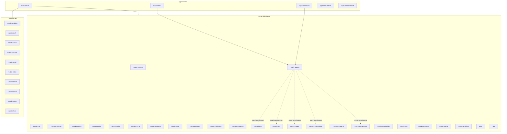

# Module and Application Registry

This document is the central map of RusToK platform modules, support crates,
capability crates, applications, ownership, and FFA/FBA readiness. Detailed
runtime contracts, evidence, and priorities remain in component-local
`README.md`, `docs/README.md`, and `docs/implementation-plan.md` files.

## Registry rules

1. Core and optional modules come only from `modules.toml`.
2. A crate is not automatically a platform module.
3. Module ownership remains in the owner crate; `apps/server` and UI hosts are
   composition roots only.
4. Changes to ownership, module composition, UI surfaces, or FFA/FBA status must
   update local docs, `modules.toml`/`rustok-module.toml`, and this registry in the
   same change.
5. Cross-module integration uses public ports, events, and provider contributions,
   never foreign table access.

## FFA/FBA readiness board

Statuses:

- FFA: `not_started | in_progress | phase_b_ready | parity_verified`;
- FBA: `not_started | in_progress | boundary_ready | transport_verified`.

Structural shapes:

- `none`;
- `docs_boundary`;
- `core_only`;
- `core_transport`;
- `core_transport_ui`;
- `no_ui_boundary`.

The local implementation plan is the status source of truth. `parity_verified`
and `transport_verified` require executable evidence. A new module receives a row
before its first transport/UI change.

| Module slug | UI surfaces | FFA status | FBA status | Structural shape | Source plan / evidence |
|---|---|---|---|---|---|
| `email` | none | `not_started` | `transport_verified` | `no_ui_boundary` | [plan](../../crates/rustok-email/docs/implementation-plan.md) |
| `flex` | none | `not_started` | `boundary_ready` | `no_ui_boundary` | [plan](../../crates/flex/docs/implementation-plan.md) |
| `rustok-mcp` | admin + Next admin | `in_progress` | `boundary_ready` | `core_transport_ui` | [plan](../../crates/rustok-mcp/docs/implementation-plan.md) |
| `channel` | admin | `in_progress` | `boundary_ready` | `core_transport_ui` | [plan](../../crates/rustok-channel/docs/implementation-plan.md) |
| `page_builder` | no module-owned UI | `not_started` | `boundary_ready` | `no_ui_boundary` | [plan](../../crates/rustok-page-builder/docs/implementation-plan.md) |
| `pages` | admin + storefront | `in_progress` | `boundary_ready` | `core_transport_ui` | [plan](../../crates/rustok-pages/docs/implementation-plan.md) |
| `blog` | admin + storefront | `in_progress` | `boundary_ready` | `core_transport_ui` | [plan](../../crates/rustok-blog/docs/implementation-plan.md) |
| `outbox` | admin | `in_progress` | `boundary_ready` | `core_transport_ui` | [plan](../../crates/rustok-outbox/docs/implementation-plan.md) |
| `index` | admin | `in_progress` | `boundary_ready` | `core_transport_ui` | [plan](../../crates/rustok-index/docs/implementation-plan.md) |
| `rbac` | admin | `in_progress` | `boundary_ready` | `core_transport_ui` | [plan](../../crates/rustok-rbac/docs/implementation-plan.md) |
| `tenant` | admin | `in_progress` | `transport_verified` | `core_transport_ui` | [plan](../../crates/rustok-tenant/docs/implementation-plan.md) |
| `profiles` | none | `not_started` | `not_started` | `no_ui_boundary` | [plan](../../crates/rustok-profiles/docs/implementation-plan.md) |
| `groups` | admin + storefront | `in_progress` | `in_progress` | `core_transport_ui` | [plan](../../crates/rustok-groups/docs/implementation-plan.md); [registry](../../crates/rustok-groups/contracts/groups-fba-registry.json); `scripts/verify/verify-groups-boundary.mjs`; runtime provider/fallback evidence pending. |
| `taxonomy` | none | `not_started` | `not_started` | `no_ui_boundary` | [plan](../../crates/rustok-taxonomy/docs/implementation-plan.md) |
| `storage` | none | `not_started` | `not_started` | `no_ui_boundary` | [plan](../../crates/rustok-storage/docs/implementation-plan.md) |
| `core` | none | `not_started` | `not_started` | `no_ui_boundary` | [plan](../../crates/rustok-core/docs/implementation-plan.md) |
| `api` | none | `not_started` | `not_started` | `no_ui_boundary` | [plan](../../crates/rustok-api/docs/implementation-plan.md) |
| `runtime` | none | `not_started` | `not_started` | `no_ui_boundary` | [plan](../../crates/rustok-runtime/docs/implementation-plan.md) |
| `modules` | none | `not_started` | `boundary_ready` | `no_ui_boundary` | [plan](../../crates/rustok-modules/docs/implementation-plan.md) |
| `web` | none | `not_started` | `not_started` | `no_ui_boundary` | [plan](../../crates/rustok-web/docs/implementation-plan.md) |
| `alloy` | none | `not_started` | `boundary_ready` | `no_ui_boundary` | [plan](../../crates/alloy/docs/implementation-plan.md) |
| `comments` | admin | `in_progress` | `boundary_ready` | `core_transport_ui` | [plan](../../crates/rustok-comments/docs/implementation-plan.md) |
| `forum` | admin + storefront | `in_progress` | `boundary_ready` | `core_transport_ui` | [plan](../../crates/rustok-forum/docs/implementation-plan.md) |
| `search` | admin + storefront | `phase_b_ready` | `boundary_ready` | `core_transport_ui` | [plan](../../crates/rustok-search/docs/implementation-plan.md) |
| `cart` | storefront | `phase_b_ready` | `boundary_ready` | `core_transport_ui` | [plan](../../crates/rustok-cart/docs/implementation-plan.md) |
| `commerce` | admin + storefront | `in_progress` | `boundary_ready` | `core_transport_ui` | [plan](../../crates/rustok-commerce/docs/implementation-plan.md) |
| `workflow` | admin | `phase_b_ready` | `boundary_ready` | `core_transport_ui` | [plan](../../crates/rustok-workflow/docs/implementation-plan.md) |
| `region` | admin + storefront | `in_progress` | `boundary_ready` | `core_transport_ui` | [plan](../../crates/rustok-region/docs/implementation-plan.md) |
| `product` | admin + storefront | `in_progress` | `boundary_ready` | `core_transport_ui` | [plan](../../crates/rustok-product/docs/implementation-plan.md) |
| `customer` | admin | `in_progress` | `boundary_ready` | `core_transport_ui` | [plan](../../crates/rustok-customer/docs/implementation-plan.md) |
| `pricing` | admin + storefront | `in_progress` | `boundary_ready` | `core_transport_ui` | [plan](../../crates/rustok-pricing/docs/implementation-plan.md) |
| `inventory` | admin | `in_progress` | `boundary_ready` | `core_transport_ui` | [plan](../../crates/rustok-inventory/docs/implementation-plan.md) |
| `order` | admin + storefront | `in_progress` | `boundary_ready` | `core_transport_ui` | [plan](../../crates/rustok-order/docs/implementation-plan.md) |
| `payment` | storefront | `in_progress` | `boundary_ready` | `core_transport_ui` | [plan](../../crates/rustok-payment/docs/implementation-plan.md) |
| `fulfillment` | admin + storefront | `in_progress` | `boundary_ready` | `core_transport_ui` | [plan](../../crates/rustok-fulfillment/docs/implementation-plan.md) |
| `seo` | admin + storefront contracts | `in_progress` | `in_progress` | `core_transport_ui` | [plan](../../crates/rustok-seo/docs/implementation-plan.md) |
| `media` | admin | `in_progress` | `boundary_ready` | `core_transport_ui` | [plan](../../crates/rustok-media/docs/implementation-plan.md) |
| `ai-media` | none | `not_started` | `boundary_ready` | `no_ui_boundary` | [plan](../../crates/rustok-ai-media/docs/implementation-plan.md) |
| `tax` | none | `not_started` | `boundary_ready` | `no_ui_boundary` | [plan](../../crates/rustok-tax/docs/implementation-plan.md) |
| `ai` | admin + Next admin | `in_progress` | `boundary_ready` | `core_transport_ui` | [plan](../../crates/rustok-ai/docs/implementation-plan.md) |
| `ai-content` | AI owner admin + Next admin | `not_started` | `boundary_ready` | `no_ui_boundary` | [plan](../../crates/rustok-ai-content/docs/implementation-plan.md) |
| `ai-order` | AI owner admin + Next admin | `not_started` | `boundary_ready` | `no_ui_boundary` | [plan](../../crates/rustok-ai-order/docs/implementation-plan.md) |
| `ai-product` | AI owner admin + Next admin | `not_started` | `boundary_ready` | `no_ui_boundary` | [plan](../../crates/rustok-ai-product/docs/implementation-plan.md) |
| `auth` | admin | `phase_b_ready` | `boundary_ready` | `core_transport_ui` | [plan](../../crates/rustok-auth/docs/implementation-plan.md) |

## Architecture map

## Platform modules

### Core modules

| Slug | Crate | Role |
|---|---|---|
| `modules` | `rustok-modules` | Module artifact, installation, lifecycle, build/publication, and tenant policy control plane |
| `auth` | `rustok-auth` | Identity, credentials, sessions, and tokens |
| `cache` | `rustok-cache` | Cache backend and acceleration policy |
| `channel` | `rustok-channel` | Platform channel resolution and bindings |
| `email` | `rustok-email` | Email transport and delivery lifecycle |
| `index` | `rustok-index` | Indexed read-model substrate |
| `search` | `rustok-search` | Search, ranking, dictionaries, and query rules |
| `outbox` | `rustok-outbox` | Transactional event relay, retry, and DLQ |
| `tenant` | `rustok-tenant` | Tenant lifecycle and tenant module enablement |
| `rbac` | `rustok-rbac` | Permission runtime and policy decisions |

### Optional modules

| Slug | Crate | Dependencies | Role |
|---|---|---|---|
| `content` | `rustok-content` | — | Shared content and rich-text orchestration |
| `cart` | `rustok-cart` | — | Cart lifecycle and storefront cart owner |
| `customer` | `rustok-customer` | — | Customer profile boundary |
| `product` | `rustok-product` | `taxonomy` | Product catalog and variants |
| `profiles` | `rustok-profiles` | `taxonomy` | Public member/profile summaries |
| `groups` | `rustok-groups` | — | Social group identity, multilingual presentation, memberships, local roles, privacy, and versioned feature bindings; content remains with owner modules |
| `region` | `rustok-region` | — | Regions, countries, currencies, and tax baseline |
| `pricing` | `rustok-pricing` | `product` | Price lists and effective pricing |
| `inventory` | `rustok-inventory` | `product` | Stock and reservation authority |
| `order` | `rustok-order` | — | Order lifecycle and snapshots |
| `payment` | `rustok-payment` | — | Payment collections and payments |
| `fulfillment` | `rustok-fulfillment` | — | Shipping options and fulfillment lifecycle |
| `commerce` | `rustok-commerce` | commerce family | Checkout and ecommerce orchestration |
| `marketplace_seller` | `rustok-marketplace-seller` | — | Seller identity and seller-scoped memberships |
| `marketplace_listing` | `rustok-marketplace-listing` | `marketplace_seller`, `product` | Marketplace listing lifecycle |
| `marketplace` | `rustok-marketplace` | marketplace family | Marketplace orchestration root |
| `moderation` | `rustok-moderation` | — | Cross-domain reports, cases, decisions, and enforcement orchestration |
| `blog` | `rustok-blog` | `content`, `comments`, `taxonomy` | Blog posts, categories, tags, and UI |
| `forum` | `rustok-forum` | `content`, `taxonomy`, `page_builder` | Forum topics, replies, moderation, and UI |
| `comments` | `rustok-comments` | — | Generic comment threads |
| `pages` | `rustok-pages` | `content`, `page_builder` | Pages, menus, and published artifacts |
| `page_builder` | `rustok-page-builder` | — | Visual builder capability contracts |
| `seo` | `rustok-seo` | `content` | SEO templates, redirects, sitemap, and control plane |
| `taxonomy` | `rustok-taxonomy` | `content` | Shared vocabulary and dictionaries |
| `media` | `rustok-media` | — | Media upload, storage facade, and asset lifecycle |
| `workflow` | `rustok-workflow` | — | Workflow execution, templates, and webhooks |
| `alloy` | `alloy` | — | Sandboxed scripting and automation |
| `flex` | `flex` | — | Attached and standalone custom fields |

## Shared and capability crates

| Crate | Role |
|---|---|
| `rustok-core` | Shared foundation contracts and validation/security primitives |
| `rustok-api` | Shared request, context, permission, and port contracts |
| `rustok-runtime` | Runtime composition helpers |
| `rustok-fba` | FBA topology and provider/consumer metadata |
| `rustok-events` | Canonical event contracts |
| `rustok-storage` | Storage backend abstraction |
| `rustok-commerce-foundation` | Neutral commerce DTOs and shared contracts |
| `rustok-graphql` | Framework-neutral GraphQL client |
| `rustok-ui-core` | Framework-neutral UI route/state contracts |
| `rustok-ui-transport` | Framework-neutral selected-transport contracts |
| `rustok-ui-i18n` | Framework-neutral message catalogs |
| `rustok-ui-i18n-leptos` | Leptos host-locale adapter |
| `rustok-telemetry` | Observability bootstrap and helpers |
| `rustok-mcp` | MCP management capability |
| `rustok-ai` and adapters | AI orchestration and domain support adapters |

## Applications

| Component | Role |
|---|---|
| `apps/server` | Axum/GraphQL composition root and runtime wiring |
| `apps/admin` | Leptos admin host |
| `apps/storefront` | Leptos storefront host |
| `apps/next-admin` | Next.js admin host |
| `apps/next-frontend` | Next.js storefront host |

## Boundary evidence references

- Groups: `crates/rustok-groups/contracts/groups-fba-registry.json` and
  `scripts/verify/verify-groups-boundary.mjs`.
- Module-specific evidence remains linked from each local implementation plan and
  machine-readable registry.

## Related documents

- [Module Platform Overview](./overview.md)
- [Module Documentation Index](./_index.md)
- [Implementation Plans Registry](./implementation-plans-registry.md)
- [UI Packages Index](./UI_PACKAGES_INDEX.md)
- [`rustok-module.toml` Contract](./manifest.md)
- [Groups implementation plan](../../crates/rustok-groups/docs/implementation-plan.md)
- [Groups boundary ADR](../../DECISIONS/2026-07-21-groups-owner-and-feature-provider-boundary.md)
