# Реестр модулей и приложений

Этот документ фиксирует актуальную карту платформенных модулей, support crate-ов,
capability crate-ов и host-приложений в RusToK.

## Как читать реестр

1. `Core` и `Optional` модули берутся только из `modules.toml`.
2. `crate` — это способ упаковки в Cargo, а не автоматически платформенный модуль.
3. Shared/support/capability crate-ы живут рядом с module crate-ами; capability-only
   ghost modules при этом могут быть заведены в `modules.toml`, если им нужен formal
   runtime/module contract.
4. Этот реестр даёт только центральную карту ownership и ролей; источник истины для runtime-контракта живёт в локальных `README.md` и `docs/README.md` самих компонентов.

## Контракт документации

Для компонентов, перечисленных в этом реестре, действует единый стандарт документации:

- root `README.md` на английском описывает разделы `Purpose`, `Responsibilities`, `Entry points` и `Interactions`;
- локальный `docs/README.md` на русском фиксирует живой runtime/module/app-контракт;
- локальный `docs/implementation-plan.md` на русском фиксирует живой план развития, а не исторический changelog.

Центральный реестр не должен дублировать эти локальные документы. Его задача — дать карту платформы и отправить читателя в правильный компонент.

## Ownership-review policy

Для изменений в этом реестре действует обязательный путь ownership-review:

1. Сначала актуализируются локальные документы затронутых компонентов
   (`README.md`, `docs/README.md`, при необходимости `docs/implementation-plan.md`).
2. Затем обновляется этот central registry как карта, а не как дубль локальной
   спецификации.
3. Любое изменение ownership/capability/support статуса должно быть
   синхронизировано с `modules.toml` и проверено module platform owner.
4. Для cross-cutting правок (несколько модулей/host-приложений) требуется
   дополнительный review от platform team.

Без подтверждённого ownership-review изменение считается незавершённым.

## FFA/FBA readiness board (module-owned UI)

Этот раздел задаёт центральный статус по FFA/FBA для модулей, где есть module-owned UI
и/или явно выраженный backend boundary contract.

Статусы:

- FFA: `not_started | in_progress | phase_b_ready | parity_verified`
- FBA: `not_started | in_progress | boundary_ready | transport_verified`

Текущий rollout намеренно ведётся как FFA-first, но готовые slices могут переходить в
FBA-hardening только при явном local evidence. Пока FFA phase-gate не закрыт и в local plan
нет FBA-readiness evidence, FBA-колонка остаётся `not_started`, даже если код уже содержит
backend/boundary подготовку или future-FBA guardrails.

Для новых модулей и крупных module splits строка в readiness board заводится до первого
transport/UI PR. Минимальный gate: module ownership, canonical service contract, typed
request context/errors, data ownership, explicit ports/events и local FFA/FBA status block.

Правило синхронизации:

1. Источник истины для статуса — локальный `docs/implementation-plan.md` модуля.
2. При изменении локального FFA/FBA status block этот board обновляется в том же PR.
3. Если статус = `parity_verified` или `transport_verified`, в PR должны быть verification evidence.

Structural shape фиксирует глубину code-level FFA split независимо от governance status:

- `none` — кодовый split ещё не начат;
- `docs_boundary` — синхронизирован boundary/docs track, но UI split ещё не начат;
- `core_only` — framework-agnostic `core.rs` или `core/` уже владеет view-model/request/policy фрагментом;
- `core_transport` — добавлен module-owned `transport/` facade/adapters;
- `core_transport_ui` — есть `core`, `transport` и явный `ui/leptos.rs` или `ui/leptos/` adapter;
- `no_ui_boundary` — у модуля нет module-owned UI, но есть backend boundary/FBA track.

| Module slug | UI surfaces | FFA status | FBA status | Structural shape | Source plan |
|---|---|---|---|---|---|
| `email` | none | `not_started` | `transport_verified` | `no_ui_boundary` | `crates/rustok-email/docs/implementation-plan.md` (capability-only module has no module-owned UI surface; FBA provider registry `crates/rustok-email/contracts/email-fba-registry.json` + `crates/rustok-email/src/ports.rs` declare `EmailDeliveryPort` / `email.delivery.v1` for transactional email delivery consumers with typed `PortContext`/`PortError`, deadline semantics, write idempotency semantics, disabled-provider noop preservation, delivery retry degraded mode, runtime-verified evidence packet `crates/rustok-email/contracts/evidence/email-contract-test-static-matrix.json` and no-compile fallback smoke `crates/rustok-email/contracts/evidence/email-runtime-fallback-smoke.json` verified by `npm run verify:email:fba` / `npm run verify:foundation:fba-runtime-smoke`; compiled runtime evidence `cargo test -p rustok-email --lib` passed 8/8 on 2026-06-30) |
| `rustok-mcp` | admin + Next admin | `in_progress` | `in_progress` | `core_transport_ui` | `crates/rustok-mcp/docs/implementation-plan.md` (owner UI покрывает persisted Alloy scaffold drafts, audit events и полный MCP client/policy/token management в Next и Leptos FFA; typed `McpManagementMutationPort`, server provider и `ModuleRuntimeExtensions` registration делегируют client/policy/token/scaffold writes каноническому `McpManagementService`, native `#[server]` и GraphQL остаются параллельными; Next host монтирует owner package на `/dashboard/mcp`, Leptos host — на `/mcp` во всех CSR/hydrate/SSR профилях; guardrail требует port delegation и запрещает scaffold writes в UI adapter/transport logic в host; остается authenticated browser parity smoke; MCP admin structural files are now `core.rs`, `transport/*`, and `ui/leptos.rs` with explicit exports) |
| `channel` | admin | `in_progress` | `boundary_ready` | `core_transport_ui` | `crates/rustok-channel/docs/implementation-plan.md` (FBA provider registry `crates/rustok-channel/contracts/channel-fba-registry.json` + `crates/rustok-channel/src/ports.rs` declare `ChannelReadPort` / `channel.read_projection.v1` for channel/default/host-target read projection consumers with typed `PortContext`/`PortError`, tenant-scope preservation, inactive-channel degraded modes, read deadline semantics, static evidence packet `crates/rustok-channel/contracts/evidence/channel-contract-test-static-matrix.json` and runtime fallback smoke `crates/rustok-channel/contracts/evidence/channel-runtime-fallback-smoke.json` verified by `npm run verify:channel:fba` / `npm run verify:foundation:fba-runtime-smoke`; FBA boundary is ready on no-compile executable fallback evidence, with full Rust runtime contract/fallback evidence reserved for `transport_verified`; resolution order `explicit selectors -> built-in host slice -> typed policies -> explicit default -> unresolved` and built-in host fast-path decision are source-locked by `npm run verify:channel:resolution-contract`; runtime facts parity is source-locked in `apps/server/src/middleware/channel.rs` via `ResolvedRequestLocale`/`AuthContextExtension` facts, cache-key partitioning and `LocaleEquals`/`OAuthAppEquals` middleware policy tests; admin FFA structural split and fast boundary guardrails remain unchanged: `scripts/verify/verify-channel-admin-boundary.mjs`, `scripts/verify/verify-channel-admin-boundary.test.mjs`; semantic proof points for `rustok-pages`, `rustok-blog`, `rustok-commerce` and `rustok-forum` are source-locked by `npm run verify:channel:proof-points`) |
| `page_builder` | no module-owned UI | `not_started` | `in_progress` | `no_ui_boundary` | `crates/rustok-page-builder/docs/implementation-plan.md` (standalone FBA reference provider for `preview/tree/properties/publish` with contract `grapesjs_v1`; machine-readable registry `crates/rustok-page-builder/contracts/page-builder-fba-registry.json` fixes provider/consumer versions, fallback profiles, health states, degradation reasons, SLO thresholds and port call policies; baseline gates cover registry anti-drift, evidence template and synthetic Wave 0 packet; capability handlers have reference-provider and adapter-backed baselines; serializable `PAGE_BUILDER_CAPABILITY_PERMISSIONS` source-locks capability permission map, while `PageBuilderCapabilityPortPolicies` and serializable `PAGE_BUILDER_CAPABILITY_PORT_POLICIES` source-lock read capability `PortCallPolicy::read()` deadline semantics and `publish` write deadline + idempotency enforcement; `PageBuilderAdapterCallEvidence` + `PageBuilderAdapterTelemetry` now pin owner-side audit/observability markers and `started/succeeded/failed` outcomes for `load_project`, `save_project` and `render_preview` without changing capability DTOs or transport envelopes; status remains below `boundary_ready` until host GraphQL/Leptos wrappers and tenant evidence packet land; correlation evidence gate `verify-page-builder-correlation-evidence.mjs` pins `builder write -> pages publish -> storefront read` trace samples for Wave packets) |
| `pages` | admin + storefront | `in_progress` | `in_progress` | `core_transport_ui` | `crates/rustok-pages/docs/implementation-plan.md` (admin + storefront slices: `core` + thin `transport` facades + explicit `ui/leptos` adapters; native/GraphQL contract unchanged; admin GraphQL operations live in `admin/src/transport/graphql_adapter.rs`, storefront GraphQL/native operations live in `storefront/src/transport/{graphql_adapter,native_server_adapter}.rs`, and legacy `admin/src/api.rs` + `storefront/src/api.rs` are forbidden by `scripts/verify/verify-pages-ui-boundary.mjs`; `pages` is the first FBA consumer baseline for `page_builder` via `fba.builder_consumer` metadata, degraded modes, typed error catalog and fallback profiles; fast boundary guardrail `scripts/verify/verify-pages-ui-boundary.mjs` now also pins admin capability-card, admin busy-state, admin table item/action view, storefront list item view, selected-page empty-state and storefront load-error helper ownership; FBA rollout policy markers for `control_plane_builder_wave_audit`, before/after snapshots, keep/rollback decision, owner sign-off, SLO rollback triggers and pilot smoke are checked by `npm run verify:page-builder:consumer:pages`; legacy bridge guardrail verify-page-builder-pages-legacy-bridge.mjs; RBAC Wave 1 readiness guardrail verify-page-builder-pages-rbac-readiness.mjs; correlation evidence guardrail verify-page-builder-correlation-evidence.mjs; contract-surface guardrail verify-page-builder-pages-contract-surface.mjs; storefront backend/core dependencies are optional SSR-only and no-feature/hydrate trees are client-clean) |
| `blog` | admin + storefront | `in_progress` | `in_progress` | `core_transport_ui` | `crates/rustok-blog/docs/implementation-plan.md` (FBA consumer registry `crates/rustok-blog/contracts/blog-fba-registry.json`, static matrix `crates/rustok-blog/contracts/evidence/blog-comments-consumer-static-matrix.json`, no-compile source-smoke packet `crates/rustok-blog/contracts/evidence/blog-comments-runtime-fallback-smoke.json` and no-compile runtime-order smoke `crates/rustok-blog/contracts/evidence/blog-comments-consumer-runtime-order-smoke.json` lock the blog -> comments `CommentsThreadPort` / `comments.thread.v1` dependency, fallback profiles, degraded modes and comment service ordering under `npm run verify:blog:fba` / `npm run verify:consumer:fba-runtime-order`; status remains below `boundary_ready` until real runtime contract execution lands; storefront native/GraphQL transport now lives fully under `storefront/src/transport/` and legacy `storefront/src/api.rs` is forbidden by `scripts/verify/verify-blog-storefront-boundary.mjs`; latest FFA slices keep admin warning, posts-load, posts-table, editor-form-copy and title-input autoslug presentation/input envelopes in Leptos-free `BlogPostAdminRawBodyWarningViewModel`, `BlogPostAdminPostsLoadViewModel`, `blog_post_admin_posts_load_view_from_list`, `BlogPostAdminPostsTableViewModel`, `BlogPostAdminEditorFormCopyViewModel`, `BlogPostAdminTitleInputViewModel`, `BlogPostAdminBodyFormatSelectViewModel`, `BlogPostAdminBodyFormatChangeViewModel`, `BlogPostAdminEditorFieldClassesViewModel`, `BlogPostAdminTableClassesViewModel`, and `BlogPostAdminShellClassesViewModel`; fast boundary guardrails `scripts/verify/verify-blog-admin-boundary.mjs`, `scripts/verify/verify-blog-admin-boundary.test.mjs`, `scripts/verify/verify-blog-storefront-boundary.mjs` and `scripts/verify/verify-blog-storefront-boundary.test.mjs` pin the current split; storefront blog/core dependencies are optional SSR-only and no-feature/hydrate trees are client-clean) |
| `outbox` | admin | `in_progress` | `in_progress` | `core_transport_ui` | `crates/rustok-outbox/docs/implementation-plan.md` (read-only admin FFA slice remains Leptos-free core + native server-function transport + explicit Leptos adapter; FBA provider registry `crates/rustok-outbox/contracts/outbox-fba-registry.json` + `crates/rustok-outbox/src/ports.rs` declare `OutboxRelayPort` / `outbox.relay_control.v1` with canonical `rustok_api::ports::PortContext`/`PortError`, write-policy deadline/idempotency semantics, static matrix `crates/rustok-outbox/contracts/evidence/outbox-contract-test-static-matrix.json` and runtime-order packet `crates/rustok-outbox/contracts/evidence/outbox-provider-runtime-order-smoke.json`; `npm run verify:outbox:fba` and the shared owner gate verify metadata/source order without compilation; status remains below `boundary_ready` until live relay execution) |
| `index` | admin | `in_progress` | `boundary_ready` | `core_transport_ui` | `crates/rustok-index/docs/implementation-plan.md` (admin overview FFA slice remains Leptos-free core + native server-function transport + explicit Leptos adapter; FBA provider registry `crates/rustok-index/contracts/index-fba-registry.json` + `crates/rustok-index/src/ports.rs` declare `IndexReadModelPort` / `index.read_model.v1` and `IndexRebuildPort` / `index.rebuild.v1` for indexed document reads and operator rebuild orchestration with shared `rustok_api::PortContext`/`PortError`, tenant-scope preservation, `PortCallPolicy::read()` deadline semantics, `PortCallPolicy::write()` rebuild idempotency/deadline tracing and static evidence packet `crates/rustok-index/contracts/evidence/index-contract-test-static-matrix.json` plus no-compile source-locked runtime fallback smoke `crates/rustok-index/contracts/evidence/index-runtime-fallback-smoke.json` with `InProcessIndexReadModelAdapter`/`RebuildDisabledIndexAdapter` seams verified by `npm run verify:index:fba` / `npm run verify:foundation:fba-runtime-smoke`; FBA boundary is ready on no-compile executable fallback evidence, with persistence-backed Rust runtime contract/fallback evidence reserved for `transport_verified`) |
| `rbac` | admin | `in_progress` | `in_progress` | `core_transport_ui` | `crates/rustok-rbac/docs/implementation-plan.md` (admin overview FFA slice keeps Leptos-free `core`, native server-function `transport` facade and explicit `ui/leptos.rs` adapter; FBA provider registry `crates/rustok-rbac/contracts/rbac-fba-registry.json` + `crates/rustok-rbac/src/ports.rs` declare `RbacPermissionDecisionPort` / `rbac.permission_decision.v1` for admin permission-decision consumers with typed `PortContext`/`PortError`, read deadline semantics, claims-scope preservation, static evidence packet `crates/rustok-rbac/contracts/evidence/rbac-contract-test-static-matrix.json` and no-compile runtime-order smoke `crates/rustok-rbac/contracts/evidence/rbac-provider-runtime-order-smoke.json` verified by `npm run verify:rbac:fba` / `npm run verify:owner:fba-runtime-order`; status remains below `boundary_ready` until live host execution; fast guardrail: `scripts/verify/verify-rbac-admin-boundary.mjs`; fixture suite: `scripts/verify/verify-rbac-admin-boundary.test.mjs`) |
| `tenant` | admin | `in_progress` | `transport_verified` | `core_transport_ui` | `crates/rustok-tenant/docs/implementation-plan.md` (admin FFA slice remains native-only with Leptos-free core/transport/ui split; FBA provider registry `crates/rustok-tenant/contracts/tenant-fba-registry.json` + `crates/rustok-tenant/src/ports.rs` declare `TenantReadPort` / `tenant.read_projection.v1` for server-host tenant resolution/read consumers by id/slug/domain with shared `rustok_api::PortContext`/`PortError`, `PortCallPolicy::read()` deadline semantics, inactive-tenant degraded modes, runtime-verified evidence packet `crates/rustok-tenant/contracts/evidence/tenant-contract-test-static-matrix.json` and no-compile fallback smoke `crates/rustok-tenant/contracts/evidence/tenant-runtime-fallback-smoke.json` verified by `npm run verify:tenant:fba` / `npm run verify:foundation:fba-runtime-smoke`; compiled runtime evidence `cargo test -p rustok-tenant tenant_read_port --test integration` passed 3/3 on 2026-06-30; host resolver cache-miss handoff to `TenantReadPort` is source-locked in `apps/server/src/middleware/tenant.rs` while cache/coalescing/negative-cache remain host-owned; installer provisioning/verification slug read-facts handoff is source-locked in `apps/server/src/installer_cli.rs` while create/update/module lifecycle orchestration remains host-owned; runtime tests cover deadline enforcement, typed validation/not-found mapping, domain lookup and inactive-tenant degraded mode; fast admin guardrail: `scripts/verify/verify-tenant-admin-boundary.mjs`; fixture suite: `scripts/verify/verify-tenant-admin-boundary.test.mjs`) |
| `comments` | admin | `in_progress` | `in_progress` | `core_transport_ui` | `crates/rustok-comments/docs/implementation-plan.md` (admin slice keeps Leptos-free `core`, native-only `transport/` facade and explicit `ui/leptos.rs` adapter; FBA provider registry `crates/rustok-comments/contracts/comments-fba-registry.json` + `crates/rustok-comments/src/ports.rs` declare `CommentsThreadPort`/`comments.thread.v1` for blog and future commentable-surface consumers with typed `PortContext`/`PortError`, write idempotency/deadline semantics, read deadline semantics, static evidence packet `crates/rustok-comments/contracts/evidence/comments-contract-test-static-matrix.json` and no-compile runtime-order smoke `crates/rustok-comments/contracts/evidence/comments-provider-runtime-order-smoke.json` verified by `npm run verify:comments:fba` / `npm run verify:owner:fba-runtime-order`; status remains below `boundary_ready` until live provider/consumer execution; GraphQL/REST admin fallback is intentionally not added because comments admin has no legacy transport surface; fast admin guardrail: `scripts/verify/verify-comments-admin-boundary.mjs`; fixture suite: `scripts/verify/verify-comments-admin-boundary.test.mjs`; port authority is derived strictly from `PortContext`; only `PortActorKind::System` receives system authority) |
| `forum` | admin + storefront | `in_progress` | `in_progress` | `core_transport_ui` | `crates/rustok-forum/docs/implementation-plan.md` (admin+storefront slices: `core/` helpers + thin `transport` facades + explicit `ui/leptos` adapters; latest admin slices move selected category filter label policy, collection empty/ready/error classification, category/topic form snapshots, submit validation, card view-models, category-sidebar/reply-stack mapping, page header selection, loaded-result metric count policy, route/query intents, typed busy-key construction, form/transport error message policy, topic form/sidebar presentation helpers, tag-chip/position parsing, sidebar/status CSS class policy, title envelope policy, placeholder policy, SEO copy mapping, delete outcome policy, exact busy/deleted-selection item matching, category matrix/composer-form labels, topic stream/inspector-form labels, reply preview labels, moderator-note/sidebar copy envelopes, metric accent policy and action-button style policy into Leptos-free core; storefront keeps native+GraphQL contracts through `storefront/src/transport/mod.rs` + `storefront/src/transport/graphql_adapter.rs` without legacy `storefront/src/api.rs`, while its Leptos-free core owns count/slug labels, category/topic card view-models, accent fallback and status badge class policy; admin now uses GraphQL-first transport with REST fallback behind `transport.rs`, backed by admin GraphQL detail/category mutation parity fields, with REST fallback isolated in `admin/src/transport/rest_adapter.rs` and legacy `admin/src/api.rs` forbidden by `scripts/verify/verify-forum-admin-boundary.mjs`; fast guardrails `scripts/verify/verify-forum-admin-boundary.mjs`, `scripts/verify/verify-forum-storefront-boundary.mjs`, `scripts/verify/verify-forum-admin-boundary.test.mjs`, `scripts/verify/verify-forum-storefront-boundary.test.mjs` (wired as `npm run test:verify:forum:admin-boundary`, `npm run test:verify:forum:storefront-boundary` and aggregate FFA fixture coverage), and `npm run verify:page-builder:consumer:forum` for FW-2 static fallback markers plus `crates/rustok-forum/contracts/evidence/fw2-fallback-static-matrix.json` read/moderation no-5xx source-marker assertions; synthetic dry-run evidence packet for Wave 0 verified in forum-wave0-dry-run-evidence.json; Wave 1 rollout evidence is successfully recorded under forum-wave1-rollout-evidence.json and verified with fast boundary scripts; FW-7 monthly refresh policy, FW-8 time-bound freshness, FW-9 focused freshness fixtures, FW-10 actual refresh-section materialization and FW-11 non-empty refresh-section shape are enforced by `npm run verify:page-builder:consumer:forum`, focused `npm run verify:forum:wave-evidence-freshness` and `npm run test:verify:forum:wave-evidence-freshness`, with stale, missing or empty required evidence sections blocking rollout until refreshed) |
| `search` | admin + storefront | `phase_b_ready` | `boundary_ready` | `core_transport_ui` | `crates/rustok-search/docs/implementation-plan.md` (Phase B closed at slice #40: admin/storefront surfaces have `core/transport/ui` split; admin native/GraphQL adapter now lives in `admin/src/transport/native_server_adapter.rs`, storefront native/GraphQL paths now live fully under `storefront/src/transport/`, and legacy `admin/src/api.rs` + `storefront/src/api.rs` are forbidden by `scripts/verify/verify-search-ui-boundary.mjs`; FBA provider registry `crates/rustok-search/contracts/search-fba-registry.json` + `crates/rustok-search/src/ports.rs` declare `SearchQueryPort`/`SearchSuggestionPort` (`search.query.v1`) for storefront/admin search consumers with typed `PortContext`/`PortError`, read deadline semantics, degraded modes and fallback profiles; static evidence packet `crates/rustok-search/contracts/evidence/search-contract-test-static-matrix.json` plus executable no-compile runtime fallback smoke `crates/rustok-search/contracts/evidence/search-runtime-fallback-smoke.json` / `scripts/verify/verify-search-fba-runtime-smoke.mjs`, runtime contract smoke `crates/rustok-search/contracts/evidence/search-runtime-contract-smoke.json` / `scripts/verify/verify-search-fba-runtime-contract.mjs`, invocation trace `crates/rustok-search/contracts/evidence/search-runtime-invocation-trace.json` / `scripts/verify/verify-search-fba-runtime-invocation.mjs`, and fixture regression suites are verified by `npm run verify:search:fba` / `npm run test:verify:search:fba`; FBA boundary is ready on executable no-compile runtime fallback/contract/invocation evidence, with live runtime contract execution reserved for `transport_verified`) |
| `cart` | storefront | `phase_b_ready` | `in_progress` | `core_transport_ui` | `crates/rustok-cart/docs/implementation-plan.md` (cart-owned storefront UI stays in `rustok-cart/storefront` with `core/transport/ui` split; native/GraphQL calls now live under `storefront/src/transport/`, legacy `storefront/src/api.rs` is forbidden by `scripts/verify/verify-cart-storefront-boundary.mjs`, and latest handoff slice exports `CartCheckoutHandoffCard`/view-model consumed by commerce checkout orchestration; the cart storefront boundary guardrail also blocks `sellerScope`/`seller_scope` from returning to line-item/delivery-group read queries or storefront model DTOs and now locks full `StorefrontCartShippingOption` summaries plus storefront repricing inside `cart/storefront-data`; FBA provider registry `crates/rustok-cart/contracts/cart-fba-registry.json` + `crates/rustok-cart/src/ports.rs` declare `CartSnapshotReadPort`/`cart.checkout_snapshot.v1` for commerce checkout snapshot consumers with typed PortContext/PortError, fallback profiles, static evidence packet `crates/rustok-cart/contracts/evidence/cart-contract-test-static-matrix.json` and no-compile runtime contract smoke `crates/rustok-cart/contracts/evidence/cart-runtime-contract-smoke.json` verified by `npm run verify:ecommerce:fba` / `npm run verify:ecommerce:fba-runtime-smoke`; cart delivery-group keys and shipping-selection matching use `shipping_profile_slug + seller_id` without `seller_scope` fallback; the umbrella `CartService`/`services::cart` re-export is removed and commerce consumers import `rustok-cart` directly; next work is live runtime execution/fallback evidence before `boundary_ready`) |
| `commerce` | admin + storefront | `in_progress` | `in_progress` | `core_transport_ui` | `crates/rustok-commerce/docs/implementation-plan.md` (admin + storefront FFA transport split + next-admin host registration; `StoreContextService` consumes runtime-composed `Arc<dyn RegionReadPort>` and no longer owns a concrete/legacy region path; storefront checkout consumes owner UI/request seams from cart/payment/fulfillment/order packages, while payment collection/refund reads and create/reuse, fulfillment shipping selection and order completion GraphQL/native transports, payloads, mappings and result DTOs live in `rustok-{payment,fulfillment,order}/storefront/src/transport/*`; commerce exposes `src/storefront_checkout_runtime.rs` as the access-checked checkout orchestration API, keeps only the aggregate `commerce/storefront-data` endpoint in `storefront/src/transport/raw_adapter.rs`, delegates cart/payment reads to owner facades and no longer contains raw GraphQL requests, payment/refund DTOs, refund aggregation, owner mutation implementations or native owner-operation wrappers; `verify-commerce-storefront-transport-handoff.mjs` locks MissingServer-only fallback, owner adapter ownership, cart/payment read delegation, no-`seller_scope` seams and forbids rollback into commerce; legacy admin/storefront `api.rs` files are removed, admin raw operations remain under `admin/src/transport/raw_adapter.rs`, and `scripts/verify/verify-commerce-admin-boundary.mjs` locks the admin split; FBA consumer registry `crates/rustok-commerce/contracts/commerce-fba-registry.json` locks `commerce.checkout_orchestration.fba.v1` dependencies and is verified by `verify-ecommerce-fba-registries.mjs`; batch invocation trace `crates/rustok-commerce/contracts/evidence/commerce-domain-provider-invocation-trace.json` is verified by `verify-commerce-domain-fba-runtime-smoke.mjs` against product/pricing/inventory/customer/cart/tax provider smoke packets and consumer fallback/degraded rows; owner service/DTO/entity facade re-exports and root GraphQL/state-machine aliases are removed from `rustok-commerce`; provider SPI evidence remains verified by `verify-ecommerce-provider-spi-evidence.mjs` through `npm run verify:ecommerce:fba`) |
| `workflow` | admin | `phase_b_ready` | `in_progress` | `core_transport_ui` | `crates/rustok-workflow/docs/implementation-plan.md` (Phase B closed: workflow-owned admin UI stays in `rustok-workflow/admin` with `core/transport/ui` split; FBA provider registry `crates/rustok-workflow/contracts/workflow-fba-registry.json`, `WorkflowReadPort` / `workflow.read_projection.v1`, static matrix `crates/rustok-workflow/contracts/evidence/workflow-contract-test-static-matrix.json`, compile-free fallback packet `crates/rustok-workflow/contracts/evidence/workflow-read-projection-runtime-smoke.json` and no-compile runtime-order smoke `crates/rustok-workflow/contracts/evidence/workflow-provider-runtime-order-smoke.json` are guarded by `npm run verify:workflow:fba` / `npm run verify:owner:fba-runtime-order`; live native/GraphQL runtime evidence remains required before `boundary_ready`; fast UI guardrail `scripts/verify/verify-workflow-admin-boundary.mjs`) |
| `region` | admin + storefront | `in_progress` | `in_progress` | `core_transport_ui` | `crates/rustok-region/docs/implementation-plan.md` (FBA provider registry `crates/rustok-region/contracts/region-fba-registry.json` + `crates/rustok-region/src/ports.rs` declare `RegionReadPort` / `region.read_projection.v1` for region/country read projection consumers with shared `rustok_api::ports::PortContext`/`PortError`, tenant-scope and locale fallback preservation, `PortCallPolicy::read()` deadline semantics, static evidence packet `crates/rustok-region/contracts/evidence/region-contract-test-static-matrix.json` and no-compile runtime-order smoke `crates/rustok-region/contracts/evidence/region-provider-runtime-order-smoke.json` verified by `npm run verify:region:fba` / `npm run verify:owner:fba-runtime-order`; commerce store-context plus storefront REST/GraphQL list paths consume the port, no concrete region service remains inside orchestration, and the old `rustok-commerce` owner-service re-export is removed; status remains below `boundary_ready` until live provider execution; fast guardrails `scripts/verify/verify-region-admin-boundary.mjs` and `scripts/verify/verify-region-storefront-boundary.mjs`; admin native-only adapter now lives in `admin/src/transport/native_server_adapter.rs`, storefront keeps native/GraphQL transport split inside transport adapters, and legacy `admin/src/api.rs` + `storefront/src/api.rs` are forbidden by boundary guardrails; slice #42 records the admin legacy API removal) |
| `product` | admin + storefront | `in_progress` | `in_progress` | `core_transport_ui` | `crates/rustok-product/docs/implementation-plan.md` (FBA provider registry `crates/rustok-product/contracts/product-fba-registry.json` + `crates/rustok-product/src/ports.rs` declare `ProductCatalogReadPort`/`product.catalog_read.v1` for commerce/pricing/ai-product catalog read consumers with typed PortContext/PortError, in-process `CatalogService` implementation, static evidence packet `crates/rustok-product/contracts/evidence/product-contract-test-static-matrix.json` and no-compile runtime contract smoke `crates/rustok-product/contracts/evidence/product-runtime-contract-smoke.json` verified by `npm run verify:ecommerce:fba` / `npm run verify:ecommerce:fba-runtime-smoke`; status remains below `boundary_ready` until live runtime fallback/execution evidence lands; umbrella `rustok-commerce` no longer re-exports `CatalogService`, `services::catalog` or public product DTO aliases, so consumers import `CatalogService` and DTO contracts from `rustok-product` directly; slice: storefront native/GraphQL + Leptos adapter split under `storefront/src/transport/`, with legacy `storefront/src/api.rs` forbidden by `scripts/verify/verify-product-storefront-boundary.mjs`, core-owned transport error DOM evidence attributes, `build_product_catalog_rail_labels` rail label ownership, `SelectedProductViewModel.metadata_items` selected metadata row ownership, `resolve_product_storefront_route_segment` route segment fallback ownership and `ProductCatalogRailViewModel.show_empty_state` catalog empty-state ownership; product admin core helpers, `SelectedProductSummaryViewModel`, `ProductAdminSaveCommand` submit preparation, `ProductAdminEditorFormState` editor mapping, `ProductAdminStatusMutationCommand` status mutation preparation, `ProductAdminStatusMutationResultViewModel` status result policy, `ProductAdminDeleteCommand` delete preparation, `ProductAdminDeleteResultViewModel` delete-result policy, `ProductAdminListActionLabels` list action policy, `ProductAdminListStateViewModel` loading/empty/error state copy, `ProductAdminListControlsViewModel` list controls/filter option copy, `ProductAdminShellViewModel`/`ProductAdminProfilePanelViewModel` shell/profile panel copy, `ProductAdminSummaryPanelCopy` selected-summary panel copy, `ProductAdminShippingProfileOption` shipping-profile select option policy, `ProductAdminEditorCopy` editor field/action copy, `ProductAdminErrorCopy` transport/error base copy and failure formatting, `ProductAdminSeoPanelCopy` SEO panel copy, `parse_product_admin_inventory_quantity_input` inventory input normalization, `ProductAdminOpenProductViewModel` open-result policy, `ProductAdminSelectedProductQueryState` selected-query normalization, `product_admin_pricing_preview_state_from_result` pricing preview state mapping, `ProductAdminPricingPreviewRequest` request construction, list row status badge container class policy, list-state container class policy, `ProductAdminListItemViewModel.show_shipping_profile` shipping-profile chip display policy, `ProductAdminRouteQueryIntent` selection route/query write policy, admin GraphQL adapter `admin/src/transport/graphql_adapter.rs`, transport facade and `admin/src/ui/leptos.rs` adapter, with legacy `admin/src/api.rs` forbidden by `scripts/verify/verify-product-admin-boundary.mjs`; fast guardrails `scripts/verify/verify-product-admin-boundary.mjs` + `scripts/verify/verify-product-storefront-boundary.mjs` with fixture tests; storefront locale matching uses `rustok-api`; no-feature/hydrate trees exclude core) |
| `customer` | admin | `in_progress` | `in_progress` | `core_transport_ui` | `crates/rustok-customer/docs/implementation-plan.md` (FBA provider registry `crates/rustok-customer/contracts/customer-fba-registry.json` + `crates/rustok-customer/src/ports.rs` declare `CustomerReadPort`/`customer.read_projection.v1` for commerce/order customer read consumers with typed PortContext/PortError, in-process `CustomerService` implementation, static evidence packet `crates/rustok-customer/contracts/evidence/customer-contract-test-static-matrix.json` and no-compile runtime contract smoke `crates/rustok-customer/contracts/evidence/customer-runtime-contract-smoke.json` verified by `npm run verify:ecommerce:fba` / `npm run verify:ecommerce:fba-runtime-smoke`; source-locked runtime/fallback smoke `crates/rustok-customer/contracts/evidence/customer-read-projection-runtime-smoke.json` plus authored no-compile tests in `crates/rustok-customer/tests/customer_service_test.rs` cover deadline enforcement, typed validation/not-found mapping and tenant-scoped list fallback; customer identity tests cover normalized email uniqueness and tenant-scoped duplicate `user_id` linkage; the umbrella `CustomerService`/`services::customer` re-export is removed and callers import `rustok-customer` directly; status remains below `boundary_ready` until compiled runtime execution lands; admin slice: `core` request/submit-command policy + submit/transport error mapping + form snapshots + shell/list/detail header view-models + field placeholder/detail section DTOs + timestamp/profile display labels + list/detail view-models + page-state/editor/refresh/open action-state policy + active-row CSS policy + `transport/mod.rs` facade + native-only `transport/native_server_adapter.rs` server-function adapter + explicit `ui/leptos.rs` adapter; legacy `api.rs` removed and covered CRUD flows no longer call raw `api::*` from UI) |
| `pricing` | admin + storefront | `in_progress` | `in_progress` | `core_transport_ui` | `crates/rustok-pricing/docs/implementation-plan.md` (admin/storefront slices: storefront `core/transport/ui` split plus admin Leptos-free `core/` presentation/routing/request-policy helpers, product-list item/detail-header/variant-card view-models, legacy channel option label policy, variant editor title/count/default-currency policy, API input sanitizers, `transport.rs` facade and explicit `ui/leptos.rs` adapter; admin native/GraphQL raw operations now live under `admin/src/transport/native_server_adapter.rs`, legacy `admin/src/api.rs` is forbidden by `scripts/verify/verify-pricing-admin-boundary.mjs`; storefront native/GraphQL raw operations now live under `storefront/src/transport/`, legacy `storefront/src/api.rs` is forbidden by `scripts/verify/verify-pricing-storefront-boundary.mjs`, and native-first + GraphQL fallback remains unchanged; FBA provider registry `crates/rustok-pricing/contracts/pricing-fba-registry.json` + `crates/rustok-pricing/src/ports.rs` declare `PricingReadPort`/`pricing.read_projection.v1` for commerce/product consumers with typed PortContext/PortError and fallback profiles; umbrella `rustok-commerce` no longer re-exports `PricingService`, `services::pricing` or pricing DTO aliases, so consumers import the owner crate directly; registry now locks planned contract-test case matrix, read deadline semantics, write idempotency only on write operations, plus fallback-smoke profile set via `contract_tests.status = planned_cases_locked`, static evidence packet `crates/rustok-pricing/contracts/evidence/pricing-contract-test-static-matrix.json` and no-compile runtime contract smoke `crates/rustok-pricing/contracts/evidence/pricing-runtime-contract-smoke.json` verified by `npm run verify:ecommerce:fba` / `npm run verify:ecommerce:fba-runtime-smoke`; status remains below `boundary_ready` until live runtime fallback/execution evidence lands; storefront locale matching uses `rustok-api`; no-feature/hydrate trees exclude core) |
| `inventory` | admin | `in_progress` | `in_progress` | `core_transport_ui` | `crates/rustok-inventory/docs/implementation-plan.md` (Wave 5 admin/native boundary plus first FBA provider slice: `crates/rustok-inventory/contracts/inventory-fba-registry.json` + `crates/rustok-inventory/src/ports.rs` declare `InventoryReservationPort`/`inventory.reservation.v1` for commerce checkout reservations and product/storefront inventory projection consumers with typed `PortContext`/`PortError`, explicit write semantics for reserve/release, fallback profiles and degraded modes; commerce checkout plus REST/GraphQL cart line-item public-channel availability paths now call inventory-owned `check_variant_availability_for_public_channel`, so backorder policy and channel-visible stock lookup stay inside `rustok-inventory` instead of a generic commerce port call; the umbrella `InventoryService`/`services::inventory` re-export is removed and callers import the owner crate directly; status remains below `boundary_ready` until live runtime fallback/execution evidence lands; fast guardrails include `verify-inventory-admin-boundary.mjs` and aggregate `verify-ecommerce-fba-registries.mjs`; registry now locks planned contract-test case matrix, read deadline semantics, write idempotency only on write operations, plus fallback-smoke profile set via `contract_tests.status = planned_cases_locked`, static evidence packet `crates/rustok-inventory/contracts/evidence/inventory-contract-test-static-matrix.json` and no-compile runtime contract smoke `crates/rustok-inventory/contracts/evidence/inventory-runtime-contract-smoke.json` verified by `npm run verify:ecommerce:fba` / `npm run verify:ecommerce:fba-runtime-smoke`) |
| `order` | admin + storefront | `in_progress` | `boundary_ready` | `core_transport_ui` | `crates/rustok-order/docs/implementation-plan.md` (admin slice: `core/` helpers + `transport/mod.rs` facade + explicit `ui/leptos.rs` adapter; `rustok-order/storefront` owns checkout result/order status, `CompleteCheckoutRequest`, `CheckoutAdjustment`/`CheckoutCompletion` result DTOs, the MissingServer-gated `complete_checkout` facade, `storefront/src/transport/graphql_adapter.rs` with the complete-checkout mutation/payload/mapping and `storefront/src/transport/native_server_adapter/raw_adapter.rs` with `order/complete-checkout` over `rustok_commerce::storefront_checkout_runtime`; commerce no longer supplies a native callback/wrapper and is forbidden from reintroducing order GraphQL/native owner-operation code by `scripts/verify/verify-commerce-storefront-transport-handoff.mjs`; latest core helpers prepare mark-paid/ship/deliver/cancel command payloads before transport dispatch and own admin presentation policy for status labels/classes, captions, summaries, timeline/action hints, optional display fallback and selected-detail form-state/default/fallback mapping split across `admin/src/core/{requests,commands,detail_form,presentation}.rs`; fast guardrails `scripts/verify/verify-order-admin-boundary.mjs` and `scripts/verify/verify-order-storefront-boundary.mjs` are wired into the aggregate FFA migration verification; return/refund/exchange/claim resolution validation stays module-owned; FBA provider registry `crates/rustok-order/contracts/order-fba-registry.json` + `crates/rustok-order/src/ports.rs` declare `CheckoutCompletionPort`/`order.checkout_completion.v1` for commerce checkout completion with typed PortContext/PortError and fallback profiles; registry locks planned base contract-test case matrix, read deadline semantics, write idempotency only on write operations, fallback-smoke profile set via `contract_tests.status = planned_cases_locked`, static evidence packet `crates/rustok-order/contracts/evidence/order-contract-test-static-matrix.json` and runtime-verified owner path `runtime_evidence.checkout_completion_owner_path.status = "runtime_verified"` verified by `npm run verify:ecommerce:fba`; the umbrella `OrderService`/`services::order` re-export is removed and commerce consumers import `rustok-order` directly; remote/base fallback smoke remains follow-up before `transport_verified`) |
| `payment` | storefront | `in_progress` | `boundary_ready` | `core_transport_ui` | `crates/rustok-payment/docs/implementation-plan.md` (`rustok-payment/storefront` owns payment collection presentation/create action plus collection/refund read contracts: `PaymentCollectionFetchRequest`, `RefundSummaryFetchRequest`, payment-owned DTOs, typed transport errors and MissingServer-gated facades; `storefront/src/transport/graphql_adapter.rs` owns `storefrontPaymentCollection`, `storefrontRefunds` and create/reuse GraphQL mapping, while `storefront/src/transport/native_server_adapter/raw_adapter.rs` owns `payment/payment-collection`, `payment/refund-summary` and `payment/create-payment-collection` over access-checked `rustok_commerce::storefront_checkout_runtime`; commerce has no raw payment/refund GraphQL, DTO mapper or refund aggregation, locked by `verify-payment-storefront-boundary.mjs` and `verify-commerce-storefront-transport-handoff.mjs`; FBA provider registry `crates/rustok-payment/contracts/payment-fba-registry.json` + `crates/rustok-payment/src/ports.rs` declare `PaymentCollectionPort`/`payment.checkout.v1` with typed PortContext/PortError and fallback profiles; the umbrella `PaymentService`/`services::payment` re-export is removed; registry locks planned base port contract-test evidence, provider SPI/webhook replay evidence, runtime smoke, live adapter contract and executed live-adapter evidence under `npm run verify:ecommerce:fba`; status stays below `transport_verified` until live remote/base fallback execution) |
| `fulfillment` | admin + storefront | `in_progress` | `boundary_ready` | `core_transport_ui` | `crates/rustok-fulfillment/docs/implementation-plan.md` (admin core/list/filter + transport facade + GraphQL adapter `admin/src/transport/graphql_adapter.rs` + explicit Leptos adapter, with legacy `admin/src/api.rs` forbidden by `verify-fulfillment-admin-boundary.mjs`; storefront owns seller-aware shipping selection DTO/core/UI, update materialization, typed errors, the MissingServer-gated `select_shipping_option` facade, `storefront/src/transport/graphql_adapter.rs` with shipping-selection mutation/UUID mapping and `storefront/src/transport/native_server_adapter/raw_adapter.rs` with `fulfillment/select-shipping-option` over `rustok_commerce::storefront_checkout_runtime`; commerce no longer supplies a native callback/wrapper and has no fulfillment GraphQL/native owner-operation code; fast guards `verify-fulfillment-admin-boundary.mjs`, `verify-fulfillment-storefront-boundary.mjs` and `verify-commerce-storefront-transport-handoff.mjs` lock the owner boundary and no-`seller_scope` contract; FBA provider registry `crates/rustok-fulfillment/contracts/fulfillment-fba-registry.json` + `crates/rustok-fulfillment/src/ports.rs` declare `ShippingSelectionPort`/`fulfillment.shipping_selection.v1` for commerce seller-aware shipping selection with typed PortContext/PortError and fallback profiles; the umbrella `FulfillmentService`/`services::fulfillment` re-export is removed and commerce consumers import `rustok-fulfillment` directly; registry locks planned base port contract-test case matrix, read deadline semantics, write idempotency only on write operations, plus fallback-smoke profile set via `contract_tests.status = planned_cases_locked`, static evidence packet `crates/rustok-fulfillment/contracts/evidence/fulfillment-contract-test-static-matrix.json`, provider SPI/tracking webhook replay evidence `crates/rustok-fulfillment/contracts/evidence/fulfillment-provider-spi-static-matrix.json`, runtime-smoke `crates/rustok-fulfillment/contracts/evidence/fulfillment-provider-spi-runtime-smoke.json`, live adapter contract `crates/rustok-fulfillment/contracts/evidence/fulfillment-provider-spi-live-adapter-contract.json` and executed live-adapter evidence `crates/rustok-fulfillment/contracts/evidence/fulfillment-provider-spi-live-adapter-evidence.json`; `npm run verify:ecommerce:fba` gates `boundary_ready`, while base shipping-selection port runtime fallback remains follow-up before `transport_verified`) |
| `seo` | admin + storefront contracts | `in_progress` | `in_progress` | `core_transport_ui` | `crates/rustok-seo/docs/implementation-plan.md` (FBA consumer registry `crates/rustok-seo/contracts/seo-fba-registry.json`, static matrix `crates/rustok-seo/contracts/evidence/seo-media-consumer-static-matrix.json` and no-compile runtime-order smoke `crates/rustok-seo/contracts/evidence/seo-media-consumer-runtime-order-smoke.json` lock the SEO -> media `MediaAssetReadPort` / `media.asset_read.v1` dependency, fallback profiles, degraded modes, media descriptor policy order and template-field mapping under `npm run verify:seo:fba` / `npm run verify:consumer:fba-runtime-order`; status remains below `boundary_ready` until live consumer runtime contract/fallback smoke lands; `rustok-seo-admin` FFA split is guarded by `scripts/verify/verify-seo-admin-boundary.mjs`; storefront parity D7..D9 work remains unchanged) |
| `media` | admin | `in_progress` | `in_progress` | `core_transport_ui` | `crates/rustok-media/docs/implementation-plan.md` (FBA provider registry `crates/rustok-media/contracts/media-fba-registry.json` + `crates/rustok-media/src/ports.rs` declare read-only `MediaAssetReadPort` / `media.asset_read.v1` for SEO image descriptor and AI media descriptor consumers with typed `PortContext`/`PortError`, deadline semantics, static evidence packet `crates/rustok-media/contracts/evidence/media-contract-test-static-matrix.json`, source-locked fallback smoke `crates/rustok-media/contracts/evidence/media-runtime-fallback-smoke.json` and no-compile runtime-order smoke `crates/rustok-media/contracts/evidence/media-provider-runtime-order-smoke.json` verified by `npm run verify:media:fba` / `npm run verify:owner:fba-runtime-order`; status remains below `boundary_ready` until live provider execution; admin FFA split remains guarded by `scripts/verify/verify-media-admin-boundary.mjs`; current no-compile slice adds `MediaAssetSummary` kind/usage helpers, `MediaImageDescriptor::proxy_path`, source-locked internal-binary degradation evidence, shared read deadline guard coverage, delivery/public URL policy helpers and cleanup report retry/change helpers) |
| `ai-media` | none | `not_started` | `boundary_ready` | `no_ui_boundary` | `crates/rustok-ai-media/docs/implementation-plan.md` (FBA support-consumer registry `crates/rustok-ai-media/contracts/ai-media-fba-registry.json` locks the `MediaAssetReadPort` / `media.asset_read.v1` dependency and `skip_asset_enrichment` / `proxy_storage_relative_url` / `summarize_internal_binary` degraded modes, with static evidence and runtime-verified fallback smoke `crates/rustok-ai-media/contracts/evidence/ai-media-runtime-fallback-smoke.json` under `npm run verify:ai-media:fba` plus `cargo test -p rustok-ai-media --lib`; module has no module-owned UI) |
| `tax` | none | `not_started` | `in_progress` | `no_ui_boundary` | `crates/rustok-tax/docs/implementation-plan.md` (FBA provider registry `crates/rustok-tax/contracts/tax-fba-registry.json` declares `TaxCalculationPort` / `tax.calculation.v1` with static evidence under `scripts/verify/verify-tax-fba.mjs`; no-compile runtime contract smoke `crates/rustok-tax/contracts/evidence/tax-runtime-contract-smoke.json` is verified by `scripts/verify/verify-commerce-domain-fba-runtime-smoke.mjs` / `npm run verify:tax:fba`; live runtime execution/fallback smoke remains pending before `boundary_ready`) |
| `ai` | admin + Next admin | `in_progress` | `in_progress` | `core_transport_ui` | `crates/rustok-ai/docs/implementation-plan.md` (capability-owned AI admin FFA-срез plus domain-owned direct handler adapter APIs in `rustok-ai-product`, `rustok-ai-content` and `rustok-ai-order` consumed by `crates/rustok-ai/src/direct_domain_*.rs`: `admin/src/core/` владеет Leptos-free нормализацией request, direct-job payload builders и diagnostics summary policy; `admin/src/transport/` владеет native server-function facade plus Leptos-free GraphQL/headless operation documents and live-stream WebSocket message builders in `graphql_adapter.rs`; `admin/src/ui/leptos.rs` является explicit Leptos render adapter and consumes host-provided `UiRouteContext.locale` without package-local browser storage fallback; Next.js GraphQL admin package остаётся параллельным headless/admin contract; fast guardrails: `scripts/verify/verify-ai-admin-boundary.mjs` and `scripts/verify/verify-ai-domain-verticals.mjs`) |
| `ai-content` | admin | `in_progress` | `boundary_ready` | `core_transport_ui` | `crates/rustok-ai-content/docs/implementation-plan.md` (module-owned admin FFA split now has `admin/src/core.rs`, `admin/src/transport.rs`, and `admin/src/ui/leptos.rs`; FBA support-consumer registry `crates/rustok-ai-content/contracts/ai-content-fba-registry.json` locks content moderation/blog draft task identity, policy matrix and generated-payload validation with degraded modes `require_operator_review` and `skip_publish_and_keep_draft_review`, mirrored by `crates/rustok-ai-content/contracts/evidence/ai-content-consumer-static-matrix.json` and runtime-verified source-smoke `crates/rustok-ai-content/contracts/evidence/ai-content-runtime-fallback-smoke.json` under `npm run verify:ai:fba-baseline` plus `cargo test -p rustok-ai-content --lib`) |
| `ai-order` | admin | `in_progress` | `boundary_ready` | `core_transport_ui` | `crates/rustok-ai-order/docs/implementation-plan.md` (module-owned admin FFA split now has `admin/src/core.rs`, `admin/src/transport.rs`, and `admin/src/ui/leptos.rs`; FBA support-consumer registry `crates/rustok-ai-order/contracts/ai-order-fba-registry.json` locks the `CheckoutCompletionPort` / `order.checkout_completion.v1` `read_order_status` dependency and generated-payload validation with degraded modes `generate_summary_without_live_status`, `require_operator_review` and `skip_prefill_execution`, mirrored by `crates/rustok-ai-order/contracts/evidence/ai-order-consumer-static-matrix.json` and runtime-verified source-smoke `crates/rustok-ai-order/contracts/evidence/ai-order-runtime-fallback-smoke.json` under `npm run verify:ai:fba-baseline` plus `cargo test -p rustok-ai-order --lib`) |
| `ai-product` | admin | `in_progress` | `boundary_ready` | `core_transport_ui` | `crates/rustok-ai-product/docs/implementation-plan.md` (module-owned admin FFA split now has `admin/src/core.rs`, `admin/src/transport.rs`, and `admin/src/ui/leptos.rs`; transport exposes a native-server plus GraphQL fallback placeholder profile while concrete host rendering remains a follow-up; FBA support-consumer registry `crates/rustok-ai-product/contracts/ai-product-fba-registry.json` locks the `ProductCatalogReadPort` / `product.catalog_read.v1` dependency for product AI generation context with degraded modes `generate_from_prompt_only`, `skip_catalog_enrichment`, and `require_operator_review`, mirrored by `crates/rustok-ai-product/contracts/evidence/ai-product-consumer-static-matrix.json` and runtime-verified source-smoke `crates/rustok-ai-product/contracts/evidence/ai-product-runtime-fallback-smoke.json` under `npm run verify:ai-product:fba` plus `cargo test -p rustok-ai-product --lib`) |
| `auth` | admin | `phase_b_ready` | `boundary_ready` | `core_transport_ui` | `crates/rustok-auth/docs/implementation-plan.md` (admin UI has the `core/transport/ui` split and module-owned locale/error/request policy, including host-locale landing-page copy, profile preference host-locale defaulting and no package-local locale storage fallback; direct `leptos-auth` hook use remains confined to UI adapters that update auth context signals/storage; `rustok-auth/src/admin_mutations.rs` owns separate typed `UserAdminMutationPort` and `OAuthAdminMutationPort` runtimes; production bootstrap registers one `ServerAuthAdminMutationProvider` behind both runtimes, and OAuth plus user create/update/delete GraphQL/native adapters consume it with RBAC, tenant ownership, atomic user create custom-field lifecycle, host-resolved locale propagation, typed errors, shared role/status enum normalization and canonical GraphQL mapping; the module-owned facade is native-first while GraphQL remains in parallel; FBA capability evidence remains locked by `crates/rustok-auth/contracts/auth-fba-registry.json`, `crates/rustok-auth/contracts/evidence/auth-capability-static-matrix.json`, `crates/rustok-auth/contracts/evidence/auth-runtime-fallback-smoke.json` and `npm run verify:ai:fba-baseline`; `cargo test -p rustok-auth --lib`, `cargo test -p rustok-auth-admin --lib` and `scripts/verify/verify-auth-admin-boundary.mjs` back the boundary evidence; browser/runtime parity evidence remains before `parity_verified`) |

AI FBA baseline batch evidence: `crates/rustok-ai/contracts/ai-fba-registry.json`, `crates/rustok-ai/contracts/evidence/ai-runtime-fallback-smoke.json`, `crates/rustok-ai-content/contracts/ai-content-fba-registry.json`, `crates/rustok-ai-order/contracts/ai-order-fba-registry.json`, and `crates/rustok-auth/contracts/auth-fba-registry.json` are verified together by `scripts/verify/verify-ai-fba-baseline.mjs` / `npm run verify:ai:fba-baseline`; router policy remains locked by `scripts/verify/verify-ai-router-policy.mjs`.

Compiled FBA evidence от 2026-06-30: `cargo check --workspace` прошёл для всего workspace; `cargo test -p rustok-channel -p rustok-index -p rustok-tenant --no-run --locked` и `cargo test -p rustok-commerce -p rustok-email --no-run --locked` собрали целевые test binaries. Дополнительная targeted runtime evidence в текущем инкременте: `cargo test -p rustok-email --lib` прошёл 8/8, а `cargo test -p rustok-tenant tenant_read_port --test integration` прошёл 3/3, поэтому `email` и `tenant` повышены до `transport_verified`. Полный `cargo test --workspace --no-run` пока не является evidence из-за внешней TLS-ошибки загрузки `rmcp-macros 2.0.0`; локальный offline cache этой версии не содержит. Остальные статусы не повышаются до `transport_verified` без live runtime execution.

Payment storefront read handoff от 2026-06-30: `rustok-payment-storefront` пакетно владеет collection/refund reads — `PaymentCollectionFetchRequest`, `RefundSummaryFetchRequest`, MissingServer-gated facades, native endpoint-ы `payment/payment-collection` / `payment/refund-summary` и GraphQL `storefrontPaymentCollection` / `storefrontRefunds`. Access checks подтверждают tenant/cart или tenant/order customer ownership до owner-service read; `rustok-commerce-storefront` больше не содержит raw payment/refund GraphQL, локальные DTO/mappers, decimal aggregation или прямую dependency на `rustok-payment`/`rust_decimal`. Статусы `payment=boundary_ready` и `commerce=in_progress` не повышаются без live remote execution.

Пакетная verification evidence для payment/inventory handoff: `npm run verify:ffa:ui:migration` и `npm run verify:ecommerce:fba` проходят полностью; payment storefront unit tests проходят в SSR/all-features profile, commerce storefront unit tests и GraphQL surface regression также проходят. Commerce REST/GraphQL cart availability paths используют inventory-owned `check_variant_availability_for_public_channel`; generic port read из transport helpers удалён.

Foundation FBA runtime-smoke batch evidence: `channel`, `index`, `tenant` и `email` публикуют module-owned `contracts/evidence/*-runtime-fallback-smoke.json`, а `scripts/verify/verify-foundation-fba-runtime-smoke.mjs` и fixture-regression suite пакетно проверяют fallback profile parity, degraded-mode metadata, shared read/write policy markers, tenant/installer handoff markers and source-locked adapter/runtime fallback seams. Gate включён в `npm run verify:channel:fba`, `npm run verify:index:fba`, `npm run verify:tenant:fba` и `npm run verify:email:fba` без Cargo-компиляции; `channel` и `index` остаются `boundary_ready`, а `tenant` и `email` теперь `transport_verified` на compiled runtime evidence.

Commerce-domain FBA batch evidence: `product`, `pricing`, `inventory`, `customer`, `cart` и `tax` публикуют module-owned `contracts/evidence/*-runtime-contract-smoke.json`, а `scripts/verify/verify-commerce-domain-fba-runtime-smoke.mjs` и fixture-regression suite пакетно проверяют shared read/write policy order, обязательную write-idempotency, owner-service invocation до typed error mapping, parity fallback/degraded metadata и batch invocation trace `crates/rustok-commerce/contracts/evidence/commerce-domain-provider-invocation-trace.json` against consumer rows. Gate включён в `npm run verify:ecommerce:fba` и `npm run verify:tax:fba` без Cargo-компиляции; все шесть FBA status остаются `in_progress` до live provider execution.

Owner FBA batch evidence: `comments`, `rbac`, `workflow`, `region`, `media` и `outbox` публикуют `contracts/evidence/*-provider-runtime-order-smoke.json`; общий `scripts/verify/verify-owner-fba-runtime-order.mjs` с fixture regressions проверяет shared policy order, write-idempotency, owner invocation/evaluation и fallback metadata parity. Для `comments` fast gate приведён к canonical `PortCallPolicy::write()` semantics без дублирующей проверки, а `outbox` registry/manifest синхронизированы с фактическими `rustok_api::ports` primitives. Все шесть статусов остаются `in_progress` до live provider/consumer execution.

Orchestrator FBA batch evidence: `ai` и `page_builder` публикуют `contracts/evidence/*-orchestrator-runtime-order-smoke.json`; общий `scripts/verify/verify-orchestrator-fba-runtime-order.mjs` с fixture regressions проверяет AI support-adapter registry parity/runtime registration, router fallback diagnostics markers, native/GraphQL admin transport boundary, а также page-builder capability flag -> port policy -> owner call и authorization -> service call order. Оба статуса остаются `in_progress` до live runtime/tenant execution evidence.

Consumer FBA batch evidence: `blog` и `seo` публикуют `contracts/evidence/*-consumer-runtime-order-smoke.json`; общий `scripts/verify/verify-consumer-fba-runtime-order.mjs` с fixture regressions проверяет blog -> comments target validation/provider-call/typed mapping order, SEO -> media read-policy/descriptor construction order, независимый `SeoTargetImageRecord`/template mapping и fallback degraded metadata parity. Оба статуса остаются `in_progress` до live consumer runtime execution.

Public read authority evidence: `blog`, `pages` and `forum` public GraphQL/storefront reads resolve missing-auth requests to `SecurityContext::public_read()` instead of `SecurityContext::system()`. The module read paths must keep published/channel-visible filters, and `scripts/verify/verify-api-surface-contract.mjs` forbids `SecurityContext::system()` plus `*_or_system` helper names in module query/storefront/controller/port/service surfaces outside tests.

Актуальное checkout composition evidence для строк `fulfillment`, `payment` и `order`:
`apps/storefront` монтирует manifest-entry adapters `FulfillmentView`, `PaymentView` и
`OrderView` в platform-known slots `checkout_shipping_handoff`, `checkout_payment_handoff`
и `checkout_result_handoff`. Каждый adapter читает effective locale из
`UiRouteContext.locale` и разрешает copy через module-owned `en`/`ru` catalog,
объявленный в `[provides.storefront_ui.i18n]`. FFA status остаётся `in_progress`,
поскольку этот composition slice не является полной parity verification.

## Hotspot contract (DOC-12 / H1)

- Hotspot: `H1` (Runtime composition и module manifest).
- Doc contracts updated: `docs/modules/registry.md`.
- Owner scope: platform foundation + module platform owner.
- Residual drift risk:
  - при изменении `modules.toml` без синхронного обновления этого реестра и
    `docs/index.md` остаётся риск ghost/stale module map;
  - cross-cutting ownership changes требуют отдельного owner confirmation в PR.

## Архитектурная карта

```mermaid
graph TD
    subgraph Applications["Приложения"]
        SERVER["apps/server"]
        ADMIN["apps/admin"]
        STOREFRONT["apps/storefront"]
        NEXT_ADMIN["apps/next-admin"]
        NEXT_FRONT["apps/next-frontend"]
    end

    subgraph CoreModules["Core-модули"]
        AUTH["rustok-auth"]
        CACHE["rustok-cache"]
        CHANNEL["rustok-channel"]
        EMAIL["rustok-email"]
        INDEX["rustok-index"]
        SEARCH["rustok-search"]
        OUTBOX["rustok-outbox"]
        TENANT["rustok-tenant"]
        RBAC["rustok-rbac"]
    end

    subgraph OptionalModules["Optional-модули"]
        CONTENT["rustok-content"]
        CART["rustok-cart"]
        CUSTOMER["rustok-customer"]
        PRODUCT["rustok-product"]
        PROFILES["rustok-profiles"]
        REGION["rustok-region"]
        PRICING["rustok-pricing"]
        INVENTORY["rustok-inventory"]
        ORDER["rustok-order"]
        PAYMENT["rustok-payment"]
        FULFILLMENT["rustok-fulfillment"]
        COMMERCE["rustok-commerce"]
        BLOG["rustok-blog"]
        FORUM["rustok-forum"]
        COMMENTS["rustok-comments"]
        PAGES["rustok-pages"]
        PAGE_BUILDER["rustok-page-builder"]
        SEO["rustok-seo"]
        TAXONOMY["rustok-taxonomy"]
        MEDIA["rustok-media"]
        WORKFLOW["rustok-workflow"]
        FLEX["flex"]
    end

    subgraph SupportCrates["Support / capability crates"]
        CORE["rustok-core"]
        API["rustok-api"]
        EVENTS["rustok-events"]
        COMMERCE_FOUNDATION["rustok-commerce-foundation"]
        STORAGE["rustok-storage"]
        TEST_UTILS["rustok-test-utils"]
        IGGY["rustok-iggy + connector"]
        TELEMETRY["rustok-telemetry"]
        MCP["rustok-mcp"]
        AI["rustok-ai"]
        ALLOY["alloy"]
    end

    SERVER --> AUTH
    SERVER --> CACHE
    SERVER --> CHANNEL
    SERVER --> EMAIL
    SERVER --> INDEX
    SERVER --> SEARCH
    SERVER --> OUTBOX
    SERVER --> TENANT
    SERVER --> RBAC
    SERVER --> CONTENT
    SERVER --> CART
    SERVER --> CUSTOMER
    SERVER --> PRODUCT
    SERVER --> PROFILES
    SERVER --> REGION
    SERVER --> PRICING
    SERVER --> INVENTORY
    SERVER --> ORDER
    SERVER --> PAYMENT
    SERVER --> FULFILLMENT
    SERVER --> COMMERCE
    SERVER --> BLOG
    SERVER --> FORUM
    SERVER --> COMMENTS
    SERVER --> PAGES
    SERVER --> PAGE_BUILDER
    SERVER --> SEO
    SERVER --> TAXONOMY
    SERVER --> MEDIA
    SERVER --> WORKFLOW

    COMMERCE --> CART
    COMMERCE --> CUSTOMER
    COMMERCE --> PRODUCT
    COMMERCE --> REGION
    COMMERCE --> PRICING
    COMMERCE --> INVENTORY
    COMMERCE --> ORDER
    COMMERCE --> PAYMENT
    COMMERCE --> FULFILLMENT
    BLOG --> CONTENT
    BLOG --> COMMENTS
    BLOG --> TAXONOMY
    FORUM --> CONTENT
    FORUM --> TAXONOMY
    SEO --> CONTENT
    PRODUCT --> COMMERCE_FOUNDATION
    PRICING --> COMMERCE_FOUNDATION
    INVENTORY --> COMMERCE_FOUNDATION
    MEDIA --> STORAGE
    OUTBOX --> EVENTS
    OUTBOX --> IGGY
    SERVER --> API
    SERVER --> CORE
    SERVER --> TELEMETRY
    SERVER --> MCP
    SERVER --> AI
    SERVER --> ALLOY
    SERVER --> FLEX
```

## Платформенные модули

Синхронизация с `modules.toml`: актуализировано по manifest-составу на 2026-05-22.

### Core-модули

| Slug | Crate | Роль |
|---|---|---|
| `auth` | `rustok-auth` | Auth lifecycle, credentials, tokens |
| `cache` | `rustok-cache` | Cache backend factory, Redis/in-memory fallback |
| `channel` | `rustok-channel` | Platform channel context, bindings, resolution |
| `email` | `rustok-email` | Email transport, templates, delivery lifecycle |
| `index` | `rustok-index` | Indexed read-model substrate и cross-module filtering |
| `search` | `rustok-search` | Product-facing search, ranking, dictionaries, query rules |
| `outbox` | `rustok-outbox` | Transactional events, relay, retry, DLQ |
| `tenant` | `rustok-tenant` | Tenant lifecycle и tenant module enablement |
| `rbac` | `rustok-rbac` | Permission runtime, authorization, policy layer |

### Optional-модули

| Slug | Crate | Зависимости | Роль |
|---|---|---|---|
| `content` | `rustok-content` | — | Shared content helpers, orchestration, rich-text/locale contract; compile-free guardrail `npm run verify:content:orchestration` pins RBAC/idempotency/audit/outbox/canonical URL collision invariants, targeted rollback/no-outbox evidence markers and docs/registry sync. |
| `cart` | `rustok-cart` | — | Cart lifecycle, line items, snapshot storefront context, canonical `seller_id` delivery-group ownership, typed cart adjustments, cart-owned storefront inspection UI |
| `customer` | `rustok-customer` | — | Storefront customer profile boundary и customer-owned admin operations UI |
| `product` | `rustok-product` | `taxonomy` | Product catalog, variants, tags, shipping profile bindings, nullable `seller_id` ownership contract, product-owned admin catalog UI и storefront catalog UI |
| `profiles` | `rustok-profiles` | `taxonomy` | Public profile layer поверх `users`, author/member summary |
| `region` | `rustok-region` | — | Region, country, currency, tax baseline, region-owned admin CRUD UI и storefront discovery UI |
| `pricing` | `rustok-pricing` | `product` | Pricing domain baseline, pricing-owned admin visibility UI и storefront pricing atlas UI |
| `inventory` | `rustok-inventory` | `product` | Inventory, stock availability baseline, backend inventory-owned admin read model и inventory-owned admin visibility UI |
| `order` | `rustok-order` | — | Order lifecycle, order snapshots with canonical `seller_id`, typed order adjustments, order returns lifecycle foundation с item-level return lines и refund/exchange/claim resolution-ссылками, order-change preview/apply/cancel skeleton и order-owned admin operations UI |
| `payment` | `rustok-payment` | — | Payment collections, payments и payment-owned storefront card presentation |
| `fulfillment` | `rustok-fulfillment` | — | Shipping options, fulfillments, fulfillment-owned shipping-option admin UI и storefront shipping handoff + seller-aware shipping selection presentation |
| `commerce` | `rustok-commerce` | `cart`, `customer`, `product`, `region`, `pricing`, `inventory`, `order`, `payment`, `fulfillment` | Umbrella/root ecommerce orchestration, typed shipping-profile registry, aggregate cart-promotion operator surface, native-first module-owned post-order order-change operator UI with GraphQL fallback and resolution summary cards, admin + storefront returns/refunds/order-changes transport parity с item-level lines и customer ownership guard, storefront customer-facing `GET /store/orders/{id}/changes` + GraphQL `storefrontOrderChanges`, admin REST/GraphQL return decision-tree transport (`return_only/refund/exchange/claim`) с completed return resolution links и `return_decision_action/source` helper metadata, exchange/claim apply orchestration (`apply_exchange_order_change`/`apply_claim_order_change`) с optional difference refund поверх `PostOrderOrchestrationService` и marketplace foundation вокруг canonical `seller_id` ; FBA consumer registry `crates/rustok-commerce/contracts/commerce-fba-registry.json` locks checkout provider dependencies on product/pricing/inventory/order/payment/fulfillment/customer/cart and is verified against provider registries by `verify-ecommerce-fba-registries.mjs`; commerce-domain invocation trace `crates/rustok-commerce/contracts/evidence/commerce-domain-provider-invocation-trace.json` locks product/pricing/inventory/customer/cart/tax provider smoke packets against consumer fallback/degraded rows under `verify-commerce-domain-fba-runtime-smoke.mjs`; pricing owner-service/DTO facade re-exports, product `CatalogService`/`services::catalog`, cart `CartService`/`services::cart`, payment `PaymentService`/`services::payment`, order `OrderService`/`services::order`, fulfillment `FulfillmentService`/`services::fulfillment`, public owner DTO aliases under `rustok-commerce::dto`, public product/pricing/inventory/region entity aliases under `rustok-commerce::entities`, and root GraphQL/state-machine aliases under `rustok-commerce::{CommerceQuery, CommerceMutation, Order, OrderError, Pending, Confirmed, Paid, Shipped, Delivered, Cancelled}` are removed from `rustok-commerce`; provider SPI static evidence for payment/fulfillment operations, typed webhook adapter operations, owner-side external adapter registration source contracts, source-locked guarded async registry `execute_*` seams plus commerce checkout invocation markers for authorize/capture/label creation, no-compile runtime-mode smoke packets for degraded/unavailable/missing-provider cases and locked live gateway/carrier execution-plan requirements, dedicated live-adapter contract packets and executed live-adapter evidence packets are verified by `verify-ecommerce-provider-spi-evidence.mjs` through `npm run verify:ecommerce:fba`|
| `blog` | `rustok-blog` | `content`, `comments`, `taxonomy` | Blog domain, posts, categories, tags, transport/UI |
| `forum` | `rustok-forum` | `content`, `taxonomy`, `page_builder` | Forum domain, topics, replies, moderation, transport/UI and page-builder widget consumer fallback contract |
| `comments` | `rustok-comments` | — | Generic comments domain |
| `pages` | `rustok-pages` | `content`, `page_builder` | Pages, menus, page-builder surfaces; FBA consumer metadata синхронизирована с `crates/rustok-page-builder/contracts/page-builder-fba-registry.json` |
| `page_builder` | `rustok-page-builder` | — | Standalone FBA reference module for visual builder capabilities (`preview/tree/properties/publish`); machine-readable FBA registry now includes contract versions, port call policies, typed error catalog/error codes, health states, degradation reasons and pilot SLO thresholds, while adapter seams publish `PageBuilderAdapterCallEvidence` / `PageBuilderAdapterTelemetry` for host persistence/rendering audit markers: `crates/rustok-page-builder/contracts/page-builder-fba-registry.json` |
| `seo` | `rustok-seo` | `content` | Tenant-aware SEO runtime: explicit metadata overrides, template-generated SEO, bulk remediation modes, redirects, sitemap/robots generation, runtime sitemap submission adapters with per-endpoint aggregation, diagnostics/readiness scoring (включая `cross_link_gap`, `missing_image_alt`, `missing_image_size` aggregates), typed SEO events с delivery tracking (`seo_event_deliveries` + outbox envelope linkage), SEO->index delivery/cursor tracking и replay control-plane (`seo_index_deliveries`, `seo_index_cursors`) с operator observability (`failure_samples`, forward-only replay timeline, explicit repair/replay confirmations), shared SEO capability contracts, cross-cutting SEO infrastructure UI (`rustok-seo-admin` + Next Admin route `/dashboard/seo`), storefront-facing SSR page context, headless REST/GraphQL surfaces; image fallback boundary использует независимый `rustok-seo-targets::SeoTargetImageRecord`, а owner modules преобразуют media/domain descriptors на своей границе; entity SEO authoring belongs to owner modules |
| `taxonomy` | `rustok-taxonomy` | `content` | Shared vocabulary/dictionary layer |
| `media` | `rustok-media` | — | Media lifecycle, upload, storage-facing API и typed image descriptor contract `MediaImageDescriptor` для cross-module SEO/media consumers |
| `workflow` | `rustok-workflow` | — | Workflow execution, templates, webhook ingress |
| `alloy` | `alloy` | — | Script execution, scheduler, hook runtime и capability-oriented automation surface |
| `flex` | `flex` | — | Capability-only ghost module custom fields: attached/standalone orchestration, RBAC/runtime metadata и extension contracts без donor persistence ownership |

## Общие библиотечные crate-ы

| Crate | Роль |
|---|---|
| `rustok-core` | Shared foundation contracts, typed primitives, validation/security helpers |
| `rustok-api` | Shared host/API layer для transport adapters |
| `rustok-events` | Canonical import point для event contracts |
| `rustok-storage` | Storage backend abstraction |
| `rustok-test-utils` | Shared testing helpers, mocks, fixtures |
| `rustok-commerce-foundation` | Shared DTO/entities/errors/search helpers для split commerce family |

## Инфраструктурные и capability crate-ы

| Crate | Роль |
|---|---|
| `rustok-iggy` | Streaming transport runtime |
| `rustok-iggy-connector` | Embedded/remote connector layer для Iggy |
| `rustok-telemetry` | Observability bootstrap и shared telemetry helpers |
| `rustok-mcp` | MCP adapter/server tool surface |
| `rustok-ai` | AI host/orchestrator capability with large operator/admin UI surfaces for Leptos and Next.js hosts; Leptos admin core/transport/ui slice отслеживается in local AI implementation plan с core-owned request/payload/diagnostics policy, native adapter `admin/src/transport/native_server_adapter.rs`, domain direct handler registration adapters from `rustok-ai-product`/`rustok-ai-content`/`rustok-ai-order`/`rustok-ai-media`/`rustok-ai-alloy`, admin guardrail `scripts/verify/verify-ai-admin-boundary.mjs`, and domain vertical ownership guardrail `scripts/verify/verify-ai-domain-verticals.mjs` |
| `rustok-ai-content` | Domain-owned AI support crate for content moderation and blog draft vertical registration, handler adapter API, generated payload validation for every optional blog draft text field, content AI policy matrix, moderation approval-routing defaults consumed by `rustok-ai`, and compile-free contract evidence via `scripts/verify/verify-ai-content-contract.mjs` |
| `rustok-ai-product` | Domain-owned AI support crate for product vertical registration (`product_copy`, `product_attributes`), handler adapter API, generated payload validation, compile-free ownership evidence via `scripts/verify/verify-ai-domain-verticals.mjs`, and FBA product-read support-consumer evidence via `crates/rustok-ai-product/contracts/ai-product-fba-registry.json` / `scripts/verify/verify-ai-product-fba.mjs` |
| `rustok-ai-order` | Domain-owned AI support crate for order vertical registration (`order_analytics`, `order_ops_assistant`), handler adapter API, generated payload validation, sensitive ops-assistant metadata, and compile-free ownership evidence via `scripts/verify/verify-ai-domain-verticals.mjs` |
| `rustok-ai-media` | Domain-owned AI support crate/adapter for media/image asset AI vertical registration and image size validation; FBA support-consumer registry `crates/rustok-ai-media/contracts/ai-media-fba-registry.json` and static matrix `crates/rustok-ai-media/contracts/evidence/ai-media-consumer-static-matrix.json` plus runtime fallback source-smoke `crates/rustok-ai-media/contracts/evidence/ai-media-runtime-fallback-smoke.json` lock the `ai_asset_descriptor` dependency on media `MediaAssetReadPort` / `media.asset_read.v1`, fallback profile `embedded_native` and degraded modes `skip_asset_enrichment` / `proxy_storage_relative_url` / `summarize_internal_binary` under `npm run verify:ai-media:fba` |
| `rustok-ai-alloy` | Domain-owned AI support crate/adapter for alloy scripting AI vertical registration, runtime payload validation, and script execution policy metadata with allowed operations; registry `crates/rustok-ai-alloy/contracts/ai-alloy-policy-registry.json` plus static matrix `crates/rustok-ai-alloy/contracts/evidence/ai-alloy-policy-static-matrix.json` lock `alloy_script_execution_policy` ownership under `scripts/verify/verify-ai-alloy-policy.mjs` |

## Приложения

| Компонент | Роль |
|---|---|
| `apps/server` | Composition root, HTTP/GraphQL entry point, runtime wiring |
| `apps/admin` | Leptos admin host |
| `apps/storefront` | Leptos storefront host |
| `apps/next-admin` | Next.js admin host |
| `apps/next-frontend` | Next.js storefront host |

## Важные правила

1. Если компонент объявлен как платформенный модуль в `modules.toml`, он обязан быть
   либо `Core`, либо `Optional`.
2. `ModuleRegistry` — runtime composition point, а не отдельная taxonomy.
3. Capability-only ghost modules могут участвовать в runtime composition через
   `modules.toml`, но это не делает их автоматически обычными bounded-context
   модулями или owner'ами donor persistence.
4. Module-owned UI должен поставляться самим модулем, а host-приложения
   должны только монтировать его через manifest-driven wiring.
5. Описание роли в этом реестре должно совпадать с локальными docs компонента; если поменялся ownership/runtime-контракт, сначала обновляются local docs, затем этот central registry.

## Связанные документы

- [Обзор модульной платформы](./overview.md)
- [Индекс документации по модулям](./_index.md)
- [Реестр crate-ов модульной платформы](./crates-registry.md)
- [Контракт `rustok-module.toml`](./manifest.md)
- [Шаблон документации модуля](../templates/module_contract.md)
