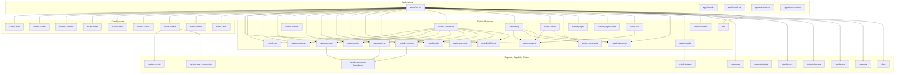

# Module and Application Registry

This document captures the current map of platform modules, support crates,
capability crates and host applications in RusToK.

## How to Read the Registry

1. `Core` and `Optional` modules are taken only from `modules.toml`.
2. `crate` is a Cargo packaging form, not automatically a platform module.
3. Shared/support/capability crates live next to module crates; capability-only
   ghost modules may be registered in `modules.toml` if they need a formal
   runtime/module contract.
4. This registry provides only the central map of ownership and roles; the source of truth for the runtime contract lives in the local `README.md` and `docs/README.md` of the components themselves.

## Documentation Contract

For components listed in this registry, a unified documentation standard applies:

- Root `README.md` in English covers `Purpose`, `Responsibilities`, `Entry points` and `Interactions`;
- Local `docs/README.md` in English captures the live runtime/module/app contract;
- Local `docs/implementation-plan.md` in English captures the live development plan, not a historical changelog.

The central registry must not duplicate these local documents. Its purpose is to provide the platform map and direct the reader to the correct component.

For backend boundary changes, use the backend module guides before changing a row:

- [Backend Module Architecture](../backend/module-backend-architecture.md)
- [Backend Module Implementation Guide](../backend/module-backend-implementation.md)
- [Backend Module Verification Guide](../backend/module-backend-verification.md)

The registry records ownership and readiness. It does not move implementation ownership to
`apps/server`: module services, ports, GraphQL/REST DTOs and command adapters remain in the
owning module structure described by the backend guides.

## Ownership-review Policy

For changes to this registry, a mandatory ownership-review path applies:

1. First, local documents of affected components are updated
   (`README.md`, `docs/README.md`, and `docs/implementation-plan.md` if needed).
2. Then this central registry is updated as a map, not as a duplicate of the local
   specification.
3. Any change to ownership/capability/support status must be
   synchronized with `modules.toml` and verified by the module platform owner.
4. For cross-cutting changes (multiple modules/host applications), an
   additional review from the platform team is required.

Without confirmed ownership-review, a change is considered incomplete.

## FFA/FBA Readiness Board (Module-owned UI)

This section defines the central FFA/FBA status for modules that have module-owned UI
and/or an explicitly expressed backend boundary contract.

Statuses:

- FFA: `not_started | in_progress | phase_b_ready | parity_verified`
- FBA: `not_started | in_progress | boundary_ready | transport_verified`

Temporary 2026-07-13 readiness policy: FBA `boundary_ready` may be recorded
from static owner/provider-consumer evidence without a local Cargo compilation.
This administrative promotion does not constitute `transport_verified`; compiled
or live provider-consumer and fallback evidence remains required for that status.

The current rollout is intentionally led as FFA-first, but ready slices may move to
FBA-hardening only with explicit local evidence. Until the FFA phase-gate is closed and the local plan
has no FBA-readiness evidence, the FBA column remains `not_started`, even if the code already contains
backend/boundary preparation or future-FBA guardrails.

For new modules and large module splits, a row in the readiness board is created before the first
transport/UI PR. Minimum gate: module ownership, canonical service contract, typed
request context/errors, data ownership, explicit ports/events and local FFA/FBA status block.

Synchronization rule:

1. The source of truth for status is the local `docs/implementation-plan.md` of the module.
2. When the local FFA/FBA status block changes, this board is updated in the same PR.
3. If status = `parity_verified` or `transport_verified`, the PR must contain verification evidence.

Structural shape captures the depth of code-level FFA split regardless of governance status:

- `none` — code split has not started yet;
- `docs_boundary` — synchronized boundary/docs track, but UI split has not started yet;
- `core_only` — framework-agnostic `core.rs` or `core/` already owns a view-model/request/policy fragment;
- `core_transport` — added module-owned `transport/` facade/adapters;
- `core_transport_ui` — has `core`, `transport` and an explicit `ui/leptos.rs` or `ui/leptos/` adapter;
- `no_ui_boundary` — the module has no module-owned UI, but has a backend boundary/FBA track.

Product update as of 2026-07-02: typed reads and transactional patch operations of attribute values verify the effective schema and option ownership, store localized text only for the explicit host locale, preserve detached values and publish outbox events. Detached values are displayed in product admin as a separate review block and are cleaned up through owner-owned `clear_detached_product_attribute_values`; the service rejects deletion of values that are still part of the effective schema; build-profile-selected native `#[server]` and GraphQL paths are supported in parallel. Publish validation is owner-owned in `ProductCatalogSchemaService`: `CatalogService::publish_product` blocks the transition to `Active` if required effective attributes are not filled, localized text-like values do not have an explicit non-empty translation row, or option attributes do not have option relations; create-with-publish is rejected for categories with required typed attributes. Effective form batch-loads localized option dictionaries only for applicable attributes and returns a localized `group_label` from schema/category group translations; creation of schema/category groups and `group_code` bindings is available through native/GraphQL admin contracts. The former Product-to-Index projection path, virtual-category materialization, and Search consumption of Index-owned facets/sort keys were removed with Index v1. Product and Search must not depend on an Index projection again until the generic Index Engine reaches its first vertical slice and publishes replacement owner contracts.

Product remediation update as of 2026-07-26: product writes derive tenant and actor only from authenticated contexts; admin and storefront product roots reject an explicit tenant that differs from `TenantContext` before storage access. A Product-owned exhaustive public-error descriptor is shared by GraphQL and native admin/storefront transports, preserving internal detail only in structured logs while returning a stable code and correlation reference. `ProductWriteTransaction` owns the entity-and-outbox transaction invariant for product event writes. PostgreSQL product migrations enforce tenant-scoped handles, SKU, tags, canonical primary categories, EAV storage/type rules, normalized indexed channel visibility, a deferred exact category-tree/closure projection, and a target schema without unused compatibility columns; the owner-local lifecycle fixture verifies non-null Media UUIDs and decimal variant weights. Isolated Product PostgreSQL fixtures pass a complete `up/down/up` lifecycle, prove concurrent handle/SKU uniqueness plus cross-tenant catalog/schema/EAV/translation/tag rejection, corrupt EAV, legacy primary-assignment, duplicate root-slug, parent-cycle, and closure-drift rejection, and verify dirty-data preflight failures together with legacy inventory backfill/column removal. The live in-process `ProductCatalogReadPort` fixture proves product/variant projections and published listing with owner price/inventory enrichment, tenant isolation, locale fallback, channel filtering, count, and pagination. A reproducible 10k/100k/1M Product benchmark captures live page/count plans and proves the partial storefront index is selected for the page path at every scale. Catalog commands, queries, projections, and tags are isolated by responsibility; schema attributes, schemas, categories, typed values, effective forms, and virtual-category validation are likewise split without changing outbox semantics. Inventory bootstrap and availability use the Inventory owner, while initial price lifecycle and projections use `rustok-pricing-persistence`; Product no longer depends on `rustok-commerce-foundation`. Native/admin and storefront GraphQL parity plus the exhaustive 15-mutation tenant-substitution matrix execute against live service paths. The composed `rustok-ai` consumer has runtime-verified Product-port unavailable/deadline degradation. Product remains `boundary_ready` because Commerce checkout is an explicit hard dependency and no external Product adapter has live execution evidence; nonexistent Pricing and GraphQL fallback profiles are not declared.

Product/search metadata boundary update as of 2026-07-02: Next admin package `rustok-product` exposes owner-owned category/attribute option helpers for search host composition. Helpers query product GraphQL with host effective locale, return category ids and filterable/sortable attribute codes, while search UI packages stay on host-provided option payloads without direct product internals import. Server artifact cleanup keeps product translation title search predicates out of `apps/server`; host-local `services::product_search` is forbidden.

Product/search Leptos metadata boundary update as of 2026-07-02: `apps/admin::SearchAdminComposition` and `apps/storefront::SearchStorefrontComposition` connect product-owned catalog options to search-owned props through public DTOs. Both host adapters check tenant enablement `product` and pass effective locale; admin also passes auth/tenant slug. Admin helper uses current-tenant native `#[server]` first and GraphQL selected path, storefront helper uses public-safe native endpoint `product/storefront/catalog-search-options` and parallel `storefrontCatalogSearchOptions(locale: String!)` with tenant/channel guards without admin permission. Search UI does not import product internals; statuses are not raised without live runtime evidence.

Product/search Next storefront metadata boundary update as of 2026-07-02: `apps/next-frontend/src/features/search` connects product-owned catalog options to `SearchStorefrontPage` through public GraphQL `storefrontCatalogSearchOptions(locale: String!)`. Host registry render context passes route locale, tenant slug and enabled modules; composition checks `product` enablement, and the search package receives only category/attribute option props without importing product internals. Statuses are not raised without live runtime evidence.

| Module slug | UI surfaces | FFA status | FBA status | Structural shape | Source plan |
|---|---|---|---|---|---|
| `events` | Leptos admin + Next admin | `in_progress` | `in_progress` | `core_transport_ui` | [Live plan](../../crates/rustok-events-module/docs/implementation-plan.md); `rustok-events-module` is the cycle-free runtime/manifest adapter and owns the UI packages. Its Next package exposes a client-safe registration entrypoint separately from server page exports. The UI exposes only durable `outbox` (default) and `outbox_iggy` profiles. |
| `cache` | Next admin | `in_progress` | `in_progress` | `core_transport_ui` | [Live plan](../../crates/rustok-cache/docs/implementation-plan.md); the module-owned package separates client-safe shell registration from server page exports and renders cache health through the host GraphQL and locale providers. |
| `iggy_connector` | Leptos admin + Next admin | `in_progress` | `in_progress` | `core_transport_ui` | [Live plan](../../crates/rustok-iggy-connector/docs/implementation-plan.md); owner persistence, native server functions, parallel GraphQL, secret references, and readiness validation are implemented. Packaging and live Iggy evidence remain open. |
| `email` | none | `not_started` | `transport_verified` | `no_ui_boundary` | [Live plan](../../crates/rustok-email/docs/implementation-plan.md); `crates/rustok-email/contracts/email-fba-registry.json` and `crates/rustok-email/contracts/evidence/email-runtime-fallback-smoke.json`. |
| `flex` | none | `not_started` | `boundary_ready` | `no_ui_boundary` | [Live plan](../../crates/flex/docs/implementation-plan.md); `node scripts/verify/verify-flex-multilingual-contract.mjs` locks the capability-only multilingual owner boundary. |
| `rustok-mcp` | admin + Next admin | `in_progress` | `boundary_ready` | `core_transport_ui` | [Live plan](../../crates/rustok-mcp/docs/implementation-plan.md) |
| `channel` | admin | `in_progress` | `boundary_ready` | `core_transport_ui` | [Live plan](../../crates/rustok-channel/docs/implementation-plan.md); `crates/rustok-channel/contracts/channel-fba-registry.json`, `crates/rustok-channel/contracts/evidence/channel-runtime-fallback-smoke.json`, `scripts/verify/verify-channel-admin-boundary.mjs`, and `npm run verify:channel:resolution-contract`. The built-in host fast-path keeps `explicit selectors -> built-in host slice -> typed policies -> explicit default -> unresolved`; `rustok-pages`, `rustok-blog`, `rustok-commerce`, and `rustok-forum` are locked by `verify:channel:proof-points`. |
| `page_builder` | no module-owned UI | `not_started` | `boundary_ready` | `no_ui_boundary` | [Live plan](../../crates/rustok-page-builder/docs/implementation-plan.md) |
| `pages` | admin + storefront | `in_progress` | `boundary_ready` | `core_transport_ui` | [Live plan](../../crates/rustok-pages/docs/implementation-plan.md); `scripts/verify/verify-pages-ui-boundary.mjs` locks the builder-first UI boundary. |
| `blog` | admin + storefront | `in_progress` | `boundary_ready` | `core_transport_ui` | [Live plan](../../crates/rustok-blog/docs/implementation-plan.md); `crates/rustok-blog/contracts/blog-fba-registry.json`, `crates/rustok-blog/contracts/evidence/blog-comments-runtime-fallback-smoke.json`, and `crates/rustok-blog/contracts/evidence/blog-comments-consumer-runtime-order-smoke.json` lock the `CommentsThreadPort` consumer boundary and the static `comment.created`/`comment.deleted` reply-count projection. Blog Category canonical copy is Taxonomy-owned through the same-ID Blog-to-Taxonomy binding and the registered `taxonomy/term` Translation target; Blog post copy remains a separate future Blog-owned editorial surface. Next and Leptos article authoring use the shared framed editor and canonical document contract. Both Blog storefronts compose a Comments-owned reusable composer with Blog-bound commands that enforce permission, tenant, module/channel, published status, and channel visibility; Leptos selects native/GraphQL transport and Next uses the parallel GraphQL command. The Leptos selected-article path builds an isolated authenticated comment WASM island and keeps full storefront hydration out of the form. The pre-release initial schema stores canonical article documents directly; corrective richtext migration/backfill paths are deleted and forbidden by the Blog source gate. A fresh PostgreSQL migration run and authenticated Next mounted comment submission verify canonical persistence with moderation-pending state. Mounted Leptos persistence/reload parity, Next rejection/reload, live comments errors, delivery, retry, and recovery remain required for `transport_verified`; canonical Category Translation concurrency/cursor recovery is Taxonomy-owned and tracked with the Taxonomy provider. |
| `outbox` | admin | `in_progress` | `boundary_ready` | `core_transport_ui` | [Live plan](../../crates/rustok-outbox/docs/implementation-plan.md); accepted single-adapter read-only owner fragment; the relay worker consumes `OutboxRelayPort` with deadline and idempotency policy. Evidence: `crates/rustok-outbox/contracts/outbox-fba-registry.json`, `crates/rustok-outbox/contracts/evidence/outbox-provider-runtime-order-smoke.json`, and `npm run verify:outbox:admin-boundary`. |
| `index` | admin | `in_progress` | `in_progress` | `core_transport_ui` | [Live plan](../../crates/rustok-index/docs/implementation-plan.md); M2 accepted JSONB and archived same-commit evidence. M3 registers the generic seven-table migration foundation and adds the Index-owned atomic inbox/entity/link mutation adapter. Query execution, schema/index lifecycle, PostgreSQL concurrency evidence, and provider-consumer execution remain pending, so FBA stays `in_progress`. |
| `rbac` | admin | `in_progress` | `boundary_ready` | `core_transport_ui` | [Live plan](../../crates/rustok-rbac/docs/implementation-plan.md); `crates/rustok-rbac/contracts/rbac-fba-registry.json`, `crates/rustok-rbac/contracts/evidence/rbac-provider-runtime-order-smoke.json`, and `scripts/verify/verify-rbac-admin-boundary.mjs`. `RbacPermissionDecisionProvider` resolves the UUID tenant and authenticated user actor through the owner `PermissionResolver`; live degraded-path evidence remains required for `transport_verified`. |
| `tenant` | admin | `in_progress` | `transport_verified` | `core_transport_ui` | [Live plan](../../crates/rustok-tenant/docs/implementation-plan.md); `TenantReadPort` and the revisioned CAS/idempotent `TenantLocalePolicyPort` remain owner boundaries; server locale middleware consumes the policy port. `crates/rustok-tenant/contracts/tenant-fba-registry.json` and `crates/rustok-tenant/contracts/evidence/tenant-runtime-fallback-smoke.json` are checked by `npm run verify:tenant:fba`. |
| `profiles` | storefront | `in_progress` | `not_started` | `core_transport_ui` | [Live plan](../../crates/rustok-profiles/docs/implementation-plan.md); module-owned Leptos storefront owns profile reads and follow controls through selected native/GraphQL transports; Media and Social Graph remain host-composed owner boundaries, and live runtime parity evidence remains open. |
| `taxonomy` | none | `not_started` | `boundary_ready` | `no_ui_boundary` | [Live plan](../../crates/rustok-taxonomy/docs/implementation-plan.md); registered `taxonomy/term` Translation target supplies exact source/target snapshots, resource/source/target CAS apply, owner-scoped durable receipt replay, exact progress, and append-only change-cursor repair. PostgreSQL concurrent apply/cursor-recovery evidence remains required before production pilot enablement. |
| `storage` | none | `not_started` | `not_started` | `no_ui_boundary` | [Live plan](../../crates/rustok-storage/docs/implementation-plan.md); direct runtime/key-policy cutover complete, with Local/S3 conformance and owner recovery guidance |
| `core` | none | `not_started` | `not_started` | `no_ui_boundary` | [Live plan](../../crates/rustok-core/docs/implementation-plan.md) |
| `api` | none | `not_started` | `not_started` | `no_ui_boundary` | [Live plan](../../crates/rustok-api/docs/implementation-plan.md) |
| `runtime` | none | `not_started` | `not_started` | `no_ui_boundary` | [Live plan](../../crates/rustok-runtime/docs/implementation-plan.md) |
| `modules` | none | `not_started` | `boundary_ready` | `no_ui_boundary` | [Live plan](../../crates/rustok-modules/docs/implementation-plan.md); lifecycle/recovery and digest-pinned installation/runtime foundations are owner-owned. Native and GraphQL marketplace reads share a host-composed owner catalog, registry lifecycle derivation is owner-owned, and the admin host no longer contains direct registry SQL or workspace/Cargo catalog scanning and build planning. Static-composition GraphQL commands derive tenant, actor, and `modules.manage` permission from authenticated server context, require a positive revision and non-nil idempotency UUID, and use owner receipts to replay the original build; the host only reads and forwards the revision. Artifact tenant-lifecycle GraphQL returns the owner-issued next CAS precondition for one admitted Optional installation and accepts only authenticated tenant/actor authority, positive revision, reason, and idempotency UUID. The host-owned Leptos and Next platform operator pages consume the same `modules.manage`-guarded per-registry freshness projection; this does not change the module's `no_ui` manifest classification. Command and HTTP artifact dispatch use owner-typed request envelopes that bind release, admitted bindings, installation target, tenant, payload, and execution context. The artifact-aware definition catalog/dispatcher, CAS, composition/governance, and broader transport cutover remain in progress; the operator-only external-prebuilt staging endpoint preserves authenticated actor/quarantine authority rather than accepting caller-supplied principals. |
| `web` | none | `not_started` | `not_started` | `no_ui_boundary` | [Live plan](../../crates/rustok-web/docs/implementation-plan.md) |
| `alloy` | none | `not_started` | `boundary_ready` | `no_ui_boundary` | [Live plan](../../crates/alloy/docs/implementation-plan.md); `crates/alloy/contracts/alloy-runtime-contract.json`, `crates/alloy/contracts/evidence/alloy-runtime-static-matrix.json`, and `npm run verify:alloy:runtime-contract`. |
| `comments` | admin + storefront capability | `in_progress` | `boundary_ready` | `core_transport_ui` | [Live plan](../../crates/rustok-comments/docs/implementation-plan.md); `crates/rustok-comments/contracts/comments-fba-registry.json`, `crates/rustok-comments/contracts/evidence/comments-provider-runtime-order-smoke.json`, and `scripts/verify/verify-comments-admin-boundary.mjs`. Comments storage/service/port use the canonical `RichTextDocument`/`RichTextView` contract with no body format selector, and Blog is a typed consumer. Comments moderation renders server-derived richtext through the shared `RichTextHtml` boundary without loading the editor; `scripts/verify/verify-comments-admin-boundary.mjs` locks the admin boundary guardrail. `rustok-comments-storefront-support` and `@rustok/comments-frontend` own the reusable Leptos and React composer state/UI; Blog supplies exact post-bound native and GraphQL commands that reject cross-tenant, hidden, draft, or channel-disabled targets before Comments writes. Mounted browser evidence remains open; no browser receives arbitrary Comments target identity. Public-port create/delete atomically publish `comment.created`/`comment.deleted`; live delivery/retry/recovery evidence remains required for `transport_verified`. |
| `forum` | admin + storefront | `in_progress` | `boundary_ready` | `core_transport_ui` | [Live plan](../../crates/rustok-forum/docs/implementation-plan.md); topic/reply storage and transports use the canonical `RichTextDocument`/`RichTextView` contract. The shared frame is wired for Leptos and Next topic create/edit and reply composition. Both adapters pass owner content locale separately from host UI messages and update direction, spellcheck and busy/read-only state without remounting. Leptos reply writes select native SSR/hydrate or GraphQL CSR/headless transport without fallback; full mounted save/reload evidence remains open. Native checks, 113 Forum unit tests, 63 Forum admin unit tests, canonical SQLite/PostgreSQL soft-delete/revision execution, package tests, the whole-host Next typecheck and the ownership verifier pass. The existing Forum storefront WASM dependency/future failures and `modules.toml`/manifest `page_builder` validation mismatch remain open. Broader Forum product parity and live cross-module runtime evidence remain open. |
| `search` | admin + storefront | `phase_b_ready` | `boundary_ready` | `core_transport_ui` | [Live plan](../../crates/rustok-search/docs/implementation-plan.md); whole-module remote extraction pilot with `SearchQueryPort`/`SearchSuggestionPort` at the service boundary; `SearchEngine` connectors remain internal to `rustok-search`. |
| `cart` | storefront | `phase_b_ready` | `boundary_ready` | `core_transport_ui` | [Live plan](../../crates/rustok-cart/docs/implementation-plan.md); `CartCheckoutPort` owns checkout snapshot and lifecycle writes, `CartStorefrontPort` owns REST and GraphQL storefront cart reads/mutations/repricing, and `CartPromotionPort` owns admin promotion preview/application. Recovery, fallback, and transport proof remain open. |
| `commerce` | admin + storefront | `in_progress` | `boundary_ready` | `core_transport_ui` | [Live plan](../../crates/rustok-commerce/docs/implementation-plan.md); `scripts/verify/verify-commerce-admin-boundary.mjs`; checkout invokes inventory through `InventoryReservationPort` and catalog/variant-first reads through `ProductCatalogReadPort`, with typed request context and without direct product entity access. A compiled channel-inventory regression exercises the cart/product/inventory preflight path; remaining providers, fallback modes, and full checkout lifecycle still require runtime proof before `transport_verified`. Commerce admin native order-change/cart-promotion adapter uses `HostRuntimeContext` DB plus typed `TransactionalEventBus`, without host-framework dependencies and without root GraphQL/state-machine aliases. |
| `workflow` | admin | `phase_b_ready` | `boundary_ready` | `core_transport_ui` | [Live plan](../../crates/rustok-workflow/docs/implementation-plan.md); owner-owned overview/templates mount at `/modules/workflow` and legacy `/workflows` redirects there; `crates/rustok-workflow/contracts/workflow-fba-registry.json`, `crates/rustok-workflow/contracts/evidence/workflow-read-projection-runtime-smoke.json`, and `scripts/verify/verify-workflow-admin-boundary.mjs`. |
| `region` | admin + storefront | `in_progress` | `boundary_ready` | `core_transport_ui` | [Live plan](../../crates/rustok-region/docs/implementation-plan.md); `crates/rustok-region/contracts/region-fba-registry.json`, `crates/rustok-region/contracts/evidence/region-provider-runtime-order-smoke.json`, `scripts/verify/verify-region-admin-boundary.mjs`, and `scripts/verify/verify-region-storefront-boundary.mjs`. |
| `product` | admin + storefront | `in_progress` | `boundary_ready` | `core_transport_ui` | [Live plan](../../crates/rustok-product/docs/implementation-plan.md); `ProductCatalogReadPort` resolves product-id and variant-first projections without exposing Product entities. `StorefrontProductListQuery` carries filters, sorting, and pagination as one owner query contract for native and GraphQL transports. PostgreSQL execution covers the embedded provider, Commerce checkout covers the hard-dependency consumer, and composed `rustok-ai` tests cover unavailable/deadline degraded behaviour. `crates/rustok-product/contracts/evidence/product-runtime-fallback-smoke.json` records the exact embedded profile; external-adapter execution remains the transport promotion gate. |
| `customer` | admin | `in_progress` | `boundary_ready` | `core_transport_ui` | [Live plan](../../crates/rustok-customer/docs/implementation-plan.md); accepted single-adapter owner fragment, `crates/rustok-customer/contracts/customer-fba-registry.json` and `scripts/verify/verify-customer-admin-boundary.mjs`. |
| `pricing` | admin + storefront | `in_progress` | `boundary_ready` | `core_transport_ui` | [Live plan](../../crates/rustok-pricing/docs/implementation-plan.md); `PricingReadPort` owns durable checkout, REST/GraphQL storefront add-to-cart and line-item quantity repricing, GraphQL effective-price projection, storefront active-price-list plus admin/storefront product-pricing projections, and storefront repricing variant resolution. `PricingWritePort` owns GraphQL admin variant-price upsert, percentage-discount application, price-list rule, and scope writes. Consumer fallback/degraded execution remains open. |
| `inventory` | admin | `in_progress` | `boundary_ready` | `core_transport_ui` | [Live plan](../../crates/rustok-inventory/docs/implementation-plan.md); `crates/rustok-inventory/contracts/inventory-fba-registry.json` and `scripts/verify/verify-inventory-admin-boundary.mjs`. |
| `order` | admin + storefront | `in_progress` | `boundary_ready` | `core_transport_ui` | [Live plan](../../crates/rustok-order/docs/implementation-plan.md); `crates/rustok-order/contracts/order-fba-registry.json`, `crates/rustok-order/contracts/evidence/order-contract-test-static-matrix.json`, `scripts/verify/verify-order-admin-boundary.mjs`, and `scripts/verify/verify-order-storefront-boundary.mjs`. |
| `payment` | storefront | `in_progress` | `boundary_ready` | `core_transport_ui` | [Live plan](../../crates/rustok-payment/docs/implementation-plan.md); `crates/rustok-payment/contracts/payment-fba-registry.json` and `scripts/verify/verify-payment-storefront-boundary.mjs`. |
| `fulfillment` | admin + storefront | `in_progress` | `boundary_ready` | `core_transport_ui` | [Live plan](../../crates/rustok-fulfillment/docs/implementation-plan.md); `crates/rustok-fulfillment/contracts/fulfillment-fba-registry.json`, `scripts/verify/verify-fulfillment-admin-boundary.mjs`, and `scripts/verify/verify-fulfillment-storefront-boundary.mjs`. |
| `seo` | admin + storefront contracts | `in_progress` | `in_progress` | `core_transport_ui` | [Live plan](../../crates/rustok-seo/docs/implementation-plan.md); `crates/rustok-seo/contracts/seo-fba-registry.json` records the host-composed `MediaAssetReadPort` consumer contract. Product forwards its canonical media UUID and SEO resolves it through the public port; other owner providers remain URL-only, and live provider/degraded transport execution remains required before `boundary_ready`. |
| `media` | admin | `in_progress` | `boundary_ready` | `core_transport_ui` | [Live plan](../../crates/rustok-media/docs/implementation-plan.md); whole-module isolated-service pilot using `MediaAssetReadPort` and `MediaAssetWritePort`. `MediaTranslationTargetProvider` is registered as `media/asset` for bounded exact-locale discovery/read/validate/apply, exact aggregate coverage, and tenant-scoped change-cursor repair. Every Media translation write commits its locale row, append-only cursor evidence, and `translation.target.changed` outbox event atomically; provider apply also commits its stable receipt in that transaction. Translated-asset deletion/failure emits deleted/unavailable cursor evidence, and aggregate progress uses a stable cursor window without fallback. Native admin transport receives owner dependencies through `HostRuntimeContext`. Binary uploads use Media-owned streaming REST on Local storage or short-lived presigned PUT sessions on S3-compatible storage; gRPC remains metadata/control only and requires server-side `TrustedMediaAuthority`. Lifecycle, reconciliation, receipt, and loopback suites cover the current contract. Isolated process/database/storage and multi-replica cursor-recovery evidence remain required before `transport_verified`. Evidence: `crates/rustok-media/contracts/media-fba-registry.json`, `crates/rustok-media/contracts/evidence/media-provider-runtime-order-smoke.json`, `crates/rustok-media-transport/tests/port_conformance.rs`, `crates/rustok-media/src/translation_target.rs`, `crates/rustok-media/src/translation_evidence.rs`, and `scripts/verify/verify-media-admin-boundary.mjs`. |
| `translation` | Leptos admin + Next admin | `in_progress` | `in_progress` | `core_transport_ui` | [Live plan](../../crates/rustok-translation/docs/implementation-plan.md); module core, neutral provider dependency, RBAC surface, CAS-guarded inventory/change checkpoints, atomic bounded full-rescan, tenant-scoped workflow tables, owner-validated workflow, required-target policy, deterministic QA, durable apply/recovery, versioned tenant glossaries with immutable job bindings, approved-only Translation Memory with deterministic exact/contextual lookup and revisioned retention/tombstone/purge, bounded owner-aware direct interchange, private object-storage artifact lifecycle, fixed-cardinality content-free observability, and manifest-composed GraphQL exist. Interchange export includes only public or tenant-private non-excluded immutable owner snapshots with exact revision/hash evidence; atomic per-item import creates proposals only through owner validation and deterministic QA. Artifact documents live only at private tenant-scoped object keys, while Translation retains checksum, size, expiry/deletion, idempotency, and aggregate conflict-report metadata; reads verify integrity and absent storage fails closed. Owner `Deleted` inventory observations atomically mark matching memory with content-free lifecycle evidence; a module-owned generic-work adapter tombstones expired or owner-deleted entries and purges after a 24-hour grace while excluding legal hold and machine-operation pins. `rustok-translation-admin` and `@rustok/translation-admin` own matching six-tab workbenches over a 49-operation native/GraphQL contract with bounded direct interchange and artifact create/list/read/store/process, machine estimate/generation/status/cancellation/recovery, revision-guarded assignment/unassignment, derived bounded reviewer queue/workload reads, private workflow-note list/create/resolve, blocked-item retry, job cancellation, and owner-apply recovery controls, host locale/tenant, and URL-owned `tab`/`glossary_id`/`memory_entry_id`. Authenticated GraphQL runtime evidence covers successful import through canonical QA, private artifact lifecycle and aggregate outcome reporting, invalid bounds, stale source rejection, cross-tenant isolation, and tenant-context mismatch. Registered native HTTP evidence covers policy, glossaries, bounded direct interchange and private artifact lifecycle, assignment, manual workflow/apply, QA rejection, cancellation, retry, unknown-outcome apply recovery, job progress, reviewer queue/workload, Translation Memory, inventory rebuild, provider/required-target progress, and machine generation/status/cancellation/recovery through a deterministic neutral provider, including degraded health, idempotency, and missing-runtime failure. Provider/workflow/memory/QA/interchange metrics use only fixed bounded labels; tenant content progress remains an authorized read model and durable broker-consumer lag remains a runtime/outbox concern. Production application-router evidence wraps the registered read-policy function with tenant cache/resolution, locale negotiation, JWT/session/RBAC, channel, rate-limit, and security middleware and verifies cross-tenant token rejection. Authenticated Next browser evidence covers URL-owned tab state, semantic tabs, interchange controls, and the host module-disabled fallback. Compiled Leptos CSR browser evidence covers all six URL-owned tabs, roving arrow/Home/End focus, exact tab/panel and localized form-label relationships, and zero axe violations on every tab. Translation owns a non-billable machine estimate plus actor/idempotency-bound machine proposal, cancellation, stable-key status, and audited stuck-save recovery commands. The estimate uses AI-owned tenant routing and immutable price snapshots without an operation, proposal, memory pin, budget reservation, or provider call. Registered operations pin normalized memory entry identities, order, and scores until completion or cancellation; replay still reads tombstoned entries, while purge is blocked by the pin. AI status, result recovery, and cancellation resolve by stable owner/idempotency identity, including durable pre-registration cancellation, and Translation receipts preserve propagation/recovery evidence. Recovery revalidates the exact original request and resumes canonical proposal save without another billable execution. File-backed separate-process Translation evidence covers both durable `saving` crash boundaries, preserving one proposal and one recovery receipt, releasing memory pins, and replaying a completed operation without another provider call. File-backed retention evidence covers concurrent independent database pools converging on one transition/receipt and separate-process post-claim recovery through tombstone and purge restarts. File-backed inventory evidence covers independent-pool checkpoint contention and separate-process recovery from provider outage through cursor replay and atomic full-rescan. The generation command projects the immutable glossary revision and bounded memory suggestions, invokes the neutral port selected by the production-selected distribution bridge, and saves AI output only through owner validation and deterministic QA. Composed missing-keyring behavior is verified as optional and fail-closed. Deterministic composed AI evidence covers ordered fallback, fail-closed output-schema validation, sanitized failure, exact settlement, request conflict, in-flight cancellation with reservation release, quota rejection before provider execution, encrypted restart replay without another call or bill, and typed degraded health for configuration-level provider unavailability. Real separate-process file-backed AI evidence covers expired-attempt recovery, reservation preservation, immutable failure recording, and reclaim with a new lease. Live external-provider runtime outage/degradation/restart, isolated Media deployment, and production-database multi-replica concurrency evidence remain open. |
| `ai-translation` | none | `not_started` | `in_progress` | `no_ui_boundary` | [Live plan](../../crates/rustok-ai-translation/docs/implementation-plan.md); bridge contracts, typed schemas, exact registered-task descriptor, proposal-only validation, dependency guard, durable accounting/recovery, production-selected distribution-owned lazy factory composition, and fail-closed missing-keyring evidence exist. Every translation packet is at least tenant-private; AI provider allowlists enforce its classification before registration and provider egress, with a second attempt-time check. Deterministic composed runtime evidence covers fallback, output-schema validation, exact settlement, request conflict, in-flight cancellation, quota and egress rejection before provider execution, encrypted restart replay without duplicate calls or billing, and typed degraded health for configuration-level provider unavailability. An ignored operator-only durable structured-runtime probe is ready; retained live external-provider runtime failure/restart evidence remains open. |
| `ai-media` | none | `not_started` | `boundary_ready` | `no_ui_boundary` | [Live plan](../../crates/rustok-ai-media/docs/implementation-plan.md) |
| `tax` | none | `not_started` | `boundary_ready` | `no_ui_boundary` | [Live plan](../../crates/rustok-tax/docs/implementation-plan.md); `crates/rustok-tax/contracts/tax-fba-registry.json` and `crates/rustok-tax/contracts/evidence/tax-runtime-contract-smoke.json`. |
| `ai` | admin + Next admin | `in_progress` | `boundary_ready` | `core_transport_ui` | [Live plan](../../crates/rustok-ai/docs/implementation-plan.md); structured tenant budget/provider policy reads and writes now have permission-checked native `#[server]` and parallel GraphQL contracts, including a non-empty provider egress-classification allowlist, while deployment-owned result keys remain outside tenant transport. The allowlist is enforced for health, routing, estimates, reservations, and immediately before provider egress; denied work fails before execution registration or a provider call. The production-selected distribution bridge publishes the Translation-owned lazy runtime factory without server capability imports, and missing-keyring composition is optional and fail-closed. Deterministic composed evidence covers ordered fallback, fail-closed output-schema validation, sanitized failure, exact settlement, request conflict, in-flight cancellation with reservation release, quota and egress rejection before provider execution, encrypted restart replay without another provider call or bill, and typed degraded health for configuration-level provider unavailability. Real separate-process file-backed evidence covers expired-attempt recovery, reservation preservation, immutable failure recording, and reclaim with a new lease. An ignored operator-only durable structured-runtime probe is ready; retained live external-provider runtime outage/degradation/restart and production-database multi-replica concurrency evidence remain open. |
| `ai-content` | AI owner admin + Next admin | `not_started` | `boundary_ready` | `no_ui_boundary` | [Live plan](../../crates/rustok-ai-content/docs/implementation-plan.md); adapter controls are composed by `rustok-ai`, not mounted as Blog-, Forum-, or content-owned routes. |
| `ai-order` | AI owner admin + Next admin | `not_started` | `boundary_ready` | `no_ui_boundary` | [Live plan](../../crates/rustok-ai-order/docs/implementation-plan.md); adapter controls are composed by `rustok-ai`, not mounted as an order-owned route. |
| `ai-product` | AI owner admin + Next admin | `not_started` | `boundary_ready` | `no_ui_boundary` | [Live plan](../../crates/rustok-ai-product/docs/implementation-plan.md); adapter controls are composed by `rustok-ai`, not mounted as a product-owned route. |
| `auth` | admin | `phase_b_ready` | `boundary_ready` | `core_transport_ui` | [Live plan](../../crates/rustok-auth/docs/implementation-plan.md); `scripts/verify/verify-auth-admin-boundary.mjs` locks the module-owned admin boundary. |

AI FBA baseline batch evidence: `crates/rustok-ai/contracts/ai-fba-registry.json`, `crates/rustok-ai/contracts/evidence/ai-runtime-fallback-smoke.json`, `crates/rustok-ai-content/contracts/ai-content-fba-registry.json`, `crates/rustok-ai-content/contracts/evidence/ai-content-runtime-fallback-smoke.json`, `crates/rustok-ai-order/contracts/ai-order-fba-registry.json`, `crates/rustok-ai-order/contracts/evidence/ai-order-runtime-fallback-smoke.json`, `crates/rustok-auth/contracts/auth-fba-registry.json`, and `crates/rustok-auth/contracts/evidence/auth-runtime-fallback-smoke.json` are verified together by `scripts/verify/verify-ai-fba-baseline.mjs` / `npm run verify:ai:fba-baseline`; router policy remains locked by `scripts/verify/verify-ai-router-policy.mjs`.

Compiled FBA evidence as of 2026-06-30: `cargo check --workspace` passed for the entire workspace; `cargo test -p rustok-channel -p rustok-index -p rustok-tenant --no-run --locked` and `cargo test -p rustok-commerce -p rustok-email --no-run --locked` built target test binaries. Additional targeted runtime evidence in the current increment: `cargo test -p rustok-email --lib` passed 8/8, and `cargo test -p rustok-tenant tenant_read_port --test integration` passed 3/3, so `email` and `tenant` are raised to `transport_verified`. Full `cargo test --workspace --no-run` is not yet evidence due to external TLS error loading `rmcp-macros 2.0.0`; local offline cache of this version is not available. Other statuses are not raised to `transport_verified` without live runtime execution.

Payment storefront read handoff as of 2026-06-30: `rustok-payment-storefront` batch-owns collection/refund reads — `PaymentCollectionFetchRequest`, `RefundSummaryFetchRequest`, shared `execute_selected_transport` facades, native endpoints `payment/payment-collection` / `payment/refund-summary` and GraphQL `storefrontPaymentCollection` / `storefrontRefunds`. Access checks confirm tenant/cart or tenant/order customer ownership before owner-service read; `rustok-commerce-storefront` no longer contains raw payment/refund GraphQL, local DTO/mappers, decimal aggregation or direct dependency on `rustok-payment`/`rust_decimal`. Statuses `payment=boundary_ready` and `commerce=in_progress` are not raised without live remote execution.

Batch verification evidence for payment/inventory handoff: `npm run verify:ffa:ui:migration` and `npm run verify:ecommerce:fba` pass fully; payment storefront unit tests pass in SSR/all-features profile, commerce storefront unit tests and GraphQL surface regression also pass. Commerce REST/GraphQL cart availability paths use inventory-owned `check_variant_availability_for_public_channel`; generic port read from transport helpers is removed.

Foundation FBA runtime-smoke batch evidence remains current for `channel`, `tenant`, and `email`. The former Index v1 registry, fallback evidence, and verifier contribution were removed completely. Index is reset to `in_progress` until replacement query/rebuild contracts and new provider-consumer evidence exist.

Commerce-domain FBA batch evidence: `product`, `pricing`, `inventory`, `customer`, `cart` and `tax` publish module-owned `contracts/evidence/*-runtime-contract-smoke.json`, and `scripts/verify/verify-commerce-domain-fba-runtime-smoke.mjs` plus fixture-regression suite batch-verify shared read/write policy order, mandatory write-idempotency, owner-service invocation before typed error mapping, parity fallback/degraded metadata and batch invocation trace `crates/rustok-commerce/contracts/evidence/commerce-domain-provider-invocation-trace.json` against consumer rows. Gate is included in `npm run verify:ecommerce:fba` and `npm run verify:tax:fba` without Cargo compilation; all listed modules are temporarily recorded as `boundary_ready` under the 2026-07-13 policy, while live provider execution remains required for `transport_verified`.

Owner FBA batch evidence: `comments`, `rbac`, `workflow`, `region`, `media` and `outbox` publish `contracts/evidence/*-provider-runtime-order-smoke.json`; shared `scripts/verify/verify-owner-fba-runtime-order.mjs` with fixture regressions verifies shared policy order, write-idempotency, owner invocation/evaluation and fallback metadata parity. For `comments` the fast gate is aligned to canonical `PortCallPolicy::write()` semantics without duplicate checking and additionally locks atomic lifecycle-event publication through the owner outbox; `outbox` registry/manifest is synchronized with actual `rustok_api::ports` primitives. The modules are `boundary_ready`; live provider/consumer execution remains required for `transport_verified`.

Orchestrator FBA batch evidence: `ai` and `page_builder` publish `contracts/evidence/*-orchestrator-runtime-order-smoke.json`; shared `scripts/verify/verify-orchestrator-fba-runtime-order.mjs` with fixture regressions verifies AI support-adapter registry parity/runtime registration, router fallback diagnostics markers, native/GraphQL admin transport boundary, as well as page-builder capability flag -> port policy -> owner call and authorization -> service call order. Both statuses remain `in_progress` until live runtime/tenant execution evidence.

Consumer FBA batch evidence: `blog` publishes `crates/rustok-blog/contracts/evidence/blog-comments-consumer-runtime-order-smoke.json`; shared `scripts/verify/verify-consumer-fba-runtime-order.mjs` verifies Blog target validation/provider-call/typed mapping order. SEO retains a template-only Media consumer artifact because its target owners do not yet publish media asset UUIDs; it must not claim media-port invocation evidence before that owner contract and consumer composition exist. Both statuses remain `in_progress` until their respective consumer runtime execution.

Public read authority evidence: `blog`, `pages` and `forum` public GraphQL/storefront reads resolve missing-auth requests to `SecurityContext::public_read()` instead of `SecurityContext::system()`. The module read paths must keep published/channel-visible filters, and `scripts/verify/verify-api-surface-contract.mjs` forbids `SecurityContext::system()` plus `*_or_system` helper names in module query/storefront/controller/port/service surfaces outside tests.

Current checkout composition evidence for `fulfillment`, `payment` and `order` rows:
`apps/storefront` mounts manifest-entry adapters `FulfillmentView`, `PaymentView` and
`OrderView` in platform-known slots `checkout_shipping_handoff`, `checkout_payment_handoff`
and `checkout_result_handoff`. Each adapter reads effective locale from
`UiRouteContext.locale` and resolves copy through module-owned `en`/`ru` catalog,
declared in `[provides.storefront_ui.i18n]`. FFA status remains `in_progress`
because this composition slice is not full parity verification.

## Hotspot Contract (DOC-12 / H1)

- Hotspot: `H1` (Runtime composition and module manifest).
- Doc contracts updated: `docs/modules/registry.md`.
- Owner scope: platform foundation + module platform owner.
- Residual drift risk:
  - when changing `modules.toml` without synchronously updating this registry and
    `docs/index.md`, there is a risk of ghost/stale module map;
  - cross-cutting ownership changes require separate owner confirmation in PR.

## Architecture Map

```mermaid
graph TD
    subgraph Applications["Applications"]
        SERVER["apps/server"]
        ADMIN["apps/admin"]
        STOREFRONT["apps/storefront"]
        NEXT_ADMIN["apps/next-admin"]
        NEXT_FRONT["apps/next-frontend"]
    end

    subgraph CoreModules["Core Modules"]
        AUTH["rustok-auth"]
        CACHE["rustok-cache"]
        CHANNEL["rustok-channel"]
        EMAIL["rustok-email"]
        INDEX["rustok-index"]
        SEARCH["rustok-search"]
        OUTBOX["rustok-outbox"]
        TENANT["rustok-tenant"]
        RBAC["rustok-rbac"]
    end

    subgraph OptionalModules["Optional Modules"]
        CONTENT["rustok-content"]
        CART["rustok-cart"]
        CUSTOMER["rustok-customer"]
        PRODUCT["rustok-product"]
        PROFILES["rustok-profiles"]
        REGION["rustok-region"]
        PRICING["rustok-pricing"]
        INVENTORY["rustok-inventory"]
        ORDER["rustok-order"]
        PAYMENT["rustok-payment"]
        FULFILLMENT["rustok-fulfillment"]
        COMMERCE["rustok-commerce"]
        BLOG["rustok-blog"]
        FORUM["rustok-forum"]
        COMMENTS["rustok-comments"]
        PAGES["rustok-pages"]
        PAGE_BUILDER["rustok-page-builder"]
        SEO["rustok-seo"]
        TAXONOMY["rustok-taxonomy"]
        MEDIA["rustok-media"]
        WORKFLOW["rustok-workflow"]
        FLEX["flex"]
    end

    subgraph SupportCrates["Support / Capability Crates"]
        CORE["rustok-core"]
        API["rustok-api"]
        EVENTS["rustok-events"]
        COMMERCE_FOUNDATION["rustok-commerce-foundation"]
        STORAGE["rustok-storage"]
        TEST_UTILS["rustok-test-utils"]
        IGGY["rustok-iggy + connector"]
        TELEMETRY["rustok-telemetry"]
        MCP["rustok-mcp"]
        AI["rustok-ai"]
        ALLOY["alloy"]
    end

    SERVER --> AUTH
    SERVER --> CACHE
    SERVER --> CHANNEL
    SERVER --> EMAIL
    SERVER --> INDEX
    SERVER --> SEARCH
    SERVER --> OUTBOX
    SERVER --> TENANT
    SERVER --> RBAC
    SERVER --> CONTENT
    SERVER --> CART
    SERVER --> CUSTOMER
    SERVER --> PRODUCT
    SERVER --> PROFILES
    SERVER --> REGION
    SERVER --> PRICING
    SERVER --> INVENTORY
    SERVER --> ORDER
    SERVER --> PAYMENT
    SERVER --> FULFILLMENT
    SERVER --> COMMERCE
    SERVER --> BLOG
    SERVER --> FORUM
    SERVER --> COMMENTS
    SERVER --> PAGES
    SERVER --> PAGE_BUILDER
    SERVER --> SEO
    SERVER --> TAXONOMY
    SERVER --> MEDIA
    SERVER --> WORKFLOW

    COMMERCE --> CART
    COMMERCE --> CUSTOMER
    COMMERCE --> PRODUCT
    COMMERCE --> REGION
    COMMERCE --> PRICING
    COMMERCE --> INVENTORY
    COMMERCE --> ORDER
    COMMERCE --> PAYMENT
    COMMERCE --> FULFILLMENT
    BLOG --> CONTENT
    BLOG --> COMMENTS
    BLOG --> TAXONOMY
    FORUM --> CONTENT
    FORUM --> TAXONOMY
    SEO --> CONTENT
    PRODUCT --> COMMERCE_FOUNDATION
    PRICING --> COMMERCE_FOUNDATION
    INVENTORY --> COMMERCE_FOUNDATION
    MEDIA --> STORAGE
    OUTBOX --> EVENTS
    OUTBOX --> IGGY
    SERVER --> API
    SERVER --> CORE
    SERVER --> TELEMETRY
    SERVER --> MCP
    SERVER --> AI
    SERVER --> ALLOY
    SERVER --> FLEX
```

## Platform Modules

Synchronization with `modules.toml`: updated per manifest composition as of 2026-07-20.

### Core Modules

| Slug | Crate | Dependencies | Role |
|---|---|---|---|
| `modules` | `rustok-modules` | — | Mandatory artifact, marketplace, installation, lifecycle, build/publication orchestration and tenant-policy control plane; delegates isolated execution to `rustok-sandbox` and isolated Rust compilation to the build-worker boundary |
| `auth` | `rustok-auth` | — | Auth lifecycle, credentials, tokens |
| `cache` | `rustok-cache` | — | Cache backend factory, Redis/in-memory fallback |
| `channel` | `rustok-channel` | — | Platform channel context, bindings, resolution |
| `email` | `rustok-email` | — | Email transport, templates, delivery lifecycle |
| `index` | `rustok-index` | — | Indexed read-model substrate and cross-module filtering |
| `search` | `rustok-search` | — | Product-facing search, ranking, dictionaries, query rules |
| `outbox` | `rustok-outbox` | — | Transactional events, relay, retry, DLQ |
| `events` | `rustok-events-module` | `outbox` | Event contracts, runtime registration, module-owned administration UI, and owner event lifecycle orchestration |
| `tenant` | `rustok-tenant` | — | Tenant lifecycle and tenant module enablement |
| `rbac` | `rustok-rbac` | `outbox` | Permission runtime, authorization, policy layer |

### Optional Modules

| Slug | Crate | Dependencies | Role |
|---|---|---|---|
| `content` | `rustok-content` | — | Shared content helpers, orchestration, rich-text/locale contract, owner-owned dashboard post analytics; compile-free guardrail `npm run verify:content:orchestration` pins RBAC/idempotency/audit/outbox/canonical URL collision invariants, targeted rollback/no-outbox evidence markers and docs/registry sync. |
| `cart` | `rustok-cart` | — | Cart lifecycle, line items, snapshot storefront context, canonical `seller_id` delivery-group ownership, typed cart adjustments, cart-owned storefront inspection UI |
| `customer` | `rustok-customer` | — | Storefront customer profile boundary and customer-owned admin operations UI |
| `product` | `rustok-product` | `taxonomy` | Product catalog, variants, native catalog categories, category-bound attribute schemas, typed product/variant attribute values, tags, shipping profile bindings, nullable `seller_id` ownership contract, product-owned admin catalog UI and storefront catalog UI |
| `profiles` | `rustok-profiles` | `media`, `social_graph`, `taxonomy` | Public profile layer over `users`, author/member summary |
| `social_graph` | `rustok-social-graph` | `index`, `outbox` | Social-relationship graph and owner-owned follow/block lifecycle |
| `reactions` | `rustok-reactions` | `outbox` | Shared bounded reactions with source-owned subject authorization, immutable catalog snapshots, tenant-scoped actor state, aggregate projections, and owner-only reconciliation |
| `groups` | `rustok-groups` | — | Groups, memberships, invitations, applications, and membership policy enforcement |
| `region` | `rustok-region` | — | Region, country, currency, tax baseline, region-owned admin CRUD UI and storefront discovery UI |
| `pricing` | `rustok-pricing` | `product` | Pricing domain baseline, pricing-owned admin visibility UI and storefront pricing atlas UI |
| `inventory` | `rustok-inventory` | `product` | Inventory, stock availability baseline, backend inventory-owned admin read model and inventory-owned admin visibility UI |
| `order` | `rustok-order` | — | Order lifecycle, order snapshots with canonical `seller_id`, typed order adjustments, order returns lifecycle foundation with item-level return lines and refund/exchange/claim resolution links, order-change preview/apply/cancel skeleton, owner-owned dashboard order analytics and order-owned admin operations UI |
| `payment` | `rustok-payment` | — | Payment collections, payments and payment-owned storefront card presentation |
| `fulfillment` | `rustok-fulfillment` | — | Shipping options, fulfillments, fulfillment-owned shipping-option admin UI and storefront shipping handoff + seller-aware shipping selection presentation |
| `commerce` | `rustok-commerce` | `cart`, `customer`, `product`, `region`, `pricing`, `inventory`, `order`, `payment`, `fulfillment`, `tenant` | Umbrella/root ecommerce orchestration, typed shipping-profile registry, aggregate cart-promotion operator surface, build-profile-selected native module-owned post-order order-change operator UI with GraphQL selected path and resolution summary cards, admin + storefront returns/refunds/order-changes transport parity with item-level lines and customer ownership guard, storefront customer-facing `GET /store/orders/{id}/changes` + GraphQL `storefrontOrderChanges`, admin REST/GraphQL return decision-tree transport (`return_only/refund/exchange/claim`) with completed return resolution links and `return_decision_action/source` helper metadata, exchange/claim apply orchestration (`apply_exchange_order_change`/`apply_claim_order_change`) with optional difference refund over `PostOrderOrchestrationService` and marketplace foundation around canonical `seller_id`; FBA consumer registry `crates/rustok-commerce/contracts/commerce-fba-registry.json` locks checkout provider dependencies on product/pricing/inventory/order/payment/fulfillment/customer/cart and is verified against provider registries by `verify-ecommerce-fba-registries.mjs`; commerce-domain invocation trace `crates/rustok-commerce/contracts/evidence/commerce-domain-provider-invocation-trace.json` locks product/pricing/inventory/customer/cart/tax provider smoke packets against consumer fallback/degraded rows under `verify-commerce-domain-fba-runtime-smoke.mjs`; pricing owner-service/DTO facade re-exports, product `CatalogService`/`services::catalog`, cart `CartService`/`services::cart`, payment `PaymentService`/`services::payment`, order `OrderService`/`services::order`, fulfillment `FulfillmentService`/`services::fulfillment`, public owner DTO aliases under `rustok-commerce::dto`, public product/pricing/inventory/region entity aliases under `rustok-commerce::entities`, and root GraphQL/state-machine aliases under `rus... (line truncated to 2000 chars) |
| `marketplace_seller` | `rustok-marketplace-seller` | — | Marketplace seller identity, lifecycle, onboarding, membership, idempotent owner commands, typed provider ports, and owner-owned admin UI |
| `marketplace_listing` | `rustok-marketplace-listing` | `marketplace_seller`, `product` | Seller listing identity, immutable commercial-term versions, moderation lifecycle, deterministic eligibility, transactional outbox publication, typed provider ports, and owner-owned admin UI |
| `marketplace_allocation` | `rustok-marketplace-allocation` | `order`, `marketplace_seller`, `marketplace_listing` | Marketplace allocation decisions between seller listings and order lines |
| `marketplace_commission` | `rustok-marketplace-commission` | `marketplace_allocation` | Marketplace commission calculation and owner policy |
| `marketplace_ledger` | `rustok-marketplace-ledger` | `marketplace_commission` | Marketplace ledger entries, balances, and immutable financial records |
| `marketplace_payout` | `rustok-marketplace-payout` | `marketplace_ledger` | Marketplace seller payout scheduling and exclusive ledger-entry assignment; provider transfer execution and settlement recovery remain pending |
| `marketplace` | `rustok-marketplace` | `marketplace_seller`, `marketplace_listing`, `marketplace_allocation`, `marketplace_commission`, `marketplace_ledger`, `marketplace_payout` | Marketplace Family orchestration root over seller, listing, allocation, commission, ledger, and payout owner ports; owns no marketplace persistence |
| `moderation` | `rustok-moderation` | — | Moderation policies, review decisions, and owner enforcement workflows |
| `blog` | `rustok-blog` | `content`, `comments`, `taxonomy`, `outbox` | Blog domain, posts, Category bindings, tags, transport/UI; canonical Category localized copy and Translation are Taxonomy-owned through the same-ID binding, while Blog retains Blog-specific membership/settings and post/editorial ownership |
| `forum` | `rustok-forum` | `content`, `taxonomy` | Forum domain, topics, replies, moderation, transport/UI and page-builder widget consumer fallback contract |
| `notifications` | `rustok-notifications` | `outbox` | Notification preferences, delivery scheduling, and outbox-backed delivery lifecycle |
| `comments` | `rustok-comments` | — | Generic comments domain |
| `pages` | `rustok-pages` | `content`, `page_builder`, `outbox` | Pages and page-builder surfaces; tenant module settings are read through the public `TenantService::find_tenant_module` contract; FBA consumer metadata synchronized with `crates/rustok-page-builder/contracts/page-builder-fba-registry.json`; Navigation owns menus. Registered `pages/page_metadata` Translation target applies exact title, review-only slug, and optional SEO metadata through owner CAS, durable receipt replay, existing Pages events, and a content-free cursor; Fly/GrapesJS bodies remain outside the pilot |
| `navigation` | `rustok-navigation` | `channel`, `outbox` | Tenant navigation trees, channel-scoped menu composition, and route presentation; registered exact `navigation/menu` Translation target owns atomic menu-name/item-title locale aggregates with CAS, durable receipt replay, and content-free cursor evidence |
| `page_builder` | `rustok-page-builder` | — | Standalone FBA reference module for visual builder capabilities (`preview/tree/properties/publish`); machine-readable FBA registry now includes contract versions, port call policies, typed error catalog/error codes, health states, degradation reasons and pilot SLO thresholds, while adapter seams publish `PageBuilderAdapterCallEvidence` / `PageBuilderAdapterTelemetry` for host persistence/rendering audit markers: `crates/rustok-page-builder/contracts/page-builder-fba-registry.json` |
| `seo` | `rustok-seo` | `content` | Tenant-aware SEO runtime: explicit metadata overrides, template-generated SEO, bulk remediation modes, redirects, sitemap/robots generation, runtime sitemap submission adapters with per-endpoint aggregation, diagnostics/readiness scoring (including `cross_link_gap`, `missing_image_alt`, `missing_image_size` aggregates), typed SEO events with delivery tracking (`seo_event_deliveries` + outbox envelope linkage), SEO->index delivery/cursor tracking and replay control-plane (`seo_index_deliveries`, `seo_index_cursors`) with operator observability (`failure_samples`, forward-only replay timeline, explicit repair/replay confirmations), shared SEO capability contracts, cross-cutting SEO infrastructure UI (`rustok-seo-admin` + Next Admin route `/dashboard/seo`), storefront-facing SSR page context, headless REST/GraphQL surfaces; image fallback boundary uses independent `rustok-seo-targets::SeoTargetImageRecord`, and owner modules transform media/domain descriptors at their boundary; entity SEO authoring belongs to owner modules |
| `taxonomy` | `rustok-taxonomy` | `content`, `outbox` | Shared vocabulary/dictionary layer and registered `taxonomy/term` exact-locale Translation target; owner terms retain revisions and append-only translation change evidence |
| `media` | `rustok-media` | `outbox` | Media-owned asset/blob/rendition/upload-session persistence, restart-safe object lifecycle and reconciliation, upload API, and typed image descriptor contract `MediaImageDescriptor` for cross-module SEO/media consumers |
| `workflow` | `rustok-workflow` | — | Workflow execution, templates, webhook ingress |
| `translation` | `rustok-translation` | — | Translation inventory, manual workflow, review, memory, glossaries, interchange, and AI orchestration control plane |
| `alloy` | `alloy` | — | Script execution, scheduler, hook runtime and capability-oriented automation surface |
| `flex` | `flex` | — | Capability-only ghost module custom fields: attached/standalone orchestration, owner-owned attached field-definition and standalone GraphQL roots/runtime/DTO, owner-owned attached field-definition row/view/command/persisted-json/cache-invalidation mapping and lifecycle policy helpers in `flex::registry`, owner-owned standalone REST DTO/command mapping contract in `flex::rest`, owner-owned standalone fields_config/schema/key-derivation/row-view/entry validation/split/merge in `flex::standalone`, RBAC/runtime metadata and extension contracts without donor persistence ownership; server composes concrete SeaORM/registry/cache adapters through `FlexGraphqlRuntime` and Axum REST/bootstrap adapters |

## Shared Library Crates

| Crate | Role |
|---|---|
| `rustok-core` | Shared foundation contracts, typed primitives, validation/security helpers |
| `rustok-api` | Shared host/API layer for transport adapters |
| `rustok-events` | Canonical import point for event contracts; runtime registration and module-owned UI are composed by `rustok-events-module` to avoid a dependency cycle with `rustok-core` |
| `rustok-storage` | Direct object-store runtime composition and canonical key policy |
| `rustok-test-utils` | Shared testing helpers, mocks, fixtures |
| `rustok-commerce-foundation` | Shared DTO/entities/errors/search helpers for commerce modules that have not completed owner extraction; Product no longer depends on this crate |
| `rustok-pricing-persistence` | Pricing-owned ORM entities plus transaction-aware initial-price create/read/delete operations shared with Product without a Pricing/Product crate cycle |

## Infrastructure and Capability Crates

| Crate | Role |
|---|---|
| `rustok-iggy` | Streaming transport runtime |
| `rustok-iggy-connector` | Bundled/external Iggy connector extension and owner of connector configuration UI |
| `rustok-telemetry` | Observability bootstrap and shared telemetry helpers |
| `rustok-mcp` | MCP adapter/server tool surface |
| `rustok-ai` | Deployment-scoped, globally active AI host/orchestrator capability with a Rig 0.39 registry/engine, generic agent-principal and owner-workflow contracts, owner-owned provider profile migration and GraphQL roots/DTO, a tenant provider egress-classification allowlist enforced before structured execution registration and provider calls, registry-driven Leptos and Next admin surfaces, external secret resolution through `rustok-secrets`, neutral runtime-extension and durable-work registration, an optional deployment-owned encrypted structured-result keyring, domain direct handler registration adapters from `rustok-ai-product`/`rustok-ai-content`/`rustok-ai-order`/`rustok-ai-media`/`rustok-ai-alloy`, server module-surface guard, admin guardrail `scripts/verify/verify-ai-admin-boundary.mjs`, Rig-only cutover guardrail `scripts/verify/verify-ai-rig-cutover.mjs`, and domain vertical ownership guardrail `scripts/verify/verify-ai-domain-verticals.mjs` |
| `rustok-ai-translation` | Stateless support adapter from Translation-owned `MachineTranslationPort` to AI-owned `AiStructuredTaskPort`; owns `machine_translation`, prompt-policy/schema digests, bounded mapping, deterministic output validation, review-required evidence, a tenant-private minimum packet classification, and `scripts/verify/verify-ai-translation-boundary.mjs`. The production-selected distribution feature `ai-translation` publishes its Translation-owned lazy factory only when both owner modules are selected; missing-keyring composition is optional and fail-closed. Deterministic composed evidence covers fallback, output-schema validation, exact settlement, request conflict, in-flight cancellation, quota and egress rejection, encrypted restart replay without duplicate calls or billing, and typed degraded health for configuration-level provider unavailability. An ignored operator-only durable probe is ready, while retained live external-provider runtime evidence remains gated. |
| `rustok-ai-content` | Domain-owned AI support crate for content moderation and blog draft vertical registration, handler adapter API, generated payload validation for every optional blog draft text field, content AI policy matrix, moderation approval-routing defaults consumed by `rustok-ai`, composed direct evidence for moderation and unpublished Blog-draft owner persistence, and compile-free contract evidence via `scripts/verify/verify-ai-content-contract.mjs` |
| `rustok-ai-product` | Domain-owned AI support crate for product vertical registration (`product_copy`, `product_attributes`), `product_copywriter`/`product_attribute_enricher` agent declarations, the approval-gated `product_enrichment` workflow, handler adapter API, generated payload validation, and composed evidence. Product copy persists only the requested locale through `rustok-product::CatalogService` while preserving non-target translations; attributes consume the host-composed public `ProductCatalogReadPort` and remain review-only suggestions that cannot write product data. The durable workflow test proves principal/model bindings, product-owner input validation, approvals, leases, dependency promotion, and terminal completion; its attributes stage uses the canonical task runner and registered direct handler, without a product-specific executor. Unavailable or deadline-exceeded catalog reads produce typed degraded context and prompt-only advisory output. Product-read support-consumer evidence remains in `crates/rustok-ai-product/contracts/ai-product-fba-registry.json`, `crates/rustok-ai-product/contracts/evidence/ai-product-runtime-fallback-smoke.json`, and `scripts/verify/verify-ai-product-fba.mjs`. |
| `rustok-ai-order` | Domain-owned AI support crate for order vertical registration (`order_analytics`, `order_ops_assistant`), handler adapter API, generated payload validation, sensitive ops-assistant metadata, and an explicit advisory execution policy (`review_required`, `persistence: none`). `rustok-ai` consumes order status through the host-composed `CheckoutCompletionPort` with a deadline and typed degraded fallback; composed direct tests prove that neither vertical persists order data. Ownership evidence remains guarded by `scripts/verify/verify-ai-domain-verticals.mjs`. |
| `rustok-ai-media` | Domain-owned AI support crate/adapter for media/image asset AI vertical registration and image size validation; its composed `rustok-ai` direct path persists provider output and localized metadata through the Media owner service. FBA support-consumer registry `crates/rustok-ai-media/contracts/ai-media-fba-registry.json` and static matrix `crates/rustok-ai-media/contracts/evidence/ai-media-consumer-static-matrix.json` plus runtime fallback source-smoke `crates/rustok-ai-media/contracts/evidence/ai-media-runtime-fallback-smoke.json` lock the `ai_asset_descriptor` dependency on media `MediaAssetReadPort` / `media.asset_read.v1`, fallback profile `embedded_native` and degraded modes `skip_asset_enrichment` / `proxy_storage_relative_url` / `summarize_internal_binary` under `npm run verify:ai-media:fba` |
| `rustok-ai-alloy` | Domain-owned AI support crate/adapter for Alloy scripting vertical registration, runtime payload validation, script execution policy metadata with allowed operations, code-agent descriptors, and the `alloy_change_review` workflow; registry `crates/rustok-ai-alloy/contracts/ai-alloy-policy-registry.json` plus static matrix `crates/rustok-ai-alloy/contracts/evidence/ai-alloy-policy-static-matrix.json` lock `alloy_script_execution_policy` ownership under `scripts/verify/verify-ai-alloy-policy.mjs` |

## Applications

| Component | Role |
|---|---|
| `apps/server` | Composition root, HTTP/GraphQL entry point, runtime wiring |
| `apps/admin` | Leptos admin host |
| `apps/storefront` | Leptos storefront host |
| `apps/next-admin` | Next.js admin host |
| `apps/next-frontend` | Next.js storefront host |

## Module Release, Rollback and Transition Readiness Board

This board defines the canonical transition class, data ownership boundary, predecessor retention strategy, and automated rollback eligibility for each platform module in accordance with [Module Release and Rollback Plan](./module-release-rollback-plan.md) and [ADR 2026-08-06](../DECISIONS/2026-08-06-module-release-rollback-safety.md).

### Transition Classes:
- `Stateless`: Zero persistent module state. Immediate side-by-side slot switch (`SlotA`/`SlotB`) with zero risk of database corruption.
- `BrokeredData`: Storage isolated under opaque broker namespaces or CAS blobs. Data is written to fresh instances with copy-on-write or create-only semantics.
- `StatefulSchema`: Native SeaORM/PostgreSQL migrations. Requires verified dry-run preflight receipt (`MigrationDryRunReceipt`), DDL lock level inspection, and active N/N+1 settings guard (`SettingsCompatibilityGuard`).
- `Irreversible`: Transitions involving destructive table alterations, financial ledger commitments, or external side effects. Automatic rollback is strictly denied (`DeniedMaintenanceOnly`); failure triggers immediate safe quarantine (`FailedClosed`).

| Module slug | Transition Class | Data Boundary Owner | Predecessor Standby | Rollback Eligibility | Recovery Invariants & Guards |
|---|---|---|---|---|---|
| `rustok-modules` | `StatefulSchema` | `module_transition_checkpoints`, `module_retention_holds` | Standby DB + CAS Holds | `AutomaticSingleAttempt` | Monotonic Epoch, Zero-Flapping, CAS Hold Ledger |
| `cache` | `Stateless` | In-memory Redis keys | Hot-Standby Slot | `AutomaticSingleAttempt` | Safe eviction, no persistent DB migration |
| `channel` | `Stateless` | Host route mappings | Hot-Standby Slot | `AutomaticSingleAttempt` | Revert traffic pointer without schema effects |
| `email` | `Stateless` | SMTP/API transport credentials | Hot-Standby Slot | `AutomaticSingleAttempt` | In-flight queue drainage |
| `flex` | `BrokeredData` | Multilingual message bundles | CAS Hold Blob | `AutomaticSingleAttempt` | Immutable CAS versioning |
| `page_builder` | `BrokeredData` | Layout block definitions | CAS Hold Blob | `AutomaticSingleAttempt` | Immutable block descriptors |
| `pages` | `StatefulSchema` | `pages`, `page_translations` | Standby DB + Slot | `AutomaticSingleAttempt` | N/N+1 schema intersection, Dry-run receipt |
| `blog` | `StatefulSchema` | `blog_posts`, `blog_categories` | Standby DB + Slot | `AutomaticSingleAttempt` | Additive migrations, comment port decoupling |
| `forum` | `StatefulSchema` | `forum_threads`, `forum_messages` | Standby DB + Slot | `AutomaticSingleAttempt` | Additive schema, soft-deletion |
| `comments` | `StatefulSchema` | `comments`, `comment_reactions` | Standby DB + Slot | `AutomaticSingleAttempt` | Additive migrations, thread state continuity |
| `auth` | `StatefulSchema` | `users`, `credentials`, `sessions` | Standby DB + Slot | `AutomaticSingleAttempt` | Monotonic Security Epoch, session revocation guard |
| `rbac` | `StatefulSchema` | `roles`, `permissions`, `grants` | Standby DB + Slot | `AutomaticSingleAttempt` | RBAC monotonic epoch fence, no auto-regrant |
| `outbox` | `StatefulSchema` | `outbox_events` | Standby DB + Slot | `AutomaticSingleAttempt` | Event ID continuity, idempotency keys |
| `events` | `Stateless` | Iggy/NATS event stream connectors | Hot-Standby Slot | `AutomaticSingleAttempt` | Consumer offset freeze |
| `iggy_connector` | `Stateless` | Connector stream topologies | Hot-Standby Slot | `AutomaticSingleAttempt` | Stream topic isolation |
| `tenant` | `StatefulSchema` | `tenants`, `tenant_bindings` | Standby DB + Slot | `AutomaticSingleAttempt` | Strict RLS isolation, immutable tenant ID |
| `product` | `StatefulSchema` | `products`, `product_variants`, EAV | Standby DB + Slot | `AutomaticSingleAttempt` | Tenant-scoped SKU/handles, additive EAV columns |
| `inventory` | `StatefulSchema` | `inventory_items`, `stock_levels` | Standby DB + Slot | `AutomaticSingleAttempt` | Additive stock fields, reservation leases |
| `pricing` | `StatefulSchema` | `price_lists`, `product_prices` | Standby DB + Slot | `AutomaticSingleAttempt` | Read-port price enrichment, currency invariants |
| `customer` | `StatefulSchema` | `customers`, `customer_addresses` | Standby DB + Slot | `AutomaticSingleAttempt` | Additive profiles, encrypted PII retention |
| `cart` | `StatefulSchema` | `cart_items`, `cart_sessions` | Standby DB + Slot | `AutomaticSingleAttempt` | Session-bound items, currency snapshot |
| `order` | `Irreversible` | `orders`, `order_items`, `order_state` | Standby DB + Slot | `DeniedMaintenanceOnly` | Financial state machine, ledger non-destructive |
| `payment` | `Irreversible` | `payment_transactions`, `settlements` | Standby DB + Slot | `DeniedMaintenanceOnly` | Financial settlement irreversible, manual refund only |
| `fulfillment` | `Irreversible` | `shipments`, `dispatch_records` | Standby DB + Slot | `DeniedMaintenanceOnly` | External carrier dispatch irrevocable |
| `media` | `BrokeredData` | `media_assets`, S3/Blob storage | CAS Hold Blob | `AutomaticSingleAttempt` | RetentionHold protects asset blobs from GC |
| `search` | `BrokeredData` | Search index indices | CAS Hold Blob | `AutomaticSingleAttempt` | Side-by-side index shadow build |
| `index` | `BrokeredData` | Index projection tables | CAS Hold Blob | `AutomaticSingleAttempt` | Atomic swap via projection alias |
| `seo` | `BrokeredData` | SEO metadata and targets | CAS Hold Blob | `AutomaticSingleAttempt` | Additive descriptors |
| `taxonomy` | `StatefulSchema` | `taxonomy_terms`, `taxonomies` | Standby DB + Slot | `AutomaticSingleAttempt` | Closure table preservation, parent cycle checks |
| `rustok-mcp` | `Stateless` | MCP protocol tools/prompts | Hot-Standby Slot | `AutomaticSingleAttempt` | Tool manifest rollback |
| `rustok-ai` | `Stateless` | Model routing & system prompts | Hot-Standby Slot | `AutomaticSingleAttempt` | Context-length & provider fallback |
| `alloy` | `BrokeredData` | Rhai scripts & OCI packages | CAS Hold Blob | `AutomaticSingleAttempt` | Immutable sandbox hashes, source CAS |
| `content` | `Stateless` | `data boundary: none` | Hot-Standby Slot | `AutomaticSingleAttempt` | Rich-text invariants, locale-bound rendering |
| `profiles` | `StatefulSchema` | `user_profiles`, `profile_follows` | Standby DB + Slot | `AutomaticSingleAttempt` | Public profile views, follow graph isolation |
| `social_graph` | `StatefulSchema` | `social_relationships`, `social_blocks` | Standby DB + Slot | `AutomaticSingleAttempt` | Block invariants, relationship graph continuity |
| `reactions` | `StatefulSchema` | `reactions`, `reaction_aggregates` | Standby DB + Slot | `AutomaticSingleAttempt` | Source-owned authorization, aggregate projection |
| `groups` | `StatefulSchema` | `groups`, `group_memberships`, `group_invitations` | Standby DB + Slot | `AutomaticSingleAttempt` | Membership policies, invitation lifecycle |
| `region` | `StatefulSchema` | `regions`, `countries`, `currencies`, `tax_rates` | Standby DB + Slot | `AutomaticSingleAttempt` | Currency precision, region code uniqueness |
| `commerce` | `Stateless` | `data boundary: none` | Hot-Standby Slot | `AutomaticSingleAttempt` | Orchestration root, delegates persistence to domain owners |
| `marketplace_seller` | `StatefulSchema` | `marketplace_sellers`, `seller_profiles` | Standby DB + Slot | `AutomaticSingleAttempt` | Onboarding lifecycle, idempotent seller identity |
| `marketplace_listing` | `StatefulSchema` | `marketplace_listings`, `listing_terms` | Standby DB + Slot | `AutomaticSingleAttempt` | Immutable commercial-term versions, moderation |
| `marketplace_allocation` | `StatefulSchema` | `marketplace_allocations` | Standby DB + Slot | `AutomaticSingleAttempt` | Deterministic allocation rules, order line integrity |
| `marketplace_commission` | `StatefulSchema` | `marketplace_commissions`, `commission_rules` | Standby DB + Slot | `AutomaticSingleAttempt` | Calculation idempotency, commission schedule locks |
| `marketplace_ledger` | `Irreversible` | `marketplace_ledger_entries`, `balances` | Standby DB + Slot | `DeniedMaintenanceOnly` | Financial records immutable, append-only double-entry |
| `marketplace_payout` | `Irreversible` | `marketplace_payouts`, `payout_schedules` | Standby DB + Slot | `DeniedMaintenanceOnly` | External settlement transfer irrevocable |
| `marketplace` | `Stateless` | `data boundary: none` | Hot-Standby Slot | `AutomaticSingleAttempt` | Family orchestration root, zero direct persistence |
| `moderation` | `StatefulSchema` | `moderation_cases`, `moderation_decisions` | Standby DB + Slot | `AutomaticSingleAttempt` | Review decision state machine, audit log preservation |
| `notifications` | `StatefulSchema` | `notification_preferences`, `notification_logs` | Standby DB + Slot | `AutomaticSingleAttempt` | Delivery channel idempotency, preference bounds |
| `navigation` | `StatefulSchema` | `navigation_menus`, `navigation_items` | Standby DB + Slot | `AutomaticSingleAttempt` | Menu tree cycle checks, channel-scoped routes |
| `translation` | `StatefulSchema` | `translation_jobs`, `translation_memories`, `glossaries` | Standby DB + Slot | `AutomaticSingleAttempt` | CAS-guarded inventory, approved-only translation memory |
| `workflow` | `StatefulSchema` | `workflows`, `workflow_executions`, `webhook_endpoints` | Standby DB + Slot | `AutomaticSingleAttempt` | Execution idempotency, webhook signature verification |

## Important Rules

1. If a component is declared as a platform module in `modules.toml`, it must be
   either `Core` or `Optional`.
2. `ModuleRegistry` is a runtime composition point, not a separate taxonomy.
3. Capability-only ghost modules may participate in runtime composition through
   `modules.toml`, but this does not automatically make them regular bounded-context
   modules or owners of donor persistence.
4. Module-owned UI must be provided by the module itself, and host applications
   must only mount it through manifest-driven wiring.
5. The role description in this registry must match the local component docs; if the ownership/runtime contract changed, first update local docs, then this central registry.

## Boundary evidence references

- `channel`: built-in host fast-path; `explicit selectors -> built-in host slice -> typed policies -> explicit default -> unresolved`; `npm run verify:channel:resolution-contract`.
- `outbox`: `npm run verify:outbox:admin-boundary`.
- `pages`: `scripts/verify/verify-pages-ui-boundary.mjs`.
- `pages`: legacy blocks read/bridge contract; `verify-page-builder-pages-legacy-bridge.mjs`.
- `pages`: RBAC Wave 1 readiness; `verify-page-builder-pages-rbac-readiness.mjs`.
- `pages`: contract-surface guardrail; `verify-page-builder-pages-contract-surface.mjs`.
- `search`: `contracts/evidence/search-runtime-contract-smoke.json` and `contracts/evidence/search-runtime-invocation-trace.json`.
- `seo`: `scripts/verify/verify-seo-admin-boundary.mjs`.
- `seo`: `crates/rustok-seo/contracts/seo-fba-registry.json`; `crates/rustok-seo/contracts/evidence/seo-media-consumer-runtime-order-smoke.json`.
- Ecommerce FBA registries: `crates/rustok-product/contracts/product-fba-registry.json`, `crates/rustok-pricing/contracts/pricing-fba-registry.json`, `crates/rustok-inventory/contracts/inventory-fba-registry.json`, `crates/rustok-customer/contracts/customer-fba-registry.json`, `crates/rustok-cart/contracts/cart-fba-registry.json`, `crates/rustok-order/contracts/order-fba-registry.json`, `crates/rustok-payment/contracts/payment-fba-registry.json`, `crates/rustok-fulfillment/contracts/fulfillment-fba-registry.json`, and `crates/rustok-commerce/contracts/commerce-fba-registry.json`.
- `pricing`: `scripts/verify/verify-pricing-admin-boundary.mjs`; `scripts/verify/verify-pricing-storefront-boundary.mjs`.
- `pricing`: `crates/rustok-pricing/contracts/evidence/pricing-runtime-contract-smoke.json`.
- `product`: `scripts/verify/verify-product-admin-boundary.mjs`; category-bound admin transport evidence.
- `product`: `scripts/verify/verify-product-storefront-boundary.mjs`.
- `cart`: `scripts/verify/verify-cart-storefront-boundary.mjs`.
- `commerce`: `scripts/verify/verify-commerce-admin-boundary.mjs`; removed root GraphQL/state-machine aliases; `scripts/verify/verify-commerce-storefront-transport-handoff.mjs`; `storefront/src/transport/native_server_adapter.rs`.
- `blog`: `scripts/verify/verify-blog-admin-boundary.mjs`; `scripts/verify/verify-blog-storefront-boundary.mjs`.
- `blog`: `crates/rustok-blog/contracts/blog-fba-registry.json`.
- `blog`: `crates/rustok-blog/contracts/evidence/blog-comments-runtime-fallback-smoke.json`.
- `search`: `crates/rustok-search/contracts/search-fba-registry.json`.
- `forum`: `scripts/verify/verify-forum-admin-boundary.mjs`; `scripts/verify/verify-forum-storefront-boundary.mjs`.
- `forum`: `crates/rustok-page-builder/contracts/evidence/forum-wave1-rollout-evidence.json`.
- Ecommerce runtime contract smoke: `crates/rustok-product/contracts/evidence/product-runtime-contract-smoke.json`, `crates/rustok-inventory/contracts/evidence/inventory-runtime-contract-smoke.json`, `crates/rustok-customer/contracts/evidence/customer-runtime-contract-smoke.json`, and `crates/rustok-cart/contracts/evidence/cart-runtime-contract-smoke.json`.
- `product`: `crates/rustok-product/contracts/evidence/product-runtime-fallback-smoke.json`.

## Related Documents

- [Module Platform Overview](./overview.md)
- [Module Documentation Index](./_index.md)
- [Module Platform Crate Registry](./crates-registry.md)
- [`rustok-module.toml` Contract](./manifest.md)
- [Module Documentation Template](../templates/module_contract.md)
