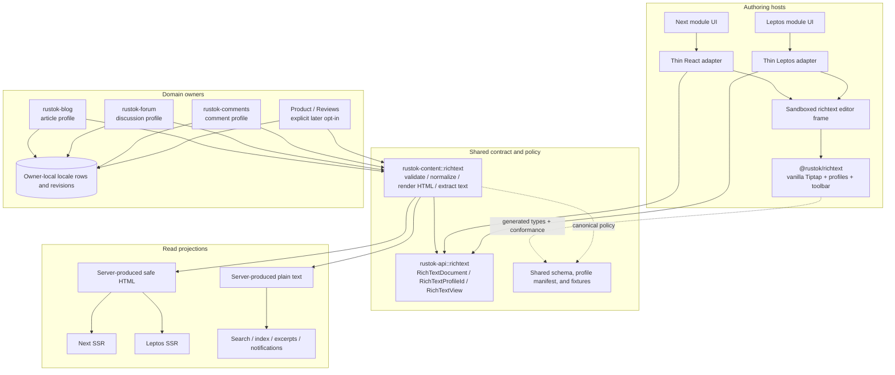

# Richtext Implementation Plan

## Outcome

RusToK will have one reusable richtext capability for Blog, Forum, Comments,
and explicitly opted-in long-form fields. The persisted source of truth is one
current `RichTextDocument`; Tiptap is the browser editor implementation, not a
domain module or a second storage contract.

The code-facing concept stem is `richtext`:

- Rust module and types: `richtext`, `RichTextDocument`, `RichTextView`;
- browser package: `@rustok/richtext`;
- generic format discriminator, only where one is unavoidable: `richtext`;
- no `rt_json_v1`, `rt_json`, `rich_text_v1`, schema version envelope, or
  version suffix in the target contract.

There is no new tenant module and no standalone richtext backend crate. Neutral
wire types belong to `rustok-api`; executable server policy belongs to
`rustok-content`; each domain continues to own its rows, locale selection,
permissions, revisions, events, and business rules.

## Decisions fixed by this plan

1. **One document, one editor.** A migrated field accepts and returns a typed
   `RichTextDocument`. Clients do not choose between Markdown and richtext.
2. **One current schema.** The document contains no format version. A schema
   change updates all repository-owned writers/readers and migrates owner data
   atomically.
3. **Locale is outside the document.** The owner translation/body row and
   owner request context carry locale. The editor receives locale only for UI,
   spellcheck, and directionality.
4. **Tiptap/ProseMirror JSON is the wire shape.** The stored value is the root
   ProseMirror document (`{"type":"doc","content":[]}`), without an outer
   RusToK envelope or a handwritten snake-case-to-Tiptap tree codec. RusToK's
   server profiles, not Tiptap defaults, define which nodes and attributes are
   valid.
5. **One canonical read renderer.** `rustok-content::richtext` produces safe
   semantic HTML and plain text. Next and Leptos consume the same server-owned
   projection; they do not maintain independent production renderers.
6. **One browser runtime.** `@rustok/richtext` uses vanilla Tiptap and owns the
   extension registry, toolbar behavior, editor lifecycle, and browser-frame
   protocol. React and Leptos integrations are thin lifecycle adapters.
7. **Markdown is not a platform contract.** It is not stored, exposed as an
   authoring mode, or implemented by RusToK. If a future screen needs
   import/export, it may use the installed Tiptap capability without changing
   the backend contract. Historical Markdown is only an offline cutover input.
8. **Pages remains separate.** The canonical Pages body stays in the
   Page Builder/Fly contract. A Page component may later contain a richtext
   property, but the page body itself is not migrated.

## Verified current state and inconsistencies

The following facts were verified on 2026-07-22 and are implementation gaps,
not target behavior:

- the only working visual prototype is Tiptap 3.27.4 in
  `apps/next-admin/packages/blog/src/components/rt-json-editor.tsx`;
- the Blog package also owns a Forum reply editor and Forum API helpers, which
  violates module UI ownership;
- the prototype maintains a lossy manual mapping between snake-case RT nodes
  and Tiptap node names, exposes Markdown and raw JSON modes, contains
  hard-coded English, and embeds locale in the payload;
- `StarterKit` already supplies extensions that the prototype registers or
  permits inconsistently; editor and backend allowlists can therefore diverge;
- `rustok-core::rt_json` owns the executable validator even though the accepted
  content ADR assigns shared richtext behavior to `rustok-content`;
- the validator checks an allowlist but does not enforce the complete tree
  grammar, silently drops unknown content, preserves unrecognised fields, and
  does not use the platform locale contract;
- direct `rustok-comments` writes validate only a format string and can bypass
  document validation performed by the Blog adapter;
- Blog, Forum, and Comments expose the same source twice as a string body and a
  `content_json` value;
- actual owner storage is `blog_post_translations`,
  `forum_topic_translations`, `forum_reply_bodies`, and `comment_bodies`; their
  rich JSON is serialized into `TEXT`, while locale is a separate column;
- Forum deletion/revision/event logic still uses the literal `[deleted]` and
  `body_format = 'markdown'` as lifecycle signals;
- content orchestration copies raw body/format pairs between Blog, Forum, and
  Comments without validating the destination profile;
- Blog and shared-content search projectors index the serialized JSON string;
- the existing migration binary targets obsolete shared content rows, skips
  current owner tables and existing RT envelopes, mutates checkpoints during
  dry runs, and bypasses owner events/audit/reindex paths;
- Leptos Blog and Forum forms are raw textareas. Their current adapters either
  omit `content_json`, have no native `#[server]` path, or retry failed writes
  through another protocol;
- storefronts do not have a real richtext read path; some surfaces display raw
  payload summaries;
- the parent Leptos/server CSP forbids style attributes, while ProseMirror core
  and extensions such as Dropcursor create inline styles. Loading Tiptap
  directly into the parent document would violate the current CSP contract.

## Target architecture

### Ownership and dependency rules

| Layer | Owns | Must not own |
| --- | --- | --- |
| `rustok-api::richtext` | dependency-neutral document/node/mark types, `RichTextProfileId`, generated schema, `RichTextView`, optional GraphQL scalar adapters behind the existing feature boundary | validation policy, rendering, editor code, domain profile definitions |
| `rustok-content::richtext` | profile registry, structural validation, canonical normalization, safe HTML rendering, plain-text extraction, limits, URL policy, shared fixtures; existing shared locale helpers remain outside the document | Blog/Forum/Comments tables, owner locale rows/routing decisions, media persistence, UI |
| Domain module | field-to-profile assignment, tenant/RBAC, locale rows and effective content-locale selection through the shared locale contract, storage, revisions, lifecycle, events, transport, autosave/concurrency | a local richtext schema, renderer, or editor implementation |
| `@rustok/richtext` | vanilla Tiptap runtime, exact extension set, toolbar, browser preview, generated TS types, frame protocol and assets | persistence, locale selection, GraphQL/REST, uploads, mention/media lookup, production SSR rendering |
| Leptos/React adapter | mount/unmount, controlled value, dirty/focus state, localized messages, typed intents | editor commands/schema copies, owner business logic, transport fallback |

The accepted dependency direction remains `rustok-core -> rustok-api`.
`rustok-content` consumes `rustok-api`; the current `rustok-core::rt_json` and
generic `content_format` helpers are removed after all callers move. A separate
`rustok-richtext` backend crate would split the already assigned owner and is
not planned.

If the Leptos lifecycle adapter is large enough to justify extraction, create
`rustok-richtext-editor-support` as a support crate. It is not a tenant module,
gets no `modules.toml` slug, and must receive its own README, local plan, and
registry entries when it is actually created.

## Canonical document contract

### Source and transport

- The source is a root `RichTextDocument`, not `{version, locale, doc}`.
- Built-in node/mark discriminator values retain the pinned ProseMirror/Tiptap
  protocol spelling; RusToK-defined JSON fields and custom attributes use
  `snake_case` under the platform naming contract.
- Write DTOs expose one semantic field (`body`, `content`, or `description`) of
  type `RichTextDocument`; they do not expose a second `content_json` field.
- A client does not submit `body_format`/`content_format` for a field whose type
  is fixed to richtext.
- If a genuinely heterogeneous generic boundary needs a discriminator, the
  richtext variant is named `richtext`, is server-selected, and has no alias.
  Other capability-owned formats, such as Page Builder/Fly, remain outside this
  contract and are never accepted by a field migrated to richtext.
- Read DTOs may return `RichTextView { document, html }`. `html` is a derived,
  read-only server projection and is never accepted on a write path.
- `RichTextProfileId` is a stable neutral identifier for generated UI/contract
  metadata. The owner selects it; untrusted write input cannot override it.
- REST/`#[server]` use the Serde type. GraphQL exposes a semantic RichText scalar
  or wrapper backed by that type, not an untyped domain `Value` plus a string.
- TypeScript types are generated from the Rust-owned schema rather than
  handwritten in each package.

### Storage and multilingual behavior

- Domain modules keep their existing owner-local translation/body tables.
- Wave 1 serializes the canonical UTF-8 JSON document into each owner's
  existing `TEXT` body column. It introduces neither a shared richtext table
  nor PostgreSQL-only JSONB/cross-module foreign keys. An owner may reconsider
  its physical column type later only with measured query/storage evidence.
- Locale stays in the owner row/request. Locale normalization and fallback run
  before the editor or renderer receives a document.
- Switching a content locale loads a different owner translation. It never
  rewrites a locale field inside the current document.
- After the atomic data conversion, obsolete per-row format columns should be
  removed where the owner field is homogeneous. If a generic projection must
  retain a format, its invariant value is `richtext`.
- Canonical serialization is deterministic so dirty checks, revision hashes,
  cache keys, and migration idempotency do not depend on object insertion order.

### Server validation and normalization

Every write, including direct Comments ports and orchestration conversions,
passes the owner-selected profile to `rustok-content::richtext`.

The server must:

- reject an invalid root, invalid parent/child relationship, unsupported
  node/mark/attribute, duplicate or malformed mark, and invalid attribute type;
- reject unsupported content instead of silently dropping author data;
- bound raw JSON bytes before parsing, then bound depth, node count, text size,
  marks, links, attribute strings, URLs, and future media references;
- define empty-document semantics per field/profile;
- allow only explicit link schemes and generate safe `rel` attributes according
  to the owner profile;
- exclude raw HTML, scripts, event attributes, arbitrary CSS, iframes, and
  arbitrary embeds;
- normalize only semantics-preserving values; any lossy operation belongs to an
  explicit offline migration report;
- validate again before rendering as defense in depth and fail closed on a
  corrupt stored document;
- record reason codes and counts without logging tenant content.

The first active profiles are:

| Profile | Initial consumers | Initial capability |
| --- | --- | --- |
| `article` | Blog post body | paragraphs, bounded headings, lists, quote, code block, hard break, horizontal rule, bold, italic, strike, inline code, links |
| `discussion` | Forum topic and reply | shared base plus Forum quote/mention behavior once owner callbacks are available |
| `comment` | Comments body | compact shared subset with stricter size/depth/link limits; no headings or horizontal rule unless product evidence requires them |

`description` and `review` are reserved planning labels, not active write
profiles. Per-profile limits and exact heading levels are frozen in the shared
machine-readable profile manifest before the cutover; Tiptap defaults do not
implicitly expand the server schema.

## Browser editor and CSP design

### Shared runtime

Create `packages/richtext` published internally as `@rustok/richtext` with one
exactly pinned Tiptap dependency set. Use vanilla `@tiptap/core`; neither React
nor Rust reimplements the editor.

Compose the schema extensions explicitly, or configure every `StarterKit`
member from the generated profile manifest. No extension is registered twice
and no bundled default silently expands the contract. The first runtime adds
non-document helpers such as Placeholder and CharacterCount as needed, while
Underline and other document-changing extensions remain disabled until their
full server/render/plain-text contract is approved.

The package owns:

- the editor factory and profile-to-extension registry;
- one accessible toolbar and command implementation;
- controlled document updates and deterministic serialization;
- localized message inputs, ARIA labels, keyboard behavior, focus management,
  direction, and read-only browser preview;
- typed intents for owner actions such as media selection or mention search;
- a thin React adapter and the browser contract used by the Leptos adapter;
- static editor CSS and immutable frame assets.

The package does not select tenant/content locale, call an API, persist drafts,
write local storage, or decide field policy. The owner form supplies the
effective UI locale, content direction, messages, profile, current document,
and save lifecycle.

### Sandboxed frame

The current parent CSP (`style-src-attr 'none'`) is intentionally not weakened.
ProseMirror writes inline styles during normal editing, so both Next and Leptos
mount the same editor in an isolated frame.

The target frame contract is:

- same code and immutable assets for both hosts;
- each host exposes the package-produced frame document/assets at a same-origin
  route and applies the frame-specific headers; neither host keeps a forked
  frame HTML or bundle source;
- the parent may make the existing `default-src 'self'` fallback explicit as
  `frame-src 'self'`; it does not relax script or style policy;
- `sandbox="allow-scripts"` without `allow-same-origin`, forms, popups,
  navigation, downloads, or storage access;
- a frame-specific response CSP: external self-hosted script/style assets,
  inline style attributes allowed only inside the frame, no network
  connections, child frames, forms, objects, or arbitrary media, and
  `frame-ancestors 'self'`;
- frame responses also set `X-Frame-Options: SAMEORIGIN`,
  `X-Content-Type-Options: nosniff`, `Referrer-Policy: no-referrer`, and a
  restrictive `Permissions-Policy`; the static endpoint ignores auth/session
  cookies, never sets cookies, and never embeds tenant or user data;
- a single self-contained classic bundle unless the Phase 0 browser spike
  proves an opaque-origin ESM build across supported browsers;
- one-time source/nonce handshake followed by a private `MessageChannel`;
- schema validation, payload-size limits, monotonically increasing sequence
  numbers, and echo suppression on both sides;
- no auth token, tenant secret, cookie, or full host runtime context inside the
  frame;
- lazy loading on authoring routes only. Anonymous storefront bundles must not
  contain Tiptap/ProseMirror.

Phase 0 must prove this contract in Chromium, Firefox, and WebKit before the
wrapper is treated as implementation-ready. If the same-origin opaque frame
cannot load the self-contained bundle reliably, implementation stops for a
separate CSP/origin decision; a new frame origin is not pre-authorized by this
plan. Patching/forking ProseMirror to remove all style writes is not the default
path and also requires a separate maintenance decision.

### Extension policy

The first cutover uses only the extension set required by the three active
profiles. Candidate additions are handled as schema changes, not toolbar-only
changes:

- Media image: later, after a Media-owned batch-read contract exists;
- mentions and structured quotes: owner callbacks plus Forum/Comments profile
  rules;
- tables, task lists, underline/highlight, text alignment, and code syntax
  highlighting: add only with validator, renderer, CSP, accessibility, plain
  text, and migration fixtures in the same change;
- arbitrary HTML and arbitrary embeds: prohibited;
- external video embeds: excluded until an explicit CSP/privacy/product
  decision is approved.

## Read and projection contract

`rustok-content::richtext` is the only production renderer. It emits escaped,
semantic, class-based HTML with no inline styles or event attributes. Domain
read services return that derived HTML next to the canonical document when a
consumer needs both.

- Next SSR renders only the server-produced projection through the shared thin
  display component.
- Leptos SSR uses the same projection; it does not implement a second node
  visitor.
- Browser editor preview may use Tiptap, but preview output is not persisted or
  treated as production rendering evidence.
- HTML is computed or cached by canonical document hash,
  `RichTextProfileId`, policy digest, and renderer build identity; later
  Media-backed output also includes resolved-asset revision identity. It is not
  an independently writable business copy.
- Invalid stored data yields a safe unavailable placeholder and an observable
  error, never raw JSON or partially trusted HTML.
- `plain_text(document, profile)` is shared by Search, Index, excerpts,
  notifications, email/RSS, moderation previews, and accessibility fallbacks.

Search SQL that currently inserts raw `body` values must be split into a Rust
projection step or consume owner-extracted text through a typed event. A JSON
string must never enter full-text search as prose.

## Domain integration rules

### Blog, Forum, and Comments

Wave 1 covers complete vertical paths, not editor-only demos:

- owner write service and validation;
- owner-local storage and revisions;
- native `#[server]` plus parallel GraphQL where required;
- Next and Leptos authoring adapters;
- admin/moderation read views;
- Next and Leptos storefront SSR;
- plain-text search/index/event projections;
- optimistic concurrency, dirty-state guard, autosave ownership, and audit;
- tenant/locale/RBAC and public visibility tests.

Forum lifecycle logic must stop deriving deletion from `[deleted]` or Markdown.
Deletion comes from typed lifecycle state; any tombstone presentation is a
derived view. Active bodies and topic/reply revision tables are migrated without
creating false revision or domain-event history.

Forum mention extraction moves from format branching to the validated document
tree. Code blocks and code marks remain excluded. A later structured mention
node must carry a bounded owner identity and still be resolved/authorized by
Forum, not by the editor frame.

Content orchestration transfers a typed document and validates the destination
profile. An incompatible Blog/Forum/Comment conversion returns an explicit
error or uses a separately documented, observable transform; it never copies a
raw string/format pair or silently deletes nodes.

### Media

The first profiles contain no image or embed nodes. A later Media integration
will:

- store a `media_id` and bounded per-occurrence localized alt/caption, not an
  arbitrary `src` URL;
- add or consume a tenant-scoped batch Media read contract;
- resolve assets in the owner/integration adapter and pass a neutral resolved
  asset map to the renderer;
- avoid `rustok-content -> rustok-media` coupling, N+1 lookups, and cross-module
  database foreign keys;
- render a safe unavailable asset state and emit non-content diagnostics when
  resolution fails.

### Field classification

Reusing the editor does not make every text field richtext.

| Field/surface | Decision |
| --- | --- |
| Blog post body | Wave 1, `article` |
| Forum topic/reply body | Wave 1, `discussion` |
| Comments body | Wave 1, `comment`, including existing create/edit/moderation/read surfaces |
| Blog excerpt, SEO title/description, slugs, labels | remain plain text |
| Forum/category short descriptions | remain plain text unless the owner later opts in |
| Page body | stays Page Builder/Fly; not a richtext migration |
| Embedded Page component field | possible future explicit profile |
| Product description | Wave 3 only after Product storage/API/index decision |
| Product attribute type currently named `richtext` | Wave 3; current scalar `value_text` is not yet the shared contract |
| Reviews | future; no owner module currently exists |

## Atomic cutover and data migration

The work packages below may be prepared separately, but the target wire/storage
cutover is one atomic repository change. No merged internal dual-read,
dual-write, alias, or fallback-to-legacy execution path is planned.

### Migration inventory

The migration must include:

- Blog post translations and relevant revisions/audit payloads;
- Forum topic translations, reply bodies, topic revisions, reply revisions,
  deletion triggers, and domain-event triggers on PostgreSQL and SQLite;
- Comments bodies and comment integration paths;
- orchestration state that copies or compares content;
- Search and Index projections;
- tests, seed data, fixtures, GraphQL/REST/server-function DTOs, MCP/AI/SEO
  callers, and documentation that construct `content_json` or legacy formats;
- legacy shared content rows only if an inventory proves they are still live;
- removal of `apps/server/src/bin/migrate_legacy_richtext.rs` after its useful
  behavior is replaced.

### Migration behavior

1. Inventory rows by tenant, owner, table, source format, locale, and revision.
2. Dry-run without writes or checkpoint mutation. Report every invalid,
   unsupported, locale-mismatched, or lossy candidate.
3. Convert an old RT envelope by stripping `version`/`locale`, mapping legacy
   node names to the canonical ProseMirror shape, and validating the owner-row
   locale separately.
4. If inventory proves that material historical Markdown rows exist, convert
   them once with upstream tooling in the offline migration. Do not add a
   RusToK runtime parser or migration path for an empty development-only case.
5. Persist through owner-aware migration adapters or owner services so audit,
   revisions, events, and reindex behavior are explicit. Bulk mode may suppress
   normal fan-out only through a documented migration transaction followed by
   deterministic rebuilds.
6. Scope idempotent checkpoints by tenant, owner, table/target, and contract
   digest. Never advance past a failed row; dead-letter/report failures.
7. Verify counts, hashes, locale coverage, revision integrity, renderer output,
   plain-text output, and search rebuild before cutover.
8. Deploy code and schema expecting only the target contract, then remove old
   constants, validators, DTO fields, editor files, triggers, tests, aliases,
   and legacy documentation in the same cutover.

Any staged bridge for a real external client requires a separate approved ADR,
a named removal owner, and a calendar deadline. None is authorized by this plan.

## Execution plan

### Phase 0 — freeze the boundary and prove the browser frame

Deliverables:

- approve the richtext boundary ADR;
- freeze `RichTextDocument`, `RichTextView`, the initial profile manifest, and
  accepted/rejected/render/plain-text fixtures;
- create a complete legacy identifier/call-site/data inventory;
- run the sandboxed opaque-origin frame spike in Chromium, Firefox, and WebKit;
- record bundle-size, lazy-load, CSP, MessageChannel, accessibility, and IME
  baselines.

Done when the frame works without weakening the parent CSP, the contract has no
unresolved ownership or locale question, and every legacy path is assigned to
an atomic cutover task.

### Phase 1 — implement shared types, policy, and production projections

Deliverables:

- add neutral types/schema adapters to `rustok-api::richtext`;
- implement strict profiles, normalization, HTML rendering, and plain-text
  extraction in `rustok-content::richtext`;
- add property/fuzz/size-limit/security tests and cross-language fixtures;
- implement typed read-only HTML projection and shared display contract;
- prepare owner adapters for validation, storage serialization, and search
  extraction;
- make direct Comments writes impossible without the shared validator.

Done when malicious/invalid documents fail closed, accepted fixtures produce
one canonical serialization/HTML/plain-text result, and no frontend renderer is
needed for production reads.

### Phase 2 — build the single browser editor runtime

Deliverables:

- create `@rustok/richtext` with vanilla Tiptap, pinned dependencies, one
  profile registry, one toolbar, static CSS, and immutable frame assets;
- generate TS structural types from the Rust contract;
- implement the framed controller, private channel, bounded messages, and thin
  React/Leptos lifecycle adapters;
- localize all visible messages through host-supplied dictionaries;
- test controlled updates, selection preservation, dirty state, locale switch
  guard, disabled/read-only state, and unmount cleanup;
- prove the editor bundle is absent from anonymous storefront output.

Done when the same frame artifact edits the same fixture in Next and Leptos and
returns byte-equivalent canonical documents without CSP violations.

### Phase 3 — prepare owner verticals and transport parity

Deliverables:

- move Forum Next UI/API/navigation out of the Blog package into the owner
  package `@rustok/forum-admin` and declare its manifest wiring;
- connect Blog, Forum, and Comments forms to the shared adapters without local
  toolbars/schema/mappers;
- implement native `#[server]` paths for Leptos owner surfaces and keep GraphQL
  in parallel;
- remove blind GraphQL-to-REST mutation retry; selected transport failures are
  surfaced without replaying writes;
- use host-provided UI locale and owner-selected content locale;
- integrate server-produced HTML in admin/moderation and both storefronts;
- update search/index, mentions, orchestration, lifecycle, revisions, and
  event paths.

Done when save/reload/render/search behavior is equivalent across Next and
Leptos for all three Wave 1 owners on target-only fixtures.

### Phase 4 — migrate data and cut over atomically

Deliverables:

- execute owner-local dry runs and resolve every failure;
- migrate current rows and revisions with verified checkpoints;
- rebuild Search/Index and compare plain-text projections;
- switch all backend and frontend call sites to `RichTextDocument`/
  `RichTextView`;
- delete legacy core helpers, aliases, `content_json`, format selectors,
  raw-JSON UI, old migration binary, and obsolete tests/docs;
- drop obsolete format columns where the owner field is homogeneous.

Done when repository search finds legacy identifiers only in immutable history
or the explicitly deprecated implementation snapshot pending deletion, all
target verification passes, and runtime accepts only the current contract.

### Phase 5 — harden Wave 1 and expand only with evidence

Deliverables:

- production accessibility, Unicode/IME/RTL, mobile, clipboard, keyboard, and
  large-document performance evidence;
- observability dashboards for validation failures, render failures, document
  sizes, frame load failures, and migration/search drift without content logs;
- Wave 2 advanced comment-composer UX, drafts, structured mentions, and Media
  integration only after their owner contracts exist;
- Wave 3 Product description/attribute migration only after Product approves
  its typed storage/API/search model;
- future Reviews integration only after a Reviews owner module exists.

Done when each new node, mark, or consumer lands with owner policy, server
validation/render/plain-text support, both host adapters where applicable, CSP
and accessibility evidence, migrations, and synchronized local/central docs.

## Verification matrix

Minimum gates for the cutover:

| Area | Required evidence |
| --- | --- |
| Contract | accepted/rejected fixtures, deterministic serialization, generated-schema drift check |
| Security | raw-size/depth/node/attribute/URL limits, stored-XSS corpus, no raw HTML/embed, fuzz/property tests |
| Editor | Next and Leptos create/edit/save/reload, controlled-update loops, profile enforcement |
| CSP/frame | supported browsers, zero parent/frame CSP violations, no storage/network access, malformed/replayed/oversized message rejection |
| Transport | Leptos native `#[server]` default plus GraphQL parity; no cross-protocol mutation retry |
| Locale | host UI locale, owner content-locale switch, dirty-state guard, fallback resolved before document load |
| Rendering | one Rust renderer, semantic HTML snapshots, Next/Leptos SSR parity, invalid-data fail-closed state |
| Projection | plain-text Search/Index/excerpt/notification fixtures; JSON syntax absent from indexed text |
| Migration | no-write dry run, owner/tenant checkpoints, failure retry, row/revision/hash/count reconciliation, deterministic rebuild |
| UX | keyboard, focus, screen reader, Unicode/IME, RTL, mobile viewport, paste, undo/redo |
| Performance | lazy authoring bundle, storefront exclusion, initial-load and large-document budgets |
| Privacy | no document content in logs, metrics, analytics, local storage, or frame URLs |

Targeted commands will be added with implementation. The baseline set includes:

- `cargo test -p rustok-api` for schema/Serde/GraphQL adapters;
- `cargo test -p rustok-content` for validation/render/plain text;
- owner tests for Blog, Forum, Comments, orchestration, Search, and Index;
- `cargo xtask module validate content|blog|forum|comments`;
- `npm run verify:i18n:ui` and `npm run verify:i18n:contract`;
- Blog/Forum/Comments admin/storefront boundary verifiers;
- Playwright coverage for Next and Leptos framed editor and SSR reads;
- `git diff --check` and a legacy-identifier cutover guard.

## Documentation and registry synchronization

This central plan owns the cross-cutting sequence. Implementation changes must
also update the local plans/READMEs for `rustok-api`, `rustok-content`, Blog,
Forum, Comments, Search/Index, Product when opted in, Next Admin, Leptos Admin,
and both storefronts.

- Do not add a `richtext` module slug.
- Do not add a row to the implementation-plans registry for this central plan.
- Add crate/package registry and local-plan rows only when a real new support
  crate/package is created.
- Keep FFA/FBA status and the central readiness board synchronized when an
  owner UI or transport boundary actually changes.
- Do not rewrite immutable historical evidence. Document the target cutover and
  remove current compatibility documentation together with current code.

## Non-goals

- a full editor written in Rust;
- a separate richtext domain/backend module or shared content table;
- persistent Markdown, HTML, or multiple richtext schema versions;
- a generic WYSIWYG replacement for Page Builder;
- arbitrary HTML, arbitrary URLs, iframes, or embeds;
- automatic conversion of every `description`/`text` field to richtext;
- duplicated Next/Leptos production renderers, profile registries, toolbars, or
  owner-local editor implementations.

## Related decisions and references

- [Multilingual content contract](../../DECISIONS/2026-03-28-multilingual-content-contract.md)
- [Leptos server functions as the internal data layer](../../DECISIONS/2026-03-29-leptos-server-functions-as-internal-data-layer.md)
- [Port contract ownership and runtime feature boundary](../../DECISIONS/2026-07-01-port-contract-ownership-and-runtime-feature-boundary.md)
- [Proposed richtext capability boundary ADR](../../DECISIONS/2026-07-22-richtext-capability-boundary.md)
- [Legacy RT JSON implementation snapshot](../standards/rt-json-v1.md)
