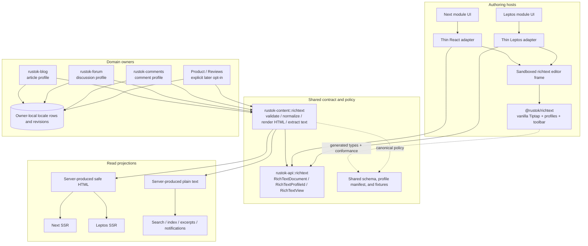

# Richtext Implementation Plan

## Outcome

RusToK will have one reusable richtext capability for Blog, Forum, Comments,
and explicitly opted-in long-form fields. The persisted source of truth is one
current `RichTextDocument`; Tiptap is the browser editor implementation, not a
domain module or a second storage contract.

The code-facing concept stem is `richtext`:

- Rust module and types: `richtext`, `RichTextDocument`, `RichTextView`;
- browser package: `@rustok/richtext`;
- generic format discriminator, only where one is unavoidable: `richtext`;
- no `rt_json_v1`, `rt_json`, `rich_text_v1`, schema version envelope, or
  version suffix in the target contract.

There is no new tenant module and no standalone richtext backend crate. Neutral
wire types belong to `rustok-api`; executable server policy belongs to
`rustok-content`; each domain continues to own its rows, locale selection,
permissions, revisions, events, and business rules.

## Implementation status

The boundary ADR is accepted. The first server foundation is implemented:

- `rustok-api::richtext` owns the neutral ProseMirror/Tiptap document shape,
  unversioned profile identifier, read-only view, Serde rejection of the
  removed envelope/unknown structural fields, and the optional `RichText`
  GraphQL scalar;
- `rustok-content::richtext` owns the initial `article`, `discussion`, and
  `comment` manifests, strict tree/attribute/link policy, deterministic
  normalization, one safe HTML renderer, and one plain-text extractor;
- shared fixtures live in
  `crates/rustok-content/fixtures/richtext/`, with a committed profile
  manifest and article HTML/plain-text projections.

The foundation is active. Comments, Blog articles, and Forum topics/replies
use the typed owner-selected contract in their current services and transports.
Later opt-in fields remain separate owner decisions. The obsolete
`rustok-core` richtext/format helpers, generic `NodeService`, unused content
entity DataLoaders, and caller-selected Pages body format are removed.

The Phase 2 browser runtime source is implemented in `packages/richtext`:
the package owns the explicit Tiptap extension registry, generated profile
contracts, bounded private-channel controller, React adapter, browser lifecycle,
and hashed frame assets. The shared `leptos-ui` frame owns the Leptos WASM
lifecycle; Blog and Forum expose only thin profile/locale wrappers. The Blog
editor selects `article` and Forum selects `discussion`. A Chromium spike verified the
sandbox boundary, blocked cookie/parent-DOM access, CSP headers, private
`MessageChannel`, and canonical document updates. The Leptos Trunk/SSR static
fallback copies the same hashed frame plus browser adapter, applies dedicated
no-store bootstrap headers and immutable hashed-asset headers, and mounts editor
frames only during hydration; SSR emits inert iframe markup and executes no
WASM editor runtime. The internal frame protocol is unversioned,
the host revalidates frame documents, and the browser validator now enforces the
same tree, mark, attribute, URL, and size rules as the Rust policy. Host-selected
content locale, derived direction, spellcheck and dynamic read-only state now
update through the private channel without remounting. Firefox, WebKit and full
mounted-host accessibility/IME/save-reload evidence remain required before
Phase 2 is complete.

Read-only projection is centralized as well. React consumers use
`@rustok/richtext/view`, and Leptos consumers use
`leptos_ui::RichTextHtml`. Both accept the typed server-derived
`RichTextView`, owner content locale, and presentation class; neither imports
Tiptap, derives HTML, or accepts a raw HTML string as its public input. Blog
Next/Leptos, Forum Leptos, and Comments moderation now use this boundary.

The Blog article runtime source cutover is implemented: the owner validates submitted
documents with the fixed `article` profile, writes canonical root JSON, and
exposes server-derived HTML/plain text to Next and Leptos admin/storefront
surfaces. Native `#[server]` is selected for Leptos SSR/hydrate, GraphQL remains
parallel for CSR/headless use, and mutation failures do not cross protocols.
The pre-release initial migration now creates the canonical article body column
directly. The corrective migration, owner-specific backfill executable, shared
server conversion binary, launcher, positive evidence, and obsolete instructions
are deleted; the Blog source gate rejects their reintroduction.

The Forum runtime source cutover is implemented: topic/reply storage and revision
history contain only canonical documents; REST and GraphQL use
`RichTextDocument`/`RichTextView`; mentions walk structural nodes; deletion is
lifecycle state rather than content mutation; Next and Leptos use shared frame
adapters; storefront reads consume server-sanitized HTML and plain text through
the shared display boundary. Native checks, 113 Forum unit tests, package tests,
the Forum/Blog ownership verifier, the whole-host Next typecheck, and canonical
SQLite/PostgreSQL soft-delete/revision execution pass. Next and Leptos now both
own topic create/edit and reply composition through the Forum package. Leptos
reply writes select native SSR/hydrate or GraphQL CSR/headless transport without
fallback. Comments owns reusable React and Leptos public composer bindings;
Blog supplies the exact target-bound commands for the first composition.

## Decisions fixed by this plan

1. **One document, one editor.** A migrated field accepts and returns a typed
   `RichTextDocument`. Clients do not choose between Markdown and richtext.
2. **One current schema.** The document contains no format version. A schema
   change updates all repository-owned writers/readers and migrates owner data
   atomically.
3. **Locale is outside the document.** The owner translation/body row and
   owner request context carry locale. The editor receives locale only for UI,
   spellcheck, and directionality.
4. **Tiptap/ProseMirror JSON is the wire shape.** The stored value is the root
   ProseMirror document; a new editor starts with one empty paragraph rather
   than an invalid zero-child root. There is no outer RusToK envelope or
   handwritten snake-case-to-Tiptap tree codec. RusToK's server profiles, not
   Tiptap defaults, define which nodes and attributes are valid.
5. **One canonical read renderer.** `rustok-content::richtext` produces safe
   semantic HTML and plain text. Next and Leptos consume the same server-owned
   projection; they do not maintain independent production renderers.
6. **One browser runtime.** `@rustok/richtext` uses vanilla Tiptap and owns the
   extension registry, toolbar behavior, editor lifecycle, and browser-frame
   protocol. React and Leptos integrations are thin lifecycle adapters.
7. **Markdown is not a platform contract.** It is not stored, exposed as an
   authoring mode, or implemented by RusToK. If a future screen needs
   import/export, it may use the installed Tiptap capability without changing
   the backend contract. Historical Markdown is only an offline cutover input.
8. **Pages remains separate.** The canonical Pages body stays in the
   Page Builder/Fly contract. A Page component may later contain a richtext
   property, but the page body itself is not migrated.

## Verified current state and inconsistencies

The repository was re-audited against the current tree on 2026-08-11. The
following is the live closeout inventory, not historical phase evidence:

- Blog, Forum, and Comments owner services accept typed documents, select their
  profile server-side, store locale outside the document, and expose server
  HTML/plain-text projections. Forum lifecycle, revisions, mentions, and
  orchestration no longer branch on a body format.
- `@rustok/richtext` is the only Tiptap runtime. Its explicit extension set is
  generated from the shared profile manifest; the internal frame envelope has
  no version/revision tag; host and frame validate bounded messages and the
  full current document grammar.
- Blog has shared Next and Leptos article authoring. Forum has matching topic
  create/edit and reply composition on both admin hosts. Comments owns reusable
  Leptos and React storefront composers, and Blog supplies target-bound native
  and GraphQL comment commands for both storefront compositions.
- The Blog-owned Next detail surface preserves the same typed Comments
  unavailable/timeout and cached-snapshot states as Leptos; neither host turns
  provider degradation into a false empty state.
- The Leptos wrappers consume only the host-provided UI locale for messages and
  no longer substitute package-local `en`. Next and Leptos pass the
  owner-selected content locale separately; the shared runtime canonicalizes it
  to neutral `und` while invalid, derives direction, applies spellcheck, and
  updates dynamic disabled/read-only state without remounting.
- Current Next Blog and Forum forms still contain owner-visible hard-coded
  English copy. That is an i18n defect outside the shared editor messages and
  must be fixed with the owner package catalogs.
- `rustok-core` no longer owns richtext or Page Builder format helpers. The
  Page Builder document validator and canonical internal format constant live
  with `rustok-page-builder`.
- Blog and Comments initial migrations now create the canonical richtext body
  columns directly. Their corrective cutover migrations, conversion binaries,
  positive evidence, and current operational instructions are deleted.
- Pages now selects its sole Page Builder format server-side; clients cannot
  choose Markdown, richtext, aliases, or another body format. The persisted
  format remains an internal artifact/source invariant and Page bodies are not
  converted to richtext.
- Pages write DTOs now expose one typed `document` field. The former parallel
  `content`/`content_json` inputs and their parse-or-precedence path are removed
  from Rust, GraphQL, Leptos/admin transports, tests, and current documentation;
  read projections retain stored content and the internal artifact format.
- The generic shared `NodeService`, its DTO/tests, and the unused content entity
  DataLoaders are removed. Current owner modules keep their own services and
  persistence.
- The parent Leptos/server CSP forbids style attributes, while ProseMirror core
  writes them during editing. The isolated frame remains required; loading
  Tiptap directly into the parent document is not an alternative.

## Target architecture

```mermaid
flowchart TB
    subgraph Authoring["Authoring hosts"]
        NA["Next module UI"]
        LA["Leptos module UI"]
        NR["Thin React adapter"]
        LR["Thin Leptos adapter"]
        FRAME["Sandboxed richtext editor frame"]
        JS["@rustok/richtext<br/>vanilla Tiptap + profiles + toolbar"]
        NA --> NR --> FRAME
        LA --> LR --> FRAME
        FRAME --> JS
    end

    subgraph Contract["Shared contract and policy"]
        API["rustok-api::richtext<br/>RichTextDocument / RichTextProfileId / RichTextView"]
        CONTENT["rustok-content::richtext<br/>validate / normalize / render HTML / extract text"]
        FIX["Shared schema, profile manifest, and fixtures"]
        CONTENT --> API
        JS -.->|"generated types + conformance"| FIX
        CONTENT -.->|"canonical policy"| FIX
    end

    subgraph Owners["Domain owners"]
        BLOG["rustok-blog<br/>article profile"]
        FORUM["rustok-forum<br/>discussion profile"]
        COMMENTS["rustok-comments<br/>comment profile"]
        FUTURE["Product / Reviews<br/>explicit later opt-in"]
        DB[("Owner-local locale rows and revisions")]
        BLOG --> DB
        FORUM --> DB
        COMMENTS --> DB
        FUTURE --> DB
    end

    subgraph Reads["Read projections"]
        HTML["Server-produced safe HTML"]
        TEXT["Server-produced plain text"]
        NEXT["Next SSR"]
        LEPTOS["Leptos SSR"]
        SEARCH["Search / index / excerpts / notifications"]
        HTML --> NEXT
        HTML --> LEPTOS
        TEXT --> SEARCH
    end

    NR --> API
    LR --> API
    BLOG --> CONTENT
    FORUM --> CONTENT
    COMMENTS --> CONTENT
    FUTURE --> CONTENT
    CONTENT --> HTML
    CONTENT --> TEXT
```

### Ownership and dependency rules

| Layer | Owns | Must not own |
| --- | --- | --- |
| `rustok-api::richtext` | dependency-neutral document/node/mark types, `RichTextProfileId`, generated schema, `RichTextView`, optional GraphQL scalar adapters behind the existing feature boundary | validation policy, rendering, editor code, domain profile definitions |
| `rustok-content::richtext` | profile registry, structural validation, canonical normalization, safe HTML rendering, plain-text extraction, limits, URL policy, shared fixtures; existing shared locale helpers remain outside the document | Blog/Forum/Comments tables, owner locale rows/routing decisions, media persistence, UI |
| Domain module | field-to-profile assignment, tenant/RBAC, locale rows and effective content-locale selection through the shared locale contract, storage, revisions, lifecycle, events, transport, autosave/concurrency | a local richtext schema, renderer, or editor implementation |
| `@rustok/richtext` | vanilla Tiptap runtime, exact extension set, toolbar, browser preview, generated TS types, frame protocol and assets | persistence, locale selection, GraphQL/REST, uploads, mention/media lookup, production SSR rendering |
| Leptos/React adapter | mount/unmount, controlled value, dirty/focus state, localized messages, typed intents | editor commands/schema copies, owner business logic, transport fallback |

The accepted dependency direction remains `rustok-core -> rustok-api`.
`rustok-content` consumes `rustok-api`; `rustok-core` contains no richtext or
generic content-format implementation. A separate
`rustok-richtext` backend crate would split the already assigned owner and is
not planned.

If the Leptos lifecycle adapter is large enough to justify extraction, create
`rustok-richtext-editor-support` as a support crate. It is not a tenant module,
gets no `modules.toml` slug, and must receive its own README, local plan, and
registry entries when it is actually created.

## Canonical document contract

### Source and transport

- The source is a root `RichTextDocument`, not `{version, locale, doc}`.
- Built-in node/mark discriminator values retain the pinned ProseMirror/Tiptap
  protocol spelling; RusToK-defined JSON fields and custom attributes use
  `snake_case` under the platform naming contract.
- Write DTOs expose one semantic field (`body`, `content`, or `description`) of
  type `RichTextDocument`; they do not expose a second `content_json` field.
- A client does not submit `body_format`/`content_format` for a field whose type
  is fixed to richtext.
- If a genuinely heterogeneous generic boundary needs a discriminator, the
  richtext variant is named `richtext`, is server-selected, and has no alias.
  Other capability-owned formats, such as Page Builder/Fly, remain outside this
  contract and are never accepted by a field migrated to richtext.
- Read DTOs may return `RichTextView { document, html }`. `html` is a derived,
  read-only server projection and is never accepted on a write path.
- `RichTextProfileId` is a stable neutral identifier for generated UI/contract
  metadata. The owner selects it; untrusted write input cannot override it.
- REST/`#[server]` use the Serde type. GraphQL exposes a semantic RichText scalar
  or wrapper backed by that type, not an untyped domain `Value` plus a string.
- TypeScript types are generated from the Rust-owned schema rather than
  handwritten in each package.

### Storage and multilingual behavior

- Domain modules keep their existing owner-local translation/body tables.
- Wave 1 serializes the canonical UTF-8 JSON document into each owner's
  existing `TEXT` body column. It introduces neither a shared richtext table
  nor PostgreSQL-only JSONB/cross-module foreign keys. An owner may reconsider
  its physical column type later only with measured query/storage evidence.
- Locale stays in the owner row/request. Locale normalization and fallback run
  before the editor or renderer receives a document.
- Switching a content locale loads a different owner translation. It never
  rewrites a locale field inside the current document.
- After the atomic data conversion, obsolete per-row format columns should be
  removed where the owner field is homogeneous. If a generic projection must
  retain a format, its invariant value is `richtext`.
- Canonical serialization is deterministic so dirty checks, revision hashes,
  cache keys, and migration idempotency do not depend on object insertion order.

### Server validation and normalization

Every write, including direct Comments ports and orchestration conversions,
passes the owner-selected profile to `rustok-content::richtext`.

The server must:

- reject an invalid root, invalid parent/child relationship, unsupported
  node/mark/attribute, duplicate or malformed mark, and invalid attribute type;
- reject unsupported content instead of silently dropping author data;
- bound raw JSON bytes before parsing, then bound depth, node count, text size,
  marks, links, attribute strings, URLs, and future media references;
- define empty-document semantics per field/profile;
- allow only explicit link schemes and generate safe `rel` attributes according
  to the owner profile;
- exclude raw HTML, scripts, event attributes, arbitrary CSS, iframes, and
  arbitrary embeds;
- normalize only semantics-preserving values; any lossy operation belongs to an
  explicit offline migration report;
- validate again before rendering as defense in depth and fail closed on a
  corrupt stored document;
- record reason codes and counts without logging tenant content.

The first active profiles are:

| Profile | Initial consumers | Initial capability |
| --- | --- | --- |
| `article` | Blog post body | paragraphs, bounded headings, lists, quote, code block, hard break, horizontal rule, bold, italic, strike, inline code, links |
| `discussion` | Forum topic and reply | shared base plus Forum quote/mention behavior once owner callbacks are available |
| `comment` | Comments body | compact shared subset with stricter size/depth/link limits; no headings or horizontal rule unless product evidence requires them |

`description` and `review` are reserved planning labels, not active write
profiles. Per-profile limits and exact heading levels are frozen in the shared
machine-readable profile manifest before the cutover; Tiptap defaults do not
implicitly expand the server schema.

The initial manifest is now committed at
`crates/rustok-content/fixtures/richtext/profiles.json`. Its limits are
enforced by `rustok-content::richtext`; changing a node, mark, attribute, URL
rule, or limit requires updating that fixture, the Rust policy tests, the
browser extension manifest, and the owner migration evidence together.

## Browser editor and CSP design

### Shared runtime

Create `packages/richtext` published internally as `@rustok/richtext` with one
exactly pinned Tiptap dependency set. Use vanilla `@tiptap/core`; neither React
nor Rust reimplements the editor.

Compose the schema extensions explicitly, or configure every `StarterKit`
member from the generated profile manifest. No extension is registered twice
and no bundled default silently expands the contract. The first runtime adds
non-document helpers such as Placeholder and CharacterCount as needed, while
Underline and other document-changing extensions remain disabled until their
full server/render/plain-text contract is approved.

The Link extension is configured to persist only the canonical `href`; its
`target`, `rel`, and `class` defaults must be `null`. The server strips those
null defaults and derives the profile-specific safe `rel` value during HTML
projection, so a client cannot choose navigation or trust attributes.

The package owns:

- the editor factory and profile-to-extension registry;
- one accessible toolbar and command implementation;
- controlled document updates and deterministic serialization;
- localized message inputs, ARIA labels, keyboard behavior, focus management,
  direction, and read-only browser preview;
- typed intents for owner actions such as media selection or mention search;
- a thin React adapter and the browser contract used by the Leptos adapter;
- static editor CSS and immutable frame assets.

The package does not select tenant/content locale, call an API, persist drafts,
write local storage, or decide field policy. The owner form supplies the
effective UI locale, content direction, messages, profile, current document,
and save lifecycle.

### Sandboxed frame

The current parent CSP (`style-src-attr 'none'`) is intentionally not weakened.
ProseMirror writes inline styles during normal editing, so both Next and Leptos
mount the same editor in an isolated frame.

The target frame contract is:

- same code and immutable assets for both hosts;
- each host exposes the package-produced frame document/assets at a same-origin
  route and applies the frame-specific headers; neither host keeps a forked
  frame HTML or bundle source;
- the parent may make the existing `default-src 'self'` fallback explicit as
  `frame-src 'self'`; it does not relax script or style policy;
- `sandbox="allow-scripts"` without `allow-same-origin`, forms, popups,
  navigation, downloads, or storage access;
- a frame-specific response CSP: external self-hosted script/style assets,
  inline style attributes allowed only inside the frame, no network
  connections, child frames, forms, objects, or arbitrary media, and
  `frame-ancestors 'self'`;
- frame responses also set `X-Frame-Options: SAMEORIGIN`,
  `X-Content-Type-Options: nosniff`, `Referrer-Policy: no-referrer`, and a
  restrictive `Permissions-Policy`; the static endpoint ignores auth/session
  cookies, never sets cookies, and never embeds tenant or user data;
- a single self-contained classic bundle unless the Phase 0 browser spike
  proves an opaque-origin ESM build across supported browsers;
- one-time source/nonce handshake followed by a private `MessageChannel`;
- schema validation, payload-size limits, monotonically increasing sequence
  numbers, and echo suppression on both sides;
- no auth token, tenant secret, cookie, or full host runtime context inside the
  frame;
- lazy loading on authoring routes only. Anonymous storefront bundles must not
  contain Tiptap/ProseMirror.

Phase 0 must prove this contract in Chromium, Firefox, and WebKit before the
wrapper is treated as implementation-ready. If the same-origin opaque frame
cannot load the self-contained bundle reliably, implementation stops for a
separate CSP/origin decision; a new frame origin is not pre-authorized by this
plan. Patching/forking ProseMirror to remove all style writes is not the default
path and also requires a separate maintenance decision.

### Extension policy

The first cutover uses only the extension set required by the three active
profiles. Candidate additions are handled as schema changes, not toolbar-only
changes:

- Media image: later, after a Media-owned batch-read contract exists;
- mentions and structured quotes: owner callbacks plus Forum/Comments profile
  rules;
- tables, task lists, underline/highlight, text alignment, and code syntax
  highlighting: add only with validator, renderer, CSP, accessibility, plain
  text, and migration fixtures in the same change;
- arbitrary HTML and arbitrary embeds: prohibited;
- external video embeds: excluded until an explicit CSP/privacy/product
  decision is approved.

## Read and projection contract

`rustok-content::richtext` is the only production renderer. It emits escaped,
semantic, class-based HTML with no inline styles or event attributes. Domain
read services return that derived HTML next to the canonical document when a
consumer needs both.

- Next SSR renders only the server-produced projection through the shared thin
  display component.
- Leptos SSR uses the same projection; it does not implement a second node
  visitor.
- Browser editor preview may use Tiptap, but preview output is not persisted or
  treated as production rendering evidence.
- HTML is computed or cached by canonical document hash,
  `RichTextProfileId`, policy digest, and renderer build identity; later
  Media-backed output also includes resolved-asset revision identity. It is not
  an independently writable business copy.
- Invalid stored data yields a safe unavailable placeholder and an observable
  error, never raw JSON or partially trusted HTML.
- `plain_text(document, profile)` is shared by Search, Index, excerpts,
  notifications, email/RSS, moderation previews, and accessibility fallbacks.

Search SQL that currently inserts raw `body` values must be split into a Rust
projection step or consume owner-extracted text through a typed event. A JSON
string must never enter full-text search as prose.

## Domain integration rules

### Blog, Forum, and Comments

Wave 1 covers complete vertical paths, not editor-only demos:

- owner write service and validation;
- owner-local storage and revisions;
- native `#[server]` plus parallel GraphQL where required;
- Next and Leptos authoring adapters;
- admin/moderation read views;
- Next and Leptos storefront SSR;
- plain-text search/index/event projections;
- optimistic concurrency, dirty-state guard, autosave ownership, and audit;
- tenant/locale/RBAC and public visibility tests.

Forum lifecycle logic must stop deriving deletion from `[deleted]` or Markdown.
Deletion comes from typed lifecycle state; any tombstone presentation is a
derived view. Active bodies and topic/reply revision tables are migrated without
creating false revision or domain-event history.

Forum mention extraction moves from format branching to the validated document
tree. Code blocks and code marks remain excluded. A later structured mention
node must carry a bounded owner identity and still be resolved/authorized by
Forum, not by the editor frame.

Content orchestration transfers a typed document and validates the destination
profile. An incompatible Blog/Forum/Comment conversion returns an explicit
error or uses a separately documented, observable transform; it never copies a
raw string/format pair or silently deletes nodes.

### Media

The first profiles contain no image or embed nodes. A later Media integration
will:

- store a `media_id` and bounded per-occurrence localized alt/caption, not an
  arbitrary `src` URL;
- add or consume a tenant-scoped batch Media read contract;
- resolve assets in the owner/integration adapter and pass a neutral resolved
  asset map to the renderer;
- avoid `rustok-content -> rustok-media` coupling, N+1 lookups, and cross-module
  database foreign keys;
- render a safe unavailable asset state and emit non-content diagnostics when
  resolution fails.

### Field classification

Reusing the editor does not make every text field richtext.

| Field/surface | Decision |
| --- | --- |
| Blog post body | Wave 1, `article` |
| Forum topic/reply body | Wave 1, `discussion` |
| Comments body | Wave 1, `comment`, including existing create/edit/moderation/read surfaces |
| Blog excerpt, SEO title/description, slugs, labels | remain plain text |
| Forum/category short descriptions | remain plain text unless the owner later opts in |
| Page body | stays Page Builder/Fly; not a richtext migration |
| Embedded Page component field | possible future explicit profile |
| Product description | Wave 3 only after Product storage/API/index decision |
| Product attribute type currently named `richtext` | Wave 3; current scalar `value_text` is not yet the shared contract |
| Reviews | future; no owner module currently exists |

## Atomic cutover and data migration

The repository is pre-release and no external compatibility bridge is
authorized. Current owner schemas are therefore consolidated in place: fresh
databases create only the canonical columns, repository fixtures/seeds use only
canonical documents, and corrective richtext cutover migrations/backfill
executables are deleted. No merged internal dual-read, dual-write, alias,
offline compatibility tool, or fallback-to-legacy execution path is retained.

### Migration inventory

The cutover inventory must include:

- Blog post translations and relevant revisions/audit payloads;
- Forum topic translations, reply bodies, topic revisions, reply revisions,
  deletion triggers, and domain-event triggers on PostgreSQL and SQLite;
- Comments bodies and comment integration paths;
- orchestration state that copies or compares content;
- Search and Index projections;
- tests, seed data, fixtures, GraphQL/REST/server-function DTOs, MCP/AI/SEO
  callers, and documentation that construct `content_json` or legacy formats;
- the generic shared Content node/body surface and whether any target owner
  remains; current repository call-site evidence shows tests/docs only;
- continued absence of the deleted shared conversion binary/launcher, Blog
  backfill, corrective migrations, positive guardrails, and obsolete operational
  instructions.

### Migration behavior

1. Amend each owner's initial migration so a fresh PostgreSQL or SQLite schema
   never creates obsolete format columns or legacy document shapes.
2. Update every repository-owned seed, fixture, test, script, transport, and
   current document to the canonical schema in the same change.
3. Delete corrective cutover migrations and conversion binaries instead of
   preserving an internal migration history for unreleased data.
4. Run migrations from zero on PostgreSQL and SQLite, then verify owner row,
   locale, revision, renderer, plain-text, Search/Index, and event invariants.
5. Search the repository for removed identifiers; remaining occurrences may be
   only immutable decision/history evidence or negative regression assertions.

If real externally retained data is later declared in scope, stop and obtain an
explicit external-bridge decision, owner, deadline, and data-preservation plan.
None is authorized by this plan.

## Execution plan

### Phase 0 — freeze the boundary and prove the browser frame

Status: boundary and ownership decision accepted; Chromium source/spike evidence
exists; Firefox/WebKit and mounted-host evidence remain pending.

Deliverables:

- approve the richtext boundary ADR (complete; see
  `DECISIONS/2026-07-22-richtext-capability-boundary.md`);
- freeze `RichTextDocument`, `RichTextView`, the initial profile manifest, and
  accepted/rejected/render/plain-text fixtures;
- create a complete legacy identifier/call-site/data inventory;
- run the sandboxed opaque-origin frame spike in Chromium, Firefox, and WebKit;
- record bundle-size, lazy-load, CSP, MessageChannel, accessibility, and IME
  baselines.

Done when the frame works without weakening the parent CSP, the contract has no
unresolved ownership or locale question, and every legacy path is assigned to
an atomic cutover task.

### Phase 1 — implement shared types, policy, and production projections

Status: server contract/policy and Blog, Forum, and Comments owner runtime
verticals are implemented. Browser validation now mirrors the current Rust tree
grammar. Property/fuzz coverage and a generated accepted/rejected cross-language
fixture runner remain pending.

Deliverables:

- add neutral types/schema adapters to `rustok-api::richtext` (complete for
  Serde, structural schema, and the optional GraphQL scalar);
- implement strict profiles, normalization, HTML rendering, and plain-text
  extraction in `rustok-content::richtext` (complete for the initial manifest);
- add property/fuzz/size-limit/security tests and cross-language fixtures
  (size-limit, security, projection, and shared manifest fixtures are
  complete; property/fuzz and browser conformance remain pending);
- implement typed read-only HTML projection and shared display contract
  (complete for React and Leptos adapters plus current Blog, Forum, and Comments
  read surfaces);
- prepare owner adapters for validation, storage serialization, and search
  extraction (complete for Blog, Forum, and Comments);
- make direct Comments writes impossible without the shared validator
  (complete);
- cut Comments over to canonical root JSON storage, remove its format selector,
  delete the obsolete corrective migration, and expose the shared HTML/plain-text
  projections (complete);
- keep cross-profile orchestration fail-closed (complete for current owner
  conversions).

Done when malicious/invalid documents fail closed, accepted fixtures produce
one canonical serialization/HTML/plain-text result, and no frontend renderer is
needed for production reads.

### Phase 2 — build the single browser editor runtime

Status: source implemented; unversioned bounded protocol, browser grammar,
locale/direction/spellcheck and dynamic read-only behavior are verified by
package typecheck, ten unit tests, native/WASM checks and the Chromium frame
harness. Firefox, WebKit and full mounted-host evidence remain pending.

Deliverables:

- create `@rustok/richtext` with vanilla Tiptap, pinned dependencies, one
  profile registry, one toolbar, static CSS, and immutable frame assets;
- generate TS structural types from the Rust contract;
- implement the framed controller, private channel, bounded messages, and thin
  React/Leptos lifecycle adapters;
- localize all visible messages through host-supplied dictionaries;
- test controlled updates, selection preservation, dirty state, locale switch
  guard, disabled/read-only state, and unmount cleanup;
- prove the editor bundle is absent from anonymous storefront output.

Done when the same frame artifact edits the same fixture in Next and Leptos and
returns byte-equivalent canonical documents without CSP violations.

### Phase 3 — prepare owner verticals and transport parity

Status: backend/storage/read parity is implemented for the three Wave 1 owners.
Blog authoring is present in Next and Leptos. Forum has matching topic and reply
authoring on both hosts, including native/GraphQL Leptos reply-write selection.
Comments has shared editor UI for both storefront frameworks. Mounted
save/reload/rejection evidence is still open, so Phase 3 remains in progress.

Deliverables:

- move Forum Next UI/API/navigation out of the Blog package into the owner
  package `@rustok/forum-admin` and declare its manifest wiring;
- connect Blog, Forum, and Comments forms to the shared adapters without local
  toolbars/schema/mappers;
- keep Comments moderation read-only; place the reusable public comment composer
  in the Comments storefront capability and require each consumer to inject an
  exact owner-validated target command rather than a generic browser-selected
  target type/id;
- use Blog as the first Comments composer consumer by adding Blog-owned native
  and GraphQL comment-create commands, then compose the same Comments UI in
  Leptos and Next storefront detail pages;
- implement native `#[server]` paths for Leptos owner surfaces and keep GraphQL
  in parallel;
- remove blind GraphQL-to-REST mutation retry; selected transport failures are
  surfaced without replaying writes;
- use host-provided UI locale and owner-selected content locale;
- integrate server-produced HTML in admin/moderation and both storefronts;
- update search/index, mentions, orchestration, lifecycle, revisions, and
  event paths.

Done when save/reload/render/search behavior is equivalent across Next and
Leptos for all three Wave 1 owners on target-only fixtures.

### Phase 4 — migrate data and cut over atomically

Status: in progress. Owner runtime DTOs and initial Blog/Comments schemas are
canonical, their cutover/backfill artifacts are deleted, old core helpers and
generic Content loaders/services are removed, and Pages no longer accepts a
caller-selected body format. Remaining work includes collapsing the dual Pages
project payload, UI parity/hardening, and the final repository-wide
identifier/documentation sweep.

Deliverables:

- consolidate owner initial migrations and remove corrective cutover/backfill
  paths;
- rebuild Search/Index and compare plain-text projections;
- switch all backend and frontend call sites to `RichTextDocument`/
  `RichTextView`;
- keep deleted core helpers, aliases, format selectors, migration binaries and
  obsolete tests/docs absent; complete remaining owner UI cleanup;
- drop obsolete format columns where the owner field is homogeneous.

Done when repository search finds legacy identifiers only in immutable history
or negative regression assertions, all
target verification passes, and runtime accepts only the current contract.

### Phase 5 — harden Wave 1 and expand only with evidence

Deliverables:

- production accessibility, Unicode/IME/RTL, mobile, clipboard, keyboard, and
  large-document performance evidence;
- observability dashboards for validation failures, render failures, document
  sizes, frame load failures, and migration/search drift without content logs;
- Wave 2 advanced comment-composer UX, drafts, structured mentions, and Media
  integration only after their owner contracts exist;
- Wave 3 Product description/attribute migration only after Product approves
  its typed storage/API/search model;
- future Reviews integration only after a Reviews owner module exists.

Done when each new node, mark, or consumer lands with owner policy, server
validation/render/plain-text support, both host adapters where applicable, CSP
and accessibility evidence, migrations, and synchronized local/central docs.

## Verification matrix

Minimum gates for the cutover:

| Area | Required evidence |
| --- | --- |
| Contract | accepted/rejected fixtures, deterministic serialization, generated-schema drift check |
| Security | raw-size/depth/node/attribute/URL limits, stored-XSS corpus, no raw HTML/embed, fuzz/property tests |
| Editor | Next and Leptos create/edit/save/reload, controlled-update loops, profile enforcement |
| CSP/frame | supported browsers, zero parent/frame CSP violations, no storage/network access, malformed/replayed/oversized message rejection |
| Transport | Leptos native `#[server]` default plus GraphQL parity; no cross-protocol mutation retry |
| Locale | host UI locale, owner content-locale switch, dirty-state guard, fallback resolved before document load |
| Rendering | one Rust renderer, semantic HTML snapshots, Next/Leptos SSR parity, invalid-data fail-closed state |
| Projection | plain-text Search/Index/excerpt/notification fixtures; JSON syntax absent from indexed text |
| Migration | PostgreSQL/SQLite apply-from-zero, canonical owner columns only, row/locale/revision integrity, deterministic Search/Index rebuild |
| UX | keyboard, focus, screen reader, Unicode/IME, RTL, mobile viewport, paste, undo/redo |
| Performance | lazy authoring bundle, storefront exclusion, initial-load and large-document budgets |
| Privacy | no document content in logs, metrics, analytics, local storage, or frame URLs |

Targeted commands will be added with implementation. The baseline set includes:

- `cargo test -p rustok-api` for schema/Serde/GraphQL adapters;
- `cargo test -p rustok-content` for validation/render/plain text;
- owner tests for Blog, Forum, Comments, orchestration, Search, and Index;
- `cargo xtask module validate content|blog|forum|comments`;
- `npm run verify:i18n:ui` and `npm run verify:i18n:contract`;
- Blog/Forum/Comments admin/storefront boundary verifiers;
- Playwright coverage for Next and Leptos framed editor and SSR reads;
- `git diff --check` and a legacy-identifier cutover guard.

## Documentation and registry synchronization

This central plan owns the cross-cutting sequence. Implementation changes must
also update the local plans/READMEs for `rustok-api`, `rustok-content`, Blog,
Forum, Comments, Search/Index, Product when opted in, Next Admin, Leptos Admin,
and both storefronts.

- Do not add a `richtext` module slug.
- Do not add a row to the implementation-plans registry for this central plan.
- Add crate/package registry and local-plan rows only when a real new support
  crate/package is created.
- Keep FFA/FBA status and the central readiness board synchronized when an
  owner UI or transport boundary actually changes.
- Do not rewrite immutable historical evidence. Document the target cutover and
  remove current compatibility documentation together with current code.

## Non-goals

- a full editor written in Rust;
- a separate richtext domain/backend module or shared content table;
- persistent Markdown, HTML, or multiple richtext schema versions;
- a generic WYSIWYG replacement for Page Builder;
- arbitrary HTML, arbitrary URLs, iframes, or embeds;
- automatic conversion of every `description`/`text` field to richtext;
- duplicated Next/Leptos production renderers, profile registries, toolbars, or
  owner-local editor implementations.

## Related decisions and references

- [Multilingual content contract](../../DECISIONS/2026-03-28-multilingual-content-contract.md)
- [Leptos server functions as the internal data layer](../../DECISIONS/2026-03-29-leptos-server-functions-as-internal-data-layer.md)
- [Port contract ownership and runtime feature boundary](../../DECISIONS/2026-07-01-port-contract-ownership-and-runtime-feature-boundary.md)
- [Proposed richtext capability boundary ADR](../../DECISIONS/2026-07-22-richtext-capability-boundary.md)
