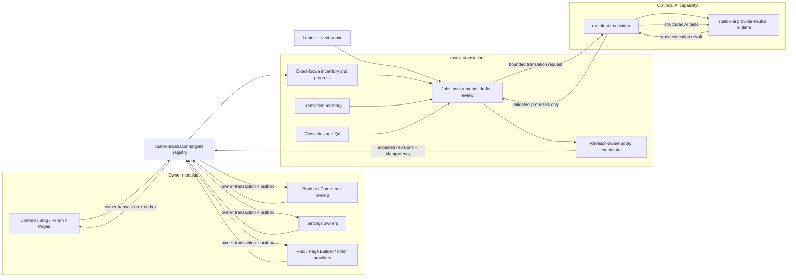

# Translation Module Implementation Plan

## Outcome

RusToK will have one optional, admin-only `translation` module that acts as the
tenant translation control plane for owner-managed localized data. It will
provide:

- an inventory of translatable resources published by enabled owner modules;
- exact-locale coverage, freshness, workflow, and quality progress;
- manual translation, assignment, review, approval, and conflict resolution;
- tenant-scoped translation memory and terminology glossaries;
- bounded import/export and bulk-job workflows;
- a provider-neutral machine-translation adapter integrated with `rustok-ai`;
- owner-safe application of approved translations without direct access to an
  owner's tables.

The target names are:

- module slug: `translation`;
- module crate: `rustok-translation`;
- neutral owner-provider registry: `rustok-translation-targets`;
- AI support adapter: `rustok-ai-translation`;
- AI task slug: `machine_translation`.

`translation` is deliberately different from platform i18n. The existing i18n
contract continues to own locale negotiation, normalization, fallback, and UI
message resolution. The new module owns authoring workflow and translation
operations, not request-locale selection.

## Planning status

This is the active cross-cutting implementation plan. As of 2026-08-13:

- the dependency boundary for machine translation now exists:
  `rustok-translation` owns `MachineTranslationPort`, `rustok-ai` owns
  `AiStructuredTaskPort`, and the stateless `rustok-ai-translation` crate is
  the only crate importing both. It owns `machine_translation`, typed
  schemas/policy, bounded mapping, placeholder/unit/length validation, and
  review-required evidence plus an exact owner/policy/schema task descriptor.
  It is deliberately not runtime-registered. `rustok-ai` now has the
  content-free execution/attempt schema, idempotent ledger, task catalog,
  leases, cancellation receipts, conservative tenant budget reservations,
  settlement, immutable provider price/concurrency policies, durable provider
  slots, per-attempt price snapshots, and actual token/cost evidence; ordered
  atomic terminal settlement and accounting-aware expired-lease recovery are
  implemented; the private runtime now covers ordered inference/fallback and
  cancellation/deadline observation. Concurrent submissions with the same
  owner/idempotency key coalesce onto one running provider execution, and a
  terminal same-key replay returns the stored result without another billable
  call. Authenticated AES-256-GCM transient-result
  storage now commits with successful attempt/accounting evidence, supports
  tenant-scoped retained-key replay, and expires without re-billing.
  Tenant accounting-policy provisioning, deployment keyring publication, and
  scheduler-owned recovery/result cleanup now exist. The optional distribution
  bridge publishes the Translation-owned lazy runtime factory without server
  capability imports; production-profile enablement and live failure/restart
  evidence remain open;
- the optional `translation` slug and `rustok-translation` crate now exist with
  module metadata, RBAC resources, a module-owned migration source, and the first
  rebuildable inventory/checkpoint service. Inventory synchronization rejects
  provider identity leakage, missing and non-advancing cursors, validates
  bounded requests, batches existing-row lookup, and has integration evidence
  for tenant isolation, cursor replay, invalid bounds, and provider outage
  without partial persistence. Bounded full-rescan drains the owner cursor and
  replaces provider inventory only under an unchanged checkpoint. File-backed
  Translation-side evidence verifies independent database pools converge on
  one checkpoint advance plus one typed conflict, and separate processes
  recover from provider outage through cursor sync and atomic full-rescan.
  Isolated live Media deployment evidence remains provider-owned;
- tenant-scoped jobs, immutable owner-provider item snapshots, proposal and
  approval persistence, and owner-application receipt persistence now exist.
  Job creation and item admission are idempotent and request-hash bound; item
  admission advances the job with revision CAS. Owner-validated proposal save,
  review submission, and approval transitions persist QA evidence, bind each
  operation to its idempotency key and request hash, advance item state with
  revision CAS, and prevent the proposal creator from approving it. Owner apply
  now persists the exact approved patch before invocation, binds replay to the
  original actor and request, retains retryable unknown outcomes for same-key
  reconciliation, records terminal owner conflicts, validates stable receipts,
  and commits `applied` plus the receipt under item revision CAS. Apply attempts
  use expiring owner-execution leases. A separately idempotent, actor-bound
  recovery command requires Translation Manage and Publish, persists its actor,
  reason, and observed attempt before owner invocation, rejects an unexpired
  lease, and reconciles through the original owner mutation key. Assignment
  and unassignment are actor-bound, idempotent, expected-revision commands with
  append-only audit and assignee enforcement for draft/submit. Job cancellation
  preserves applied/excluded items, cancels remaining mutable items under CAS,
  stores a mandatory private reason, and rejects unresolved owner apply
  outcomes. Sealed content-free workflow events are transactional with job,
  assignment, proposal, apply, and recovery state. Non-empty jobs now complete
  automatically only when all items are applied, excluded, or cancelled.
  Blocked items have an actor-bound audited retry to their current approved
  proposal, while conflict/stale work remains rebase-required. A content-free
  per-job workflow progress projection is updated transactionally and can be
  deterministically rebuilt with source/proposal digest and receipt checks.
  Provider-level exact-locale coverage is now read through the neutral owner
  SPI, validated by Translation, and paired with tenant/provider inventory
  checkpoints as `current`, `behind`, or `unknown`; numeric lag is deliberately
  absent because owner cursors are opaque. Translation now owns a revisioned
  required-target-locale subset validated through the Tenant locale-policy
  port, and required-target progress aggregates checked exact-locale totals
  with worst-target freshness. A stale policy remains readable with CAS and
  disabled-locale evidence, while progress fails closed until revalidation.
  The module now publishes manifest-composed GraphQL queries and mutations for
  target discovery, policy, job/provider progress, inventory
  synchronization/rebuild, and every implemented workflow command. Its
  capability-owned runtime factory consumes only neutral typed host values.
  `rustok-translation-admin` adds one typed 49-operation transport contract,
  SSR/hydrate native `#[server]` execution over `HostRuntimeContext`,
  CSR/headless execution through `rustok-graphql`, and the module-owned Leptos
  workbench. The matching `@rustok/translation-admin` package renders the Next
  workbench through the host GraphQL executor. The GraphQL documents are
  validated against the module-owned schema, idempotency-bound commands retain
  caller keys, and both adapters use the same redacted Translation public-error
  classifier. The contract includes six glossary operations, six Translation
  Memory list/read/lookup/retention/tombstone/purge operations, bounded
  interchange export/import, and non-billable machine estimation plus machine
  proposal generation/status/cancellation/recovery. Both workbenches also
  expose the same revision-guarded item assignment/unassignment, bounded
  reviewer queue and workload reads, blocked-item retry, job cancellation, and
  owner-apply recovery commands. Private workflow-note list/create/resolve is
  also implemented as Translation-owned collaboration: notes bind to a job and
  optional item, use actor-bound idempotency and resolution CAS, and their
  bodies never enter memory, machine requests, owner application, or events.
  Translation-owned interchange artifacts now complement the bounded direct
  export/import path: their documents are stored only at private tenant-scoped
  object keys, while `translation_exchange_jobs` retains authorization,
  idempotency, an exclusive short-lived import-processing lease, checksum,
  size, expiry, deletion, and aggregate conflict-report evidence. Reads verify
  the object size and SHA-256 checksum; a missing storage runtime fails closed.
  Artifacts are bounded to 8 MiB and a 5-minute to 7-day lifetime. A
  Translation-owned runtime worker deletes their private object on expiry even
  without a later tenant request, and artifacts expose no blob URL or document
  content through events. An import starts only when its remaining artifact
  lifetime can cover the bounded lease; concurrent retries fail retryably
  instead of racing. The
  module-level GraphQL fixture supplies storage explicitly; the server still
  must attach initialized `StorageRuntime` to a Translation-only GraphQL host
  rather than gate it on `mod-media`;
  Live browser, accessibility, module-disablement, and authenticated transport
  evidence remain open;
- deterministic QA now runs on proposal save, review submission, and approval.
  Typed platform/owner warnings and errors cover active lifecycle, required and
  excluded fields, empty values, character limits, explicit protected-token
  multiplicity, whitespace shape, and unchanged-value warnings. Blocking QA is
  persisted and cannot enter review or approval;
- Translation Memory atomically ingests only user-reviewed public or
  tenant-private values after successful owner apply. Tenant-scoped exact and
  contextual-fuzzy lookup is bounded, Unicode-normalized, deterministically
  ranked, and evidence-bearing. Owner-lifecycle, retain-until, and legal-hold
  policies plus revision-guarded tombstone and purge have actor-bound durable
  idempotency receipts. Tombstones immediately leave lookup, while purge
  removes content and preserves content-free receipt evidence. Owner-deletion
  propagation and automated retention enforcement are implemented. File-backed
  evidence proves concurrent independent worker pools converge on one
  transition/receipt and separate processes reclaim post-claim work through
  tombstone and purge restarts. Production-database multi-replica evidence
  remains separate. Machine
  operations pin normalized memory entry identities, order, and match scores
  until completion or cancellation; replay can read tombstoned pins, and purge
  is blocked while a pin exists;
- `rustok-translation-targets` now defines the neutral provider/resource/field,
  exact-locale, revision, validation, apply, progress, change-cursor, and
  interchange contracts;
- Media, Taxonomy, Blog category, Navigation menu, and Pages metadata are registered owner
  providers. Media's exact-locale CAS apply, stable receipt, append-only tenant cursor, and content-free owner
  event are transactional; every other Media translation write emits the same
  repair evidence. Its aggregate progress counts only exact target-row values
  for source-eligible active assets inside a stable cursor window. Translated-
  asset deletion and failure emit deleted/unavailable cursor evidence, so
  lifecycle changes cannot leave projection freshness falsely current.
  Taxonomy's `taxonomy/term` provider exposes exact `name`, review-only `slug`,
  and optional `description`, applies target-locale resource/source/target CAS,
  uses the shared owner receipt ledger, and records an append-only owner change
  cursor. Taxonomy does not claim a global owner-event contract. Blog's
  `blog/category` provider exposes public `name`, review-only `slug`, and
  optional `description`; it applies exact target-locale resource/source/target
  CAS through `CategoryService`, uses the same durable owner receipt ledger,
  records an append-only Blog change cursor, and publishes the existing Blog
  Search reindex request transactionally. Navigation's `navigation/menu`
  provider applies an exact locale aggregate containing the menu name and every
  item title through `MenuService`, with resource/source/target CAS, the shared
  receipt ledger, and a content-free owner cursor; it does not claim a generic
  menu event. Pages' `pages/page_metadata` provider exposes exact `title`,
  review-only `slug`, optional `meta_title`, and optional `meta_description`.
  It applies through `PageService` with page resource/source/target CAS, the
  shared receipt ledger, a content-free owner cursor, and the existing
  `NodeUpdated` owner event. Fly/GrapesJS bodies remain outside this pilot.
  Taxonomy-owned tags and Blog posts remain outside this pilot;
- module-owned Leptos and Next admin workbenches now expose six parity tabs for
  policy, target, inventory, progress, reviewed workflow, versioned
  glossaries, and Translation Memory. Both use URL-owned `glossary_id` and
  `memory_entry_id` selection without implicit first-item selection. Their
  Workflow tab exposes the same machine estimate, generation, status,
  cancellation, and recovery controls plus assignment/unassignment, blocked
  item retry, job cancellation, and owner-apply recovery;
- the proposed ownership decision is recorded in
  `DECISIONS/2026-07-26-translation-control-plane-boundary.md`;
- the current multilingual storage and runtime locale foundations are
  substantial. Baseline verifier repair, runtime/storage locale typing, tenant
  locale-policy ownership, the readiness registry, and the neutral target SPI
  are implemented in `main`. Owner write paths, remaining ownership drift,
  settings, provider onboarding, production AI enablement, and live recovery
  evidence still require work before broad implementation.

The live module plan and FFA/FBA readiness row are now maintained with the
scaffold in `crates/rustok-translation/docs/implementation-plan.md`.

## Decisions fixed by this plan

1. **Owner modules keep canonical localized data.** Product, Pages, Blog,
   Forum, Taxonomy, Flex, settings owners, and every other domain continue to
   own their base, translation, and body rows.
2. **The translation module is a control plane.** It owns jobs, proposals,
   review state, progress projections, memory, glossaries, and application
   receipts. It never becomes a shared business-content table.
3. **Integration is provider-driven.** Owner modules register typed translation
   target providers through `ModuleRuntimeExtensions`. `rustok-translation`
   contains no hard-coded list of Product, Pages, Blog, Commerce, or other
   owners.
4. **Exact-locale state is authoritative for authoring progress.** Runtime
   fallback may render a storefront response, but it never counts as an
   existing translation in the workbench.
5. **All writes are owner writes.** Applying a proposal calls an owner service
   through a revision-aware, idempotent port. There is no cross-module SQL,
   cross-module foreign key, or generic write to `*_translations`.
6. **Manual workflow works without AI.** Missing AI runtime is an explicit
   `ai_unavailable` capability state; inventory, manual translation, memory,
   glossary, review, and owner apply remain operational.
7. **AI creates proposals, not published owner data.** Initial
   machine-translation results always require deterministic validation and
   human review before owner application.
8. **Settings are translated only when their owner declares a localized
   value.** Arbitrary JSON strings, URLs, identifiers, templates, secrets, and
   provider configuration are never inferred to be translatable.
9. **Structured content remains structured.** Richtext, Page Builder/Fly,
   templates, and dynamic Flex values are segmented and reassembled by their
   owner-aware adapter. They are never flattened into arbitrary text and
   written back as untrusted JSON or HTML.
10. **Static UI/system catalogs are a separate delivery plane.** Leptos/Next
    message bundles, manifest labels, and the planned Fluent system catalog may
    later publish catalog adapters, but the first tenant runtime module does not
    hot-edit compiled application assets.
11. **No internal compatibility layer is planned.** Owner surfaces move to the
    target provider contract atomically and delete any superseded translation
    adapter or generic write path.

## Translation planes

Four related planes must remain distinct:

| Plane | Owner | Source of truth | Relationship to `translation` |
| --- | --- | --- | --- |
| Effective locale and fallback | tenant/runtime i18n contract | `tenant_locales`, request context, `rustok-api` locale primitives | Input policy only; never reimplemented |
| Localized business data | each domain/settings owner | owner `*_translations`, `*_bodies`, or typed localized-value storage | Discovered and updated only through owner providers |
| Translation workflow | `rustok-translation` | jobs, proposals, review, memory, glossary, receipts, derived progress | Core responsibility |
| Static UI/system messages | host/module catalogs and future Fluent owner | source-controlled or signed build artifacts | Separate adapter track; not tenant DB fallback |

## Verified current foundation and gaps

### Foundations that can be reused

- `rustok-api::locale` owns the shared BCP47-like normalizer and locale
  candidate helpers. It is a useful base, but it does not yet distinguish
  runtime locales from storage-provenance locales.
- Server middleware resolves effective locale against `tenant_locales`.
- The accepted storage target is language-neutral base rows plus parallel
  `*_translations` and optional `*_bodies`, with normalized `VARCHAR(32)`
  locale columns.
- The multilingual database registry already guards Pages, Forum, Groups,
  Product, Content, Blog, Taxonomy, Comments, Profiles, Commerce, Flex,
  Marketplace Seller, OAuth applications, Registry copy, and several commerce
  display-data cutovers.
- Product, Blog, Content, and Pages already demonstrate versions,
  `updated_at`-based revisions, or idempotency in parts of their write paths.
- `ModuleRuntimeExtensions` and the `rustok-seo-targets` registry demonstrate
  owner-contributed capability registration without a host-maintained provider
  list.
- `rustok-ai` already owns provider/deployment configuration, secret and egress
  policy, routing decisions, run traces, approvals, model assignment, and
  durable workflow primitives. Its current execution path is not yet a
  production-ready cross-module structured-inference port and does not yet
  provide the durable usage/cost/quota and retry semantics required by bulk
  translation.
- `rustok-ui-i18n` already keeps UI message resolution separate from locale
  selection.
- Fly already has project-local translation, locale-policy, and coverage
  primitives that a Page Builder provider can adapt rather than duplicate.
- Flex already declares `is_localized` field semantics and stores localized
  values outside language-neutral payloads.

### Gaps that prevent an honest “all modules” claim

| Area | Current gap | Required preparation |
| --- | --- | --- |
| Resource discovery | There is no owner-neutral translation target registry | Define provider descriptors, capabilities, cursoring, and runtime registration |
| Exact locale vs fallback | Runtime reads commonly return a resolved/fallback view | Every provider must expose exact-locale availability separately from rendered fallback |
| Locale type boundary | The shared normalizer accepts `und`, although `und` is forbidden as an effective tenant locale | Introduce distinct runtime/tenant and stored-provenance locale types over one canonical normalizer |
| Tenant locale ownership | Middleware and consumers read `tenant_locales` directly; `rustok-tenant` has no complete policy port | Give `rustok-tenant` read/write ownership and enforce default, enabled, fallback, and cycle invariants |
| Source language | Many resources do not identify an authoritative source locale | Provider must return an exact selected source locale; `und` cannot be a source for AI or memory |
| Revision safety | Owner modules use mixed version, timestamp, or no-CAS writes | Normalize provider-visible opaque revisions and require expected source/target revisions |
| Idempotency | Not every localized owner write is idempotent | Require idempotency keys and replay receipts before onboarding |
| Owner events | Translation changes do not share a generic invalidation contract | Add owner adapters that publish typed target-change facts transactionally |
| Baseline verification | Current i18n/DB verifiers contain stale paths and owner markers and are not all green | Repair the existing contract and documentation before adding translation-specific verification |
| Owner identity | Pages/Navigation, Content/SEO, Product/Commerce Foundation, and Blog/Taxonomy contain ownership drift or duplicate schema evidence | Assign exactly one owner and remove superseded schema/entity paths before target registration |
| Settings | Host/platform and tenant-module settings are unversioned JSON without localized-leaf semantics | Assign owners, add typed localization metadata, parallel localized storage, revisions, and events |
| Richtext | Blog, Forum, and Comments use canonical owner profiles, while UI parity and obsolete shared-helper/migration cleanup remain open | Translate only validated canonical document segments; do not wait for editor-host parity or reintroduce a format/version branch |
| Page Builder | Fly translation state is project-local and not a platform target provider | Add a Page Builder owner adapter with lossless segment identity and revision checks |
| Flex exact-locale behavior | Some attached and standalone paths seed or read through fallback/default locale | Add exact read/apply operations and finish the parallel localized-record cutover before onboarding |
| Static catalogs | `rustok-core` match tables and compiled UI bundles are separate systems | Finish the Fluent/catalog ownership track before claiming all platform copy is editable |
| AI task contract | `AiStructuredTaskPort` defines bounded non-billable estimate plus execute/health/status/cancel and typed attempt/usage/cost evidence. The estimate uses the same tenant routing, attempt bounds, and immutable provider price policies as reservation without registering execution, reserving budget, or calling a provider. A private canonical implementation binds the exact task descriptor to tenant routing, durable accounting, ordered structured inference/fallback, cancellation, deadlines, and encrypted TTL-bound result replay. Tenant accounting policies have permission-checked GraphQL/native provisioning, the keyring remains deployment-owned, the AI scheduler performs recovery and expiry cleanup before claims, and the optional distribution bridge publishes a Translation-owned lazy runtime factory. | Enable the bridge in the production profile and collect live failure/restart evidence without routing machine translation through chat sessions |
| AI task ownership | Completed at contract level: the hard-coded `"translation"` free-locale alias is removed and `rustok-ai-translation` owns `machine_translation` | Register only after the structured runtime activation gate passes |
| AI accounting/recovery | Durable token/cost/quota, request idempotency, typed retryability, ordered fallback, cancellation, recovery, atomic encrypted result handoff, permission-checked tenant policy provisioning, deployment-owned keyring publication, and scheduler recovery/expiry cleanup now exist | Verify multi-replica maintenance and accounting behavior in the live machine-translation composition |
| Multilingual storage gaps | Alloy, RBAC, Channel, Workflow, MCP, AI control-plane copy, and Order prose remain open | Close or explicitly exclude each owner gap before its provider is marked ready |
| Progress denominator | Enabled tenant locales do not express translation-required policy | Let `rustok-translation` own a required-target-locale subset validated against enabled tenant locales |
| Security | A central translator could otherwise bypass domain permissions | Require translation permission and the provider-declared owner permission floor |

The canonical gap inventory remains
`docs/architecture/database-multilingual-audit.md` and
`docs/architecture/database-multilingual-contract.json`. The translation
implementation adds a second machine-readable registry for translatable
surfaces; it does not replace the storage audit.

### Current P0 cleanup ledger

The following repository facts were confirmed during the 2026-07-26 planning
audit. They are explicit preparation work, not implementation details to defer
until after the module exists.

| P0 item | Current evidence | Exit condition |
| --- | --- | --- |
| Restore the i18n baseline | Completed in `main`: stale host, Pages/Profiles/Index markers were repaired and the existing i18n/Flex/DB contracts are aligned | Keep all existing multilingual verifiers green on the final revision |
| Split locale meanings | Completed: one normalizer now backs `RuntimeLocale`/`TenantLocale` (no `und`) and `StoredLocale` (explicit `und` provenance), with canonicalization and serde tests | Migrate remaining package-local locale DTOs to the canonical types |
| Establish tenant locale ownership | Completed: `rustok-tenant` owns revisioned policy read/replace, CAS, durable idempotency receipts, canonical/default/fallback/cycle invariants, and server middleware consumes the port | Add the admin transport over the same owner service without restoring direct SQL |
| Remove locale DTO drift | Media now converts translation writes to canonical `TenantLocale`; Content, Product, Shipping, and other candidate owners still apply different length/case rules | Every translatable owner accepts the canonical locale type instead of package-local five- or ten-character validators or whole-tag lowercasing |
| Resolve owner/schema drift | Product translation entities are duplicated in `rustok-product` and `rustok-commerce-foundation`; Pages/Navigation, Content/SEO, and Blog/Taxonomy also have stale ownership evidence | Registry/docs/migrations/entities identify one physical and semantic owner per target kind; superseded internal paths are deleted atomically |
| Make owner writes safe | Media, Taxonomy, Blog category, Navigation menu, and Pages metadata now have registered exact-locale providers. All use owner CAS, durable receipt replay, and append-only owner change cursors; Media also emits its neutral owner event, Blog emits its existing Search reindex request, Navigation applies its full menu locale aggregate without inventing a generic event, and Pages applies localized metadata through its existing `NodeUpdated` owner event. Product, Shipping, and other candidates still have full-set or unguarded writes | Each remaining onboarded owner provides atomic one-locale/field apply with source and target revisions, idempotency conflict detection, owner validation, durable owner change evidence, and bounded repair |
| Correct Flex exact semantics | Attached and standalone authoring reject invalid locales and prepare from an exact target-locale row; presentation fallback remains isolated to explicit read resolution | Add provider-facing exact source/target APIs, owner-local revision-safe apply, and field-policy exposure limited to schema-declared `is_localized` leaves |
| Type localized settings | [`ModuleSettingSpec`](../../crates/rustok-modules/src/settings.rs) and host settings writes have no localized-leaf, sensitivity, or revision contract | A named owner exposes stable field IDs, `localized` and field-policy metadata, parallel localized rows, CAS, events, and secret-safe validation |
| Finish semantic string classification | Product image alt text has base/translation drift; Search linguistic dictionaries, channel policy names, and transactional tax/order prose need explicit classification | Every candidate is classified as identifier, technical, secret, code-owned message, tenant-localized copy, immutable snapshot, search-linguistic data, or excluded with owner/reason |
| Prepare structured AI execution | The cross-module port and content-free execution/attempt/accounting schema now exist. Registration is request-hash idempotent; execution leases, cancellation receipts, tenant budget reservation/concurrency, immutable provider price/concurrency policy, exact task descriptors, durable provider slots, actual per-attempt token/cost evidence, atomic queued/terminal settlement, and accounting-aware expired-lease recovery are implemented. A dedicated AES-256-GCM transient-result table keeps content out of the generic ledger; successful attempt, encrypted handoff, slot release, budget settlement, and terminal execution commit together. Tenant-scoped replay authenticates identity/digests/size, supports retained-key rotation, records replay counts, and expires without reopening or re-billing execution. Tenant operators can provision accounting policies through GraphQL/native contracts, the result keyring is deployment-owned, and the existing AI scheduler reconciles cancellations/leases and removes expired handoffs before claims. The private executor validates exact policy/schema identity, selects preferred then deterministic eligible providers, performs real structured inference/fallback, records typed content-free failures, enforces deadlines, and observes durable cancellation. The optional distribution bridge publishes the owner-neutral lazy runtime factory, and the separate chat task service is not used. | Enable the bridge in the production profile and collect live accounting, restart, fallback, cancellation, and expiry evidence |

The baseline repair should update
[`verify-i18n-contract.mjs`](../../scripts/verify/verify-i18n-contract.mjs),
[`database-multilingual-contract.json`](../architecture/database-multilingual-contract.json),
and the related architecture documents together. Translation-specific
verification is added only after this baseline is green.

### Owner onboarding map

This map defines the initial disposition, not automatic eligibility. The
machine-readable surface registry introduced in Phase 0 is authoritative and
must carry the owner, target kind, field policy, sensitivity, readiness state,
and exclusion reason.

| Owner/surface | Candidate localized data | Onboarding rule |
| --- | --- | --- |
| Content | node title/slug/excerpt and body | Register only live Content-owned target kinds; long body follows the canonical richtext profile |
| Blog | post title/excerpt/body/SEO and category copy | Registered `blog/category` pilot supplies exact `name`, review-only `slug`, optional `description`, resource/source/target CAS, durable receipt replay, and an append-only owner cursor with transactional Search reindex. Posts join the editorial wave; Taxonomy-owned tags are not duplicated; production enablement requires PostgreSQL concurrency and cursor-recovery evidence |
| Pages | title/slug/meta copy and localized body | Registered `pages/page_metadata` pilot supplies exact title, review-only slug, optional meta copy, resource/source/target CAS, durable receipt replay, existing Pages owner events, and a content-free cursor. Visual documents still require a lossless owner segment extractor/materializer and body-revision CAS; production enablement requires PostgreSQL concurrency and cursor-recovery evidence |
| Navigation | menu name and item title | Registered `navigation/menu` pilot applies the full menu locale aggregate through Navigation-owned CAS, shared durable receipt replay, and content-free cursor evidence; production enablement still requires PostgreSQL concurrent-aggregate and cursor-recovery evidence |
| Forum | category, topic, and reply copy | Category may onboard early; topic/reply are UGC and require opt-in, moderation, revisions, and no author-content overwrite |
| Product/catalog | product/variant/options, attributes, category/schema labels, SEO, image alt, localized Flex values | Dedicated catalog wave after per-locale CAS, owner extraction cleanup, SEO precedence, and removal of base/translation image-alt drift |
| Taxonomy | term name/slug/description | Registered `taxonomy/term` pilot with exact-locale snapshots, resource/source/target CAS, shared durable receipts, and an append-only owner cursor. Aliases remain curated search/SEO semantics rather than automatic MT by default; production enablement needs PostgreSQL concurrency and cursor-recovery evidence |
| Media | title/alt/caption | Provider registered for bounded exact discovery/read/validate/apply and tenant-scoped cursor repair with resource/source/target revisions, atomic receipt, and neutral owner event. Direct owner edits publish identical repair evidence; production enablement now waits on projection replay and multi-replica checkpoint recovery evidence |
| SEO | title/description/keywords/Open Graph copy | Decide precedence between owner-embedded SEO and explicit SEO override before registration; media identifiers are preserved |
| Flex | schema copy and attached/standalone localized values | Expose only schema-declared localized leaves through exact operations; never expose arbitrary payload JSON |
| Profiles/Comments/Groups | display copy, bios, comments, group title/summary/body | Treat personal/UGC fields as opt-in and policy-sensitive; preserve names by default and never rewrite immutable revisions |
| Shipping/Region/Inventory/Fulfillment/Pricing | presentation names and descriptions | Commerce-support wave after each owner has transactional per-locale apply; identifiers and calculations are preserved |
| Cart/Order/Payment/Ledger | locale-attributed transaction snapshots | Never retroactively mutate transaction facts; use an optional derived presentation projection if a business case is approved |
| Marketplace/Tenant | seller presentation and storefront display name | Separate legal identity from translatable presentation; retain source attribution on compliance/event prose |
| Settings | explicitly declared tenant business copy | Onboard only typed localized leaves after the settings ownership cutover; config, secrets, URLs, enums, IDs, and template keys are excluded |
| Alloy/RBAC/Channel/Workflow/MCP/AI control planes | inline display copy after neutral-key cutover | Blocked until each owner has stable neutral keys and parallel localized storage |
| Search dictionaries | synonyms, stop words, and query rules | Owned by `rustok-search`, not translation memory/glossary; manage with explicit locale semantics |
| Static UI/system catalogs | module/host message bundles and future Fluent catalogs | Separate signed/versioned artifact track; not hot-edited tenant business data |

## Target architecture

### Component shape

| Component | Owns | Must not own |
| --- | --- | --- |
| `rustok-translation-targets` | Provider trait, typed resource/field/value descriptors, registry, capability metadata, registration helper, conformance fixtures | Workflow persistence, UI, AI provider selection, owner business rules |
| `rustok-translation` | `MachineTranslationPort`, translation policy, jobs, proposals, assignments, QA orchestration, memory, glossary, progress projection, receipts, GraphQL/REST roots, worker registration | Owner localized rows, locale negotiation, AI credentials/models |
| Owner provider adapter | Exact resource enumeration, semantic segmentation, owner validation, revisions, permissions, apply transaction, owner events | Translation jobs, cross-owner dashboards, AI routing |
| `rustok-ai-translation` | Bridge from `MachineTranslationPort` to `AiStructuredTaskPort`, `machine_translation` descriptor, typed input/output schema, prompt policy, deterministic output validation, AI-specific evidence | Tables, migrations, UI, queue, model credentials/routing, translation workflow state, owner persistence |
| `rustok-ai` | `AiStructuredTaskPort`, provider/model routing, secrets, egress, quota/cost, execution, retries/fallback, run traces, AI approvals | Translation target discovery, glossary ownership, owner writes |
| `rustok-translation-admin` | Leptos FFA `core/transport/ui` workbench | Locale negotiation, business writes, raw adapter selection |
| Next translation package | Headless admin surface over the same GraphQL/REST contract | A second workflow or progress policy |
| `apps/server` and admin hosts | Runtime composition, mounting, host context, shell/navigation | Translation services, provider mappings, module-specific DTOs |

The provider registry follows the owner-contributed runtime-extension pattern.
`rustok-api` continues to own generic `PortContext`, `PortError`, locale, and
permission primitives. Translation-specific resource semantics remain in the
single support contract instead of being duplicated in every owner.

### Module classification

The target path module is:

- `Optional`, not `Core`;
- `admin_only`, with no storefront package;
- safe to disable without changing existing localized reads or storefront
  fallback behavior;
- not dependent on every translatable owner in `modules.toml`;
- manually functional when the globally composed AI capability is absent;
- provider-discoverable for enabled owner modules only.

The module must publish owner-owned GraphQL and module-owned operational REST
surfaces. Its Leptos admin uses native `#[server]` functions by default in
SSR/hydrate and retains GraphQL in parallel for Next, mobile/headless, and CSR.

## Canonical translation target contract

### Stable resource identity

Every target has a typed identity containing:

- tenant scope from `PortContext`, included in persisted uniqueness and never
  trusted from an arbitrary payload;
- `owner_slug`;
- `resource_kind`;
- stable owner `resource_id`;
- optional stable subresource identity where the owner genuinely has one;
- an opaque current resource revision;
- lifecycle state such as active, archived, deleted, or unavailable.

Display labels, slugs, translated titles, and list positions are not identity.
An array index is not a stable field identity unless the owner proves the array
is immutable and index-addressed by contract.

### Provider capabilities

A provider declares only capabilities it implements:

- list resource summaries with bounded cursor pagination;
- read exact source and target locale state;
- return aggregate progress facts or a change cursor;
- validate a proposed patch without writing;
- apply one resource patch atomically;
- emit or expose target-change cursors for projection repair;
- optionally export/import an owner-aware interchange representation.

Missing capabilities are explicit. The translation module must not substitute
direct database queries or host-specific resolvers.

### Resource read shape

An owner resource read returns:

- exact available locales and separately computed runtime fallback information;
- explicit source locale selected for the job;
- resource and per-target-locale revisions;
- typed fields with stable field keys;
- field semantic, value kind, constraints, required/optional status, and
  translation strategy;
- source-field hashes for fine-grained freshness;
- provider-declared read and apply permission floors;
- data classification and AI-export eligibility;
- optional bounded context fields that improve translation without exposing
  secrets or unrelated records.

The provider never returns `und` as a usable locale. Unknown-provenance rows are
shown as a remediation blocker until an operator assigns a real locale through
the owner.

### Apply contract

An apply request contains:

- tenant and authenticated actor from `PortContext`;
- resource and target locale;
- expected resource, source-field, and target-locale revisions;
- typed field patches;
- proposal and approval receipt identities;
- an idempotency key and deadline;
- optional source/job correlation and causation identities.

The owner:

1. rechecks tenant, actor, enabled state, and the provider permission floor;
2. verifies expected revisions before any write;
3. validates every typed field and owner invariant;
4. writes base/translation/body state through the normal owner service;
5. writes its normal audit/outbox facts in the same transaction;
6. returns a stable application receipt and new opaque revision.

A stale source or target returns a conflict. It never overwrites, silently
rebases, or retries through a different transport.

### Field value profiles

| Value profile | Translation behavior |
| --- | --- |
| `plain_text` | Translate as bounded Unicode text; preserve whitespace policy and owner limits |
| `seo_text` | Plain text plus owner length/keyword constraints; no autonomous SEO template rendering |
| `template_text` | Translate only literal segments; preserve typed placeholders exactly |
| `richtext` | Translate owner-extracted text nodes; preserve the canonical document tree and owner profile |
| `page_builder_text` | Translate Fly/Page Builder-owned localized properties using stable component/property identities |
| `localized_scalar` | Translate an explicitly localized Flex or schema value with its declared value semantics |
| `slug` | Never translate as prose; owner may expose transliteration/regeneration as a separate reviewed strategy with collision checks |
| `identifier`, `url`, `email`, `secret`, `code`, `enum_key` | Excluded |
| immutable transaction snapshot | Excluded from retroactive translation; retain original locale attribution |

Raw HTML is never a supported translation value. A module that still stores
unclassified HTML or Markdown must complete its owner cutover before onboarding
that field.

## Translation workflow

### State model

The canonical item states are:

- `missing`;
- `draft`;
- `in_review`;
- `approved`;
- `applying`;
- `applied`;
- `stale`;
- `conflict`;
- `blocked`;
- `excluded`;
- `cancelled`.

AI origin, translation-memory origin, manual origin, and import origin are
provenance, not separate workflow states.

Allowed transitions are service-owned and compare-and-set guarded. Terminal
application is recorded only after the owner returns its committed receipt.
A failed or timed-out response with an unknown owner outcome is reconciled by
idempotency key before retry.

### Manual flow

1. Inventory discovers an exact source and missing/stale target.
2. An operator creates or extends a bounded translation job.
3. The job snapshots source values, hashes, constraints, glossary revision, and
   owner revisions.
4. A translator edits or accepts memory/AI suggestions into a draft.
5. Deterministic QA runs on every save and before review.
6. A reviewer resolves warnings and approves current revisions.
7. An authorized applier invokes the owner provider.
8. The owner commits the translation and its normal events.
9. The translation module stores the receipt and verifies the new exact locale.
10. Search, Index, SEO, cache, email, and other projections react through the
    owner's existing event path, not a translation-owned substitute.

### Conflict behavior

- A changed source field marks only affected units stale when stable field
  hashes permit it.
- A changed target locale creates a target conflict even if the source is
  unchanged.
- Deleted/archived resources stop new work and cancel or block unapplied items
  according to owner policy.
- Rebase is an explicit operator or AI action that creates a new proposal
  revision. Approval of the old proposal is not carried forward.
- External owner edits count as exact translations but do not automatically
  become approved memory entries.

## Progress contract

Progress must never collapse correctness into one misleading percentage.

For each tenant, owner, resource kind, locale, job, and optional assignment,
publish:

- required exact units / total required units;
- optional exact units / total optional units;
- current applied units;
- approved but unapplied units;
- stale and conflict counts;
- blocked/excluded counts with reason taxonomy;
- resources complete / total resources;
- source words or characters and translated words or characters as a separate
  workload measure;
- last owner change cursor and projection lag.

Rules:

- a runtime fallback value does not increment exact coverage;
- an `und` row does not increment coverage;
- a draft or AI proposal does not increment applied coverage;
- optional fields do not reduce required-field completeness;
- word-weighted progress is displayed alongside, never instead of, unit and
  resource completeness;
- the denominator uses the translation module's required-target-locale policy,
  validated as a subset of enabled tenant locales;
- archived, immutable, secret, and owner-excluded fields are visible as
  classified exclusions rather than silently disappearing.

The progress projection is rebuildable from owner providers plus
translation-owned workflow state. Before apply, the service always revalidates
live owner revisions rather than trusting the projection.

## Translation-owned persistence

The physical schema is finalized in the module-local design, but the minimum
logical ownership is:

| Data set | Role |
| --- | --- |
| `translation_policies` | Required target locales, review policy, AI eligibility, retention, provider overrides |
| `translation_jobs` | Bounded batch identity, filters, source/target locale policy, lifecycle, counters |
| `translation_job_items` | Resource/field identity, source snapshot/hash, revisions, status, assignment |
| `translation_proposals` | Versioned manual/import/memory/AI working copy and QA result |
| `translation_machine_operations` | Content-free actor/idempotency-bound AI handoff, request/context digests, provider/execution/usage evidence, diagnostics, and resulting proposal identity |
| `translation_machine_memory_bindings` | Content-free normalized memory-entry pins, unit/order identity, and match score for exact operation replay |
| `translation_machine_cancellations` | Actor-bound, idempotent registered-operation cancellation reason and receipt |
| `translation_item_assignments` | Append-only assign/unassign command, requested actor, request binding, assignee, and resulting item revision |
| `translation_job_cancellations` | Actor-bound cancellation request, private reason, resulting job revision, and cancelled-item count |
| `translation_job_progress` | Rebuildable content-free workflow-state, assignment, unit, resource-completion, and character-workload projection |
| `translation_item_retries` | Actor-bound blocked-item retry request, private reason, request binding, and resulting item revision |
| `translation_apply_operations` | Durable approved patch intent, original actor/request binding, attempts, expiring execution lease, and recoverable or terminal outcome state |
| `translation_apply_recoveries` | Actor-bound recovery command, mandatory reason, observed attempt, and independent idempotency evidence |
| `translation_apply_receipts` | Idempotency binding, approval identity, owner receipt, resulting revision |
| `translation_inventory` | Derived exact-locale/freshness projection; safe to rebuild |
| `translation_memories` | Tenant-scoped memory definitions and policy |
| `translation_memory_entries` | Approved source/target segments, context fingerprint, quality and provenance |
| `translation_glossaries` | Tenant glossary identity, scope, locale policy, revision |
| `translation_glossary_terms` | Concepts, locale variants, preferred/forbidden terms, matching rules |
| `translation_exchange_jobs` | Import/export lifecycle, object reference, validation report, expiry |

Rules:

- every row is tenant-scoped;
- there are no foreign keys to owner-module tables;
- owner identities and revisions are stored as typed external references;
- source snapshots and proposals are workflow records, not storefront-readable
  canonical content;
- large exchange artifacts use the shared object-storage boundary, not
  unbounded database blobs;
- sensitive source/proposal retention is configurable and deletion-aware;
- logs, metrics, traces, and idempotency metadata never contain source or
  translated text;
- PostgreSQL RLS follows the platform's staged high-risk-table policy, with
  explicit tenant predicates required regardless of RLS.

## Translation memory and glossaries

### Translation memory

Translation memory is separate from owner content and separate from Taxonomy.
It stores reusable, approved translation segments under explicit policy.

Minimum behavior:

- tenant isolation by default; no cross-tenant learning or lookup;
- normalized source and target locales;
- exact and context-aware fuzzy matching;
- stable segmentation version and context fingerprint;
- origin, reviewer, owner resource reference, source hash, quality state, and
  retention policy;
- human-approved entries only by default;
- AI proposals enter memory only after human approval and owner apply;
- tombstone/purge behavior for deleted or privacy-sensitive owner content;
- no automatic use of unknown-provenance `und` content;
- deterministic ranking with explainable match evidence.

### Glossaries

A translation glossary is terminology policy, not
`rustok-taxonomy` vocabulary and not a Search typo dictionary.

It supports:

- concept identity with source and target locale variants;
- preferred, allowed, forbidden, and do-not-translate terms;
- case and match policy;
- module/resource/field scope;
- notes and bounded translator context;
- glossary revision snapshots per job;
- conflict detection between active rules;
- deterministic QA and optional AI prompt context.

An AI model's claimed confidence never overrides a glossary violation or owner
validation error.

## AI machine-translation adapter

### Ownership boundary

`rustok-ai-translation` owns the domain adapter for
`machine_translation`. It follows the existing domain AI support-crate pattern:

- typed task descriptor and locale policy;
- versionless current input/output schema updated atomically with all internal
  callers;
- immutable, evidence-bearing prompt/template policy;
- conversion from a translation-owned batch into an AI structured task;
- generated-payload validation;
- provider-neutral handler registration and evidence.

The dependency boundary is deliberately acyclic between the two domain owners:

| Component | Owns | Must not own |
| --- | --- | --- |
| `rustok-translation` | `MachineTranslationPort`, provider binding, batching, jobs, memory/glossary selection, quality policy, review, progress, owner apply | AI provider profiles, credentials, model routing, generic inference ledger |
| `rustok-ai` | `AiStructuredTaskPort`, provider/model routing, credentials, egress, durable attempts/usage/cost, budgets, retry/fallback, traces, cancellation | Translation jobs, glossaries, memory, translation review, owner writes |
| `rustok-ai-translation` | Stateless contract mapping, prompt policy, bounded structured-output validation, evidence mapping | Tables, migrations, UI, queues, canonical content, owner services |

`rustok-ai-translation` depends on both owner crates. `rustok-translation` does
not depend on `rustok-ai`, and `rustok-ai` does not depend on
`rustok-translation`. A dependency guard must ensure this adapter is the only
crate allowed to bridge both capabilities. It registers through a neutral
runtime contribution; it is not wired by another host `match`, direct service
handle, or owner import.

The translation-side port exposes a bounded `translate_batch` operation with a
provider descriptor and health/degraded state. The AI-side high-level
`AiStructuredTaskPort` performs structured task-profile routing and inference.
The public low-level inference engine is not a suitable adapter boundary because
it would force the adapter to resolve secrets, provider configuration, routing,
fallback, and budgets itself.

### Required AI runtime preparation

Before the adapter is connected:

1. Publish `AiStructuredTaskPort` through `ModuleRuntimeExtensions` with bounded
   structured execution, durable execution identity/status, cancellation,
   `PortContext`, deadline, idempotency, and typed unavailable/degraded
   behavior. Billable inference uses a write-like port policy even when it does
   not mutate an owner record.
2. Add a durable execution/attempt/usage ledger with a unique
   `(tenant, owner, idempotency_key)`, request-hash conflict detection, actual
   tokens, immutable price snapshot/cost, budget reserve/commit/release, and
   tenant/provider concurrency limits.
3. Add execution-time ordered provider fallback, deadline budgeting,
   `Retry-After`, and typed rate-limit, timeout, invalid-output, context-limit,
   authentication, policy, and quota errors. Authentication, validation,
   policy, and quota failures do not retry as transient errors.
4. Keep machine translation out of chat-session and agent-stage persistence.
   Do not persist the full translation packet in generic metadata; persist only
   content-safe hashes, identities, classifications, and execution evidence.
5. Remove closed domain-vertical composition from the adapter path. The new
   descriptor and handler register through runtime contributions, without a
   manual import in `apps/server` or a new entry in a core domain `match`.
6. Replace the hard-coded `"translation"` free-locale match with
   descriptor-owned `machine_translation` policy. Do not retain an alias.
7. Make source and target locale explicit policy inputs; a single generic task
   locale is insufficient for machine translation.
8. Keep the translation queue in `rustok-translation`. It may call bounded AI
   executions, but it does not reuse AI agent-stage tables or assume the current
   generic scheduler supplies retry/backoff/DLQ semantics.
9. Classify existing direct Product/Blog/Media AI write paths: creative
   generation remains a separate owner-approved capability, while canonical
   machine translation can apply only through the translation proposal/review
   and owner-provider path.
10. Return quota and cost estimates before a bulk job is accepted, and ensure
   run traces correlate to translation job/item/proposal
   identities without logging content.

The translation module must not instantiate `AiManagementService`, read AI
tables, call its own GraphQL endpoint, import AI provider SDKs, or implement a
fallback to an environment/default provider.

### Input contract

Each bounded request includes:

- exact normalized source and target locale;
- stable unit identities, source hashes, and source revisions;
- typed source segments;
- field semantics and owner constraints;
- placeholder/token ledger;
- selected glossary revision and relevant term subset, bound by its exact
  projection digest only when non-empty;
- bounded translation-memory suggestions with provenance, bound by their exact
  projection digest only when non-empty;
- safe resource context;
- requested tone/domain/style policy;
- data classification and external-egress decision. The complete
  machine-translation packet is at least `tenant_private` because resource
  identity and optional glossary, memory, style, and evidence context are
  tenant-scoped; personal and sensitive source units raise that classification;
- adapter policy digest, prompt/template version, and idempotency fingerprint;
- hard segment, character, nesting, and output limits.

The bridge serializes this task contract as canonical camel-case JSON. The
schema digest changes atomically with that contract; snake-case internal Rust
fields are never an alternate provider wire format.

The request excludes secrets, credentials, unrelated customer data, raw
database records, and arbitrary owner JSON.

### Output contract

The adapter returns:

- one result or typed failure per input unit;
- translated value in the same declared semantic profile;
- preserved placeholder/token evidence;
- glossary and length diagnostics;
- AI execution, provider profile, provider/model, attempt/fallback, and prompt
  provenance;
- input/output/total token usage and cost evidence;
- review-required state;
- no owner mutation instruction.

`TranslationMachineService` is the only owner command that turns this output
into a Translation proposal. It reads the immutable job snapshot, projects the
bound glossary revision and at most five tenant-scoped memory suggestions per
unit, checks provider health/capacity, and calls the neutral port. It then
revalidates the output and calls the canonical proposal workflow with AI
origin; direct proposal-row writes and owner mutations are forbidden. A
content-free `translation_machine_operations` row binds actor, idempotency
key, request/context digests, provider policy, execution/attempt/usage/cost
evidence, diagnostic codes, and proposal identity. Source, memory, and
translated values remain in their existing Translation-owned records rather
than being copied into the operation journal. Registered operations pin
normalized memory-entry identities, order, and match scores. Replay reads the
same entries even after tombstone; purge is blocked while a pin exists, and
completion or actor-bound idempotent cancellation releases the pins
atomically. Cancellation is accepted only while the operation is `registered`;
once canonical proposal save enters `saving`, it fails closed. AI execution
status and cancellation resolve through the stable owner/idempotency identity;
a content-free AI cancellation intent also closes cancellation before
execution registration, while the Translation receipt records propagation
status and retries incomplete propagation on exact replay. An audited
Manage/Update-authorized recovery command handles indefinitely `saving`
operations without starting another billable execution: it binds the actor,
idempotency key, reason, and observed operation revision before retrieval,
reconstructs and revalidates the original request digest, reads the completed
result through the stable provider key, and resumes canonical proposal save.
File-backed separate-process evidence closes the original runtime and resumes
that command in a child process for both durable crash boundaries: provider
completion before proposal persistence, and proposal persistence before
operation completion. It proves one proposal, one recovery receipt, preserved
proposal identity for the latter boundary, atomic memory-pin release, and
provider-free terminal replay.

Missing units, extra units, invalid structured output, changed placeholders,
invalid locale, malformed Unicode, owner-limit violations, or structure drift
fail validation. Partial batches may retain valid proposals, but are never
treated as atomically applied owner data.

### AI safety and quality gates

- Initial rollout is proposal-only and human-review-required.
- AI execution is forbidden for `secret` and unsupported sensitive
  classifications.
- Each tenant structured-provider policy has a non-empty explicit
  classification allowlist. Candidate selection, health, estimate, budget
  reservation, and provider-slot acquisition enforce it; slot acquisition
  rechecks the live policy immediately before external egress. A packet with no
  permitted provider fails closed before execution registration or provider
  invocation. The policy cannot change its allowed classifications or active
  state while an attempt is in flight, and the immutable price snapshot binds
  the allowlist.
- Richtext and Page Builder input is segmented; only text segments are sent and
  the owner reassembles the original structure.
- Templates use protected placeholder tokens and exact round-trip checks.
- Numbers, currencies, URLs, identifiers, markup, and do-not-translate terms
  receive deterministic preservation checks.
- Retry fingerprints include source hash, target locale, glossary revision,
  memory/context digest, adapter policy digest, and model-assignment decision.
- Transient provider errors may retry under the AI runtime policy. Validation,
  policy, quota, and owner conflicts do not retry blindly.
- Same idempotency key and same request hash returns the same execution result;
  the same key with a different request hash is a typed conflict.
- A degraded provider may requeue with bounded backoff, require human
  translation, or mark machine translation unavailable. It never copies the
  source as the target and never auto-publishes.
- Automatic approval or publishing requires a later accepted ADR, tenant
  opt-in, measured locale-pair evidence, and deterministic quality thresholds;
  model self-confidence alone is insufficient.

The existing `product_copy` task remains product copy generation. It is not a
generic translation-memory or machine-translation path and must not duplicate
the `machine_translation` adapter.

## Settings preparation

“Translate settings” must not mean recursively translating every JSON string.

Before a settings provider is implemented:

1. Assign canonical ownership for platform settings and tenant-module settings;
   host `SettingsService` cannot remain the translation write owner.
2. Extend the settings schema with explicit localized-value semantics, value
   profile, constraints, and stable field identity.
3. Keep nonlocalized configuration in the base settings JSON.
4. Store localized setting values in owner-local parallel locale rows, not
   inline locale maps.
5. Add an opaque revision/CAS contract, idempotent apply, transactional event,
   and exact-locale reads.
6. Reject localization metadata on secrets, URLs, provider identifiers,
   executable templates without token policy, and arbitrary `json`/`any`
   values.
7. Require stable keys for localized array items; positional array indices are
   not translation unit identities.

Manifest setting descriptions, option labels, navigation labels, and form copy
belong to the static catalog plane. Tenant setting values belong to the owner
data plane. The two must not share a storage fallback.

## Commerce classification

Commerce onboarding distinguishes master data from immutable transaction facts.

Translate through owner providers:

- Product and variant copy;
- product options, option values, image alt/caption, catalog categories,
  attribute/schema/group labels, and localized text attribute values;
- region, stock-location, shipping-option, shipping-profile, price-list, and
  collection/category display copy where the current owner exposes it;
- marketplace listing and seller presentation copy where policy permits.

Do not retroactively translate:

- order/cart line snapshots created to preserve the purchased presentation;
- payment, refund, ledger, payout, tax, and inventory identifiers;
- audit, provider error, or immutable operational facts;
- customer-entered names, addresses, and notes by default.

Immutable prose records retain truthful source-locale attribution. A separate
operator-facing derived explanation may be generated later, but it is not a
mutation of transaction history.

## Transport and admin UI

### Backend surfaces

The current GraphQL control plane and the `rustok-translation-admin` native
adapter expose policy, progress, inventory, reviewed workflow, versioned
glossary, Translation Memory, bounded direct interchange plus private
object-storage-backed artifact lifecycle, derived reviewer queue and workload
operations, and private workflow-note collaboration through one 49-operation
client contract. The manifest publishes its module-owned six-tab Leptos workbench,
while `@rustok/translation-admin` renders the matching Next workbench through
the same GraphQL contract. Both keep glossary and memory selection in
URL-owned `glossary_id` and `memory_entry_id`. The contract will extend as
later domain capabilities land, for:

- provider/resource inventory and progress;
- resource and unit reads;
- job create/list/cancel/retry;
- draft save and proposal history;
- assignment, review, approval, and apply;
- additional memory propagation and automation;
- third-party interchange/TMS orchestration beyond the current bounded
  artifact lifecycle;
- additional glossary operator context;
- import/export lifecycle and reports.

REST is reserved for bounded streaming import/export, webhooks if a future TMS
integration requires them, and operational endpoints. Large files do not pass
through unbounded GraphQL JSON; the current stored-artifact document is capped
at 8 MiB before it reaches object storage.

Subscriptions may publish progress and job state, but polling remains bounded
and supported for clients without websocket transport. Mutation failure never
triggers an automatic cross-protocol replay.

### UI structure

The module-owned admin surface contains:

- dashboard with owner-by-locale coverage and freshness;
- resources workbench with side-by-side source/target editing;
- jobs and assignments;
- review and conflict queue;
- translation memory;
- glossaries;
- import/export history;
- policy and AI eligibility settings;
- audit/receipt detail.

The content locale selectors are distinct from the host UI locale. UI copy
consumes the host-provided effective locale through the existing i18n adapter.

Selection/filter state uses typed `snake_case` URL keys, initially:

- `owner_slug`;
- `resource_kind`;
- `source_locale`;
- `target_locale`;
- `state`;
- `assignee_id`;
- `job_id`;
- `search`;
- `cursor`.

The Leptos package follows `core/transport/ui`; native `#[server]` is the
SSR/hydrate selected path and GraphQL is the CSR/headless selected path. The
Next admin package consumes the same GraphQL/REST contract. There is no
translation storefront package. The current package implements `core` and
`transport` only; adding `ui`, the Next package, manifest publication, and host
registration is one parity change rather than independent host-specific work.

## Authorization

Add translation-specific resources to the shared permission contract using
existing actions rather than inventing string permissions:

- translations/jobs and proposals;
- translation memory;
- translation glossaries.

At minimum, distinguish read/list, update, resolve/review, publish/apply,
import/export, run AI, and manage-policy responsibilities using the platform's
existing action vocabulary.

Authorization is an intersection:

1. the actor has the required translation workflow permission;
2. the owner provider confirms its declared read or update permission floor;
3. AI use additionally requires the appropriate AI text-task permission and
   tenant AI policy;
4. import/export and memory/glossary administration have separate permission
   checks.

Client-supplied roles, owner labels, resource kinds, or approval flags never
become authority. A background worker cannot acquire broader owner write
authority merely because a human approved a translation. Delegated service
principal behavior, if introduced, requires an explicit tenant policy,
persisted approver identity, bounded resource scope, and owner-side validation.

## Events, projections, and consistency

Owner modules publish their ordinary domain events when localized data changes.
The translation integration additionally needs a neutral, content-free target
change fact or change cursor containing tenant, provider/resource identity,
changed exact locales, revision, operation, and correlation.

`rustok-translation` publishes workflow facts such as:

- job created/cancelled/completed;
- proposal submitted/reviewed/approved;
- apply requested/completed/failed;
- memory/glossary revision changed.

Workflow events never impersonate Product, Pages, Blog, or other owner change
events. Owner apply is the only event path that triggers owner cache,
Search/Index, SEO, notification, and storefront projection behavior.

Inventory is eventually consistent and replayable. Apply is strongly guarded
by live revisions. Define and verify:

- projection-lag SLO;
- out-of-order and duplicate event handling;
- missed-event repair through provider cursors/rescan;
- multi-replica lease recovery;
- poison-item/DLQ and operator retry behavior;
- owner-unavailable degraded state without fabricated progress.

## Security, privacy, and operations

### Data protection

- Classify every provider field as public, internal, personal, sensitive, or
  secret-forbidden.
- Never send secret-forbidden data to memory, exports, or AI.
- Make external AI egress an explicit tenant/deployment policy decision.
- Do not log source text, translated text, prompts, glossary term values, or
  exchange payloads.
- Encrypt and expire exchange artifacts through the shared storage boundary.
- Add deletion propagation and retention for owner-deleted or data-subject
  content.
- Prevent spreadsheet formula injection in any simple tabular export.
- Bound units, bytes, nesting, files, locales, glossary terms, job size, and
  concurrent work.

### Observability

Publish content-free metrics and traces for:

- provider availability and latency;
- scan/change-cursor lag;
- jobs/items by state;
- stale/conflict/blocked reasons;
- apply attempts, idempotent replays, and owner errors;
- memory exact/fuzzy hit rate and acceptance rate;
- glossary and deterministic QA violations;
- AI queue time, latency, retry, tokens, cost, locale pair, provider target,
  and validation failures;
- import/export size, duration, rejection reasons, and expiry cleanup.

Dashboards must separate system health from tenant content progress. Metrics
labels cannot contain resource IDs with unbounded cardinality or business text.
The implemented Translation observer reports fixed-cardinality provider
operation availability/latency, checkpoint freshness and elapsed age, owner
apply attempts/replays/error kind, memory strongest-match kind, QA family and
severity, and interchange size/duration/rejection/import/expiry outcomes. It
creates content-free spans for provider, workflow, and interchange boundaries.
Per-tenant job/item state remains in the authorized progress read model rather
than a global metric. The remaining event-lag work belongs at the runtime
consumer/outbox boundary and must use a durable consumer position; it must not
infer lag from event age or an opaque Translation cursor.

### Resilience

- Translation owns its queue/job state and registers bounded workers through the
  shared module work scheduler; it does not reuse AI agent-stage tables.
- Claims use renewable leases, next-attempt/backoff/max-attempt/DLQ policy, and
  compare-and-set terminal transitions. Scheduler outcomes are honored rather
  than treated as an unconditional success.
- Cancellation stops new claims and preserves an auditable outcome for already
  submitted AI/owner work.
- Owner apply retries reconcile by idempotency key before another write.
- Inventory is rebuildable; jobs, proposals, approvals, memory, glossary, and
  receipts are durable sources of truth.
- Backup/restore and tenant export/delete behavior are tested before production
  readiness.

## Delivery organization

Run the work as bounded streams with explicit dependencies:

| Stream | Primary ownership | Can start | Exit |
| --- | --- | --- | --- |
| A. Locale/readiness foundation | Platform, Tenant, affected domain owners | Immediately after ADR review | Baseline verification is green; locale types, tenant policy, and owner map are canonical |
| B. Target-provider SPI | Platform plus reference owner maintainers | After locale semantics freeze | Registry, descriptors, fake provider, conformance fixtures, and dependency guards are stable |
| C. Translation domain | Translation module owner | After B's fake provider contract | Manual workflow, projections, receipts, TM/glossary, exchange, and recovery pass without AI |
| D. Transport/admin UI | Translation UI owners | After C service DTOs stabilize | Leptos native path, parallel GraphQL, Next parity, accessibility, and URL-state evidence pass |
| E. AI execution foundation | AI owner | In parallel after Gate A contract freeze | Structured port, durable accounting, retry/fallback/cancel, budgets, and privacy evidence pass |
| F. AI translation adapter | Translation + AI integration owner | After C manual apply and E foundation | Stateless adapter returns review-required proposals and cannot write owner data |
| G. Owner onboarding waves | Each domain owner | After B; each provider independently after Gate B | Owner-specific exact read/apply/events and surface classification pass |
| H. Reliability/security | Platform security and operations | Starts with C, gates every wave | Isolation, retention, deletion, recovery, scale, monitoring, and incident runbooks pass |

The critical path is A -> B -> C manual apply -> E/F AI beta. Owner providers
can proceed in parallel after B, but enabling one never waits for every other
owner. D may build against stable C service contracts while later owner waves
continue. The static catalog track is independent of tenant business-data
translation and must not block the manual control plane.

Recommended change boundaries:

1. accept the ADR and machine-readable surface classification;
2. repair the existing locale/docs/verifier baseline;
3. land runtime/provenance locale types and tenant locale-policy ownership;
4. land `rustok-translation-targets` plus fake-provider conformance;
5. scaffold the module and complete the manual workflow vertically;
6. onboard each owner atomically with its write-path corrections, local docs,
   central registry/readiness update, and evidence;
7. land TM/glossary/collaboration and exchange as separate bounded capabilities;
8. land the AI structured-execution foundation before the bridge adapter;
9. land `rustok-ai-translation`, then enable locale pairs by evidence;
10. widen formats and owners only through the readiness gates below.

Do not assign a calendar estimate before Phase 0 produces the complete surface
inventory and owner readiness scores. Estimate each wave from accepted target
counts, field/format complexity, missing owner CAS/events, UI parity, migration
risk, and required data-policy review rather than from module count alone.

## Preparation gates

### Gate A — before the first implementation PR

- [ ] Approve the translation control-plane ADR and module ownership.
- [ ] Confirm names `translation`, `rustok-translation`,
  `rustok-translation-targets`, `rustok-ai-translation`, and
  `machine_translation`.
- [ ] Approve `Optional` + `admin_only` classification.
- [ ] Freeze exact-locale, `und`, source-locale, revision, idempotency, error,
  and provider capability semantics.
- [ ] Existing UI, contract, Flex, and DB multilingual verifiers are green
  against the same documented owner map.
- [ ] Runtime/tenant and stored-provenance locale types share one canonical
  normalizer; package-local locale width/casing rules are removed.
- [ ] `rustok-tenant` owns the revisioned enabled/default/fallback locale policy
  and enforces its database/application invariants.
- [ ] Known owner/schema drift has one accepted owner and atomic deletion or
  reassignment plan per surface.
- [ ] Create a machine-readable translatable-surface inventory with every
  candidate classified `ready`, `blocked`, or `excluded` and an owner/reason.
- [ ] Decide the settings ownership/localized-leaf storage contract.
- [ ] Decide the backend-to-backend AI task port and remove the dormant
  hard-coded translation task policy.
- [ ] Define data classification, retention, export, AI egress, and quota
  policy defaults.
- [ ] Select reference owner fixtures for simple text, long/structured text,
  commerce, and settings.

### Gate B — before an owner provider is enabled

- [ ] Language-neutral base and truthful locale provenance pass the DB contract.
- [ ] Exact-locale list/read is available without treating fallback as exact.
- [ ] Stable resource/field identities and source locale are defined.
- [ ] Read and apply permission floors are declared and tested.
- [ ] Opaque source/target revisions and conflict mapping are available.
- [ ] Idempotent owner apply and committed receipt behavior are available.
- [ ] Normal owner transaction, audit, outbox, cache, and projection behavior is
  exercised.
- [ ] Delete/archive and external-edit behavior is defined.
- [ ] Provider cursoring/batching is bounded and free of N+1 access.
- [ ] Provider conformance, tenant isolation, deadline, unavailable, retry, and
  replay tests pass.
- [ ] Owner README and implementation plan are synchronized.

### Gate C — before AI beta

- [ ] The complete manual create/edit/review/apply path is production-safe.
- [ ] `rustok-ai` structured execution, status/cancel, idempotency, typed
  errors, runtime fallback, and restart recovery have live evidence.
- [ ] Durable attempts, tokens, price/cost, budget reservation, and concurrency
  controls reconcile after success, retry, cancellation, and crash.
- [ ] `rustok-ai-translation` input/output, prompt-policy, execution-binding,
  protected-token multiplicity, and whitespace fixtures pass.
- [x] Translation-memory snapshots and matching are revisioned and
  deterministic; approved-only ingestion, bounded exact/contextual fuzzy
  ranking, retention CAS, tombstone/purge replay, and historical provenance
  have integration evidence.
- [x] Glossary concept snapshots are revisioned and deterministic; tenant
  isolation, bounded conflicts, CAS lifecycle, historical reads, and immutable
  current-revision job binding have integration evidence. Save, submission,
  and approval QA use that captured historical revision.
- [ ] Plain text, placeholder templates, and selected structured formats have
  lossless round-trip tests.
- [x] Egress classification policy is enforced before execution registration
  and rechecked before provider egress; packet classification, secrets
  exclusion, quotas, cost estimate, cancellation, and content-free audit have
  deterministic coverage. Live external-provider outage/restart evidence
  remains required.
- [x] Same-key/same-payload replay (including concurrent coalescing),
  same-key/different-payload conflict, invalid structured output, quota
  exhaustion, and non-retryable rejection are covered by deterministic tests.
  A queued or running same-key execution is exposed through the typed
  `MachineTranslationBatchExecution::InProgress` result and Translation returns
  `MachineProposalOutcome::InProgress` with the durable operation identifier,
  so callers poll it instead of issuing another provider call.
- [x] Structured AI persistence contains no open raw provider payload or full
  source packet: deterministic database evidence reads execution, attempt, and
  result rows, verifies that source and provider-response markers remain out
  of open ledger evidence, and verifies that retained terminal output is
  AES-GCM ciphertext. The adapter's static boundary forbids owner
  service/entity persistence imports.
- [x] Every AI result remains review-required; both the bridge and Translation
  workflow reject a missing review requirement.

### Gate D — before “all platform translation” is claimed

- [ ] Every candidate in the surface inventory is ready or explicitly excluded
  with an accepted owner reason.
- [ ] Open multilingual storage gaps are closed for onboarded owners.
- [ ] Settings localized values use owner-local parallel storage.
- [ ] Richtext, Fly/Page Builder, Flex, template, and SEO field semantics are
  covered without flattening.
- [ ] Static UI/system catalog progress is either implemented through its
  separate artifact track or explicitly excluded from the tenant module claim.
- [ ] Next and Leptos admin parity, headless GraphQL, import/export, recovery,
  performance, accessibility, and security evidence pass.

## Delivery sequence

### Phase 0 — contract and readiness inventory

Deliverables:

- [x] accept the ADR;
- [x] repair the existing i18n/DB documentation and verifiers to green;
- [x] introduce canonical runtime/tenant versus stored-provenance locale types;
- [x] give `rustok-tenant` ownership of revisioned enabled/default/fallback locale
  policy and its invariants;
- [ ] resolve the known Pages/Navigation, Content/SEO, Product/Commerce Foundation,
  and Blog/Taxonomy ownership drift;
- [x] add the translatable-surface machine registry and verifier;
- [x] freeze the first provider/resource/field/revision/apply contract in
  `rustok-translation-targets`;
- [x] classify current candidate surfaces in `translation-surfaces.json`, with
  named blockers and exclusions;
- [ ] replace package-local locale validators and close fallback behavior that would
  make exact provider results inconsistent;
- [x] specify atomic per-locale owner apply, CAS, idempotency, and owner-event
  evidence;
- [ ] design settings-localized storage and the AI execution port;
- [x] commit executable reference provider fixtures and negative fixtures in
  `rustok-translation-targets/tests/reference_provider_conformance.rs`, covering
  exact-locale discovery, CAS apply, replay, stale revisions, and
  same-key/different-payload conflicts.

Done when Gate A and all existing multilingual verification pass, the remaining
blocked surfaces have named owners/reasons, and no owner or host has to guess
the new module's ownership.

### Phase 1 — manual control-plane foundation

Deliverables:

- [x] extend `rustok-translation-targets` with executable reference-provider
  conformance fixtures and the first production owner adapter;
- [x] scaffold the optional `rustok-translation` module with local docs,
  manifest, migrations, permissions, workers, FBA evidence, and synchronized
  readiness records;
- [x] implement provider-level exact-locale coverage and opaque-cursor
  freshness, with Media, Taxonomy, Blog category, Navigation menu, and Pages
  metadata registered
  aggregates and Translation-side fact validation;
- [x] complete required-target-locale policies and deterministic Phase 1 QA;
  job completion, safe
  blocked-item retry, rebuildable job workflow progress, jobs, items,
  proposals, assignments, cancellation, receipts, durable apply recovery, and
  rebuildable inventory are implemented;
- [x] implement the module-owned GraphQL service adapter and manifest runtime
  composition for the current Phase 1 control plane;
- [x] implement the typed native server-function transport foundation for the
  current GraphQL surface, with schema and idempotency parity tests;
- [ ] mount the native adapter and capture authenticated tenant/runtime parity
  evidence;
- [x] implement and manifest-publish module-owned Leptos and Next admin shells;
- [ ] verify module disablement leaves owner reads and locale fallback unchanged.

Done when a fake reference provider supports a complete manual
discover-to-owner-receipt flow with conflicts, replay, and recovery.

### Phase 2 — low-risk owner pilots

Onboard bounded production surfaces whose semantics are already close to the
target:

1. Media title/alt/caption: provider registration, atomic apply, direct-write
   event parity, and tenant-scoped change-cursor repair are present; run
   projection replay and multi-replica checkpoint recovery evidence before
   production inventory enablement.
2. Taxonomy term name/slug/description: provider registration, exact
   resource/source/target CAS, shared durable receipts, and append-only
   owner-cursor repair are present; retain PostgreSQL migration, concurrent
   apply, and cursor-recovery evidence before production inventory enablement.
3. Blog category copy: provider registration, exact resource/source/target CAS,
   durable receipt replay, append-only change-cursor repair, and transactional
   Search reindex are present without duplicating Taxonomy-owned tags; retain
   PostgreSQL migration, concurrent apply, and cursor-recovery evidence before
   production inventory enablement.
4. Navigation menu copy: provider registration, exact aggregate snapshots,
   resource/source/target CAS, durable receipt replay, and append-only
   change-cursor repair are present. The menu name and every item title apply
   atomically; retain PostgreSQL concurrent aggregate apply and cursor-recovery
   evidence before production inventory enablement.
5. Pages metadata copy: provider registration, exact title/slug/meta snapshots,
   resource/source/target CAS, durable receipt replay, existing owner event,
   and append-only content-free change-cursor repair are present. Fly/GrapesJS
   body content remains a separate Page Builder target; retain PostgreSQL
   migration, concurrent apply, and cursor-recovery evidence before production
   inventory enablement.

The conformance suite still contains non-production reference fixtures for
long/structured content, Product/commerce, and a localized setting so the
contract is not biased toward simple text. Do not enable Page Builder bodies,
arbitrary Flex JSON, bulk AI, Product full-list replacement, or settings JSON
scanning in this phase.

Done when enabled pilot providers pass Gate B and share no duplicated provider,
progress, apply, normalization, or fallback logic.

### Phase 3 — memory, glossary, collaboration, and exchange

Deliverables:

- [x] tenant-scoped exact/context-aware fuzzy memory lookup and replay-safe
  ingestion only after user approval and successful owner apply, with bounded
  candidates and explainable deterministic ranking;
- [x] configurable per-entry retention, revision-guarded tombstone/purge,
  GraphQL/native transport, and Leptos/Next administration;
- [x] owner-deletion propagation and automated retention enforcement, with
  revision-guarded tombstone/purge work, durable system receipts, legal-hold
  exclusion, and file-backed independent-worker recovery evidence;
- [x] glossary scopes, preferred/allowed/forbidden/do-not-translate terms,
  bounded conflicts, append-only revision snapshots, immutable job binding,
  GraphQL/native transport, and Leptos/Next operator parity;
- [x] glossary-driven deterministic proposal QA against the immutable
  job-captured revision;
- [x] bounded applicable glossary projection into machine requests;
- [x] assignment/unassignment, blocked-item retry, job cancellation, and
  owner-apply recovery controls with revision/attempt guards in both
  workbenches;
- [x] bounded reviewer queues and workload views derived from current
  tenant-scoped workflow evidence, with explicit queue/workload limits,
  assignee filtering, unassigned work, and GraphQL/native/Leptos/Next parity;
- [x] private workflow-note collaboration: tenant-scoped append-only notes
  bound to a job and optional item, bounded body/list limits, actor-bound
  idempotency, explicit resolution CAS, content-free events, and native,
  GraphQL, Leptos, and Next parity. This does not use `rustok-comments`, whose
  public discussion/RBAC contract is not a Translation workflow boundary;
- [x] bounded direct import/export with immutable owner evidence, per-item
  validation/conflict outcomes, and GraphQL/native/Leptos/Next parity;
- [x] object-storage-backed interchange artifacts with bounded private object
  storage, canonical camel-case documents, checksum-verified reads, 5-minute
  to 7-day expiry/deletion through a Translation-owned runtime worker, and
  aggregate per-item conflict reports across GraphQL/native/Leptos/Next;
- [x] progress dashboards, transactional projection upkeep, and idempotent
  rebuild/repair operations across GraphQL/native/Leptos/Next surfaces;
- [ ] complete broker-backed Translation event-consumer lag evidence. The
  module-side fixed-cardinality provider/workflow/memory/QA/interchange metrics
  and content-free spans are implemented; do not substitute event age or an
  opaque cursor for durable consumer-position lag.

Done when a translation can round-trip through manual editing, memory,
glossary, export/import, review, and owner apply without losing identities,
revisions, placeholders, or audit.

### Phase 4 — AI adapter pilot

Deliverables:

- add `AiStructuredTaskPort`, typed errors, durable execution/attempt/usage/cost
  evidence, idempotency, budget reservation, runtime fallback, cancellation,
  and bounded retry semantics to `rustok-ai`;
- add the translation-owned `MachineTranslationPort` provider SPI;
- create `rustok-ai-translation` and register `machine_translation`;
- add plain-text and placeholder-template translation first;
- remove the hard-coded legacy task slug path and prevent generic chat/agent
  persistence or direct owner writes for machine translation;
- add tenant provider egress-classification policy, estimate, quota, trace
  correlation, content-safe evidence, and deterministic validation;
- compose AI controls inside the translation workbench while generic run
  diagnostics remain visible in the AI owner surface;
- pilot selected locale pairs on the representative owner providers.

Done when AI results are typed proposals, never direct owner mutations, and the
manual/review/apply contract remains identical regardless of proposal origin.

### Phase 5 — editorial content

Onboard:

- Pages metadata with page-version CAS;
- live Content-owned nodes and Blog post metadata/body after their canonical
  body profile cutovers;
- owner-embedded and explicit SEO copy after precedence is decided;
- notification/email template text only with protected placeholder contracts;
- OAuth/Registry presentation copy where product policy calls for translation.

Done when simple and long editorial content use exact reads and owner writes,
localized slug conflicts are safe, and no obsolete Content/SEO/Blog ownership
surface is exposed.

### Phase 6 — structured and dynamic content

Onboard:

- canonical richtext profiles through stable text-node identities;
- Fly/Page Builder localized properties through stable component/property
  identities;
- Flex schema copy and localized values through field-definition semantics;
- one explicitly localized tenant-module setting, then other settings owners
  only after their typed localized-leaf cutover;
- import/export formats for the enabled structured profiles.

Done when every structured format has lossless segment/reassembly fixtures and
the AI path can modify text only, never structure, while settings/config JSON is
never traversed heuristically.

### Phase 7 — catalog, commerce, and marketplace breadth

After Product per-locale CAS and ownership extraction are complete, onboard
Product copy, categories, attributes/options/groups, SEO, image alt, and
localized Product Flex values. Then onboard eligible Region, Pricing, Inventory,
Fulfillment, Shipping, Commerce display data, and Marketplace presentation.

Record Cart/Order/Payment/Ledger/Tax/audit/customer snapshots as immutable or
use a separately approved derived presentation projection. Never retroactively
rewrite transaction facts.

Done when the machine-readable surface registry has an owner-approved result
for every commerce candidate and no immutable fact is retroactively rewritten.

### Phase 8 — UGC, sensitive data, and remaining control planes

Onboard Forum topics/replies, Comments, Profiles, and similar author-controlled
content only under explicit tenant/product opt-in, consent, moderation,
retention, and no-author-overwrite rules. Names default to `preserve`; generated
translations remain separate proposals unless the owner contract explicitly
supports an approved localized presentation.

Close the relevant multilingual audit gaps before enabling providers for Alloy,
RBAC, Channel, Workflow, MCP, AI control-plane copy, or Order prose. Every
surface needs stable neutral keys, owner-local localized storage, permissions,
and a documented distinction between editable presentation and immutable
evidence.

Done when sensitive/UGC policy is fail-closed and every remaining control-plane
candidate is ready or has an accepted exclusion.

### Phase 9 — static catalog track and hardening

If product scope includes translating RusToK's own interface and system
messages:

- complete the accepted Fluent migration for system messages;
- define signed/versioned catalog artifacts for module manifests and UI bundles;
- add source-control/build-pipeline import/export rather than runtime writes to
  compiled files;
- verify key parity, plural/select semantics, placeholders, fallback, and
  release rollback.

In parallel, complete scale, accessibility, Unicode/IME/RTL, disaster recovery,
tenant export/delete, remote-provider, and multi-replica evidence.

Done when tenant business translation and release-time product localization are
both truthful, separately owned, and never share an implicit fallback store.

## Verification matrix

| Area | Required evidence |
| --- | --- |
| Naming/manifest | module/support-crate naming contract, manifest validation, docs/registry synchronization |
| Provider registry | duplicate rejection, owner metadata, enabled-module filtering, no host hard-coded owner list |
| Locale | canonical BCP47 subset/`VARCHAR(32)`, package-local validator removal, runtime vs provenance types, exact vs fallback, source/target distinction, `und` rejection, tenant required-locale policy |
| Tenant locale policy | one enabled default, valid enabled fallback, no self-reference/cycles, revision/event behavior, disabled-locale job rejection |
| Owner boundary | no cross-module SQL/FK, one owner per target, permission intersection, owner validation/event path, applying one locale preserves all other locales |
| Concurrency | source and target revision conflicts, external edits, same-key replay, same-key/different-payload conflict, unknown-outcome reconciliation |
| Workflow | legal CAS transitions, assignment/review separation, stale approval invalidation, cancellation/recovery |
| Progress | deterministic denominators, required/optional split, fallback exclusion, rebuild parity, lag |
| Memory/glossary | tenant isolation, approved-only ingestion, deterministic matching, term conflict/QA, deletion propagation |
| Formats | plain text, placeholders, richtext, Fly, Flex, SEO/template constraints, structure preservation |
| AI | bridge-only dependency guard, structured task port, tenant provider egress-classification allowlist with pre-registration and pre-egress enforcement, durable attempt/usage/cost, budget/retry/fallback/cancel/restart, typed output, exact content-free request-binding recovery, no raw packet or direct owner write |
| Security/privacy | RBAC, tenant isolation, data classification, secret rejection, retention, export access, formula injection |
| UGC/sensitive | fail-closed eligibility, consent/moderation policy, no author overwrite, deletion/retention propagation |
| Transport | native `#[server]` selected path, GraphQL parity, bounded REST exchange, no cross-protocol mutation retry |
| UI | FFA split, Next/Leptos parity, URL state, host UI locale, content locale separation, accessibility/RTL |
| Events/projections | transactional owner event, duplicates/out-of-order, missed-event repair, cache/Search/Index/SEO update |
| Storage | apply-from-zero and incremental migration, PostgreSQL production, supported local/test engines, backup/restore |
| Performance | cursor pagination, no N+1, bounded jobs, backpressure, projection SLO, million-unit planning benchmark |
| Operations | leases, DLQ, retry/reconcile, diagnostics, alerts, tenant export/delete, module disable behavior |

Baseline repository gates:

- `cargo xtask validate-manifest`;
- `cargo xtask module validate translation`;
- `cargo xtask module test translation`;
- targeted owner and `rustok-ai` tests;
- `npm run verify:i18n:ui`;
- `npm run verify:i18n:contract`;
- `node scripts/verify/verify-db-multilingual-contract.mjs`;
- migration smoke in apply-from-zero and incremental modes;
- API reference artifact export/verification;
- FFA/FBA and module-specific provider conformance verifiers;
- `git diff --check`.

New verifier names are added only with their executable implementation; this
plan does not reserve decorative scripts.

## Definition of done

The translation platform is complete when:

- every registered owner is discovered without a central code edit;
- all onboarded resources expose exact-locale state, stable fields, revisions,
  permission floors, and idempotent owner apply;
- progress is reproducible from live providers and workflow state;
- fallback, drafts, AI proposals, and `und` never inflate applied coverage;
- manual, memory, glossary, import, AI, review, and apply paths converge on one
  proposal and owner-application contract;
- AI is provider-neutral, policy-controlled, auditable, and incapable of
  direct publication;
- settings and structured formats are translated only through explicit owner
  semantics;
- owner events update normal cache, Search/Index, SEO, and storefront
  projections;
- Leptos native and GraphQL paths plus Next admin have parity;
- tenant isolation, revision conflicts, idempotency, recovery, privacy,
  performance, and accessibility have live evidence;
- disabling the translation module removes only the authoring control plane,
  not existing localized content or request-locale behavior;
- all central and local documentation describes the actual implementation.

## Documentation and registry synchronization

When Phase 1 creates the path module, the same change must:

- add `translation` to `modules.toml`;
- create `crates/rustok-translation/{README.md,docs/README.md,docs/implementation-plan.md,rustok-module.toml}`;
- add the local plan to `docs/modules/implementation-plans-registry.md`;
- add the module and owner map to `docs/modules/registry.md`;
- keep FFA/FBA readiness synchronized as the admin UI and transports appear;
- update `docs/modules/_index.md`, `docs/modules/UI_PACKAGES_INDEX.md`, and
  central architecture maps;
- keep Leptos/Next package docs synchronized with their mounted surfaces;
- update each owner README/local plan in the same change that adds its provider;
- add `rustok-ai-translation` local docs and registry entries when the support
  crate is created.

Do not add a live module row before the crate and manifest exist. Do not promote
FFA/FBA status without provider/transport/runtime evidence.

## Non-goals

- replacing request locale negotiation or `tenant_locales`;
- owning Product, Pages, Blog, Commerce, Flex, or any other module's localized
  rows;
- a universal shared `translations` business-content table;
- direct database discovery or writes across owner schemas;
- translating every JSON string or every string column;
- translating secrets, identifiers, URLs, code, provider errors, or immutable
  transaction history;
- treating runtime fallback as completed translation;
- using `und` as a source or target locale;
- allowing AI to auto-publish in the initial architecture;
- duplicating Product copy generation inside generic machine translation;
- flattening richtext, Page Builder, Flex, templates, or HTML into unsafe text;
- hot-editing compiled UI/system catalogs in the first tenant runtime module;
- cross-tenant translation-memory sharing without a separate consent,
  licensing, privacy, and isolation decision.

## Related documents

- [i18n Architecture](../architecture/i18n.md)
- [Platform Data Schema](../architecture/database.md)
- [Multilingual database audit](../architecture/database-multilingual-audit.md)
- [Module authoring guide](./module-authoring.md)
- [Backend module architecture](../backend/module-backend-architecture.md)
- [Module UI package architecture](../UI/module-package-architecture.md)
- [GraphQL and Leptos Server Functions](../UI/graphql-architecture.md)
- [AI capability documentation](../../crates/rustok-ai/docs/README.md)
- [Richtext implementation plan](./rich-text-implementation-plan.md)
- [Page Builder implementation plan](./page-builder-implementation-plan.md)
- [Proposed translation boundary ADR](../../DECISIONS/2026-07-26-translation-control-plane-boundary.md)
