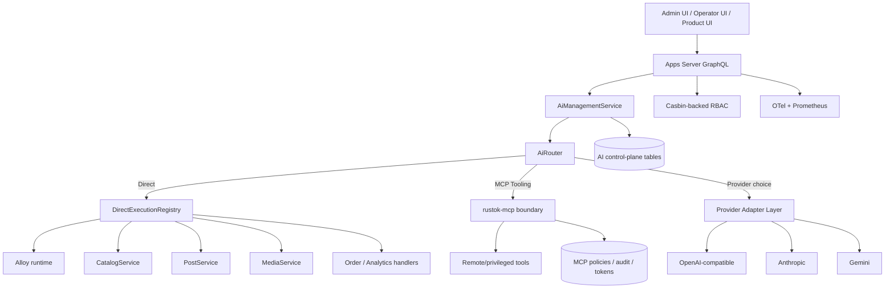
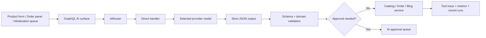
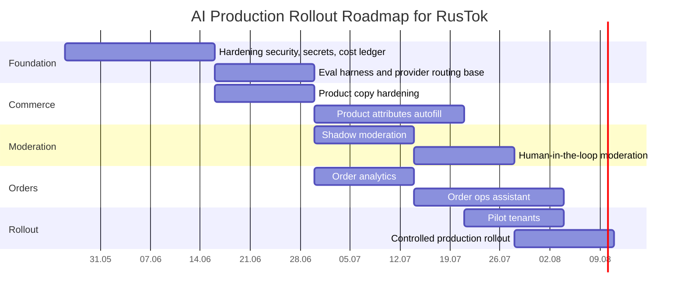

# AI Module Integration and Production Deployment for the RusTok Ecosystem

## Executive Summary

The research, started with a GitHub connector and limited to the `RusTokRs/RusTok` repository, shows that RusTok already has not a "skeleton" but a full AI-MVP: a separate capability-crate `rustok-ai`, multi-provider runtime, task profiles, hybrid direct/MCP execution, RBAC-first access model, persisted control plane, streaming output, diagnostics and two admin surfaces — Leptos and Next.js. In other words, the main task now is not creating an AI module from scratch, but hardening it for production and expanding domain coverage for new scenarios: moderation, product attribute autofill, order analytics and semi-automated order processing.

The most rational target architecture for RusTok is **hybrid**: `Direct` by default for first-party ecosystem verticals and `McpTooling` for remote tools, high-risk operations and cross-system scenarios. This choice is already supported by the current `ExecutionMode::{Auto, Direct, McpTooling}` model, the existing `AiRouter`, direct handlers `alloy_code`, `image_asset`, `product_copy`, `blog_draft`, and the fact that the backlog separately notes "richer provider routing / fallback / multi-model policy" and "deeper domain-direct verticals".

For providers, the best practical strategy for RusTok is: **OpenAI-compatible** as the primary "universal" interface and basic production gateway, **Anthropic** as a premium fallback for complex text and tool-heavy scenarios, **Gemini** as a strong candidate for multimodality, attribute extraction and cost-aware batch tasks. This aligns well with the already implemented `ProviderKind::{OpenAiCompatible, Anthropic, Gemini}` and capability model in RusTok, and externally is confirmed by official capabilities: OpenAI has function calling with JSON Schema and strict mode, Anthropic has tool use, prompt caching and batch processing, Gemini has parallel/compositional function calling, context caching and batch pricing.

The key production risks in the current state are not the absence of an AI foundation, but insufficient depth in several layers: fallback and routing policies, secret management for provider keys, cost analytics at the tenant/provider/task level, protection of sensitive payloads in persisted traces/messages, and expansion of direct verticals beyond Alloy/Media/Commerce/Blog. These are exactly the items that should become the first implementation priority.

## Current RusTok State and What It Means for AI

RusTok is a modular Rust monorepo where AI is already embedded as a capability alongside `alloy`, `rustok-mcp`, `rustok-rbac`, `rustok-product`, `rustok-order`, `rustok-search`, the Loco server and separate admin hosts. The server's GraphQL schema merges owner-owned AI, MCP, Search and RBAC roots into a single API circuit, and the AI transport surface lives in `crates/rustok-ai/src/graphql/*`. This is important: new AI functionality in RusTok should live not "on the side" but as a continuation of the existing capability pattern.

The current `rustok-ai` core already covers the most important control plane elements: provider profiles, tool profiles, task profiles, chat sessions/runs/messages, approval requests, tool traces, recent stream events and runtime metrics snapshot. At the persisted model level, this is extracted into separate migrations and tables; at the API level — into GraphQL queries, mutations and the `aiSessionEvents` subscription; at the UI level — into capability-owned packages for Leptos and Next.js. The direct conclusion follows: **operator surface, audit and manageability already exist**, so new business scenarios should be connected to this circuit rather than building a parallel one.

It is especially telling that the direct handler registry is already registered in code: `AlloyScriptAssistHandler`, `MediaImageAssetHandler`, `ProductCopyHandler`, `BlogDraftHandler`. For `product_copy`, AI already generates localized title/description/meta fields and writes them directly through `CatalogService`; for `blog_draft` — creates or updates localized drafts through `PostService`; for `alloy_code` — can list/get/validate/run Alloy scripts; for `image_asset` — generates an image and immediately saves it to the media library. This reduces the cost of further development: moderation, product attributes and order workflows can be added as new direct handlers of the same class.

An important limiter is also visible now: the `implementation-plan.md` explicitly notes that deeper domain-direct verticals, richer routing/fallback and a full remote MCP bootstrap chain are post-MVP backlog, not already closed parts of the system. Therefore, "what's in the code today" and "target design" should not be mixed: product attributes, moderation and order automation will require separate implementation, albeit on a well-prepared base.

Below is a brief snapshot of the current state and gaps.

| Area | What already exists in RusTok | What is still needed for production ecosystem |
|---|---|---|
| AI runtime | Multiprovider runtime, task/tool/provider profiles, direct + MCP, streaming, diagnostics. | Failover policies, circuit breaker, cost ledger, health-based routing. |
| Domain AI scenarios | Alloy, media image asset, product copy, blog draft. | Moderation, product attributes, order analytics, order ops assistant. |
| Security | Typed permissions, approvals, MCP policies/audit, GraphQL permission guards. | KMS/Vault, payload redaction, PII-aware persistence, SSRF-safe MCP remote mode. |
| Operations | GitHub Actions: fmt, clippy, check, audit, deny, coverage, SBOM, nextest, Next builds. | Performance/regression suites specifically for AI flows and provider outages. |
| Observability | AI metrics snapshot + GraphQL diagnostics; OTel guide in repository. | Per-tenant spend dashboards, fallback analytics, task-quality eval dashboards. |

## Architectural Integration Options with Alloy and MCP

The internal RusTok model already sets the right framework: AI has `ExecutionMode::Auto`, `Direct` and `McpTooling`, and `AiRouter` takes `task_profile`, a list of available provider profiles, explicit override, attached tool profile and actor roles, then selects execution mode, provider and model. In other words, the architectural strategy selection layer in RusTok no longer needs to be invented — it just needs to be matured to production-grade policy.

From an engineering perspective, there are three viable options. **Direct-first** means AI calls first-party RusTok services directly from `rustok-ai` through the service layer; this gives better manageability, lower latency, fewer tokens on tool loops and natural audit. **MCP-first** means AI does almost everything through MCP tools; this increases isolation and makes tool contracts explicit but adds a hop, authorization complexity and the risk of tool "proliferation." **Hybrid** combines both worlds: direct for internal verticals and MCP for remote integrations, operator tools and operations where explicit tool boundaries are better. By aggregate factors, hybrid best matches the current RusTok code and the official MCP model, where hosts/clients/servers are separated and user consent, authorization and access controls are considered mandatory elements of a secure implementation.

| Option | Where it is strong | Where it is weak | Conclusion |
|---|---|---|---|
| Direct-first | Product cards, localization, content generation, media, Alloy; minimal hop and direct access to `CatalogService`/`PostService`/Alloy runtime. | Less suitable for external systems and situations requiring an independent tool boundary. | Should be default for first-party scenarios. |
| MCP-first | Convenient for remote tools, cross-system operations, external data/tools surfaces. MCP formalizes tools/resources/prompts and OAuth-like protection for remote mode. | Higher latency and more complex security surface. | Use where an explicit boundary or third-party systems are needed. |
| Hybrid | Matches current RusTok: direct verticals already exist, `mcp_tooling` already exists, and the router can select the mode. | Requires more mature routing policies and cost control. | Recommended target option. |

Integration with Alloy is already surprisingly mature. `alloy_code` in direct-path can list, read, validate and run Alloy scripts, and the Alloy module itself publishes its own permissions and runtime. The Alloy engine already has protective limits: by default `max_operations=50_000`, `timeout=100ms`, `max_call_depth=16`, limits on string sizes, array sizes and map depth. For AI-assisted scripting, this is a strong argument for **direct Alloy assist as the base path** rather than mandatory packaging of every scenario as an MCP tool.

The diagram below shows the recommended target architecture based on what already exists in RusTok.



The practical recommendation here: for RusTok, it is worth formalizing the rule **"Direct by default, MCP by policy exception"**. This means that `product_copy`, `product_attributes`, `content_moderation`, `order_analytics`, `order_ops_assistant`, `alloy_code` should live as direct handlers, and `McpTooling` should be activated when the task requires a remote tool, cross-cutting audit boundary, third-party authorization or operator confirmation. This mode best aligns with the current handler registry, task profiles and approval model.

## Production Requirements and Multi-Provider Abstraction Design

The current provider abstraction in RusTok is already well chosen. The code has `ModelProvider` with methods `test_connection`, `complete`, `complete_stream`, `generate_image`, as well as three families: `OpenAiCompatible`, `Anthropic`, `Gemini`. At the capability-matrix level, AI already distinguishes `TextGeneration`, `StructuredGeneration`, `ImageGeneration`, `MultimodalUnderstanding`, `CodeGeneration`, `AlloyAssist`. This is a very strong foundation: what needs to be added is not a new abstraction layer but a policy layer on top of what already exists.

At the control plane level, the current model is also quite mature: `AiProviderConfig` already stores `provider_kind`, `base_url`, `api_key`, `model`, `temperature`, `max_tokens`, `capabilities` and `usage_policy`; `TaskProfile` stores `allowed_provider_profile_ids`, `preferred_provider_profile_ids`, `fallback_strategy`, `tool_profile_id`, `approval_policy`, `default_execution_mode`; and the router already considers `restricted_role_slugs`. The missing link is **production policy mechanisms**, specifically: health-scored routing, ordered fallback by error type, circuit breaker, tenant budgets, capture of real token/cost/cache counters and deeper failure analytics. The repository itself explicitly captures richer fallback/routing as post-MVP backlog.

An important design rule for RusTok: **routing should be task-centric, not provider-centric**. That is, the decision should not be "default provider for the entire tenant", but the combination of `task_profile × tenant policy × role × locale × budget × latency class`. This naturally extends the current structure of `task_profile -> target_capability -> preferred/allowed providers -> execution_mode`. For production, this is better than a global default model because product attribute generation, chat operator flows, Alloy assist and order analytics differ too much in acceptable cost, latency and error risk.

The recommended provider prioritization is as follows.

| Priority in RusTok | Provider | Why It Makes Sense | Design Considerations |
|---|---|---|---|
| Primary interface | OpenAI-compatible | Already implemented in RusTok; function calling defined by JSON Schema; strict mode makes function calls more reliable; OpenAI has org/project-level rate limits and supports Batch API and cached input pricing. | Good as base adapter/gateway; separate compatibility profile needed for cloud/self-hosted endpoints. |
| Premium fallback | Anthropic | Tool use supports client/server tools and strict tool use; prompt caching reduces latency/cost on repeating prefixes; officially has usage-based tiers, batch -50% and gradual ramp-up due to acceleration limits. | Strong choice for long instructions, complex reasoning and operator workflows. |
| Multimodality and cost-aware batch | Gemini | Supports parallel and compositional function calling; pricing shows context caching, batch/flex modes and enterprise security/compliance; rate limits depend on project tier. | Good for product attributes from images and batch analytics, but limits are tier-dependent. |

From this follows the following production selection policy. For **synchronous text drafts and strict JSON contracts** — OpenAI-compatible. For **long system prefixes and tool-heavy reasoning** — Anthropic, especially if there are repeatable prompts and long multi-turn conversations, because prompt caching reuses the common prefix and can reduce both cost and latency. For **multimodal and batch-oriented scenarios** — Gemini, where context caching and batch economics provide a good compromise.

Below is the recommended production requirements framework for RusTok. Where user requirements are not specified, I note it accordingly.

| Area | Recommendation | Status in Repository |
|---|---|---|
| Control plane storage | PostgreSQL for profiles/sessions/runs/messages/traces/approvals; separate indices by tenant/run/session. | Already exists. |
| Queues and async jobs | For batch, offline analytics and order automation, a separate worker lane is needed; exact technology — **not specified**. | Partially not visible in AI slice. |
| CI/CD | Keep current GitHub Actions pipeline and add AI-specific eval/load/failover jobs. | Foundation already exists. |
| Monitoring | OTel for traces/metrics/logs and Prometheus for time-series/alerting; link to `ai_runtime_metrics` and recent runs. | Partially exists. |
| GraphQL safety | Keep schema controls: `limit_depth(12)` and `limit_complexity(600)`, security + observability extensions. | Already exists. |
| Latency SLO | Interactive p95, background SLA and budget caps — **not specified**; need to be defined before rollout. | Not specified. |
| Cost control | Tenant/project budgets, cached-prefix accounting, batch lanes, model tiering, rate-limit backoff. | Needs implementation on top of MVP. |
| Secrets | Provider secrets should go to KMS/Vault or be encrypted with envelope scheme; plaintext/text-column is poor as final state for production. | Needs hardening. |

Separately, rate-limit engineering needs emphasis. OpenAI works with RPM/TPM/RPD/TPD and recommends random exponential backoff; additionally, Batch API helps increase throughput when request-per-minute becomes a bottleneck. Anthropic uses token-bucket, usage tiers/spend limits and separately warns about acceleration limits during rapid traffic growth. Gemini applies limits at the project level and usage tier, and preview/experimental models have stricter limits. Therefore, RusTok needs a **unified internal rate-limit facade** that knows about tenant-level, provider-level and task-level queues and can translate provider 429/over-quota/capacity signals into a unified retry/fallback policy.

## RBAC and Data Security

RBAC in RusTok is already designed as a typed permission vocabulary. In `rustok-core`, separate resources and actions are defined for `ai:providers`, `ai:task_profiles`, `ai:sessions`, `ai:runs`, `ai:approvals`, `ai:router`, as well as task groups `ai:tasks:text`, `ai:tasks:image`, `ai:tasks:code`, `ai:tasks:alloy`, `ai:tasks:multimodal`. There are also domain permissions for `products`, `orders`, `analytics`, `scripts`, `mcp`, and moderation-related permissions for forum topics and replies. The `rustok-rbac` layer is declared as a Casbin-backed live authorization runtime, and GraphQL AI resolvers actually check permissions for read/manage/run/cancel/resolve. This is an excellent foundation for AI governance "by roles" rather than by ad-hoc flags.

At the same time, the current persisted model shows where the real data risks lie. The AI control plane stores `api_key_secret`, chat messages, tool traces with `input_payload`/`output_payload`, approval requests with `tool_input`, metadata, etc. The MCP model stores token hashes/previews, granted permissions/scopes, allowed/denied tools and audit logs. For production, this is enough to ensure manageability; but it is also enough to unintentionally retain PII, commercial secrets or sensitive tool payloads if redaction and encryption discipline are not introduced.

Official MCP documentation here provides very clear guidance. For remote MCP, authorization is strongly recommended when the server provides access to user-specific data, administrative actions, audit and per-user usage tracking. The specification and security best practices require explicit user consent before data access and before tool invocation; recommend OAuth 2.1-style authorization; require per-client consent, exact redirect URI validation, cryptographically secure `state`, prohibition of token passthrough and SSRF protection during OAuth metadata discovery. For RusTok, this means that deploying remote MCP to production without a full authn/authz chain, SSRF-hardened fetcher and consent UI is a bad idea.

From a security patterns perspective for LLM applications, RusTok should be designed as a system under the OWASP GenAI Top 10 threats, primarily: **Prompt Injection**, **Sensitive Information Disclosure**, **Improper Output Handling**, **Excessive Agency** and **Unbounded Consumption**. These risks align very well with real RusTok scenarios: user content moderation, JSON generation for product cards, Alloy operation execution, order suggestions and MCP tools. Consequently, three practices become mandatory: strict schema contracts for structured outputs, mandatory human approval for sensitive or state-changing actions, and strict sanitization/validation of model outputs before writing to product/order/blog domains.

I recommend the following practical security design for RusTok.

| Control | Best Approach for RusTok |
|---|---|
| Secrets | Migrate `api_key_secret` to `secret_ref` + KMS/Vault or at least encrypt-at-rest with envelope keys; UI should only see `hasSecret`. Current storage as text-column is acceptable only as an intermediate stage. |
| PII minimization | Before external provider calls, form a redacted prompt envelope: customer email/phone/address/notes are not sent by default; only send fields actually needed for the task. |
| Persisted traces | In `AiToolTraces`, `AiChatMessages`, `AiApprovalRequests` store a redacted payload and separately a debug-only sealed payload with short TTL — or do not store at all. |
| Approval gates | Everything that changes order state, publishes content, executes an Alloy script or accesses remote MCP tools must go through approval policy and correlation ID. |
| Output handling | Any model JSON passes schema validation + domain validation + permission check before `CatalogService`/`OrderService`/`PostService`. |
| MCP security | No token passthrough, exact redirect URI, SSRF-safe metadata discovery, HTTPS-only for production OAuth URLs. |

If simplified to one principle, it would be: **RBAC answers "who can generally initiate the scenario", approval policy answers "what can be executed automatically", and data policy answers "which fields can actually be sent to the model and stored back"**. In RusTok, these three layers can already be connected without architectural refactoring, because the permission vocabulary, approvals and persisted traces already exist.

## Application Scenarios and Integration into RusTok Code

### Description Generation and Localization

This scenario is already partially implemented in `product_copy`: the direct handler reads a product through `CatalogService`, selects a source translation, calls the model, forms a localized target translation and writes it back through `update_product`. For RusTok, this means that product description generation is not a hypothetical use case but an already existing production path that needs to be extended, not invented. The most useful additions here are: draft/publish split, auto-SEO variants, category-aware tone policies and confidence-driven approval.

### Content Moderation

There is no separate moderation handler in the current AI registry, but all the basic supports already exist for it: the permission vocabulary knows `Moderate` actions, forum moderation permissions are already defined, and the AI approval and tool-trace circuit already exists. Therefore, `content_moderation` should be implemented as a new direct vertical with a **strictly structured** JSON output: `decision`, `labels`, `severity`, `explanation`, `requires_human`, `recommended_action`. Auto-blocking is allowed only for narrow high-confidence policy classes; all borderline cases go through `AiApprovalRequests`.

### Product Attribute Autofill

This scenario is, in my opinion, the next priority after the already existing `product_copy`. The `rustok-product` module handles translations, options, variants and locale-aware custom-field flows through shared `flex` attached localized storage. The Next admin product form currently has only image/name/category/price/description, without AI-assisted autofill surface. Therefore, the shortest path is to add a new direct handler `product_attributes` and an `AI Fill` button/panel in the product form, which, after image upload and category selection, calls a multimodal or text+tool pipeline and returns a strictly validated JSON per schema: `brand`, `material`, `color`, `size`, `dimensions`, `compatibility`, `care_instructions`, `hazmat`, `flex_attributes[]`. This scenario is best suited for Gemini or another multimodal-capable profile.

### Order Analytics

`rustok-order` already owns order snapshots, line items, status transitions and admin UI, and the order admin package already uses GraphQL queries for order lists/details. This creates a good foundation for second-order AI analytics: identifying cancellation reasons, summarizing returns, finding recurring delivery incidents, weekly executive summaries, risk flags by carrier/tracking/payment patterns. It is critical that AI here does not become the source of truth; it should work on top of existing order snapshots and produce summaries/insights, not "new facts."

### Order Processing Automation

For order ops, the repository already has explicit GraphQL lifecycle operations: `markOrderPaid`, `shipOrder`, `deliverOrder`, `cancelOrder`. This makes the AI automation scenario practical, but with an important caveat: in the first phase, AI should **suggest and prefill**, not silently execute. For example, AI can, based on an incoming event, form a "next recommended action", prefill tracking/carrier/reason, compile an anomaly summary and pass it to the operator. Full auto-execution makes sense only for narrow whitelisted policies and only after approval or explicit permission through a tool profile/MCP policy.

Below is the recommended change map across RusTok code.

| Module | What to Change/Add | Why |
|---|---|---|
| `crates/rustok-ai/src/direct.rs` | Add `ContentModerationHandler`, `ProductAttributesHandler`, `OrderAnalyticsHandler`, `OrderOpsAssistantHandler`. | This is the most natural extension point. |
| `crates/rustok-ai/src/model.rs` | Add new task input structs; possibly extend `DirectExecutionTarget`, which currently only knows `Alloy`, `Media`, `Commerce`, `Blog`. | So new verticals are typed. |
| `crates/rustok-ai/src/graphql/*` | Extend owner-owned query/mutation/types for new task jobs, quality stats, spend stats and domain-specific approvals. | For headless and Next/Leptos UI. |
| `apps/next-admin/packages/rustok-ai` | Add sections for task health, spend, fallback history and domain job launchers. | So operators see not only sessions/runs but also business scenarios. |
| `apps/next-admin/.../product-form.tsx` | Add `AI Fill` and `Apply Suggested Attributes` with preview diff. | This is the entry point for attribute autofill. |
| `crates/rustok-order/admin/src/api.rs` and order service surfaces | Add helper flows for AI suggestions, but keep final execution through existing lifecycle mutations. | Does not break the current order contract. |
| `crates/rustok-core/src/permissions.rs` | If needed, add narrower permissions like `ai:tasks:moderation` or `ai:tasks:orders`, if current text/image/multimodal groups are insufficient. | For more transparent governance. |

As a contract compatible with the current RusTok model, I recommend the following task job launch format. It does not copy the exact public API from the repository but **follows its current entities** `TaskProfile`, `ExecutionMode`, `ProviderProfile`, `tool_profile_id` and locale-aware contract.

```json
{
  "task_profile_slug": "product_attributes",
  "execution_mode": "direct",
  "provider_profile_slug": "gemini-flash-prod",
  "requested_locale": "ru-RU",
  "tool_profile_slug": null,
  "payload": {
    "product_id": "UUID",
    "category_slug": "electronics",
    "image_urls": ["sandbox-or-cdn-url"],
    "source_title": "Wireless headphones",
    "source_description": "not specified",
    "copy_instructions": "Generate only verifiable attributes"
  }
}
```

This task can then be routed through the target flow:



## Testing, Validation and Roadmap

A strong point of RusTok is that the base CI is already quite strict: formatting, clippy, cargo check, MSRV, cargo audit, cargo deny, typos, docs, udeps, coverage, SBOM, nextest, builds for server/storefront and for Next apps. Therefore, the AI module does not need to be introduced to a separate "manual" quality discipline; on the contrary, AI changes should be integrated into the existing pipeline and extend it.

For AI functions, I recommend four validation classes. The first is **schema correctness**: share of valid JSON outputs, share of strict-schema passes, number of domain-validation errors per 1,000 requests. The second is **business quality**: accept rate, publish-without-edit rate, average edit distance, attribute accuracy, moderation precision/recall, operator suggestion acceptance. The third is **safety**: prompt injection regression suite, PII leakage tests, tool misuse tests, approval bypass tests, SSRF tests for remote MCP flow. The fourth is **operational class**: p95/p99 latency, fallback rate, provider error rate, token cost per completed task, queue delay, cancellation rate and approval turnaround time. These metrics naturally combine with the already existing `ai_runtime_metrics`, recent runs and `aiSessionEvents`.

An A/B approach is mandatory here. For description generation, it is worth comparing "human without AI" vs "AI draft + human edit" on time, edit distance and publish rate. For product attributes — "manual input" vs "AI prefill + manual confirmation" on speed and accuracy. For order ops — "AI recommendation visible / hidden" on operator throughput and error rate. For moderation — offline benchmark and staged shadow-mode before enabling enforce decisions. Since OWASP explicitly highlights prompt injection, sensitive information disclosure, excessive agency and improper output handling as basic risks for GenAI applications, safety validation should not be an optional part of rollout.

Below is a realistic implementation roadmap, starting from the current repository state.

| Stage | Content | Effort Estimate | Main Risks |
|---|---|---|---|
| Foundation hardening | Secret storage, payload redaction, provider cost ledger, health checks, retry/fallback policy, eval harness. | 2–4 weeks | Underestimating the volume of work around persisted traces and budgets. |
| Catalog AI | Harden `product_copy`; add `product_attributes`, preview diff and schema validation in product form. | 3–5 weeks | Attribute accuracy and image-quality variability. |
| Moderation | Add `content_moderation`, policy matrix, appeal queue, shadow mode. | 3–4 weeks | False positives / policy drift. |
| Order analytics | Batch summaries, anomaly clusters, operator dashboards, spend/latency dashboards. | 2–4 weeks | Shifting "analytics" into decision-making without sufficient verification. |
| Order operations assistant | Suggest-next-action, prefill lifecycle inputs, approval-gated automation. | 4–6 weeks | Excessive agency and risk of incorrect state transitions. |
| Advanced routing | Cost- and health-aware routing, provider fallback tree, batch segmentation, provider scorecards. | 2–4 weeks | Complexity creep and difficulty of model selection explainability. |

The diagram below shows the recommended timeline with dependencies.



The final recommendation on priorities is as follows. If the goal is to achieve maximum business impact with minimal technical risk, the order should be: **first harden the control plane and multi-provider policy**, then **product copy + product attributes**, then **moderation**, and only after that — **order automation**. Order analytics can be started before automation because it has a lower risk of excessive agency and relies on already existing order snapshots.

## Open Questions and Limitations

Input parameters without which the infra and rollout profile cannot be definitively fixed are **not specified** in the request: target cloud/region, mandatory data residency, acceptability of self-hosted/open-weight models, load in RPM/TPM, monthly inference budget, target SLA/latency budget, list of roles and level of acceptable order auto-processing, as well as formal compliance mode for personal data. Therefore, the architectural decisions above represent the **most practical and low-risk trajectory** from the current RusTok state but do not replace a final solution design with real SLOs and compliance constraints.

The research limitation is also important to note: the GitHub analysis was intentionally limited **only** to the `RusTokRs/RusTok` repository, as requested; other GitHub repositories were not used. External context was gathered only from official documentation of MCP, OpenAI, Anthropic, Gemini, as well as OpenTelemetry, Prometheus and OWASP.

If the entire report is reduced to one practical conclusion, it sounds like this: **RusTok already has the right AI framework; the best path is not to build a new AI module but to mature the existing `rustok-ai` to production-grade governance and add new direct verticals for moderation, product attributes and order flows, leaving MCP as a controlled boundary rather than a mandatory path for everything**.

## Implementation Plan (verified against research)

Source of tasks: [`docs/research/AI-research.md`](./AI-research.md).

Below is a sequential implementation plan based on the research findings (prioritized as "minimum risk → maximum effect").

### Phase 0 — Alignment and scope freeze (1 week)

- Confirm target constraints: cloud/region, data residency, SLA (p95/p99), inference budget, auto-action policy.
- Fix owner matrix for AI verticals: catalog, moderation, order analytics, order ops.
- Agree on definition of done for safety/quality/latency/cost.

**Deliverables**
- RFC/ADR with final rollout constraints.
- List of tenants for pilot and deny-list scenarios.

### Phase 1 — Foundation hardening control-plane (2–4 weeks)

1. **Secrets & provider governance**
   - Move provider keys to managed secrets.
   - Introduce environment separation (dev/stage/prod) and scoped provider profiles.
2. **Data policy & redaction**
   - Add redaction for traces/messages/approvals payload.
   - Close sensitive payload storage: short TTL or disableable sealed storage for debug.
3. **Approval gates**
   - All state-changing actions (orders/publications/remote tools) migrate to approval policy + correlation id.
4. **Routing reliability**
   - Add retry/fallback policy (by health/cost/capability), circuit-breaker and provider scorecard.
5. **Observability**
   - Metrics: valid JSON rate, domain-validation errors, p95/p99, fallback rate, token cost/task, approval turnaround.

**Deliverables**
- Production-ready AI control-plane baseline.
- Dashboard `ai_runtime_metrics` + alerting rules.

### Phase 2 — Catalog AI (product_copy + product_attributes) (3–5 weeks)

1. **Hardening existing `product_copy`**
   - Draft/publish split.
   - Confidence score + human approval for low-confidence output.
2. **New vertical `product_attributes`**
   - Strict JSON schema: brand/material/color/size/dimensions/compatibility/care/hazmat/flex_attributes.
   - Domain validation before writing to catalog.
3. **Admin UX**
   - Add `AI Fill` + preview diff + `Apply Suggested Attributes` in product form.
   - Display source-of-truth and validation rejection reasons.

**Deliverables**
- End-to-end path: product form → AI task → validated preview → apply.
- A/B baseline: manual vs AI-assisted.

### Phase 3 — Content moderation vertical (3–4 weeks)

1. Add `content_moderation` direct handler.
2. Output only in structured JSON: `decision`, `labels`, `severity`, `explanation`, `requires_human`, `recommended_action`.
3. Enable shadow-mode, then human-in-the-loop queue.
4. Auto-blocking allowed only for whitelisted high-confidence policy classes.

**Deliverables**
- Moderation policy matrix.
- Offline benchmark + regression suite for false positives/false negatives.

### Phase 4 — Order analytics (2–4 weeks)

1. Summaries for cancellations/returns/delivery/risks.
2. Incident clustering by carrier/tracking/payment patterns.
3. Operator dashboards (insights-only, without auto execution).

**Deliverables**
- Weekly executive summaries.
- KPI: insight adoption rate, review-time reduction.

### Phase 5 — Order operations assistant (4–6 weeks)

1. Suggest-next-action for lifecycle operations (`paid/ship/deliver/cancel`).
2. Prefill inputs (carrier/tracking/reason) with validation.
3. Approval-gated automation for narrow whitelist policy.
4. Explicit prohibition of silent execution outside policy.

**Deliverables**
- Operator co-pilot in order admin flow.
- Error budget + rollback playbook for automated transitions.

### Phase 6 — Controlled rollout and scaling (2–4 weeks)

1. Pilot tenants → controlled production rollout.
2. Cost-aware routing + dynamic provider fallback tree.
3. Regular evaluation cycle (quality, safety, cost, latency).

**Deliverables**
- Go/No-Go checklist for each tenant.
- Quarterly recalibration of models/policies/thresholds.

## Actual Code Reconciliation Before Implementation

Verification performed against the current repository code (not only research theses).

### What already exists in code (confirmed)

- `rustok-ai` already has direct handlers for `alloy_code`, `image_asset`, `product_copy`, `blog_draft`.
- `DirectExecutionTarget` is currently limited to `Alloy`, `Media`, `Commerce`, `Blog` categories.
- GraphQL already has `ai_runtime_metrics`, recent runs/events and access to tool traces.
- Order admin already has lifecycle operations `markOrderPaid`, `shipOrder`, `deliverOrder`, `cancelOrder`.
- Persisted control plane already has tables for `AiApprovalRequests` and `AiToolTraces`.

### What is still missing (gaps to implement)

- Direct vertical handlers `content_moderation`, `product_attributes`, `order_analytics`, `order_ops_assistant` already added to `rustok-ai`; next step — complete production-hardening (redaction/approvals/telemetry DoD) for these verticals.
- Next admin product form does not have `AI Fill`/`Apply Suggested Attributes` and preview-diff for attributes.
- No domain-specific launchers/health panels for new vertical tasks in `apps/next-admin/packages/rustok-ai`.
- No formalized rollout-metrics as a separate acceptance-gate for new verticals (needs to be captured as DoD).

### Implementation Priority Correction Based on Current Code

1. **First, foundation hardening + observability gates** (reuse existing control-plane).
2. **Then `product_attributes` + product form UX**, since `product_copy` and catalog-path are already in the production circuit.
3. **Then moderation (shadow → HITL → selective enforce)**.
4. **Then order analytics (insights-only)**.
5. **And only after that, order ops assistant with approval-gated automation**.

## Verification Checklist Against Research Items

- [ ] Secrets and providers isolated by environments.
- [ ] PII/sensitive payload redacted before storage.
- [ ] State-changing AI actions go through approval gate.
- [ ] JSON-output passes schema + domain + permission validation.
- [ ] MCP/remote tools work without token passthrough and with SSRF-safe policies.
- [ ] `product_copy` migrated to a managed draft/publish pipeline.
- [~] `product_attributes` implemented on backend; UI preview/apply in product form still in progress.
- [~] `content_moderation` backend-handler implemented; shadow rollout/policy matrix not yet complete.
- [~] `order_analytics` direct handler added; dashboards and KPI circuit not yet completed.
- [~] `order_ops_assistant` handler added; whitelist automation and rollback playbook still in progress.
- [ ] Quality/safety/cost/latency metrics being collected.
- [ ] A/B and regression tests conducted before full rollout.

## Quick Links for Execution

- Main requirements and context document: [`docs/research/AI-research.md`](./AI-research.md)
- Recommended implementation start: sections about `rustok-ai` direct handlers, approvals, validations, observability in this same document.
