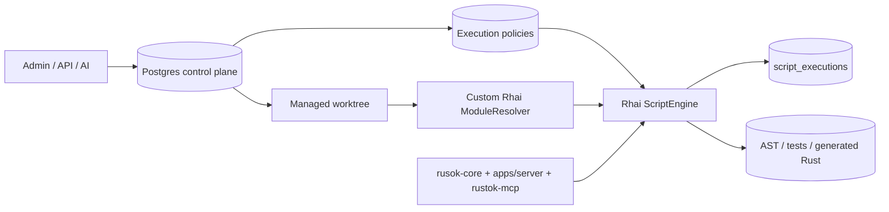
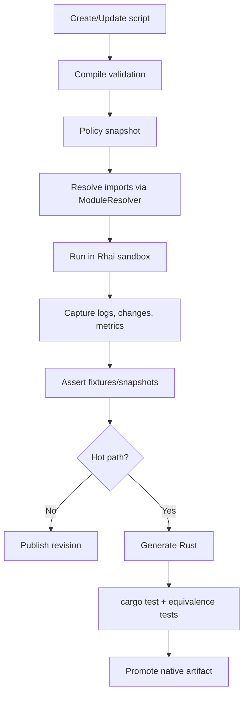

# Analytical Report on Alloy in RusTok

## Executive Summary

The available connector in this session is **GitHub**. The analysis starts with the **RusTokRs/RusTok** repository and is limited to it as the primary source. Additionally, I used only primary sources on Rhai and Rust to verify the technical feasibility of sandbox constraints, custom module resolver and engine thread-safety.

The main conclusion: **the Alloy concept in the repository is already partially implemented as a working runtime for Rhai scripts**, but only as an early foundation, not as a completed Self-Evolving Integration Runtime. The code already has a script model, in-memory and SeaORM/Postgres storage, manual execution, event hooks, a cron scheduler, REST/GraphQL surfaces and execution logs. However, key elements that the concept explicitly promises are missing or not at production level: a full internal namespace for multi-file Rhai packages, version control at the revision level, a managed host surface, actual enforcement of sandbox limits, a whitelist for HTTP, self-debugging, AI generation, native Rhai→Rust compilation and pipeline hot swap.

The most important thing for your task: **Rhai can already be run and tested inside Alloy**, and this is confirmed by several layers of the repository — unit tests for `ScriptEngine`, integration tests for orchestrator/hook-flow, REST/GraphQL validation/execution, as well as the inclusion of `mod-alloy` in the server's default features and bootstrap initialization of the Alloy runtime at application startup. But in its current state, this is more **"basic scenarios can be run"** than **"the full concept ecosystem can be safely and fully run"**. The limitations are especially noticeable in security and isolation: timeout is currently mostly logged rather than interrupting execution; the HTTP bridge has no whitelist; `permissions` and `run_as_system` are stored but almost never enforced along execution paths; and the operation limit test in the crate allows both a limit error and successful completion, meaning the current limit semantics are not rigidly enforced.

Recommended target architecture: **do not make the filesystem the source of truth**. Instead, implement the internal Alloy namespace as a **managed built-in repository**, where **Postgres/SeaORM remains the control plane and source of truth**, and the file tree is a **materialized worktree and export for version control, review, AI and native compilation**. This best aligns both with the concept, which explicitly captures the "**DB (source of truth) + files (version control)**" model, and with Rhai's capabilities, which supports its own `ModuleResolver`, meaning imports can be resolved not directly from disk but from a managed repository layer.

Finally, an important research limitation: the file `docs/alloy-concept.md` is **not missing** but in the repository it reads as systematically corrupted encoding (mojibake). Below, I assume this is a reproducible CP1251→UTF‑8 distortion because after reverse interpretation, the headers and main text turn into a coherent Russian document. This is an **explicitly noted assumption of the analysis**, not a guaranteed property of the source file.

## What Is Captured in the Concept and What Already Exists in Code

In the concept, Alloy is described not simply as a scripting add-on but as an independent capability/runtime layer: it receives a task in natural language, writes executable code, runs it in a sandbox, fixes minor errors, and translates stable scenarios into native Rust modules. The key architectural decisions are also explicitly captured: Alloy is a separate horizontal capability layer, RusToK is its host platform; a minimal Alloy build is possible even outside the full RusToK; and the chosen storage scheme for scripts is "DB as source of truth + files for version control". The document also has an explicit lifecycle "AI writes Rhai integration script → sandbox → diff/auto-patch → cargo build → native module" and a roadmap transitioning from Foundation to AI Core, Integration Runtime, Native Compilation and Ecosystem.

From the perspective of the current code, the base for this indeed exists. In `crates/alloy/src/lib.rs`, Alloy is already structured as a RusToK module, exporting runtime, storage, scheduler, execution log, GraphQL/REST and tests. The `Script` model already contains `tenant_id`, `name`, `code`, `trigger`, `status`, `version`, `run_as_system`, `permissions`, `author_id`, and the `scripts` migration already creates a table with uniqueness `(tenant_id, name)`, JSON fields for trigger/permissions and error counters. This means Alloy in the repository is already conceived as a multi-tenant runtime with a standard persistence layer.

But there are several important gaps between the concept and the code. The concept speaks of a multi-file ecosystem and directly shows YAML where `transform.script` points to `scripts/ga4_compare.rhai`, i.e., a path to a separate file inside some internal namespace. In the current implementation, the script code is simply a single `code: String` field in the `scripts` record; the `ScriptRegistry` interface manages the `Script` object as a whole and knows nothing about packages/modules, imports, revisions or a materialized worktree. In other words, **the concept already assumes a script space at the package/repository level, while the code is still at the single-file record storage level**.

The second gap is the governed sandbox. The concept explicitly captures constraints: no filesystem access, HTTP only through whitelist, processes forbidden, memory limited, DB writes only through explicit API, infinite loops cut by timeout. In the code, `EngineConfig` indeed contains `max_operations`, `timeout`, `max_call_depth`, `max_string_size`, `max_array_size`, `max_map_depth`, but `ScriptEngine::new` actually only enables `set_allow_looping`, `set_allow_shadowing` and `set_strict_variables`; Rhai limits on operations, string size, arrays, maps and function depth are not configured there. Moreover, during execution, timeout is only compared post-factum and logged as a warning, rather than forcing termination of execution. This does not match the concept's statements about sandbox enforcement.

The third gap is the current bridge to the outside world. In the concept, the outside world should be given to Alloy as a governed surface from the host platform: auth, permissions, events, module APIs, execution policy and UI shell. In the code, `ExecutionContext` puts only `EXECUTION_ID`, `PHASE`, `TIMESTAMP`, `USER_ID`, `TENANT_ID`, `entity`, `entity_before` and `params` into scope; `Bridge::register_db_services` is currently empty; and `bridge/http.rs` registers `http_get`, `http_post`, `http_request` via `reqwest::Client::new()` without an explicit whitelist and without a policy layer. Moreover, on the practical execution path, the main runtime is currently created through `create_default_engine()`, which registers utils and entity proxy but **does not call** `Bridge::register_for_phase`, so the phase-aware host surface does not enter the main engine at all. It follows that the concept describes a richer and more strictly managed host surface than currently exists.

The fourth gap is operational maturity. The execution log already exists and writes to the `script_executions` table, but there is no universal logging of each run in the executor/orchestrator itself: logging is explicitly done in the GraphQL mutation and server controller for manual-run, while hook paths and the scheduler do not use the logger as a mandatory part of the pipeline. Also, REST paths for creating/updating a script do not compile the script before saving, although GraphQL paths do. And the scheduler can load cron jobs at startup, but there is no explicit mechanism for live-refresh after create/update/delete of a script. All this means that the "roadmap" and "architectural decisions" of the concept have been started in the code but not yet assembled into a completed system.

## Internal Rhai Script Namespace Design

If we follow the concept literally, the internal Alloy namespace should not be a "folder with scripts" but an **operating environment for the Rhai ecosystem**: scripts, modules, imports, tests, fixtures, policy, generated artifacts, revision history, audit trail and preparation for Rhai→Rust. The concept itself captures the target storage principle — "DB (source of truth) + files (version control)" — and this aligns well with the Rhai model, where a custom `ModuleResolver` is possible, meaning the script does not need direct disk access at all: imports can be served by an internal repository layer and a materialized worktree.

I recommend building a **four-layer internal namespace**:

| Layer | Purpose | Source of Truth | What Is Stored |
|---|---|---|---|
| Control plane | Package management, permissions, versions, policies | Postgres / SeaORM | `scripts`, `script_revisions`, `script_modules`, `script_tests`, `script_policies`, `script_artifacts`, `script_bindings`, `script_secrets_refs` |
| Content plane | Package materialization for review/AI/build | Managed worktree / object storage | `alloy.toml`, `src/*.rhai`, `tests/*.json`, `fixtures/*`, snapshots |
| Execution plane | Compilation, AST-cache, runtime isolation | In-memory cache | compiled AST, namespace cache, import graph, policy snapshot |
| Artifact plane | Execution results and native pipeline | DB + object storage | execution logs, dry-run reports, diff reports, generated Rust, build bundles |

As a **minimal production package format**, I would introduce a `ScriptPackage` object rather than just a `Script`. One package should have one entrypoint but contain many modules and tests. The basic file form could look like this:

```text
alloy-space/
  tenants/{tenant_id}/
    packages/{namespace}/{script_name}/
      alloy.toml
      src/
        main.rhai
        modules/
          common.rhai
          mappings.rhai
          http_client.rhai
      tests/
        happy-path.case.json
        auth-failure.case.json
      fixtures/
        input-order.json
        stripe-event.json
      policy/
        execution.toml
      snapshots/
        latest-output.json
      artifacts/
        ast.json
        generated/
          lib.rs
          Cargo.toml
```

Key point: **this namespace should not be directly accessible to the Rhai script itself as a filesystem**. According to the concept, FS is forbidden, and this is the right decision. The file tree should exist for the editor, review, AI and build-pipeline, while the runtime should see it through `ModuleResolver` and host APIs. That is, the runtime does not do `import "/tmp/.../foo.rhai"` but resolves, for example, `import "tenant://sales/discounts/common" as common;`, after which the resolver retrieves the module from DB/worktree under policy control. This directly fits into the Rhai `ModuleResolver`, which is designed for resolving modules by path string and can return both `Module` and `AST`.

Below is the recommended package metadata schema.

| Object | Key Fields | Purpose |
|---|---|---|
| `scripts` | `script_id`, `tenant_id`, `namespace`, `name`, `entrypoint_module`, `status`, `current_revision_id`, `permissions_policy_id`, `run_as_system`, `owner`, `created_at`, `updated_at` | Package card and routing |
| `script_revisions` | `revision_id`, `script_id`, `semver`, `checksum`, `source_kind`, `created_by`, `review_status`, `published_at` | Revision history and rollback |
| `script_modules` | `module_id`, `revision_id`, `module_path`, `content`, `content_hash`, `is_entrypoint` | Multi-file Rhai structure |
| `script_tests` | `test_id`, `revision_id`, `name`, `fixture_ref`, `expected_snapshot`, `kind`, `timeout_ms` | Built-in testing |
| `script_policies` | `policy_id`, `allowed_hosts`, `allowed_bindings`, `network_mode`, `max_operations`, `max_call_levels`, `max_string_size`, `max_array_size`, `max_map_size` | Actual sandbox policy |
| `script_artifacts` | `artifact_id`, `revision_id`, `kind`, `storage_ref`, `build_hash`, `status` | AST, dry-run, generated Rust, binary module |
| `script_bindings` | `binding_id`, `revision_id`, `name`, `binding_type`, `schema`, `scope` | Allowed host surface |
| `script_secrets_refs` | `secret_ref_id`, `revision_id`, `logical_name`, `provider_key`, `rotation_policy` | Secrets without leaking into code |

Practically, this gives three critically useful effects. First, a package becomes **diffable** and reviewable by humans and AI. Second, the same package can be tested on a specific revision rather than on a mutable current state. Third, the path to native compilation appears naturally: a specific `revision_id` becomes a reproducible build input.

For clarity, the target internal namespace architecture looks like this:



### Storage Option Comparison

Below is an expert evaluation of three storage options for the internal namespace. These are not measured benchmarks but an architectural comparison based on current code, the concept and the Rhai import model. The basic architectural guideline in the concept is the "DB + files" hybrid, and Rhai allows hiding the actual storage behind `ModuleResolver`.

| Option | Performance | Development Convenience | Security | Scalability | Implementation Complexity | Conclusion |
|---|---|---|---:|---:|---:|---:|---|
| Filesystem | 5 | 5 | 2 | 3 | 2 | Good as materialized worktree, poor as source of truth |
| Database | 4 | 3 | 5 | 5 | 3 | Best candidate for control plane and runtime lookup |
| Built-in repository | 4 | 5 | 5 | 5 | 5 | Target production option for Alloy ecosystem |

**Recommendation:** in the nearest cycle, implement a **hybrid DB + managed worktree**, and in the target state, formalize this as a **built-in repository service** on top of DB/object storage. This way, you follow the concept without sacrificing security.

## Can Rhai Be Run and Tested Inside Alloy

Short answer: **yes, it can already**, and the repository confirms this through several independent lines. In `crates/alloy/src/lib.rs`, there are unit tests for simple execution, abort, access to `EntityProxy`, cache invalidation, phase-specific engine and orchestrator integration with storage. In `integration/mod.rs`, there is a more domain-oriented scenario — creating a `Deal` entity with before/on_commit hooks, where one script validates the deal amount and another triggers on commit. This means Alloy can already execute Rhai in unit/integration tests within its own crate and in domain hook orchestration scenarios.

Besides tests, there are also operational entry points. The REST API provides `POST /scripts/validate`, `POST /scripts/{id}/run` and `POST /scripts/name/{name}/run`; GraphQL can `create_script`, `update_script`, `run_script`; server-side bootstrap includes the `mod-alloy` feature by default and calls `alloy::init(ctx)` during runtime startup. This means Rhai inside Alloy can not only be tested but also actually run inside the RusToK server runtime.

From a technical standpoint, this is realistic also because Rhai itself is suitable for this. The `rhai` documentation shows that `Engine` supports `compile`, `eval_ast`, `set_max_operations`, `set_max_call_levels`, `set_max_string_size`, `set_max_array_size`, `set_max_map_size`, `disable_symbol`, `on_progress` and `set_module_resolver`. Also, `Engine` is not `Send + Sync` by itself but can become so with the `sync` feature; in the repository, Rhai is included with the `sync` feature, meaning architecturally you are already in an acceptable zone for a server-side shared runtime.

But the full answer still sounds like this: **run — yes; test — yes; run exactly "the entire ecosystem from the concept" — not yet**. The limitations here are significant.

First, the current `ScriptEngine` config stores limits but does not wire them into the Rhai engine. This is visible both in the code and indirectly in the `test_operation_limit` test, which considers both an `OperationLimit` throw and successful completion of a loop up to a million iterations as acceptable. That is, even the test contract acknowledges that the operation limit is not yet a guaranteed property of the engine. Timeout also does not break execution but merely writes a warning after completion. For a production sandbox, this is insufficient.

The second limitation is the current host surface. The concept requires whitelist-HTTP and explicit APIs, but `bridge/http.rs` currently makes arbitrary requests via `reqwest` without a whitelist. Plus, `Bridge::register_db_services` is empty, and the main runtime is created through `create_default_engine`, which does not connect the phase-aware bridge at all. In other words, today Alloy can execute Rhai but is not yet executing it within the "managed capability surface" promised by the concept.

The third limitation is the absence of package-level tooling. The concept already hints at the file-path `scripts/ga4_compare.rhai`, while the current storage only operates with a string `code` field. This means testing imports, module dependencies, revisions and the generated Rust pipeline has almost nowhere to fit in the current model. This does not prevent unit tests of individual scripts but prevents testing the Alloy ecosystem as a platform feature.

From an engineering perspective, the correct answer to the question "can Rhai be tested inside Alloy?" looks like this:

| Level | Current Status | What Is Needed for Production Readiness |
|---|---|---|
| Compile-time validation | Exists | Make mandatory for create/update in all interfaces |
| Unit execution | Exists | Fix sandbox limits as a mandatory contract |
| Event hooks | Exists | Add universal audit log and permission checks |
| Manual/API execution | Exists | Enable policy engine and consistent validation |
| Scheduler execution | Partially exists | Add live-refresh job registry and durable execution log |
| Multi-file package tests | Does not exist | Introduce package/revision/module model |
| Dry-run / replay | Does not exist | Add fixtures, snapshots, policy sandbox |
| Rhai → Rust equivalence tests | Does not exist | Introduce artifact pipeline and golden tests |

### Technical Execution and Testing Circuit



## Plan to Logical Completion

Below is a proposed plan — not just "until the next sprint" but **until the logical completion of the concept**, that is, to the state where Alloy truly becomes the capability/runtime layer described in `docs/alloy-concept.md`. I use the concept's roadmap as a strategic guideline, but here it is broken down into engineering workstreams and completion criteria.

| Stage | Goal | Main Work | Completion Criterion |
|---|---|---|---|
| Core stabilization | Turn the current runtime into a strictly controlled sandbox | Wire limits into Rhai, timeout via `on_progress`, cache key by tenant/revision, mandatory compile validation, consistent error model | Every run obeys policy and is reproducible |
| Internal repository layer | Transition from `code: String` to package/revision/model | New revision/module/test tables, materialized worktree, `ModuleResolver` | Script = package with entrypoint, imports, tests and history |
| Governed host surface | Separate Alloy from "raw" libraries and give it a safe API | `HostSurface` trait, policy-aware HTTP, bindings registry, secrets refs, auth/tenant/permissions injection | Script does nothing outside explicitly allowed surface |
| Full test harness | Make Rhai development-loop reproducible inside Alloy | Fixtures, snapshots, dry-run, regression tests, deterministic mocks | Rhai packages can be changed safely with rollback |
| AI Core | Implement auto-generation and auto-patching within policy | AiProvider trait, prompt templates, patch review flow, AI-generated tests | Alloy creates and fixes packages under supervision |
| Native compilation | Complete the Rhai→Rust path to a working pipeline | Generated Rust crate, equivalence tests, build sandbox, artifact registry, hot swap | Hot scenarios are translated to native modules without manual rewriting |
| Ecosystem | Make Alloy a reusable capability-platform | SDK, UI, marketplace, importable presets, external hosts | Alloy lives not as an internal experiment but as a platform |

### What to Do in the Nearest Implementation

**First mandatory block** — bring the current core to a strict runtime contract. This includes: translating `EngineConfig` into real Rhai calls (`set_max_operations`, `set_max_call_levels`, `set_max_string_size`, `set_max_array_size`, `set_max_map_size`), enabling `on_progress` for hard timeout-abort, moving HTTP into a policy-aware binding layer, forbidding arbitrary HTTP by default, and unified mandatory compile-before-save for REST/GraphQL/controllers. This is the minimum set without which further ecosystem development will be built on an unstable foundation.

**Second mandatory block** — introduce a repository layer for Rhai packages. Here, I would not create "Git inside the DB" nor "folders directly on disk." The better approach is to introduce a DB model for revisions and modules, and then a materialization service that assembles a revision into a worktree. This gives both a control plane and a familiar file representation. In parallel, a `ModuleResolver` is needed that can resolve imports from `script_modules` and, if desired, from a materialized worktree for tooling/debug.

**Third mandatory block** — bring execution paths to uniformity. Currently, the execution log, compile validation and host surface are not connected identically on all routes. It is necessary that manual run, API run, before/after/on_commit and scheduler use the same execution pipeline: `load revision → compile policy snapshot → resolve imports → run → record execution log → emit metrics → decide retry/disable`. This will simplify both security and testing, as well as subsequent native compilation.

**Fourth block** — AI Core. The concept explicitly implies auto-generation of Rhai, auto-patching of minor errors, human confirmation of logical changes and AI-generated tests. This should be introduced only after the package/revision/policy/test harness are ready; otherwise, AI will modify mutable scripts without proper tracing and rollback. In this layer, I would introduce a strict workflow: `draft revision → AI proposes diff → compile + tests + policy scan → human approve logical diff → publish`.

**Fifth block** — native compilation. The logical completion of the concept is impossible without a working "Rhai package → generated Rust crate → cargo test → cargo build → signed artifact → hot swap / marketplace" path. It is at this stage that Alloy ceases to be just a sandbox runtime and becomes a self-evolving runtime in the sense of the document. Critical here is not just a Rust generator but an **equivalence layer**: the generated module must prove behavioral equivalence to the original Rhai revision on golden fixtures.

## Code Base, Test and CI/CD Changes

Below are all the key locations in the repository where changes are required or highly likely based on the analysis results. These are specifically "found entry points," not an abstract wishlist.

| Path | Current Role | What to Change |
|---|---|---|
| `crates/alloy/src/lib.rs` | engine/orchestrator factories, Alloy module, unit tests | make phase/policy-aware default engine; add package-level test helpers; remove ambiguity in `test_operation_limit` |
| `crates/alloy/src/engine/config.rs` | limit declarations | extend with policy fields for network/import/bindings; tie to runtime policy snapshot |
| `crates/alloy/src/engine/runtime.rs` | core `ScriptEngine`, compile/cache/execute | apply real Rhai limits; introduce `on_progress`; replace cache key with `tenant_id + script_id + revision_id`; add `ModuleResolver` |
| `crates/alloy/src/context.rs` | scope injection | add auth context, effective permissions, binding scope, request metadata |
| `crates/alloy/src/bridge/mod.rs` | phase-aware registration | rebuild as policy-aware governed surface; implement `register_db_services`; remove empty stubs |
| `crates/alloy/src/bridge/http.rs` | external HTTP access | whitelist, quotas, SSRF protection, secret headers via refs, deterministic mocks for tests |
| `crates/alloy/src/model/script.rs` | single-record model | transform into package header; add namespace/current_revision/source_kind/checksum/test_status |
| `crates/alloy/src/storage/traits.rs` | storage contract | extend to revision/module/test/artifact queries |
| `crates/alloy/src/storage/sea_orm.rs` | DB persistence | add new tables and methods; introduce optimistic locking/compare-and-swap on revisions |
| `crates/alloy/src/storage/memory.rs` | test storage | support revisions/modules/tests for a full in-memory harness |
| `crates/alloy/src/migration.rs` and `src/migrations/*` | `scripts` and `script_executions` schema | add `script_revisions`, `script_modules`, `script_tests`, `script_artifacts`, `script_policies`, indices and FKs |
| `crates/alloy/src/runner/executor.rs` | single execution | universal execution log, policy snapshot, dry-run mode, consistent timeout/error semantics |
| `crates/alloy/src/runner/orchestrator.rs` | before/after/manual/api routes | unify pipeline, implement permission checks, tenant-aware execution context |
| `crates/alloy/src/runtime.rs` | shared runtime/scheduler wiring | repository service, resolver cache, scheduler refresh on publish/update |
| `crates/alloy/src/scheduler/runner.rs` | cron jobs | live reload, distributed lock, durable retry policy, log record per run |
| `crates/alloy/src/api/handlers.rs` | generic REST API | compile-before-save, revision publish flow, test endpoints, dry-run endpoints |
| `crates/alloy/src/controllers/mod.rs` | server REST routes | same plus tenant/policy enforcement and richer run/test responses |
| `crates/alloy/src/graphql/mutation.rs` and `query.rs` | GraphQL surface | revision/test/publish/rollback operations, package graph, artifact status |
| `crates/alloy/src/execution_log/storage.rs` | log persistence | cover hooks/scheduler/native builds, store policy snapshot/build ref |
| `apps/server/src/services/app_runtime.rs` | bootstrap runtime | initialize repository layer, secret provider, policy service, mocks in tests |
| `apps/server/src/app.rs` | after_routes/startup tests | add smoke-tests for Alloy runtime, module resolver, policy enforcement |
| `apps/server/Cargo.toml` | features/deps | dev-deps for integration harness, feature flags for native build sandbox |

### New Directories and Modules Worth Adding

| New Path | Purpose |
|---|---|
| `crates/alloy/src/repository/mod.rs` | package/revision service |
| `crates/alloy/src/repository/worktree.rs` | materialization/export |
| `crates/alloy/src/repository/resolver.rs` | Rhai `ModuleResolver` |
| `crates/alloy/src/policy/mod.rs` | execution/network/bindings policy |
| `crates/alloy/src/testing/mod.rs` | fixtures/snapshots/harness |
| `crates/alloy/src/testing/mock_host.rs` | deterministic host bindings for CI |
| `crates/alloy/src/native/mod.rs` | Rhai→Rust artifact pipeline |
| `crates/alloy/src/native/equivalence.rs` | golden tests between Rhai and Rust |
| `crates/alloy/tests/packages/*` | end-to-end test packages |

### Test Scenarios

The current test base already shows the right direction: simple execution, abort, entity mutation, orchestrator integration, domain hook-flow with `Deal`, server startup smoke tests. The next step is not simply "write more tests" but introduce a **test scenario hierarchy** corresponding to the future Alloy ecosystem.

| Test Class | What It Checks | Where to Run |
|---|---|---|
| Unit | compile/execute, limits, resolver, bindings | `crates/alloy` |
| Package integration | imports, fixtures, snapshots, revision publish/rollback | `crates/alloy/tests` |
| Policy tests | allowed hosts, denied hosts, permission mismatch, run_as_system | `crates/alloy/tests/policy_*` |
| Server integration | REST/GraphQL create/validate/run/test/publish | `apps/server` |
| Scheduler tests | cron loading, refresh after update, concurrent protection | `crates/alloy` + server |
| Native equivalence | Rhai vs generated Rust on same fixture set | `crates/alloy/src/native` |
| Regression | replay production-like fixtures on published revisions | CI nightly + release branch |

### CI/CD Integration

The best practical approach is to implement a **dual-circuit CI**.

**Fast circuit on every PR** should include `cargo fmt`, `clippy`, unit tests, package compile tests, policy tests, server smoke tests and migrations. It should fail the PR if a Rhai revision does not compile, violates policy or breaks snapshots.

**Heavy circuit** on merge/nightly/release should run fixture regression, scheduler tests, large-package import tests and, when the native pipeline appears, equivalence suite Rhai↔Rust.

Useful minimal set of stages:

| CI Stage | Content |
|---|---|
| Lint | `fmt`, `clippy`, schema checks |
| Migrations | run Alloy migrations and rollback-check |
| Fast tests | unit + package compile + resolver tests |
| Policy tests | whitelist, secrets refs, permission gates |
| API tests | REST/GraphQL create/update/run/test |
| Integration | scheduler + runtime bootstrap + tenant isolation |
| Native pipeline | generate/test/build only on tagged branches |
| Release gate | publish revision manifest + artifact checksums |

Practically, this means that every change in Alloy should be accompanied not only by Rust tests but also by **changes in package fixtures**. This is especially important if you go down the path of AI-generated scripts: without a deterministic fixture suite, quality will degrade.

## Risks, Recommendations and Open Questions

The most serious risk is **confusing "scripting runtime" with "Alloy ecosystem"**. Currently, Rhai can already be successfully executed in the repository, and this creates a false impression that the main part of the work is done. In reality, the concept requires much more: a revisioned package space, a governed host surface, an AI patch loop, native compilation, marketplace and lifecycle management. If development continues only on `code: String` + manual run, the result will be a good scripting engine but not Alloy in the sense of the concept.

The second risk is **security by default**. The concept promises a strict sandbox, while the current implementation is more like a "well-intentioned application" than a policy-enforced runtime. Particularly dangerous are unrestricted HTTP, post-factum timeout, incomplete application of limits and the absence of strict permission enforcement on the `permissions` / `run_as_system` fields. This needs to be closed before AI-generated scripts appear.

The third risk is **incorrect choice of authoritative storage**. If the filesystem is made authoritative, problems with tenant isolation, revisions, race conditions, audit and access will quickly appear. If only the DB is made authoritative and a materialized package/worktree is not added, it will be inconvenient to review, generate, test and prepare the Rhai→Rust pipeline. Therefore, the best strategy is the one already suggested by the concept: DB as source of truth, files as a representation for version control, and a built-in repository service on top.

The fourth risk is **heterogeneity of execution paths**. Currently, create/update/run/logging/scheduler do not behave identically across REST, GraphQL and hooks. If this is not unified early, a fragile landscape will later emerge where some paths check compile, others do not; some write the execution log, others do not; some use policy, others bypass it. For Alloy as a capability layer, this is critical.

My final recommendation looks like this:

| Priority | Recommendation |
|---|---|
| Immediately | Fix the sandbox and policy contract at the `ScriptEngine` level |
| Very soon | Migrate storage to a package/revision model with DB source of truth |
| Very soon | Introduce a custom `ModuleResolver` and materialized worktree |
| Before AI Core | Unify the execution pipeline and audit/logging |
| Before Native Compilation | Build a deterministic test harness with fixtures/snapshots |
| Before production AI | Close whitelist, secrets refs, permission enforcement |
| For concept completion | Build the Rhai→Rust equivalence pipeline and artifact registry |

### Open Questions and Limitations

The file `docs/alloy-concept.md` exists in the repository but is read through the connector in corrupted encoding. I explicitly list the assumptions on which the analysis is built:

| Assumption | Why I Make It |
|---|---|
| The concept text is recoverable as a systematic CP1251→UTF‑8 error | Headers and phrases after reverse interpretation become a coherent Russian document |
| The architectural statements of the concept should be considered as targets, not fully implemented | Only part of the promised functions exist in the code |
| "Built-in repository" in this report is a managed repository layer, not a mandatory Git server | The concept speaks of "DB + files" but does not prescribe a specific DVCS implementation |

If everything is formulated in one phrase: **a logically completed Alloy for RusTok is not "a few more functions in `ScriptEngine`" but a separate managed repository/runtime/artifact layer where Rhai is no longer just executed but lives as a revisable, testable, secure and compilable ecosystem**. This direction is fully compatible with the current code base but requires a transition from single-script storage to a package-oriented architecture.
