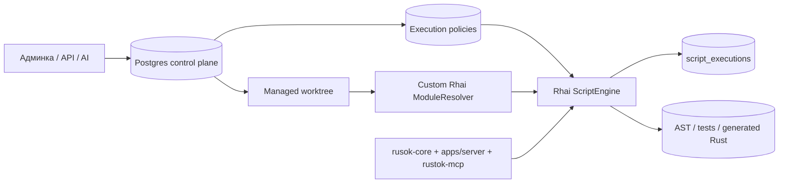

# Аналитический отчёт по Alloy в RusTok

## Executive summary

Доступный подключённый коннектор в этой сессии — **GitHub**. Анализ начат с репозитория **RusTokRs/RusTok** и ограничен им как основным источником. Дополнительно я использовал только первоисточники по Rhai и Rust для проверки технической реализуемости sandbox-ограничений, модульного резолвера и потокобезопасности движка. citeturn6view0turn11view0turn13view0

Главный вывод: **концепт Alloy в репозитории уже частично реализован как рабочий runtime для Rhai-скриптов**, но пока только как ранний фундамент, а не как завершённый Self‑Evolving Integration Runtime. В коде уже есть модель скрипта, хранилище в памяти и в SeaORM/Postgres, ручной запуск, event hooks, cron-scheduler, REST/GraphQL-поверхности и execution log. При этом отсутствуют или недоведены до production-уровня ключевые элементы, которые концепт прямо обещает: полноценное внутреннее пространство для многофайловых Rhai-пакетов, version control на уровне ревизий, управляемый host surface, реальное enforcement sandbox-лимитов, whitelist для HTTP, самоотладка, AI-генерация, native compilation Rhai → Rust и pipeline hot swap. fileciteturn84file0L3-L3 fileciteturn85file0L3-L3 fileciteturn87file0L3-L3 fileciteturn46file0L3-L3 fileciteturn49file0L3-L3 fileciteturn60file0L3-L3 fileciteturn43file0L3-L3 fileciteturn73file0L3-L3

Самое важное для вашей задачи: **Rhai уже можно запускать и тестировать внутри Alloy**, и это подтверждается несколькими слоями репозитория — unit-тестами `ScriptEngine`, интеграционными тестами orchestrator/hook-flow, REST/GraphQL валидацией/запуском, а также включением `mod-alloy` в default features сервера и bootstrap-инициализацией Alloy runtime при старте приложения. Но в текущем состоянии это скорее **“можно запускать базовые сценарии”**, чем **“можно безопасно и полноценно запускать всю экосистему концепта”**. Ограничения особенно заметны в безопасности и изоляции: timeout сейчас в основном логируется, а не прерывает исполнение; HTTP-мост не имеет whitelist; `permissions` и `run_as_system` сохраняются, но по путям исполнения почти не применяются; а тест на operation limit в самом crate допускает и ошибку лимита, и успешное завершение, то есть текущая семантика лимита не закреплена жёстко. fileciteturn82file0L3-L3 fileciteturn83file0L3-L3 fileciteturn65file0L3-L3 fileciteturn81file0L3-L3 fileciteturn80file0L3-L3 fileciteturn90file0L3-L3 fileciteturn93file0L3-L3

Рекомендуемая целевая архитектура: **не делать файловую систему источником истины**. Лучше реализовать внутреннее пространство Alloy как **управляемый встроенный репозиторий**, где **Postgres/SeaORM остаётся контрольной плоскостью и source of truth**, а файловое дерево является **материализованным worktree и экспортом для version control, review, AI и native compilation**. Это наилучшим образом совпадает и с концептом, который прямо фиксирует модель “**БД (источник правды) + файлы (version control)**”, и с возможностями Rhai, который поддерживает собственный `ModuleResolver`, то есть imports можно резолвить не с диска напрямую, а из управляемого repository layer. fileciteturn73file0L3-L3 citeturn11view0turn6view0

Наконец, важное ограничение исследования: файл `docs/alloy-concept.md` **не отсутствует**, но в репозитории он читается как систематически испорченная кодировка (mojibake). Ниже я исхожу из того, что это воспроизводимое CP1251→UTF‑8 искажение, потому что после обратной интерпретации заголовки и основной текст превращаются в связный русский документ. Это — **явно отмеченное предположение анализа**, а не гарантированное свойство исходного файла. fileciteturn69file0L3-L3

## Что зафиксировано в концепте и что уже есть в коде

В концепте Alloy описан не просто как scripting-addon, а как самостоятельный capability/runtime layer: он получает задачу на естественном языке, пишет исполняемый код, запускает его в sandbox, исправляет мелкие ошибки, а устойчивые сценарии переводит в нативные Rust-модули. Там же явно зафиксированы ключевые архитектурные решения: Alloy — это отдельный горизонтальный capability layer, RusToK для него — host-platform; минимальная сборка Alloy возможна и вне полного RusToK; а для хранения скриптов выбрана схема “БД как источник правды + файлы для version control”. В документе также есть явный жизненный цикл “AI пишет Rhai-скрипт интеграции → sandbox → diff/auto-patch → cargo build → нативный модуль” и дорожная карта с переходом от Foundation к AI Core, Integration Runtime, Native Compilation и Ecosystem. fileciteturn70file0L3-L3 fileciteturn71file0L3-L3 fileciteturn73file0L3-L3

С точки зрения текущего кода, база под это действительно есть. В `crates/alloy/src/lib.rs` Alloy уже оформлен как модуль RusToK, экспортирует runtime, storage, scheduler, execution log, GraphQL/REST и тесты. В модели `Script` уже присутствуют `tenant_id`, `name`, `code`, `trigger`, `status`, `version`, `run_as_system`, `permissions`, `author_id`, а в миграции `scripts` уже создана таблица с уникальностью `(tenant_id, name)`, JSON-полями для trigger/permissions и счётчиками ошибок. Это означает, что Alloy в репозитории уже мыслится как multi-tenant runtime со штатным persistence-слоем. fileciteturn82file0L3-L3 fileciteturn84file0L3-L3 fileciteturn53file0L3-L3 fileciteturn55file0L3-L3

Но между концептом и кодом есть несколько важных разрывов. Концепт говорит о многофайловой экосистеме и прямо показывает YAML, в котором `transform.script` указывает на `scripts/ga4_compare.rhai`, то есть путь к отдельному файлу внутри некоего внутреннего пространства. В текущей реализации код скрипта — это просто одно поле `code: String` в записи `scripts`; интерфейс `ScriptRegistry` управляет объектом `Script` целиком и не знает ни про пакеты/модули, ни про imports, ни про ревизии, ни про materialized worktree. Иными словами, **концепт уже предполагает script space уровня package/repository, а код пока находится на уровне single-file record storage**. fileciteturn70file0L3-L3 fileciteturn84file0L3-L3 fileciteturn85file0L3-L3 fileciteturn87file0L3-L3

Второй разрыв — governed sandbox. Концепт отдельно фиксирует ограничения: нет доступа к файловой системе, HTTP только через whitelist, процессы запрещены, память лимитируется, запись в БД только через явный API, бесконечные циклы режутся timeout-ом. В коде же `EngineConfig` действительно содержит `max_operations`, `timeout`, `max_call_depth`, `max_string_size`, `max_array_size`, `max_map_depth`, но в `ScriptEngine::new` реально включаются только `set_allow_looping`, `set_allow_shadowing` и `set_strict_variables`; лимиты Rhai на операции, размер строки, массивы, maps и глубину функций там не настраиваются. Более того, при исполнении timeout лишь сравнивается постфактум и логируется warning, а не вызывает принудительное прекращение исполнения. Это не соответствует формулировкам концепта о sandbox enforcement. fileciteturn71file0L3-L3 fileciteturn89file0L3-L3 fileciteturn90file0L3-L3 citeturn10view0turn10view1turn8view1turn8view2turn9view1

Третий разрыв — текущий мост к внешнему миру. В концепте внешний мир должен даваться Alloy как governed surface от host-platform: auth, permissions, events, module APIs, execution policy и UI shell. В коде же `ExecutionContext` кладёт в scope только `EXECUTION_ID`, `PHASE`, `TIMESTAMP`, `USER_ID`, `TENANT_ID`, `entity`, `entity_before` и `params`; `Bridge::register_db_services` пока пустой; а `bridge/http.rs` регистрирует `http_get`, `http_post`, `http_request` через `reqwest::Client::new()` без явного whitelist и без policy layer. Причём на практическом пути исполнения основной runtime сейчас создаётся через `create_default_engine()`, который регистрирует utils и entity proxy, но **не вызывает** `Bridge::register_for_phase`, поэтому phase-aware host surface вообще не попадает в основной движок. Из этого следует, что концепт описывает более богатый и более строго управляемый host surface, чем есть сейчас. fileciteturn91file0L3-L3 fileciteturn92file0L3-L3 fileciteturn93file0L3-L3 fileciteturn82file0L3-L3

Четвёртый разрыв — эксплуатационная зрелость. Execution log уже существует и пишет в таблицу `script_executions`, но универсальной фиксации каждого запуска в самом executor/orchestrator нет: логирование явно делается в GraphQL mutation и server controller для manual-run, тогда как hook-пути и scheduler не используют логгер как обязательную часть pipeline. Также REST-пути создания/обновления скрипта не компилируют скрипт до сохранения, хотя GraphQL-пути это делают. А scheduler умеет загрузить cron jobs при старте, но по текущему коду нет явного механизма live-refresh после create/update/delete скрипта. Это всё означает, что “дорожная карта” и “архитектурные решения” концепта в коде начаты, но ещё не собраны в завершённую систему. fileciteturn46file0L3-L3 fileciteturn50file0L3-L3 fileciteturn60file0L3-L3 fileciteturn43file0L3-L3 fileciteturn94file0L3-L3

## Проект внутреннего пространства Rhai-скриптов

Если следовать концепту буквально, внутреннее пространство Alloy должно быть не “папкой со скриптами”, а **операционной средой для Rhai-экосистемы**: скрипты, модули, imports, тесты, fixtures, policy, generated artifacts, history ревизий, audit trail и подготовка к Rhai → Rust. Сам концепт фиксирует целевой принцип хранения — “БД (источник правды) + файлы (version control)” — и это удачно совпадает с моделью Rhai, где возможен собственный `ModuleResolver`, то есть прямой доступ скрипта к диску не нужен вовсе: imports могут обслуживаться внутренним repository layer и материализованным worktree. fileciteturn73file0L3-L3 citeturn11view0turn10view1

Я рекомендую построить **четырёхслойное внутреннее пространство**:

| Слой | Назначение | Источник истины | Что хранится |
|---|---|---|---|
| Control plane | Управление пакетами, правами, версиями, политиками | Postgres / SeaORM | `scripts`, `script_revisions`, `script_modules`, `script_tests`, `script_policies`, `script_artifacts`, `script_bindings`, `script_secrets_refs` |
| Content plane | Материализация пакета для review/AI/build | Managed worktree / object storage | `alloy.toml`, `src/*.rhai`, `tests/*.json`, `fixtures/*`, snapshots |
| Execution plane | Компиляция, AST-cache, runtime-изоляция | In-memory cache | compiled AST, namespace cache, import graph, policy snapshot |
| Artifact plane | Результаты исполнения и native pipeline | DB + object storage | execution logs, dry-run reports, diff reports, generated Rust, build bundles |

В качестве **минимального продакшн-формата пакета** я бы ввёл объект `ScriptPackage`, а не просто `Script`. Один пакет должен иметь один entrypoint, но при этом содержать много модулей и тестов. Базовая файловая форма может выглядеть так:

```text
alloy-space/
  tenants/{tenant_id}/
    packages/{namespace}/{script_name}/
      alloy.toml
      src/
        main.rhai
        modules/
          common.rhai
          mappings.rhai
          http_client.rhai
      tests/
        happy-path.case.json
        auth-failure.case.json
      fixtures/
        input-order.json
        stripe-event.json
      policy/
        execution.toml
      snapshots/
        latest-output.json
      artifacts/
        ast.json
        generated/
          lib.rs
          Cargo.toml
```

Ключевой момент: **это пространство не должно быть напрямую доступно самому Rhai-скрипту как файловая система**. По концепту FS запрещён, и это правильное решение. Файловое дерево должно существовать для редактора, review, AI и build-pipeline, а runtime должен видеть его через `ModuleResolver` и host APIs. То есть runtime не делает `import "/tmp/.../foo.rhai"`, а резолвит, например, `import "tenant://sales/discounts/common" as common;`, после чего resolver достаёт модуль из DB/worktree под политическим контролем. Это прямо укладывается в Rhai `ModuleResolver`, который предназначен для резолвинга модулей по path string и может возвращать как `Module`, так и `AST`. citeturn11view0turn10view1

Ниже — рекомендуемая схема метаданных пакета.

| Объект | Ключевые поля | Для чего нужно |
|---|---|---|
| `scripts` | `script_id`, `tenant_id`, `namespace`, `name`, `entrypoint_module`, `status`, `current_revision_id`, `permissions_policy_id`, `run_as_system`, `owner`, `created_at`, `updated_at` | Карточка пакета и routing |
| `script_revisions` | `revision_id`, `script_id`, `semver`, `checksum`, `source_kind`, `created_by`, `review_status`, `published_at` | История ревизий и rollback |
| `script_modules` | `module_id`, `revision_id`, `module_path`, `content`, `content_hash`, `is_entrypoint` | Многофайловая структура Rhai |
| `script_tests` | `test_id`, `revision_id`, `name`, `fixture_ref`, `expected_snapshot`, `kind`, `timeout_ms` | Встроенное тестирование |
| `script_policies` | `policy_id`, `allowed_hosts`, `allowed_bindings`, `network_mode`, `max_operations`, `max_call_levels`, `max_string_size`, `max_array_size`, `max_map_size` | Реальная sandbox-политика |
| `script_artifacts` | `artifact_id`, `revision_id`, `kind`, `storage_ref`, `build_hash`, `status` | AST, dry-run, generated Rust, binary module |
| `script_bindings` | `binding_id`, `revision_id`, `name`, `binding_type`, `schema`, `scope` | Разрешённый host surface |
| `script_secrets_refs` | `secret_ref_id`, `revision_id`, `logical_name`, `provider_key`, `rotation_policy` | Работа с секретами без утечки в код |

Практически это даёт три критически полезных эффекта. Во‑первых, package становится **diffable** и reviewable человеком и AI. Во‑вторых, same package можно тестировать на ревизии, а не на mutable текущем состоянии. В‑третьих, путь к native compilation появляется естественно: конкретная `revision_id` превращается в reproducible build input.

Для наглядности целевая архитектура внутреннего пространства выглядит так:



### Сравнение вариантов хранения

Ниже — экспертная оценка трёх вариантов хранения внутреннего пространства. Это не измеренные бенчмарки, а архитектурное сравнение на основе текущего кода, концепта и модели Rhai imports. Базовый архитектурный ориентир в концепте — гибрид “БД + файлы”, а Rhai позволяет скрыть фактическое хранение за `ModuleResolver`. fileciteturn73file0L3-L3 citeturn11view0

| Вариант | Производительность | Удобство разработки | Безопасность | Масштабируемость | Сложность реализации | Вывод |
|---|---:|---:|---:|---:|---:|---|
| Файловая система | 5 | 5 | 2 | 3 | 2 | Хороша как materialized worktree, плоха как source of truth |
| База данных | 4 | 3 | 5 | 5 | 3 | Лучший кандидат на control plane и runtime lookup |
| Встроенный репозиторий | 4 | 5 | 5 | 5 | 5 | Целевой production-вариант для Alloy-экосистемы |

**Рекомендация:** в ближайшем цикле реализовать **гибрид DB + managed worktree**, а в целевом состоянии оформить это как **встроенный repository service** поверх DB/object storage. Тогда вы будете следовать концепту, не жертвуя безопасностью.

## Можно ли запускать и тестировать Rhai внутри Alloy

Короткий ответ: **да, уже можно**, и репозиторий это подтверждает по нескольким независимым линиям. В `crates/alloy/src/lib.rs` есть unit-тесты на простой запуск, abort, доступ к `EntityProxy`, cache invalidation, phase-specific engine и интеграцию orchestrator со storage. В `integration/mod.rs` есть уже более доменный сценарий — создание сущности `Deal` с before/on_commit hooks, где один скрипт валидирует сумму сделки, а другой срабатывает на commit. Это означает, что Alloy уже умеет исполнять Rhai в режиме unit/integration tests внутри собственного crate и в сценариях доменного hook orchestration. fileciteturn82file0L3-L3 fileciteturn83file0L3-L3 fileciteturn65file0L3-L3

Кроме тестов, есть и эксплуатационные входы. REST API даёт `POST /scripts/validate`, `POST /scripts/{id}/run` и `POST /scripts/name/{name}/run`; GraphQL умеет `create_script`, `update_script`, `run_script`; server-side bootstrap включает feature `mod-alloy` по умолчанию и вызывает `alloy::init(ctx)` во время старта runtime. Это означает, что Rhai inside Alloy уже можно не только тестировать, но и реально гонять внутри server runtime RusTok. fileciteturn49file0L3-L3 fileciteturn50file0L3-L3 fileciteturn60file0L3-L3 fileciteturn81file0L3-L3 fileciteturn80file0L3-L3

С технической точки зрения это реалистично ещё и потому, что сам Rhai для этого подходит. Документация `rhai` показывает, что `Engine` поддерживает `compile`, `eval_ast`, `set_max_operations`, `set_max_call_levels`, `set_max_string_size`, `set_max_array_size`, `set_max_map_size`, `disable_symbol`, `on_progress` и `set_module_resolver`. Также `Engine` не является `Send + Sync` сам по себе, но с feature `sync` может им стать; в репозитории Rhai включён с feature `sync`, а значит архитектурно вы уже находитесь в допустимой зоне для server-side shared runtime. citeturn6view0turn10view0turn10view1turn8view1turn8view2turn9view1 fileciteturn81file0L3-L3

Но полноценный ответ всё же звучит так: **запускать — да; тестировать — да; запускать именно “всю экосистему из концепта” — пока нет**. Ограничения здесь существенные.

Прежде всего, текущий `ScriptEngine` конфиг хранит лимиты, но не wiring’ит их в Rhai engine. Это видно и по коду, и косвенно по тесту `test_operation_limit`, который считает допустимым как выброс `OperationLimit`, так и успешное завершение цикла до миллиона итераций. То есть даже сам тестовый контракт признаёт, что operation limit ещё не является гарантированным свойством движка. Timeout тоже не рвёт исполнение, а лишь пишет warning после завершения. Для production sandbox это недостаточно. fileciteturn89file0L3-L3 fileciteturn90file0L3-L3 fileciteturn82file0L3-L3

Второе ограничение — текущий host surface. Концепт требует whitelist-HTTP и явные API, а `bridge/http.rs` сейчас делает произвольные запросы через `reqwest` без whitelist. Плюс `Bridge::register_db_services` пустой, а основной runtime создаётся через `create_default_engine`, который phase-aware bridge вообще не подключает. Иначе говоря, сегодня Alloy может исполнять Rhai, но ещё не исполняет его в том “управляемом capability surface”, который обещан в концепте. fileciteturn71file0L3-L3 fileciteturn92file0L3-L3 fileciteturn93file0L3-L3 fileciteturn82file0L3-L3

Третье ограничение — отсутствие package-level tooling. Концепт уже намекает на файл-путь `scripts/ga4_compare.rhai`, а текущий storage оперирует только строковым полем `code`. Значит, тестирование imports, модульных зависимостей, ревизий и generated Rust pipeline в текущей модели почти некуда встроить. Это не мешает unit-test’ам одиночных скриптов, но мешает тестировать экосистему Alloy как platform feature. fileciteturn70file0L3-L3 fileciteturn84file0L3-L3 fileciteturn85file0L3-L3

С инженерной точки зрения правильный ответ на вопрос “можно ли тестировать Rhai внутри Alloy?” выглядит так:

| Уровень | Статус сейчас | Что нужно для production-готовности |
|---|---|---|
| Compile-time validation | Есть | Сделать обязательной при create/update во всех интерфейсах |
| Unit execution | Есть | Зафиксировать sandbox limits как обязательный контракт |
| Event hooks | Есть | Добавить universal audit log и permission checks |
| Manual/API execution | Есть | Включить policy engine и consistent validation |
| Scheduler execution | Частично есть | Добавить live-refresh job registry и durable execution log |
| Multi-file package tests | Нет | Ввести package/revision/module model |
| Dry-run / replay | Нет | Добавить fixtures, snapshots, policy sandbox |
| Rhai → Rust equivalence tests | Нет | Ввести artifact pipeline и golden tests |

### Технический контур запуска и тестирования


## План до логического завершения

Ниже — предложенный план не просто “до следующего спринта”, а **до логического завершения концепта**, то есть до состояния, в котором Alloy действительно становится тем capability/runtime layer, который описан в `docs/alloy-concept.md`. Дорожная карта концепта я использую как стратегический ориентир, но здесь она разложена в инженерные workstreams и критерии готовности. fileciteturn73file0L3-L3

| Этап | Цель | Основные работы | Критерий завершения |
|---|---|---|---|
| Стабилизация ядра | Превратить текущий runtime в жёстко контролируемый sandbox | wired limits Rhai, timeout через `on_progress`, cache key по tenant/revision, обязательная compile validation, consistent error model | Любой запуск подчиняется policy и воспроизводим |
| Внутренний repository layer | Перейти от `code: String` к package/revision/model | новые таблицы ревизий/модулей/тестов, materialized worktree, `ModuleResolver` | Скрипт = пакет с entrypoint, imports, тестами и историей |
| Governed host surface | Отделить Alloy от “сырых” библиотек и дать ему безопасное API | `HostSurface` trait, policy-aware HTTP, bindings registry, secrets refs, auth/tenant/permissions injection | Скрипт не делает ничего вне явно разрешённого surface |
| Полный test harness | Сделать Rhai development-loop воспроизводимым внутри Alloy | fixtures, snapshots, dry-run, regression tests, deterministic mocks | Менять Rhai-пакеты можно безопасно и с rollback |
| AI Core | Реализовать авто-генерацию и авто-патчинг в рамках policy | AiProvider trait, prompt templates, patch review flow, AI-generated tests | Alloy создаёт и чинит пакеты под наблюдением |
| Native compilation | Довести путь Rhai → Rust до рабочего pipeline | generated Rust crate, equivalence tests, build sandbox, artifact registry, hot swap | Горячие сценарии переводятся в native modules без ручного переписывания |
| Ecosystem | Сделать Alloy многократно используемой capability-platform | SDK, UI, marketplace, importable presets, external hosts | Alloy живёт не как внутренний эксперимент, а как платформа |

### Что делать в ближайшей реализации

**Первый обязательный блок** — довести текущее ядро до строгого runtime-контракта. Это включает: перевод `EngineConfig` в реальные вызовы Rhai (`set_max_operations`, `set_max_call_levels`, `set_max_string_size`, `set_max_array_size`, `set_max_map_size`), включение `on_progress` для жёсткого timeout-abort, перенос HTTP в policy-aware binding layer, запрет произвольного HTTP по умолчанию, и единое обязательное compile-before-save для REST/GraphQL/controllers. Это минимальный набор, без которого дальнейшая экосистема будет строиться на непрочной основе. fileciteturn89file0L3-L3 fileciteturn90file0L3-L3 fileciteturn50file0L3-L3 fileciteturn60file0L3-L3 fileciteturn62file0L3-L3 citeturn10view0turn10view1turn8view1turn8view2

**Второй обязательный блок** — внедрить repository layer для Rhai packages. Здесь я бы не делал “Git внутри БД” и не делал “папки напрямую на диске”. Правильнее ввести DB-модель ревизий и модулей, а затем сервис materialization, который собирает revision в worktree. Это даст и control plane, и привычное файловое представление. Параллельно нужен `ModuleResolver`, который сможет разрешать imports из `script_modules` и, при желании, из materialized worktree для tooling/debug. fileciteturn73file0L3-L3 fileciteturn84file0L3-L3 fileciteturn85file0L3-L3 citeturn11view0

**Третий обязательный блок** — привести execution paths к единообразию. Сейчас лог исполнения, compile validation и host surface подключены не одинаково на всех маршрутах. Нужно, чтобы manual run, API run, before/after/on_commit и scheduler использовали один и тот же execution pipeline: `load revision → compile policy snapshot → resolve imports → run → record execution log → emit metrics → decide retry/disable`. Это упростит и безопасность, и тестирование, и последующую native compilation. fileciteturn46file0L3-L3 fileciteturn94file0L3-L3 fileciteturn95file0L3-L3 fileciteturn43file0L3-L3

**Четвёртый блок** — AI Core. Концепт явно предполагает автогенерацию Rhai, auto-patch мелких ошибок, подтверждение логических изменений человеком и AI-generated tests. Это надо внедрять только после того, как package/revision/policy/test harness готовы; иначе AI будет менять mutable scripts без нормальной трассировки и rollback. В этом слое я бы ввёл строгий workflow: `draft revision → AI proposes diff → compile + tests + policy scan → human approve logical diff → publish`. fileciteturn70file0L3-L3 fileciteturn71file0L3-L3 fileciteturn73file0L3-L3

**Пятый блок** — native compilation. Логическое завершение концепта невозможно без рабочего пути “Rhai package → generated Rust crate → cargo test → cargo build → signed artifact → hot swap / marketplace”. Именно на этом этапе Alloy перестаёт быть только sandbox runtime и становится self-evolving runtime в смысле документа. Здесь критичен не просто генератор Rust, а **equivalence layer**: generated module должен доказывать поведенческое соответствие исходной Rhai-ревизии на golden fixtures. fileciteturn70file0L3-L3 fileciteturn71file0L3-L3 fileciteturn73file0L3-L3

## Изменения в кодовой базе, тестах и CI/CD

Ниже — все ключевые места в репозитории, где изменения требуются или крайне вероятны по результатам анализа. Это именно “найденные точки входа”, а не абстрактный wishlist.

| Путь | Текущая роль | Что менять |
|---|---|---|
| `crates/alloy/src/lib.rs` | фабрики engine/orchestrator, модуль Alloy, unit tests | сделать phase/policy-aware default engine; добавить package-level test helpers; убрать двусмысленность `test_operation_limit` |
| `crates/alloy/src/engine/config.rs` | декларация лимитов | расширить policy-полями network/import/bindings; привязать к runtime policy snapshot |
| `crates/alloy/src/engine/runtime.rs` | core `ScriptEngine`, compile/cache/execute | применить реальные Rhai limits; ввести `on_progress`; заменить cache key на `tenant_id + script_id + revision_id`; добавить `ModuleResolver` |
| `crates/alloy/src/context.rs` | scope injection | добавить auth context, effective permissions, binding scope, request metadata |
| `crates/alloy/src/bridge/mod.rs` | phase-aware registration | перестроить в policy-aware governed surface; реализовать `register_db_services`; убрать пустые stubs |
| `crates/alloy/src/bridge/http.rs` | внешний HTTP доступ | whitelist, quotas, SSRF protection, secret headers via refs, deterministic mocks для tests |
| `crates/alloy/src/model/script.rs` | single-record model | превратить в package header; добавить namespace/current_revision/source_kind/checksum/test_status |
| `crates/alloy/src/storage/traits.rs` | storage contract | расширить до revision/module/test/artifact queries |
| `crates/alloy/src/storage/sea_orm.rs` | DB persistence | добавить новые таблицы и методы; ввести optimistic locking/compare-and-swap на ревизиях |
| `crates/alloy/src/storage/memory.rs` | test storage | поддержать revisions/modules/tests для полного in-memory harness |
| `crates/alloy/src/migration.rs` и `src/migrations/*` | схема `scripts` и `script_executions` | добавить `script_revisions`, `script_modules`, `script_tests`, `script_artifacts`, `script_policies`, индексы и FK |
| `crates/alloy/src/runner/executor.rs` | единичное исполнение | universal execution log, policy snapshot, dry-run mode, consistent timeout/error semantics |
| `crates/alloy/src/runner/orchestrator.rs` | before/after/manual/api routes | унифицировать pipeline, внедрить permission checks, tenant-aware execution context |
| `crates/alloy/src/runtime.rs` | shared runtime/scheduler wiring | repository service, resolver cache, scheduler refresh on publish/update |
| `crates/alloy/src/scheduler/runner.rs` | cron jobs | live reload, distributed lock, durable retry policy, log record per run |
| `crates/alloy/src/api/handlers.rs` | generic REST API | compile-before-save, revision publish flow, test endpoints, dry-run endpoints |
| `crates/alloy/src/controllers/mod.rs` | server REST routes | то же, плюс tenant/policy enforcement и richer run/test responses |
| `crates/alloy/src/graphql/mutation.rs` и `query.rs` | GraphQL surface | revision/test/publish/rollback operations, package graph, artifact status |
| `crates/alloy/src/execution_log/storage.rs` | log persistence | охватить hooks/scheduler/native builds, хранить policy snapshot/build ref |
| `apps/server/src/services/app_runtime.rs` | bootstrap runtime | инициализировать repository layer, secret provider, policy service, mocks in tests |
| `apps/server/src/app.rs` | after_routes/startup tests | добавить smoke-tests Alloy runtime, module resolver, policy enforcement |
| `apps/server/Cargo.toml` | features/deps | dev-deps для integration harness, feature flags для native build sandbox |

### Набор новых каталогов и модулей, который стоит добавить

| Новый путь | Назначение |
|---|---|
| `crates/alloy/src/repository/mod.rs` | package/revision service |
| `crates/alloy/src/repository/worktree.rs` | materialization/export |
| `crates/alloy/src/repository/resolver.rs` | Rhai `ModuleResolver` |
| `crates/alloy/src/policy/mod.rs` | execution/network/bindings policy |
| `crates/alloy/src/testing/mod.rs` | fixtures/snapshots/harness |
| `crates/alloy/src/testing/mock_host.rs` | deterministic host bindings для CI |
| `crates/alloy/src/native/mod.rs` | Rhai → Rust artifact pipeline |
| `crates/alloy/src/native/equivalence.rs` | golden tests between Rhai and Rust |
| `crates/alloy/tests/packages/*` | end-to-end test packages |

### Сценарии тестирования

Текущая тестовая база уже показывает правильное направление: простое исполнение, abort, entity mutation, orchestrator integration, domain hook-flow с `Deal`, startup smoke tests сервера. Следующий шаг — не просто “дописать ещё тестов”, а ввести **иерархию тестовых сценариев**, соответствующую будущей экосистеме Alloy. fileciteturn82file0L3-L3 fileciteturn83file0L3-L3 fileciteturn65file0L3-L3 fileciteturn79file0L3-L3

| Класс тестов | Что проверяет | Где запускать |
|---|---|---|
| Unit | compile/execute, limits, resolver, bindings | `crates/alloy` |
| Package integration | imports, fixtures, snapshots, revision publish/rollback | `crates/alloy/tests` |
| Policy tests | allowed hosts, denied hosts, permission mismatch, run_as_system | `crates/alloy/tests/policy_*` |
| Server integration | REST/GraphQL create/validate/run/test/publish | `apps/server` |
| Scheduler tests | cron loading, refresh after update, concurrent protection | `crates/alloy` + server |
| Native equivalence | Rhai vs generated Rust on same fixture set | `crates/alloy/src/native` |
| Regression | replay production-like fixtures on published revisions | CI nightly + release branch |

### CI/CD интеграция

Лучший практический вариант — сделать **двухконтурный CI**.

**Быстрый контур на каждый PR** должен включать `cargo fmt`, `clippy`, unit tests, package compile tests, policy tests, server smoke tests и миграции. Он должен валить PR, если ревизия Rhai не компилируется, нарушает policy или ломает snapshots.

**Тяжёлый контур** — на merge/nightly/release — должен запускать fixture regression, scheduler tests, large-package import tests и, когда появится native pipeline, equivalence suite Rhai ↔ Rust.

Полезный минимальный набор стадий:

| Стадия CI | Содержимое |
|---|---|
| Lint | `fmt`, `clippy`, schema checks |
| Migrations | прогон миграций Alloy и rollback-check |
| Fast tests | unit + package compile + resolver tests |
| Policy tests | whitelist, secrets refs, permission gates |
| API tests | REST/GraphQL create/update/run/test |
| Integration | scheduler + runtime bootstrap + tenant isolation |
| Native pipeline | generate/test/build only on tagged branches |
| Release gate | publish revision manifest + artifact checksums |

Практически это означает, что каждое изменение в Alloy должно сопровождаться не только Rust tests, но и **изменениями в package fixtures**. Это особенно важно, если вы пойдёте по пути AI-generated scripts: без deterministic fixture suite качество будет деградировать.

## Риски, рекомендации и открытые вопросы

Самый серьёзный риск — **перепутать “скриптовый runtime” и “экосистему Alloy”**. Сейчас в репозитории уже можно успешно исполнять Rhai, и это создаёт ложное ощущение, что основная часть работы сделана. На самом деле концепт требует намного большего: revisioned package space, governed host surface, AI patch loop, native compilation, marketplace и lifecycle управления. Если продолжать развивать только `code: String` + manual run, получится хороший скриптовый движок, но не Alloy в смысле концепта. fileciteturn84file0L3-L3 fileciteturn73file0L3-L3

Второй риск — **безопасность по умолчанию**. Концепт обещает жёсткий sandbox, а текущая реализация пока ближе к “добросовестному приложению”, чем к policy-enforced runtime. Особенно опасны unrestricted HTTP, постфактумный timeout, неполное применение лимитов и отсутствие строгого permission enforcement по полям `permissions` / `run_as_system`. Это нужно закрыть раньше, чем появятся AI-generated scripts. fileciteturn71file0L3-L3 fileciteturn90file0L3-L3 fileciteturn93file0L3-L3 fileciteturn84file0L3-L3

Третий риск — **неправильный выбор authoritative storage**. Если сделать authoritative filesystem, быстро появятся проблемы с tenant isolation, ревизиями, race conditions, аудитом и доступом. Если сделать authoritative только DB и не добавить materialized package/worktree, будет неудобно review-ить, генерировать, тестировать и готовить Rhai → Rust pipeline. Поэтому лучшая стратегия — та, которую уже подсказывает концепт: DB как source of truth, файлы как представление для version control, а поверх этого — встроенный repository service. fileciteturn73file0L3-L3

Четвёртый риск — **разнородность execution paths**. Сейчас create/update/run/logging/scheduler ведут себя не одинаково в REST, GraphQL и hooks. Если это не унифицировать рано, позже возникнет хрупкий ландшафт, где одни пути проверяют compile, другие — нет; одни пишут execution log, другие — нет; одни используют policy, другие — обходят. Для Alloy как capability layer это критично. fileciteturn50file0L3-L3 fileciteturn60file0L3-L3 fileciteturn94file0L3-L3 fileciteturn95file0L3-L3

Моя итоговая рекомендация выглядит так:

| Приоритет | Рекомендация |
|---|---|
| Немедленно | Зафиксировать sandbox и policy contract на уровне `ScriptEngine` |
| Очень скоро | Перевести хранение на package/revision model с DB source of truth |
| Очень скоро | Ввести custom `ModuleResolver` и materialized worktree |
| До AI Core | Унифицировать execution pipeline и audit/logging |
| До Native Compilation | Встроить deterministic test harness с fixtures/snapshots |
| Перед production AI | Закрыть whitelist, secrets refs, permission enforcement |
| Для завершения концепта | Построить Rhai → Rust equivalence pipeline и artifact registry |

### Открытые вопросы и ограничения

Файл `docs/alloy-concept.md` в репозитории присутствует, но читается через коннектор в испорченной кодировке. Явно перечисляю предположения, с которыми построен анализ:

| Предположение | Почему я его делаю |
|---|---|
| Текст концепта восстановим как систематическую CP1251→UTF‑8 ошибку | Заголовки и фразы после обратной интерпретации становятся осмысленным русским документом |
| Архитектурные формулировки концепта следует считать целевыми, а не полностью реализованными | В коде присутствует только часть обещанных функций |
| “Встроенный репозиторий” в этом отчёте — это управляемый repository layer, а не обязательный Git-сервер | Концепт говорит о “БД + файлы”, но не предписывает конкретную DVCS-реализацию |
| Native pipeline пока отсутствует в Alloy crate и должен проектироваться как новый слой | В найденных файлах нет реализованного Rhai → Rust build pipeline |
| Host surface в минимальной сборке должен задаваться trait/API-контрактом | Концепт говорит о host-provided surface, а текущий код этого ещё явно не выделяет |

Если сформулировать всё в одной фразе: **логически завершённый Alloy для RusTok — это не “ещё пару функций в `ScriptEngine`”, а отдельный управляемый repository/runtime/artifact слой, где Rhai уже не просто исполняется, а живёт как ревизируемая, тестируемая, безопасная и компилируемая экосистема**. Это направление полностью совместимо с текущей кодовой базой, но требует перехода от single-script storage к package-oriented architecture. fileciteturn84file0L3-L3 fileciteturn73file0L3-L3