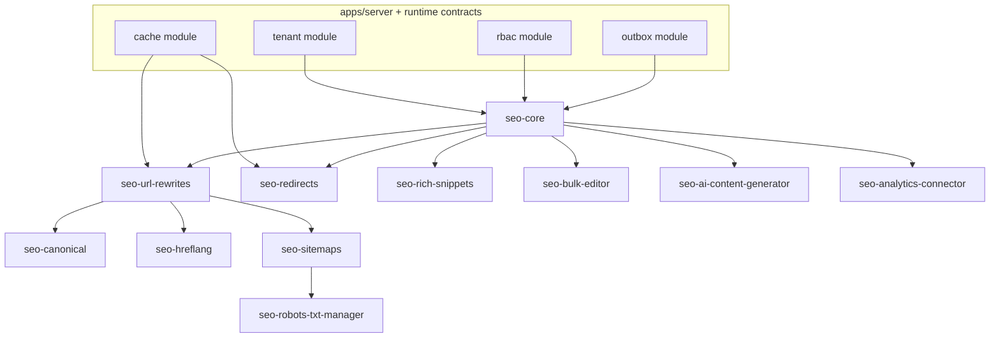
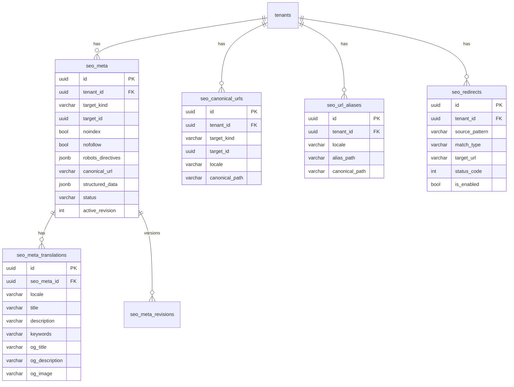

# SEO Suite for RusToK: Current Architecture Analysis and Detailed Implementation Plan

## Executive Summary

RusToK is an event-driven modular platform in Rust with a multitenant runtime, manifest-driven composition (`modules.toml`), hybrid API (GraphQL for UI + REST for integrations/ops) and Postgres as the primary database. The repository already contains individual SEO layer elements: polymorphic SEO metadata (`meta`, `meta_translations`) with `noindex/nofollow`, `canonical_url` and `structured_data` (JSONB), as well as URL mapping for content (`content_canonical_urls`, `content_url_aliases`) with locale-aware resolution and fallback.

The key constraint/risk currently: RusToK's multilingual DB contract targets BCP47-like locale tags and `VARCHAR(32)` width for locale columns (and the runtime locale chain is already standardized), but some SEO-related tables still use narrow columns (`VARCHAR(5)`/`VARCHAR(16)`). This needs to be aligned to `VARCHAR(32)` when designing the SEO Suite, otherwise hreflang/locales/fallbacks will break on "long" tags (`en-US`, `pt-BR`, `zh-Hant`, etc.) and on tenant-level locale policy.

Recommended target design: **modular SEO Suite** as a set of optional modules (in RusToK terms: optional modules with tenant enablement via `tenant_modules`) with a core that standardizes SEO parameter storage and API, plus pluggable submodules (redirects / sitemaps / hreflang / rich snippets / bulk editor / AI). Tenant-level enablement/settings are already supported by the platform via the `tenant_modules (enabled, settings jsonb)` table and the `RequireModule` guard.

Per SEO Suite best practices (Amasty / analogs), the following are critical: meta tag templates, canonical management, redirects (with performant implementation and caching for large sets), XML/HTML sitemap, hreflang (in HTML head and/or sitemap), rich snippets/JSON-LD, page SEO analysis/toolbar and AI generation/"fixing" of metadata. RusToK already has a powerful AI control-plane (`rustok-ai`) with multi-provider support (OpenAI-compatible/Anthropic/Gemini), RBAC-first access, task profiles and UI packages (Leptos + Next.js). This allows the AI part of the SEO Suite to be "native" to the platform rather than a separate custom circuit.

## RusToK Context: Architecture, DB and Multilingual Aspects Important for SEO Suite

### Architecture and Modularity

RusToK positions itself as a **modular monolith** with a composition root in `apps/server`, assembly via `modules.toml`, per-tenant enablement of optional modules and event-driven separation of write/read paths (outbox + index/search). `modules.toml` describes core and optional modules, their crates and dependencies. Currently, there is no separate SEO module as an optional module.

Tenant enablement is implemented via the `tenant_modules` table (unique by `tenant_id + module_slug`, settings in JSONB), and access to certain endpoints can be checked by the `RequireModule<M>` guard.

### API Surfaces Needed by SEO Suite

The platform uses a hybrid transport layer: `/api/graphql` (+ subscriptions via `/api/graphql/ws`) as the UI-facing contract and `/api/v1/...` as REST for integrations/ops; there are also OpenAPI endpoints. For Leptos UI, a "dual-path" approach is used: native `#[server]` functions as the preferred internal data layer and parallel GraphQL as a mandatory contract for Next.js/headless/fallback. This is important for SEO Suite UX: admin screens may be Leptos-native-first, but the API must live in GraphQL/REST in parallel.

### Database and Existing SEO Artifacts

The platform maintains a "summary" table map and emphasizes invariants: `tenant_id` is the primary isolation boundary; write-side is the source of truth; JSONB is acceptable for settings/config but not as a canonical form of localized business text.

A **polymorphic meta store** already exists:
- `meta`: `tenant_id`, `(target_type, target_id)`, `noindex`, `nofollow`, `canonical_url`, `structured_data` (jsonb) and a unique index on `(target_type, target_id)`.
- `meta_translations`: relation to `meta`, `locale`, `title/description/keywords`, OpenGraph fields, unique index `(meta_id, locale)`.

**URL mapping for content-family** exists:
- `content_canonical_urls` (canonical URL on `(target_kind, target_id, locale)`) + unique indices on target+locale and on canonical URL.
- `content_url_aliases` (alias → canonical) + indices.
The `CanonicalUrlService` first searches for an alias by `alias_url`, and if found, requires a redirect; otherwise resolves the canonical using locale normalization and locale fallback.

Domain translation tables already have partial SEO fields:
- `product_translations`: `meta_title`, `meta_description` + `handle`.
- `page_translations`: `meta_title`, `meta_description` + `slug`.

### Multilingual Contract: What SEO Suite Must Adhere To

RusToK has standardized the runtime locale selection chain and makes `RequestContext` the source of truth for effective locale (query → `x-medusa-locale` → cookie → `Accept-Language` → `tenant.default_locale` → `en`), plus effective locale restriction via `tenant_locales`, and `Content-Language` on locale-aware HTTP responses.

For DB storage contract, the goal is **parallel localized records**: base rows store language-agnostic state, short localized texts in `*_translations`, "heavy" content in `*_bodies`; locale columns must support normalized BCP47-like tags and `VARCHAR(32)` width. Some foundation tables have already been migrated from `VARCHAR(5)` to `VARCHAR(32)` (e.g., `tenants.default_locale`, `tenant_locales.locale/fallback_locale`).

Implication for SEO Suite: **locale in SEO tables must be `VARCHAR(32)`**, and fallback must be consistent with tenant locale policy and how `CanonicalUrlService`/`resolve_by_locale` work today.

## Best Practices SEO Suite: Amasty and Analogs + Official Search Engine Requirements

### What Actually Constitutes an "SEO Suite" in the Market

Based on public materials from Amasty SEO Toolkit (Magento 2) and similar solutions, the main blocks repeat:

- **Meta templates / metadata automation** (bulk generation of title/description/keywords, templates with variables, application to new products/pages).
- **URL rewrites** (generation of SEO-friendly URLs, regeneration/rebuilding).
- **Redirects** (manual/auto, wildcards, 301/302/307; performance is critical on a large number of redirects; Amasty specifically mentions redirect caching to avoid performance degradation on a large volume of records).
- **Canonical management** (including per-page overrides; cross-domain canonical; exclusions for certain pages, pagination).
- **XML/HTML Sitemaps** (generation, splitting by entity type, exclusions, generation acceleration).
- **Hreflang** (insertion in `<head>` and/or in sitemap; management of store-views/locales).
- **Rich snippets / structured data** (JSON-LD schemas for product/categories/organization, breadcrumbs, sitelinks search box, etc.).
- **SEO toolbar / page audit** (analysis of current page: canonical, robots meta, H1, meta lengths, alt, internal links; some solutions have AI-fix).
- **AI generation and "fixing" of meta content** (e.g., Amasty describes the flow "Fix issues with AI" for category/product/CMS via SEO Toolbar).

### Basic Search Engine Rules to Incorporate into the Design

- **Canonicalization**: Google considers redirects and `rel="canonical"` as strong signals; sitemap is weaker. It is important not to give conflicting canonical signals through different methods and keep the canonical consistent, especially within hreflang clusters.
- **Hreflang**: Google accepts three equivalent methods (HTML / HTTP headers / sitemap) and recommends choosing the most convenient one; each page version must reference itself and all alternatives. A similar recommendation exists from Yandex for marking localized pages (link rel="alternate" hreflang, including `x-default` in relevant scenarios).
- **Sitemaps**: limit of 50,000 URLs or 50MB (uncompressed) per sitemap; larger volumes require splitting into multiple files and a sitemap index; URLs must be absolute and the file must be UTF-8.
- **robots.txt**: the file must be in the root, UTF-8, supports `user-agent/allow/disallow/sitemap`; Google caches robots.txt and has a size limit.
- **Structured Data**: Google recommends JSON-LD as the most convenient for scalable support; "less but correct" (required fields) is more important than "everything with errors". There are general policies/quality guidelines whose violations can disqualify eligibility for rich results, even if the syntax is valid.

## Target Architecture for SEO Suite on RusToK

### Core Integration Principle with RusToK

Given that:
- modules are enabled per-tenant via `tenant_modules`;
- security and tenant/locale/RBAC contract must be unified across all API paths;
- Leptos UI requires native-first, but GraphQL is mandatory in parallel;

the SEO Suite is more rationally built as:
- **One "SEO Core" optional module** (storage + services + basic API + audit/versioning),
- plus **a set of optional submodules** (redirects/canonical+rewrites/hreflang/sitemaps/rich snippets/bulk editor/AI/robots/analytics), which:
  - read/write to their own tables;
  - publish domain events via outbox for async tasks (sitemap regeneration, cache warming, reindex hints), without turning `sys_events` into a "shared audit log" (this is explicitly forbidden by platform philosophy).

### Proposed Module Composition and Dependencies

The table below is the target list of modules (exactly from the required user list), with the most important functionality and dependencies:

| Module | Primary Functionality | Minimum Dependencies | Performance/Security Notes |
|---|---|---|---|
| `seo-core` | unified SEO data model; meta overrides; SEO templates; versioning/rollback; validators | `tenant`, `rbac` (+ optionally `content` for locale normalization/helpers) | locale=VARCHAR(32); strict RBAC; indexing on `(tenant, target_kind, target_id)` |
| `seo-url-rewrites` | canonical URL per entity+locale; alias/rewrites; resolution API | `seo-core` (+ integrations with routing/storefront) | needs fast lookup by `incoming_path` and cache for hot paths |
| `seo-redirects` | 301/302/307 rules; wildcards; 404-handling strategy; import/export | `seo-core` | must include redirect caching for large sets (market explicitly emphasizes this) |
| `seo-canonical` | canonical policy (including exceptions, pagination, cross-domain) | `seo-url-rewrites` | canonical must be consistent with hreflang |
| `seo-hreflang` | hreflang cluster generation and insertion in HTML head and/or sitemap | `seo-url-rewrites`, `tenant` | requirement "each version references all versions + itself" |
| `seo-sitemaps` | XML sitemap + sitemapindex; HTML sitemap; exclude rules; background jobs | `seo-url-rewrites` (+ domain adapters) | limits 50k/50MB, UTF-8, absolute URLs |
| `seo-rich-snippets` | JSON-LD generation and overrides (Product, Organization, Breadcrumb, SearchBox, ItemList, ...) | `seo-core` (+ domain adapters) | JSON-LD recommended as primary format |
| `seo-bulk-editor` | grid/bulk edit by entity; templates/application; CSV/JSON import/export | `seo-core` | be careful with mass updates: batches + background jobs |
| `seo-ai-content-generator` | generation of title/meta/description/JSON-LD; keyword hints; AI-fix for issues | `seo-core` + `rustok-ai` capability | RBAC-first; approvals; logging/data editing |
| `seo-analytics-connector` | integrations with external systems (Search Console / Webmaster / rank tracking); report import | `seo-core` | store tokens/secrets in encrypted secret storage (not in plain JSONB) |
| `seo-robots-txt-manager` | robots.txt, sitemap references, host-specific rules; (optionally `llms.txt`) | `seo-sitemaps` | file in root, UTF-8, supported directives |

### Architectural Module Diagram



## SEO Parameter Storage: Options and Recommended DB Schema

### Storage Strategy Comparison

| Option | How It Looks | Pros | Cons | Where Appropriate in RusToK |
|---|---|---|---|---|
| Single SEO table with polymorphic relations | `seo_meta(tenant_id, target_kind, target_id, ...)` + `seo_meta_translations(locale, ...)` | unified model; unified indices; convenient for bulk operations and audit/versioning; does not inflate domain tables | requires adapters for domain entities; needs target_kind taxonomy thought through | Best candidate, as a similar pattern already exists (`meta`/`meta_translations`) |
| SEO tables per entity | `product_seo`, `category_seo`, `page_seo`... | simple mapping logic; fewer polymorphic conditions | explosion of tables and API; harder common bulk editor; harder unified audit | Not recommended for RusToK given the "SEO Suite" goal (too many modules/tables) |
| SEO fields inside domain translation tables | `product_translations.meta_title`... | minimum new tables | field inconsistency across entities; hard to add new attributes (og/twitter/robots/schema); hard to version and roll back centrally | Currently partially done for products/pages. Should be considered as legacy/fallback layer. |
| Translations in separate tables | `*_translations(locale VARCHAR(32), ...)` | matches RusToK's target contract (parallel localized records) | requires migration of legacy variants | This is the platform's target standard |
| JSONB for localized translations | `seo_meta.localized_jsonb` | flexible in early stages | contradicts the target i18n storage contract; worse indexing/search; harder to validate completeness | RusToK explicitly aims to move away from "inline localized JSON" and establishes migration-based cleanup |

### Recommendation: "Extend and Standardize the Existing Polymorphic Layer" as SEO Core

The most rational approach is **not to introduce a new parallel mechanism**, but to transform the already existing `meta`/`meta_translations` into "SEO Core storage", adding:
- alignment of `locale` to `VARCHAR(32)` (in accordance with the ADR on multilingual DB storage);
- additional fields for robots directives (as an extensible structure, not just `noindex/nofollow`), social meta (twitter cards), as well as versioning/rollback;
- a clear `target_kind` (replace/extend `target_type` to `VARCHAR(64)`) to accommodate all entities: `product`, `category`, `page`, `filter_page`, `cms`, `blog_post`, etc.
Currently, `meta_translations.locale` is created as `string_len(5)`, which conflicts with the target contract.

The same applies to URL mapping: `content_canonical_urls.locale` and `content_url_aliases.locale` are currently `string_len(16)`; in the target variant, they should be raised to `VARCHAR(32)` and the tables should be generalized to all SEO targets (not just content).

### Recommended Table Schema (DDL Examples)

Below is the **target DDL**. To minimize migration risk, one could start with "new tables with `seo_` prefix" and then do a phase-2 migration/consolidation; but architecturally it is better to have a single canonical layer.

```sql
-- SEO Core: polymorphic meta storage (write-side)
CREATE TABLE seo_meta (
  id                UUID PRIMARY KEY,
  tenant_id          UUID NOT NULL REFERENCES tenants(id) ON DELETE CASCADE,

  target_kind        VARCHAR(64) NOT NULL,     -- product|category|page|filter_page|cms|...
  target_id          UUID NOT NULL,

  noindex            BOOLEAN NOT NULL DEFAULT FALSE,
  nofollow           BOOLEAN NOT NULL DEFAULT FALSE,

  robots_directives  JSONB   NOT NULL DEFAULT '{}'::jsonb,  -- noarchive,nosnippet,max-snippet...
  canonical_url      VARCHAR(512),                           -- absolute or tenant-relative policy
  structured_data    JSONB,                                  -- JSON-LD overrides (or fragments)

  status             VARCHAR(16) NOT NULL DEFAULT 'published', -- draft|published|archived
  active_revision    INT NOT NULL DEFAULT 1,

  created_by         UUID,
  updated_by         UUID,
  created_at         TIMESTAMPTZ NOT NULL DEFAULT now(),
  updated_at         TIMESTAMPTZ NOT NULL DEFAULT now()
);

CREATE UNIQUE INDEX ux_seo_meta_target
  ON seo_meta (tenant_id, target_kind, target_id);

CREATE INDEX ix_seo_meta_tenant_kind
  ON seo_meta (tenant_id, target_kind);

-- Localized meta fields
CREATE TABLE seo_meta_translations (
  id                UUID PRIMARY KEY,
  seo_meta_id        UUID NOT NULL REFERENCES seo_meta(id) ON DELETE CASCADE,

  locale            VARCHAR(32) NOT NULL,  -- BCP47-like normalized
  title             VARCHAR(255),
  description       VARCHAR(500),
  keywords          VARCHAR(255),

  og_title          VARCHAR(255),
  og_description    VARCHAR(500),
  og_image          VARCHAR(512),
  twitter_card      VARCHAR(32),
  twitter_title     VARCHAR(255),
  twitter_description VARCHAR(500),
  twitter_image     VARCHAR(512),

  created_at        TIMESTAMPTZ NOT NULL DEFAULT now(),
  updated_at        TIMESTAMPTZ NOT NULL DEFAULT now()
);

CREATE UNIQUE INDEX ux_seo_meta_translations
  ON seo_meta_translations (seo_meta_id, locale);

CREATE INDEX ix_seo_meta_translations_locale
  ON seo_meta_translations (locale);

-- URL rewrites/canonicals: canonical per target+locale, and aliases for redirects
CREATE TABLE seo_canonical_urls (
  id           UUID PRIMARY KEY,
  tenant_id     UUID NOT NULL REFERENCES tenants(id) ON DELETE CASCADE,

  target_kind   VARCHAR(64) NOT NULL,
  target_id     UUID NOT NULL,
  locale        VARCHAR(32) NOT NULL,

  canonical_path VARCHAR(512) NOT NULL, -- "/catalog/..." normalized relative path
  created_at     TIMESTAMPTZ NOT NULL DEFAULT now(),
  updated_at     TIMESTAMPTZ NOT NULL DEFAULT now()
);

CREATE UNIQUE INDEX ux_seo_canonical_target
  ON seo_canonical_urls (tenant_id, target_kind, target_id, locale);

CREATE UNIQUE INDEX ux_seo_canonical_path
  ON seo_canonical_urls (tenant_id, locale, canonical_path);

CREATE TABLE seo_url_aliases (
  id           UUID PRIMARY KEY,
  tenant_id     UUID NOT NULL REFERENCES tenants(id) ON DELETE CASCADE,

  target_kind   VARCHAR(64) NOT NULL,
  target_id     UUID NOT NULL,
  locale        VARCHAR(32) NOT NULL,

  alias_path     VARCHAR(512) NOT NULL,
  canonical_path VARCHAR(512) NOT NULL,

  created_at     TIMESTAMPTZ NOT NULL DEFAULT now(),
  updated_at     TIMESTAMPTZ NOT NULL DEFAULT now()
);

CREATE UNIQUE INDEX ux_seo_alias_path
  ON seo_url_aliases (tenant_id, locale, alias_path);

CREATE INDEX ix_seo_alias_target
  ON seo_url_aliases (tenant_id, target_kind, target_id, locale);

-- Redirect rules (manual + wildcard)
CREATE TABLE seo_redirects (
  id           UUID PRIMARY KEY,
  tenant_id     UUID NOT NULL REFERENCES tenants(id) ON DELETE CASCADE,

  source_pattern VARCHAR(512) NOT NULL, -- exact or wildcard
  match_type     VARCHAR(16) NOT NULL DEFAULT 'exact', -- exact|wildcard
  target_url     VARCHAR(1024) NOT NULL, -- absolute or relative target
  status_code    INT NOT NULL DEFAULT 301, -- 301|302|307
  is_enabled     BOOLEAN NOT NULL DEFAULT TRUE,

  expires_at     TIMESTAMPTZ,
  created_by     UUID,
  created_at     TIMESTAMPTZ NOT NULL DEFAULT now(),
  updated_at     TIMESTAMPTZ NOT NULL DEFAULT now()
);

CREATE INDEX ix_seo_redirects_lookup
  ON seo_redirects (tenant_id, is_enabled, match_type, source_pattern);

-- Versioning / rollback (snapshot-based)
CREATE TABLE seo_meta_revisions (
  id           UUID PRIMARY KEY,
  tenant_id     UUID NOT NULL REFERENCES tenants(id) ON DELETE CASCADE,
  seo_meta_id   UUID NOT NULL REFERENCES seo_meta(id) ON DELETE CASCADE,

  revision      INT NOT NULL,
  payload       JSONB NOT NULL,            -- snapshot of seo_meta + translations
  created_by    UUID,
  created_at    TIMESTAMPTZ NOT NULL DEFAULT now(),
  comment       TEXT
);

CREATE UNIQUE INDEX ux_seo_meta_revisions
  ON seo_meta_revisions (seo_meta_id, revision);
```

Why snapshot in `seo_meta_revisions.payload` is an acceptable compromise: it does not violate the rule "do not store localized business text canonically in JSONB" because this is **not source-of-truth**, but **audit/versioning** (append-only), while the canonical write-side remains in `seo_meta_translations`. RusToK itself already uses JSONB extensively for control-plane/profiles (e.g., in `tenant_modules.settings` and AI control-plane tables).

### ER Diagram (simplified)



## Management, UX and API: Centralized, Distributed and Hybrid Options

### UI Architecture Options

**Centralized SEO Module/Panel**
Suitable for: bulk editor, redirects, sitemap generation, sitewide rules, audits, AI content generation. A similar pattern exists in the market — separate SEO panels with audit/toolbar and centralized settings.

**Distributed Interface per-entity/per-module**
Suitable for: "SEO tab" in product/category/page editor (quickly fix title/description/canonical/hreflang policy). This reduces friction for content managers: they edit SEO in the same place where they edit content.

**Hybrid (recommended)**
Central SEO Hub + embedded SEO tabs in domain editors. Technically, this fits into manifest-wired admin UI and module-owned UI packages: `/modules` already shows complex lifecycle flows, so a central SEO Hub can also be created as module-owned UI, while keeping lightweight entry points in domain modules (link to Hub with context).

### UX Flow for Content Manager (Hybrid)

Scenario "product/page":

1. Content manager opens an entity (product/page) and sees the **SEO status** (OK/Warn/Fail) and key fields (title/description/canonical/robots).
2. In the "SEO tab", they can:
- edit meta-field overrides for a specific locale;
- see SERP snippet preview and length/quality highlighting;
- enable/disable `noindex/nofollow`;
- create a canonical override or alias (when slug/handle changes);
- see hreflang cluster preview and which locales are actually active per tenant locale policy.

Scenario "all at once" (SEO Hub):

1. SEO Hub → Dashboard: errors (duplicate titles, missing description, 404 redirect candidates, sitemap coverage).
2. Bulk editor: filter by entities/categories/locales; mass application of template rules; CSV export/import.
3. Redirects: rule list, hit counters, conflict/loop detection, cache warming.
4. Sitemaps: last generation, queues, file splitting, exclusions, hreflang-in-sitemap switch.

### API: GraphQL + REST, Minimal Contract

Given RusToK's API policy (GraphQL for UI, REST for integrations/ops):

**GraphQL (UI-facing):**
- `seoMeta(targetKind, targetId, locale)` → computed meta (template+override+fallback).
- `updateSeoMeta(input)` → draft update.
- `publishSeoMeta(targetKind,targetId)` / `rollbackSeoMeta(targetKind,targetId, revision)` → versioning.
- `seoRedirects(filter)` / `upsertSeoRedirect` / `deleteSeoRedirect`
- `seoSitemapStatus` / `generateSeoSitemaps` (returns job_id)
- `seoHreflangCluster(targetKind,targetId, locale)`

**REST (ops/integrations):**
- `GET /api/v1/seo/sitemap.xml` and `GET /api/v1/seo/sitemapindex.xml` (or per-tenant base path), plus entity-split files.
- `GET /api/v1/seo/robots.txt` (tenant/channel aware).
- `POST /api/v1/seo/bulk/import` (CSV/JSON) and `GET /api/v1/seo/bulk/export`.
- `POST /api/v1/seo/redirects/import` (bulk import).

## AI in SEO Suite: Integration Options, Workflow, Prompts, Quality and Privacy

### Why It Is Better to Build AI on Top of Existing `rustok-ai`

RusToK already has `rustok-ai` as a capability crate with:
- multi-provider abstraction (`OpenAI-compatible`, `Anthropic`, `Gemini`),
- persisted control plane (provider profiles, task profiles, approvals, traces),
- RBAC-first access model,
- admin UI packages (Leptos + Next.js),
- direct verticals including `product_copy` and `blog_draft`, which write localized data to domain services and respect tenant locale policy.

Therefore, the SEO AI module should be **another vertical/task profile**, not a separate "custom integration".

### On-premise vs Cloud LLMs (at Platform Level)

Since `rustok-ai` already supports `OpenAI-compatible` provider, both options can be supported:
- **Cloud LLMs** (via provider profiles): quick start, higher model quality, but higher compliance and logging requirements.
- **On-prem/self-host**: the same `OpenAI-compatible` interface, but endpoint inside your infrastructure (less risk of catalog/content leakage), at the cost of maintenance and sometimes quality.

### Recommended Generation and Validation Workflow

1) **Detection**: SEO Toolbar/validator captures issues (missing meta, title too long, duplicates, poor canonical/hreflang). Per market studies, such a flow exists and is directly described in Amasty: "Fix issues with AI" on product/category/CMS.
2) **Generate Draft**: AI creates suggestions for a specific locale (title/description/keywords/JSON-LD fragment), considering entity data.
3) **Rule-based QC** (before human):
- length limits,
- presence of brand/primary entity/modifiers,
- prohibition of invalid characters,
- absence of keyword stuffing,
- duplicate check within tenant+locale (via index/search or separate uniqueness check).
4) **Human approval**: publication via "Apply" button, with RBAC permission (similar to approval flow in `rustok-ai`).
5) **Publish + Revision**: write to `seo_meta_translations`, create `seo_meta_revisions` snapshot, outbox event for downstream tasks (invalidate caches, enqueue sitemap regenerate).

### Version Storage for AI Content and Logs

- AI output **must not immediately overwrite published**: first draft/suggestion.
- In `seo_meta_revisions.payload`, store "what was applied" (snapshot) + comment like `ai_generated` + links to `ai_chat_run_id`/`task_profile_id` (if you want to trace the source).
- Sensitive content: ability to **not log the full prompt**, or store a redacted prompt (hash + template + entity_id references without raw description), depending on compliance; `rustok-ai` already has a persisted trace/approvals model that can be reused as a source of "who/when/which provider".

### Prompt Templates: Minimal "Skeletons"

Template `seo_meta_generate` (title/description):
- System: brand style, prohibitions (do not lie, do not add non-existent discounts), language = locale, length constraints.
- Input: JSON with structure `{entity_kind, locale, title, description, category_path, price_range, availability, brand, target_keywords[], constraints{title_max,desc_max}}`
- Output: strictly JSON `{title, description, keywords?, og_title?, og_description?}`

Template `seo_structured_data_generate` (JSON-LD):
- System: "valid JSON-LD, matches schema.org type, does not contradict visible content" (in the spirit of Google SD policies).
- Output: JSON-LD object/graph or patch.

## Implementation Plan: Data Migrations, Release Stages, Testing and Rollback

### What We Migrate and Why It Is Feasible

The current database already contains:
- polymorphic `meta`/`meta_translations` — a good "skeleton" for SEO Core, but requires extension and locale alignment.
- `content_canonical_urls` + `content_url_aliases` and resolution service — ready logic for URL rewrites, but needs to be extended to other entities (products/categories/filters) and locale aligned to `VARCHAR(32)`.
- domain meta fields (`product_translations.meta_*`, `page_translations.meta_*`) — these can be:
  - either kept as fallback sources (if SEO Core is not enabled),
  - or undergo controlled migration (backfill to `seo_meta_translations`, then gradually deprecate fields in domain tables).

### Release/Migration Plan (with Priorities and Estimates)

| Stage | What We Do | Data/Migrations | Effort | Risk | Rollback |
|---|---|---|---|---|---|
| SEO Core baseline | stabilize `seo_meta`/`seo_meta_translations`: locale→`VARCHAR(32)`, add robots_directives, revisions; read API | migration `meta_translations.locale VARCHAR(32)` + indices; add revision tables | High | Medium | feature flag: read old layer, write to new as shadow |
| URL rewrites + canonical | generalize canonical/alias to all entities; unified resolver; integrate into routing/storefront | migrate locale in URL tables to `VARCHAR(32)`; add `target_kind` taxonomy | High | High | keep old endpoints and dual-write; rollback by switching resolver |
| Redirects | `seo_redirects` + fast lookup + caching (per best practice) | new table + background warmup | Medium | Medium | disable module per-tenant (`tenant_modules.enabled=false`) |
| Hreflang | cluster generation from canonical mapping + tenant_locales; HTML head insertion + (optionally) sitemap | minimal new tables (only overrides); no heavy migrations | Medium | Medium | disable module; fallback: without hreflang |
| Sitemaps | sitemapindex + split by entity type + exclude; background jobs; robots.txt integration | new tables `seo_sitemap_jobs`, `seo_sitemap_files` (if needed); or store in storage backend | High | Medium | fallback: manual sitemap or module disable |
| Rich snippets | JSON-LD generation + overrides; minimum required fields | tables supported via `seo_meta.structured_data` or separate layer | Medium | Medium | module disable, remove injection |
| Bulk editor | grid + mass template application; CSV import/export | no mandatory schema migrations, except job tracking | Medium | Low | disable UI; API remains |
| AI generation | task profile `seo_meta_fix`, `seo_meta_generate`, approvals + revision storage | no new DB in `rustok-ai`, only SEO revision linking | Medium | Medium | disable AI profiles, keep manual mode |

### Testing and Performance

Minimum "definition of done" for SEO Suite on RusToK must include:

- **Correctness**:  
  - canonical consistency (do not contradict methods; 1 canonical per page);  
  - hreflang completeness (self + all alternatives);  
  - sitemap limits + absolute URLs + UTF-8;  
  - robots.txt semantics and placement.

- **Load/perf**:  
  - redirects lookup O(1)/O(logN) + result caching, so "no degradation on large volume of redirects" — the market explicitly emphasizes this.  
  - sitemap generation in background, paginated DB reads, chunks of 50k URLs, writes to storage without holding the entire map in memory.

- **Security**:  
  - all write APIs under RBAC, no bypass via UI-only calls;  
  - protection against open redirects (in redirects: whitelist relative/tenant-owned domains), protection against redirect loops, validation of `target_url`;  
  - audit trail via `seo_meta_revisions` + actor id; with AI — approvals.

### Rollback Plan

In RusToK, the key "soft rollback" mechanisms are:
- disabling the module per-tenant via `tenant_modules.enabled` (for SEO suite submodules, this must be supported consistently);
- feature flags for read/write: dual-write (old layer + new layer) during migrations;
- `seo_meta_revisions` as a fast "rollback to revision N" without manual SQL rollbacks.

At the DB migrations level: for locale widening (`VARCHAR(5)`→`VARCHAR(32)`), rollback to a narrow column is formally possible, but practical rollback should be via forward-migration (not attempting to truncate data). This follows general safe migration practices and how RusToK performed locale column expansions in the foundation.
