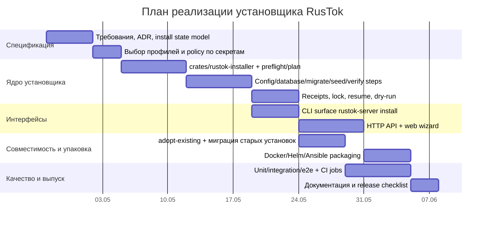

# Проверка и предложение реализации установщика для RusTok

## Исполнительное резюме

В репозитории RusTok сегодня нет полноценного продуктового установщика в смысле WordPress или Magento 2. Вместо этого есть два девелоперских пути bootstrap: локальный не-Docker сценарий `cargo xtask install-dev` и Docker-ориентированный запуск через `./scripts/dev-start.sh`. Оба сценария решают задачу поднятия dev-окружения, но не оформлены как безопасный, повторяемый и поддерживаемый production-grade installer с явной моделью состояний, resumable-логикой, штатным rollback, разделением секретов и отдельным UX для оператора установки. Это прямо видно из quickstart-документации, `xtask`-README, самого `install_dev.rs`, dev startup script, Docker Compose-конфигов и шаблона `.env.dev.example`. fileciteturn14file0L1-L1 fileciteturn15file0L1-L1 fileciteturn16file0L1-L1 fileciteturn22file0L1-L1 fileciteturn23file0L1-L1 fileciteturn24file0L1-L1

Самая важная архитектурная находка для будущего установщика — текущая схема миграций RusTok уже модульная по происхождению, но не модульная по выбору во время инсталляции: серверный `Migrator` в `apps/server/migration/src/lib.rs` агрегирует платформенные и module-owned миграции из множества crates в один глобально отсортированный список. При этом архитектурная документация говорит, что tenant-level enable/disable работает **поверх уже собранной platform composition**, а не меняет состав скомпилированной платформы. Это означает, что будущий installer должен явно различать три слоя: build composition, schema composition и tenant enablement. Иначе UX “установить только blog без commerce” будет обещать больше, чем делает кодовая база сейчас. fileciteturn29file0L1-L1 fileciteturn37file0L1-L1 fileciteturn27file0L1-L1

Если сравнивать с референсами, WordPress выигрывает в первом входе: браузерный wizard, автоопределение “не установлен / установлен”, минимальные системные требования, языковой выбор и low-friction UX. Magento 2 выигрывает в операционном контуре: CLI как основной orchestration surface, extensible command model, разделение shared и environment-specific config, declarative schema/update model и более зрелые практики для upgrade/install automation. У WordPress установка ближе к “одноразовому bootstrap + friendly UX”, у Magento — к “операционному пайплайну с повторяемыми командами”. citeturn4search4turn4search2turn4search1turn5search4turn7search0turn0search1turn13search4turn9search1turn8search11turn10search0turn10search1turn0search2

Для RusTok оптимальный путь — **гибридный установщик**: сначала сделать надежное installer-core и CLI как source of truth, затем поверх него тонкий веб-мастер установки. Это даст контроль, автоматизацию и CI/CD-совместимость как у Magento 2, но сохранит low-friction UX первого запуска как у WordPress. Отдельно стоит подготовить контейнерные и IaC-обвязки, но как упаковку **вокруг** core installer, а не как замену самому установщику. С практической точки зрения это выглядит как реалистичный roadmap примерно на 8–10 недель для первой production-grade версии при условии 2 Rust backend engineers, 1 frontend engineer part-time и DevOps support part-time. Эта оценка — инженерная, а не нормативная.

## Что есть в RusTok сейчас

RusTok позиционируется как modular monolith с явным composition root в `apps/server`, отдельными host-приложениями для server/admin/storefront и источником истины для модулей в `modules.toml`. В README прямо зафиксированы deployment profiles, включая monolith-профиль с “WordPress-style simplicity”, а архитектурный обзор уточняет, что tenant-level enable/disable относится только к optional modules и работает поверх уже собранной platform composition. Это очень важный контекст: установщик должен быть не просто “мастером заполнения .env”, а layer between platform composition, environment provisioning и tenant bootstrap. fileciteturn35file0L1-L1 fileciteturn37file0L1-L1 fileciteturn27file0L1-L1

Текущий официальный quickstart предлагает два сценария. Первый — локальная не-Docker установка через `cargo xtask install-dev`, которую документация прямо описывает как bootstrap local non-Docker development install. Второй — Docker-стек через `./scripts/dev-start.sh`, который запускает PostgreSQL, backend и несколько frontend-панелей через Docker Compose. Это уже хороший старт для dev onboarding, но semantic contract здесь именно “development stack”, а не production installer. fileciteturn14file0L1-L1 fileciteturn15file0L1-L1 fileciteturn16file0L1-L1

`xtask` сегодня является главным “установочным” механизмом для локальной инсталляции. README для `xtask` описывает команду `cargo xtask install-dev`, которая проверяет `modules.toml`, при необходимости создает `modules.local.toml`, подставляет в него настройки standalone frontend, обновляет `.env.local` и `apps/next-admin/.env.local`, пытается создать PostgreSQL role/database, поднимает `rustok-server`, ждет readiness, затем останавливает его и печатает credentials/URLs. С точки зрения текущей реализации это уже не просто shell-обертка, а зародыш будущего installer orchestrator. fileciteturn15file0L1-L1

По коду `xtask/src/install_dev.rs` можно восстановить точный flow текущего bootstrap. Он валидирует наличие `modules.toml`, по умолчанию создает `modules.local.toml` из него и принудительно выставляет `build.server.embed_admin = false` и `build.server.embed_storefront = false`, то есть локальная установка переводится в headless/standalone frontends профиль. Затем он upsert-ит значения в `.env.local` и `apps/next-admin/.env.local`, включая `APP_ENV`, `DATABASE_URL`, `JWT_SECRET`, `SUPERADMIN_EMAIL`, `SUPERADMIN_PASSWORD`, `NEXT_PUBLIC_API_URL` и схожие поля. После этого код проверяет наличие `createdb`/`psql`, условно создает роль и БД, запускает уже собранный бинарник `target/release/rustok-server start`, пингует `/api/health`, а затем останавливает процесс. Всё это выглядит как идемпотентный bootstrap девелоперского окружения, но не как finished installer. fileciteturn15file0L1-L1

Сильные стороны текущего `install-dev` — уже существующая частичная idempotency. Создание role/database происходит через проверки существования (`role_exists`, `db_exists`) перед `CREATE USER`/`CREATE DATABASE`; обновление `.env` реализовано как upsert по ключам, а не только append; seed-логика использует `find_or_create` для tenant и проверку существования пользователя по email перед insert. Это хороший фундамент для будущего “re-run safe” installer. fileciteturn15file0L1-L1 fileciteturn19file0L1-L1 fileciteturn25file0L1-L1

Слабые стороны тоже очевидны. Во-первых, это не transactional installer: у него нет состояния сессии установки, шага rollback, install lock, resumable checkpoints и формального dry-run артефакта. Во-вторых, он ожидает существование release-бинаря `target/release/rustok-server`, но сам этот бинарь не собирает, то есть “установщик” зависит от предыдущего build-step. В-третьих, `modules.local.toml` создается только если отсутствует, и это удобно для первой установки, но плохо для drift management: если `modules.toml` изменился, локальный derived manifest может silently устареть. В-четвертых, секреты пишутся в plaintext env-files, а dev defaults вроде `admin12345`, `rustok:rustok`, `dev_secret_change_in_production` остаются частью current flow. fileciteturn15file0L1-L1 fileciteturn24file0L1-L1 fileciteturn23file0L1-L1

Docker-путь через `scripts/dev-start.sh` еще лучше показывает, что речь идет именно о dev bootstrap. Скрипт копирует `.env.dev.example`, если `.env.dev` отсутствует, запускает compose-файлы `docker-compose.yml` и `docker-compose.full-dev.yml`, выводит локальные URLs, дефолтные dev credentials и ждет healthcheck сервера. В базовом compose описаны PostgreSQL 16 и Apache Iggy; в full-dev compose добавлены server, Next.js admin, Leptos admin, Next.js storefront и Leptos storefront. Dockerfile сервера для development вообще запускает `cargo watch -x run`, а production CMD — просто `./rustok-server start`. Это хороший dev stack launcher, но не “мастер установки CMS для администратора сайта”. fileciteturn16file0L1-L1 fileciteturn22file0L1-L1 fileciteturn23file0L1-L1 fileciteturn39file0L1-L1

В сервере есть и полезные production guardrails. `check_production_secrets()` abort-ит release startup, если в конфиге обнаружены известные dev JWT fragments, sample database credentials или sample superadmin passwords. Кроме того, `SuperAdminInitializer` и seed-код не перезаписывают существующего администратора, а создают его только при отсутствии. Это правильное направление для safe bootstrap, но в текущем виде эти механизмы “размазаны” между initializers, seed и startup checks, а не оформлены как единый installer lifecycle. fileciteturn26file0L1-L1 fileciteturn25file0L1-L1 fileciteturn19file0L1-L1 fileciteturn33file0L1-L1

Еще один ключевой момент — база данных и миграции. Dev/docs и CI ориентированы прежде всего на PostgreSQL, но сервер при определенных условиях умеет молча fallback-нуться на локальный SQLite, если `DATABASE_URL` не задан и текущий URI пустой или указывает на локальный Postgres. Одновременно migration crate объединяет миграции платформенного ядра и большого числа доменных crates в единый отсортированный список, а тесты проверяют order correctness и schema smoke. Для будущего установщика это означает следующее: production installer должен **отключить неявный silent fallback** и выбирать engine явно, а модульная установка должна сперва честно зафиксировать, что сейчас optional modules tenant-level влияют на runtime enablement, но не на сам факт наличия schema artifacts. fileciteturn34file0L1-L1 fileciteturn29file0L1-L1 fileciteturn28file0L1-L1

## Уроки WordPress и Magento 2

WordPress строит установку вокруг browser-driven first run. Ядро умеет определять, что сайт не установлен: `wp_not_installed()` редиректит на `/wp-admin/install.php`, `is_blog_installed()` проверяет признак установленного сайта, а `wp_installing()` ведет installation mode. Сам `wp_install()` создает и наполняет БД, поднимает primary admin user, initial options и default content; если пароль не передан, он генерируется случайно, а если пользователь уже существует, WordPress наследует пароль и назначает роль администратора. Конфигурация держится в `wp-config.php`, где задаются параметры БД, security keys, prefix, URL и еще ряд системных констант; WordPress также поддерживает языковой выбор и загрузку language packs. Архитектурно это дает очень низкий входной барьер и понятный UX для “первой установки через браузер”. citeturn4search4turn4search2turn4search0turn4search1turn4search3turn3search0turn5search4turn5search1turn7search0

При этом WordPress-стиль не так силен в операционном контуре. Его install primitives устроены вокруг понятия “сайт либо не установлен, либо установлен”, а не вокруг декларативного install plan с повторяемыми шагами, lock-менеджментом и rollback pipeline. Иначе говоря, у WordPress очень сильный first-run UX, но гораздо менее выражены concepts вроде resumable orchestration, explicit install receipts, phase-by-phase rerun и отдельной модели shared vs sensitive config. Это не недостаток для классической CMS, но для RusTok с multi-module и multi-profile deployment моделью этого уже мало. Такой вывод — инженерная интерпретация официальных install primitives WordPress. citeturn4search4turn4search2turn4search1turn3search0

Magento 2, напротив, строит инсталляцию вокруг CLI. Официальная документация прямо говорит, что Adobe Commerce имеет единый CLI `<magento_root>/bin/magento` для installation и configuration tasks, причем интерфейс основан на Symfony и расширяем third-party developers. `setup:install` принимает длинный набор параметров окружения, БД, admin-account и инфраструктурных зависимостей; документация также отмечает, что installer можно запускать повторно с разными параметрами, чтобы завершать инсталляцию по фазам или исправлять прежние ошибки. Это уже намного ближе к зрелому operational installer. citeturn0search1turn13search4turn13search5

Особенно полезен для RusTok магентовский подход к конфигурации и миграциям. Adobe Commerce разделяет deployment configuration между `app/etc/config.php` как shared config, который надо класть в source control, и `app/etc/env.php` как environment-specific и sensitive config, который хранить в VCS не следует; для sensitive/system-specific values предусмотрены отдельные CLI-команды. Для эволюции схемы БД применяется `setup:upgrade`, а declarative schema описывает желаемое финальное состояние базы, чтобы система сама вычисляла difference и избегала лишних промежуточных операций. Это дает намного лучшую основу для install/upgrade idempotency, чем purely imperative migration chain. citeturn9search1turn9search0turn9search5turn9search7turn8search11turn10search0turn10search1turn0search2

В части rollback Magento тоже полезен как антипример и как практический reference одновременно. Официальная документация описывает backup/rollback через `setup:rollback`, но одновременно помечает встроенную backup functionality как deprecated и рекомендует использовать внешние backup technologies. Это хороший operational lesson для RusTok: rollback не стоит проектировать как магическую кнопку “undo everything”; правильнее разделить fresh-install rollback, config rollback и production restore-from-backup, а для сложных инсталляций строить rollback вокруг snapshots и restore automation, а не вокруг надежды на универсальный reverse-migration. citeturn8search0turn8search1turn8search2

Если перевести эти уроки в понятные заимствования для RusTok, то картина такая. От WordPress стоит брать browser-first UX, language-aware wizard, понятную first-run детекцию и “один URL / один поток действий” для администратора. От Magento нужно брать CLI как официальный automation-first интерфейс, разделение shared/sensitive config, явные preflight checks, декларативную step model, dry-run, возможность rerun по шагам и install surface, дружественный к CI/CD и контейнерным окружениям. citeturn4search4turn4search1turn3search0turn5search4turn0search1turn13search4turn9search1turn10search0

## Варианты реализации для RusTok

Для RusTok я вижу четыре практических варианта.

**Веб-инсталлятор в стиле WordPress.** Архитектурно это wizard поверх HTTP API с setup routes в `apps/server`, first-run detection и short-lived install session. Последовательность шагов: preflight, выбор профиля развертывания, проверка БД/секретов, применение миграций, создание tenant/admin, optional demo seed, verify/finalize, деактивация setup mode. Такой вариант отлично работает для monolith profile и self-hosted single-node сценариев, особенно если цель — “запуститься за 5–10 минут”. Но без сильного CLI-core он быстро становится хрупким: сложнее автоматизировать, тяжелее отлаживать в headless средах и опаснее с точки зрения secret handling и concurrency. Для RusTok как modular monolith это хороший UX layer, но плохой source of truth. На такую трактовку влияет и текущий monolith narrative в README, и сравнение с WordPress installer primitives. fileciteturn35file0L1-L1 citeturn4search4turn4search1turn3search0

**CLI-инсталлятор в стиле Magento 2.** Архитектурно это install engine в Rust плюс канонический набор subcommands: `preflight`, `plan`, `apply`, `verify`, `resume`, `rollback-config`, `adopt-existing`. Последовательность шагов может быть полностью скриптуемой и интегрируемой в CI/CD, Docker entrypoint, Helm hook или Ansible role. Это наиболее естественный путь для RusTok, потому что репозиторий уже Rust-centric, содержит `xtask`, build/test workflows, миграции в коде и dev bootstrap через бинарь сервера. С точки зрения безопасности CLI проще связать с env vars, mounted secrets и secret managers; с точки зрения тестирования он проще для integration/e2e automation. Минус — хуже first-run UX для нетехнического администратора и выше барьер входа в простом shared-hosting-like сценарии. fileciteturn15file0L1-L1 fileciteturn21file0L1-L1 citeturn0search1turn13search4turn9search1turn10search0

**Гибридный вариант.** Это лучший баланс для RusTok. В нем есть единый `installer-core` c state machine и step receipts, а поверх него два адаптера: CLI и веб-мастер установки. CLI становится source of truth для automation и CI/CD, а веб-инсталлятор — friendly façade для первого запуска в monolith/self-hosted среде. Такой подход также снижает дублирование: и web wizard, и shell automation используют одни и те же проверки, один и тот же install plan и одну и ту же миграционно-seeding логику. Для RusTok это особенно важно из-за уже существующих deployment profiles, module manifest и mixed world of dev bootstrap, server binary and frontend hosts. fileciteturn35file0L1-L1 fileciteturn37file0L1-L1 citeturn4search4turn0search1turn10search0

**Контейнерные, IaC и one-click deploy альтернативы.** Это не замена installer-core, а packaging surface. Для RusTok сюда логично отнести Docker image + entrypoint режима `install`, Helm chart с Job/Hook для install/upgrade, Ansible role, Terraform module для managed DB/secrets/app, а также один “demo one-click” сценарий для single-server deployment. Плюсы — быстрая доставка, воспроизводимость инфраструктуры и удобство для DevOps. Минусы — эти сценарии бесполезны, если базовый install engine не является идемпотентным и testable. Поэтому их надо строить после или параллельно с hybrid-core, но не вместо него. fileciteturn39file0L1-L1 fileciteturn23file0L1-L1

Ниже — сводная оценка вариантов как инженерных альтернатив для RusTok.

| Вариант | Сложность реализации | UX | Безопасность | Масштабируемость | Поддерживаемость | Примерный срок реализации |
|---|---:|---|---|---|---|---:|
| Веб-инсталлятор | Средняя | Очень высокий для first-run | Средняя без сильного backend-core | Средняя | Средняя | 6–8 недель |
| CLI-инсталлятор | Средняя | Средний | Высокая | Высокая | Высокая | 4–6 недель |
| Гибридный | Выше средней | Высокий | Высокая | Высокая | Очень высокая | 8–10 недель |
| Контейнерный / IaC / one-click слой | Низкая–средняя поверх core | Высокий для ops | Высокая при зрелом core | Очень высокая | Высокая | 3–6 недель дополнительно |

Мой вывод: **не выбирать “веб или CLI” как взаимоисключающие опции**. Для RusTok правильнее сделать CLI-first, но продуктово отдавать его как hybrid installer, где web wizard вызывает тот же engine.

## Рекомендуемая архитектура и план реализации

Рекомендуемая целевая архитектура для RusTok — это **единый installer-core внутри workspace** и два адаптера: CLI и HTTP. Практически это может выглядеть так:

```text
crates/rustok-installer/
  src/
    plan.rs
    state.rs
    probes.rs
    secrets.rs
    steps/
      preflight.rs
      config.rs
      database.rs
      migrate.rs
      seed.rs
      verify.rs
      finalize.rs
      rollback.rs

apps/server/src/
  controllers/install.rs
  services/install_service.rs
  dto/install/*.rs

apps/server/migration/src/
  m2026...._create_install_sessions.rs
  m2026...._create_install_receipts.rs

xtask/
  -> dev-only wrapper over rustok-installer for local bootstrap
```

Ключевая идея здесь в том, что installer не должен жить в `xtask` как ad-hoc helper навсегда. `xtask` должен остаться тонким девелоперским wrapper-ом для convenience, а production/install logic должна переехать в нормальный library crate с тестируемыми шагами и четким state machine. Это лучше согласуется и с общим composition-root подходом RusTok, и с уже существующими тестовыми/CI практиками. fileciteturn37file0L1-L1 fileciteturn21file0L1-L1 fileciteturn36file0L1-L1

Я бы рекомендовал следующую модель состояний установки:

```text
Draft
→ PreflightPassed
→ ConfigPrepared
→ DatabaseReady
→ SchemaApplied
→ SeedApplied
→ AdminProvisioned
→ Verified
→ Completed

ошибочные ветки:
→ Failed
→ RolledBackFreshInstall
→ RestoreRequired
```

У каждого шага должен быть **receipt**: входные параметры, checksum конфигурации, timestamp, версия installer-core, outcome и diagnostic payload. Это даст сразу три свойства: resumability, auditability и idempotency. Если step уже успешно выполнен и checksum входа совпадает, installer пропускает его. Если вход изменился, step либо re-runs безопасно, либо требует explicit `--force`/`reconfigure`. Это модель существенно лучше текущего dev bootstrap. Она хорошо сочетается с magento-подобным operational подходом и с Rust-тестируемостью.

Для CLI я бы предложил surface такого типа:

```bash
# Показать требования и проблемы среды
rustok-server install preflight --profile monolith --output table

# Сгенерировать план без применения
rustok-server install plan \
  --profile monolith \
  --database-engine postgres \
  --database-url 'postgres://rustok:***@db:5432/rustok' \
  --admin-email admin@example.com \
  --tenant-slug default \
  --dry-run

# Применить установку
rustok-server install apply \
  --plan install-plan.json \
  --secrets-mode env \
  --seed-profile minimal

# Продолжить после падения
rustok-server install resume --session is_01H...

# Проверка результата
rustok-server install verify --session is_01H...

# “Принять” существующую установку под управление installer-а
rustok-server install adopt-existing --from-env .env --from-db-url "$DATABASE_URL"
```

Для веб-мастера установки — такой HTTP surface:

```http
POST /api/install/preflight
POST /api/install/sessions
GET  /api/install/sessions/{id}
POST /api/install/sessions/{id}/config
POST /api/install/sessions/{id}/database
POST /api/install/sessions/{id}/migrate
POST /api/install/sessions/{id}/seed
POST /api/install/sessions/{id}/finalize
POST /api/install/sessions/{id}/verify
```

Пример полезного запроса для веб-установки:

```http
POST /api/install/sessions
Content-Type: application/json
X-RusTok-Install-Token: <one-time-setup-token>

{
  "profile": "monolith",
  "database": {
    "engine": "postgres",
    "url": "postgres://rustok:***@db:5432/rustok"
  },
  "tenant": {
    "slug": "default",
    "name": "Default Workspace"
  },
  "admin": {
    "email": "admin@example.com",
    "password": "strong-random-secret"
  },
  "modules": {
    "enable": ["content", "pages", "seo"],
    "seed_profile": "minimal"
  }
}
```

На стороне безопасности я рекомендую следующее. Секреты должны поддерживать как минимум четыре режима: `env`, `dotenv-file` только для local/dev, `mounted-file` для контейнеров и `external-secret` для Vault/Kubernetes/Cloud Secret Manager. Installer ни при каких обстоятельствах не должен возвращать пароли в plaintext после первого commit шага; максимум — “admin created”, “credentials stored in secret backend”, либо единичная выдача one-time recovery token. Для web installer обязательно нужны one-time setup token, install lock, CSRF/origin checks, rate limiting и автоматическое отключение setup routes после `Completed`. Имеющиеся guardrails в `check_production_secrets()` нужно не отменять, а встроить в preflight и finalize как hard fail. fileciteturn26file0L1-L1 fileciteturn24file0L1-L1 citeturn9search1turn8search11turn3search0

По миграциям и rollback нужно принять более строгую политику, чем сейчас. Я бы предложил так:
  
Свежая установка:
  
- до `SchemaApplied` можно делать real rollback, включая удаление только что созданной пустой БД или schema;
- между `SchemaApplied` и `SeedApplied` rollback допускается только если installer сам создал isolated target DB и snapshot/restore доступен;
- после `SeedApplied` и тем более после production data import предпочтителен не reverse migration, а restore from backup/snapshot.

Существующая установка:

- only forward-compatible migration path;
- installer обязан делать preflight backup check и выдавать hard warning/error, если backup strategy не подтверждена;
- для optional modules, которые уже схематически присутствуют в общей миграционной цепочке, installer не должен обещать “schema removal on disable” без отдельной архитектурной работы.

Это прямо следует из текущего глобального migrator-а RusTok и из практических уроков Magento с backup/rollback. fileciteturn29file0L1-L1 citeturn8search0turn10search0turn10search1

Тестовый план для первой production-grade версии установщика должен быть слоистым.

**Unit tests**:

- нормализация install plan;
- checksum/receipt logic;
- merge precedence: CLI flags > env vars > config file > defaults;
- secret redaction;
- lock acquisition/release;
- drift detection for `modules.local.toml`.

**Integration tests**:

- fresh install on PostgreSQL;
- `resume` после обрыва на шаге `DatabaseReady`;
- повторный `apply` на уже установленной системе;
- adopt-existing из текущего `.env.dev`/`.env.local` формата;
- verify, что sample secrets отбрасываются в release-like режиме;
- verify, что seed profiles `minimal`, `dev`, `none` ведут себя ожидаемо.

**E2E tests**:

- CLI install → start server → `/health` → login admin;
- web install wizard happy path;
- concurrent install race: второй процесс получает lock error;
- install in container entrypoint;
- upgrade path from current dev bootstrap to managed install metadata.

Это хорошо ложится на уже существующий CI: там уже есть PostgreSQL service, `cargo nextest`, coverage job и build/test gates. Для новой фичи достаточно добавить отдельные jobs вроде `installer-integration-postgres`, `installer-e2e-web`, `installer-adopt-existing` и, при желании, `docker-install-smoke`. fileciteturn21file0L1-L1 fileciteturn36file0L1-L1 fileciteturn28file0L1-L1

Ниже — реалистичный план по спринтам.



Если раскладывать это в практические deliverables, то получилось бы так:

| Спринт | Результат |
|---|---|
| Спринт A | ADR по installer architecture, state model, security policy, explicit policy по PostgreSQL/SQLite |
| Спринт B | `rustok-installer` library, preflight, plan, config, database, migrate, seed, verify |
| Спринт C | CLI `rustok-server install ...`, receipts, lock, resume, adopt-existing |
| Спринт D | HTTP API и web wizard, first-run detection, disable-after-complete |
| Спринт E | E2E/CI, Docker/Helm integration, documentation, migration guide |

## Совместимость, риски и открытые вопросы

Для обратной совместимости я рекомендую **не ломать текущие dev entrypoints**. `cargo xtask install-dev` и `./scripts/dev-start.sh` нужно сохранить, но перевести на новый core installer как thin wrappers. Тогда существующие contributors не потеряют привычный flow, а сам проект перестанет поддерживать две отдельные реализации bootstrap logic. Это особенно уместно, потому что сегодня и `xtask`, и dev-start script, и server startup/seeding уже делят одну и ту же зону ответственности, но делают это без общего installer contract. fileciteturn15file0L1-L1 fileciteturn16file0L1-L1 fileciteturn26file0L1-L1

Для миграции существующих установок нужен специальный режим `adopt-existing`. Он должен уметь: читать нынешние env-файлы; обнаруживать существующие tenant/admin записи; записывать installer metadata, например в `platform_settings`; фиксировать текущий deployment profile; проверять drift между `modules.toml` и `modules.local.toml`; импортировать существующие secret references без их повтора в plaintext. Важно, чтобы режим adoption не ронял существующую систему и не запускал destructive steps по умолчанию. Основание для этого есть уже сейчас: seed/admin логика частично идемпотентна, а в репозитории есть `platform_settings` и зрелая миграционная база. fileciteturn19file0L1-L1 fileciteturn25file0L1-L1 fileciteturn29file0L1-L1

Главные риски и меры смягчения я бы оценил так:

| Риск | Почему это реально | Мера смягчения |
|---|---|---|
| Обманчиво “модульная установка” | Сейчас миграции глобально собираются из многих crates | Честно разделить schema composition и tenant enablement; не обещать schema omission без отдельной фазы рефакторинга |
| Потеря секретов или их утечка | Сейчас env-file driven bootstrap и sample secrets распространены | Ввести secret backends, redaction, one-time tokens, hard preflight/finalize guards |
| Неидемпотентные повторы установки | Сейчас нет receipts/locks/state machine | Ввести install receipts, checksum входов, advisory lock и `resume` |
| Сюрпризы из-за SQLite fallback | Сервер умеет молча fallback-нуться на SQLite | Отключить silent fallback в production installer; engine only explicit |
| Drift derived config | `modules.local.toml` создается один раз и может устареть | Проверка checksum/manifest drift и режим `reconcile` |
| Несогласованные dev/prod сценарии | Сейчас dev bootstrap и runtime guardrails живут в разных местах | Делегировать все flows в единый installer-core |
| Недостаток e2e покрытия | Installer трудно надежно выпускать без сценарных тестов | Обязательные PostgreSQL E2E jobs, web flow tests, adopt-existing tests в CI |

Есть и несколько неуточненных пунктов, которые нужно формально принять перед разработкой первой production версии установщика.

Во-первых, **целевая СУБД**. По репозиторию видно, что dev stack и CI ориентированы на PostgreSQL, но сервер умеет fallback на SQLite, а schema tests тоже гоняются на SQLite. Я бы рекомендовал формально объявить: PostgreSQL — first-class production DB; SQLite — только local/demo/test. Это снимет большой пласт двусмысленности в installer UX и migration policy. fileciteturn22file0L1-L1 fileciteturn21file0L1-L1 fileciteturn34file0L1-L1 fileciteturn28file0L1-L1

Во-вторых, **поддерживаемые ОС и deployment targets**. В текущих материалах явно видны Linux/bash/Docker assumptions и Rust-based локальная разработка; явной матрицы “production OS support” я не нашел. Практически я бы рекомендовал: Linux x86_64 как основной production target; macOS — dev only; Windows — только через WSL2 или контейнерные сценарии, пока не будет отдельной верификации.

В-третьих, **локализация установщика**. У проекта уже есть русскоязычная архитектурная документация и работа с tenant locales, но требования к языкам мастера установки не зафиксированы. Рациональный старт — английский + русский интерфейс веб-мастера, а затем вынос строк в i18n catalog. fileciteturn37file0L1-L1 fileciteturn29file0L1-L1

Итоговая рекомендация проста. Если задача — не просто “подкрасить текущий bootstrap”, а действительно сделать установщик уровня продукта, RusTok стоит идти по пути:

**единый installer-core → CLI как канонический интерфейс → веб-мастер установки как friendly facade → контейнерные/IaC-обвязки как packaging layer**.

Это лучший компромисс между текущей архитектурой репозитория, сильными сторонами WordPress и Magento 2 и реальными требованиями к безопасности, миграциям, идемпотентности и поддерживаемости.