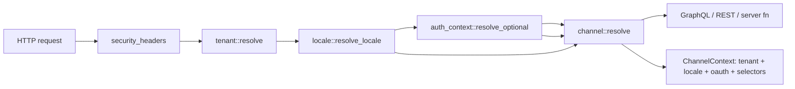

# RusTok Backend/Runtime Defect Remediation Plan

## Re-verification Status

The document `docs/research/error fix.md` has been converted from an audit draft into a working defect remediation plan. All original theses have been re-verified against the current repository state as of 2026-06-01.

There are no questions blocking the plan. Before implementation starts, only priorities and budgets from the "Open Decisions" section need confirmation, as they affect the scope of the first wave but do not change the list of identified defects.

## Executive Summary

Six problem areas have been confirmed in the repository:

1. **Drift/staleness of contract evidence for module dependency graph**: `modules.toml` and the central registry consider `pages` dependent on `content` and `page_builder`, while the runtime contract test in `apps/server/src/modules/mod.rs` still expects only `content`. Meanwhile, `cargo xtask validate-manifest` currently passes, meaning the primary risk is not a proven runtime failure but desynchronization of test/documentation evidence with canonical manifest validation.
2. **Incomplete request context for channel resolution**: `channel` middleware executes before `auth_context`, and `RequestFacts` explicitly sets `oauth_app_id` and `locale` to `None`.
3. **DB amplification on locale hot path**: `locale` middleware reads `tenant_locales` from DB on every request to a tenant-bound route and does not use cache/versioned invalidation.
4. **Inventory leak through commerce GraphQL read-side**: the inventory admin README explicitly captures a temporary dependency of the UI read-side on `rustok-commerce` GraphQL contract.
5. **Fragile migration aggregation**: the server migrator manually collects migrations from multiple crates, but dependency descriptors are aggregated only from `rustok_product`.
6. **CI does not cover migration-safety and runtime-context invariants with separate gates**: there are strong basic checks, but no explicit mandatory smoke job for migrations from zero / incremental apply / dependency graph runtime invariants.

### Implementation Update as of 2026-06-05

- Wave 1 evidence for `pages -> [content, page_builder]`, Wave 2 channel request context and Wave 3 TTL-cache tenant locale policy already reflected in code on the current branch.
- As part of Wave 4 continuation, a first migration-safety baseline was added: module-owned `migration_dependencies()` for known cross-module FK/order boundaries (`channel -> auth`, `pricing/inventory -> product variants`, `commerce collections/categories -> product`, `blog/forum -> taxonomy`) and aggregation of these descriptors in the server migrator.
- A local PostgreSQL smoke script `scripts/verify/verify-migration-smoke.sh` was added: it runs an ignored integration test that creates a temporary DB without local `psql`, applies the migrator from-zero, and checks representative module tables.
- Wave 5 advanced with a small write-transport slice: inventory admin read-side remains on inventory-owned `core` + facade `api` + `transport` + explicit `ui/leptos.rs` adapter, while dedicated native endpoints `inventory/variant/set-quantity` and `inventory/variant/adjust-quantity` now go through inventory-owned API/native facade without GraphQL fallback, call inventory-owned service methods after tenant/permission checks, and the inventory detail UI received targeted set-quantity and +/-1 adjustment controls with local integer validation and optimistic detail refresh.
- The open Wave 4 remainder is to observe the first CI `migration-smoke` run on a real GitHub Actions environment and fix possible environment-specific failures; for Wave 5, the remainder is to extend parity coverage and close remaining inventory mutations instead of a transitional adapter.
- The next small Wave 5 ownership slice extracted storefront product inventory projection into an inventory-owned public-channel facade: `rustok-inventory` now returns `PublicChannelInventoryProjection { available_quantity, in_stock }`, and the commerce storefront DTO adapter only transfers the ready projection into `ProductResponse`, without duplicating backorder policy branching or calling availability loaders directly; a quick verifier captures this boundary without long compilation.
- The next small Wave 4 slice captured dependency descriptors in the common module contract: `MigrationSource` received a default `migration_dependencies()`, known module crates with cross-module ordering metadata return local descriptors through this trait, and the server migrator aggregates them through module instances instead of directly accessing package-local migration modules. A subsequent clarifying slice expanded the aggregation list to all module crates whose migrations are included in the server migrator, so new descriptors do not require a separate server-side allowlist.
- The next small Wave 4 smoke slice added an opt-in incremental mode for PostgreSQL migration smoke (`RUSTOK_MIGRATION_SMOKE_INCREMENTAL=1`): the same fresh DB can now check not only apply-from-zero entirely but also sequential `Migrator::up(..., Some(1))` path without a separate `psql`; direct Rust test runs now validate binary smoke flags as strictly as the shell wrapper.
- The next small Wave 3 observability slice aligned Prometheus naming for tenant locale cache counters with the plan: hit/miss metrics are now exported as `rustok_tenant_locale_cache_hits_total` and `rustok_tenant_locale_cache_misses_total`, alongside existing `rustok_tenant_locale_db_queries_total` and `rustok_tenant_locale_cache_invalidations_total`; `rustok_tenant_locale_cache_entries` remains a gauge.
- The next small Wave 6 guardrail slice added a fast local `node scripts/verify/verify-runtime-context-invariants.mjs` and connected it to `./scripts/verify/verify-all.sh runtime-context-invariants`: the check captures OAuth/locale dimensions for channel, source-order contract for actual middleware order, locale-cache metric names and evidence `pages -> [content, page_builder]` without full Rust compilation.
- The next small Wave 4/Wave 6 CI slice added a separate GitHub Actions job `migration-smoke` with PostgreSQL service: CI runs the local smoke wrapper first in apply-from-zero mode, then with `RUSTOK_MIGRATION_SMOKE_INCREMENTAL=1`, and the aggregate `ci-success` now waits for this migration-safety gate.
- The next small Wave 6 docs-hardening slice expanded the existing `docs/verification/README.md` with a brief runtime/backend regression runbook for module graph drift, channel locale/OAuth context, locale DB amplification and migration dependency failures without creating a new document.
- The next small Wave 5 guardrail slice captured the transitional commerce GraphQL adapter as a read-only compatibility fallback: the inventory admin boundary test now checks for absence of GraphQL mutation/write markers in the adapter and presence of README removal criteria for the adapter while the remaining dedicated write transport is being completed.
- The next small Wave 5 docs-sync slice synchronized the central FFA/FBA readiness board in `docs/modules/registry.md` with the local inventory plan: registry evidence now explicitly includes read-only transitional adapter/removal criteria boundary coverage.
- The next small Wave 5 ops-sync slice updated `docs/modules/implementation-plans-registry.md` for `rustok-inventory`: status is no longer `not_started`, checkpoint reflects native read/write split, read-only transitional adapter guardrail, next write-mutation slice and verification gates.
- The next small Wave 5 contract-semantics slice captured backend-level semantics for `InventoryQuantityWriteResult`: committed quantity now covered by unit evidence for `inStock` derivation and native endpoint wire shape, so the write UI/API do not recover stock state by local guesswork.
- The next small Wave 5 reserve-transport slice extracted reservation write path into inventory-owned native/API facade: `InventoryService::reserve` returns typed `InventoryReservationWriteResult { reserved_quantity, available_quantity, in_stock }`, endpoint `inventory/variant/reserve-quantity` passes tenant/permission checks without GraphQL fallback, and backend/admin serde evidence captures reservation wire shape.
- The next small Wave 5 reserve-hardening slice captured the reserve endpoint in a no-fallback guardrail: the API fallback predicate now explicitly forbids `inventory/variant/reserve-quantity requires the ssr feature`, and admin locale copy no longer describes dedicated write transport only as set-quantity and reflects set/adjust/reserve scope.
- The next small Wave 5 availability-read slice synchronized the native read-side with dedicated stock writes: `AdminInventoryReadService` now takes variant available quantity from `inventory_items`/`inventory_levels` when stock-level state is present, so set/adjust/reserve mutations are not lost on subsequent native detail refresh; legacy `product_variant.inventory_quantity` remains a fallback for not-yet-initialized stock levels.
- The next small Wave 5 reserve-ui slice connected reserve-quantity to admin detail UI through inventory-owned API facade: UI validates non-negative quantity, calls `reserve_variant_quantity` without GraphQL fallback, applies `InventoryReservationWriteResult.available_quantity/in_stock` in optimistic detail refresh and updates boundary evidence for native-only reservation controls.
- The next small Wave 5 evidence-sync slice removed remaining stale UI fallback text and synchronized local/central registry evidence: readiness now describes set/adjust/reserve UI controls, available-quantity optimistic refresh and native-only boundary guardrail as a single contract.
- The next small Wave 5 reservation-noop slice clarified backend semantics for zero-quantity reservation: `InventoryService::reserve(..., 0)` now returns current available quantity / in-stock state from inventory levels or legacy variant snapshot, without creating a synthetic zero-availability result and without creating a reservation item for admin optimistic refresh.
- The next small Wave 5 reservation-release consistency slice synchronized the release path with the reservation ledger: `InventoryService::release_reservation_quantity` now checks active `reservation_items` before debiting levels, debits release from tracked rows (soft-delete on full row debit) and returns validation error if levels show reserved quantity but reservation item rows do not cover the requested release.
- The next small Wave 5 UI-boundary slice separated client-side parsing and i18n copy for reservation and availability flows: detail UI calls `parse_availability_quantity` for dedicated availability validation, availability/reservation invalid labels no longer reuse reserve-specific text, tests capture domain-labeled non-negative error, and source boundary additionally forbids `releaseReservation` in the transitional GraphQL adapter.
- The next small Wave 5 availability-semantics slice captured case-insensitive matching for inventory backorder policy `continue` in common `services/policy.rs`: write-result `in_stock`, set/adjust/reserve/release/check-availability guardrails and admin read-side stock state no longer depend on policy value case and do not hold duplicate helpers.
- The next small Wave 5 docs-sync slice synchronized umbrella commerce docs and the central FFA/FBA registry with inventory-owned native set/adjust/reserve/release/check-availability surface and shared case-insensitive backorder policy semantics; local inventory operability docs marked closed for the current runtime surface.
- The next small Wave 5 compatibility-semantics slice exported the inventory-owned backorder policy helper and connected it in umbrella commerce checkout/storefront compatibility paths, so `continue` does not become case-sensitive outside inventory-owned read/write services. The next Wave 6 guardrail slice added a fast `node scripts/verify/verify-inventory-admin-boundary.mjs` and connected it to `./scripts/verify/verify-all.sh inventory-admin-boundary`: the check captures policy-aware native write result, absence of duplicate variant pre-read, read-only transitional GraphQL adapter and native-only inventory admin write facades without full Rust compilation. The next Wave 6 runbook slice expanded the existing `docs/guides/runtime-guardrails.md` with short diagnostics for module graph drift, channel locale/oauth dimensions, locale DB amplification, migration dependency failures and inventory admin boundary drift without creating a new document. The next Wave 6 central-docs slice updated `docs/architecture/api.md` for request-context/channel fast gate and `docs/modules/module-authoring.md` for migration dependency descriptor contract. The next verification-hardening slice added fixture tests for `verify-inventory-admin-boundary.mjs`, checking successful fixture, duplicate pre-read failure, transitional GraphQL mutation drift failure and token/tenant-slug GraphQL fallback prohibition in native write facade. The current max-scope Wave 5 cleanup removed transitional commerce GraphQL fallback from inventory admin package: `admin/src/transport.rs`, `leptos-graphql`, `leptos-auth` token/tenant fallback inputs, `CommerceGraphqlInventoryReadAdapter`, GraphQL variable/error-mapping tests and README removal criteria replaced by native-only read path evidence; verifier and boundary tests now fail on reintroduction of GraphQL transport file/markers. The next ownership slice extracted public-channel inventory visibility helpers from umbrella `rustok-commerce::storefront_channel` to `rustok-inventory::ser... (line truncated to 2000 chars)

## Verified Facts

| ID | Audit Thesis | Status | Code/Documentation Confirmation | Conclusion |
|---|---:|---:|---|---|
| VF-01 | `modules.toml`, central registry docs and runtime contract test diverge on `pages` dependencies | ✅ confirmed, clarified | `modules.toml` defines `pages -> [content, page_builder]`; `docs/modules/registry.md` repeats this; source-level runtime contract test expects `pages.dependencies() == ["content"]`; `cargo xtask validate-manifest` passed on re-verification. | Fix stale contract evidence/test first, then establish a general manifest ↔ registry check so future drift does not depend on manual assertions. |
| VF-02 | Code already has a validator for manifest ↔ runtime registry | ✅ confirmed | `ManifestManager::validate_with_registry` compares `depends_on` from resolved manifest with the `module.dependencies()` list. | Do not write a duplicate validator from scratch; use the existing mechanism in `xtask`/tests and add regression coverage for detected drift. |
| VF-03 | `channel` does not see auth-derived dimensions | ✅ confirmed | In router, `auth_context` is added before `channel`, but due to `Router::layer` order, `channel` actually executes before `auth_context`; `build_request_facts` does not accept extensions and sets `oauth_app_id: None`. | Reorder layers so execution order is `tenant -> locale -> auth_context -> channel`, and extend `build_request_facts`. |
| VF-04 | `channel` does not consider locale | ✅ confirmed | `locale` middleware inserts `ResolvedRequestLocale`, but `channel::build_request_facts` does not read extensions and sets `locale: None`; cache key also lacks locale/oauth dimensions. | Add locale/oauth to `RequestFacts` and `ChannelCacheKey`; cover with tests for different locale/oauth combinations. |
| VF-05 | `locale` makes a DB query to `tenant_locales` on request hot path | ✅ confirmed | `resolve_locale` calls `load_tenant_locales(&ctx, tenant.id).await` for each tenant context without cache. | Introduce tenant locale cache with TTL as minimal step and versioned invalidation as target option. |
| VF-06 | Inventory admin currently reads through commerce GraphQL read-side | ✅ resolved in current branch | `crates/rustok-inventory/admin` now uses native `AdminInventoryReadService` facade without `src/transport.rs`, `leptos-graphql`, token/tenant-slug fallback inputs and `CommerceGraphqlInventoryReadAdapter`; boundary/verifier checks forbid reintroduction of GraphQL fallback markers. | Inventory admin read-side no longer describes commerce GraphQL as a contract; remaining Wave 5 tail — non-admin/umbrella mutation parity beyond current native set/adjust/reserve/release/check-availability flows. |
| VF-07 | Migration aggregation is centralized in server migrator | ✅ confirmed | `apps/server/migration/src/lib.rs` manually `extend`s migrations from domain crates. | Reduce the manual hotspot through module-owned descriptors/exporters and smoke order checking. |
| VF-08 | Migration dependency descriptors are not collected for all modules | ✅ confirmed | `collect_migration_descriptors()` aggregates `rustok_product::migrations::migration_dependencies()` while the migrator connects many modules. | Introduce mandatory descriptor contract for modules with cross-module FK/order assumptions. |
| VF-09 | CI is strong but no separate migration smoke gate visible | ✅ confirmed | Workflow contains fmt, clippy, check, platform-contract, audit/deny, coverage, nextest, SBOM, reference artifacts and others; no separate job with explicit migration smoke command. | Add a separate migration-safety job after local smoke script, without breaking current jobs. |

## Target State

### Runtime/module contracts

- `modules.toml` remains source of intent for install/runtime composition.
- Runtime `ModuleRegistry` and generated registry code do not diverge from `modules.toml` in slug, required/core flags and dependency edges.
- `docs/modules/registry.md` reflects the same dependency graph, but is not the sole technical gate.
- Any manifest ↔ runtime registry drift fails in `cargo xtask validate-manifest` and/or dedicated regression test.

### Request context and channel resolution

Target execution order for full application router:



`RequestFacts` for channel resolution must include:

- tenant id;
- target surface;
- explicit channel selectors: header id, header slug, query slug;
- effective host;
- auth-derived OAuth/client dimension;
- effective locale.

`ChannelCacheKey` must vary at least by tenant, resolver version, explicit selectors, host, OAuth/client dimension and locale. Otherwise one request may warm the cache for a different locale/client context.

### Locale hot path

- Baseline step: TTL cache for `tenant_locales` by tenant id.
- Target step: versioned invalidation on tenant locale policy change.
- Observability: separate counters for DB hits, cache hits, cache misses and invalidations.

### Inventory transport boundary

- Inventory admin package must not directly depend on commerce GraphQL as the canonical read-side.
- Temporary compatibility with commerce GraphQL is allowed only within the inventory-owned adapter/facade.
- The new facade must return the UI read model needed by inventory admin, without exposing the commerce schema as an inventory contract.

### Migration safety

- Module-owned migration descriptors reside alongside migration exporters of the corresponding crates.
- Server migrator aggregates descriptors for all modules that need cross-module ordering.
- CI has a separate smoke gate for empty PostgreSQL DB and, where feasible, incremental apply.
- Diagnostic ignored tests remain acceptable but are not considered the sole protection for the migration path.

## Work Plan

### Wave 0 — Preparation and Baseline Capture

**Goal:** turn confirmed problems into measurable tasks before functional changes.

1. Create tracking issue/epic for this plan.
2. Capture current failures/expected failures:
   - source-level contract-test mismatch for `pages` and result of `cargo xtask validate-manifest`;
   - missing locale/oauth in `RequestFacts`;
   - missing locale/oauth in `ChannelCacheKey`;
   - missing locale cache;
   - current list of migration descriptors.
3. Add a link to this plan in `docs/index.md` so the document is visible from the canonical map.

**Readiness:** plan accessible from `docs/index.md`, baseline reproducible with local commands.

### Wave 1 — Module Graph Drift

**Goal:** eliminate confirmed desynchronized evidence for `pages -> page_builder` and close the class of errors with a general check.

1. Confirm canonical runtime graph for `pages`:
   - preferred option: runtime registry should include `page_builder` because `modules.toml` and `docs/modules/registry.md` already capture this;
   - alternative: remove `page_builder` from `modules.toml` and registry docs if the relationship was erroneous.
2. Fix stale runtime contract test and, if re-verification of a specific runtime registry reveals a difference from manifest, fix the generated registry source so `pages.dependencies()` matches the chosen graph.
3. Add or strengthen a regression test that compares resolved `modules.toml` dependencies with `ModuleRegistry::dependencies()` for all registry modules.
4. Ensure `cargo xtask validate-manifest` continues to pass on the fixed state and fails on artificially introduced drift in local verification.
5. Update `docs/modules/registry.md` if the chosen graph differs from current docs state.

**Acceptance criteria:**

- `cargo xtask validate-manifest` passes and its result is captured in verification evidence.
- Dedicated test for manifest ↔ registry dependencies passes.
- Stale assertion `pages.dependencies() == ["content"]` removed or replaced with canonical expectation.
- No manual special-case for `pages` without a general check.

### Wave 2 — Channel Request-Context Contract

**Goal:** make channel resolution depend on full request context.

1. Reorder middleware layers so execution order is:
   1. `security_headers`;
   2. `tenant::resolve`;
   3. `locale::resolve_locale`;
   4. `auth_context::resolve_optional`;
   5. `channel::resolve`;
   6. handlers.
2. Extend `channel::build_request_facts`:
   - pass `req.extensions()`;
   - read `AuthContextExtension` / current auth context type;
   - read `ResolvedRequestLocale`;
   - fill `oauth_app_id` and `locale`.
3. Extend `ChannelCacheKey`:
   - add OAuth/client dimension;
   - add locale;
   - ensure negative cache entries also differ by these dimensions.
4. Add regression tests:
   - middleware/order smoke;
   - `build_request_facts` carries locale/auth into `RequestFacts`;
   - cache key differs on locale change;
   - cache key differs on OAuth/client id change.
5. Update architectural docs on API/runtime context if the current contract is described differently.

**Acceptance criteria:**

- Channel resolver receives non-empty locale/auth dimensions where they exist in request extensions.
- Cache is not shared between different locale/oauth contexts.
- Tests do not depend on `.layer(...)` order as text but verify actual behavior.

### Wave 3 — Locale Cache and Observability

**Goal:** eliminate extra DB round-trip on each tenant-bound request.

1. Introduce shared cache for tenant locale policy:
   - key: tenant id;
   - value: locales snapshot;
   - initial TTL: 60 seconds, unless an approved freshness SLA exists;
   - bounded capacity.
2. Connect cache in `resolve_locale` before `load_tenant_locales`.
3. Add invalidation hook for operations that change tenant locale policy, if such command surface already exists.
4. Add counters/log events:
   - `tenant_locale_db_queries_total`;
   - `tenant_locale_cache_hits_total`;
   - `tenant_locale_cache_misses_total`;
   - `tenant_locale_cache_invalidations_total`.
5. Add tests:
   - repeated request does not trigger repeated DB load within TTL;
   - disabled locale still constrained correctly;
   - invalidation/TTL updates snapshot.

**Acceptance criteria:**

- Locale behavior does not change functionally.
- Hot path gets cache hit for repeated requests from same tenant.
- Observability allows seeing DB amplification regression.

### Wave 4 — Migration Safety

**Goal:** make module migration ordering explicit and verifiable.

1. Inventory migrations with cross-module references/FK/order assumptions.
2. For each such module crate, add `migration_dependencies()` alongside `migrations()`.
3. Extend `collect_migration_descriptors()` to aggregate descriptors not only from `rustok_product` but also from other modules with declared dependencies.
4. Add test for completeness of descriptors for known cross-module dependencies.
5. Add local smoke script for empty PostgreSQL DB:
   - create empty database/schema;
   - apply server migrator from zero;
   - optionally run lightweight schema sanity checks.
6. ✅ Add separate CI job `migration-smoke`; next step — track first GitHub Actions run and fix only environment-specific failures if they appear.

**Acceptance criteria:**

- Descriptors reference only existing migrations.
- Duplicate/cycle/missing dependency tests remain green.
- Migration smoke passes on empty PostgreSQL DB.

### Wave 5 — Inventory-Owned Read-Side Facade

**Goal:** eliminate direct dependency of inventory admin package on commerce GraphQL as the actual backend contract.

**Status as of 2026-06-06:** admin package already has inventory-owned core/api/transport/ui boundary and transitional commerce GraphQL read adapter; backend crate exports `AdminInventoryReadService`/DTO for tenant-scoped product/variant/price/translations read-side, admin package connects primary native/server-function read path to this service, and the first dedicated native write endpoints `inventory/variant/set-quantity` and `inventory/variant/adjust-quantity` call inventory-owned service methods without GraphQL fallback, with targeted set-quantity and +/-1 adjustment controls in inventory detail UI. A following small parity slice added model-level serde compatibility snapshots for current inventory admin read model (product list/detail, localized copy, variants, inventory fields, prices) and source-level parity check between backend DTO, native mapper and transitional GraphQL adapter. Set/adjust quantity write path additionally migrated from bare `i32` to typed `InventoryQuantityWriteResult { quantity, in_stock }`, with endpoint wire shape captured by serde snapshot so UI does not recover stock state by local guesswork. The next small slice extracted availability validation into inventory-owned native/API facade: `InventoryService::check_variant_availability` returns typed `InventoryAvailabilityCheckResult { available }`, endpoint `inventory/variant/check-availability` passes tenant/permission checks without GraphQL fallback, detail UI calls it through inventory-owned API facade for targeted availability validation, the common service-level `check_availability` path now also rejects negative requested quantity before DB lookup, and the next write slice added native/API facade `inventory/variant/release-reservation` with typed `InventoryReservationReleaseWriteResult { released_quantity, available_quantity, in_stock }`, non-negative release invariant, no-create failed release guardrail, tracked reservation item guardrail and detail UI release action with optimistic available-qu... (line truncated to 2000 chars)

1. Describe minimal inventory admin read model:
   - product id/slug/title needed for inventory views;
   - variant identifiers;
   - stock/visibility/health fields;
   - localized copy requirements.
2. Create inventory-owned backend read service/read DTO.
3. Create inventory-owned facade/transport boundary.
4. Move current commerce GraphQL access into a temporary adapter.
5. Update inventory admin package so the UI depends on the inventory facade, not directly on the commerce GraphQL schema.
6. Add compatibility tests/snapshots for current UI read model.
7. Connect native `#[server]`/dedicated read transport to backend `AdminInventoryReadService`.
8. Update `crates/rustok-inventory/admin/README.md` and module docs.

**Acceptance criteria:**

- Inventory backend crate exports tenant-scoped inventory-owned admin read service/DTO.
- Inventory UI imports/uses inventory-owned contract.
- Commerce GraphQL is no longer a publicly described read-side contract for inventory admin.
- Temporary adapter removed from inventory admin package; guardrails forbid reintroduction of `src/transport.rs`/GraphQL markers.
- Native/server-function read transport captured by parity tests against backend DTO/current admin read model after adapter removal.

### Wave 6 — CI Gates and Docs Hardening

**Goal:** consolidate fixes as permanently verifiable platform invariants.

1. Add/strengthen CI checks:
   - manifest ↔ runtime registry graph;
   - migration smoke;
   - channel context/cache key invariants;
   - locale cache tests;
   - inventory admin native write/read boundary invariants (`verify-inventory-admin-boundary.mjs`).
2. ✅ Update central docs:
   - `docs/architecture/api.md` for request context/channel contract and fast runtime-context gate;
   - `docs/modules/module-authoring.md` for migration dependency descriptors;
   - `docs/modules/registry.md` on graph/status changes.
3. ✅ Add short runbook for diagnostics in `docs/guides/runtime-guardrails.md`:
   - module graph drift;
   - channel resolution without locale/oauth;
   - locale DB amplification;
   - migration dependency failure;
   - inventory admin boundary drift.

**Acceptance criteria:**

- All new invariants have tests or CI commands.
- Docs describe the actual state after code changes.
- No new documents where existing ones can be extended.

## Priorities

| Priority | Wave | Reason |
|---:|---|---|
| P0 | Wave 1 — Module graph drift/evidence | Specific source-level contract evidence divergence already exists; without a general check, future runtime drift may be hidden. |
| P0 | Wave 2 — Channel request-context contract | Incomplete context may lead to incorrect channel resolution/cache reuse. |
| P1 | Wave 4 — Migration safety | Risk manifests during schema evolution and production rollout; requires separate stabilization. |
| P1 | Wave 3 — Locale cache | Improves hot path and reduces DB amplification without changing external API. |
| P2 | Wave 5 — Inventory facade | Architectural debt is important but may follow P0 runtime fixes. |
| P2 | Wave 6 — Docs/CI hardening | Should complete each wave, but general runbook can be done after P0/P1. |

## Open Decisions Before Implementation

These questions do not block the plan but must be explicitly decided by owners before the corresponding wave:

1. **Canonical graph for `pages`:** do we confirm `pages -> page_builder` as a runtime dependency? Recommendation: yes, because it is already captured in `modules.toml` and `docs/modules/registry.md`.
2. **Locale cache freshness:** is TTL of 60 seconds sufficient as a starting baseline? Recommendation: yes, then move to versioned invalidation.
3. **Migration smoke scope:** is only `up from zero` needed or also incremental apply one migration at a time? Recommendation: start with `up from zero`, then add incremental smoke for critical migrations.
4. **Inventory adapter deprecation date:** when should the temporary commerce GraphQL adapter be removed? Recommendation: set removal criteria after inventory-owned facade tests are available.
5. **CI runtime budget:** how many minutes are acceptable to add to CI? Recommendation: keep P0 checks fast, move migration smoke to a separate job with PostgreSQL service.

## Recommended Verification Commands

Minimal local loop after each wave:

```bash
cargo fmt --all -- --check
cargo xtask validate-manifest
cargo test -p rustok-server modules::contract_tests::registry_dependencies_match_runtime_contract
cargo test -p rustok-server middleware::channel
cargo test -p rustok-server middleware::locale
cargo test -p server-migration
```

Full loop before merge:

```bash
cargo clippy --workspace --all-targets --no-deps -- -D warnings
cargo test --workspace --all-targets --all-features
cargo xtask module validate
```

## Metrics and Events for Outcome Monitoring

- `module_graph_drift_detected_total`
- `channel_resolution_without_oauth_dimension_total`
- `channel_resolution_without_locale_total`
- `channel_cache_key_locale_dimension_total`
- `channel_cache_key_oauth_dimension_total`
- `tenant_locale_db_queries_total`
- `tenant_locale_cache_hits_total`
- `tenant_locale_cache_misses_total`
- `tenant_locale_cache_invalidations_total`
- `migration_dependency_validation_failures_total`
- `graphql_inventory_read_via_commerce_total`

## Definition of Done for the Entire Plan

The plan can be considered complete when:

- manifest/runtime/docs/test evidence graphs do not diverge and drift is caught automatically;
- `ChannelContext` is built from tenant + locale + auth-derived dimensions + request selectors;
- channel cache key safely distinguishes locale/oauth contexts;
- locale middleware does not make a mandatory DB query on every repeated request;
- migration descriptors cover modules with cross-module order assumptions;
- CI contains an explicit migration-safety gate;
- inventory admin uses inventory-owned facade/transport boundary;
- documentation reflects actual contracts after changes.
