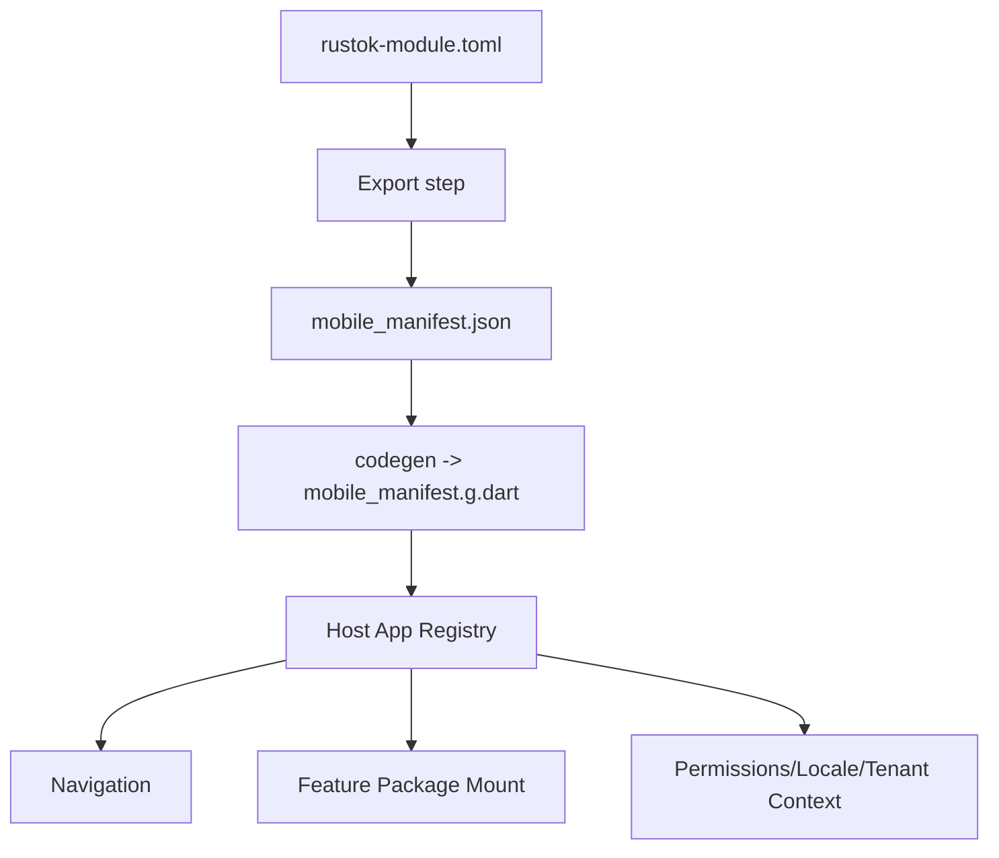
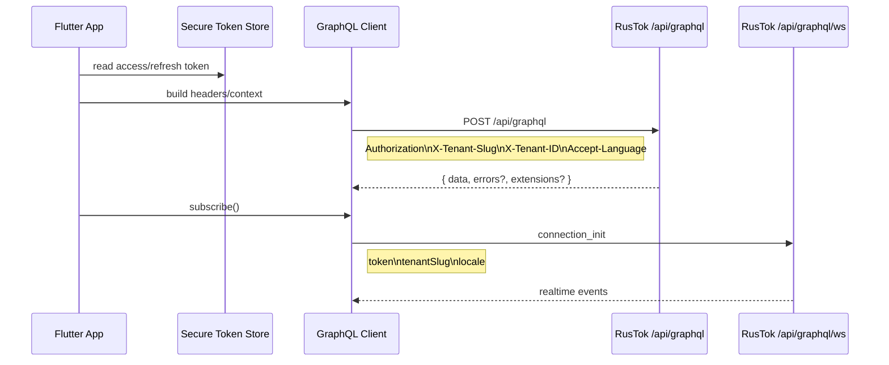

# Flutter Application Architecture for RusTok

## Executive summary

The available connected connector in this session is **GitHub**; the analysis was performed **only** on the `RusTokRs/RusTok` repository, as required. The analysis shows that RusTok already thinks of the platform as a **modular monolith** with an explicit `apps/server` as the composition root, with host applications that **mount** module surfaces but do not take domain logic and UI ownership away from modules. For UI clients the **canonical transport contract** is declared as GraphQL, and external/headless/mobile clients must use GraphQL and/or REST, without relying on internal Leptos `#[server]` functions. This makes the Flutter client not "just another folder of screens" but a **new host client of the platform** that must be able to mount module-owned mobile surfaces according to manifest-driven platform rules.

The recommended strategy is a **feature-first modular Flutter app** with **Clean Architecture-lite**, where:
- **Riverpod** handles state management and DI at the app and feature level,
- **go_router** handles shell-routing, deep links and typed query/path parameters,
- **graphql_flutter** + **graphql_codegen** provide standard connection to RusTok GraphQL, cache, subscriptions and typed operations,
- module-owned mobile UI lives in separate packages like `packages/modules/<slug>_mobile`, while the common scaffold, tokens, route contracts, locale/tenant/auth context and GraphQL wiring are placed in shared packages. This approach best matches the current platform logic of RusTok: shared UI should remain presentational, locale and routing contracts should be host-owned, and module surfaces should be connected declaratively rather than by hard copying into the host.

From a Flutter ecosystem perspective, the choice of Riverpod/go_router seems the most pragmatic: Flutter directly emphasizes the importance of intentional architecture, MVVM/state management and dependency injection for scalable applications; Riverpod is positioned as a reactive caching/data-binding framework with compile-safety, automatic loading/error handling and testability; go_router remains the officially published Flutter package for declarative routing, deep linking, ShellRoute and typed routes; and `graphql_flutter` supports `GraphQLClient`, `AuthLink`, `GraphQLCache`, `HiveStore`, optimistic updates and subscriptions via split between HTTP and WebSocket links.

Key takeaway: **do not** build the Flutter application as one large `lib/features/...` without package boundaries. For RusTok a better approach is the **host app + shared scaffold packages + module-owned mobile packages + generated contracts** scheme. This reduces UI drift, allows mirroring the parallel module structure of the platform, simplifies phased migration and makes the mobile client compatible with the manifest-driven future of the platform.

## What the RusTok Analysis Showed

The RusTok repository already has almost all the architectural rules needed for a mobile client. The platform is divided into host applications (`apps/server`, `apps/admin`, `apps/storefront`, `apps/next-admin`, `apps/next-frontend`), platform modules and shared/capability crates; UI ownership stays with the module, and the host is responsible for routing, shell, locale propagation, auth/session UX and wiring module surfaces. In other words, it makes most sense to introduce the Flutter client as **yet another host**, not as a set of chaotically copied screens.

The platform already has a strong contract layer for UI. The module manifest (`rustok-module.toml`) can declare `provides.admin_ui` and `provides.storefront_ui`, route segment, i18n paths, child pages and UI-classification; the `rustok-blog` example shows `ui_classification = "dual_surface"`, admin/storefront route segments, child pages and separate locale bundles. For Flutter this is a direct signal: the mobile client should introduce a **similar contract model**, for example via `provides.mobile_ui`, or via an external generated JSON registry exported from existing RusTok manifest files.

The transport contract is particularly important. RusTok establishes GraphQL as the **single UI-facing surface** for admin/storefront/Next/module-owned UI, and REST for integrations, webhooks and ops. The canonical platform endpoints are: `/api/graphql` and `/api/graphql/ws`; the server GraphQL host actually raises a POST handler on `/api/graphql` and a WebSocket handler on `/api/graphql/ws`. The schema builder already sets depth/complexity limits (`12` and `600`), and in the UI module `apps/admin/src/features/modules/api.rs` actual query/mutation/subscription contracts are visible, including the `BuildProgress` subscription. For the mobile client this means the "standard connection" should immediately account not only for queries/mutations but also for subscriptions, complexity limits and clear fetch policies.

Header and auth contracts are also well readable from the repository. In the Next.js helper for GraphQL RusTok passes `Authorization: Bearer ...`, `X-Tenant-Slug`, optionally `X-Tenant-ID`, and `Accept-Language`; the GraphQL auth API uses GraphQL mutations `signIn`, `signUp`, `refreshToken`, as well as queries `me` and `currentTenant`. For WebSocket subscriptions the server requires in `connection_init` at least `token` and `tenantSlug`, and optionally `locale`. This is a direct template for the mobile client: **all transport context must be assembled centrally**, not in each feature separately.

RusTok also very clearly separates shared UI and app-local UI. The UI catalog says that shared tokens and primitives live separately, must maintain parity in purpose and basic API, but are not required to have a one-to-one mirrored implementation; shared UI packages should remain **presentational** and not own transport/auth/routing/domain behavior. This is critical for Flutter: what needs to be duplicated is not the original React/Leptos component tree, but the **design contract, semantic roles and UX invariants**. That is, `Button`, `Badge`, `Input`, `Select`, `Card`, `Spinner` and layout primitives — in the shared `ui_kit`; and complex domain components like product editor, module registry dashboard, SEO panels, users list — in module-owned mobile packages.

Finally, RusTok has already documented two very useful host-level contracts that should definitely be carried over to mobile:
- **i18n**: the effective locale is selected by the host/runtime layer; module-owned UI must not invent its own fallback chain.
- **routing/query contract**: selection state is URL-owned source of truth; typed `snake_case` keys like `product_id`, `order_id`, `media_id`, `tab` are used, while generic `id` and camelCase aliases are not considered canonical. For Flutter this means: route params, deep links and screen selection state should be designed by the same rules so that later parity with web/admin remains natural.

### Key Repository Artifacts and Their Implications for Flutter

| Observation in RusTok | Implication for Flutter | Source |
|---|---|---|
| `apps/server` — composition root; hosts mount surfaces | Flutter must be a new host client |  |
| Module-owned UI stays with the module | Extract module screens into separate mobile packages |  |
| GraphQL is the canonical UI-facing contract | Mobile transport foundation is GraphQL, not REST primary |  |
| Server raises `/api/graphql` and `/api/graphql/ws` | Client needs HTTP + subscriptions |  |
| Shared UI must be presentational only | Do not put auth/routing/domain behavior in shared packages |  |
| Effective locale is determined by the host layer | Locale provider in app shell; not in module packages |  |
| Query keys are typed and `snake_case` | Design deep links and selection state by the same rules |  |
| Manifest declares `admin_ui`/`storefront_ui`, i18n and child pages | Mobile needs a similar registry/export layer |  |

## Recommended Architecture

### Recommended Option

For RusTok I recommend the following stack of architectural decisions:

**Feature-first modular structure + Clean Architecture-lite + Riverpod + go_router + module-owned packages**.

Why this approach:
- Flutter itself emphasizes the importance of intentional architecture, dependency injection, state management and testability in scalable applications.
- Riverpod provides compile-safety, native async/network patterns, loading/error handling, test readiness and works well in plain Dart and package architecture.
- go_router already solves deep linking, ShellRoute, query/path parameters and redirect flows, which fits well with the RusTok routing contract.
- RusTok itself already thinks of UI as a **host shell + module-owned surfaces**, so modular package boundaries on the client are natural.

By **Clean Architecture-lite** I mean not the academic "three dozen folders per feature", but a practical minimum:
- `presentation`
- `application`
- `data`
- `domain` only where there are genuinely complex rules and use cases

For CRUD-heavy screens the domain layer can be kept thin. For auth, permissions, module registry, workflows, SEO/publishing, pricing, offline drafts — on the contrary, a domain/application layer is definitely needed.

### Option Comparison

| Option | Pros | Cons | Verdict |
|---|---|---|---|
| **Provider** | Very simple, official ecosystem foundation, low barrier to entry | Good for small apps, but for a large package-driven client it quickly hits manual discipline limits and is weaker in ergonomics for async/state contracts | Suitable for MVP, not optimal as the main foundation |
| **BLoC** | Strong separation of presentation and business logic, good DI/repository widgets | More boilerplate, especially with many modules and screens | Good for teams already living in event-driven style |
| **Riverpod** | Compile-safety, async-first ergonomics, test-ready, plain Dart, easy to distribute across packages | Needs discipline in naming/provider design; team without experience needs onboarding | **Best baseline choice** |
| **flutter_modular** | Built-in modular routes + DI, convenient for package/module thinking | Mixes routing and DI into a separate meta-architecture; in RusTok this may duplicate Riverpod + go_router and make the system heavier | Use only if the team has already standardized everything on Modular |
| **Clean Architecture full** | Strong isolation and testability | Risk of over-engineering, unnecessary multi-layering for simple features | Take as a principle but in **lite** style |

Basis for comparison: `provider` — wrapper around `InheritedWidget`; `flutter_bloc` emphasizes separation of presentation/business logic and DI widgets (`BlocProvider`, `RepositoryProvider`); Riverpod declares compile safety, async/error handling, test-ready and WebSocket/network scenario support; `flutter_modular` positions itself as a smart structure for modularized routes and DI.

### Architecture Diagram

```mermaid
flowchart LR
    A[Flutter Host App] --> B[App Shell]
    B --> C[Routing Layer]
    B --> D[App Context]
    D --> D1[Tenant]
    D --> D2[Auth Session]
    D --> D3[Locale]
    D --> D4[Permissions]

    C --> E[Module Registry]
    E --> F1[blog_mobile]
    E --> F2[product_mobile]
    E --> F3[users_mobile]
    E --> F4[workflow_mobile]

    F1 --> G[Application Layer]
    F2 --> G
    F3 --> G
    F4 --> G

    G --> H[Repositories]
    H --> I[GraphQL Client]
    H --> J[Local Storage]
    I --> K[/api/graphql]
    I --> L[/api/graphql/ws]
```

### Practical Trade-offs

If the RusTok team is already strongly accustomed to BLoC, choosing BLoC would not be a technical mistake. But given the current structure of RusTok — manifest-driven, module-owned UI, host-level locale/routing contracts, lots of async GraphQL reads/writes/subscriptions — Riverpod provides a lower cognitive load architecture. BLoC is particularly good for very complex workflow/state machines, but as a **universal** foundation for dozens of modular surfaces, Riverpod is usually faster and easier to maintain. This is my architectural conclusion based on the combination of RusTok requirements and library properties.

## File Structure and UI Component Placement

### Basic Placement Principle

For RusTok I would **not** make a single `lib/features` package with the complete content of all platform modules. It is better to create a monorepo of Flutter packages:

- one **host app**,
- several **shared packages**,
- a set of **module-owned mobile packages**.

This literally mirrors the current RusTok philosophy, where the host mounts surfaces and UI ownership stays with the module. Shared UI should contain only presentational primitives and tokens; app shell should hold routing, auth, locale, nav shell and module registry; module-owned mobile packages own their screens and data/application layers.

### Recommended Repository Tree

```text
rustok_mobile/
├── apps/
│   └── rustok_admin_mobile/
│       ├── lib/
│       │   ├── main.dart
│       │   ├── bootstrap.dart
│       │   ├── app.dart
│       │   ├── app_router.dart
│       │   ├── app_shell/
│       │   │   ├── presentation/
│       │   │   │   ├── app_shell.dart
│       │   │   │   ├── app_scaffold.dart
│       │   │   │   ├── app_navigation_bar.dart
│       │   │   │   ├── app_drawer.dart
│       │   │   │   └── app_error_view.dart
│       │   │   ├── application/
│       │   │   │   ├── current_tenant_controller.dart
│       │   │   │   ├── locale_controller.dart
│       │   │   │   └── auth_gate_controller.dart
│       │   │   └── domain/
│       │   │       ├── tenant_context.dart
│       │   │       └── user_session.dart
│       │   ├── routes/
│       │   │   ├── route_names.dart
│       │   │   ├── route_guards.dart
│       │   │   ├── route_codec.dart
│       │   │   └── deep_link_parser.dart
│       │   ├── registry/
│       │   │   ├── mobile_module_registry.dart
│       │   │   ├── generated/
│       │   │   │   └── mobile_manifest.g.dart
│       │   │   └── module_entry_adapter.dart
│       │   └── l10n/
│       │       ├── app_ru.arb
│       │       └── app_en.arb
│       ├── integration_test/
│       └── pubspec.yaml
├── packages/
│   ├── app_core/
│   │   └── lib/
│   │       ├── env/
│   │       ├── errors/
│   │       ├── logging/
│   │       ├── utils/
│   │       └── result/
│   ├── app_ui_kit/
│   │   └── lib/
│   │       ├── tokens/
│   │       ├── theme/
│   │       ├── atoms/
│   │       ├── molecules/
│   │       ├── organisms/
│   │       └── scaffolds/
│   ├── app_graphql/
│   │   └── lib/
│   │       ├── client/
│   │       │   ├── graphql_client_factory.dart
│   │       │   ├── graphql_headers_provider.dart
│   │       │   ├── graphql_error_mapper.dart
│   │       │   ├── graphql_retry_policy.dart
│   │       │   └── graphql_cache_policies.dart
│   │       ├── auth/
│   │       │   ├── auth_session_store.dart
│   │       │   ├── refresh_token_service.dart
│   │       │   └── secure_token_store.dart
│   │       └── generated/
│   │           └── schema.graphql
│   ├── app_route_contracts/
│   │   └── lib/
│   │       ├── query_keys.dart
│   │       ├── route_selection.dart
│   │       ├── route_sanitizer.dart
│   │       └── route_context.dart
│   ├── app_module_contracts/
│   │   └── lib/
│   │       ├── mobile_module_entry.dart
│   │       ├── mobile_nav_meta.dart
│   │       ├── mobile_surface_kind.dart
│   │       └── module_permissions.dart
│   ├── rustok_auth_mobile/
│   │   └── lib/
│   │       ├── presentation/
│   │       ├── application/
│   │       ├── data/
│   │       ├── graphql/
│   │       └── auth_mobile_module.dart
│   ├── rustok_modules_mobile/
│   │   └── lib/
│   │       ├── presentation/
│   │       ├── application/
│   │       ├── data/
│   │       ├── graphql/
│   │       └── modules_mobile_module.dart
│   ├── rustok_blog_mobile/
│   ├── rustok_product_mobile/
│   ├── rustok_users_mobile/
│   └── rustok_workflow_mobile/
├── tooling/
│   ├── build.yaml
│   ├── melos.yaml
│   └── scripts/
├── .github/
│   └── workflows/
└── pubspec.yaml
```

### What Goes Where and Why

| Path | Purpose |
|---|---|
| `apps/rustok_admin_mobile` | Host application: bootstrap, shell, routing, registry wiring, global context |
| `packages/app_core` | Basic error/result/env/logging tools without UI or domain-specific code |
| `packages/app_ui_kit` | Shared design tokens, themes, base widgets and scaffold components |
| `packages/app_graphql` | Single point for GraphQL client assembly, auth/tenant/locale headers, refresh token, error mapping |
| `packages/app_route_contracts` | Typed route/query keys and sanitization by RusTok rules |
| `packages/app_module_contracts` | Interfaces for connecting module-owned mobile packages |
| `packages/rustok_<slug>_mobile` | Screens, application/data layers and GraphQL documents for a specific module |
| `registry/generated/mobile_manifest.g.dart` | Generated module registry, child pages, nav metadata, permissions, route segments |
| `tooling/build.yaml` | `graphql_codegen` and other codegen task settings |
| `integration_test/` | E2E tests of the host application |

### Where to Place UI Components and How to Duplicate Platform Module UI

The rule should be as follows.

**In `app_ui_kit`** live only:
- tokens,
- themes,
- basic buttons and fields,
- cards, badges, list containers,
- layout/scaffold primitives,
- loading/empty/error views.

**In `rustok_<slug>_mobile`** live:
- screen widgets,
- domain-specific forms,
- complex lists/tables/cards,
- route builders,
- feature controllers,
- GraphQL documents and mappers.

This matches how RusTok already separates shared primitives from app-local/modular UI.

For **duplicating existing module UI** I recommend not doing visual copy-paste from web hosts, but adhering to three levels of parity:

| Parity Level | What to Copy | What Not to Copy |
|---|---|---|
| **Contract parity** | Entity names, permission gates, route semantics, empty/loading/error states, locale keys | Internal web-specific implementation details |
| **UX parity** | Information architecture, section order, action hierarchy, form semantics | Exact reproduction of desktop layouts on a mobile screen |
| **Visual parity** | Tokens, typography, colors, radius, iconography, component intent | Pixel-perfect web admin grids |

In other words, the `modules` screen in Flutter should reproduce the **same product contract** as the web `modules`: the same statuses, the same actions, the same constraints, the same tenant/auth/locale context — but in a mobile layout model. RusTok itself already emphasizes parity discipline between Leptos and Next admin and establishes unified locale files / FSD-like structure for modular UI; for Flutter this line needs to be continued, not a third, independent UX built.

### Proposed Registry-Driven Module Connection Flow



Practically this means: either the RusTok backend/CI publishes a JSON module registry for mobile, or the Flutter repository periodically pulls manifest snapshots and generates Dart registry code. The second option is easier to start with; the first is architecturally cleaner in the long run.

## Project Scaffold and GraphQL Integration

### Basic Application Scaffold

RusTok already sets the correct host model: shell, routing, locale propagation, auth UX, permissions and wiring of module surfaces should be host-owned. This is exactly what should appear in the Flutter `main.dart`, not a "bare MaterialApp with three screens".

```dart
// apps/rustok_admin_mobile/lib/main.dart
import 'package:flutter/material.dart';
import 'package:flutter_riverpod/flutter_riverpod.dart';

import 'app.dart';
import 'bootstrap.dart';

Future<void> main() async {
  WidgetsFlutterBinding.ensureInitialized();
  final container = await bootstrap();
  runApp(
    UncontrolledProviderScope(
      container: container,
      child: const RustokAdminMobileApp(),
    ),
  );
}
```

```dart
// apps/rustok_admin_mobile/lib/bootstrap.dart
import 'package:flutter_riverpod/flutter_riverpod.dart';

import 'package:app_core/env/env.dart';
import 'package:app_graphql/client/graphql_client_factory.dart';
import 'package:app_graphql/auth/secure_token_store.dart';

Future<ProviderContainer> bootstrap() async {
  final env = await Env.load();
  final tokenStore = SecureTokenStore();
  final container = ProviderContainer(
    overrides: [
      envProvider.overrideWithValue(env),
      secureTokenStoreProvider.overrideWithValue(tokenStore),
    ],
  );

  // Can warm up session, tenant and locale here.
  return container;
}
```

```dart
// apps/rustok_admin_mobile/lib/app.dart
import 'package:flutter/material.dart';
import 'package:flutter_riverpod/flutter_riverpod.dart';

import 'app_router.dart';
import 'package:app_ui_kit/theme/app_theme.dart';

class RustokAdminMobileApp extends ConsumerWidget {
  const RustokAdminMobileApp({super.key});

  @override
  Widget build(BuildContext context, WidgetRef ref) {
    final router = ref.watch(appRouterProvider);
    final locale = ref.watch(appLocaleProvider);

    return MaterialApp.router(
      title: 'RusTok Mobile',
      routerConfig: router,
      locale: locale,
      theme: buildLightTheme(),
      darkTheme: buildDarkTheme(),
      themeMode: ThemeMode.system,
      debugShowCheckedModeBanner: false,
    );
  }
}
```

For the UI layer it is reasonable to build on **Material 3**: Flutter indicates that starting from 3.16 `useMaterial3` is enabled by default, and the transition to Material 3 includes new components, updated visual values and migration to `ColorScheme.fromSeed`. For RusTok this is a good baseline: a modern system component set without excessive custom low-level UI.

```dart
// packages/app_ui_kit/lib/theme/app_theme.dart
import 'package:flutter/material.dart';
import 'package:flex_color_scheme/flex_color_scheme.dart';

ThemeData buildLightTheme() {
  return FlexThemeData.light(
    useMaterial3: true,
    scheme: FlexScheme.indigo,
    visualDensity: VisualDensity.standard,
  );
}

ThemeData buildDarkTheme() {
  return FlexThemeData.dark(
    useMaterial3: true,
    scheme: FlexScheme.indigo,
    visualDensity: VisualDensity.standard,
  );
}
```

### Routing

For RusTok it is especially important that routing is:
- declarative,
- deep-link friendly,
- shell-capable,
- compatible with the platform's typed query/path contract.

This is where `go_router` provides the best balance: URL-based API, deep links, redirects, sub-routes and `ShellRoute` for a persistent shell/navigation bar.

```dart
// apps/rustok_admin_mobile/lib/app_router.dart
import 'package:flutter/material.dart';
import 'package:flutter_riverpod/flutter_riverpod.dart';
import 'package:go_router/go_router.dart';

import 'app_shell/presentation/app_shell.dart';
import 'registry/mobile_module_registry.dart';
import 'routes/route_guards.dart';
import 'features/auth/presentation/sign_in_screen.dart';
import 'features/home/presentation/home_screen.dart';

final appRouterProvider = Provider<GoRouter>((ref) {
  final isSignedIn = ref.watch(isSignedInProvider);
  final registry = ref.watch(mobileModuleRegistryProvider);

  return GoRouter(
    initialLocation: '/home',
    redirect: (context, state) {
      final loggingIn = state.matchedLocation == '/sign-in';
      if (!isSignedIn && !loggingIn) return '/sign-in';
      if (isSignedIn && loggingIn) return '/home';
      return null;
    },
    routes: [
      GoRoute(
        path: '/sign-in',
        builder: (_, __) => const SignInScreen(),
      ),
      ShellRoute(
        builder: (_, __, child) => AppShell(child: child),
        routes: [
          GoRoute(
            path: '/home',
            builder: (_, __) => const HomeScreen(),
          ),
          ...registry.routes,
        ],
      ),
    ],
  );
});
```

### DI and Registry-Driven Module Connection

In RusTok the host application should not become the owner of module logic; it should only mount surfaces and pass context. This is exactly what needs to be done in Flutter through a registry.

```dart
// packages/app_module_contracts/lib/mobile_module_entry.dart
import 'package:flutter/widgets.dart';
import 'package:go_router/go_router.dart';

abstract interface class MobileModuleEntry {
  String get slug;
  String get navLabel;
  int get navOrder;
  List<RouteBase> buildRoutes();
  Widget buildNavIcon(BuildContext context);
}
```

```dart
// apps/rustok_admin_mobile/lib/registry/mobile_module_registry.dart
import 'package:flutter_riverpod/flutter_riverpod.dart';
import 'package:go_router/go_router.dart';

import 'package:rustok_blog_mobile/blog_mobile_module.dart';
import 'package:rustok_modules_mobile/modules_mobile_module.dart';

final mobileModuleRegistryProvider = Provider<MobileModuleRegistry>((ref) {
  final entries = [
    BlogMobileModule(),
    ModulesMobileModule(),
    // further auto-generated wiring
  ]..sort((a, b) => a.navOrder.compareTo(b.navOrder));

  return MobileModuleRegistry(
    entries: entries,
    routes: entries.expand((e) => e.buildRoutes()).toList(),
  );
});

class MobileModuleRegistry {
  MobileModuleRegistry({
    required this.entries,
    required this.routes,
  });

  final List<dynamic> entries;
  final List<RouteBase> routes;
}
```

### Standard GraphQL Connection for RusTok

Official GraphQL over HTTP recommendations set a very clear foundation: GraphQL usually works through a **single endpoint**, requests go via `POST` with `application/json`, and the body contains `query`, `operationName`, `variables`, `extensions`; the response uses top-level keys `data`, `errors`, `extensions`, and partial success is allowed as `data + errors`. RusTok in turn establishes the UI-facing endpoint `/api/graphql`, WebSocket endpoint `/api/graphql/ws` and uses additional context headers (`Authorization`, `X-Tenant-Slug`, `X-Tenant-ID`, `Accept-Language`) and WS initialization payload (`token`, `tenantSlug`, `locale`).



```dart
// packages/app_graphql/lib/client/graphql_client_factory.dart
import 'package:graphql_flutter/graphql_flutter.dart';

class GraphqlClientFactory {
  GraphQLClient create({
    required String apiBaseUrl,
    required String wsBaseUrl,
    required Future<String?> Function() accessToken,
    required Future<String?> Function() tenantSlug,
    required Future<String?> Function() tenantId,
    required Future<String> Function() localeTag,
  }) {
    final httpLink = HttpLink('$apiBaseUrl/api/graphql');

    final authLink = AuthLink(
      getToken: () async {
        final token = await accessToken();
        return token == null ? '' : 'Bearer $token';
      },
    );

    final contextLink = Link.function((request, [forward]) async* {
      final headers = <String, String>{
        'Accept-Language': await localeTag(),
      };

      final slug = await tenantSlug();
      final id = await tenantId();

      if (slug != null && slug.isNotEmpty) {
        headers['X-Tenant-Slug'] = slug;
      }
      if (id != null && id.isNotEmpty) {
        headers['X-Tenant-ID'] = id;
      }

      final next = request.updateContextEntry<HttpLinkHeaders>(
        (existing) => HttpLinkHeaders(
          headers: {
            ...?existing?.headers,
            ...headers,
          },
        ),
      );

      yield* forward!(next);
    });

    final wsLink = WebSocketLink(
      '$wsBaseUrl/api/graphql/ws',
      config: SocketClientConfig(
        autoReconnect: true,
        initialPayload: () async => <String, dynamic>{
          'token': await accessToken(),
          'tenantSlug': await tenantSlug(),
          'locale': await localeTag(),
        },
      ),
    );

    final link = Link.split(
      (request) => request.isSubscription,
      wsLink,
      Link.from([authLink, contextLink, httpLink]),
    );

    return GraphQLClient(
      link: link,
      cache: GraphQLCache(store: HiveStore()),
      defaultPolicies: DefaultPolicies(
        query: Policies(
          fetch: FetchPolicy.cacheAndNetwork,
        ),
        mutate: Policies(
          fetch: FetchPolicy.noCache,
        ),
        watchQuery: Policies(
          fetch: FetchPolicy.cacheAndNetwork,
        ),
      ),
    );
  }
}
```

`graphql_flutter` requires `GraphQLClient` with `link` and `cache`, supports `AuthLink`, `GraphQLCache`, `HiveStore`, optimistic mutations and subscriptions via split on subscription link and regular terminating link. This matches the RusTok transport contract well.

### Authorization and Refresh

RusTok already shows GraphQL mutations `signIn`, `signUp`, `refreshToken`, as well as queries `me` and `currentTenant`. On the mobile client I recommend the following policy:

- `accessToken` and `refreshToken` — only in `flutter_secure_storage`,
- `tenantSlug` and non-sensitive UI prefs — in `shared_preferences`,
- refresh — centralized service in `app_graphql/auth`,
- request retry — **once** after successful refresh,
- on refresh failure — hard logout and cache/session cleanup.

```dart
abstract interface class SessionStore {
  Future<AuthSession?> read();
  Future<void> write(AuthSession session);
  Future<void> clear();
}

class AuthSession {
  const AuthSession({
    required this.accessToken,
    required this.refreshToken,
    required this.tenantSlug,
  });

  final String accessToken;
  final String refreshToken;
  final String tenantSlug;
}
```

### Caching, Error Handling and Subscriptions

For RusTok I would recommend **not promising offline-first** unless separately confirmed by requirements. The current reasonable baseline is:

- persisted GraphQL cache for reads;
- secure session store;
- local drafts only for features that really need them;
- subscriptions where live surfaces exist: build progress, possibly notifications, audit/event streams;
- complex offline synchronization deferred until explicit product requirement.

This matches both the nature of a platform admin client and the general GraphQL demand control/security mechanisms. The GraphQL Foundation separately recommends demand control through pagination, depth limiting, breadth/batch limiting and rate limiting; RusTok already limits depth/complexity on the server, so the mobile client should not create "fat queries" for UI convenience.

### Example GraphQL Documents and Mapping

```graphql
# packages/rustok_modules_mobile/lib/graphql/list_modules.graphql
query ListModules {
  moduleRegistry {
    moduleSlug
    name
    description
    version
    kind
    dependencies
    enabled
    ownership
    trustLevel
    recommendedAdminSurfaces
    showcaseAdminSurfaces
  }
}
```

```graphql
# packages/rustok_auth_mobile/lib/graphql/sign_in.graphql
mutation SignIn($input: SignInInput!) {
  signIn(input: $input) {
    accessToken
    refreshToken
    user {
      id
      email
      name
      role
      status
    }
  }
}
```

```graphql
# packages/rustok_modules_mobile/lib/graphql/build_progress.graphql
subscription BuildProgress {
  buildProgress {
    buildId
    status
    stage
    progress
    releaseId
    errorMessage
  }
}
```

```yaml
# tooling/build.yaml
targets:
  $default:
    builders:
      graphql_codegen:
        options:
          clients:
            - graphql
          scalars:
            DateTime:
              type: DateTime
              fromJsonFunctionName: dateTimeFromJson
              toJsonFunctionName: dateTimeToJson
              import: package:app_core/utils/scalars.dart
```

```dart
// packages/rustok_modules_mobile/lib/data/modules_repository.dart
import 'package:graphql/client.dart';
import '../graphql/list_modules.graphql.dart';

class ModulesRepository {
  ModulesRepository(this._client);

  final GraphQLClient _client;

  Future<List<ModuleSummary>> listModules() async {
    final result = await _client.query$ListModules(
      Options$Query$ListModules(
        fetchPolicy: FetchPolicy.cacheAndNetwork,
      ),
    );

    if (result.hasException) {
      throw mapGraphqlException(result.exception);
    }

    final items = result.parsedData?.moduleRegistry ?? const [];
    return items.map(ModuleSummary.fromGql).toList();
  }
}

class ModuleSummary {
  const ModuleSummary({
    required this.slug,
    required this.name,
    required this.description,
    required this.enabled,
  });

  final String slug;
  final String name;
  final String description;
  final bool enabled;

  factory ModuleSummary.fromGql(Query$ListModules$moduleRegistry gql) {
    return ModuleSummary(
      slug: gql.moduleSlug,
      name: gql.name,
      description: gql.description,
      enabled: gql.enabled,
    );
  }
}
```

### Screen and Widget Templates

```dart
// packages/app_ui_kit/lib/scaffolds/app_screen.dart
import 'package:flutter/material.dart';

class AppScreen extends StatelessWidget {
  const AppScreen({
    super.key,
    required this.title,
    required this.body,
    this.fab,
  });

  final String title;
  final Widget body;
  final Widget? fab;

  @override
  Widget build(BuildContext context) {
    return Scaffold(
      appBar: AppBar(title: Text(title)),
      body: SafeArea(child: body),
      floatingActionButton: fab,
    );
  }
}
```

```dart
// packages/app_ui_kit/lib/scaffolds/async_screen.dart
import 'package:flutter/material.dart';
import 'package:flutter_riverpod/flutter_riverpod.dart';

class AsyncScreen<T> extends StatelessWidget {
  const AsyncScreen({
    super.key,
    required this.value,
    required this.data,
  });

  final AsyncValue<T> value;
  final Widget Function(T data) data;

  @override
  Widget build(BuildContext context) {
    return value.when(
      data: data,
      loading: () => const Center(child: CircularProgressIndicator()),
      error: (error, stack) => Center(
        child: Text('Error: $error'),
      ),
    );
  }
}
```

```dart
// packages/rustok_modules_mobile/lib/presentation/modules_screen.dart
class ModulesScreen extends ConsumerWidget {
  const ModulesScreen({super.key});

  @override
  Widget build(BuildContext context, WidgetRef ref) {
    final modules = ref.watch(modulesControllerProvider);

    return AppScreen(
      title: 'Modules',
      body: AsyncScreen(
        value: modules,
        data: (items) => ListView.builder(
          itemCount: items.length,
          itemBuilder: (_, index) {
            final item = items[index];
            return ListTile(
              title: Text(item.name),
              subtitle: Text(item.description),
              trailing: Switch(
                value: item.enabled,
                onChanged: (_) {},
              ),
            );
          },
        ),
      ),
    );
  }
}
```

## Libraries and Custom Modules

### Recommended Third-Party Libraries

Below is the recommended set of libraries for a starter production scaffold. The versions below are taken from official library pages as of **May 22, 2026**. For state/routing/DI: `flutter_riverpod 3.3.1`, `go_router 17.2.3`, `get_it 9.2.1`, `flutter_bloc 9.1.1`, `provider 6.1.5+1`, `flutter_modular 6.4.1`, `auto_route 11.1.0`; for data/GraphQL: `graphql_flutter 5.3.0`, `graphql_codegen 3.0.1`, `build_runner 2.15.0`, `dio 5.9.2`, `flutter_secure_storage 10.2.0`, `shared_preferences 2.5.5`, `drift 2.33.0`, `isar 3.1.0+1`, `json_serializable 6.14.0`; for UI/testing: `flutter_svg 2.3.0`, `flex_color_scheme 8.4.0`, `skeletonizer 2.1.3`, `mocktail 1.0.5`, `patrol 4.6.0`. Note that `golden_toolkit 0.15.0` is marked as **discontinued** on pub.dev, so I would not use it for a new project.

| Category | Recommended | Why | Alternative | When to Choose Alternative |
|---|---|---|---|---|
| State management | **flutter_riverpod** | Best balance of async ergonomics, modularity, testability | `flutter_bloc`, `provider` | BLoC — if the team is already on event-driven model; Provider — for a small MVP |
| Routing | **go_router** | Deep links, ShellRoute, query/path params, stability | `auto_route`, `flutter_modular` | `auto_route` — if strong codegen typing of routes is needed |
| DI | **Riverpod providers** as primary DI; `get_it` only selectively | Less DI mechanism duplication | `get_it` | Only for low-level services without UI-context |
| GraphQL client | **graphql_flutter** | Directly covers link/cache/auth/subscriptions | `ferry_flutter` | If a more rigid typed architecture is needed and the team is ready for a steeper setup |
| GraphQL codegen | **graphql_codegen** + `build_runner` | Typed operations and schema/document mapping | Manual gql client | Only on a very small project |
| HTTP fallback/REST | **dio** | Interceptors, cancelation, adapters | `http` | If a very simple client is sufficient |
| Secure storage | **flutter_secure_storage** | Right place for tokens and secrets | — | No alternative in baseline |
| Preferences | **shared_preferences** | Simple non-critical settings | — | Only for prefs, not for critical data |
| Local DB | **drift** | More recent stable line and good SQL/query control | `isar` | `isar` — if object-store style is preferred and the team already knows it |
| JSON models | **json_serializable** | Stable official serialization path | Manual code | If there are few models |
| SVG assets | **flutter_svg** | De facto standard for iconography | PNG-only | If SVG is not used at all |
| Theming | **flex_color_scheme** | Fast production-grade start on top of Material 3 | Manual ThemeData only | If minimal theming is needed |
| Skeleton loading | **skeletonizer** | Quickly gives consistent loading states | Custom placeholders | If the design system is very unique |
| Unit/widget mocks | **mocktail** | No code generation required | `mockito` | If the team needs exactly the Mockito flow |
| Integration/E2E | **integration_test** baseline + optional `patrol` | Patrol covers native interactions where `integration_test` is inconvenient | only `integration_test` | If native prompts/permissions are not tested |

### Why the Chosen Libraries Are Better for RusTok

For RusTok the main criterion is not "the trendiest library" but **compatibility with the modular platform architecture**. Therefore:
- `go_router` is better than `flutter_modular` as a base routing package because it solves the routing plane without imposing a separate DI/meta-architecture on top of the RusTok host-shell.
- Riverpod is better than Provider as the main state/DI foundation because RusTok clearly leans toward package boundaries, async GraphQL flows, strict contracts and testability.
- `graphql_flutter + graphql_codegen` is better than manual GraphQL because the platform is already rich with schema-driven surfaces, subscriptions and complex query/mutation contracts; a manual string-based client will quickly become a source of drift and errors.
- `drift` as an optional offline/data-db looks more reliable for long-lived production mobile than taking an object-store just because it "starts faster". However, if offline mode is limited to persisted GraphQL cache + drafts only, a separate DB might not be needed at all in the first phase. This is a product decision, not a mandatory layer.

### Proposed Custom Libraries and Modules

Here is a set of **custom** packages that I would consider not "unnecessary abstraction" but an architectural minimum.

| Package/Module | Responsibility | Why Needed as a Separate Package |
|---|---|---|
| `app_core` | env, Result/Failure, logging, retry utils, typed errors | To avoid duplicating infrastructure across features |
| `app_ui_kit` | tokens, themes, base widgets, scaffolds | To maintain parity with the RusTok shared UI contract |
| `app_graphql` | client factory, headers/ws payload, refresh policy, error mapping | To keep auth/tenant/locale transport context from spreading across all features |
| `app_route_contracts` | query keys, route sanitization, deep-link parsing | To mirror the RusTok route-selection contract |
| `app_module_contracts` | interfaces for module entry, nav metadata, permissions wiring | To make module-owned mobile packages truly pluggable |
| `generated_module_registry` | generated wiring from manifest/export | So the host does not need manual editing for each new module |

### Example Public Interfaces

```dart
abstract interface class GraphqlHeadersProvider {
  Future<Map<String, String>> buildHttpHeaders();
  Future<Map<String, Object?>> buildWsPayload();
}
```

```dart
abstract interface class RouteSelectionSanitizer {
  Map<String, String> sanitize(String routeName, Map<String, String> raw);
}
```

```dart
abstract interface class MobileModuleRegistryEntry {
  String get slug;
  bool get adminSurface;
  List<RouteBase> routes();
  List<MobileNavItem> navItems();
}
```

```dart
abstract interface class FailureMapper {
  AppFailure map(Object error, StackTrace stackTrace);
}
```

```dart
sealed class AppFailure {
  const AppFailure();
}

final class UnauthorizedFailure extends AppFailure {
  const UnauthorizedFailure();
}

final class NetworkFailure extends AppFailure {
  const NetworkFailure(this.message);
  final String message;
}

final class GraphqlFailure extends AppFailure {
  const GraphqlFailure(this.message, {this.code});
  final String message;
  final String? code;
}
```

## CI/CD, Risks and Migration Recommendations

### What to Adopt from Current RusTok CI

The current RusTok CI is already very strict: formatting, clippy/check, platform contract validation, audit/deny, documentation, unused dependencies, coverage, SBOM, server and UI artifact builds, and separate jobs for Next applications. For the Flutter repository it makes sense to take **the same level of discipline**, not just `flutter test`.

### Recommended Pipeline for Flutter

Minimum production pipeline:
1. `dart format --set-exit-if-changed .`
2. `flutter analyze`
3. codegen-check: `dart run build_runner build --delete-conflicting-outputs` + `git diff --exit-code`
4. unit/widget tests + coverage
5. integration tests
6. Android build
7. iOS build
8. artifacts + release publication for internal channels
9. contract checks: GraphQL schema snapshot, generated registry snapshot, route/query contract tests

### GitHub Actions Template

```yaml
name: Flutter CI

on:
  push:
    branches: ["**"]
  pull_request:
    branches: ["**"]
  workflow_dispatch:

jobs:
  static:
    runs-on: ubuntu-latest
    steps:
      - uses: actions/checkout@v5

      - uses: subosito/flutter-action@v2
        with:
          channel: stable

      - name: Install dependencies
        run: flutter pub get

      - name: Format
        run: dart format --set-exit-if-changed .

      - name: Codegen
        run: dart run build_runner build --delete-conflicting-outputs

      - name: Verify generated files committed
        run: git diff --exit-code

      - name: Analyze
        run: flutter analyze

  tests:
    runs-on: ubuntu-latest
    needs: static
    steps:
      - uses: actions/checkout@v5
      - uses: subosito/flutter-action@v2
        with:
          channel: stable

      - name: Install dependencies
        run: flutter pub get

      - name: Unit and widget tests
        run: flutter test --coverage

      - name: Upload coverage
        uses: actions/upload-artifact@v4
        with:
          name: coverage
          path: coverage/lcov.info

  integration-android:
    runs-on: macos-latest
    needs: tests
    steps:
      - uses: actions/checkout@v5
      - uses: subosito/flutter-action@v2
        with:
          channel: stable

      - name: Install dependencies
        run: flutter pub get

      - name: Run integration tests
        run: flutter test integration_test

  build-android:
    runs-on: ubuntu-latest
    needs: tests
    steps:
      - uses: actions/checkout@v5
      - uses: subosito/flutter-action@v2
        with:
          channel: stable

      - name: Install dependencies
        run: flutter pub get

      - name: Build Android App Bundle
        run: flutter build appbundle --release --dart-define=FLAVOR=prod

      - name: Upload Android bundle
        uses: actions/upload-artifact@v4
        with:
          name: android-aab
          path: build/app/outputs/bundle/release/*.aab

  build-ios:
    runs-on: macos-latest
    needs: tests
    steps:
      - uses: actions/checkout@v5
      - uses: subosito/flutter-action@v2
        with:
          channel: stable

      - name: Install dependencies
        run: flutter pub get

      - name: Build iOS without codesign
        run: flutter build ipa --release --no-codesign --dart-define=FLAVOR=prod

      - name: Upload iOS artifact
        uses: actions/upload-artifact@v4
        with:
          name: ios-ipa
          path: build/ios/ipa/*.ipa
```

### Risks and Mitigations

| Risk | Why Real for RusTok | Mitigation |
|---|---|---|
| **UI drift** between Flutter and web hosts | RusTok already supports multiple UI stacks | Unified tokens, locale keys, route/query contracts, review checklist for parity |
| **Transport contract divergence** | Platform already rich with GraphQL/REST/WS surfaces | All transport context only through `app_graphql`, no feature-local clients |
| **Over-modularization** | Easy to turn everything into too many packages | Extract a package only if there is an ownership boundary or reuse |
| **Schema drift / codegen drift** | GraphQL surface is live and growing | Schema snapshot + codegen CI + generated files checked in |
| **Offline complexity** | Not specified whether offline-first is needed | Start with persisted cache + secure session; Drift/outbox only after requirements are confirmed |
| **Complex routing state** | RusTok route/query contract is already strict | Single sanitizer and typed route keys package |
| **Auth/tenant bugs** | RusTok tenant/auth/locale context is mandatory | HTTP/WS headers and payload assembled centrally and contract-tested |

### Phased Implementation Plan (Without Duplication)

Below is a single implementation plan that **references already described sections** of this document instead of repeating the same decisions.


_Legend: `⬜ Planned` — not started, `🟡 In progress` — in progress, `✅ Done` — completed._

| Status | Phase | Scope | Reference in This Document | Definition of Done |
|---|---|---|---|---|
| 🟡 In progress | **Phase 0 — Foundation** | Create `host app`, app shell, theme, auth session store, GraphQL client factory, route contracts and immediately establish FFA-baseline for Flutter (single product/capability contract without Flutter-specific API). | [Basic Application Scaffold](#basic-application-scaffold), [Routing](#routing), [Standard GraphQL Connection for RusTok](#standard-graphql-connection-for-rustok), [Authorization and Refresh](#authorization-and-refresh) | login + `me` + `currentTenant` work, basic shell and deep-link entry to a protected screen; FFA-baseline established from the start. |
| 🟡 In progress | **Phase 1 — Pilot module** | Implement one module-owned package (recommended: `modules` or `blog`) with a real E2E flow. | [File Structure and UI Component Placement](#file-structure-and-ui-component-placement), [DI and Registry-Driven Module Connection](#di-and-registry-driven-module-connection), [Screen and Widget Templates](#screen-and-widget-templates) | One business scenario of the module passes end-to-end in the mobile host without feature-local transport clients. |
| 🟡 In progress | **Phase 2 — Registry/codegen** | Connect generated mobile registry from manifest/export and remove manual wiring in the host. Lay foundation for extensibility only under mobile-safe host metadata: nested routes, nav, locale namespace and permission gates. | [Proposed Registry-Driven Module Connection Flow](#proposed-registry-driven-module-connection-flow), [Proposed Custom Libraries and Modules](#proposed-custom-libraries-and-modules) | New module connects via manifest/codegen without host navigation frame edits; registry does not contain server-side FBA/provider metadata. |
| ⬜ Planned | **Phase 3 — Parity expansion** | Migrate remaining high-value modules, establish route/i18n/permission parity and unified error/loading/empty patterns. | [Where to Place UI Components and How to Duplicate Platform Module UI](#where-to-place-ui-components-and-how-to-duplicate-platform-module-ui), [Caching, Error Handling and Subscriptions](#caching-error-handling-and-subscriptions) | Main operator flows covered; query keys/locale/permissions contracts do not diverge from web-host rules. |
| ⬜ Planned | **Phase 4 — Hardening & release** | E2E, performance, observability, crash reporting, release pipeline (Android/iOS), rollout gates. | [Recommended Pipeline for Flutter](#recommended-pipeline-for-flutter), [GitHub Actions Template](#github-actions-template), [Risks and Mitigations](#risks-and-mitigations) | Alpha/beta releases ready, pipeline stable, critical risks closed with mitigations. |
| ⬜ Planned | **Phase 5 — Offline/advanced sync (optional)** | Add offline scenarios only after product requirement confirmation. | [Open Questions and Limitations](#open-questions-and-limitations), [Risks and Mitigations](#risks-and-mitigations) | Approved offline requirements exist and target sync/outbox strategy implemented. |


#### Operational Plan Status (updated: 2026-06-13, storefront GraphQL evidence hardening)

- **FFA noted in plan:** ✅ Yes. FFA-baseline explicitly established in `Phase 0 — Foundation` and separately enforced in the anti-drift guardrail section.
- **Current execution focus:** `Phase 1 — Pilot module` remains `🟡 In progress` for admin/operator flow, but its key seams are already closed: module-owned package, shared GraphQL transport, `toggleModule`, hydrated `me.permissions`, retry/compensation actions and dedicated operation history/recovery screen use existing lifecycle GraphQL contracts without feature-local transport clients. `Phase 2 — Registry/codegen` works as a supporting track: admin and storefront registry/codegen are checked by local deterministic checks, and storefront registry is already used for package discovery and generated home navigation.
- **Storefront track:** `rustok_frontend_mobile` separated from admin/operator host; catalog/cart package works through host-owned repository seam, durable cart id seam, host-owned checkout intent surface and source-backed GraphQL contract verifier for `storefrontSearch`, `storefrontCart` and create/add/update/remove cart mutations.
- **Next checkpoint:** promote the source-backed storefront verifier to a live schema/test-server CI job when Flutter SDK or a lightweight server harness is available; until then, do not expand Flutter API surface or add package-local transport/storage fallback chains.

#### Nearest Execution Backlog (Phase 1 pilot)

1. **Registry schema freeze (FFA-safe):** establish the minimum mobile registry contract (`module_slug`, `surface_kind`, `route_segment`, `child_pages`, `permissions`, `locale_namespace`) without Flutter-only fields.
2. **Codegen pipeline:** add reproducible generation of `mobile_manifest.g.dart` from manifest snapshot + CI diff check of generated files (in progress: local verify command already locks stale-state for manifest + snapshot).
3. **Host integration seam:** connect registry through a single adapter layer (`module_entry_adapter`) and remove manual module enumeration in shell routing/nav.
4. **Pilot gate:** `Phase 1 — Pilot module` moved to `🟡 In progress`; first mutation-backed operator action implemented via `toggleModule`, permission gate connected to hydrated `me.permissions`, retryable post-hook failures show recovery feedback and retry/compensation actions; operation history/recovery screen added as the next audit-oriented layer of the pilot flow.


#### Sprint Continuation (FFA-first, next 2 PRs)

| PR | Goal | Mandatory Artifacts | FFA Acceptance Criterion |
|---|---|---|---|
| **PR-A: Registry contract freeze** | Establish minimum mobile contract without Flutter-only extensions | `mobile_manifest` schema snapshot, compatibility rules table, field changelog | Contract describes capability/surface, not Flutter runtime details; no mobile-exclusive API fields present. |
| **PR-B: Codegen + host seam** | Make codegen deterministic and create a single adapter in the host | reproducible generation pipeline, diff-check of generated files in CI, `module_entry_adapter` as the single connection point | New module connects declaratively via registry without manual shell-routing edits; route/locale/auth context remains host-owned. |

**Phase 1 transition rule:** after `PR-A` and `PR-B` merge, take the pilot flow `modules` (preferred) or `blog`, and establish the first E2E parity evidence (login → module list/detail → back to shell) without feature-local transport clients.

#### Inline Comments Resolution Log (update 2026-05-24)

To address feedback from the previous PR and avoid a "plan for the plan's sake", we fix mandatory outputs for each nearest step:

- **PR-A is considered closed only when artifacts exist in the repository**: snapshot schema, compatibility matrix and field changelog in one track documentation location.
- **PR-B is considered closed only with a verifiable CI signal**: deterministic codegen + `git diff --exit-code` for generated files after generation.
- **Phase 1 transition is prohibited without an evidence block**: a link to a specific E2E run of the pilot flow (`modules`/`blog`) and FFA-checklist mark without exceptions.

#### Concrete Deliverables (Phase 2 execution board)

| Deliverable | Owner Zone | Verification Command / Signal | Status |
|---|---|---|---|
| `mobile_manifest` minimal schema snapshot | `rustok_mobile/tooling` + track docs | schema snapshot updated and committed | ✅ Done |
| Compatibility matrix (`required/optional/deprecated`) | `docs/research/flutter.md` | matrix filled for all contract fields | ✅ Done |
| Deterministic codegen job | mobile CI pipeline | `dart run build_runner build --delete-conflicting-outputs` + `git diff --exit-code` | ⬜ Planned |
| Local deterministic codegen check | `rustok_mobile/tooling/scripts/check_mobile_codegen.py` | generator CLI runs into temp outputs and diffs against committed manifest/snapshot | ✅ Done |
| Generated-file diff diagnostics | `rustok_mobile/tooling/scripts/verify_mobile_manifest.py` | stale manifest/snapshot failures print unified diff + regeneration command | ✅ Done |
| Host adapter seam (`module_entry_adapter`) | `apps/rustok_admin_mobile` | registry connects without manual module list in shell-router | ✅ Done |
| Manifest-driven nav icon mapping | `apps/rustok_admin_mobile` | host nav uses `nav.icon` from generated manifest and fallback by module metadata without manual route list | ✅ Done |
| Pilot E2E evidence (modules/blog) | `rustok_mobile/apps/rustok_admin_mobile/test/pilot_modules_flow_test.dart` + `rustok_mobile/packages/rustok_modules_mobile/test/modules_mobile_screen_test.dart` | authenticated shell → GraphQL-backed module list → module detail route → shell back; package widget test verifies `toggleModule` action refresh and operation history/recovery actions | 🟡 In progress |
| Storefront catalog/cart GraphQL source verifier | `rustok_mobile/tooling/scripts/verify_storefront_graphql_contract.py` + `rustok_mobile/tooling/tests/test_storefront_cart_graphql_contract.py` | `python3 rustok_mobile/tooling/scripts/verify_storefront_graphql_contract.py` verifies catalog/cart operation documents against existing server-owned surfaces | ✅ Done |
| Storefront live schema/test-server promotion | mobile CI pipeline + server test harness | source verifier now accepts `--live-results` JSON for the same catalog/cart operation set and fails on missing/non-passed live results; producing that JSON from a real test server remains the CI harness step | 🟡 In progress |
| Storefront package mapping expansion gate | `apps/rustok_frontend_mobile` + module-owned packages | add a new package-backed route only when a module-owned package exists and consumes a host-provided repository | ⬜ Planned |

#### PR-D Evidence Pack (Flutter storefront mobile host)

**Storefront mobile host:** `rustok_mobile/apps/rustok_frontend_mobile`.

A separate customer-facing Flutter host was added because the web storefront already exists as `apps/storefront` + `apps/next-frontend`, and the mobile storefront should not be mixed with the admin/operator application:
- host-owned runtime context — `StorefrontRuntimeContext` and `storefrontGraphQlConfigProvider` assemble `tenantSlug`, `locale` and `/api/graphql` endpoint centrally;
- route contract — shell contains `home/catalog/cart/profile`, mounts the module-owned catalog/cart package and uses generated storefront registry for reserved `/modules/:routeSegment`;
- FFA rule — the new host does not introduce Flutter-only backend API and does not copy canonical routing/storage logic from web storefront;
- evidence — `rustok_mobile/apps/rustok_frontend_mobile/test/storefront_router_test.dart` checks home runtime context, catalog/cart routes and generic module placeholder route.

Next storefront mobile step: advance the cart part to a shared-transport backend implementation and connect storefront packages through the generated registry, synchronously with `docs/UI/storefront.md` and web storefront parity rules.

#### PR-C Evidence Pack (Phase 1 pilot modules flow)

**Pilot package:** `rustok_mobile/packages/rustok_modules_mobile`.

Minimum Phase 1 pilot now established as a module-owned mobile package for surface `modules`:
- data boundary — `ModulesRepository`, where the host must pass a shared GraphQL client;
- transport implementation — `GraphQlModulesRepository` uses the existing platform query `moduleRegistry`;
- UI entry point — `ModulesMobileScreen` with loading/error/empty states and navigation to a generated host route;
- host seam — `apps/rustok_admin_mobile` overrides `modulesRepositoryProvider` via `graphQlClientProvider`, preserving auth/tenant/locale context at the host layer;
- evidence — widget E2E `pilot_modules_flow_test.dart` checks authenticated shell → module list → generated detail route → return to `/modules`.

FFA restriction for this step: the `rustok_modules_mobile` package does not create its own GraphQL client, auth/session store, tenant resolver or locale fallback chain. It only consumes the host-provided repository and existing GraphQL surface.

#### PR-E Evidence Pack (Phase 1 modules mutation action)

**Mutation-backed operator action:** `toggleModule` in `rustok_mobile/packages/rustok_modules_mobile`.

The `modules` pilot flow expanded from read-only list/detail evidence to the first operator action:
- data boundary — `ModulesRepository.toggleModule(...)` adds a write-side contract alongside `listModules()`;
- transport implementation — `GraphQlModulesRepository` uses the existing canonical GraphQL mutation `toggleModule(moduleSlug, enabled)` and returns typed `ModuleToggleResult`;
- UI action — `ModulesMobileScreen` shows enable/disable action only for optional modules and GraphQL-hydrated `modules:manage` capability context;
- refresh evidence — after a successful mutation, UI invalidates `modulesControllerProvider` and re-reads `moduleRegistry`;
- test evidence — `modules_mobile_screen_test.dart` checks mutation request, refresh state, recovery feedback and retry/compensation actions without feature-local GraphQL client.

Permission source now hydrated via GraphQL `me.permissions` in host bootstrap probe; retryable lifecycle failures read through existing query `failedModuleOperationRecoveryPlans`, and recovery executed through existing mutations `retryFailedModuleOperationPostHook` and `compensateFailedModuleOperation`. This is not a new Flutter-specific backend API and not a feature-local fallback chain.

#### PR-F Evidence Pack (Phase 1 lifecycle recovery actions)

**Recovery actions:** `retryFailedModuleOperationPostHook` and `compensateFailedModuleOperation` in `rustok_mobile/packages/rustok_modules_mobile`.

The `modules` pilot flow now not only shows recovery feedback but also allows the operator to execute canonical recovery actions:
- data boundary — `ModulesRepository.retryFailedPostHook(...)` and `ModulesRepository.compensateFailedOperation(...)` add a write-side recovery contract alongside `toggleModule(...)`;
- transport implementation — `GraphQlModulesRepository` uses existing lifecycle GraphQL mutations without Flutter-only API;
- UI action — `_RecoveryPlanNotice` shows `Retry post-hook` and `Compensate`, blocks retry for non-retryable plans and invalidates `modulesControllerProvider` after recovery;
- test evidence — `modules_mobile_screen_test.dart` checks retry and compensation action requests, recovery notice cleanup and absence of feature-local GraphQL client.

The next step after PR-F was closed by a separate audit-oriented layer: the inline recovery notice can now lead to a dedicated operation history/recovery screen without a feature-local GraphQL client.

#### PR-G Evidence Pack (Phase 1 operation history/recovery screen)

**Operation history screen:** `ModulesRecoveryScreen` in `rustok_mobile/packages/rustok_modules_mobile`.

The `modules` pilot flow expanded from an inline recovery notice to a separate screen for failed lifecycle operations history:
- UI boundary — `ModulesRecoveryScreen` shows a list of `failedModuleOperationRecoveryPlans` with `operationId`, requested/previous state, `issue`, `recommendedAction`, `correlationId`, `requestedBy` and `errorMessage`;
- host route — `apps/rustok_admin_mobile` mounts `/modules/recovery/:moduleSlug` inside the existing shell and passes the same host-provided `ModulesRepository`;
- action parity — the screen executes the same canonical `retryFailedModuleOperationPostHook` and `compensateFailedModuleOperation`, invalidates `modulesControllerProvider` and re-reads recovery history;
- FFA guardrail — the recovery screen does not add Flutter-only API, does not create a feature-local GraphQL client and remains a consumer of existing lifecycle GraphQL contracts;
- test evidence — `modules_mobile_screen_test.dart` checks metadata/history rendering and recovery action requests, and `pilot_modules_flow_test.dart` checks the transition from recovery feedback to a shell-mounted recovery route.

Next step after PR-G: establish the operation history/recovery screen in CI/codegen evidence and continue the storefront mobile track with the first module-owned catalog/cart package.


#### PR-H Evidence Pack (storefront catalog/cart mobile package)

**Storefront catalog/cart package:** `rustok_mobile/packages/rustok_catalog_mobile`.

The storefront mobile track now has its first module-owned package instead of catalog/cart placeholder screens:
- UI-boundary — `StorefrontCatalogScreen` and `StorefrontCartScreen` live outside the host and own customer-facing loading/error/empty states;
- data-boundary — `StorefrontCatalogRepository` is passed by the host via Riverpod, so the package does not create a GraphQL client, tenant resolver, auth/session store or locale fallback chain;
- shared-transport wiring — `apps/rustok_frontend_mobile` uses host-owned `GraphQlStorefrontCatalogRepository`, which reads the catalog via the existing GraphQL `storefrontSearch`;
- host route — `apps/rustok_frontend_mobile` mounts the package on `/catalog` and `/cart`, and shell navigation, runtime `tenantSlug`/`locale` and GraphQL configuration remain host-owned;
- test evidence — `catalog_screens_test.dart` checks package UI states with host-provided repositories, and `storefront_router_test.dart` checks catalog/cart mounting inside the customer storefront shell.

FFA guardrail for this step: this is only a mobile client/package boundary. The change does not add Flutter-specific backend API, feature-local transport client or duplicate canonical routing/storage logic.

Next storefront step: advance the cart part to canonical shared-transport reads/writes when the corresponding GraphQL/REST surface is ready.


#### PR-I Evidence Pack (storefront mobile registry/codegen)

**Storefront registry:** `rustok_mobile/apps/rustok_frontend_mobile/lib/registry/storefront_mobile_manifest.g.dart`.

Storefront mobile received a generated registry alongside the admin mobile registry:
- codegen surface — `generate_mobile_manifest.py --surface storefront` reads `provides.storefront_ui` from `rustok-module.toml` and sets `MobileSurfaceKind.storefront`;
- snapshot evidence — `rustok_mobile/tooling/snapshots/storefront_mobile_manifest.snapshot.json` captures `storefront_mobile` contract fields `module_slug`, `route_segment`, `permissions`, `locale_namespace` and `child_pages`;
- host route — generic `/modules/:routeSegment` now shows a manifest-backed title for storefront modules instead of a raw segment-only placeholder;
- verification — `check_mobile_codegen.py` and `verify_mobile_manifest.py` accept `--surface storefront`, so admin and storefront generated outputs can be checked with the same CI-friendly signal.

FFA guardrail for this step: the registry contains only mobile-safe surface metadata and does not carry server-side FBA/provider details into the Flutter host.

Next storefront step: advance the cart part to canonical shared-transport reads/writes and expand manifest-to-package mapping as new module-owned storefront packages appear.


#### PR-J Evidence Pack (storefront registry package discovery)

**Storefront package discovery:** `rustok_mobile/apps/rustok_frontend_mobile/lib/registry/storefront_surface_registry.dart`.

The generated storefront registry is now used not only for placeholder-title metadata but also for selecting the mounted package surface:
- registry adapter — `StorefrontSurfaceRegistry` normalizes `route_segment` from the generated manifest and returns a typed `catalog`, `cart` or `generic` surface match;
- host route — `/modules/products` mounts `StorefrontCatalogScreen`, and `/modules/cart` mounts `StorefrontCartScreen` through the same host-provided `StorefrontCatalogRepository`;
- generic fallback — remaining storefront module routes still show manifest-backed placeholders without feature-local transport clients;
- test evidence — `storefront_router_test.dart` checks generic `blog`, package-backed `products` and package-backed `cart` routes inside the shell.

FFA guardrail for this step: mapping remains host-side adapter logic on top of the generated mobile-safe registry and does not carry server-side provider/FBA metadata into the Flutter package.

Next storefront step: add canonical cart write actions (create/add/update/remove) and expand manifest-to-package mappings only when corresponding module-owned packages appear.


#### PR-K Evidence Pack (storefront cart read transport)

**Cart read path:** `rustok_mobile/apps/rustok_frontend_mobile/lib/data/storefront_catalog_repository.dart`.

The storefront catalog/cart package now receives cart data through host-owned shared GraphQL transport:
- runtime context — `StorefrontRuntimeContext.cartId` comes from optional `RUSTOK_STOREFRONT_CART_ID` and does not create a package-local storage contract;
- data adapter — `GraphQlStorefrontCatalogRepository.cartLines()` calls existing GraphQL `storefrontCart(id)` and maps `lineItems` to `StorefrontCartLine`;
- empty fallback — if the host did not pass a cart id, the cart surface remains in an empty state without Flutter-only API or local fallback resolver;
- FFA guardrail — the catalog/cart package still consumes only the host-provided repository and does not create its own GraphQL client, tenant resolver or locale fallback chain.

#### PR-L Evidence Pack (storefront cart write transport)

**Cart write path:** `rustok_mobile/apps/rustok_frontend_mobile/lib/data/storefront_catalog_repository.dart` + `rustok_mobile/packages/rustok_catalog_mobile/lib/src/catalog_repository.dart`.

The storefront catalog/cart package now performs customer cart write actions through the same host-owned repository seam:
- repository contract — the module-owned package declares create/add/update/remove intents, but does not create a GraphQL client, tenant resolver, locale fallback or package-local cart storage;
- data adapter — the host repository calls canonical GraphQL mutations `createStorefrontCart`, `addStorefrontCartLineItem`, `updateStorefrontCartLineItem` and `removeStorefrontCartLineItem`, reusing shared GraphQL headers/context;
- UX actions — catalog cards can add a product only when a backend-provided `variantId` exists, an empty cart can start a cart, line items can increase/decrease quantity or remove a row;
- runtime guardrail — the created cart id is stored in the host-owned `StorefrontCartIdStore`; durable storage remains a separate host-owned product decision, not a package-local contract;
- contract tests — `rustok_mobile/tooling/tests/test_storefront_cart_contract.py` verifies that the package does not fallback product id to variant id and that the host repository uses the host cart id store.

The next storefront step was closed by a host-owned persistence seam and schema-backed contract evidence: cart id is no longer tied to package-local or repository-local memory, and Flutter cart operations are checked against the existing commerce GraphQL surface.

#### PR-M Evidence Pack (storefront cart durable host seam + schema contract)

**Cart persistence and schema evidence:** `rustok_mobile/apps/rustok_frontend_mobile/lib/app_shell/storefront_context.dart` + `rustok_mobile/tooling/tests/test_storefront_cart_graphql_contract.py`.

The storefront cart write path received a host-owned durable seam without extending the Flutter-specific API:
- persistence boundary — `DurableStorefrontCartIdStore` works through `StorefrontCartIdPersistence`, so the `rustok_catalog_mobile` package still does not create a cart storage contract;
- host adapter — `FileStorefrontCartIdPersistence` can store a cart id in host-provided JSON file via `RUSTOK_STOREFRONT_CART_ID_FILE`, while previews/tests keep in-memory persistence;
- runtime guardrail — the storage key is set by the host layer (`RUSTOK_STOREFRONT_CART_STORAGE_KEY`), tenant/locale/auth context remains in shared GraphQL config;
- schema-backed evidence — `test_storefront_cart_graphql_contract.py` verifies Flutter cart operations and input types against existing resolver/input declarations in `crates/rustok-commerce`;
- FFA guardrail — the durable seam does not add `/api/flutter`, `/api/mobile` or feature-local GraphQL client and does not move storage ownership to the module-owned catalog package.

The next storefront step is partially closed by registry-driven home navigation: the storefront host now shows all generated manifest routes on the main surface, separating package-backed and manifest-only entries without a hard-coded blog route. A deeper integration/e2e signal against a real schema snapshot or test server remains the next CI step when the Flutter SDK is available in the environment.

#### PR-N Evidence Pack (storefront generated module navigation)

**Generated storefront module links:** `rustok_mobile/apps/rustok_frontend_mobile/lib/routes/storefront_router.dart`.

The storefront host now uses the generated registry not only for direct `/modules/:routeSegment` resolution but also for home navigation discovery:
- navigation boundary — `StorefrontHomePage` renders a list of `storefrontSurfaceRegistry.entries`, so new storefront manifest entries become visible without hard-coded home links;
- package/fallback signal — package-backed `products`/`cart` routes are marked as `package`, remaining manifest-only surfaces stay as generic `manifest` entries;
- route parity — tapping a generated entry leads to the same `/modules/<route_segment>` seam that already mounts `StorefrontCatalogScreen`, `StorefrontCartScreen` or a generic placeholder;
- test evidence — `storefront_router_test.dart` checks generated home links and navigation to manifest-backed `blog`, and `test_storefront_home_registry_contract.py` verifies the absence of a hard-coded `/modules/blog` home route.

The next storefront step is partially closed by a source-backed signal for the catalog/cart GraphQL path: Flutter operation documents are now verified against existing storefront/search API and server runtime parity flow. Live schema/test-server CI remains the next enhancement when the Flutter SDK and test server harness are available in the target environment. Package mappings are still expanded only when new module-owned storefront packages appear.

#### PR-O Evidence Pack (storefront catalog/cart GraphQL integration signal)

**Source-backed integration signal:** `rustok_mobile/tooling/scripts/verify_storefront_graphql_contract.py` + `rustok_mobile/tooling/tests/test_storefront_cart_graphql_contract.py`.

The storefront track received its first deterministic CI-friendly signal for the catalog/cart GraphQL path without adding Flutter-specific API:
- catalog contract — a reusable CLI check extracts the mobile `StorefrontMobileCatalog` query from Dart raw-string const and verifies it against the existing surface `storefrontSearch(input: $input)` and `SearchPreviewInput` in `crates/rustok-search/storefront/src/api.rs`;
- cart contract — the CLI check extracts mobile `StorefrontMobileCart` read and create/add/update/remove mutation documents, checks operation/root-field markers and verifies them against canonical commerce operation names;
- server-backed evidence — cart operation documents are additionally tied to `crates/rustok-commerce/tests/graphql_runtime_parity_test.rs`, where the same create/add/query/update/remove steps execute via `schema.execute(Request::new(...))` and check for absence of GraphQL errors;
- FFA guardrail — the CLI check does not introduce `/api/flutter`, `/api/mobile`, feature-local transport client or package-local tenant/locale/cart ownership and forbids `tenantId` in mobile operation documents because tenant/locale remain host-provided GraphQL context;
- environment note — this is source-backed contract/integration evidence for the current environment without Flutter SDK; the CLI can print JSON evidence with a list of server evidence paths via `--json`, while a live schema/test-server job remains the next CI enhancement, not a new architectural contract.

Next storefront step: promote this signal to a live schema/test-server job in CI when the Flutter SDK/test server harness becomes available, and expand package mappings only when new module-owned storefront packages appear.

#### PR-P Execution Slice (storefront live-schema promotion plan)

**Goal:** promote the existing source-backed verifier to a CI-grade live signal without changing the mobile/backend API contract.

Since the current check already proves Flutter operation documents match server-owned source and runtime parity test paths, the next PR should be not a new architectural layer but a promotion step:
- preflight — keep `verify_storefront_graphql_contract.py` as a fast mandatory step before running Flutter/server harness;
- live execution — spin up a test schema/server and execute the same set of operations: `StorefrontMobileCatalog`, `StorefrontMobileCart`, `StorefrontMobileCreateCart`, `StorefrontMobileAddCartLine`, `StorefrontMobileUpdateCartLine`, `StorefrontMobileRemoveCartLine`;
- evidence output — save JSON with operation name, root field, source marker, server evidence path and live execution result;
- failure policy — a live job failure should not be compensated by a Flutter fallback endpoint; the fix should address schema/resolver/client document drift;
- package expansion gate — new package-backed storefront routes are allowed only after a module-owned package and host-owned repository adapter appear; manifest-only routes remain generic placeholders.

**Not to do in PR-P:** do not add `/api/flutter`, `/api/mobile`, package-local GraphQL clients, tenant/locale/cart fallback chains or server-side FBA metadata to the Flutter registry. This is hardening existing contract, not expanding the platform surface.


#### PR-Q Evidence Pack (storefront checkout intent seam)

**Checkout intent surface:** `rustok_mobile/apps/rustok_frontend_mobile/lib/routes/storefront_router.dart`.

The storefront mobile host closed the next small FFA-safe step around checkout handoff without expanding backend/mobile API:
- host-owned checkout route — `/checkout` now reads `StorefrontRuntimeContext` and `storefrontCartIdStoreProvider`, shows tenant/locale/cart context and remains part of the storefront shell, not the module-owned catalog package;
- package boundary — `rustok_catalog_mobile` still only calls `onStartCheckout`, does not create a checkout API, GraphQL client, tenant resolver or cart storage;
- fallback policy — if the cart id is not yet persisted by the host-owned seam, the checkout page sends the user back to cart/catalog instead of creating a Flutter-only checkout endpoint;
- no-compile guardrail — `test_storefront_cart_contract.py` verifies that the checkout intent stays host-owned, does not contain `/api/flutter` or `/api/mobile`, and is not moved into package screens.

The next storefront step remains the same: connect a real live schema/test-server producer for `--live-results` and then expand package mappings only when new module-owned storefront packages appear.

#### PR-P Evidence Pack (storefront live-schema promotion seam)

**Live evidence seam:** `rustok_mobile/tooling/scripts/verify_storefront_graphql_contract.py`.

The storefront GraphQL verifier now supports a promotion path without changing mobile/backend API:
- preflight remains source-backed and checks the same Flutter operation documents against server-owned search/commerce sources;
- `--json` additionally prints `storefront_live_execution` with status `skipped` if live harness is not provided;
- `--live-results <path>` accepts JSON from a future schema/test-server harness and requires `passed` for all six operation/root-field pairs: `StorefrontMobileCatalog`, `StorefrontMobileCart`, `StorefrontMobileCreateCart`, `StorefrontMobileAddCartLine`, `StorefrontMobileUpdateCartLine`, `StorefrontMobileRemoveCartLine`;
- failure policy is already established in tooling: incomplete live-result or non-`passed` status fails the verifier, not enables a Flutter fallback endpoint;
- tests verify skipped preflight, positive live evidence and missing-live-evidence failure without Flutter SDK and without compilation.

The remaining PR-P step is to connect a real producer of this JSON from a live schema/test-server job when the corresponding server harness is available in CI.

#### PR-R Evidence Pack (storefront checkout intent host view-model)

**Checkout policy seam:** `rustok_mobile/apps/rustok_frontend_mobile/lib/app_shell/storefront_context.dart`.

The next FFA-safe storefront slice deepened checkout handoff without compilation and without expanding backend/mobile API:
- host-owned view-model — `StorefrontCheckoutIntentViewModel` now owns checkout title/description, tenant/locale label, cart label, action labels and `canContinueCheckout` policy;
- router adapter — `StorefrontCheckoutIntentPage` only reads the runtime/cart-id seam and renders the prepared model, not duplicating `cartId.trim().isNotEmpty` or cart-label formatting;
- package boundary — `rustok_catalog_mobile` still only calls `onStartCheckout`; the checkout route, copy and fallback remain in the storefront host;
- no-compile guardrail — `test_storefront_cart_contract.py` verifies the host view-model seam and prohibits widget-owned cart-id branching / Flutter-only endpoints.

The next storefront step remains a promotion task: connect a real live schema/test-server producer for `--live-results` when the corresponding server harness is available in CI.

#### PR-A Evidence Pack (registry contract freeze)

**Snapshot source (canonical):** `rustok_mobile/tooling/snapshots/mobile_manifest.snapshot.json`.

The minimum schema contract for the mobile registry is established with the following fields:
- `module_slug` — required;
- `surface_kind` — required;
- `route_segment` — required;
- `nav_icon` — required in snapshot/codegen output, optional at source module manifest level with fallback to `module`;
- `child_pages` — optional (default empty list);
- `permissions` — optional (default empty list);
- `locale_namespace` — optional.

##### Compatibility Matrix (`required/optional/deprecated`)

| Field | Status | Compatibility Rule | FFA Note |
|---|---|---|---|
| `module_slug` | required | Renaming prohibited without codegen migration layer | Identifies capability surface, not Flutter runtime detail |
| `surface_kind` | required | Enum extension allowed only with backward-compatible values | Normalizes surface type for host clients |
| `route_segment` | required | Change requires explicit redirect/mapping in host routing | Supports unified routing contract between hosts |
| `nav_icon` | required in snapshot / optional in source manifests | Absence in manifest normalizes to `module`; new values must be backward-compatible with host fallback mapping | Visual parity metadata without Flutter-specific API or transport contract |
| `child_pages` | optional | Absence treated as `[]`; new elements added additively | Needed for nested mobile/admin surfaces without server-side FBA metadata |
| `permissions` | optional | Absence treated as `[]`; new permission strings additive | Capability-level gate, without mobile-only API |
| `locale_namespace` | optional | Absence means fallback to module slug namespace | Preserves host-owned locale policy without feature-local fallback |

##### Field Changelog (PR-A freeze)

- Added explicit requirement to use only capability fields, without Flutter-specific transport/UI API.
- Established default/fallback rules for optional fields (`child_pages`, `permissions`, `locale_namespace`).
- Enforced prohibition on breaking rename for `module_slug` and mandatory redirect/mapping for `route_segment`.
- Runtime-contract in `app_module_contracts` synchronized with snapshot: `surface_kind`, `module_slug/route_segment` and normalized `nav_icon` are required in generated snapshot, `child_pages`/`permissions` have default `[]`, `locale_namespace` optional.

**Execution rule:** each subsequent PR in this track must update the status table above and add a reference to verifiable evidence (commit, CI job or test log).

#### FFA Check for Each PR in This Track

- [x] No Flutter-specific API contracts on top of the platform (only consumption of existing platform contracts).
- [x] Route/query keys match canonical `snake_case` rules of RusTok.
- [x] Locale/tenant/auth context assembled by the host layer centrally (no feature-local fallback chains).
- [x] Registry/codegen changes do not break the ability of module-owned surfaces to connect declaratively.

#### Anti-Duplication Checklist for PR

- Do not duplicate architectural decisions in new docs: reference sections of this file.
- Add new details only where they logically belong (routing — in the routing section, GraphQL — in the transport section).
- When changing phases, update only this table and related sections, not create parallel "plan duplicates".

### Open Questions and Limitations


### Scope Clarification: Clients, Not a Third Web Frontend

For the current track, the Flutter scope is established as:
- do not create a "third web frontend" parallel to `apps/admin` / `apps/next-admin` / `apps/storefront` / `apps/next-frontend`;
- develop **headless clients** (mobile and desktop) as host applications on top of the existing backend contract;
- keep admin/operator and customer storefront as separate Flutter host applications (`rustok_admin_mobile` and `rustok_frontend_mobile`), not mixing their navigation and UX;
- reuse common client-core (auth/session, tenant/locale context, GraphQL transport, route/query contracts) between mobile and desktop surfaces.

This preserves platform parity and reduces maintenance cost compared to a separate web-host fork.

### Dependencies Between Plans (Anti-Drift Guardrail)

- The Flutter host, basic app shell and module-owned mobile UI packages should be developed in the FFA logic (one product contract with different runtime/topology), but **without** Flutter-specific API contracts on top of the platform.
- FBA/provider-consumer metadata pertains to server modules and backend governance. The Flutter registry/codegen must not read or duplicate `fba.*` manifest sections, `builder_contract_version`, `consumer_min_version`, machine-readable builder registry, provider capabilities or toggle profiles.
- In practice this means:
  - Flutter keeps only mobile-safe host metadata: route segment, nav, child pages, locale namespace and permissions;
  - canonical builder/state/validation/RBAC rules stay on the backend and in the general page-builder plan;
  - parity is checked via UI-facing GraphQL/REST contracts and host navigation semantics, not by server-side FBA manifest fields.
- If a separate UI-facing page-builder contract for mobile host ever appears, it should be introduced as a separate Flutter plan and not mixed with server-side FBA metadata.
- Implementation checkpoint (2026-05-31): the generated Flutter registry carries from `rustok-module.toml` only mobile-safe host metadata: routes, navigation, child pages, `locale_namespace` and `permissions`. FBA/provider-consumer metadata and `crates/rustok-page-builder/contracts/page-builder-fba-registry.json` remain a server/module concern and do not enter the Flutter snapshot; the mobile host does not introduce `builder_surface` or page-builder-specific route guards.
- Page Builder sync checkpoint (2026-06-13): synthetic Wave 0 observability evidence (`metrics` + minimum 2 `trace_samples`) remains a server/module artifact in `crates/rustok-page-builder/contracts/evidence/pages-wave0-dry-run-evidence.json`; Flutter adapters must provide runtime/device evidence only at Wave hand-off, not duplicating FBA registry or control-plane toggle semantics in the mobile registry.
- Page Builder sync checkpoint (2026-06-13, SLO): provider health/SLO metadata (`ready/degraded/unavailable`, degradation reasons, pilot thresholds) remains a server/module artifact in `crates/rustok-page-builder/contracts/page-builder-fba-registry.json`; the Flutter Wave hand-off must attach device/runtime evidence but not duplicate these FBA thresholds in the mobile registry.
- Page Builder sync checkpoint (2026-06-22, hand-off contract): `crates/rustok-page-builder/contracts/page-builder-flutter-wave-handoff.json` establishes mandatory Flutter device/runtime evidence sections (`metadata`, baseline profiles, runtime checks, trace sample, approvals) and non-goals: do not duplicate FBA registry thresholds, control-plane toggle semantics or local mobile error catalog.


Below are items **not specified** in the requirements, so in the report I gave only reasonable options, not hard requirements:

| Parameter | Status | Reasonable Default |
|---|---|---|
| Target platforms | **Clarified** | Mobile-first (iOS + Android), then desktop (macOS/Windows/Linux) on common client-core; without starting a new web host |
| Minimum OS/SDK requirements | **Not specified** | Take the current stable Flutter branch and agree on minima after package set freeze |
| Offline support | **Not specified** | Start without offline-first; only persisted cache + secure auth + drafts |
| Mobile app type | **Clarified** | Admin/operator and customer storefront as separate host applications: `rustok_admin_mobile` and `rustok_frontend_mobile` |
| Method of obtaining manifest/export for mobile registry | **Not specified** | First phase — snapshot/codegen from RusTok repo; long term — backend/export endpoint |
| Distribution model | **Not specified** | Internal/TestFlight/Play Internal in early phases |
| Live schema/test-server harness for Flutter storefront | **Planned** | Use source-backed verifier as preflight; live job should execute the same catalog/cart operations against test schema/server without new Flutter-specific endpoints |

The final recommendation remains high confidence: **build the Flutter client as a new host of the RusTok platform, not as a set of screens without ownership boundaries**. This is what best matches the current repository architecture and best scales in maintenance.
