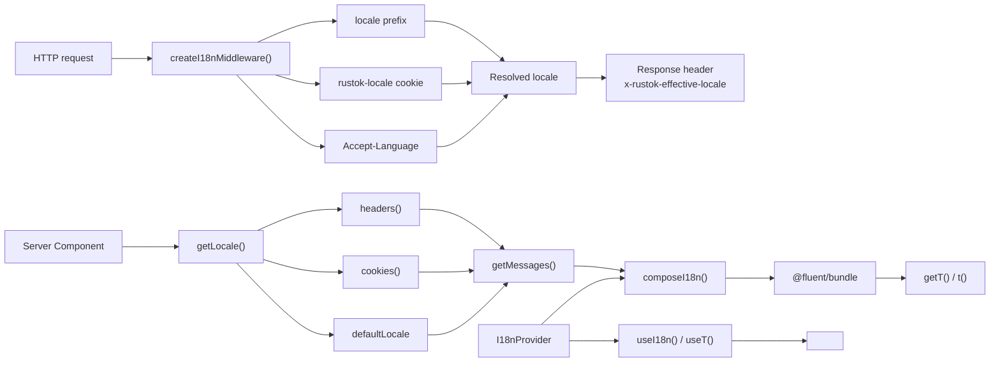
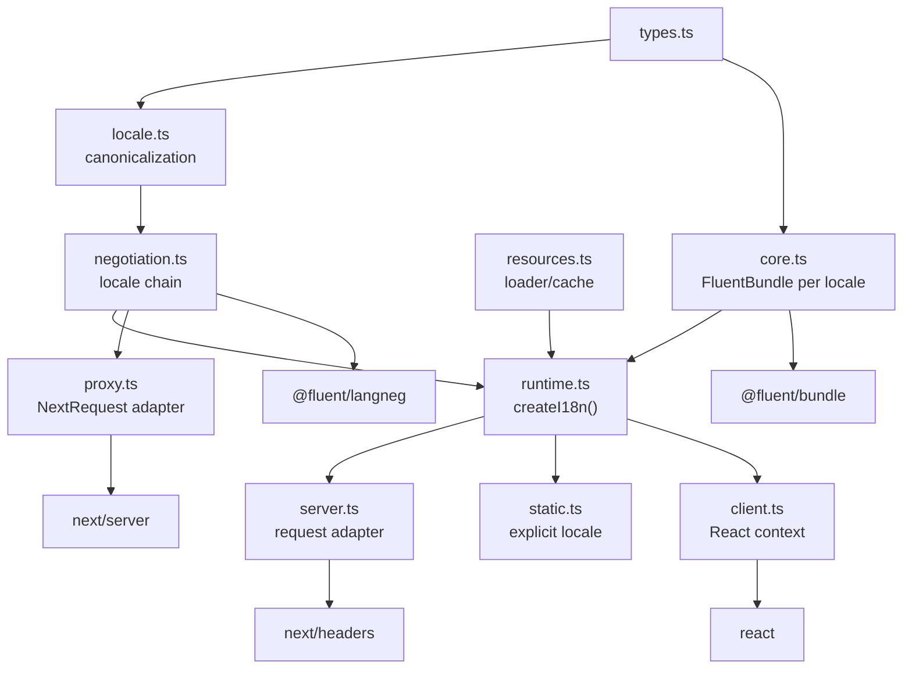
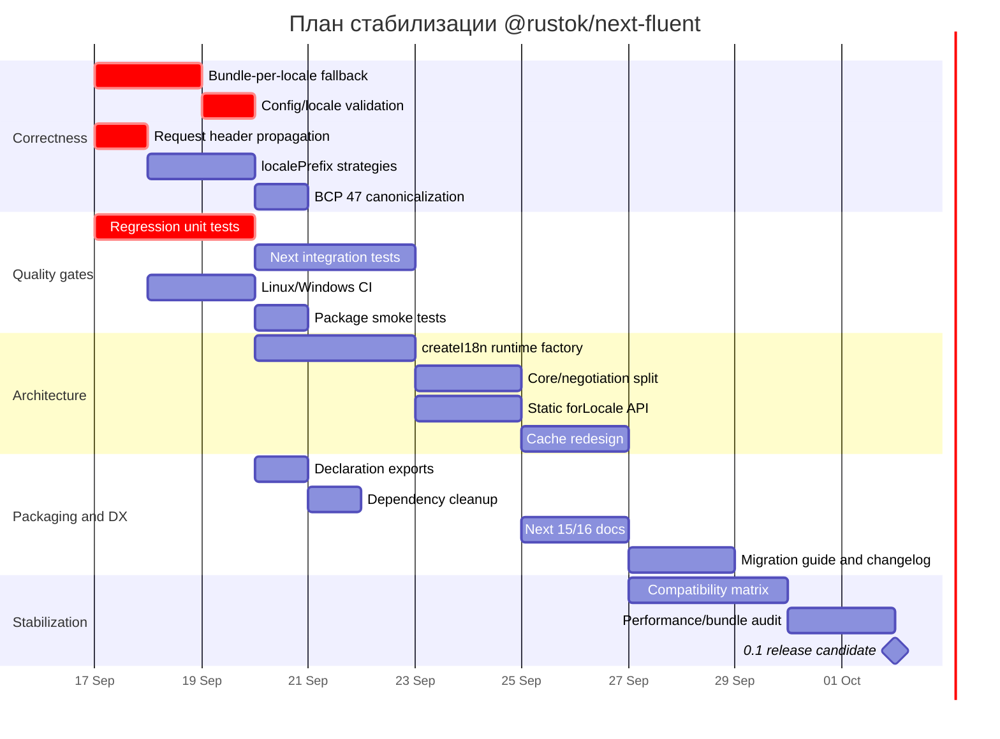

# Аудит `@rustok/next-fluent` в репозитории RusTok

## Резюме и методика

Проведён аудит пакета [`packages/next-fluent`](https://github.com/RusTokRs/RusTok/tree/fa180bc64bd1a1ba266a74502661d132fffe8da5/packages/next-fluent) на зафиксированном состоянии `main` — commit `fa180bc64bd1a1ba266a74502661d132fffe8da5`. Анализировались исходники, `package.json`, TypeScript-конфигурация, build-скрипт, тесты, README, структура репозитория и интеграционные точки с Next.js/React/Fluent.

Важное ограничение воспроизводимости: попытка выполнить обычный `git clone` в доступном execution-средстве упёрлась в недоступность внешнего DNS к GitHub (`Could not resolve host: github.com`). Поэтому утверждать, что я **фактически выполнил полный `npm install && npm run build && npm test` из клона**, было бы неверно. Исходники текущего commit были получены напрямую через GitHub API/connector и проанализированы. Там, где ниже говорится о build/runtime failure, я отделяю детерминированный вывод из кода от результата фактического запуска.

### Executive summary

Пакет имеет небольшое и в целом понятное ядро: Fluent обёрнут в `createBundle()`/`composeI18n()`, серверная часть получает локаль через `next/headers`/`cookies`, клиентская — через React Context, middleware выбирает локаль по URL/cookie/`Accept-Language`. API компактный и потенциально удобный.

Но версия `0.0.1` пока выглядит именно как ранний прототип. Наиболее серьёзные проблемы затрагивают **основной i18n-flow**, а не только качество кода:

| Приоритет | Находка | Оценка |
|---|---|---|
| P0 | Fallback-ресурсы складываются в один `FluentBundle`; пересекающиеся message IDs приводят к ошибкам `addResource`, то есть типичный fallback-сценарий архитектурно некорректен | **critical** |
| P0 | Middleware передаёт вычисленную локаль как **response header**, тогда как Server Components читают **request headers**; первый запрос к локализованному URL может отрендериться не в той локали | **critical** |
| P0 | `defaultLocale` не проверяется на принадлежность `locales`; неверная конфигурация способна генерировать `/fr`, затем `/fr/fr`, затем `/fr/fr/fr`… | **critical** |
| P1 | `localePrefix: 'always' \| 'as-needed' \| 'never'` объявлен в API, но фактически игнорируется | **major** |
| P1 | Сервер доверяет `x-rustok-effective-locale` и cookie без проверки по allow-list; произвольная строка доходит до пользовательского `getMessages(locale)` | **major**, security boundary |
| P1 | `normalizeLocale()` повреждает корректные BCP 47 locales вроде `zh-Hant-TW` | **major** |
| P1 | Глобальный cache bundle keyed только по locale может возвращать данные другого tenant/request, если `getMessages()` контекстно-зависим | **major**, потенциально security |
| P1 | Высокоуровневый server API плохо совместим с настоящим SSG: `headers()` и `cookies()` являются request-time Dynamic APIs Next.js | **major** |
| P1 | Build-скрипт использует Windows-специфичный `npm.cmd`; это переносимая build-проблема на Linux/macOS | **major** |
| P2 | Root barrel смешивает server/client/middleware APIs; есть unused dependencies, слабые типы, лишние recomputation и отсутствует CI | **minor–major** |

Ключевой вывод: **перед использованием пакета как общей production-инфраструктуры я бы сначала исправил три P0-дефекта и ввёл интеграционные тесты Next.js.** Публичный publish в текущем состоянии всё равно невозможен: `package.json` содержит `"private": true`.

## Функциональность и фактическое поведение

Основные исходники:

- [`src/index.ts`](https://github.com/RusTokRs/RusTok/blob/fa180bc64bd1a1ba266a74502661d132fffe8da5/packages/next-fluent/src/index.ts)
- [`src/types.ts`](https://github.com/RusTokRs/RusTok/blob/fa180bc64bd1a1ba266a74502661d132fffe8da5/packages/next-fluent/src/types.ts)
- [`src/bundle.ts`](https://github.com/RusTokRs/RusTok/blob/fa180bc64bd1a1ba266a74502661d132fffe8da5/packages/next-fluent/src/bundle.ts)
- [`src/server.ts`](https://github.com/RusTokRs/RusTok/blob/fa180bc64bd1a1ba266a74502661d132fffe8da5/packages/next-fluent/src/server.ts)
- [`src/client.ts`](https://github.com/RusTokRs/RusTok/blob/fa180bc64bd1a1ba266a74502661d132fffe8da5/packages/next-fluent/src/client.ts)
- [`src/middleware.ts`](https://github.com/RusTokRs/RusTok/blob/fa180bc64bd1a1ba266a74502661d132fffe8da5/packages/next-fluent/src/middleware.ts)
- [`src/utils.ts`](https://github.com/RusTokRs/RusTok/blob/fa180bc64bd1a1ba266a74502661d132fffe8da5/packages/next-fluent/src/utils.ts)

Публичные subpath exports определены в [`package.json`](https://github.com/RusTokRs/RusTok/blob/fa180bc64bd1a1ba266a74502661d132fffe8da5/packages/next-fluent/package.json): root package, `/client`, `/server` и `/middleware`. Это хорошее направление, хотя root barrel одновременно реэкспортирует все среды.

Функциональный поток сейчас выглядит так:



Красным флагом в этой схеме является разрыв `Resolved locale → Server Component`: middleware записывает locale в **response** headers, а `getLocale()` затем читает headers исходящего в приложение **request**. Next.js отдельно документирует передачу изменённых request headers через `NextResponse.next({ request: { headers } })`; установка обычного `response.headers` — другой механизм. citeturn1view0

### Fluent API

`bundle.ts` реализует:

```ts
createBundle(locales, messages, options)
composeI18n(locales, messages, options)
fallbackChain(locale, supported, explicitFallbacks)
```

`composeI18n()` предоставляет:

```ts
{
  locale,
  locales,
  bundle,
  t(id, args?, fallback?)
}
```

`FluentBundle`, `FluentResource` и negotiation берутся непосредственно из официальной Fluent.js экосистемы. citeturn2search0

Сам `t()` имеет разумное минимальное поведение:

1. `getMessage(id)`;
2. при отсутствии message — `fallback ?? id`;
3. `formatPattern()`;
4. при форматировочной ошибке и заданном fallback — fallback;
5. иначе warning + результат Fluent.

Но API покрывает только `message.value`. Fluent attributes не представлены отдельным публичным API. Это ограничивает применение FTL для таких конструкций, где локализуются attributes/дополнительные варианты.

### Server-side flow

[`server.ts`](https://github.com/RusTokRs/RusTok/blob/fa180bc64bd1a1ba266a74502661d132fffe8da5/packages/next-fluent/src/server.ts) предоставляет глобальную конфигурацию:

```ts
configureI18n(config)
```

и async helpers:

```ts
getLocale(config?)
getMessages(config?)
getI18n(config?)
getT(config?)
```

`getLocale()` ищет локаль в следующем порядке:

```text
x-rustok-effective-locale request header
           ↓
rustok-locale cookie
           ↓
defaultLocale
```

Для хранения request-local результата используется `React.cache()`. Сам подход согласуется с Server Components: React документирует request-scoped поведение server cache и сброс memoized cache между server requests. citeturn1view4

Но дополнительно здесь есть собственный `_bundles: Map<string, I18nInstance>`, живущий в глобальной конфигурации, и это уже **не request-local cache**.

### SSR, RSC и SSG

Совместимость различается по режимам:

| Режим | Текущее состояние | Комментарий |
|---|---|---|
| React Server Components / динамический App Router | **частично поддерживается** | `headers()`/`cookies()` и `getT()` подходят request-time rendering, если исправить propagation locale |
| Client Components | **поддерживается** | `I18nProvider`, `useI18n`, `useT`, `Text` |
| Middleware/Proxy locale negotiation | **частично** | locale detection есть, но prefix policy и upstream-header propagation дефектны |
| SSG одной default locale | **ограниченно** | high-level API всё равно обращается к Dynamic APIs |
| SSG с `[locale]`/`generateStaticParams` | **неудачный API** | нет `getT({ locale })`/`createStaticI18n(locale)` без request APIs |
| Pages Router | **не выглядит целевым** | серверная реализация завязана на App Router `next/headers` |

Next.js прямо классифицирует `headers()` и `cookies()` как request-dependent/Dynamic APIs; использование их влияет на возможность статической генерации соответствующего пути. citeturn1view1turn1view2

Поэтому для SSG лучше иметь API:

```ts
const i18n = await createI18nForLocale('ru', config);
const t = i18n.t;
```

который вообще не импортирует и не вызывает `next/headers`.

### Middleware и Next.js

Ещё один compatibility-фактор — современный Next.js. В актуальной документации Next.js file convention `middleware` переименован в `proxy`, а старое название помечено как deprecated начиная с Next.js 16. Сама функция пакета технически может быть переиспользована из `proxy.ts`, но документация и naming пакета должны это отражать. citeturn1view3

## Найденные проблемы и качество кода

Ниже — приоритетный defect register. Effort включает код и минимальные тесты, но не организационный review/release overhead.

| ID | Severity | Место | Проблема и воспроизведение | Рекомендуемое исправление | Effort |
|---|---|---|---|---|---:|
| NF-01 | **critical** | [`bundle.ts`](https://github.com/RusTokRs/RusTok/blob/fa180bc64bd1a1ba266a74502661d132fffe8da5/packages/next-fluent/src/bundle.ts), `createBundle()` | Primary и fallback FTL добавляются как отдельные `FluentResource` в один bundle. При одинаковом ID второй `addResource()` сообщает conflict, а код превращает любой error в exception. Типичный `ru: save = ...`, `en: save = ...` поэтому конфликтует вместо fallback | Хранить **один FluentBundle на locale** и обходить chain bundle-by-bundle | 6–10 ч |
| NF-02 | **critical** | [`middleware.ts`](https://github.com/RusTokRs/RusTok/blob/fa180bc64bd1a1ba266a74502661d132fffe8da5/packages/next-fluent/src/middleware.ts) + [`server.ts`](https://github.com/RusTokRs/RusTok/blob/fa180bc64bd1a1ba266a74502661d132fffe8da5/packages/next-fluent/src/server.ts) | Middleware ставит locale в **response header**, а `server.getLocale()` читает **request header**. `GET /ru/foo` без cookie может отрендериться через default locale на первом запросе | Передавать модифицированные request headers через `NextResponse.next({request:{headers}})` либо вообще получать locale из route segment | 4–6 ч |
| NF-03 | **critical** | `middleware.ts`, `resolveLocale()` | `defaultLocale` не проверяется против `locales`. `locales=['en']`, `defaultLocale='fr'`, detection off: `/ → /fr → /fr/fr → /fr/fr/fr...` | Validate config один раз; throw при неизвестном defaultLocale | 2–3 ч |
| NF-04 | **major** | `middleware.ts`, `I18nMiddlewareOptions.localePrefix` | `'always'`, `'as-needed'`, `'never'` объявлены, но ветвление по `localePrefix` отсутствует: runtime всегда ведёт себя примерно как `always` | Реализовать все три стратегии или удалить неподдержанные значения до их реализации | 5–8 ч |
| NF-05 | **major** | `server.ts`, `getLocale()` | Header/cookie принимаются без allow-list. `x-rustok-effective-locale: ../../foo` доходит до `getMessages('../../foo')` | canonicalize + exact lookup в `cfg.locales`; неизвестную locale отвергать | 3–5 ч |
| NF-06 | **major** | [`utils.ts`](https://github.com/RusTokRs/RusTok/blob/fa180bc64bd1a1ba266a74502661d132fffe8da5/packages/next-fluent/src/utils.ts), `normalizeLocale()` | `zh-Hant-TW → zh-HANT`; third subtag теряется, script ошибочно upper-case как region; `.replace('_','-')` заменяет лишь первое `_` | Использовать `Intl.getCanonicalLocales()` после `replaceAll('_','-')` | 2–4 ч |
| NF-07 | **major** | `server.ts`, `_bundles` | Глобальный cache keyed только `locale`. Если `getMessages()` зависит от tenant/user/feature flags, первый результат может быть повторно использован для другого request | Либо документировать чистоту loader, либо cache key `(namespace, locale, revision)`, либо передать cache policy потребителю | 5–10 ч |
| NF-08 | **major** | `server.ts`, `requireConfig()` | Для explicit config функция каждый раз делает `{...explicit}`. Из-за этого внутренний `_bundles` cache не сохраняется так же, как при global config. Два режима API имеют разную caching semantics | Создать `I18nRuntime`/factory с постоянной identity вместо копирования configs | 4–8 ч |
| NF-09 | **major** | `server.ts` | `cfg.locales` практически не участвует в server locale resolution; fallback строится как `[locale, ...fallbackLocales]`, не как валидированный negotiated chain | Единственный `resolveLocaleChain(config, requested)` для middleware/server/client | 4–7 ч |
| NF-10 | **major** | `server.ts` | `getMessages()` загружает fallback locales последовательно | `Promise.all()` после dedupe/validation; ещё лучше cache resources per locale | 1–3 ч |
| NF-11 | **major** | `server.ts` + Next.js API | High-level API неизбежно проходит через `headers()/cookies()`, что мешает locale-based SSG | Добавить explicit-locale/static API без `next/headers` import | 6–10 ч |
| NF-12 | **major** | [`scripts/build.mjs`](https://github.com/RusTokRs/RusTok/blob/fa180bc64bd1a1ba266a74502661d132fffe8da5/packages/next-fluent/scripts/build.mjs) | Build script использует `npm.cmd`, то есть Windows-specific executable. На обычном Linux/macOS такого binary обычно нет | Вызывать `process.platform === 'win32' ? 'npm.cmd' : 'npm'`, ещё лучше запускать `tsc` напрямую через local binary | 1–3 ч |
| NF-13 | **major** | [`package.json`](https://github.com/RusTokRs/RusTok/blob/fa180bc64bd1a1ba266a74502661d132fffe8da5/packages/next-fluent/package.json) | `"private": true`: npm publish заблокирован, несмотря на полноценное package metadata и `prepack` | Если пакет публичный — убрать `private`; если internal — явно документировать, что publishing не является целью | 0.5–1 ч |
| NF-14 | **major** | `package.json` | Peer `"next": ">=15"` фактически обещает совместимость со всеми будущими major versions; уже Next 16 изменил Middleware→Proxy terminology | Ограничивать проверенный range и расширять его после CI: например `>=15 <17` | 1–2 ч |
| NF-15 | **major** | [`index.ts`](https://github.com/RusTokRs/RusTok/blob/fa180bc64bd1a1ba266a74502661d132fffe8da5/packages/next-fluent/src/index.ts) | Root export объединяет environment-neutral, client, server и middleware modules | Root оставить neutral; runtime-specific API только через `/client`, `/server`, `/middleware` | 3–6 ч |
| NF-16 | **minor** | `middleware.ts`, `fromAcceptLanguage()` | Самописный parser плохо обрабатывает whitespace в `; q=`, wildcard и `q=0`; при этом package уже зависит от negotiation libraries | Убрать parser в пользу tested negotiation implementation | 3–5 ч |
| NF-17 | **minor** | `client.ts`, `I18nProvider()` | `fallbackLocales = []` создаёт новый array при каждом render; dependency `useMemo` меняется, bundle пересобирается | Module-level frozen empty array или normalization до memo | 0.5–1 ч |
| NF-18 | **minor** | [`types.ts`](https://github.com/RusTokRs/RusTok/blob/fa180bc64bd1a1ba266a74502661d132fffe8da5/packages/next-fluent/src/types.ts) | `I18nInstance.bundle: unknown`; `locales: Array<string>` допускает `[]`; mutable arrays; `args: Record<string, unknown>` слишком общий | Export реальный Fluent type; readonly non-empty tuple; Fluent-compatible value type | 2–4 ч |
| NF-19 | **minor** | `server.ts`, `catch {}` | Любая ошибка `headers()`/`cookies()` молча превращается в default locale; конфигурационные/runtime ошибки становятся трудно диагностируемыми | Catch только ожидаемый no-request-context case или поддержать explicit mode; logging/dev assertion | 1–2 ч |
| NF-20 | **minor** | `package.json` | `negotiator` и `intl-pluralrules` присутствуют в runtime dependencies, но в исследованных исходниках не импортируются | Удалить или реально использовать; проверить `npm ls`/bundle analyzer | 0.5–1 ч |
| NF-21 | **minor** | `package.json` | `types` export указывает на `./src/*.ts`, а не на published declaration files | Генерировать `.d.ts` в `build` и экспортировать их | 2–4 ч |
| NF-22 | **minor** | package scripts | Нет отдельных `typecheck`, `lint`, `format`, `test:integration`, `test:build` | Ввести quality gates | 3–6 ч |

### Почему fallback сейчас нужно переделать

Текущая модель концептуально такова:

```ts
const bundle = new FluentBundle(['ru', 'en']);

bundle.addResource(new FluentResource(`
save = Сохранить
`));

bundle.addResource(new FluentResource(`
save = Save
`));
```

Но fallback локализации — это не overlay нескольких почти одинаковых catalogs в один namespace. Нормальная модель:

```ts
const ru = createBundle('ru', ruSource);
const en = createBundle('en', enSource);

const chain = [ru, en];

function t(id: string, args?: FluentArgs): string {
  for (const bundle of chain) {
    const message = bundle.getMessage(id);

    if (message?.value) {
      const errors: Error[] = [];
      const value = bundle.formatPattern(message.value, args, errors);

      if (errors.length === 0) {
        return value;
      }
    }
  }

  return id;
}
```

Тогда:

```ftl
# ru.ftl
save = Сохранить
```

и

```ftl
# en.ftl
save = Save
cancel = Cancel
```

дают ожидаемое:

```text
save   → Сохранить
cancel → Cancel
```

а не conflict на `save`.

### Исправление locale propagation

Текущий conceptual pattern:

```ts
const res = NextResponse.next();
res.headers.set(headerName, locale);
return res;
```

меняет response, а не request, который увидят последующие Server Components. Next.js документирует отдельный механизм для upstream request headers. citeturn1view0

Минимально:

```diff
- const res = NextResponse.next();
- res.headers.set(headerName, locale);
+ const requestHeaders = new Headers(req.headers);
+ requestHeaders.set(headerName, locale);
+
+ const res = NextResponse.next({
+   request: {
+     headers: requestHeaders,
+   },
+ });

  res.cookies.set(cookieName, locale, {
    path: '/',
    sameSite: 'lax',
  });

  return res;
```

Но даже после этого `server.ts` **обязан валидировать header**, поскольку исходные HTTP headers являются недоверенным input.

### Исправление конфигурации middleware

Ввод validation function резко уменьшает количество edge cases:

```ts
type NonEmptyLocales = readonly [
  LocaleCode,
  ...LocaleCode[],
];

function validateConfig(config: I18nMiddlewareOptions): void {
  if (config.locales.length === 0) {
    throw new Error('locales must not be empty');
  }

  const canonical = new Set(
    config.locales.map(canonicalizeLocale),
  );

  if (!canonical.has(canonicalizeLocale(config.defaultLocale))) {
    throw new Error(
      `defaultLocale "${config.defaultLocale}" must be included in locales`,
    );
  }
}
```

А locale из любого request source должна проходить один и тот же allow-list:

```ts
function matchSupportedLocale(
  raw: string | null | undefined,
  supported: readonly string[],
): string | undefined {
  if (!raw) return undefined;

  let normalized: string;
  try {
    normalized = canonicalizeLocale(raw);
  } catch {
    return undefined;
  }

  return supported.find(
    locale => canonicalizeLocale(locale) === normalized,
  );
}
```

Для canonicalization:

```ts
function canonicalizeLocale(locale: string): string {
  const candidate = locale.replaceAll('_', '-');
  return Intl.getCanonicalLocales(candidate)[0]!;
}
```

Это корректнее ручного предположения, что второй subtag всегда region.

## Архитектура, производительность и совместимость

Текущая модульность сама по себе неплохая: файлы маленькие, `bundle.ts` отделён от Next.js, middleware отделён от React client context. Основная архитектурная проблема заключается не в размере модулей, а в нескольких **неправильных границах ответственности**.

`server.ts` одновременно отвечает за:

- global configuration;
- request context;
- locale resolution;
- loading FTL;
- process-level caching;
- assembly Fluent runtime.

`middleware.ts` независимо реализует вторую locale-resolution систему.

`bundle.ts` одновременно отвечает за core formatting и language negotiation.

В результате правила определения locale/fallback уже расходятся.

### Текущая и рекомендуемая архитектура

| Аспект | Сейчас | Рекомендация |
|---|---|---|
| Locale canonicalization | `utils.normalizeLocale()` с ручным разбором | Один `canonicalizeLocale()` на `Intl.getCanonicalLocales()` |
| Negotiation | middleware parser + `fallbackChain()` отдельно | Общий `negotiation.ts` |
| Fluent fallback | Несколько resources в одном bundle | `FluentBundle[]`, один bundle на locale |
| Server config | Global mutable singleton либо ad-hoc config | `createI18n(config)` → immutable runtime instance |
| Request locale | Header/cookie внутри server helper | Явный resolver + validated `RequestLocale` |
| Static rendering | Тот же `getLocale()` | `runtime.forLocale(locale)` без request APIs |
| Cache | Hidden `_bundles` mutable property | Явная cache policy/resource cache |
| Client | `client.ts → bundle.ts → langneg` | Client core не должен зависеть от negotiation, если оно не используется |
| Root export | Всё через `index.ts` | Только environment-neutral exports |
| Next integration | `middleware` vocabulary | Proxy-compatible adapter + legacy middleware docs |
| Types | mutable string arrays / `unknown` | readonly locales, non-empty types, actual `FluentBundle` |
| Errors | throw/warn/empty catch | Typed errors + configurable `onError` |

Целевая схема:



Такая граница позволяет core unit tests запускать вообще без Next.js.

### Рекомендуемый API

Вместо process-global:

```ts
configureI18n(config);
const t = await getT();
```

лучше предоставить factory:

```ts
const i18n = createI18n({
  locales: ['ru', 'en'],
  defaultLocale: 'ru',

  async loadMessages(locale) {
    return import(`./locales/${locale}.ftl?raw`)
      .then(mod => mod.default);
  },
});
```

Dynamic rendering:

```ts
const { t } = await i18n.fromRequest();
```

SSG:

```ts
export function generateStaticParams() {
  return [
    { locale: 'ru' },
    { locale: 'en' },
  ];
}

export default async function Page({
  params,
}: {
  params: Promise<{ locale: string }>;
}) {
  const { locale } = await params;

  const { t } = await i18n.forLocale(locale);

  return <h1>{t('title')}</h1>;
}
```

Middleware/Proxy:

```ts
export const proxy = i18n.createProxy({
  localePrefix: 'as-needed',
});
```

Это отделяет **“какая locale нужна?”** от **“как загрузить сообщения и форматировать Fluent?”**.

### Server/client split и bundle impact

[`client.ts`](https://github.com/RusTokRs/RusTok/blob/fa180bc64bd1a1ba266a74502661d132fffe8da5/packages/next-fluent/src/client.ts) имеет корректную `'use client'` boundary, но импортирует `composeI18n` и `fallbackChain` из общего `bundle.ts`.

Следствия из dependency graph:

```text
/client
  └── bundle.ts
      ├── @fluent/bundle
      └── @fluent/langneg

/server
  ├── react/cache
  ├── next/headers
  └── bundle.ts

/middleware
  └── next/server
```

Следовательно, клиентский Fluent formatting действительно требует `@fluent/bundle`; это закономерная стоимость client-side translation. Но negotiation можно вынести из `bundle.ts`, чтобы приложение, которому на клиенте нужен только formatter, не имело даже потенциального graph edge к `@fluent/langneg`.

Точный minified/gzip размер bundle я **не привожу**, поскольку build/bundle analyzer в этой среде не был выполнен; численная оценка без фактической сборки была бы спекуляцией.

`negotiator` и `intl-pluralrules` в текущих проанализированных исходниках не импортируются. Поэтому они увеличивают dependency/install surface, но утверждать, что они обязательно попадают в browser chunk, было бы неправильно — обычный bundler не должен включать неимпортированный package.

Для tree-shaking рекомендовано:

```json
{
  "sideEffects": false,
  "exports": {
    ".": {
      "types": "./build/index.d.ts",
      "import": "./build/index.js"
    },
    "./client": {
      "types": "./build/client.d.ts",
      "import": "./build/client.js"
    },
    "./server": {
      "types": "./build/server.d.ts",
      "import": "./build/server.js"
    },
    "./middleware": {
      "types": "./build/middleware.d.ts",
      "import": "./build/middleware.js"
    }
  }
}
```

при условии, что действительно нет import-time side effects.

### Backward compatibility

Текущая версия в `package.json` — `0.0.1`, а package отмечен private. Поэтому публичная npm-совместимость пока фактически не закреплена. Это лучший момент для исправления API, которое позже стало бы breaking.

Я бы использовал этот период для:

```text
0.0.x
  исправление semantics и тестирование API

0.1.0
  createI18n factory
  bundle-per-locale fallback
  static API
  proxy adapter

0.2.x
  стабилизация richer formatting/error handling

1.0.0
  только после Next 15/16 test matrix,
  documented migration policy и release CI
```

Особенно стоит пересмотреть:

```json
"peerDependencies": {
  "next": ">=15",
  "react": ">=19",
  "react-dom": ">=19"
}
```

Без верхней границы это заявляет совместимость с ещё не протестированными будущими major versions. Уже текущий Next.js демонстрирует причину быть осторожным: framework переименовал Middleware convention в Proxy. citeturn1view3

## Тесты, безопасность и доступность

В package tree обнаружен один тестовый файл:

[`test/next-fluent.test.mjs`](https://github.com/RusTokRs/RusTok/blob/fa180bc64bd1a1ba266a74502661d132fffe8da5/packages/next-fluent/test/next-fluent.test.mjs)

и script:

```json
"test": "node --test test/next-fluent.test.mjs"
```

Один unit/smoke test suite принципиально не покрывает matrix, которую создаёт сочетание:

```text
locale source
× prefix strategy
× fallback state
× rendering mode
× valid/invalid configuration
× Next version
```

### Рекомендуемая test matrix

| Область | Обязательные случаи |
|---|---|
| Bundle | one locale; missing key; variables; Fluent syntax error; formatting error |
| Fallback | overlapping IDs; missing primary ID; 2+ fallbacks; duplicate fallback locale |
| Locale | `en`, `en-US`, `zh-Hant-TW`, `sr-Latn-RS`, underscore input, invalid tags |
| Middleware | `always`, `as-needed`, `never` × default/non-default locale |
| Config validation | empty locales; default absent; duplicate locales; case-equivalent locales |
| Accept-Language | quality order; `q=0`; whitespace; wildcard; regional fallback |
| Cookie | supported, unsupported, malformed locale |
| Header | supported, unsupported, attacker-controlled value |
| Server | request header → cookie → default ordering |
| Cache | two locales; two tenants; resource revision; explicit/global configuration |
| Next integration | first request to `/ru`; redirect; refresh with cookie; Server Component sees same locale |
| SSG | `generateStaticParams` for ≥2 locales, no dynamic request API |
| Client | provider render; provider update; fallback; missing provider |
| Packaging | import root/client/server/middleware from installed tarball |
| Platforms | Linux + Windows; ideally macOS or at least POSIX CI |
| Next versions | supported Next 15 and Next 16 |

Для критического fallback bug нужен тест буквально такого уровня:

```ts
test('uses fallback bundle when key is absent in primary locale', async () => {
  const i18n = createI18nForTest({
    ru: `
      title = Заголовок
      save = Сохранить
    `,
    en: `
      title = Title
      save = Save
      cancel = Cancel
    `,
  });

  const t = await i18n.getT('ru', ['en']);

  assert.equal(t('save'), 'Сохранить');
  assert.equal(t('cancel'), 'Cancel');
});
```

Этот тест одновременно запрещает реализацию “слить оба catalogs в один bundle”.

### Security

Самый важный trust boundary сегодня:

```text
HTTP header / cookie
       ↓
getLocale()
       ↓
cfg.getMessages(locale)
```

В [`server.ts`](https://github.com/RusTokRs/RusTok/blob/fa180bc64bd1a1ba266a74502661d132fffe8da5/packages/next-fluent/src/server.ts) отсутствует проверка, что полученное значение входит в `cfg.locales`.

Репродукция:

```http
GET / HTTP/1.1
x-rustok-effective-locale: ../../private
```

Если приложение реализовало loader небезопасно:

```ts
getMessages(locale) {
  return fs.readFile(
    `./translations/${locale}.ftl`,
    'utf8',
  );
}
```

пакет передаст туда недоверенную строку. Сам по себе `next-fluent` не выполняет path traversal, поэтому называть это готовой exploitable traversal vulnerability было бы чрезмерно; однако он **не обеспечивает ожидаемую locale allow-list boundary**, что делает небезопасный consumer значительно вероятнее.

Исправление:

```ts
const locale = resolveSupportedLocale(
  candidate,
  cfg.locales,
) ?? cfg.defaultLocale;
```

и:

```ts
type SupportedLocale = (typeof locales)[number];
```

там, где возможно.

Вторая security concern — process-level cache:

```ts
Map<locale, I18nInstance>
```

Если:

```ts
getMessages(locale) {
  return loadTenantTranslations(currentTenant(), locale);
}
```

то cache по одной locale недостаточен. Возможен reuse данных tenant A для tenant B. Это не проявится при чистом глобальном FTL loader, но контракт `I18nServerConfig` такого ограничения явно не выражает.

Правильный контракт должен сделать одно из двух:

```ts
// A: loader обязательно глобальный/pure
loadMessages(locale): Promise<string>;
```

или:

```ts
// B: cache scope явно известен
loadMessages({
  locale,
  cacheKey,
  request,
});
```

Третья сторона — XSS. Здесь текущий минималистичный `<Text>` скорее **плюс**: он отдаёт translated value как обычный React text child, а не через `dangerouslySetInnerHTML`. Поэтому пакет не вводит собственного raw-HTML rendering path.

### Accessibility

Минус той же минималистичной модели — отсутствие rich localization.

Сейчас:

```tsx
<Text id="terms" />
```

может хорошо вывести строку, но API не даёт удобного механизма, позволяющего переводчику безопасно переставить локализованные части вроде:

```tsx
Прочитайте <a>условия использования</a>
```

или управлять локализуемыми attributes.

Для простого текста это не accessibility defect. Для UI, где переводимые предложения содержат links/emphasis/accessible labels, это становится функциональным ограничением локализации.

Рекомендованные варианты:

1. явно позиционировать `next-fluent` как formatter only и рекомендовать специализированный rich-text layer из Fluent ecosystem;
2. либо добавить собственный безопасный overlay API без HTML injection.

Пример желаемого интерфейса:

```tsx
<Localized
  id="terms"
  elems={{
    termsLink: <Link href="/terms" />,
  }}
/>
```

но реализовывать его следует через controlled React element mapping, а не через `dangerouslySetInnerHTML`. Основная Fluent.js библиотека предоставляет фундамент для message formatting; richer React integration должна быть отдельным осознанным уровнем. citeturn2search0

## Документация, DX, сборка и CI

[`README.md`](https://github.com/RusTokRs/RusTok/blob/fa180bc64bd1a1ba266a74502661d132fffe8da5/packages/next-fluent/README.md) уже существенно больше обычной заглушки и полезен как первоначальный usage guide. Это сильная сторона раннего пакета.

Но документация сейчас должна быть приведена в соответствие не только с intended API, но и с **реальным runtime behavior**.

Особенно опасно документировать опцию:

```ts
localePrefix?: 'always' | 'as-needed' | 'never'
```

так, будто все значения реализованы, когда код фактически не делает соответствующих branches.

Для DX я бы разделил docs на:

```text
README
├── Quick start
├── App Router / Proxy
├── Server Components
├── Client Components
├── Static generation
├── Locale negotiation
├── Fallback semantics
├── Caching contract
└── Error handling

docs/
├── api.md
├── static-rendering.md
├── next-15-to-16.md
├── migration-0.0-to-0.1.md
└── troubleshooting.md

CHANGELOG.md
```

Отдельного migration guide/CHANGELOG в исследованном package tree не обнаружено.

### TypeScript DX

[`types.ts`](https://github.com/RusTokRs/RusTok/blob/fa180bc64bd1a1ba266a74502661d132fffe8da5/packages/next-fluent/src/types.ts) содержит:

```ts
export interface I18nInstance {
  locale: LocaleCode;
  locales: Array<LocaleCode>;
  bundle: unknown;
  t: TranslateFn;
}
```

`bundle: unknown` фактически удаляет полезную информацию, хотя implementation точно знает тип.

Лучше:

```ts
import type { FluentBundle } from '@fluent/bundle';

export interface I18nInstance {
  readonly locale: LocaleCode;
  readonly locales: readonly LocaleCode[];
  readonly bundle: FluentBundle;
  readonly t: TranslateFn;
}
```

После изменения fallback architecture:

```ts
export interface I18nInstance {
  readonly locale: LocaleCode;
  readonly locales: readonly LocaleCode[];
  readonly bundles: readonly FluentBundle[];
  readonly t: TranslateFn;
}
```

Для locale list:

```ts
export type NonEmptyArray<T> =
  readonly [T, ...T[]];

interface I18nConfig {
  locales: NonEmptyArray<LocaleCode>;
}
```

Это устраняет часть runtime states ещё на compile time.

### Build и packaging

[`package.json`](https://github.com/RusTokRs/RusTok/blob/fa180bc64bd1a1ba266a74502661d132fffe8da5/packages/next-fluent/package.json) содержит хорошую основу:

```json
"type": "module",
"exports": { ... },
"files": ["build", "src"],
"prepack": "npm run build"
```

Но production packaging стоит изменить с:

```json
"types": "./src/index.ts"
```

на generated declarations:

```json
"types": "./build/index.d.ts"
```

и аналогично для subpath exports.

Публикационный pipeline сейчас блокируется:

```json
"private": true
```

Если это намеренно monorepo-internal package, это не дефект. Если цель — пакет `@rustok/next-fluent` в registry, это release blocker.

### CI

В текущем состоянии репозитория `.github/workflows` не содержит workflow, обеспечивающего quality gate для пакета. Следовательно, merge не защищён автоматической проверкой:

```text
build
typecheck
tests
package integrity
Next.js integration
cross-platform build
```

Минимальная CI pipeline:

```yaml
name: next-fluent

on:
  pull_request:
    paths:
      - 'packages/next-fluent/**'
  push:
    branches: [main]
    paths:
      - 'packages/next-fluent/**'

jobs:
  test:
    strategy:
      matrix:
        os: [ubuntu-latest, windows-latest]
        node: [20, 22]

    runs-on: ${{ matrix.os }}

    steps:
      - uses: actions/checkout@v4

      - uses: actions/setup-node@v4
        with:
          node-version: ${{ matrix.node }}
          cache: npm
          cache-dependency-path: packages/next-fluent/package-lock.json

      - working-directory: packages/next-fluent
        run: npm ci

      - working-directory: packages/next-fluent
        run: npm run typecheck

      - working-directory: packages/next-fluent
        run: npm run lint

      - working-directory: packages/next-fluent
        run: npm test

      - working-directory: packages/next-fluent
        run: npm run build

      - working-directory: packages/next-fluent
        run: npm pack --dry-run
```

Отдельно нужен integration matrix для поддерживаемых Next.js majors.

### Build script

Использование `npm.cmd` нужно заменить переносимым invocation. Минимум:

```js
const npm = process.platform === 'win32'
  ? 'npm.cmd'
  : 'npm';

execFileSync(npm, ['exec', 'tsc', '--', '-p', 'tsconfig.json'], {
  stdio: 'inherit',
});
```

Ещё надёжнее не искать npm:

```js
const tsc = new URL(
  '../node_modules/typescript/bin/tsc',
  import.meta.url,
);

execFileSync(
  process.execPath,
  [fileURLToPath(tsc), '-p', 'tsconfig.json'],
  { stdio: 'inherit' },
);
```

Вместе с CI на `ubuntu-latest` этот класс регрессии перестанет доходить до release.

## Приоритетный план и целевое состояние

### Краткосрочно

До любого расширения функциональности я бы закрыл correctness и security boundaries.

| Работа | Issues | Effort |
|---|---|---:|
| Перейти на bundle-per-locale fallback | NF-01 | 6–10 ч |
| Исправить request-header propagation | NF-02 | 4–6 ч |
| Добавить config validation | NF-03, NF-05 | 4–6 ч |
| Реализовать/сузить `localePrefix` contract | NF-04 | 5–8 ч |
| Исправить canonicalization | NF-06 | 2–4 ч |
| Unit/integration regression tests для P0 | — | 8–12 ч |
| Исправить cross-platform build | NF-12 | 1–3 ч |
| Включить baseline CI | NF-22 | 3–5 ч |

Оценка короткой фазы: примерно **33–54 инженерных часа**.

Публичный API желательно пока не считать стабильным.

### Среднесрочно

Следующая фаза — архитектурное упрощение:

- заменить `configureI18n()`-центричную модель на `createI18n(config)` runtime object;
- разделить `core`, `negotiation`, `server`, `client`, `proxy`;
- добавить explicit locale API для SSG;
- определить caching contract;
- убрать дублирование locale resolution;
- вынести negotiation из client core;
- привести declarations/exports к нормальному package layout;
- удалить unused runtime dependencies;
- ввести Next 15/16 integration matrix.

Оценка: **35–55 часов**, главным образом из-за integration tests и backward-compatible adapters.

Старый API в переходной версии можно сохранить:

```ts
/** @deprecated Use createI18n(config). */
export function configureI18n(config: I18nServerConfig) {
  defaultRuntime = createI18n(config);
}

/** @deprecated Prefer runtime.fromRequest(). */
export async function getT() {
  if (!defaultRuntime) {
    throw new Error('I18n has not been configured');
  }

  return (await defaultRuntime.fromRequest()).t;
}
```

Это даст migration path вместо резкого удаления.

### Долгосрочно

После стабилизации correctness имеет смысл добавлять:

- richer localization/React overlays;
- namespaces или lazy catalogs;
- configurable error reporting;
- cache invalidation/versioning;
- observable missing-key hooks;
- bundle-size regression checks;
- examples на Next 15 и 16;
- formal migration guides;
- automated package publishing;
- API extractor/type tests;
- performance benchmarks для больших catalogs.

Пример конечной package surface:

```text
@rustok/next-fluent
  createI18n
  Fluent message/core types

@rustok/next-fluent/client
  I18nProvider
  useT
  useI18n
  Text / optional Localized

@rustok/next-fluent/server
  fromRequest
  forLocale

@rustok/next-fluent/proxy
  createI18nProxy

@rustok/next-fluent/testing
  createTestI18n
```

План реализации:



С инженерной точки зрения целевое состояние можно сформулировать четырьмя инвариантами:

```text
Одна locale → один FluentBundle.

Любая locale из HTTP → canonicalization → allow-list.

Request-time locale resolution не используется для static rendering.

Server/client/proxy код не пересекает environment boundaries через общий barrel.
```

При соблюдении этих инвариантов `next-fluent` может остаться небольшим пакетом: крупного framework layer здесь не требуется. Основная работа — не добавление API, а устранение неоднозначностей между locale negotiation, fallback, request lifecycle и caching.

На текущем snapshot пакет уже демонстрирует хорошую основу — небольшой source surface, ESM/subpath exports, отдельные server/client modules и непосредственное использование Fluent.js — но три обнаруженных critical defects находятся ровно в центральном маршруте `request → locale → resources → translation`. Поэтому рекомендация для состояния `0.0.1`: **не расширять feature set до исправления fallback semantics, middleware→server locale propagation и configuration validation, а затем закрепить поведение интеграционными тестами Next.js 15/16.** Актуальная документация Next.js по request headers, Dynamic APIs и переходу Middleware→Proxy подтверждает, что именно эти framework boundaries требуют наиболее строгого тестирования. citeturn1view0turn1view1turn1view2turn1view3