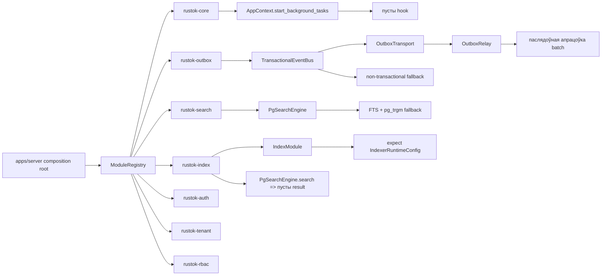
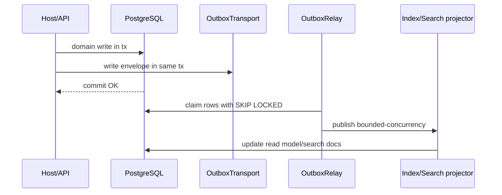

# Аўдыт ядра і core-модуляў RusTok для падрыхтоўкі да production release

## Executive summary

Я прааналізаваў зоны, якія сам рэпазіторый называе асновай platform composition: `rustok-core`, усе `Core modules` з `modules.toml` (`auth`, `cache`, `channel`, `email`, `index`, `search`, `outbox`, `tenant`, `rbac`), а таксама composition root у `apps/server/src/modules`, workspace/CI-файлы і частку цэнтральнай архітэктурнай дакументацыі. У дакументацыі RusTok пазіцыянуецца як modular monolith з composition root у `apps/server`, event-driven read side праз transactional outbox і асобнымі core-платформеннымі модулямі. У workspace сапраўды зафіксаваны гэтыя core-модулі, а registry у `apps/server` іх рэгіструе. citeturn27view0turn15view2turn15view1turn29view2

**Агульная ацэнка рызыкі: высокая.**  
**Рэкамендацыя: No-Go для production release у бягучым выглядзе.**  
Прычына не ў адной “фатальнай” памылцы, а ў спалучэнні некалькіх сістэмных праблем: небяспечны fallback у outbox-публікацыі па-за транзакцыяй, пусты kernel-hook для background tasks, вузкае месца і contention у outbox relay, недафармаванасць часткі core-path для index/search, слабыя guardrails у auth-конфігурацыі, а таксама відавочны dependency-governance debt, бо `deny.toml` ігнаруе некалькі RustSec advisory, у тым ліку 2026-ыя для `rustls-webpki`. Гэты набор праблем азначае, што нават пры паспяховым CI сістэма пакуль не выглядае дастаткова надзейнай для production-нагрузкі і інцыдэнтнага рэжыму. citeturn33view3turn36view2turn40view0turn22view0turn22view2turn31view2turn28view2turn38search1turn38search3turn38search4

Пазітыўны бок таксама ёсць: у рэпазітары ўжо ёсць сур’ёзны CI-контур — `fmt`, `clippy`, `cargo check`, manifest validation, `cargo audit`, `cargo deny`, doc build, `cargo udeps`, coverage, SBOM, nextest, reference artifacts. Гэта добры фундамент. Але на production-гатоўнасць зараз больш уплывае не адсутнасць tooling, а незавершанасць часткі runtime-крытычнай архітэктуры. citeturn28view0turn20view0

## Зоны сканавання і храналогія аналізу

Ніжэй — фактычны scope, які вынікае з `modules.toml`, Cargo workspace і архітэктурнай дакументацыі.

| Зона | Чаму ў scope | Доказ |
|---|---|---|
| `crates/rustok-core` | shared/kernel foundation: module contracts, context, health, metrics, security, cache abstractions | citeturn27view0turn35view0turn35view1turn35view2turn35view3 |
| `crates/rustok-auth` | core-module у `modules.toml` | citeturn15view2turn30view0 |
| `crates/rustok-cache` | core-module; цэнтральны cache backend factory | citeturn15view2turn21view0turn21view1 |
| `crates/rustok-channel` | core-module | citeturn15view2turn13view0turn26view0 |
| `crates/rustok-email` | core-module | citeturn15view2turn14view0turn21view2turn21view3 |
| `crates/rustok-index` | core-module; read-model substrate | citeturn15view2turn14view1turn22view0turn22view2 |
| `crates/rustok-search` | core-module; search engine contract і Postgres-first рэалізацыя | citeturn15view2turn14view4turn22view3turn40view2 |
| `crates/rustok-outbox` | core-module; transactional event persistence і relay | citeturn15view2turn24view0turn33view3turn40view0 |
| `crates/rustok-tenant` | core multi-tenancy | citeturn15view2turn17view0turn18view0turn25view0turn25view1 |
| `crates/rustok-rbac` | core authorization runtime | citeturn15view2turn12view4turn14view3turn25view2 |
| `apps/server/src/modules/*` | composition root і manifest/runtime contract | citeturn27view0turn29view0turn29view2turn32view3 |
| `.github/workflows`, `deny.toml` | production hardening, supply-chain, quality gates | citeturn20view0turn28view0turn28view1turn28view2 |

Храналогія праведзенага аналізу была такой: спачатку я вызначыў фактычныя core-межы па `modules.toml` і Cargo workspace; потым праверыў composition root і kernel contracts; далей — найбольш рызыкоўныя production-paths (`outbox`, `search`, `auth`, `email`, `cache`); пасля гэтага — CI/CD, dependency governance і агульную архітэктурную сумяшчальнасць кода з уласнай дакументацыяй праекта. citeturn15view2turn15view1turn27view0turn29view2turn28view0turn28view2

Усе неўказаныя карыстальнікам параметры я разглядаў як дапушчэнні: мэтавае асяроддзе не зададзена, SLO/SLA не зададзены, але па коду і дакументацыі я дапускаў production на PostgreSQL, апцыянальны Redis, multi-tenant deployment і патрэбу ў event-driven consistency паміж write-side і read/search-side. Гэта дапушчэнне адпавядае дакументацыі platform flow. citeturn27view0turn17view0

## Прыярытэтныя знаходкі

### Крытычныя і high severity

| Severity | Праблема | Лакацыя | Як выяўлена | Прапанова | Ацэнка намаганняў |
|---|---|---|---|---|---|
| Critical | **TransactionalEventBus можа ўпасці ў non-transactional publish**, калі transport не `OutboxTransport`; код сам папярэджвае, што “Event may be lost if transaction fails” | `crates/rustok-outbox/src/transactional.rs` | Code review | Забараніць fallback у production: зрабіць `publish_in_tx*` failure-fast, калі transport не transactional; укараніць тыпавы contract `TransactionalTransport`; дадаць integration test на rollback | M |
| High | **Outbox relay апрацоўвае batch паслядоўна** і выкарыстоўвае claim-схему без відавочнага row-locking/`SKIP LOCKED`; гэта створыць contention і абмяжуе throughput | `crates/rustok-outbox/src/relay.rs` | Code review | Перайсці на `SELECT ... FOR UPDATE SKIP LOCKED`, укараніць bounded concurrency на dispatch, cancellation token, heartbeat/reclaim механізм | M–L |
| High | **Kernel hook для background tasks пусты**: `pub fn start_background_tasks(&self) {}`. Для platform, якая дакументуе event-driven flow, гэта азначае пусты або нецэнтралізаваны запуск крытычных рантайм-працэсаў | `crates/rustok-core/src/context.rs` | Code review + architecture mismatch | Перанесці запуск relay/indexing/subscriptions у выразны orchestrator з lifecycle management, shutdown, health/readiness і retries | M |
| High | **Index module выглядае часткова незавершаным**: пры рэгістрацыі listener-аў ён жорстка чакае `IndexerRuntimeConfig` праз `.expect(...)`, а `PgSearchEngine::search` у `rustok-index` пакуль вяртае `SearchResult::default()` | `crates/rustok-index/src/lib.rs`, `crates/rustok-index/src/pg_engine.rs` | Code review | Або завяршыць модуль да рабочага стану, або выдалiць/знізіць яго runtime role; замяніць `.expect` на validated bootstrap error | M |
| High | **Auth config validation занадта слабая**: правяраюцца толькі ключы для `RS256`, але не мінімальная энтрапія `HS256` secret, не пустыя `issuer/audience`, не TTL bounds | `crates/rustok-auth/src/config.rs` | Code review | Дадаць строгую validation policy: secret length/entropy, non-empty issuer/audience, lower/upper bounds expire, production policy для RS256 preferred | S–M |
| High | **Dependency-governance debt**: `deny.toml` ігнаруе `RUSTSEC-2026-0098`, `0099`, `0104` і `RUSTSEC-2023-0071`; першыя тры — advisories для `rustls-webpki`, уключна з DoS panic у CRL parsing | `deny.toml` | Config review + RustSec cross-check | Для production release не пакідаць ignore без formal exception record, tree proof і compensating controls; абнавіць transitive deps або дакументаваць risk acceptance | S–M |

Гэты блок — галоўны чыннік для **No-Go**. Асабліва небяспечны першы пункт: пры transaction rollback міжмодульная падзея можа быць ужо апублікаваная, або наадварот згубленая, калі чакаецца transactional semantics. Гэта падрывае core-абяцанне платформы наконт outbox-driven consistency. У самым кодзе ёсць прамы warning пра магчымую страту падзеі, а архітэктурная дакументацыя якраз апісвае transactional outbox як штатны event flow. citeturn33view3turn27view0

Другі high-risk блок — relay. `process_pending_once()` апрацоўвае кожную падзею ў `for`-цыкле паслядоўна, а claim-батч выбіраецца з pending-радкоў без відавочнага механізму `SKIP LOCKED`; пры росту колькасці воркераў гэта часта дае не столькі correctness bug, колькі production bottleneck, lock contention і непрадказальную латэнтнасць. Для outbox у production гэта сур’ёзны scalability-risk. citeturn40view0turn40view1

Трэці high-risk блок — kernel orchestration. `AppContext` інкапсулюе `db`, `events`, `cache`, `search`, але метод `start_background_tasks()` пусты. Для платформы, якая дэкларуе event-driven read-model update, гэта выглядае як недабудаваны lifecycle boundary: background workers павінны або запускацца тут, або быць выразна вынесены ў асобны production runtime. У бягучым выглядзе адказнасць размытая. citeturn36view2turn27view0

### Medium severity і structural debt

| Severity | Праблема | Лакацыя | Як выяўлена | Прапанова | Ацэнка намаганняў |
|---|---|---|---|---|---|
| Medium | **Search API заціснута да `limit <= 50` і жорстка патрабуе `tenant_id`**, пры гэтым модуль дэкларуецца як core search capability; гэта прыкмета цеснай прывязкі да preview/admin use case, а не да агульнага search contract | `crates/rustok-search/src/pg_engine.rs` | Code review | Развесці preview endpoint і core engine contract; `limit` і pagination policy вынесці ў settings/config; дадаць асобны tenant-less internal/admin mode толькі пры выразным policy | S–M |
| Medium | **EmailService у рэжыме `Disabled` ціха прапускае адпраўку**, што небяспечна для prod-інцыдэнтаў; акрамя таго URL reset будуецца простай канкатэнацыяй token у query string | `crates/rustok-email/src/service.rs` | Code review | Для production зрабіць disabled-email hard error або explicit feature flag; token URL будаваць праз URI builder/percent-encoding | S |
| Medium | **Runtime registry збіраецца codified-спосабам у `apps/server`, але жорсткая рэгістрацыя core module-аў і optional codegen робяць layer даволі шчыльна звязаным з host** | `apps/server/src/modules/mod.rs` | Architecture review | Паступова перанесці bootstrap validation у асобны ядро-пакет або build-time manifest compiler з меншай host-coupling | M |
| Medium | **Адсутнічае дастаткова выразная central readiness-/health-мадэль для search/index/outbox background path**; частка модулей вяртае `HealthStatus::Healthy` амаль без рэальнай праверкі | `rustok-search`, `rustok-outbox`, `rustok-tenant`, `rustok-rbac`, `rustok-index` | Code review | Увесці рэальную dependency-aware readiness: DB schema, queue lag, subscriber attached, runtime extensions present, search backend ready | M |
| Medium | **Ліцэнзійны рызык для камерцыйнага production rollout**: workspace пазначаны як `BUSL-1.1` | `Cargo.toml` | Manifest review | Юрыдычны review перад external production release; праверыць сумяшчальнасць з customer distribution model | S |

Пошукавы модуль сам па сабе выглядае тэхнічна перспектыўным — ёсць PostgreSQL FTS, `websearch_to_tsquery`, typo fallback на `pg_trgm`, facet aggregation. Але production-рызык тут у тым, што код ужо выконвае патэнцыйна дарагія аперацыі (`ts_headline`, ranking, trigram fallback), а па правераным мной фрагменце не ўдалося пацвердзіць адпаведныя індэксы/мiграцыі для ўсіх шляхоў. PostgreSQL у афіцыйнай дакументацыі прама рэкамендуе адпаведную індэксацыю для text search і `pg_trgm` similarity search. Таму гэта не “баг у кодзе”, а **высокаверагодны performance hotspot без поўнага evidence аб indexing-plan**. citeturn40view2turn39search0turn39search1

Email-path таксама патрабуе hardening. Ціхі `Disabled` у core email service дапушчальны для dev/test, але для production гэта часцей прыводзіць да незаўважанага зрыву reset/invite flows. А `password_reset_url()` будуе URL простай падстаноўкай token у query string, без выразнай encoding-палітыкі. citeturn21view3

## Архітэктурная карціна праблемных месцаў

Схема ніжэй паказвае, дзе зараз найбольш небяспечныя production-стыкі.



Гэтая схема добра суадносіцца з уласнай архітэктурнай дакументацыяй RusTok: у тэорыі host павінен быць толькі composition root, а cross-module consistency павінна ісці праз transactional outbox. На практыцы ж main production risks знаходзяцца менавіта на boundary паміж composition root, kernel lifecycle і outbox/read-model path. citeturn27view0turn29view2turn33view3turn40view0turn22view0turn22view2turn36view2

Найбольш load-bearing фрагмент праблемы можна паказаць вельмі коратка:

```rust
self.transport.publish(envelope).await?;
```

Гэты выклік адбываецца ў fallback-галінцы `publish_in_tx_with_envelope_id(...)`, калі transport не падтрымлівае transactional write. Менавіта тут system semantics могуць разысціся з чаканай “write + event atomically”. citeturn33view3

Іншы сімптаматычны фрагмент kernel:

```rust
pub fn start_background_tasks(&self) {}
```

Для production platform kernel гэта занадта пусты lifecycle boundary. citeturn36view2

Яшчэ адна схема — як павінна выглядаць выпраўленая event-плынь.



У цяперашнім кодзе слабое звяно — не сама ідэя, а дысцыпліна выканання гэтага contract у runtime. citeturn27view0turn33view3turn40view0

## Матрыца рызыкаў і прыярытэт remediation

### Матрыца ўплыву

| Рызык | Бяспека | Даступнасць | Карэктнасць даных | Масштабавальнасць | Вынік |
|---|---:|---:|---:|---:|---|
| Outbox fallback па-за tx | Medium | Medium | **Very High** | Medium | Блакуючы |
| Relay без concurrency / lock-aware claim | Low | High | Medium | **Very High** | Блакуючы |
| Пусты kernel background hook | Medium | High | High | High | Блакуючы |
| Index module incomplete path | Medium | Medium | High | Medium | Блакуючы |
| Auth weak config validation | **High** | Medium | Medium | Low | Блакуючы |
| Ignored RustSec advisories | **High** | High | Medium | Low | Блакуючы да triage |
| Email silent disable | Medium | Medium | Medium | Low | Няблакуючы, але трэба fix да GA |
| Search contract coupling / hard clamp | Low | Medium | Low | Medium | Можна пасля critical wave |

### Рэкамендаваны парадак работ

| Хваля | Што зрабіць | Мэтавы вынік |
|---|---|---|
| Хваля стабілізацыі | забараніць non-transactional fallback; укараніць transactional-only contract | event consistency без “магчыма страта падзеі” |
| Хваля runtime-hardening | падняць relay да lock-aware + bounded concurrency; дадаць graceful shutdown | predictability пад нагрузкай |
| Хваля kernel-assembly | рэалізаваць background task orchestrator у kernel або асобным runtime manager | выразны lifecycle |
| Хваля search/index | закрыць incomplete `index` path; аддзяліць preview/search contracts; пацвердзіць indexes | працоўны read/search core |
| Хваля security-governance | разабраць ignored advisories; узмацніць auth config validation | supply-chain і config safety |
| Хваля operability | unified readiness/lag/cache/search metrics + tracing | production diagnosability |

## Што ўжо добра і што яшчэ не дацягвае да production readiness

Рэпазіторый ужо мае моцны engineering baseline. CI запускае агульны стыль, lint, compile, security tools, coverage, SBOM і reference artifact export. Гэта азначае, што каманда ўжо пабудавала добры quality gate на ўзроўні pull request і main branch. citeturn28view0turn28view1

Але production readiness — гэта не толькі “усё збіраецца”. Уласная архітэктура RusTok абяцае modular composition, tenant isolation і event-driven consistency. Таму перад release трэба дасягнуць адпаведнасці менавіта гэтым уласцівасцям:  
падзеі павінны быць transactionally durable, background workers — predictably managed, health/readiness — паказваць рэальны стан, а core-module contracts — быць завершанымі, а не напалову preview-oriented. citeturn27view0turn17view0turn15view3

### Checklist production readiness

| Статус | Праверка |
|---|---|
| ⛔ | `TransactionalEventBus::publish_in_tx*` не мае non-transactional fallback у production |
| ⛔ | Outbox relay выкарыстоўвае row-level claim policy (`SKIP LOCKED` ці эквівалент) |
| ⛔ | Relay мае bounded concurrency, cancellation і reclaim stale claims |
| ⛔ | `AppContext` або асобны runtime manager запускае background tasks выразна і тэставана |
| ⛔ | `rustok-index` або завершаны, або выключаны з core runtime path |
| ⛔ | Search/index migrations пацверджаны на патрэбныя FTS/`pg_trgm` індэксы |
| ⛔ | Auth config validation правярае secret strength, issuer/audience, TTL bounds |
| ⛔ | RustSec ignore list абгрунтаваны і мінімізаваны |
| ⚠️ | Email disabled mode забаронены або жорстка заўважны ў prod |
| ⚠️ | Readiness checks улічваюць DB, outbox lag, search backend, subscriber attach state |
| ⚠️ | Ёсць end-to-end tests на rollback, duplicate suppression, relay retry/DLQ, cache invalidation |
| ✅ | Базавы CI/CD, audit, deny, coverage, SBOM ужо існуюць |

## Адкрытыя пытанні і абмежаванні

Гэты аўдыт — **статычны** і заснаваны на даступных файлах рэпазіторыя і звязанай дакументацыі; я не запускаў сістэму пад нагрузкай і не валідаваў фактычныя latency/SLA. Таму performance-высновы для search і relay — гэта архітэктурна-кодавыя высновы, а не вынікі benchmark. citeturn40view0turn40view2turn39search0turn39search1

Я таксама не пацвердзіў усе migration-файлы і ўсе SQL-індэксы для search/index-path; таму там, дзе я кажу пра hotspot, гэта трэба чытаць як **“высокі рызык / патрэбна дадатковая праверка”**, а не як даказаны missing-index bug. Аналогічна, я не бачыў production deployment manifest-аў Kubernetes/Helm, таму deployment/degradation-рэжым ацэньваў паводле кода і CI. citeturn14view1turn14view4turn28view0

Калі сцісла: **RusTok ужо мае добрую інжынерную аснову, але ядро і core runtime пакуль не гатовыя да бяспечнага production release без хвалi architectural hardening.** Найперш трэба закрыць outbox semantics, relay throughput model, kernel lifecycle orchestration і dependency/security triage. Пасля гэтага platform ужо будзе выглядаць як кандыдат на controlled production rollout, але не раней. citeturn33view3turn40view0turn36view2turn28view2turn38search1turn38search3turn38search4